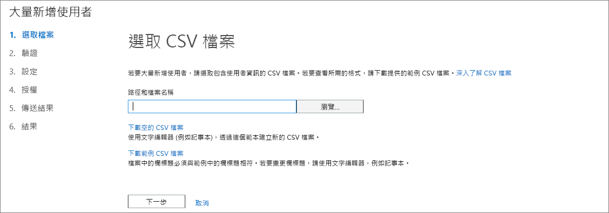
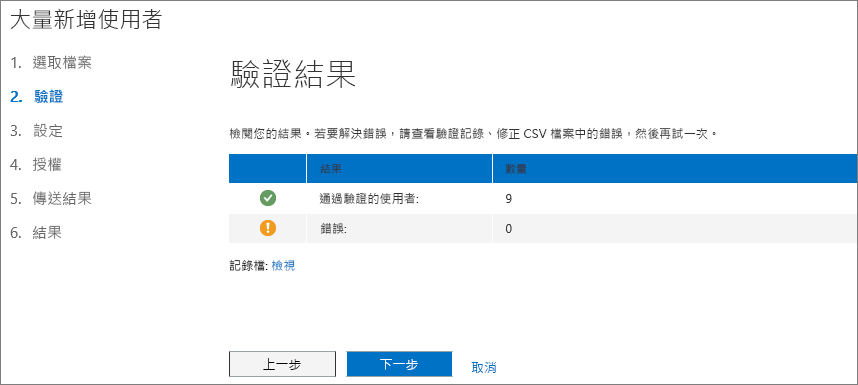
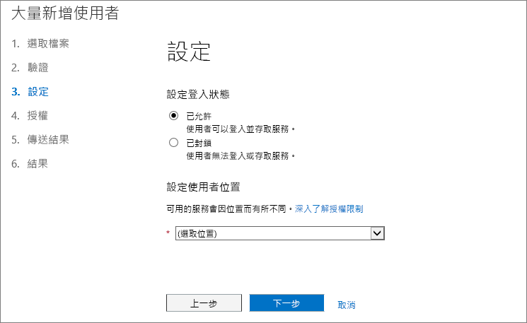
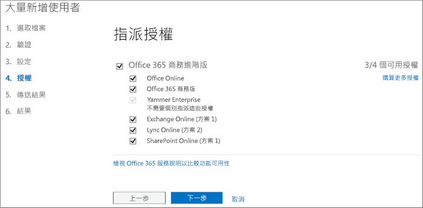
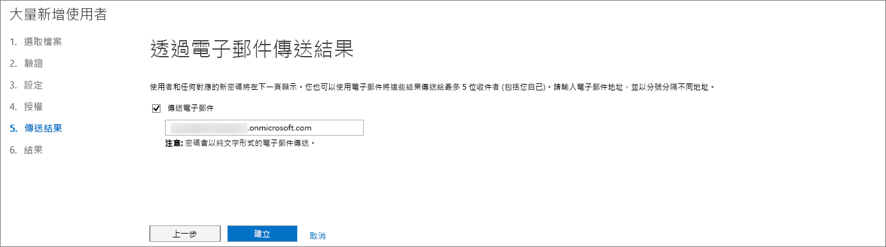
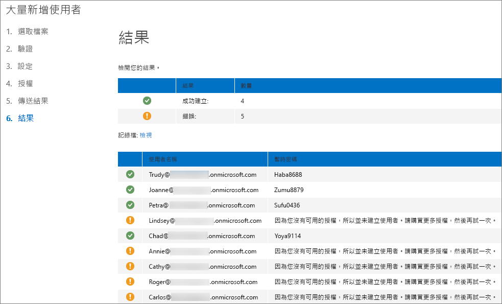

# <a name="add-several-users-at-the-same-time-to-office-365---admin-help"></a><span data-ttu-id="770f4-105">同時將多位使用者新增至 Office 365 - 系統管理說明</span><span class="sxs-lookup"><span data-stu-id="770f4-105">Add several users at the same time to Office 365 - Admin Help</span></span>

<span data-ttu-id="770f4-p102">在您的小組每位人員需要的使用者帳戶之前他們可以登入及存取 Office 365 服務，例如電子郵件和 Office。如果您有許多的人員，您可以從 Excel 試算表或其他檔案會以 CSV 格式儲存一次新增其帳戶。[不確定哪些 CSV 格式是？](add-several-users-at-the-same-time.md#__toc316652088)</span><span class="sxs-lookup"><span data-stu-id="770f4-p102">Each person on your team needs a user account before they can sign in and access Office 365 services, such as email and Office. If you have a lot of people, you can add their accounts all at once from an Excel spreadsheet or other file saved in CSV format. [Not sure what CSV format is?](add-several-users-at-the-same-time.md#__toc316652088)</span></span>
  
## <a name="add-multiple-users-to-office-365-in-the-office-365-admin-center"></a><span data-ttu-id="770f4-109">將多個使用者新增至 Office 365 系統管理中心中的 Office 365</span><span class="sxs-lookup"><span data-stu-id="770f4-109">Add multiple users to Office 365 in the Office 365 admin center</span></span>

1. <span data-ttu-id="770f4-110">以您的工作或學校帳戶登入 Office 365。</span><span class="sxs-lookup"><span data-stu-id="770f4-110">Sign in to Office 365 with your work or school account.</span></span> 
    
2. <span data-ttu-id="770f4-111">在 Office 365 系統管理中心中，選擇 [**使用者** \> **作用中使用者**。</span><span class="sxs-lookup"><span data-stu-id="770f4-111">In the Office 365 admin center, choose **Users** \> **Active users**.</span></span>
    
    
  
3. <span data-ttu-id="770f4-113">在**多個**下拉式清單，選擇 [**匯入多個使用者**。</span><span class="sxs-lookup"><span data-stu-id="770f4-113">In the **More** drop-down, choose **Import multiple users**.</span></span>
    
4. <span data-ttu-id="770f4-114">在**多個使用者匯入**] 面板中，您可以選擇性地下載範例 CSV 檔案使用或不填入範例資料。</span><span class="sxs-lookup"><span data-stu-id="770f4-114">On the **Import multiple users** panel, you can optionally download a sample CSV file with or without sample data filled in.</span></span> 
    
    
  
    <span data-ttu-id="770f4-116">將包含**完全相同的欄名**為其中一個範例需要在試算表 (使用者名稱、 名字等。 主題)。如果您使用的範本，其文字編輯工具，開啟 [記事本]，並考慮離開列 1 中的所有資料來說，並只在列 2 與下方輸入資料。</span><span class="sxs-lookup"><span data-stu-id="770f4-116">Your spreadsheet needs to include the **exact same column headings** as the sample one (User Name, First Name, etc...). If you use the template, open it in a text editing tool, like Notepad, and consider leaving all the data in row 1 alone, and only entering data in rows 2 and below.</span></span> 
    
    <span data-ttu-id="770f4-117">試算表也必須包含使用者名稱 （例如 bob@contoso.com) 和每位使用者的顯示名稱 （例如 Bob Kelly) 值。</span><span class="sxs-lookup"><span data-stu-id="770f4-117">Your spreadsheet also needs to include values for the user name (like bob@contoso.com) and a display name (like Bob Kelly) for each user.</span></span> 
    
  ```
  User Name,First Name,Last Name,Display Name,Job Title,Department,Office Number,Office Phone,Mobile Phone,Fax,Address,City,State or Province,ZIP or Postal Code,Country or Region
  chris@contoso.com,Chris,Green,Chris Green,IT Manager,Information Technology,123451,123-555-1211,123-555-6641,123-555-9821,1 Microsoft way,Redmond,Wa,98052,United States
  ben@contoso.com,Ben,Andrews,Ben Andrews,IT Manager,Information Technology,123452,123-555-1212,123-555-6642,123-555-9822,1 Microsoft way,Redmond,Wa,98052,United States
  david@contoso.com,David,Longmuir,David Longmuir,IT Manager,Information Technology,123453,123-555-1213,123-555-6643,123-555-9823,1 Microsoft way,Redmond,Wa,98052,United States
  cynthia@contoso.com,Cynthia,Carey,Cynthia Carey,IT Manager,Information Technology,123454,123-555-1214,123-555-6644,123-555-9824,1 Microsoft way,Redmond,Wa,98052,United States
  melissa@contoso.com,Melissa,MacBeth,Melissa MacBeth,IT Manager,Information Technology,123455,123-555-1215,123-555-6645,123-555-9825,1 Microsoft way,Redmond,Wa,98052,United States
  
  ```

5. <span data-ttu-id="770f4-118">在 [] 方塊中輸入的檔案路徑或選擇 [**瀏覽**至瀏覽至 CSV 檔案的位置，然後選擇 [**確認**。</span><span class="sxs-lookup"><span data-stu-id="770f4-118">Enter a file path into the box, or choose **Browse** to browse to the CSV file location, then choose **Verify**.</span></span>
    
    
  
    <span data-ttu-id="770f4-p103">如果沒有檔案的問題，問題會顯示在面板。您也可以下載的記錄檔。</span><span class="sxs-lookup"><span data-stu-id="770f4-p103">If there are problems with the file, the problem is displayed in the panel. You can also download a log file.</span></span>
    
6. <span data-ttu-id="770f4-122">在 [**設定使用者選項**] 對話方塊可以設定登入狀態並選擇將指派給所有使用者的產品授權。</span><span class="sxs-lookup"><span data-stu-id="770f4-122">On the **Set user options** dialog you can set the sign-in status and choose the product license that will be assigned to all users.</span></span> 
    
7. <span data-ttu-id="770f4-123">在**檢視您的結果**] 對話方塊中您可以選擇將結果傳送給您自己或其他使用者 （密碼會以純文字），且可以檢視建立多少使用者，如果您需要購買更多授權指派給新使用者的部分。</span><span class="sxs-lookup"><span data-stu-id="770f4-123">On the **View your result** dialog you can choose to send the results to either yourself or other users (passwords will be in plain text) and you can see how many users were created, and if you need to purchase more licenses to assign to some of the new users.</span></span> 
    
## <a name="watch-the-video"></a><span data-ttu-id="770f4-124">觀賞影片</span><span class="sxs-lookup"><span data-stu-id="770f4-124">Watch the video</span></span>
<span data-ttu-id="770f4-125"><a name="bk_preview"> </a></span><span class="sxs-lookup"><span data-stu-id="770f4-125"></span></span>

 <span data-ttu-id="770f4-126">觀賞一小段影片示範如何大量新增使用者。</span><span class="sxs-lookup"><span data-stu-id="770f4-126">Watch a short video that shows you how to bulk add users.</span></span> 
  
> [!VIDEO https://www.microsoft.com/videoplayer/embed/f4e7f161-8ae6-4264-a429-9297b539a8de?autoplay=false]
  
## <a name="next-steps"></a><span data-ttu-id="770f4-127">後續步驟</span><span class="sxs-lookup"><span data-stu-id="770f4-127">Next steps</span></span>
<span data-ttu-id="770f4-128"><a name="bk_preview"> </a></span><span class="sxs-lookup"><span data-stu-id="770f4-128"></span></span>

- <span data-ttu-id="770f4-p104">現在，這些人員具有帳戶，其需要[下載並安裝或重新安裝 Office 365 或 Office 2016 PC 或 Mac 上](https://support.office.com/article/4414eaaf-0478-48be-9c42-23adc4716658)。在您的小組每個人都可以安裝最多 5 個 Pc 或 Mac 上的 Office 365。</span><span class="sxs-lookup"><span data-stu-id="770f4-p104">Now that these people have accounts, they need to [Download and install or reinstall Office 365 or Office 2016 on a PC or Mac](https://support.office.com/article/4414eaaf-0478-48be-9c42-23adc4716658). Each person on your team can install Office 365 on up to 5 PCs or Macs.</span></span> 
    
- <span data-ttu-id="770f4-p105">每位人員也可以[設定 Office 應用程式和行動裝置上的電子郵件](https://support.office.com/article/7dabb6cb-0046-40b6-81fe-767e0b1f014f)最多 5 平板電腦與 5 的電話，例如 Iphone、 Ipad、 及 Android 電話與平板電腦上。如此一來他們可以編輯 Office 檔案從任何地方。</span><span class="sxs-lookup"><span data-stu-id="770f4-p105">Each person can also [Set up Office apps and email on a mobile device](https://support.office.com/article/7dabb6cb-0046-40b6-81fe-767e0b1f014f) on up to 5 tablets and 5 phones, such as iPhones, iPads, and Android phones and tablets. This way they can edit Office files from anywhere.</span></span> 
    
    <span data-ttu-id="770f4-133">請參閱[設定適用於企業的 Office 365](https://support.office.com/article/6a3a29a0-e616-4713-99d1-15eda62d04fa)的端對端清單中的設定步驟。</span><span class="sxs-lookup"><span data-stu-id="770f4-133">See [Set up Office 365 for business](https://support.office.com/article/6a3a29a0-e616-4713-99d1-15eda62d04fa) for an end-to-end list of the setup steps.</span></span> 
    
## <a name="more-information-about-how-to-add-users-to-office-365"></a><span data-ttu-id="770f4-134">如何將使用者新增至 Office 365 的詳細資訊</span><span class="sxs-lookup"><span data-stu-id="770f4-134">More information about how to add users to Office 365</span></span>
<span data-ttu-id="770f4-135"><a name="bk_preview"> </a></span><span class="sxs-lookup"><span data-stu-id="770f4-135"></span></span>

### <a name="not-sure-what-csv-format-is"></a><span data-ttu-id="770f4-136">不確定哪些 CSV 格式是？</span><span class="sxs-lookup"><span data-stu-id="770f4-136">Not sure what CSV format is?</span></span>
<span data-ttu-id="770f4-137"><a name="__toc316652088"> </a></span><span class="sxs-lookup"><span data-stu-id="770f4-137"></span></span>

<span data-ttu-id="770f4-p106">CSV 檔案是以逗號分隔值的檔案。您可以建立或編輯的任何文字編輯器或試算表的程式，例如 Excel 檔案類似。</span><span class="sxs-lookup"><span data-stu-id="770f4-p106">A CSV file is a file with comma separated values. You can create or edit a file like this with any text editor or spreadsheet program, such as Excel.</span></span>
  
<span data-ttu-id="770f4-p107">您可以下載[此範例試算表](https://www.microsoft.com/en-us/download/details.aspx?id=45485)當做起點。請記得 Office 365 需要的第一列的欄名所以不要它們取代為其他人的某個項目。</span><span class="sxs-lookup"><span data-stu-id="770f4-p107">You can download [this sample spreadsheet](https://www.microsoft.com/en-us/download/details.aspx?id=45485) as a starting point. Remember that Office 365 requires column headings in the first row so don't replace them with something else.</span></span> 
  
<span data-ttu-id="770f4-142">以新名稱儲存檔案並指定 CSV 格式。</span><span class="sxs-lookup"><span data-stu-id="770f4-142">Save the file with a new name, and specify CSV format.</span></span>
  

  
<span data-ttu-id="770f4-p108">當您儲存檔案時，您可能將取得提示如果您將檔案另存 CSV 格式活頁簿中的某些功能將會遺失。這是沒問題。按一下 [**是]** 繼續。</span><span class="sxs-lookup"><span data-stu-id="770f4-p108">When you save the file, you'll probably get a prompt that some features in your workbook will be lost if you save the file in CSV format. This is okay. Click **Yes** to continue.</span></span> 
  

  
### <a name="tips-for-formatting-your-spreadsheet"></a><span data-ttu-id="770f4-148">格式化試算表的秘訣</span><span class="sxs-lookup"><span data-stu-id="770f4-148">Tips for formatting your spreadsheet</span></span>
<span data-ttu-id="770f4-149"><a name="__toc314595848"> </a></span><span class="sxs-lookup"><span data-stu-id="770f4-149"></span></span>

- <span data-ttu-id="770f4-p109">**我需要如範例試算表所示的相同資料行標題吗？**[是]。範例試算表包含的第一列的欄名。這些標題是必要的。每個使用者想要新增至 Office 365、 建立標題下的資料列。如果您新增、 變更或刪除任何欄標題，Office 365 可能無法建立使用者從檔案中的資訊。</span><span class="sxs-lookup"><span data-stu-id="770f4-p109">**Do I need the same column headings as in the sample spreadsheet?** Yes. The sample spreadsheet contains column headings in the first row. These headings are required. For each user you want to add to Office 365, create a row under the heading. If you add, change, or delete any of the column headings, Office 365 might not be able to create users from the information in the file.</span></span> 
    
- <span data-ttu-id="770f4-p110">**我沒有怎麼辦所需的每位使用者的所有資訊吗？** 使用者名稱和顯示名稱是需要與您不能新增新使用者沒有此資訊。如果您不需要的其他資訊，例如傳真一些您可以使用以指出欄位應該保留空白的空間，外加逗點。</span><span class="sxs-lookup"><span data-stu-id="770f4-p110">**What if I don't have all the information required for each user?** The user name and display name are required, and you cannot add a new user without this information. If you don't have some of the other information, such as the fax, you can use a space plus a comma to indicate that the field should remain blank.</span></span> 
    
- <span data-ttu-id="770f4-p111">* * 如何小型或大型試算表可以？* * 試算表必須至少兩個資料列。一個是欄標題 （使用者資料欄標籤） 另一個使用者。您不能有多個 251 資料列。如果您要匯入超過 250 位使用者，您可以建立一個以上的試算表。</span><span class="sxs-lookup"><span data-stu-id="770f4-p111">** How small or large can the spreadsheet be? ** The spreadsheet must have at least two rows. One is for the column headings (the user data column label) and one for the user. You cannot have more than 251 rows. If you need to import more than 250 users, you can create more than one spreadsheet.</span></span> 
    
- <span data-ttu-id="770f4-p112">* * 可以使用哪些語言？* * 當您建立試算表，您可以輸入使用者的資料欄標籤中的任何語言或字元，但您不能變更標籤的順序如下範例所示。您可以進行到欄位的項目使用任何語言或字元為單位然後 Unicode 或 utf-8 格式儲存檔案。</span><span class="sxs-lookup"><span data-stu-id="770f4-p112">** What languages can I use? ** When you create your spreadsheet, you can enter user data column labels in any language or characters, but you must not change the order of the labels, as shown in the sample. You can then make entries into the fields, using any language or characters, and save your file in a Unicode or UTF-8 format.</span></span> 
    
- <span data-ttu-id="770f4-p113">**怎麼辦我正在新增從不同的國家或地區的使用者吗？** 建立每個區域中的個別試算表。您需要逐一檢視大量新增使用者精靈] 的每個試算表授與所有使用者檔案中包含您要使用的單一位置。</span><span class="sxs-lookup"><span data-stu-id="770f4-p113">**What if I'm adding users from different countries or regions?** Create a separate spreadsheet for each area. You'll need to step through the Bulk add users wizard which each spreadsheet, giving a single location of all users included in the file that you're working with.</span></span> 
    
- <span data-ttu-id="770f4-p114">**是否有我可以使用的字元數限制吗？** 下表顯示範例試算表中的各項的使用者資料欄標籤和最大字元長度。</span><span class="sxs-lookup"><span data-stu-id="770f4-p114">**Is there a limit to the number of characters I can use?** The following table shows the user data column labels and the maximum character length for each in the sample spreadsheet.</span></span> 
    
|<span data-ttu-id="770f4-172">**使用者資料欄標籤**</span><span class="sxs-lookup"><span data-stu-id="770f4-172">**User data column label**</span></span>|<span data-ttu-id="770f4-173">**最大字元長度**</span><span class="sxs-lookup"><span data-stu-id="770f4-173">**Maximum character length**</span></span>|
|:-----|:-----|
|<span data-ttu-id="770f4-174">使用者名稱 （必要）</span><span class="sxs-lookup"><span data-stu-id="770f4-174">User Name (Required)</span></span>  <br/> |<span data-ttu-id="770f4-p115">79 包括 at 符號 (@)，在格式 name@domain。\<副檔名\>。使用者的別名不能超過 30 個字元，而且網域名稱不能超過 48 個字元。</span><span class="sxs-lookup"><span data-stu-id="770f4-p115">79 including the at sign (@), in the format name@domain.\<extension\>. The user's alias cannot exceed 30 characters, and the domain name cannot exceed 48 characters.</span></span>  <br/> |
|<span data-ttu-id="770f4-177">名字</span><span class="sxs-lookup"><span data-stu-id="770f4-177">First Name</span></span>  <br/> |<span data-ttu-id="770f4-178">64</span><span class="sxs-lookup"><span data-stu-id="770f4-178">64</span></span>  <br/> |
|<span data-ttu-id="770f4-179">姓氏</span><span class="sxs-lookup"><span data-stu-id="770f4-179">Last Name</span></span>  <br/> |<span data-ttu-id="770f4-180">64</span><span class="sxs-lookup"><span data-stu-id="770f4-180">64</span></span>  <br/> |
|<span data-ttu-id="770f4-181">顯示名稱 （必要）</span><span class="sxs-lookup"><span data-stu-id="770f4-181">Display Name (required)</span></span>  <br/> |<span data-ttu-id="770f4-182">256</span><span class="sxs-lookup"><span data-stu-id="770f4-182">256</span></span>  <br/> |
|<span data-ttu-id="770f4-183">職稱</span><span class="sxs-lookup"><span data-stu-id="770f4-183">Job Title</span></span>  <br/> |<span data-ttu-id="770f4-184">64</span><span class="sxs-lookup"><span data-stu-id="770f4-184">64</span></span>  <br/> |
|<span data-ttu-id="770f4-185">部門</span><span class="sxs-lookup"><span data-stu-id="770f4-185">Department</span></span>  <br/> |<span data-ttu-id="770f4-186">64</span><span class="sxs-lookup"><span data-stu-id="770f4-186">64</span></span>  <br/> |
|<span data-ttu-id="770f4-187">辦公室號碼</span><span class="sxs-lookup"><span data-stu-id="770f4-187">Office Number</span></span>  <br/> |<span data-ttu-id="770f4-188">128</span><span class="sxs-lookup"><span data-stu-id="770f4-188">128</span></span>  <br/> |
|<span data-ttu-id="770f4-189">辦公室電話</span><span class="sxs-lookup"><span data-stu-id="770f4-189">Office Phone</span></span>  <br/> |<span data-ttu-id="770f4-190">64</span><span class="sxs-lookup"><span data-stu-id="770f4-190">64</span></span>  <br/> |
|<span data-ttu-id="770f4-191">行動電話</span><span class="sxs-lookup"><span data-stu-id="770f4-191">Mobile Phone</span></span>  <br/> |<span data-ttu-id="770f4-192">64</span><span class="sxs-lookup"><span data-stu-id="770f4-192">64</span></span>  <br/> |
|<span data-ttu-id="770f4-193">Fax</span><span class="sxs-lookup"><span data-stu-id="770f4-193">Fax</span></span>  <br/> |<span data-ttu-id="770f4-194">64</span><span class="sxs-lookup"><span data-stu-id="770f4-194">64</span></span>  <br/> |
|<span data-ttu-id="770f4-195">地址</span><span class="sxs-lookup"><span data-stu-id="770f4-195">Address</span></span>  <br/> |<span data-ttu-id="770f4-196">1023</span><span class="sxs-lookup"><span data-stu-id="770f4-196">1023</span></span>  <br/> |
|<span data-ttu-id="770f4-197">鄉/鎮/市/區</span><span class="sxs-lookup"><span data-stu-id="770f4-197">City</span></span>  <br/> |<span data-ttu-id="770f4-198">128</span><span class="sxs-lookup"><span data-stu-id="770f4-198">128</span></span>  <br/> |
|<span data-ttu-id="770f4-199">州或省</span><span class="sxs-lookup"><span data-stu-id="770f4-199">State or Province</span></span>  <br/> |<span data-ttu-id="770f4-200">128</span><span class="sxs-lookup"><span data-stu-id="770f4-200">128</span></span>  <br/> |
|<span data-ttu-id="770f4-201">郵遞區號</span><span class="sxs-lookup"><span data-stu-id="770f4-201">ZIP or Postal Code</span></span>  <br/> |<span data-ttu-id="770f4-202">40</span><span class="sxs-lookup"><span data-stu-id="770f4-202">40</span></span>  <br/> |
|<span data-ttu-id="770f4-203">國家或地區</span><span class="sxs-lookup"><span data-stu-id="770f4-203">Country or Region</span></span>  <br/> |<span data-ttu-id="770f4-204">128</span><span class="sxs-lookup"><span data-stu-id="770f4-204">128</span></span>  <br/> |
   
### <a name="still-having-problems-when-adding-users-to-office-365"></a><span data-ttu-id="770f4-205">將使用者新增至 Office 365 時，仍然有問題嗎？</span><span class="sxs-lookup"><span data-stu-id="770f4-205">Still having problems when adding users to Office 365?</span></span>

- <span data-ttu-id="770f4-p116">**仔細檢查試算表已正確地格式化。** 檢查以確保其符合範例檔案中的標題的欄標題。請確定您正在追蹤字元長度的規則及每個欄位都以逗號分隔。</span><span class="sxs-lookup"><span data-stu-id="770f4-p116">**Double-check that the spreadsheet is formatted correctly.** Check the column headings to make sure they match the headings in the sample file. Make sure you're following the rules for character lengths and that each field is separated by a comma.</span></span> 
    
- <span data-ttu-id="770f4-p117">* * 如果您沒有立刻看到 Office 365 中的新使用者，請稍候幾分鐘。* * 可能需要一點的 [移至 Office 365 中的所有服務的變更。</span><span class="sxs-lookup"><span data-stu-id="770f4-p117">** If you don't see the new users in Office 365 right away, wait a few minutes. ** It can take a little while for changes to go across all the services in Office 365.</span></span> 
    
## <a name="add-multiple-users-to-office-365-in-the-old-office-365-admin-center"></a><span data-ttu-id="770f4-211">將多個使用者新增至 Office 365 中舊的 Office 365 系統管理中心</span><span class="sxs-lookup"><span data-stu-id="770f4-211">Add multiple users to Office 365 in the old Office 365 admin center</span></span>

1. <span data-ttu-id="770f4-212">下載[此範例試算表](https://www.microsoft.com/en-us/download/details.aspx?id=45485)並在 Excel 中開啟。</span><span class="sxs-lookup"><span data-stu-id="770f4-212">Download [this sample spreadsheet](https://www.microsoft.com/en-us/download/details.aspx?id=45485) and open it in Excel.</span></span> 
    
    <span data-ttu-id="770f4-213">將包含**完全相同的欄名**為其中一個範例需要在試算表 (使用者名稱、 名字等。 主題)。如果您使用的範本，請考慮離開列 1 中的所有資料來說，並只在列 2 與下方輸入資料。</span><span class="sxs-lookup"><span data-stu-id="770f4-213">Your spreadsheet needs to include the **exact same column headings** as the sample one (User Name, First Name, etc...). If you use the template, consider leaving all the data in row 1 alone, and only entering data in rows 2 and below.</span></span> 
    
    <span data-ttu-id="770f4-p118">試算表也必須包含使用者名稱 （例如 bob@contoso.com) 和每位使用者的顯示名稱 （例如 Bob Kelly) 值。若要將其他欄位空白、 空格加上逗點的欄位中輸入如下圖所示。</span><span class="sxs-lookup"><span data-stu-id="770f4-p118">Your spreadsheet also needs to include values for the user name (like bob@contoso.com) and a display name (like Bob Kelly) for each user. To leave other fields blank, enter a space plus a comma in the field as shown in the following figure.</span></span> 
    
    
  
    <span data-ttu-id="770f4-p119">如果您有使用不同的國家/地區的人員，您需要在每個國家/地區中建立一個試算表的使用者。例如，一個試算表列出在美國中運作的任何人與另一個列出日本中運作的任何人。這是因為 Office 365 服務的可用性會依地區而異。</span><span class="sxs-lookup"><span data-stu-id="770f4-p119">If you have people working in different countries, you'll need to create one spreadsheet for users in each country. For example, one spreadsheet that lists everyone who works in the US, and another that lists everyone who works in Japan. This is because the availability of Office 365 services varies by region.</span></span> 
    
    <span data-ttu-id="770f4-p120">**提示：** 您將許多使用者新增至 Office 365 之前，您可能要與範例試算表的作法。例如編輯資料的使用者是一些範例試算表、 說 5 或 10，並以新名稱儲存檔案。完成此程序所述的步驟執行、 檢查結果，然後刪除新帳戶並重新啟動一段。這種方式可以練習快速資料右邊的所有適用您的情況。也取出[格式化試算表的秘訣](add-several-users-at-the-same-time.md#__toc314595848)。</span><span class="sxs-lookup"><span data-stu-id="770f4-p120">**Tip:** Before you add many users to Office 365, you might want to practice with the sample spreadsheet. For example, edit the sample spreadsheet with data for a few of your users, say 5 or 10, and save the file with a new name. Run through steps described in this procedure, check the results, and then delete the new accounts and start over again. This way you can practice getting all of the data right for your situation. Also check out [Tips for formatting your spreadsheet](add-several-users-at-the-same-time.md#__toc314595848).</span></span>
    
2. <span data-ttu-id="770f4-225">以您的工作或學校帳戶登入 Office 365。</span><span class="sxs-lookup"><span data-stu-id="770f4-225">Sign in to Office 365 with your work or school account.</span></span> 
    
3. <span data-ttu-id="770f4-226">移至 Office 365 系統管理員中心。</span><span class="sxs-lookup"><span data-stu-id="770f4-226">Go to the Office 365 admin center.</span></span>
    
4. <span data-ttu-id="770f4-p121">使用 Office 365 服務的人員，他們必須被指派授權。才能繼續執行，您可能會想要檢查您的試算表中列出的每個人都有足夠的授權。選擇 [**計費**\>以查看是否有足夠的**訂閱**。如果您需要購買更多授權，請選擇 [* * 變更授權數量 * *。或者，您可以執行精靈並指派的授權，則稍後購買更多授權和重新執行精靈。</span><span class="sxs-lookup"><span data-stu-id="770f4-p121">For people to use Office 365 services, they need to be assigned a license. Before continuing, you might want to check that you have enough licenses for everyone listed in your spreadsheet. Choose **Billing** \> **Subscriptions** to see if you have enough. If you need to buy more licenses, choose ** Change license quantity **. Or, you can run the wizard and assign the licenses you have, then buy more licenses later and rerun the wizard.</span></span> 
    
5. <span data-ttu-id="770f4-p122">現在請移至大量新增使用者精靈]： 選擇 [**使用者** \> **作用中使用者**。選擇 [，如下圖所示。</span><span class="sxs-lookup"><span data-stu-id="770f4-p122">Now go to the Bulk add users wizard: choose **Users** \> **Active Users**. Choose  as shown in the following figure.</span></span> 
    
    ![Office 365 系統管理中心的 [使用者] 區段的映像](media/2cd5ff86-9c0b-438e-9bb9-13b12a2675de.png)
  
    <span data-ttu-id="770f4-235">大量新增的使用者精靈] 會出現並引導您完成新增至 Office 365 的使用者群組。</span><span class="sxs-lookup"><span data-stu-id="770f4-235">The Bulk add users wizard appears and steps you through adding a group of users to Office 365.</span></span> 
    
6. <span data-ttu-id="770f4-236">在步驟 1-選取 CSV 檔案中，指定您自己的試算表，如下圖所示。</span><span class="sxs-lookup"><span data-stu-id="770f4-236">In Step 1 - Select a CSV file, specify your own spreadsheet as shown in the following figure.</span></span>
    
    
  
7. <span data-ttu-id="770f4-238">在步驟 2-驗證，精靈會告訴您在試算表中的內容是否正確地格式化。</span><span class="sxs-lookup"><span data-stu-id="770f4-238">In Step 2 - Verification, the wizard tells you whether the content in the spreadsheet is formatted correctly.</span></span>
    
    
  
8. <span data-ttu-id="770f4-p123">步驟 3-設定] 中選擇**允許**使試算表中所列人員可以使用 Office 365。也選擇在其中這些人員將會使用 Office 365 的國家/地區。請記住是否貴組織中的有些人員會移至不同的國家或地區中使用 Office 365、 建立不同的試算表以其名稱和執行大量新增一次以將其新增使用者精靈]。</span><span class="sxs-lookup"><span data-stu-id="770f4-p123">In Step 3 - Settings, choose **Allowed** so that the people listed in your spreadsheet will be able to use Office 365. Also choose the country in which these people will use Office 365. Remember if some people in your organization are going to use Office 365 in a different country, create a separate spreadsheet with their names and run the Bulk add users wizard again to add them.</span></span> 
    
    
  
9. <span data-ttu-id="770f4-244">指派授權] 頁面上會告訴您多少授權可用。</span><span class="sxs-lookup"><span data-stu-id="770f4-244">The assign licenses page tells you how many licenses are available.</span></span> 
    
    
  
    <span data-ttu-id="770f4-p124">您可以選擇**購買更多授權**，但您要保留大量新增使用者精靈]，並移至 Office 365 系統管理中心的**帳單**。後購買更多授權、 需要等待處理中的順序的幾分鐘然後再開始大量新增使用者精靈] 從頭開始。</span><span class="sxs-lookup"><span data-stu-id="770f4-p124">You can choose **Buy more licenses**, but you'll leave the Bulk add users wizard and go to **Billing** in the Office 365 admin center. After buying more licenses, you'll have to wait a few minutes for the order to be processed and then start the Bulk add users wizard from the beginning.</span></span> 
    
    <span data-ttu-id="770f4-248">如果您未購買更多授權，將不會建立帳戶的試算表中所列的任何人。</span><span class="sxs-lookup"><span data-stu-id="770f4-248">If you don't buy more licenses, accounts won't be created for everyone listed in your spreadsheet.</span></span> 
    
    <span data-ttu-id="770f4-249">在這個範例中，我們不購買任何更多授權，並繼續執行大量新增使用者精靈]。</span><span class="sxs-lookup"><span data-stu-id="770f4-249">In this example, we don't buy any more licenses and continue with the Bulk add users wizard.</span></span>
    
10. <span data-ttu-id="770f4-250">在步驟 5-將結果傳送中，輸入您想要取得的人員在試算表中列出*所有*Office 365 使用者名稱和暫時密碼的電子郵件的人員的電子郵件地址。</span><span class="sxs-lookup"><span data-stu-id="770f4-250">In Step 5 - Send Results, type the email addresses of the people who you want to get an email that lists  *all*  of the Office 365 user names and temporary passwords for the people in the spreadsheet.</span></span> 
    
    
  
    <span data-ttu-id="770f4-p125">下列電子郵件傳送給所有在步驟 5-傳送結果中所指定的電子郵件地址。此電子郵件會指出所建立的帳戶。因為沒有足夠的授權有些人未建立帳戶的通知。</span><span class="sxs-lookup"><span data-stu-id="770f4-p125">The following email is sent to all the email addresses you specified in Step 5 - Send results. This email indicates which accounts were created. Notice that accounts weren't created for some people because there weren't enough licenses.</span></span> 
    
    
  
    <span data-ttu-id="770f4-p126">您可以購買更多授權稍後和重新執行大量新增使用者精靈] 以相同的試算表。精靈會跳過已帳戶 ； 將使用者容錯移轉它將結果報表上說出 [重複的使用者名稱] 以指出與該資訊已有帳戶的帳戶。</span><span class="sxs-lookup"><span data-stu-id="770f4-p126">You can buy more licenses later and rerun the Bulk add users wizard with the same spreadsheet. The wizard skips over the users that already have accounts; on the results report, it will say "duplicate user name" to indicate someone with that information already has an account.</span></span>
    
11. <span data-ttu-id="770f4-258">大量的最後一頁中新增使用者精靈] 清單的使用者名稱和暫時密碼，如下圖所示。</span><span class="sxs-lookup"><span data-stu-id="770f4-258">The final page in the Bulk add users wizard lists the user names and temporary passwords, as shown in the following figure.</span></span>
    
    
  
12. <span data-ttu-id="770f4-p127">您已將使用者新增至 Office 365 後，您需要告知他們的 Office 365 帳戶資訊。使用您的一般程序進行通訊的新密碼。</span><span class="sxs-lookup"><span data-stu-id="770f4-p127">After you've added users to Office 365, you need to tell them about their Office 365 account information. Use your normal process for communicating new passwords.</span></span>
    

