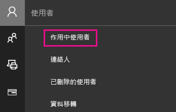
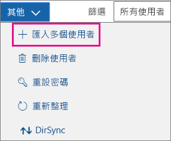
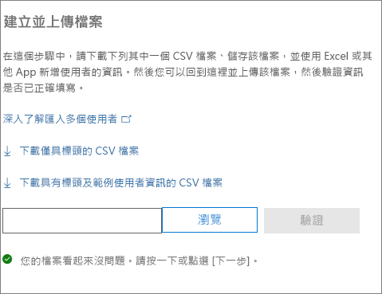
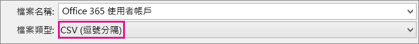
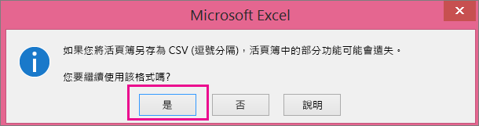
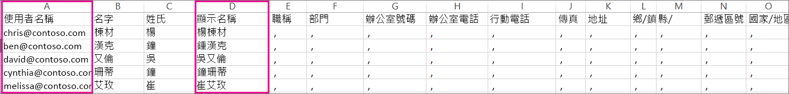
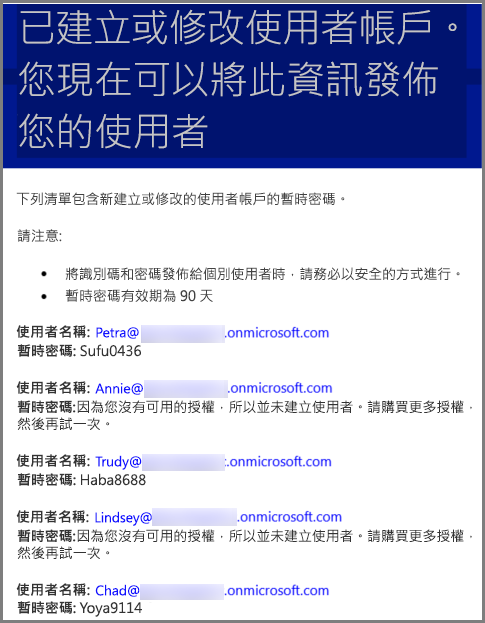

# <a name="add-several-users-at-the-same-time-to-office-365---admin-help"></a><span data-ttu-id="0588c-105">在 Office 365 同時新增多位使用者 - 系統管理說明</span><span class="sxs-lookup"><span data-stu-id="0588c-105">Add several users at the same time to Office 365 - Admin Help</span></span>

<span data-ttu-id="0588c-p102">小組每一個人都需要使用者帳戶，才能登入並存取 Office 365 服務 (例如電子郵件和 Office)。如果您有許多工作人員，您可以從 Excel 試算表或其他以 CSV 格式儲存的檔案，一鼓作氣新增全部的帳戶。[不確定 CSV 檔案是什麼嗎？](add-several-users-at-the-same-time.md#__toc316652088)</span><span class="sxs-lookup"><span data-stu-id="0588c-p102">Each person on your team needs a user account before they can sign in and access Office 365 services, such as email and Office. If you have a lot of people, you can add their accounts all at once from an Excel spreadsheet or other file saved in CSV format. [Not sure what CSV format is?](add-several-users-at-the-same-time.md#__toc316652088)</span></span>
  
## <a name="add-multiple-users-to-office-365-in-the-microsoft-365-admin-center"></a><span data-ttu-id="0588c-109">新增多位使用者至 Office 365，Microsoft 365 系統管理中心</span><span class="sxs-lookup"><span data-stu-id="0588c-109">Add multiple users to Office 365 in the Microsoft 365 admin center</span></span>

1. <span data-ttu-id="0588c-110">以公司或學校帳戶登入 Office 365。</span><span class="sxs-lookup"><span data-stu-id="0588c-110">Sign in to Office 365 with your work or school account.</span></span> 
    
2. <span data-ttu-id="0588c-111">在系統管理中心中，選擇 [**使用者** \> **作用中的使用者**。</span><span class="sxs-lookup"><span data-stu-id="0588c-111">In the admin center, choose **Users** \> **Active users**.</span></span>
    
    
  
    
3. <span data-ttu-id="0588c-113">在**匯入多個使用者**] 面板中，您可以選擇性地下載包含或不含範例資料填入範例 CSV 檔案。</span><span class="sxs-lookup"><span data-stu-id="0588c-113">On the **Import multiple users** panel, you can optionally download a sample CSV file with or without sample data filled in.</span></span> 
    
    
  
    <span data-ttu-id="0588c-115">試算表必須包含一個範例在**完全相同的資料行標題**(使用者名稱、 名字、 等等。..)。如果您使用的範本，在文字編輯工具，例如 [記事本] 中開啟，並且考慮留言來說，第 1 列的所有資料和資料列 2 中，以下只輸入資料。</span><span class="sxs-lookup"><span data-stu-id="0588c-115">Your spreadsheet needs to include the **exact same column headings** as the sample one (User Name, First Name, etc...). If you use the template, open it in a text editing tool, like Notepad, and consider leaving all the data in row 1 alone, and only entering data in rows 2 and below.</span></span> 
    
    <span data-ttu-id="0588c-116">您的試算表也必須包含使用者名稱 (例如 bob@contoso.com) 與每個使用者的顯示名稱 (例如「柯百勝」) 這兩個值。</span><span class="sxs-lookup"><span data-stu-id="0588c-116">Your spreadsheet also needs to include values for the user name (like bob@contoso.com) and a display name (like Bob Kelly) for each user.</span></span> 
    
  ```
  User Name,First Name,Last Name,Display Name,Job Title,Department,Office Number,Office Phone,Mobile Phone,Fax,Address,City,State or Province,ZIP or Postal Code,Country or Region
  chris@contoso.com,Chris,Green,Chris Green,IT Manager,Information Technology,123451,123-555-1211,123-555-6641,123-555-9821,1 Microsoft way,Redmond,Wa,98052,United States
  ben@contoso.com,Ben,Andrews,Ben Andrews,IT Manager,Information Technology,123452,123-555-1212,123-555-6642,123-555-9822,1 Microsoft way,Redmond,Wa,98052,United States
  david@contoso.com,David,Longmuir,David Longmuir,IT Manager,Information Technology,123453,123-555-1213,123-555-6643,123-555-9823,1 Microsoft way,Redmond,Wa,98052,United States
  cynthia@contoso.com,Cynthia,Carey,Cynthia Carey,IT Manager,Information Technology,123454,123-555-1214,123-555-6644,123-555-9824,1 Microsoft way,Redmond,Wa,98052,United States
  melissa@contoso.com,Melissa,MacBeth,Melissa MacBeth,IT Manager,Information Technology,123455,123-555-1215,123-555-6645,123-555-9825,1 Microsoft way,Redmond,Wa,98052,United States
  
  ```

4. <span data-ttu-id="0588c-117">在方塊中，輸入檔案路徑，或選擇 [**瀏覽]** 以瀏覽至 CSV 檔案的位置，然後選擇 [**驗證**。</span><span class="sxs-lookup"><span data-stu-id="0588c-117">Enter a file path into the box, or choose **Browse** to browse to the CSV file location, then choose **Verify**.</span></span>
    
    
  
    <span data-ttu-id="0588c-p103">如果檔案有任何問題，問題會顯示在面板中。您也可以下載記錄檔。</span><span class="sxs-lookup"><span data-stu-id="0588c-p103">If there are problems with the file, the problem is displayed in the panel. You can also download a log file.</span></span>
    
5. <span data-ttu-id="0588c-121">在 [**設定使用者選項**] 對話方塊中，您可以設定登入狀態，並選擇將指派給所有使用者的產品授權。</span><span class="sxs-lookup"><span data-stu-id="0588c-121">On the **Set user options** dialog you can set the sign-in status and choose the product license that will be assigned to all users.</span></span> 
    
6. <span data-ttu-id="0588c-122">在 [**檢視您的結果**] 對話方塊，您可以選擇將結果傳送給自己或其他使用者 （密碼會以純文字），您可以看到建立多少個使用者，而且如果您需要購買更多授權指派給新的使用者部分。</span><span class="sxs-lookup"><span data-stu-id="0588c-122">On the **View your result** dialog you can choose to send the results to either yourself or other users (passwords will be in plain text) and you can see how many users were created, and if you need to purchase more licenses to assign to some of the new users.</span></span> 
    
## <a name="watch-the-video"></a><span data-ttu-id="0588c-123">觀看影片</span><span class="sxs-lookup"><span data-stu-id="0588c-123">Watch the video</span></span>
<span data-ttu-id="0588c-124"><a name="bk_preview"> </a></span><span class="sxs-lookup"><span data-stu-id="0588c-124"></span></span>

 <span data-ttu-id="0588c-125">觀看短片以了解如何大量新增使用者。</span><span class="sxs-lookup"><span data-stu-id="0588c-125">Watch a short video that shows you how to bulk add users.</span></span> 
  
> [!VIDEO https://www.microsoft.com/videoplayer/embed/f4e7f161-8ae6-4264-a429-9297b539a8de?autoplay=false]
  
## <a name="next-steps"></a><span data-ttu-id="0588c-126">後續步驟</span><span class="sxs-lookup"><span data-stu-id="0588c-126">Next steps</span></span>
<span data-ttu-id="0588c-127"><a name="bk_preview"> </a></span><span class="sxs-lookup"><span data-stu-id="0588c-127"></span></span>

- <span data-ttu-id="0588c-128">現在這些人員都擁有帳戶，他們必須[下載並安裝或重新安裝 Office 365 或 Office 2016 在 PC 或 Mac 上](https://support.office.com/article/4414eaaf-0478-48be-9c42-23adc4716658)。</span><span class="sxs-lookup"><span data-stu-id="0588c-128">Now that these people have accounts, they need to [Download and install or reinstall Office 365 or Office 2016 on a PC or Mac](https://support.office.com/article/4414eaaf-0478-48be-9c42-23adc4716658).</span></span> <span data-ttu-id="0588c-129">您小組內的每位人員最多可以在 5 部 PC 或 Mac 上安裝 Office 365。</span><span class="sxs-lookup"><span data-stu-id="0588c-129">Each person on your team can install Office 365 on up to 5 PCs or Macs.</span></span> 
    
- <span data-ttu-id="0588c-130">每位人員也可以[設定 Office app 和行動裝置上的電子郵件](https://support.office.com/article/7dabb6cb-0046-40b6-81fe-767e0b1f014f)上最多 5 台平板電腦和 5 支電話，例如 Iphone、 Ipad 及 Android 手機和平板電腦。</span><span class="sxs-lookup"><span data-stu-id="0588c-130">Each person can also [Set up Office apps and email on a mobile device](https://support.office.com/article/7dabb6cb-0046-40b6-81fe-767e0b1f014f) on up to 5 tablets and 5 phones, such as iPhones, iPads, and Android phones and tablets.</span></span> <span data-ttu-id="0588c-131">他們可利用這種方式，從任何地點編輯 Office 檔案。</span><span class="sxs-lookup"><span data-stu-id="0588c-131">This way they can edit Office files from anywhere.</span></span> 
    
    <span data-ttu-id="0588c-132">設定步驟的端對端清單，請參閱[設定商務用 Office 365](https://support.office.com/article/6a3a29a0-e616-4713-99d1-15eda62d04fa) 。</span><span class="sxs-lookup"><span data-stu-id="0588c-132">See [Set up Office 365 for business](https://support.office.com/article/6a3a29a0-e616-4713-99d1-15eda62d04fa) for an end-to-end list of the setup steps.</span></span> 
    
## <a name="more-information-about-how-to-add-users-to-office-365"></a><span data-ttu-id="0588c-133">如何新增使用者至 Office 365 的詳細資訊</span><span class="sxs-lookup"><span data-stu-id="0588c-133">More information about how to add users to Office 365</span></span>
<span data-ttu-id="0588c-134"><a name="bk_preview"> </a></span><span class="sxs-lookup"><span data-stu-id="0588c-134"></span></span>

### <a name="not-sure-what-csv-format-is"></a><span data-ttu-id="0588c-135">不確定 CSV 檔案是什麼嗎？</span><span class="sxs-lookup"><span data-stu-id="0588c-135">Not sure what CSV format is?</span></span>
<span data-ttu-id="0588c-136"><a name="__toc316652088"> </a></span><span class="sxs-lookup"><span data-stu-id="0588c-136"></span></span>

<span data-ttu-id="0588c-p106">CSV 檔案是以逗號區分值的檔案。您可以用任何文字編輯器或試算表程式 (例如 Excel) 來建立或編輯這樣的檔案。</span><span class="sxs-lookup"><span data-stu-id="0588c-p106">A CSV file is a file with comma separated values. You can create or edit a file like this with any text editor or spreadsheet program, such as Excel.</span></span>
  
<span data-ttu-id="0588c-p107">您可以從下載[這份樣本試算表](https://www.microsoft.com/en-us/download/details.aspx?id=45485)開始著手。記住，Office 365 規定第一列必須是欄標題，切勿將它換成其他內容。</span><span class="sxs-lookup"><span data-stu-id="0588c-p107">You can download [this sample spreadsheet](https://www.microsoft.com/en-us/download/details.aspx?id=45485) as a starting point. Remember that Office 365 requires column headings in the first row so don't replace them with something else.</span></span> 
  
<span data-ttu-id="0588c-141">接著請以新名稱儲存檔案，然後指定 CSV 格式。</span><span class="sxs-lookup"><span data-stu-id="0588c-141">Save the file with a new name, and specify CSV format.</span></span>
  

  
<span data-ttu-id="0588c-143">儲存檔案時，系統會提示您若儲存為 CSV 格式，將遺失部分活頁簿中的功能。</span><span class="sxs-lookup"><span data-stu-id="0588c-143">When you save the file, you'll probably get a prompt that some features in your workbook will be lost if you save the file in CSV format.</span></span> <span data-ttu-id="0588c-144">這沒有關係。</span><span class="sxs-lookup"><span data-stu-id="0588c-144">This is okay.</span></span> <span data-ttu-id="0588c-145">請按一下 [是]\*\*\*\* 繼續。</span><span class="sxs-lookup"><span data-stu-id="0588c-145">Click **Yes** to continue.</span></span> 
  

  
### <a name="tips-for-formatting-your-spreadsheet"></a><span data-ttu-id="0588c-147">格式化試算表的祕訣</span><span class="sxs-lookup"><span data-stu-id="0588c-147">Tips for formatting your spreadsheet</span></span>
<span data-ttu-id="0588c-148"><a name="__toc314595848"> </a></span><span class="sxs-lookup"><span data-stu-id="0588c-148"></span></span>

- <span data-ttu-id="0588c-149">**欄標題必須與樣本試算表中的欄標題一樣嗎？**</span><span class="sxs-lookup"><span data-stu-id="0588c-149">**Do I need the same column headings as in the sample spreadsheet?**</span></span> <span data-ttu-id="0588c-150">是的。</span><span class="sxs-lookup"><span data-stu-id="0588c-150">Yes.</span></span> <span data-ttu-id="0588c-151">樣本試算表的第一列是欄標題。</span><span class="sxs-lookup"><span data-stu-id="0588c-151">The sample spreadsheet contains column headings in the first row.</span></span> <span data-ttu-id="0588c-152">這些標題不能省略。</span><span class="sxs-lookup"><span data-stu-id="0588c-152">These headings are required.</span></span> <span data-ttu-id="0588c-153">請針對您要在 Office 365 新增的每一位使用者，在標題下方各建立一列。</span><span class="sxs-lookup"><span data-stu-id="0588c-153">For each user you want to add to Office 365, create a row under the heading.</span></span> <span data-ttu-id="0588c-154">如果您新增、變更或刪除任何欄標題，Office 365 可能就無法根據檔案中的資訊建立使用者。</span><span class="sxs-lookup"><span data-stu-id="0588c-154">If you add, change, or delete any of the column headings, Office 365 might not be able to create users from the information in the file.</span></span> 
    
- <span data-ttu-id="0588c-155">**若我沒有各使用者的必要資訊會怎麼樣？**</span><span class="sxs-lookup"><span data-stu-id="0588c-155">**What if I don't have all the information required for each user?**</span></span> <span data-ttu-id="0588c-156">使用者名稱和顯示名稱是必要資訊，缺少的話無法新增新使用者。</span><span class="sxs-lookup"><span data-stu-id="0588c-156">The user name and display name are required, and you cannot add a new user without this information.</span></span> <span data-ttu-id="0588c-157">若您缺少部分其他資訊 (例如傳真)，可使用空格加上逗號表示此欄位應保留空白。</span><span class="sxs-lookup"><span data-stu-id="0588c-157">If you don't have some of the other information, such as the fax, you can use a space plus a comma to indicate that the field should remain blank.</span></span> 
    
- <span data-ttu-id="0588c-158">\* \* 如何小型或大型試算表可以？</span><span class="sxs-lookup"><span data-stu-id="0588c-158">\*\* How small or large can the spreadsheet be?</span></span> <span data-ttu-id="0588c-159">\* \* 試算表必須至少兩個資料列。</span><span class="sxs-lookup"><span data-stu-id="0588c-159">\*\* The spreadsheet must have at least two rows.</span></span> <span data-ttu-id="0588c-160">一列是欄標題 (使用者資料欄標籤)，另一列是使用者。</span><span class="sxs-lookup"><span data-stu-id="0588c-160">One is for the column headings (the user data column label) and one for the user.</span></span> <span data-ttu-id="0588c-161">列數不得超過 251 列。</span><span class="sxs-lookup"><span data-stu-id="0588c-161">You cannot have more than 251 rows.</span></span> <span data-ttu-id="0588c-162">如果您必須匯入超過 250 位使用者，可以建立多份試算表。</span><span class="sxs-lookup"><span data-stu-id="0588c-162">If you need to import more than 250 users, you can create more than one spreadsheet.</span></span> 
    
- <span data-ttu-id="0588c-163">\* \* 可以使用哪些語言？</span><span class="sxs-lookup"><span data-stu-id="0588c-163">\*\* What languages can I use?</span></span> <span data-ttu-id="0588c-164">\* \* 當您建立您的試算表時，您可以輸入使用者的資料欄標籤中的任何語言或字元，但就不得變更之標籤的順序，如範例所示。</span><span class="sxs-lookup"><span data-stu-id="0588c-164">\*\* When you create your spreadsheet, you can enter user data column labels in any language or characters, but you must not change the order of the labels, as shown in the sample.</span></span> <span data-ttu-id="0588c-165">接著您可以使用任何語言或字元將項目填入欄位內，並將檔案儲存為 Unicode 或 UTF-8 格式。</span><span class="sxs-lookup"><span data-stu-id="0588c-165">You can then make entries into the fields, using any language or characters, and save your file in a Unicode or UTF-8 format.</span></span> 
    
- <span data-ttu-id="0588c-166">**如果我要新增來自不同國家或地區的使用者，該怎麼做？**</span><span class="sxs-lookup"><span data-stu-id="0588c-166">**What if I'm adding users from different countries or regions?**</span></span> <span data-ttu-id="0588c-167">請為每一個地區分別建立一個試算表。</span><span class="sxs-lookup"><span data-stu-id="0588c-167">Create a separate spreadsheet for each area.</span></span> <span data-ttu-id="0588c-168">每一個試算表都要執行 [大量新增使用者精靈] 的所有步驟，讓您所用的檔案中，所有的使用者都具備單一位置。</span><span class="sxs-lookup"><span data-stu-id="0588c-168">You'll need to step through the Bulk add users wizard which each spreadsheet, giving a single location of all users included in the file that you're working with.</span></span> 
    
- <span data-ttu-id="0588c-169">**我能使用的字元數是否有所限制？**</span><span class="sxs-lookup"><span data-stu-id="0588c-169">**Is there a limit to the number of characters I can use?**</span></span> <span data-ttu-id="0588c-170">下表所列的是範例試算表中各使用者資料欄標籤及其字元數上限。</span><span class="sxs-lookup"><span data-stu-id="0588c-170">The following table shows the user data column labels and the maximum character length for each in the sample spreadsheet.</span></span> 
    
|<span data-ttu-id="0588c-171">**使用者 資料 欄 標籤**</span><span class="sxs-lookup"><span data-stu-id="0588c-171">**User data column label**</span></span>|<span data-ttu-id="0588c-172">**字元數上限**</span><span class="sxs-lookup"><span data-stu-id="0588c-172">**Maximum character length**</span></span>|
|:-----|:-----|
|<span data-ttu-id="0588c-173">使用者 名稱 (必填)</span><span class="sxs-lookup"><span data-stu-id="0588c-173">User Name (Required)</span></span>  <br/> |<span data-ttu-id="0588c-p115">79 (包含 @ 符號，格式為 name@domain.\<extension\>)。使用者別名不得超過 30 個字元，網域名稱不得超過 48 個字元。</span><span class="sxs-lookup"><span data-stu-id="0588c-p115">79 including the at sign (@), in the format name@domain.\<extension\>. The user's alias cannot exceed 30 characters, and the domain name cannot exceed 48 characters.</span></span>  <br/> |
|<span data-ttu-id="0588c-176">名字</span><span class="sxs-lookup"><span data-stu-id="0588c-176">First Name</span></span>  <br/> |<span data-ttu-id="0588c-177">64</span><span class="sxs-lookup"><span data-stu-id="0588c-177">64</span></span>  <br/> |
|<span data-ttu-id="0588c-178">姓氏</span><span class="sxs-lookup"><span data-stu-id="0588c-178">Last Name</span></span>  <br/> |<span data-ttu-id="0588c-179">64</span><span class="sxs-lookup"><span data-stu-id="0588c-179">64</span></span>  <br/> |
|<span data-ttu-id="0588c-180">顯示 名稱 (必填)</span><span class="sxs-lookup"><span data-stu-id="0588c-180">Display Name (required)</span></span>  <br/> |<span data-ttu-id="0588c-181">256</span><span class="sxs-lookup"><span data-stu-id="0588c-181">256</span></span>  <br/> |
|<span data-ttu-id="0588c-182">職稱</span><span class="sxs-lookup"><span data-stu-id="0588c-182">Job Title</span></span>  <br/> |<span data-ttu-id="0588c-183">64</span><span class="sxs-lookup"><span data-stu-id="0588c-183">64</span></span>  <br/> |
|<span data-ttu-id="0588c-184">部門</span><span class="sxs-lookup"><span data-stu-id="0588c-184">Department</span></span>  <br/> |<span data-ttu-id="0588c-185">64</span><span class="sxs-lookup"><span data-stu-id="0588c-185">64</span></span>  <br/> |
|<span data-ttu-id="0588c-186">辦公室號碼</span><span class="sxs-lookup"><span data-stu-id="0588c-186">Office Number</span></span>  <br/> |<span data-ttu-id="0588c-187">128</span><span class="sxs-lookup"><span data-stu-id="0588c-187">128</span></span>  <br/> |
|<span data-ttu-id="0588c-188">辦公室電話</span><span class="sxs-lookup"><span data-stu-id="0588c-188">Office Phone</span></span>  <br/> |<span data-ttu-id="0588c-189">64</span><span class="sxs-lookup"><span data-stu-id="0588c-189">64</span></span>  <br/> |
|<span data-ttu-id="0588c-190">行動電話</span><span class="sxs-lookup"><span data-stu-id="0588c-190">Mobile Phone</span></span>  <br/> |<span data-ttu-id="0588c-191">64</span><span class="sxs-lookup"><span data-stu-id="0588c-191">64</span></span>  <br/> |
|<span data-ttu-id="0588c-192">傳真</span><span class="sxs-lookup"><span data-stu-id="0588c-192">Fax</span></span>  <br/> |<span data-ttu-id="0588c-193">64</span><span class="sxs-lookup"><span data-stu-id="0588c-193">64</span></span>  <br/> |
|<span data-ttu-id="0588c-194">地址</span><span class="sxs-lookup"><span data-stu-id="0588c-194">Address</span></span>  <br/> |<span data-ttu-id="0588c-195">1023</span><span class="sxs-lookup"><span data-stu-id="0588c-195">1023</span></span>  <br/> |
|<span data-ttu-id="0588c-196">城市</span><span class="sxs-lookup"><span data-stu-id="0588c-196">City</span></span>  <br/> |<span data-ttu-id="0588c-197">128</span><span class="sxs-lookup"><span data-stu-id="0588c-197">128</span></span>  <br/> |
|<span data-ttu-id="0588c-198">省/市</span><span class="sxs-lookup"><span data-stu-id="0588c-198">State or Province</span></span>  <br/> |<span data-ttu-id="0588c-199">128</span><span class="sxs-lookup"><span data-stu-id="0588c-199">128</span></span>  <br/> |
|<span data-ttu-id="0588c-200">郵遞區號</span><span class="sxs-lookup"><span data-stu-id="0588c-200">ZIP or Postal Code</span></span>  <br/> |<span data-ttu-id="0588c-201">40</span><span class="sxs-lookup"><span data-stu-id="0588c-201">40</span></span>  <br/> |
|<span data-ttu-id="0588c-202">國家/地區</span><span class="sxs-lookup"><span data-stu-id="0588c-202">Country or Region</span></span>  <br/> |<span data-ttu-id="0588c-203">128</span><span class="sxs-lookup"><span data-stu-id="0588c-203">128</span></span>  <br/> |
   
### <a name="still-having-problems-when-adding-users-to-office-365"></a><span data-ttu-id="0588c-204">仍有在 Office 365 新增使用者的問題嗎？</span><span class="sxs-lookup"><span data-stu-id="0588c-204">Still having problems when adding users to Office 365?</span></span>

- <span data-ttu-id="0588c-205">**重複檢查試算表格式是否正確。**</span><span class="sxs-lookup"><span data-stu-id="0588c-205">**Double-check that the spreadsheet is formatted correctly.**</span></span> <span data-ttu-id="0588c-206">檢查欄標題，確認與樣本檔案中的標題相符。</span><span class="sxs-lookup"><span data-stu-id="0588c-206">Check the column headings to make sure they match the headings in the sample file.</span></span> <span data-ttu-id="0588c-207">務必遵循字元長度的規則，各欄位均以逗號隔開。</span><span class="sxs-lookup"><span data-stu-id="0588c-207">Make sure you're following the rules for character lengths and that each field is separated by a comma.</span></span> 
    
- <span data-ttu-id="0588c-208">\* \* 如果您沒有立刻看到 Office 365 中新的使用者，請稍候幾分鐘的時間。</span><span class="sxs-lookup"><span data-stu-id="0588c-208">\*\* If you don't see the new users in Office 365 right away, wait a few minutes.</span></span> <span data-ttu-id="0588c-209">\* \* 可能會花費一點的前往 Office 365 中的所有服務的變更。</span><span class="sxs-lookup"><span data-stu-id="0588c-209">\*\* It can take a little while for changes to go across all the services in Office 365.</span></span> 
    
## <a name="add-multiple-users-to-office-365-in-the-old-admin-center"></a><span data-ttu-id="0588c-210">將多個使用者新增至舊版系統管理中心中的 Office 365</span><span class="sxs-lookup"><span data-stu-id="0588c-210">Add multiple users to Office 365 in the old admin center</span></span>

1. <span data-ttu-id="0588c-211">下載[此範例試算表](https://www.microsoft.com/en-us/download/details.aspx?id=45485)，並在 Excel 中開啟。</span><span class="sxs-lookup"><span data-stu-id="0588c-211">Download [this sample spreadsheet](https://www.microsoft.com/en-us/download/details.aspx?id=45485) and open it in Excel.</span></span> 
    
    <span data-ttu-id="0588c-212">試算表必須包含一個範例在**完全相同的資料行標題**(使用者名稱、 名字、 等等。..)。如果您使用的範本，請考慮留言來說，第 1 列的所有資料和資料列 2 中，以下只輸入資料。</span><span class="sxs-lookup"><span data-stu-id="0588c-212">Your spreadsheet needs to include the **exact same column headings** as the sample one (User Name, First Name, etc...). If you use the template, consider leaving all the data in row 1 alone, and only entering data in rows 2 and below.</span></span> 
    
    <span data-ttu-id="0588c-p118">您的試算表也必須包含使用者名稱 (例如 bob@contoso.com) 與每個使用者的顯示名稱 (例如「柯百勝」) 這兩個值。若要將其他欄位留白，請在欄位中輸入一個空白和一個逗號，如下圖所示。</span><span class="sxs-lookup"><span data-stu-id="0588c-p118">Your spreadsheet also needs to include values for the user name (like bob@contoso.com) and a display name (like Bob Kelly) for each user. To leave other fields blank, enter a space plus a comma in the field as shown in the following figure.</span></span> 
    
    
  
    <span data-ttu-id="0588c-p119">如果您有工作人員在不同國家工作，您必須為每一個國家/地區的使用者分別建立一份試算表。例如，一份試算表列出在美國工作的所有工作人員，另一份試算表列出在日本工作的所有工作人員。這是因為每一個地區可用的 Office 365 服務都不盡相同。</span><span class="sxs-lookup"><span data-stu-id="0588c-p119">If you have people working in different countries, you'll need to create one spreadsheet for users in each country. For example, one spreadsheet that lists everyone who works in the US, and another that lists everyone who works in Japan. This is because the availability of Office 365 services varies by region.</span></span> 
    
    <span data-ttu-id="0588c-219">**提示：** 您將多位使用者新增至 Office 365 之前，您可能要與範例試算表的作法。</span><span class="sxs-lookup"><span data-stu-id="0588c-219">**Tip:** Before you add many users to Office 365, you might want to practice with the sample spreadsheet.</span></span> <span data-ttu-id="0588c-220">例如，編輯一份含有部分 (假設 5 或 10 個人) 使用者資料的範例試算表，並以新名稱儲存檔案。</span><span class="sxs-lookup"><span data-stu-id="0588c-220">For example, edit the sample spreadsheet with data for a few of your users, say 5 or 10, and save the file with a new name.</span></span> <span data-ttu-id="0588c-221">接著逐一執行此程序所述的步驟、檢查結果，然後刪除新帳戶，再從頭開始。</span><span class="sxs-lookup"><span data-stu-id="0588c-221">Run through steps described in this procedure, check the results, and then delete the new accounts and start over again.</span></span> <span data-ttu-id="0588c-222">您可使用這個方式，練習將所有資料整理為適合您的狀況。</span><span class="sxs-lookup"><span data-stu-id="0588c-222">This way you can practice getting all of the data right for your situation.</span></span> <span data-ttu-id="0588c-223">另外也請參閱[格式化試算表的祕訣](add-several-users-at-the-same-time.md#__toc314595848)。</span><span class="sxs-lookup"><span data-stu-id="0588c-223">Also check out [Tips for formatting your spreadsheet](add-several-users-at-the-same-time.md#__toc314595848).</span></span>
    
2. <span data-ttu-id="0588c-224">以公司或學校帳戶登入 Office 365。</span><span class="sxs-lookup"><span data-stu-id="0588c-224">Sign in to Office 365 with your work or school account.</span></span> 
    
3. <span data-ttu-id="0588c-225">移至系統管理中心。</span><span class="sxs-lookup"><span data-stu-id="0588c-225">Go to the admin center.</span></span>
    
4. <span data-ttu-id="0588c-226">對於使用 Office 365 服務的使用者，必須先指派授權給他們。</span><span class="sxs-lookup"><span data-stu-id="0588c-226">For people to use Office 365 services, they need to be assigned a license.</span></span> <span data-ttu-id="0588c-227">不過您必須先檢查您是否足夠的授權，可以指派給試算表所列的所有人。</span><span class="sxs-lookup"><span data-stu-id="0588c-227">Before continuing, you might want to check that you have enough licenses for everyone listed in your spreadsheet.</span></span> <span data-ttu-id="0588c-228">選擇 [**計費** \> **訂用帳戶**]，查看是否您有足夠的授權。</span><span class="sxs-lookup"><span data-stu-id="0588c-228">Choose **Billing** \> **Subscriptions** to see if you have enough.</span></span> <span data-ttu-id="0588c-229">如果您需要購買更多授權，選擇 [\* \* 變更授權數量 \* \*。</span><span class="sxs-lookup"><span data-stu-id="0588c-229">If you need to buy more licenses, choose \*\* Change license quantity \*\*.</span></span> <span data-ttu-id="0588c-230">您可以先執行精靈，指派現有的授權，日後再另外購買其他授權，然後重新執行精靈。</span><span class="sxs-lookup"><span data-stu-id="0588c-230">Or, you can run the wizard and assign the licenses you have, then buy more licenses later and rerun the wizard.</span></span> 
    
5. <span data-ttu-id="0588c-231">現在移至 [大量新增使用者] 精靈： 選擇 [**使用者**] \> **作用中的使用者**。</span><span class="sxs-lookup"><span data-stu-id="0588c-231">Now go to the Bulk add users wizard: choose **Users** \> **Active Users**.</span></span> <span data-ttu-id="0588c-232">選擇 [，如下圖所示。</span><span class="sxs-lookup"><span data-stu-id="0588c-232">Choose  as shown in the following figure.</span></span> 
    
    ![在系統管理中心的 [使用者] 區段的影像](media/2cd5ff86-9c0b-438e-9bb9-13b12a2675de.png)
  
    <span data-ttu-id="0588c-234">隨後便會出現 [大量新增使用者] 精靈，逐步引導您在 Office 365 新增一組使用者。</span><span class="sxs-lookup"><span data-stu-id="0588c-234">The Bulk add users wizard appears and steps you through adding a group of users to Office 365.</span></span> 
    
6. <span data-ttu-id="0588c-235">步驟 1 - 選取 CSV 檔案，指定您自己的試算表，如下圖所示。</span><span class="sxs-lookup"><span data-stu-id="0588c-235">In Step 1 - Select a CSV file, specify your own spreadsheet as shown in the following figure.</span></span>
    
    ![[大量新增使用者] 精靈步驟 1 - 選取 CSV 檔案](media/aeb837ed-1f86-427d-b038-c643c383829c.png)
  
7. <span data-ttu-id="0588c-237">步驟 2 - 驗證，精靈會告訴您試算表中的內容格式是否正確。</span><span class="sxs-lookup"><span data-stu-id="0588c-237">In Step 2 - Verification, the wizard tells you whether the content in the spreadsheet is formatted correctly.</span></span>
    
    ![[大量新增使用者] 精靈步驟 2 - 驗證](media/3fd3cd2c-44d4-4593-b02c-b87c176affb3.png)
  
8. <span data-ttu-id="0588c-239">步驟 3-設定，選擇 [**允許**]，讓您試算表中所列的人員可以使用 Office 365。</span><span class="sxs-lookup"><span data-stu-id="0588c-239">In Step 3 - Settings, choose **Allowed** so that the people listed in your spreadsheet will be able to use Office 365.</span></span> <span data-ttu-id="0588c-240">另外也請選擇這些人會使用 Office 365 的國家/地區。</span><span class="sxs-lookup"><span data-stu-id="0588c-240">Also choose the country in which these people will use Office 365.</span></span> <span data-ttu-id="0588c-241">請記住，如果組織中的某些人要在其他國家使用 Office 365，請以他們的名稱另外建立一份試算表，然後再次執行 [大量新增使用者] 精靈，新增他們。</span><span class="sxs-lookup"><span data-stu-id="0588c-241">Remember if some people in your organization are going to use Office 365 in a different country, create a separate spreadsheet with their names and run the Bulk add users wizard again to add them.</span></span> 
    
    ![[大量新增使用者] 精靈步驟 3 - 設定](media/ff12ad34-5d8b-4e89-a02f-d827a94095b3.png)
  
9. <span data-ttu-id="0588c-243">[指派授權] 頁面會告訴您有多少授權可用。</span><span class="sxs-lookup"><span data-stu-id="0588c-243">The assign licenses page tells you how many licenses are available.</span></span> 
    
    ![[大量新增使用者] 精靈步驟 4 - 授權](media/161ea34c-c67e-43be-962f-029f5426ff1b.png)
  
    <span data-ttu-id="0588c-245">您可以選擇 [**購買更多授權**，但您就會離開 [大量新增使用者] 精靈，然後移至 Microsoft 365 系統管理中心 **] [帳單**。</span><span class="sxs-lookup"><span data-stu-id="0588c-245">You can choose **Buy more licenses**, but you'll leave the Bulk add users wizard and go to **Billing** in the Microsoft 365 admin center.</span></span> <span data-ttu-id="0588c-246">在購買更多授權後，您必須等待幾分鐘的時間處理訂單，然後從頭開始執行 [大量新增使用者] 精靈。</span><span class="sxs-lookup"><span data-stu-id="0588c-246">After buying more licenses, you'll have to wait a few minutes for the order to be processed and then start the Bulk add users wizard from the beginning.</span></span> 
    
    <span data-ttu-id="0588c-247">如果沒有另外購買其他授權，就不會針對試算表所列的每一個人建立帳戶。</span><span class="sxs-lookup"><span data-stu-id="0588c-247">If you don't buy more licenses, accounts won't be created for everyone listed in your spreadsheet.</span></span> 
    
    <span data-ttu-id="0588c-248">在這個範例當中，我們不會購買其他任何授權，因此繼續執行 [大量新增使用者] 精靈。</span><span class="sxs-lookup"><span data-stu-id="0588c-248">In this example, we don't buy any more licenses and continue with the Bulk add users wizard.</span></span>
    
10. <span data-ttu-id="0588c-249">In Step 5 - Send Results, type the email addresses of the people who you want to get an email that lists  *all*  of the Office 365 user names and temporary passwords for the people in the spreadsheet.</span><span class="sxs-lookup"><span data-stu-id="0588c-249">In Step 5 - Send Results, type the email addresses of the people who you want to get an email that lists  *all*  of the Office 365 user names and temporary passwords for the people in the spreadsheet.</span></span> 
    
    ![[大量新增使用者] 精靈步驟 5 - 傳送結果](media/5beeb825-4ba7-4ae0-bfb5-a1f8a785ebdb.png)
  
    <span data-ttu-id="0588c-p125">下面這封電子郵件會傳送到您在步驟 5「傳送結果」所指定的所有電子郵件地址。這封電子郵件會指出已經建立的帳戶。請注意，有些人沒有建立帳戶，是因為他們沒有足夠的授權。</span><span class="sxs-lookup"><span data-stu-id="0588c-p125">The following email is sent to all the email addresses you specified in Step 5 - Send results. This email indicates which accounts were created. Notice that accounts weren't created for some people because there weren't enough licenses.</span></span> 
    
    
  
    <span data-ttu-id="0588c-p126">您可以日後再購買更多授權，並以同一份試算表重新執行 [大量新增使用者] 精靈。精靈會略過已經擁有帳戶的使用者；在結果報告中說明「重複的使用者名稱」，指出已擁有帳戶的人員資訊。</span><span class="sxs-lookup"><span data-stu-id="0588c-p126">You can buy more licenses later and rerun the Bulk add users wizard with the same spreadsheet. The wizard skips over the users that already have accounts; on the results report, it will say "duplicate user name" to indicate someone with that information already has an account.</span></span>
    
11. <span data-ttu-id="0588c-257">[大量新增使用者] 精靈的最後一頁會列出使用者名稱和臨時密碼，如下圖所示。</span><span class="sxs-lookup"><span data-stu-id="0588c-257">The final page in the Bulk add users wizard lists the user names and temporary passwords, as shown in the following figure.</span></span>
    
    ![[大量新增使用者] 精靈步驟 6 - 傳送結果](media/0cd43832-071b-4b33-b57a-5d07959985ad.png)
  
12. <span data-ttu-id="0588c-p127">待您在 Office 365 新增使用者之後，必須告訴這些使用者他們的 Office 365 帳戶資訊。請以正常程序傳達新密碼。</span><span class="sxs-lookup"><span data-stu-id="0588c-p127">After you've added users to Office 365, you need to tell them about their Office 365 account information. Use your normal process for communicating new passwords.</span></span>
    

