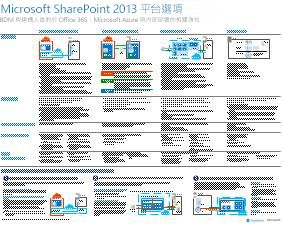
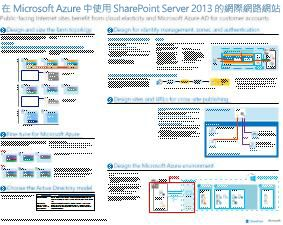
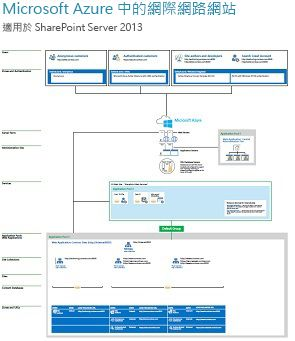

# 適用於 SharePoint、Exchange、商務用 Skype 和 Lync 的架構模型

這些 IT 海報描述適用於 SharePoint、Exchange、商務用 Skype 和 Lync 的結構模型和部署選項，並提供在 Microsoft Azure 內部署 SharePoint 的設計資訊。
  
透過 Microsoft 365，您可以雲端架構服務方式提供使用者所熟悉的共同作業和通訊服務。 除少許個別例子外，不管是維護內部部署或使用 Microsoft 365，使用者經驗皆會維持不變。 在放置工作負載時，這種整合式的使用者經驗會令使用者難以判斷放置的位置，並衍生問題如︰
  
- 當為您的個別工作負載選擇平台時，您會如何判斷？
    
- 是否應該保留任何內部部署服務？
    
- 擁有適當混合式部署的案例是怎麼樣的？
    
- Microsoft Azure 如何調整圖片？
    
- 在 Azure 內 Office Sever 工作負載的支援組態為何？
    
> [!TIP]
> 此頁面上的海報大多提供多種語言版本，包括中文、英文、法文、德文、義大利文、日文、韓文、葡萄牙文、俄文和西班牙文。若要下載以上其中一種語言的海報，請按一下該海報的 [更多語言] 連結。讓我們知道您的想法！
  
讓我們知道您的心得！請傳送電子郵件給我們：[cloudadopt@microsoft.com](mailto:cloudadopt@microsoft.com)。 
  
此頁面可讓您連結到下列的海報︰
  
- **架構模型海報**：您可以使用這些資源來判斷適用於 SharePoint 2016、和商務用 Skype 2015 的理想平台和組態。
    
  - [Microsoft SharePoint 2016 架構模型](architectural-models-for-sharepoint-exchange-skype-for-business-and-lync.md#SP2016_ArchModel)
    
  - [SharePoint Server 2016 資料庫](architectural-models-for-sharepoint-exchange-skype-for-business-and-lync.md#SP2016_Databases)
    
  - [Microsoft 商務用 Skype 2015 架構模型](architectural-models-for-sharepoint-exchange-skype-for-business-and-lync.md#SfB2015_ArchModel)
    
- **平台選項海報**：您可以使用這些資源來判斷適用於 SharePoint 2013、Exchange 2013 和 Lync 2013 的理想平台和組態。
    
  - [SharePoint 2013 平台選項](architectural-models-for-sharepoint-exchange-skype-for-business-and-lync.md#SP2013_Options)
    
  - [Exchange 2013 平台選項](architectural-models-for-sharepoint-exchange-skype-for-business-and-lync.md#Exch2013_options)
    
  - [Lync 2013 平台選項](architectural-models-for-sharepoint-exchange-skype-for-business-and-lync.md#Lync2013_Options)
    
- **Azure 解決方案海報內的 SharePoint Server 2013**：您可以使用這些 IT 海報，來判斷 Azure 的基礎結構服務中的 SharePoint Server 2013 工作負載的設計和組態。
    
  - [在 Microsoft Azure 中使用 SharePoint Server 2013 的網際網路網站](architectural-models-for-sharepoint-exchange-skype-for-business-and-lync.md#Azure_sharepoint2013)
    
  - [設計範例：Microsoft Azure 中的 SharePoint 2013 網際網路網站](architectural-models-for-sharepoint-exchange-skype-for-business-and-lync.md#DesignSampleInternetSites)
    
  - [對於 Microsoft Azure 的 SharePoint 災害復原](architectural-models-for-sharepoint-exchange-skype-for-business-and-lync.md#sharepoint_recovery_Azure)
    
## 架構模型海報

這些新推出的 SharePoint 2016 和商務用 Skype 2015 IT 海報會以方便列印的格式，提供方法來比較不同的部署方法。每份海報會提供一份清單，內含所有可用的組態或平台，並提供每個選項的下列資訊︰
  
- **概觀**：平台 (包括概念圖表) 的簡短摘要。
    
- **適用**：適用在特定平台的常見案例。
    
- **授權需求**：部署所需的授權。
    
- **架構工作**：您身為架構設計人員須執行的決策。
    
- **IT 專業人員的工作或責任**：您的 IT 人員需要處理的日常工作。
    

### Microsoft SharePoint 2016 架構模型

|**項目**|**描述**|
|:-----|:-----|
|[          ](https://www.microsoft.com/download/details.aspx?id=52650)   [PDF](https://download.microsoft.com/download/4/F/A/4FA0F94B-EE2F-41DB-A047-D9864FEF41E9/SharePoint2016ArchitecturalModels.pdf)  \| [Visio](https://download.microsoft.com/download/4/F/A/4FA0F94B-EE2F-41DB-A047-D9864FEF41E9/SharePoint2016ArchitecturalModels.vsdx)  \| [更多語言](https://www.microsoft.com/download/details.aspx?id=52650)   | 此 IT 海報描述商務決策者和解決方案架構設計人員需了解的 SharePoint Online、Microsoft Azure 和 SharePoint 內部部署組態。    - **SharePoint Online (SaaS)**：透過軟體即服務 (SaaS) 訂閱模型取用 SharePoint。   - **SharePoint Hybrid**：按您自己的速度，將您的 SharePoint 網址和應用程式移至雲端。   - **SharePoint in Azure (IaaS)**：您可將內部部署環境延伸至 Microsoft Azure 並在該處部署 SharePoint 2016 伺服器 (高可用性/災害復原和開發測試環境中推薦使用)。  - **SharePoint 內部部署**：您會在您維護的資料中心內計劃、部署、維護和自訂 SharePoint 環境。   |
   

### SharePoint Server 2016 資料庫

|**項目**|**描述**|
|:-----|:-----|
|[          ](https://www.microsoft.com/download/details.aspx?id=55041)   [PDF](https://download.microsoft.com/download/D/5/D/D5DC1121-8BC5-4953-834F-1B5BB03EB691/DBrefguideSPS2016_tabloid.pdf)  \| [Visio](https://download.microsoft.com/download/D/5/D/D5DC1121-8BC5-4953-834F-1B5BB03EB691/DBrefguideSPS2016_tabloid.vsdx)  \| [更多語言](https://www.microsoft.com/download/details.aspx?id=55041)   | 此 IT 海報是適用於 SharePoint Server 2016 資料庫的快速參考指南。每個資料庫均會有以下詳細資料：   - 大小   - 調整大小指導方針   - I/O 模式   - 需求：     第一頁具有 SharePoint 系統資料庫和有多個資料庫的服務應用程式。第二頁顯示有單一資料庫的所有服務應用程式。    如需有關 SharePoint Server 2016 資料庫的詳細資訊，請參閱＜[SharePoint Server 2016 中的資料庫類型和描述](https://docs.microsoft.com/SharePoint/technical-reference/database-types-and-descriptions)＞。   |
   

### Microsoft 商務用 Skype 2015 架構模型

|**項目**|**描述**|
|:-----|:-----|
|[          ](https://www.microsoft.com/download/details.aspx?id=55022)   [PDF](https://download.microsoft.com/download/7/7/4/7741262C-A60D-41F7-863B-99BF5964FBFE/Skype%20for%20Business%20Architectural%20Models.pdf)  \| [Visio](https://download.microsoft.com/download/7/7/4/7741262C-A60D-41F7-863B-99BF5964FBFE/Skype%20for%20Business%20Architectural%20Models.vsd)  \| [更多語言](https://www.microsoft.com/download/details.aspx?id=55022)   |此海報描述企業決策者和解決方案架構設計人員需了解的商務用 Skype Online、內部部署、混合式、雲端 PBX 和 Exchange 與 SharePoint 組態的整合。    這是專為 IT 專業人員而設，以提高他們對不同基本架構模型的意識，並從中取用商務用 Skype Online 和商務用 Skype 內部部署。   從最適合貴組織需求與未來規劃的任何一種組態開始。您可以視需要考慮並使用其他組態。例如，您可能會想要考慮與 Exchange 和 SharePoint 整合，或考慮善加利用 Microsoft 的雲端 PBX 產品的解決方案。    |
   
## 平台選項海報

這些適用於 SharePoint 2013、Exchange 2013 和 Lync 2013 的 IT 海報，會以大型海報格式，來比較不同的部署方法，讓差異一目了然。每份海報會提供一份清單，內含所有可用的組態或平台，並提供每個選項的下列資訊︰
  
- **概觀**：平台 (包括概念圖表) 的簡短摘要。
    
- **適用**：適用在特定平台的常見案例。
    
- **授權需求**：部署所需的授權。
    
- **架構工作**：您身為架構設計人員須執行的決策。
    
- **IT 專業人員的工作或責任**：您的 IT 人員需要處理的日常工作。
    

## SharePoint 2013 平台選項

****

|**項目**|**描述**|
|:-----|:-----|
|[          ](https://www.microsoft.com/download/details.aspx?id=40332)   [PDF](https://go.microsoft.com/fwlink/p/?LinkId=324594)  \| [Visio](https://go.microsoft.com/fwlink/p/?LinkId=324593)  \| [其他語言](https://www.microsoft.com/download/details.aspx?id=40332)   |針對企業決策人 (BDM) 和架構設計人員，本模型顯示 SharePoint 2013 的平台選項、Microsoft 365 中的 SharePoint、與 Microsoft 365、Azure 的內部部署混合式，和僅限內部部署的部署。 其中包含每個架構的概觀、建議、授權需求，以及每個平台的架構設計人員和 IT 專業人員工作清單。 許多 Azure 上的 SharePoint 解決方案都會醒目提示。   |
   

## Exchange 2013 平台選項

****

|**項目**|**描述**|
|:-----|:-----|
|[          ](https://www.microsoft.com/download/details.aspx?id=42676)   [PDF](https://go.microsoft.com/fwlink/p/?LinkID=398740)  \| [Visio](https://go.microsoft.com/fwlink/p/?LinkID=398742)  \| [其他語言](https://www.microsoft.com/download/details.aspx?id=42676)   |這種模型會描述 Exchange 2013 可用的平台選項，並適用於 BDM 和架構設計人員。 客戶可以選擇使用 Microsoft 365 的 Exchange Online、混合式 Exchange、Exchange Server 內部部署和 Exchange 託管。 海報包含每個架構選項的詳細資訊，包括每個最理想情況下的授權需求以及 IT 專業人員的責任。   |
   

## Lync 2013 平台選項

****

|**項目**|**描述**|
|:-----|:-----|
|[          ](https://www.microsoft.com/download/details.aspx?id=41677)   [PDF](https://go.microsoft.com/fwlink/p/?LinkID=391837)  \| [Visio](https://go.microsoft.com/fwlink/p/?LinkID=391839)  \| [其他語言](https://www.microsoft.com/download/details.aspx?id=41677)   |對於 BDM 和架構設計人員，這種模型會描述 Exchange 2013 可用的平台選項。 客戶可以從 Microsoft 365 中的 Lync Online、混合式 Lync、內部部署 Lync Server 和 Lync 託管中選擇。 IT 海報包含每個架構的選項，包括最理想的情況下，每一個授權需求以及 IT 專業人員的責任。    |
   

## Azure 解決方案海報內的 SharePoint

這些 IT 海報採用大型海報格式，顯示使用 SharePoint Server 2013 的以 Azure 為基礎的解決方案。
  

### 在 Microsoft Azure 中使用 SharePoint Server 2013 的網際網路網站

****

|**項目**|**描述**|
|:-----|:-----|
|[          ](https://www.microsoft.com/download/details.aspx?id=41992)   [PDF](https://go.microsoft.com/fwlink/p/?LinkId=392552)  \| [Visio](https://go.microsoft.com/fwlink/p/?LinkId=392551)  \| [更多語言](https://www.microsoft.com/download/details.aspx?id=41992)   |此海報針對 Azure 中面向網際網路的網站，概述重要的設計活動和建議的架構選項。     如需詳細資訊，請參閱下列文章：     - [在 Microsoft Azure 中使用 SharePoint Server 2013 的網際網路網站](internet-sites-in-microsoft-azure-using-sharepoint-server-2013.md)   - [Microsoft Azure SharePoint 2013 架構](microsoft-azure-architectures-for-sharepoint-2013.md)   |
   

### 設計範例：Microsoft Azure 中的 SharePoint 2013 網際網路網站

****

|**項目**|**描述**|
|:-----|:-----|
|[          ](https://www.microsoft.com/download/details.aspx?id=41991)   [PDF](https://go.microsoft.com/fwlink/p/?LinkId=392549)  \| [Visio](https://go.microsoft.com/fwlink/p/?LinkId=392548)  \| [更多語言](https://www.microsoft.com/download/details.aspx?id=41991)   |請以此設計範例為起點，在 Azure 中使用 SharePoint Server 2013 來設計面向網際網路的網站架構。    如需詳細資訊，請參閱下列文章：     - [在 Microsoft Azure 中使用 SharePoint Server 2013 的網際網路網站](internet-sites-in-microsoft-azure-using-sharepoint-server-2013.md)   - [Microsoft Azure SharePoint 2013 架構](microsoft-azure-architectures-for-sharepoint-2013.md)   |
   

### 對於 Microsoft Azure 的 SharePoint 災害復原

****

|**項目**|**描述**|
|:-----|:-----|
|[          ](https://www.microsoft.com/download/details.aspx?id=41993)   [PDF](https://go.microsoft.com/fwlink/p/?LinkId=392555)  \| [Visio](https://go.microsoft.com/fwlink/p/?LinkId=392554)  \| [更多語言](https://www.microsoft.com/download/details.aspx?id=41993)   |此 IT 海報說明 Azure 中的嚴重損壞修復環境的架構原則。    如需詳細資訊，請參閱下列文章：     - [Microsoft Azure 中的 SharePoint Server 2013 災害復原](sharepoint-server-2013-disaster-recovery-in-microsoft-azure.md)   - [Microsoft Azure SharePoint 2013 架構](microsoft-azure-architectures-for-sharepoint-2013.md)   |
   
## 另請參閱

[雲端採用和混合式解決方案](cloud-adoption-and-hybrid-solutions.yml)
  
[Microsoft Cloud IT 架構資源](microsoft-cloud-it-architecture-resources.md)
  
[Microsoft 365 企業版測試實驗室指南](https://docs.microsoft.com/microsoft-365/enterprise/m365-enterprise-test-lab-guides)
  
[混合式解決方案](hybrid-solutions.md)

