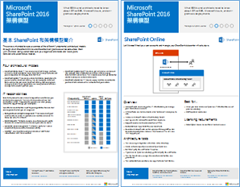
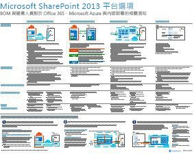
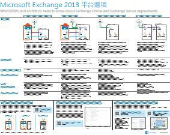
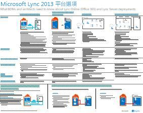

# 適用於 SharePoint、Exchange、Skype for Business 和 Lync 的架構模型Architectural models for SharePoint, Exchange, Skype for Business, and Lync

 **摘要：**取得 IT 海報說明架構模型、 部署及 SharePoint、 Exchange、 Skype for Business 和 Lync 的平台選項。**Summary:** Get the IT posters that describe the architectural models, deployment, and platform options for SharePoint, Exchange, Skype for Business, and Lync.
  
這些 IT 海報描述適用於 SharePoint、Exchange、商務用 Skype 和 Lync 的結構模型和部署選項，並提供在 Microsoft Azure 內部署 SharePoint 的設計資訊。These IT posters describe the architectural models and deployment options for SharePoint, Exchange, Skype for Business, and Lync, and they provide design information for deploying SharePoint in Microsoft Azure.
  
與 Office 365，您可以提供使用者熟悉以雲端式服務的共同作業及通訊服務。有幾個例外的使用者經驗維持不變是否要維護的內部部署或使用 Office 365。此整合的使用者經驗會決定要放置每個工作負載較簡單和例如會導致問題：With Office 365, you can provide the collaboration and communication services your users are familiar with as a cloud-based service. With a few exceptions, the user experience remains the same whether you are maintaining an on-premises deployment or using Office 365. This unified user experience makes it less straightforward to decide where to place each workload and raises questions such as:
  
- 當為您的個別工作負載選擇平台時，您會如何判斷？How do you determine which platform option to choose for your individual workloads?
    
- 是否應該保留任何內部部署服務？Does it make sense to keep any service on-premises?
    
- 擁有適當混合式部署的案例是怎麼樣的？What is a scenario where a hybrid deployment is appropriate?
    
- Microsoft Azure 如何配合的圖片中？How does Microsoft Azure fit in the picture?
    
- 在 Azure 內 Office Sever 工作負載的支援組態為何？What are the supported configurations for Office Server workloads in Azure?
    
> [!TIP]
> 此頁面上的海報大多提供多種語言版本，包括中文、英文、法文、德文、義大利文、日文、韓文、葡萄牙文、俄文和西班牙文。若要下載以上其中一種語言的海報，請按一下該海報的 [更多語言] 連結。讓我們知道您的想法！Most of the posters on this page are available in multiple languages, including Chinese, English, French, German, Italian, Japanese, Korean, Portuguese, Russian, and Spanish. To download a poster in one of these languages, click the **More languages** link for that poster.
  
請傳送電子郵件給我們：[cloudadopt@microsoft.com](mailto:cloudadopt@microsoft.com)。Let us know what you think! Send us email at [cloudadopt@microsoft.com](mailto:cloudadopt@microsoft.com). 
  
此頁面可讓您連結到下列的海報︰This page links you to the following posters:
  
- **架構模型海報 （英文）**您可以使用這些資源來判斷您的理想的平台和設定 SharePoint 2016 和 Skype 的商務 2015年。**Architectural models posters** You can use these resources to determine your ideal platform and configuration for SharePoint 2016 and Skype for Business 2015.
    
  - [Microsoft SharePoint 2016 架構模型Microsoft SharePoint 2016 Architectural Models](architectural-models-for-sharepoint-exchange-skype-for-business-and-lync.md#SP2016_ArchModel)
    
  - [在 Office 365 的 OneDrive 的多個地理位置預覽Multi-Geo Preview for OneDrive in Office 365](architectural-models-for-sharepoint-exchange-skype-for-business-and-lync.md#MultiGeoO365ODB)
    
  - [SharePoint Server 2016 資料庫SharePoint Server 2016 Databases](architectural-models-for-sharepoint-exchange-skype-for-business-and-lync.md#SP2016_Databases)
    
  - [Microsoft Skype 商務 2015年架構模型Microsoft Skype for Business 2015 Architectural Models](architectural-models-for-sharepoint-exchange-skype-for-business-and-lync.md#SfB2015_ArchModel)
    
- **平台選項海報 （英文）**您可以使用這些資源來判斷您的理想的平台和 SharePoint 2013、 Exchange 2013 和 Lync 2013 的設定。**Platform options posters** You can use these resources to determine your ideal platform and configuration for SharePoint 2013, Exchange 2013, and Lync 2013.
    
  - [SharePoint 2013 平台選項SharePoint 2013 Platform Options](architectural-models-for-sharepoint-exchange-skype-for-business-and-lync.md#SP2013_Options)
    
  - [Exchange 2013 平台選項Exchange 2013 Platform Options](architectural-models-for-sharepoint-exchange-skype-for-business-and-lync.md#Exch2013_options)
    
  - [Lync 2013 平台選項Lync 2013 Platform Options](architectural-models-for-sharepoint-exchange-skype-for-business-and-lync.md#Lync2013_Options)
    
- **SharePoint Server 2013 in Azure 解決方案海報 （英文）**您可以使用這些 IT 海報 （英文） 決定的設計與 SharePoint Server 2013 工作量 Azure 基礎結構服務中的設定。**SharePoint Server 2013 in Azure solutions posters** You can use these IT posters to determine the design and configuration for SharePoint Server 2013 workloads in Azure infrastructure services.
    
  - [Microsoft Azure using SharePoint Server 2013 中的網際網路網站Internet sites in Microsoft Azure using SharePoint Server 2013](architectural-models-for-sharepoint-exchange-skype-for-business-and-lync.md#Azure_sharepoint2013)
    
  - [設計範例： Microsoft Azure 中的 SharePoint 2013 的網際網路網站Design sample: Internet sites in Microsoft Azure for SharePoint 2013](architectural-models-for-sharepoint-exchange-skype-for-business-and-lync.md#DesignSampleInternetSites)
    
  - [以 Microsoft Azure 的 SharePoint 災害復原SharePoint Disaster Recovery to Microsoft Azure](architectural-models-for-sharepoint-exchange-skype-for-business-and-lync.md#sharepoint_recovery_Azure)
    
## 架構模型海報Architectural models posters

這些新推出的 SharePoint 2016 和商務用 Skype 2015 IT 海報會以方便列印的格式，提供方法來比較不同的部署方法。每份海報會提供一份清單，內含所有可用的組態或平台，並提供每個選項的下列資訊︰These new IT posters for SharePoint 2016 and Skype for Business 2015 provide a way to compare the various deployment methods in an easy-to-print format. Each poster provides a list of all the configurations or platform options available and gives you the following information for each option:
  
- **概觀 （英文)**平台，包括概念圖表簡短摘要。**Overview** A brief summary of the platform, including a conceptual diagram.
    
- **適合**在理想狀況下適合特定的平台的常見案例。**Best for** Common scenarios that are ideally suited for the particular platform.
    
- **授權需求**您必須部署的授權。**License requirements** The licenses you need for deployment.
    
- **架構工作**您必須制定作為架構師決策。**Architecture tasks** The decisions you need to make as an architect.
    
- **IT 專業人員的任務或責任**您的 IT 人員需要規劃的每日的責任。**IT Pro tasks or responsibilities** The daily responsibilities that your IT staff needs to plan for.
    
### Microsoft SharePoint 2016 架構模型Microsoft SharePoint 2016 Architectural Models

|**項目****Item**|**描述****Description**|
|:-----|:-----|
|[          ](https://www.microsoft.com/download/details.aspx?id=52650)[          ](https://www.microsoft.com/download/details.aspx?id=52650)   [PDF](https://download.microsoft.com/download/4/F/A/4FA0F94B-EE2F-41DB-A047-D9864FEF41E9/SharePoint2016ArchitecturalModels.pdf)  \\[PDF](https://download.microsoft.com/download/4/F/A/4FA0F94B-EE2F-41DB-A047-D9864FEF41E9/SharePoint2016ArchitecturalModels.pdf)  \\| [Visio](https://download.microsoft.com/download/4/F/A/4FA0F94B-EE2F-41DB-A047-D9864FEF41E9/SharePoint2016ArchitecturalModels.vsdx)  \\[Visio](https://download.microsoft.com/download/4/F/A/4FA0F94B-EE2F-41DB-A047-D9864FEF41E9/SharePoint2016ArchitecturalModels.vsdx)  \\| [更多語言](https://www.microsoft.com/download/details.aspx?id=52650)[More languages](https://www.microsoft.com/download/details.aspx?id=52650)   | 此 IT 海報描述商務決策者和解決方案架構設計人員需了解的 SharePoint Online、Microsoft Azure 和 SharePoint 內部部署組態。This IT poster describes the SharePoint Online, Microsoft Azure, and SharePoint on-premises configurations that business decision makers and solutions architects need to know about.    - **SharePoint Online (SaaS)** -取用 SharePoint 透過軟體即服務 (SaaS) 訂閱模型。- **SharePoint Online (SaaS)** - Consume SharePoint through a Software as a Service (SaaS) subscription model.   - **SharePoint 混合式**-將您的 SharePoint 網站和應用程式移至您自己的腳步雲端。- **SharePoint Hybrid** - Move your SharePoint sites and apps to the cloud at your own pace.   - **Azure (IaaS) 中的 SharePoint** -您擴充 Microsoft Azure 到內部部署環境及部署 SharePoint 2016 伺服器發生。（這是高可用性/嚴重損壞修復及開發人員/測試環境的建議）。- **SharePoint in Azure (IaaS)** - You extend your on-premises environment into Microsoft Azure and deploy SharePoint 2016 Servers there. (This is recommended for High Availability/Disaster Recovery and dev/test environments.)   - **SharePoint 內部**-規劃、 部署、 維護及自訂 SharePoint 環境中您維護資料中心。- **SharePoint On-premises** - You plan, deploy, maintain and customize your SharePoint environment in a datacenter that you maintain.   |
   
### 在 Office 365 的 OneDrive 的多個地理位置預覽Multi-Geo Preview for OneDrive in Office 365

|**項目****Item**|**描述****Description**|
|:-----|:-----|
|[          ](http://download.microsoft.com/download/0/5/9/0594634F-7893-4201-938A-C2FF2F21B655/Multi-Geo-ODB.pdf)[          ](http://download.microsoft.com/download/0/5/9/0594634F-7893-4201-938A-C2FF2F21B655/Multi-Geo-ODB.pdf)   [PDF](http://download.microsoft.com/download/0/5/9/0594634F-7893-4201-938A-C2FF2F21B655/Multi-Geo-ODB.pdf)  \\[PDF](http://download.microsoft.com/download/0/5/9/0594634F-7893-4201-938A-C2FF2F21B655/Multi-Geo-ODB.pdf)  \\| [Visio](http://download.microsoft.com/download/0/5/9/0594634F-7893-4201-938A-C2FF2F21B655/Multi-Geo-ODB.vsdx)[Visio](http://download.microsoft.com/download/0/5/9/0594634F-7893-4201-938A-C2FF2F21B655/Multi-Geo-ODB.vsdx)   | 此模型是在 Office 365，仍在私人 preview 中的多個地理位置 OneDrive 的一個頁面概觀。此模型包含：This model is a one-page overview of Multi-Geo OneDrive in Office 365, which is currently in private preview. This model includes:    -優點- Benefits   -部署步驟- Steps for deployment   -設定範例- An example configuration     在 Office 365 的 OneDrive 的多個地理位置 Preview 的相關資訊，請按一下[這裡](https://aka.ms/onedrivemultigeo)。For more information about the Multi-Geo Preview for OneDrive in Office 365, click [here](https://aka.ms/onedrivemultigeo).    |
   
### SharePoint Server 2016 資料庫SharePoint Server 2016 Databases

|**項目****Item**|**描述****Description**|
|:-----|:-----|
|[          ](https://www.microsoft.com/download/details.aspx?id=55041)[          ](https://www.microsoft.com/download/details.aspx?id=55041)   [PDF](https://download.microsoft.com/download/D/5/D/D5DC1121-8BC5-4953-834F-1B5BB03EB691/DBrefguideSPS2016_tabloid.pdf)  \\[PDF](https://download.microsoft.com/download/D/5/D/D5DC1121-8BC5-4953-834F-1B5BB03EB691/DBrefguideSPS2016_tabloid.pdf)  \\| [Visio](https://download.microsoft.com/download/D/5/D/D5DC1121-8BC5-4953-834F-1B5BB03EB691/DBrefguideSPS2016_tabloid.vsdx)  \\[Visio](https://download.microsoft.com/download/D/5/D/D5DC1121-8BC5-4953-834F-1B5BB03EB691/DBrefguideSPS2016_tabloid.vsdx)  \\| [更多語言](https://www.microsoft.com/download/details.aspx?id=55041)[More languages](https://www.microsoft.com/download/details.aspx?id=55041)   | 此 IT 海報是適用於 SharePoint Server 2016 資料庫的快速參考指南。每個資料庫均會有以下詳細資料：This IT poster is a quick reference guide for SharePoint Server 2016 databases. Each database has the following details:    半形- Size   -調整指導- Scaling guidance   -I/O 模式- I/O patterns   -需求- Requirements     第一頁包含 SharePoint 系統資料庫和擁有多個資料庫的服務應用程式。第二個頁面會顯示所有具有單一資料庫的服務應用程式。The first page contains the SharePoint system databases and the service applications that have multiple databases. The second page shows all of the service applications that have single databases.     如需 SharePoint Server 2016 資料庫的詳細資訊，請參閱[資料庫類型與描述在 SharePoint Server 2016](https://technet.microsoft.com/en-us/library/cc678868%28v=office.16%29.aspx)For more information about the SharePoint Server 2016 databases, see [Database types and descriptions in SharePoint Server 2016](https://technet.microsoft.com/en-us/library/cc678868%28v=office.16%29.aspx)   |
   
### Microsoft 商務用 Skype 2015 架構模型Microsoft Skype for Business 2015 Architectural Models

|**項目****Item**|**描述****Description**|
|:-----|:-----|
|[          ](https://www.microsoft.com/download/details.aspx?id=55022)[          ](https://www.microsoft.com/download/details.aspx?id=55022)   [PDF](https://download.microsoft.com/download/7/7/4/7741262C-A60D-41F7-863B-99BF5964FBFE/Skype%20for%20Business%20Architectural%20Models.pdf)  \\[PDF](https://download.microsoft.com/download/7/7/4/7741262C-A60D-41F7-863B-99BF5964FBFE/Skype%20for%20Business%20Architectural%20Models.pdf)  \\| [Visio](https://download.microsoft.com/download/7/7/4/7741262C-A60D-41F7-863B-99BF5964FBFE/Skype%20for%20Business%20Architectural%20Models.vsd)  \\[Visio](https://download.microsoft.com/download/7/7/4/7741262C-A60D-41F7-863B-99BF5964FBFE/Skype%20for%20Business%20Architectural%20Models.vsd)  \\| [更多語言](https://www.microsoft.com/download/details.aspx?id=55022)[More languages](https://www.microsoft.com/download/details.aspx?id=55022)   |此海報說明 Skype 商務 Online、 內部部署、 混合、 雲端 PBX 與整合 Exchange 和 SharePoint 設定該商務決策者適用及解決方案架構師需要了解。This poster describes the Skype for Business Online, on-premises, hybrid, cloud PBX, and integration with Exchange and SharePoint configurations that business decision makers and solutions architects need to know about.    擬引發傳達方式的不同的基礎架構模型透過商務 online Skype 和 Skype 的內部部署商務可供 IT 專業人員的對象。It is intended for the IT Pro audience to raise awareness of the different fundamental architectural models through which Skype for Business Online and Skype for Business on premises can be consumed.   開始使用最佳無論設定符合貴組織的需求和未來的計劃。請考慮並視需要使用其他人。例如，您可能要考慮整合 Exchange 和 SharePoint 或 Microsoft Cloud PBX 可以利用的解決方案。Start with whichever configuration best suits your organization's needs and future plans. Consider and use others as needed. For example, you might want to consider integration with Exchange and SharePoint or a solution that takes advantage of Microsoft's Cloud PBX offering.    |
   
## 平台選項海報Platform options posters

這些適用於 SharePoint 2013、Exchange 2013 和 Lync 2013 的 IT 海報，會以大型海報格式，來比較不同的部署方法，讓差異一目了然。每份海報會提供一份清單，內含所有可用的組態或平台，並提供每個選項的下列資訊︰These IT posters for SharePoint 2013, Exchange 2013, and Lync 2013 provide a way to compare the various deployment methods at a single glance in a large poster format. Each poster provides a list of all the configurations or platform options available and gives you the following information for each option:
  
- **概觀 （英文)**平台，包括概念圖表簡短摘要。**Overview** A brief summary of the platform, including a conceptual diagram.
    
- **適合**在理想狀況下適合特定的平台的常見案例。**Best for** Common scenarios that are ideally suited for the particular platform.
    
- **授權需求**您必須部署的授權。**License requirements** The licenses you need for deployment.
    
- **架構工作**您必須制定作為架構師決策。**Architecture tasks** The decisions you need to make as an architect.
    
- **IT 專業人員的任務或責任**您的 IT 人員需要規劃的每日的責任。**IT Pro tasks or responsibilities** The daily responsibilities that your IT staff needs to plan for.
    
## SharePoint 2013 平台選項SharePoint 2013 Platform Options

****

|**項目****Item**|**描述****Description**|
|:-----|:-----|
|[          ](https://www.microsoft.com/download/details.aspx?id=40332)[          ](https://www.microsoft.com/download/details.aspx?id=40332)   [PDF](http://go.microsoft.com/fwlink/p/?LinkId=324594)  \\[PDF](http://go.microsoft.com/fwlink/p/?LinkId=324594)  \\| [Visio](https://go.microsoft.com/fwlink/p/?LinkId=324593)  \\[Visio](https://go.microsoft.com/fwlink/p/?LinkId=324593)  \\| [更多語言](https://www.microsoft.com/download/details.aspx?id=40332)[More languages](https://www.microsoft.com/download/details.aspx?id=40332)   |如需商務決策者 (Bdm) 和架構師，此模型說明 SharePoint 2013、 Office 365、 Office 365、 Azure、 與內部部署僅部署的內部部署混合式中的 SharePoint 平台選項。包含每個架構、 建議、 授權需求及架構師和 IT 專業人員必須針對每個平台的工作清單的概觀。會醒目提示的數個 Azure 上的 SharePoint 解決方案。For business decision makers (BDMs) and architects, this model illustrates the platform options for SharePoint 2013, SharePoint in Office 365, on-premises hybrid with Office 365, Azure, and on-premises only deployments. It includes an overview of each architecture, recommendations, license requirements, and lists of architect and IT Pro tasks for each platform. Several SharePoint solutions on Azure are highlighted.   此海報可存取的文字版本，請參閱 ＜[存取圖表-Microsoft SharePoint 2013 Platform Options](accessible-diagrammicrosoft-sharepoint-2013-platform-options.md)。For an accessible text version of this poster, see [Accessible diagram - Microsoft SharePoint 2013 Platform Options](accessible-diagrammicrosoft-sharepoint-2013-platform-options.md).    |
   
## Exchange 2013 平台選項Exchange 2013 Platform Options

****

|**項目****Item**|**描述****Description**|
|:-----|:-----|
|[          ](https://www.microsoft.com/download/details.aspx?id=42676)[          ](https://www.microsoft.com/download/details.aspx?id=42676)   [PDF](https://go.microsoft.com/fwlink/p/?LinkID=398740)  \\[PDF](https://go.microsoft.com/fwlink/p/?LinkID=398740)  \\| [Visio](https://go.microsoft.com/fwlink/p/?LinkID=398742)  \\[Visio](https://go.microsoft.com/fwlink/p/?LinkID=398742)  \\| [更多語言](https://www.microsoft.com/download/details.aspx?id=42676)[More languages](https://www.microsoft.com/download/details.aspx?id=42676)   |Bdm 及架構師，此模型說明 Exchange 2013 可用的平台選項。客戶可以從 Exchange Online 與 Office 365，混合式 Exchange，Exchange Server 內部部署和裝載 Exchange 選擇。海報包含每個架構] 選項，包括每個、 授權需求以及 IT 專業人員的責任最理想的情況的詳細資訊。For BDMs and architects, this model describes the available platform options for Exchange 2013. Customers can choose from Exchange Online with Office 365, Hybrid Exchange, Exchange Server on-premises and Hosted Exchange. The poster includes details of each architectural option, including the most ideal scenarios for each, the license requirements and IT Pro responsibilities.   此海報可存取的文字版本，請參閱 ＜[存取圖表-Microsoft Exchange 2013 平台選項](accessible-diagrammicrosoft-exchange-2013-platform-options.md)。For an accessible text version of this poster, see [Accessible diagram - Microsoft Exchange 2013 Platform Options](accessible-diagrammicrosoft-exchange-2013-platform-options.md).    |
   
## Lync 2013 平台選項Lync 2013 Platform Options

****

|**項目****Item**|**描述****Description**|
|:-----|:-----|
|[          ](https://www.microsoft.com/download/details.aspx?id=41677)[          ](https://www.microsoft.com/download/details.aspx?id=41677)   [PDF](https://go.microsoft.com/fwlink/p/?LinkID=391837)  \\[PDF](https://go.microsoft.com/fwlink/p/?LinkID=391837)  \\| [Visio](https://go.microsoft.com/fwlink/p/?LinkID=391839)  \\[Visio](https://go.microsoft.com/fwlink/p/?LinkID=391839)  \\| [更多語言](https://www.microsoft.com/download/details.aspx?id=41677)[More languages](https://www.microsoft.com/download/details.aspx?id=41677)   |對於 BDM 和架構設計人員，這種模型會描述 Exchange 2013 可用的平台選項。客戶可以從 Office 365 中的 Exchange Online、混合式 Exchange、內部部署 Exchange Server 和 Exchange 託管中選擇。IT 海報包含每個架構的選項，包括最理想的情況下，每一個授權需求以及 IT 專業人員的責任。  For BDMs and architects, this model describes the available platform options for Lync 2013. Customers can choose from Lync Online with Office 365, Hybrid Lync, Lync Server on-premises and Hosted Lync. The IT poster includes details of each architectural option, including the most ideal scenarios for each, the license requirements and IT Pro responsibilities.    |
   
## Azure 解決方案海報內的 SharePointSharePoint in Azure solutions posters

這些 IT 海報 （英文） 會顯示使用中的大型海報格式的 SharePoint Server 2013 的 Azure 型解決方案。These IT posters show Azure-based solutions using SharePoint Server 2013 in a large poster format.
  
### Microsoft Azure 中使用 SharePoint Server 2013 的網際網路網站Internet sites in Microsoft Azure using SharePoint Server 2013

****

|**項目****Item**|**描述****Description**|
|:-----|:-----|
|[          ](https://www.microsoft.com/download/details.aspx?id=41992)[          ](https://www.microsoft.com/download/details.aspx?id=41992)   [PDF](https://go.microsoft.com/fwlink/p/?LinkId=392552)  \\[PDF](https://go.microsoft.com/fwlink/p/?LinkId=392552)  \\| [Visio](https://go.microsoft.com/fwlink/p/?LinkId=392551)  \\[Visio](https://go.microsoft.com/fwlink/p/?LinkId=392551)  \\| [更多語言](https://www.microsoft.com/download/details.aspx?id=41992)[More languages](https://www.microsoft.com/download/details.aspx?id=41992)   |此海報概述重要的設計活動和建議的網際網路 Azure 中的網站架構選項。此海報可存取的文字版本，請參閱 ＜[存取圖表-Microsoft Azure 中的 SharePoint 2013 的網際網路網站](accessible-diagraminternet-sites-in-microsoft-azure-for-sharepoint-2013.md)。This poster outlines key design activities and recommended architecture choices for Internet-facing sites in Azure. For an accessible text version of this poster, see [Accessible diagram - Internet sites in Microsoft Azure for SharePoint 2013](accessible-diagraminternet-sites-in-microsoft-azure-for-sharepoint-2013.md).     如需詳細資訊，請參閱下列文章：For more information, see the following articles:     - [Microsoft Azure using SharePoint Server 2013 中的網際網路網站](internet-sites-in-microsoft-azure-using-sharepoint-server-2013.md)- [Internet Sites in Microsoft Azure using SharePoint Server 2013](internet-sites-in-microsoft-azure-using-sharepoint-server-2013.md)   - [Microsoft Azure Architectures for SharePoint 2013](microsoft-azure-architectures-for-sharepoint-2013.md)- [Microsoft Azure Architectures for SharePoint 2013](microsoft-azure-architectures-for-sharepoint-2013.md)   - [使用 Microsoft Azure Active Directory 的 SharePoint 2013 驗證](using-microsoft-azure-active-directory-for-sharepoint-2013-authentication.md)- [Using Microsoft Azure Active Directory for SharePoint 2013 authentication](using-microsoft-azure-active-directory-for-sharepoint-2013-authentication.md)   |
   
### 設計範例：Microsoft Azure 中的 SharePoint 2013 網際網路網站Design sample: Internet sites in Microsoft Azure for SharePoint 2013

****

|**項目****Item**|**描述****Description**|
|:-----|:-----|
|[          ](https://www.microsoft.com/download/details.aspx?id=41991)[          ](https://www.microsoft.com/download/details.aspx?id=41991)   [PDF](https://go.microsoft.com/fwlink/p/?LinkId=392549)  \\[PDF](https://go.microsoft.com/fwlink/p/?LinkId=392549)  \\| [Visio](https://go.microsoft.com/fwlink/p/?LinkId=392548)  \\[Visio](https://go.microsoft.com/fwlink/p/?LinkId=392548)  \\| [更多語言](https://www.microsoft.com/download/details.aspx?id=41991)[More languages](https://www.microsoft.com/download/details.aspx?id=41991)   |使用此設計範例為起點網際網路對向網站架構在 Azure 中使用 SharePoint Server 2013。此海報可存取的文字版本，請參閱 ＜[存取圖表-設計範例： Microsoft Azure 中的 SharePoint 2013 的網際網路網站](accessible-diagramdesign-sample-internet-sites-in-microsoft-azure-for-sharepoint.md)。Use this design sample as a starting point for your own architecture Internet-facing site in Azure using SharePoint Server 2013. For an accessible text version of this poster, see [Accessible diagram - Design sample: Internet sites in Microsoft Azure for SharePoint 2013](accessible-diagramdesign-sample-internet-sites-in-microsoft-azure-for-sharepoint.md).     如需詳細資訊，請參閱下列文章：For more information, see the following articles:     - [Microsoft Azure using SharePoint Server 2013 中的網際網路網站](internet-sites-in-microsoft-azure-using-sharepoint-server-2013.md)- [Internet Sites in Microsoft Azure using SharePoint Server 2013](internet-sites-in-microsoft-azure-using-sharepoint-server-2013.md)   - [Microsoft Azure Architectures for SharePoint 2013](microsoft-azure-architectures-for-sharepoint-2013.md)- [Microsoft Azure Architectures for SharePoint 2013](microsoft-azure-architectures-for-sharepoint-2013.md)   - [使用 Microsoft Azure Active Directory 的 SharePoint 2013 驗證](using-microsoft-azure-active-directory-for-sharepoint-2013-authentication.md)- [Using Microsoft Azure Active Directory for SharePoint 2013 authentication](using-microsoft-azure-active-directory-for-sharepoint-2013-authentication.md)   |
   
### 對於 Microsoft Azure 的 SharePoint 嚴重損壞修復SharePoint Disaster Recovery to Microsoft Azure

****

|**項目****Item**|**描述****Description**|
|:-----|:-----|
|[          ](https://www.microsoft.com/download/details.aspx?id=41993)[          ](https://www.microsoft.com/download/details.aspx?id=41993)   [PDF](https://go.microsoft.com/fwlink/p/?LinkId=392555)  \\[PDF](https://go.microsoft.com/fwlink/p/?LinkId=392555)  \\| [Visio](https://go.microsoft.com/fwlink/p/?LinkId=392554)  \\[Visio](https://go.microsoft.com/fwlink/p/?LinkId=392554)  \\| [更多語言](https://www.microsoft.com/download/details.aspx?id=41993)[More languages](https://www.microsoft.com/download/details.aspx?id=41993)   |此 IT 海報說明 Azure 中的災害復原環境的架構原則。此海報可存取的文字版本，請參閱 ＜[存取圖表-至 Microsoft Azure 的 SharePoint 災害復原](accessible-diagramsharepoint-disaster-recovery-to-microsoft-azure.md)。This IT poster illustrates architecture principles for a disaster recovery environment in Azure. For an accessible text version of this poster, see [Accessible diagram - SharePoint Disaster Recovery to Microsoft Azure](accessible-diagramsharepoint-disaster-recovery-to-microsoft-azure.md).     如需詳細資訊，請參閱下列文章：For more information, see the following articles:     - [SharePoint Server 2013 Disaster Recovery in Microsoft Azure](sharepoint-server-2013-disaster-recovery-in-microsoft-azure.md)- [SharePoint Server 2013 Disaster Recovery in Microsoft Azure](sharepoint-server-2013-disaster-recovery-in-microsoft-azure.md)   - [Microsoft Azure Architectures for SharePoint 2013](microsoft-azure-architectures-for-sharepoint-2013.md)- [Microsoft Azure Architectures for SharePoint 2013](microsoft-azure-architectures-for-sharepoint-2013.md)   |
   
## See AlsoSee Also

[雲端採用和混合式解決方案Cloud adoption and hybrid solutions](cloud-adoption-and-hybrid-solutions.md)
  
[Microsoft Cloud IT 架構資源Microsoft Cloud IT architecture resources](microsoft-cloud-it-architecture-resources.md)
  
[雲端採用測試實驗室指南 (Tlg)Cloud adoption Test Lab Guides (TLGs)](cloud-adoption-test-lab-guides-tlgs.md)
  
[混合式解決方案Hybrid solutions](hybrid-solutions.md)

