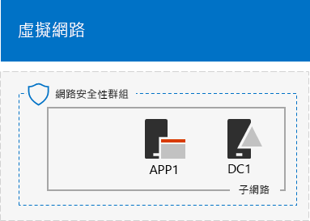

# <a name="base-configuration-devtest-environment"></a><span data-ttu-id="26305-103">基本組態開發/測試環境</span><span class="sxs-lookup"><span data-stu-id="26305-103">Base Configuration dev/test environment</span></span>

 <span data-ttu-id="26305-104">**摘要：**為 Microsoft Azure 中的開發人員/測試環境中建立簡化的內部網路。</span><span class="sxs-lookup"><span data-stu-id="26305-104">**Summary:** Create a simplified intranet as a dev/test environment in Microsoft Azure.</span></span>
  
<span data-ttu-id="26305-105">本文提供在 Azure 中建立下列的基本設定開發/測試環境的逐步指示：</span><span class="sxs-lookup"><span data-stu-id="26305-105">This article provides you with step-by-step instructions to create the following Base Configuration dev/test environment in Azure:</span></span>
  
<span data-ttu-id="26305-106">**圖 1： 基本設定開發/測試環境**</span><span class="sxs-lookup"><span data-stu-id="26305-106">**Figure 1: The Base Configuration dev/test environment**</span></span>


  
<span data-ttu-id="26305-p101">圖 1 中的基本設定開發/測試環境所組成的僅限雲端 Azure 虛擬網路中名為會模擬簡體中文、 私人的內部網路連線至網際網路的 TestLab 依舊套用子網路。包含三個 Azure 的虛擬機器執行 Windows Server 2016：</span><span class="sxs-lookup"><span data-stu-id="26305-p101">The Base Configuration dev/test environment in Figure 1 consists of the Corpnet subnet in a cloud-only Azure virtual network named TestLab that simulates a simplified, private intranet connected to the Internet. It contains three Azure virtual machines running Windows Server 2016:</span></span>
  
- <span data-ttu-id="26305-110">DC1 設定為內部網路網域控制站和網域名稱系統 (DNS) 伺服器</span><span class="sxs-lookup"><span data-stu-id="26305-110">DC1 is configured as an intranet domain controller and Domain Name System (DNS) server</span></span>
    
- <span data-ttu-id="26305-111">在 APP1 設定為一般應用程式與網頁伺服器</span><span class="sxs-lookup"><span data-stu-id="26305-111">APP1 is configured as a general application and web server</span></span>
    
- <span data-ttu-id="26305-112">CLIENT1 做為內部網路用戶端</span><span class="sxs-lookup"><span data-stu-id="26305-112">CLIENT1 acts as an intranet client</span></span>
    
<span data-ttu-id="26305-113">此設定可讓 DC1、 APP1、 CLIENT1 及其他依舊套用子網路的電腦設為：</span><span class="sxs-lookup"><span data-stu-id="26305-113">This configuration allows DC1, APP1, CLIENT1, and additional Corpnet subnet computers to be:</span></span> 
  
- <span data-ttu-id="26305-114">連線至網際網路安裝更新，存取網際網路資源即時，並參與公用雲端技術，例如 Microsoft Office 365 與其他 Azure 的服務。</span><span class="sxs-lookup"><span data-stu-id="26305-114">Connected to the Internet to install updates, access Internet resources in real time, and participate in public cloud technologies such as Microsoft Office 365 and other Azure services.</span></span>
    
- <span data-ttu-id="26305-115">從遠端管理使用遠端桌面連線從您連線至網際網路或您組織的網路的電腦。</span><span class="sxs-lookup"><span data-stu-id="26305-115">Remotely managed using Remote Desktop connections from your computer that is connected to the Internet or your organization network.</span></span>
    
<span data-ttu-id="26305-116">您可以使用所產生的測試環境：</span><span class="sxs-lookup"><span data-stu-id="26305-116">You can use the resulting test environment:</span></span>
  
- <span data-ttu-id="26305-117">適用於應用程式開發及測試。</span><span class="sxs-lookup"><span data-stu-id="26305-117">For application development and testing.</span></span>
    
- <span data-ttu-id="26305-118">為包含其他虛擬機器、 Azure 服務或 Office 365 和企業安全性 + 行動性等其他 Microsoft cloud 方案自行設計延伸的測試環境的初始設定。</span><span class="sxs-lookup"><span data-stu-id="26305-118">As the initial configuration of an extended test environment of your own design that includes additional virtual machines, Azure services, or other Microsoft cloud offerings such as Office 365 and Enterprise Security + Mobility.</span></span>
    
<span data-ttu-id="26305-119">有四個階段來設定 Azure 中的基本設定測試環境：</span><span class="sxs-lookup"><span data-stu-id="26305-119">There are four phases to setting up the Base Configuration test environment in Azure:</span></span>
  
1. <span data-ttu-id="26305-120">建立虛擬網路。</span><span class="sxs-lookup"><span data-stu-id="26305-120">Create the virtual network.</span></span>
    
2. <span data-ttu-id="26305-121">設定 DC1。</span><span class="sxs-lookup"><span data-stu-id="26305-121">Configure DC1.</span></span>
    
3. <span data-ttu-id="26305-122">設定 APP1。</span><span class="sxs-lookup"><span data-stu-id="26305-122">Configure APP1.</span></span>
    
4. <span data-ttu-id="26305-123">設定 CLIENT1。</span><span class="sxs-lookup"><span data-stu-id="26305-123">Configure CLIENT1.</span></span>
    
<span data-ttu-id="26305-p102">如果您已經沒有 Azure 訂閱，您可以註冊在[嘗試 Azure](https://azure.microsoft.com/pricing/free-trial/)免費試用版。如果您有 MSDN 或 Visual Studio 訂閱，請參閱[Visual Studio 訂閱者的每月 Azure 信用](https://azure.microsoft.com/pricing/member-offers/msdn-benefits-details/)。</span><span class="sxs-lookup"><span data-stu-id="26305-p102">If you do not already have an Azure subscription, you can sign up for a free trial at [Try Azure](https://azure.microsoft.com/pricing/free-trial/). If you have an MSDN or Visual Studio subscription, see [Monthly Azure credit for Visual Studio subscribers](https://azure.microsoft.com/pricing/member-offers/msdn-benefits-details/).</span></span>
  
> [!NOTE]
> <span data-ttu-id="26305-p103">當他們正在執行時在 Azure 虛擬機器時可能會形成持續進行的財務成本。此成本是針對在免費試用版、 MSDN 訂閱計費或付費訂閱。Azure 虛擬機器中執行的成本的相關資訊，請參閱[虛擬機器定價的詳細資訊](https://azure.microsoft.com/pricing/details/virtual-machines/)與[Azure 定價計算機](https://azure.microsoft.com/pricing/calculator/)。若要保留成本向下，請參閱[Azure 中的測試環境虛擬機器時的成本最小化](base-configuration-dev-test-environment.md#mincost)。</span><span class="sxs-lookup"><span data-stu-id="26305-p103">Virtual machines in Azure incur an ongoing monetary cost when they are running. This cost is billed against your free trial, MSDN subscription, or paid subscription. For more information about the costs of running Azure virtual machines, see [Virtual Machines Pricing Details](https://azure.microsoft.com/pricing/details/virtual-machines/) and [Azure Pricing Calculator](https://azure.microsoft.com/pricing/calculator/). To keep costs down, see [Minimizing the costs of test environment virtual machines in Azure](base-configuration-dev-test-environment.md#mincost).</span></span> 
  

  
> [!TIP]
> <span data-ttu-id="26305-131">按一下[此處](http://aka.ms/catlgstack)的視覺對應至一個 Microsoft Cloud 測試實驗室指南堆疊中所有的文章。</span><span class="sxs-lookup"><span data-stu-id="26305-131">Click [here](http://aka.ms/catlgstack) for a visual map to all the articles in the One Microsoft Cloud Test Lab Guide stack.</span></span>
  
## <a name="phase-1-create-the-virtual-network"></a><span data-ttu-id="26305-132">階段 1： 建立虛擬網路</span><span class="sxs-lookup"><span data-stu-id="26305-132">Phase 1: Create the virtual network</span></span>

<span data-ttu-id="26305-133">首先，啟動 Azure PowerShell 提示字元處。</span><span class="sxs-lookup"><span data-stu-id="26305-133">First, start an Azure PowerShell prompt.</span></span>
  
> [!NOTE]
> <span data-ttu-id="26305-p104">下列的命令會使用 Azure PowerShell 的最新版本。請參閱[開始使用 Azure PowerShell cmdlet](https://docs.microsoft.com/en-us/powershell/azureps-cmdlets-docs/)。</span><span class="sxs-lookup"><span data-stu-id="26305-p104">The following command sets use the latest version of Azure PowerShell. See [Get started with Azure PowerShell cmdlets](https://docs.microsoft.com/en-us/powershell/azureps-cmdlets-docs/).</span></span> 
  
<span data-ttu-id="26305-136">下列命令以 Azure 帳戶登入。</span><span class="sxs-lookup"><span data-stu-id="26305-136">Sign in to your Azure account with the following command.</span></span>
  
```
Login-AzureRMAccount
```

> [!TIP]
> <span data-ttu-id="26305-137">按一下[這裡](https://gallery.technet.microsoft.com/PowerShell-commands-for-ba957d3d)以取得包含在本文中的所有 PowerShell 命令的文字檔案。</span><span class="sxs-lookup"><span data-stu-id="26305-137">Click [here](https://gallery.technet.microsoft.com/PowerShell-commands-for-ba957d3d) to get a text file that contains all the PowerShell commands in this article.</span></span>
  
<span data-ttu-id="26305-138">使用下列命令取得訂用帳戶名稱。</span><span class="sxs-lookup"><span data-stu-id="26305-138">Get your subscription name using the following command.</span></span>
  
```
Get-AzureRMSubscription | Sort Name | Select Name
```

<span data-ttu-id="26305-p105">設定 Azure 訂用帳戶。以正確的名稱取代括號中的所有項目 (包括 < 和 > 字元)。</span><span class="sxs-lookup"><span data-stu-id="26305-p105">Set your Azure subscription. Replace everything within the quotes, including the < and > characters, with the correct name.</span></span>
  
```
$subscr="<subscription name>"
Get-AzureRmSubscription -SubscriptionName $subscr | Select-AzureRmSubscription
```

<span data-ttu-id="26305-p106">接下來，建立新資源群組的基本設定測試實驗室。若要判斷唯一資源群組名稱，請使用此命令列出您現有的資源群組。</span><span class="sxs-lookup"><span data-stu-id="26305-p106">Next, create a new resource group for your Base Configuration test lab. To determine a unique resource group name, use this command to list your existing resource groups.</span></span>
  
```
Get-AzureRMResourceGroup | Sort ResourceGroupName | Select ResourceGroupName
```

<span data-ttu-id="26305-p107">使用這些命令建立新的資源群組。括住，包括所有內容取代為 < 和 > 字元，以正確的名稱。</span><span class="sxs-lookup"><span data-stu-id="26305-p107">Create your new resource group with these commands. Replace everything within the quotes, including the < and > characters, with the correct names.</span></span>
  
```
$rgName="<resource group name>"
$locName="<location name, such as West US>"
New-AzureRMResourceGroup -Name $rgName -Location $locName
```

<span data-ttu-id="26305-145">接下來，您建立會裝載依舊套用子網路的基本組態及保護網路安全性群組與 TestLab 虛擬網路。</span><span class="sxs-lookup"><span data-stu-id="26305-145">Next, you create the TestLab virtual network that will host the Corpnet subnet of the base configuration and protect it with a network security group.</span></span>
  
```
$rgName="<name of your new resource group>"
$locName=(Get-AzureRmResourceGroup -Name $rgName).Location
$corpnetSubnet=New-AzureRMVirtualNetworkSubnetConfig -Name Corpnet -AddressPrefix 10.0.0.0/24
New-AzureRMVirtualNetwork -Name TestLab -ResourceGroupName $rgName -Location $locName -AddressPrefix 10.0.0.0/8 -Subnet $corpnetSubnet -DNSServer 10.0.0.4
$rule1=New-AzureRMNetworkSecurityRuleConfig -Name "RDPTraffic" -Description "Allow RDP to all VMs on the subnet" -Access Allow -Protocol Tcp -Direction Inbound -Priority 100 -SourceAddressPrefix Internet -SourcePortRange * -DestinationAddressPrefix * -DestinationPortRange 3389
New-AzureRMNetworkSecurityGroup -Name Corpnet -ResourceGroupName $rgName -Location $locName -SecurityRules $rule1
$vnet=Get-AzureRMVirtualNetwork -ResourceGroupName $rgName -Name TestLab
$nsg=Get-AzureRMNetworkSecurityGroup -Name Corpnet -ResourceGroupName $rgName
Set-AzureRMVirtualNetworkSubnetConfig -VirtualNetwork $vnet -Name Corpnet -AddressPrefix "10.0.0.0/24" -NetworkSecurityGroup $nsg
```

<span data-ttu-id="26305-146">這是您目前的設定。</span><span class="sxs-lookup"><span data-stu-id="26305-146">This is your current configuration.</span></span>
  

  
## <a name="phase-2-configure-dc1"></a><span data-ttu-id="26305-148">階段 2： 設定 DC1</span><span class="sxs-lookup"><span data-stu-id="26305-148">Phase 2: Configure DC1</span></span>

<span data-ttu-id="26305-149">在此階段中，我們會建立 DC1 虛擬機器及將它設定為 corp.contoso.com Windows Server Active Directory (AD) 網域的網域控制站和虛擬機器的 TestLab 虛擬網路的 DNS 伺服器。</span><span class="sxs-lookup"><span data-stu-id="26305-149">In this phase, we create the DC1 virtual machine and configure it as a domain controller for the corp.contoso.com Windows Server Active Directory (AD) domain and a DNS server for the virtual machines of the TestLab virtual network.</span></span>
  
<span data-ttu-id="26305-150">若要建立 DC1 Azure 虛擬機器，資源群組的名稱中填滿及本機電腦上執行這些命令在 Azure PowerShell 命令提示字元。</span><span class="sxs-lookup"><span data-stu-id="26305-150">To create an Azure virtual machine for DC1, fill in the name of your resource group and run these commands at the Azure PowerShell command prompt on your local computer.</span></span>
  
```
$rgName="<resource group name>"
$locName=(Get-AzureRmResourceGroup -Name $rgName).Location
$vnet=Get-AzureRMVirtualNetwork -Name TestLab -ResourceGroupName $rgName
$pip=New-AzureRMPublicIpAddress -Name DC1-PIP -ResourceGroupName $rgName -Location $locName -AllocationMethod Dynamic
$nic=New-AzureRMNetworkInterface -Name DC1-NIC -ResourceGroupName $rgName -Location $locName -SubnetId $vnet.Subnets[0].Id -PublicIpAddressId $pip.Id -PrivateIpAddress 10.0.0.4
$vm=New-AzureRMVMConfig -VMName DC1 -VMSize Standard_A1
$cred=Get-Credential -Message "Type the name and password of the local administrator account for DC1."
$vm=Set-AzureRMVMOperatingSystem -VM $vm -Windows -ComputerName DC1 -Credential $cred -ProvisionVMAgent -EnableAutoUpdate
$vm=Set-AzureRMVMSourceImage -VM $vm -PublisherName MicrosoftWindowsServer -Offer WindowsServer -Skus 2016-Datacenter -Version "latest"
$vm=Add-AzureRMVMNetworkInterface -VM $vm -Id $nic.Id
$vm=Set-AzureRmVMOSDisk -VM $vm -Name "DC1-OS" -DiskSizeInGB 128 -CreateOption FromImage -StorageAccountType "StandardLRS"
$diskConfig=New-AzureRmDiskConfig -AccountType "StandardLRS" -Location $locName -CreateOption Empty -DiskSizeGB 20
$dataDisk1=New-AzureRmDisk -DiskName "DC1-DataDisk1" -Disk $diskConfig -ResourceGroupName $rgName
$vm=Add-AzureRmVMDataDisk -VM $vm -Name "DC1-DataDisk1" -CreateOption Attach -ManagedDiskId $dataDisk1.Id -Lun 1
New-AzureRMVM -ResourceGroupName $rgName -Location $locName -VM $vm
```

<span data-ttu-id="26305-p108">將會提示您的使用者名稱與 DC1 上的本機系統管理員帳戶的密碼。使用強式密碼與安全的位置記錄的名稱和密碼。</span><span class="sxs-lookup"><span data-stu-id="26305-p108">You will be prompted for a user name and password for the local administrator account on DC1. Use a strong password and record both the name and password in a secure location.</span></span>
  
<span data-ttu-id="26305-153">接下來，連線至 DC1 虛擬機器。</span><span class="sxs-lookup"><span data-stu-id="26305-153">Next, connect to the DC1 virtual machine.</span></span>
  
### <a name="connect-to-dc1-using-local-administrator-account-credentials"></a><span data-ttu-id="26305-154">連線至 DC1 使用本機系統管理員帳戶認證</span><span class="sxs-lookup"><span data-stu-id="26305-154">Connect to DC1 using local administrator account credentials</span></span>

1. <span data-ttu-id="26305-155">在[Azure 的入口網站](https://portal.azure.com)中，按一下 [**資源群組 >** <the name of your new resource group> **> DC1 > Connect**。</span><span class="sxs-lookup"><span data-stu-id="26305-155">In the [Azure portal](https://portal.azure.com), click **Resource Groups >** <the name of your new resource group> **> DC1 > Connect**.</span></span>
    
2. <span data-ttu-id="26305-156">開啟已下載的 DC1.rdp 檔案並再按一下 [**連線**。</span><span class="sxs-lookup"><span data-stu-id="26305-156">Open the DC1.rdp file that is downloaded, and then click **Connect**.</span></span>
    
3. <span data-ttu-id="26305-157">指定 DC1 本機系統管理員帳戶名稱：</span><span class="sxs-lookup"><span data-stu-id="26305-157">Specify the DC1 local administrator account name:</span></span>
    
  - <span data-ttu-id="26305-158">Windows 7：</span><span class="sxs-lookup"><span data-stu-id="26305-158">For Windows 7:</span></span>
    
    <span data-ttu-id="26305-p109">在 [ **Windows 安全性**] 對話方塊中，按一下 [**使用另一個帳戶**。在 [**使用者名稱**] 中，輸入**DC1\\**[本機系統管理員帳戶名稱]。</span><span class="sxs-lookup"><span data-stu-id="26305-p109">In the **Windows Security** dialog box, click **Use another account**. In **User name**, type **DC1\\**[Local administrator account name].</span></span>
    
  - <span data-ttu-id="26305-161">Windows 8 或 Windows 10：</span><span class="sxs-lookup"><span data-stu-id="26305-161">For Windows 8 or Windows 10:</span></span>
    
    <span data-ttu-id="26305-p110">在 [ **Windows 安全性**] 對話方塊中，按一下 [**更多選項**，並按一下 [**使用不同的帳戶**。在 [**使用者名稱**] 中，輸入**DC1\\**[本機系統管理員帳戶名稱]。</span><span class="sxs-lookup"><span data-stu-id="26305-p110">In the **Windows Security** dialog box, click **More choices**, and then click **Use a different account**. In **User name**, type **DC1\\**[Local administrator account name].</span></span>
    
4. <span data-ttu-id="26305-164">在 [**密碼**] 輸入本機系統管理員帳戶的密碼，然後按一下 [**確定]**。</span><span class="sxs-lookup"><span data-stu-id="26305-164">In **Password**, type the password of the local administrator account, and then click **OK**.</span></span>
    
5. <span data-ttu-id="26305-165">出現提示時，按一下 [**是**]。</span><span class="sxs-lookup"><span data-stu-id="26305-165">When prompted, click **Yes**.</span></span>
    
<span data-ttu-id="26305-166">下一步] 新增額外的資料磁碟作為新的磁碟區使用的磁碟機代號 LATER 搭配此命令在 DC1 管理員層級 Windows PowerShell 命令提示字元。</span><span class="sxs-lookup"><span data-stu-id="26305-166">Next, add an extra data disk as a new volume with the drive letter F: with this command at an administrator-level Windows PowerShell command prompt on DC1.</span></span>
  
```
Get-Disk | Where PartitionStyle -eq "RAW" | Initialize-Disk -PartitionStyle MBR -PassThru | New-Partition -AssignDriveLetter -UseMaximumSize | Format-Volume -FileSystem NTFS -NewFileSystemLabel "WSAD Data"
```

<span data-ttu-id="26305-p111">下一步] 設定為網域控制站和 corp.contoso.com 網域的 DNS 伺服器的 DC1。在系統管理員層級 Windows PowerShell 命令提示字元中執行這些命令。</span><span class="sxs-lookup"><span data-stu-id="26305-p111">Next, configure DC1 as a domain controller and DNS server for the corp.contoso.com domain. Run these commands at an administrator-level Windows PowerShell command prompt.</span></span>
  
```
Install-WindowsFeature AD-Domain-Services -IncludeManagementTools
Install-ADDSForest -DomainName corp.contoso.com -DatabasePath "F:\\NTDS" -SysvolPath "F:\\SYSVOL" -LogPath "F:\\Logs"
```

<span data-ttu-id="26305-p112">您必須指定安全模式的系統管理員密碼。此密碼儲存在安全的位置。</span><span class="sxs-lookup"><span data-stu-id="26305-p112">You will need to specify a safe mode administrator password. Store this password in a secure location.</span></span>
  
<span data-ttu-id="26305-171">請注意，這些命令可能需要數分鐘才能完成。</span><span class="sxs-lookup"><span data-stu-id="26305-171">Note that these commands can take a few minutes to complete.</span></span>
  
<span data-ttu-id="26305-172">DC1 重新啟動後，重新連線至 DC1 虛擬機器。</span><span class="sxs-lookup"><span data-stu-id="26305-172">After DC1 restarts, reconnect to the DC1 virtual machine.</span></span>
  
### <a name="connect-to-dc1-using-domain-credentials"></a><span data-ttu-id="26305-173">連線至 DC1 使用網域認證</span><span class="sxs-lookup"><span data-stu-id="26305-173">Connect to DC1 using domain credentials</span></span>

1. <span data-ttu-id="26305-174">在[Azure 的入口網站](https://portal.azure.com)中，按一下 [**資源群組 >** <your resource group name> **> DC1 > Connect**。</span><span class="sxs-lookup"><span data-stu-id="26305-174">In the [Azure portal](https://portal.azure.com), click **Resource Groups >** <your resource group name> **> DC1 > Connect**.</span></span>
    
2. <span data-ttu-id="26305-175">執行 DC1.rdp 檔案是下載並再按一下 [**連線**。</span><span class="sxs-lookup"><span data-stu-id="26305-175">Run the DC1.rdp file that is downloaded, and then click **Connect**.</span></span>
    
3. <span data-ttu-id="26305-p113">在 [ **Windows 安全性**] 按一下 [**使用另一個帳戶**。在 [**使用者名稱**] 中，輸入**CORP\\**[本機系統管理員帳戶名稱]。</span><span class="sxs-lookup"><span data-stu-id="26305-p113">In **Windows Security**, click **Use another account**. In **User name**, type **CORP\\**[Local administrator account name].</span></span>
    
4. <span data-ttu-id="26305-178">在 [**密碼**] 輸入本機系統管理員帳戶的密碼，然後按一下 [**確定]**。</span><span class="sxs-lookup"><span data-stu-id="26305-178">In **Password**, type the password of the local administrator account, and then click **OK**.</span></span>
    
5. <span data-ttu-id="26305-179">出現提示時，按一下 [**是**]。</span><span class="sxs-lookup"><span data-stu-id="26305-179">When prompted, click **Yes**.</span></span>
    
<span data-ttu-id="26305-p114">接下來，登入 CORP 網域的成員電腦時將使用的 Active Directory 中建立使用者帳戶。在系統管理員層級 Windows PowerShell 命令提示字元中執行此命令。</span><span class="sxs-lookup"><span data-stu-id="26305-p114">Next, create a user account in Active Directory that will be used when logging in to CORP domain member computers. Run this command at an administrator-level Windows PowerShell command prompt.</span></span>
  
```
New-ADUser -SamAccountName User1 -AccountPassword (read-host "Set user password" -assecurestring) -name "User1" -enabled $true -PasswordNeverExpires $true -ChangePasswordAtLogon $false
```

<span data-ttu-id="26305-p115">請注意此命令會提示您提供 User1 帳戶密碼。此帳戶會用於所有 CORP 網域成員電腦的遠端桌面連線，因為選擇強式密碼。使用者 1 將帳戶密碼記錄並儲存在安全的位置。</span><span class="sxs-lookup"><span data-stu-id="26305-p115">Note that this command prompts you to supply the User1 account password. Because this account will be used for remote desktop connections for all CORP domain member computers, choose a strong password. Record the User1 account password and store it in a secured location.</span></span>
  
<span data-ttu-id="26305-p116">接下來，設定新 User1 帳戶做為企業系統管理員。系統管理員層級 Windows PowerShell 命令提示字元中執行此命令。</span><span class="sxs-lookup"><span data-stu-id="26305-p116">Next, configure the new User1 account as an Enterprise Administrator. Run this command at the administrator-level Windows PowerShell command prompt.</span></span>
  
```
Add-ADPrincipalGroupMembership -Identity "CN=User1,CN=Users,DC=corp,DC=contoso,DC=com" -MemberOf "CN=Enterprise Admins,CN=Users,DC=corp,DC=contoso,DC=com","CN=Domain Admins,CN=Users,DC=corp,DC=contoso,DC=com","CN=Schema Admins,CN=Users,DC=corp,DC=contoso,DC=com"
```

<span data-ttu-id="26305-187">關閉 DC1 遠端桌面工作階段，然後再重新連線使用 CORP\\User1 帳戶。</span><span class="sxs-lookup"><span data-stu-id="26305-187">Close the Remote Desktop session with DC1 and then reconnect using the CORP\\User1 account.</span></span>
  
<span data-ttu-id="26305-188">下一步] 以允許 Ping 工具的流量，請在系統管理員層級 Windows PowerShell 命令提示字元下執行此命令。</span><span class="sxs-lookup"><span data-stu-id="26305-188">Next, to allow traffic for the Ping tool, run this command at an administrator-level Windows PowerShell command prompt.</span></span>
  
```
Set-NetFirewallRule -DisplayName "File and Printer Sharing (Echo Request - ICMPv4-In)" -enabled True
```

<span data-ttu-id="26305-189">這是您目前的設定。</span><span class="sxs-lookup"><span data-stu-id="26305-189">This is your current configuration.</span></span>
  

  
## <a name="phase-3-configure-app1"></a><span data-ttu-id="26305-191">階段 3： 設定 APP1</span><span class="sxs-lookup"><span data-stu-id="26305-191">Phase 3: Configure APP1</span></span>

<span data-ttu-id="26305-192">在 APP1 提供網頁伺服器和共用服務的檔案。</span><span class="sxs-lookup"><span data-stu-id="26305-192">APP1 provides web and file sharing services.</span></span>
  
<span data-ttu-id="26305-193">若要建立 APP1 Azure 虛擬機器，您資源群組、 Azure 位置及儲存的帳戶名稱的名稱中填滿及本機電腦上執行這些命令在 Azure PowerShell 命令提示字元。</span><span class="sxs-lookup"><span data-stu-id="26305-193">To create an Azure Virtual Machine for APP1, fill in the name of your resource group, Azure location, and storage account name and run these commands at the Azure PowerShell command prompt on your local computer.</span></span>
  
```
$rgName="<resource group name>"
$locName=(Get-AzureRmResourceGroup -Name $rgName).Location
$vnet=Get-AzureRMVirtualNetwork -Name TestLab -ResourceGroupName $rgName
$pip=New-AzureRMPublicIpAddress -Name APP1-PIP -ResourceGroupName $rgName -Location $locName -AllocationMethod Dynamic
$nic=New-AzureRMNetworkInterface -Name APP1-NIC -ResourceGroupName $rgName -Location $locName -SubnetId $vnet.Subnets[0].Id -PublicIpAddressId $pip.Id
$vm=New-AzureRMVMConfig -VMName APP1 -VMSize Standard_A1
$cred=Get-Credential -Message "Type the name and password of the local administrator account for APP1."
$vm=Set-AzureRMVMOperatingSystem -VM $vm -Windows -ComputerName APP1 -Credential $cred -ProvisionVMAgent -EnableAutoUpdate
$vm=Set-AzureRMVMSourceImage -VM $vm -PublisherName MicrosoftWindowsServer -Offer WindowsServer -Skus 2016-Datacenter -Version "latest"
$vm=Add-AzureRMVMNetworkInterface -VM $vm -Id $nic.Id
$vm=Set-AzureRmVMOSDisk -VM $vm -Name "APP1-OS" -DiskSizeInGB 128 -CreateOption FromImage -StorageAccountType "StandardLRS"
New-AzureRMVM -ResourceGroupName $rgName -Location $locName -VM $vm
```

<span data-ttu-id="26305-194">下一步] 連線至 APP1 虛擬機器使用 APP1 本機系統管理員帳戶名稱和密碼，然後再開啟 [Windows PowerShell 命令提示字元。</span><span class="sxs-lookup"><span data-stu-id="26305-194">Next, connect to the APP1 virtual machine using the APP1 local administrator account name and password, and then open a Windows PowerShell command prompt.</span></span>
  
<span data-ttu-id="26305-195">若要檢查 APP1 與 DC1 之間的名稱解析和網路通訊，請執行**ping dc1.corp.contoso.com**命令並確認有四個回覆。</span><span class="sxs-lookup"><span data-stu-id="26305-195">To check name resolution and network communication between APP1 and DC1, run the **ping dc1.corp.contoso.com** command and verify that there are four replies.</span></span>
  
<span data-ttu-id="26305-196">接下來，這些命令在 Windows PowerShell 提示 CORP 網域加入 APP1 虛擬機器。</span><span class="sxs-lookup"><span data-stu-id="26305-196">Next, join the APP1 virtual machine to the CORP domain with these commands at the Windows PowerShell prompt.</span></span>
  
```
Add-Computer -DomainName corp.contoso.com
Restart-Computer
```

<span data-ttu-id="26305-197">請注意您必須提供 CORP\\執行**新增電腦**命令後的 User1 網域帳戶認證。</span><span class="sxs-lookup"><span data-stu-id="26305-197">Note that you must supply the CORP\\User1 domain account credentials after running the **Add-Computer** command.</span></span>
  
<span data-ttu-id="26305-198">在 APP1 重新啟動後，連線至其使用 CORP\\User1 帳戶並再開啟 [系統管理員層級 Windows PowerShell 命令提示字元。</span><span class="sxs-lookup"><span data-stu-id="26305-198">After APP1 restarts, connect to it using the CORP\\User1 account, and then open an administrator-level Windows PowerShell command prompt.</span></span>
  
<span data-ttu-id="26305-199">接下來，請 APP1 網頁伺服器使用此命令在 APP1 上的 Windows PowerShell 命令提示字元。</span><span class="sxs-lookup"><span data-stu-id="26305-199">Next, make APP1 a web server with this command at the Windows PowerShell command prompt on APP1.</span></span>
  
```
Install-WindowsFeature Web-WebServer -IncludeManagementTools
```

<span data-ttu-id="26305-200">接下來，建立共用的資料夾和資料夾內的文字檔案在 APP1 上和下列 PowerShell 命令。</span><span class="sxs-lookup"><span data-stu-id="26305-200">Next, create a shared folder and a text file within the folder on APP1 with these PowerShell commands.</span></span>
  
```
New-Item -path c:\\files -type directory
Write-Output "This is a shared file." | out-file c:\\files\\example.txt
New-SmbShare -name files -path c:\\files -changeaccess CORP\\User1
```

<span data-ttu-id="26305-201">這是您目前的設定。</span><span class="sxs-lookup"><span data-stu-id="26305-201">This is your current configuration.</span></span>
  

  
## <a name="phase-4-configure-client1"></a><span data-ttu-id="26305-203">階段 4： 設定 CLIENT1</span><span class="sxs-lookup"><span data-stu-id="26305-203">Phase 4: Configure CLIENT1</span></span>

<span data-ttu-id="26305-204">CLIENT1 做為一般筆記型電腦、 平板電腦或桌上型電腦 contoso 公司內部網路上。</span><span class="sxs-lookup"><span data-stu-id="26305-204">CLIENT1 acts as a typical laptop, tablet, or desktop computer on the Contoso intranet.</span></span>
  
> [!NOTE]
> <span data-ttu-id="26305-p117">下列命令一組會建立 CLIENT1 執行 Windows Server 2016 Datacenter，可藉的 Azure 訂閱的所有類型。如果您有 Visual Studio 為基礎的 Azure 訂閱，您可以建立 CLIENT1 執行 Windows 10、 Windows 8 或 Windows 7 與[Azure 入口網站](https://portal.azure.com)。</span><span class="sxs-lookup"><span data-stu-id="26305-p117">The following command set creates CLIENT1 running Windows Server 2016 Datacenter, which can be done for all types of Azure subscriptions. If you have an Visual Studio-based Azure subscription, you can create CLIENT1 running Windows 10, Windows 8, or Windows 7 with the [Azure portal](https://portal.azure.com).</span></span> 
  
<span data-ttu-id="26305-207">若要建立 CLIENT1 Azure 虛擬機器，填入您的資源群組、 Azure 位置及儲存的帳戶名稱的名稱中與本機電腦上執行這些命令在 Azure PowerShell 命令提示字元。</span><span class="sxs-lookup"><span data-stu-id="26305-207">To create an Azure Virtual Machine for CLIENT1, fill in the name of your resource group, Azure location, and storage account name and run these commands at the Azure PowerShell command prompt on your local computer.</span></span>
  
```
$rgName="<resource group name>"
$locName=(Get-AzureRmResourceGroup -Name $rgName).Location
$vnet=Get-AzureRMVirtualNetwork -Name TestLab -ResourceGroupName $rgName
$pip=New-AzureRMPublicIpAddress -Name CLIENT1-PIP -ResourceGroupName $rgName -Location $locName -AllocationMethod Dynamic
$nic=New-AzureRMNetworkInterface -Name CLIENT1-NIC -ResourceGroupName $rgName -Location $locName -SubnetId $vnet.Subnets[0].Id -PublicIpAddressId $pip.Id
$vm=New-AzureRMVMConfig -VMName CLIENT1 -VMSize Standard_A1
$cred=Get-Credential -Message "Type the name and password of the local administrator account for CLIENT1."
$vm=Set-AzureRMVMOperatingSystem -VM $vm -Windows -ComputerName CLIENT1 -Credential $cred -ProvisionVMAgent -EnableAutoUpdate
$vm=Set-AzureRMVMSourceImage -VM $vm -PublisherName MicrosoftWindowsServer -Offer WindowsServer -Skus 2016-Datacenter -Version "latest"
$vm=Add-AzureRMVMNetworkInterface -VM $vm -Id $nic.Id
$vm=Set-AzureRmVMOSDisk -VM $vm -Name "CLIENT1-OS" -DiskSizeInGB 128 -CreateOption FromImage -StorageAccountType "StandardLRS"
New-AzureRMVM -ResourceGroupName $rgName -Location $locName -VM $vm
```

<span data-ttu-id="26305-208">接下來，連線至 CLIENT1 虛擬機器使用 CLIENT1 本機系統管理員帳戶名稱和密碼，然後再開啟 [系統管理員層級 Windows PowerShell 命令提示字元。</span><span class="sxs-lookup"><span data-stu-id="26305-208">Next, connect to the CLIENT1 virtual machine using the CLIENT1 local administrator account name and password, and then open an administrator-level Windows PowerShell command prompt.</span></span>
  
<span data-ttu-id="26305-209">若要檢查 CLIENT1 與 DC1 之間的名稱解析和網路通訊，請在 Windows PowerShell 命令提示字元中執行**ping dc1.corp.contoso.com**命令並確認有四個回覆。</span><span class="sxs-lookup"><span data-stu-id="26305-209">To check name resolution and network communication between CLIENT1 and DC1, run the **ping dc1.corp.contoso.com** command at a Windows PowerShell command prompt and verify that there are four replies.</span></span>
  
<span data-ttu-id="26305-210">接下來，這些命令在 Windows PowerShell 提示 CORP 網域加入 CLIENT1 虛擬機器。</span><span class="sxs-lookup"><span data-stu-id="26305-210">Next, join the CLIENT1 virtual machine to the CORP domain with these commands at the Windows PowerShell prompt.</span></span>
  
```
Add-Computer -DomainName corp.contoso.com
Restart-Computer
```

<span data-ttu-id="26305-211">您必須提供您公司的附註\\執行**新增電腦**命令後的 User1 網域帳戶認證。</span><span class="sxs-lookup"><span data-stu-id="26305-211">Note that you must supply your CORP\\User1 domain account credentials after running the **Add-Computer** command.</span></span>
  
<span data-ttu-id="26305-212">CLIENT1 重新啟動後，連線至其使用 CORP\\User1 帳戶名稱和密碼，然後再開啟 [以系統管理員層級 Windows PowerShell 命令提示字元。</span><span class="sxs-lookup"><span data-stu-id="26305-212">After CLIENT1 restarts, connect to it using the CORP\\User1 account name and password, and then open an administrator-level Windows PowerShell command prompt.</span></span>
  
<span data-ttu-id="26305-213">下一步] 確認您可以從 CLIENT1 存取在 APP1 上的網頁伺服器和檔案共用資源。</span><span class="sxs-lookup"><span data-stu-id="26305-213">Next, verify that you can access web and file share resources on APP1 from CLIENT1.</span></span>
  
### <a name="verify-client-access-to-app1"></a><span data-ttu-id="26305-214">確認 app1 的用戶端存取</span><span class="sxs-lookup"><span data-stu-id="26305-214">Verify CLIENT access to APP1</span></span>

1. <span data-ttu-id="26305-215">在伺服器管理員] 的樹狀目錄窗格中，按一下 [**本機伺服器**。</span><span class="sxs-lookup"><span data-stu-id="26305-215">In Server Manager, in the tree pane, click **Local Server**.</span></span>
    
2. <span data-ttu-id="26305-216">**CLIENT1 屬性**] 中按一下 [**在**旁**IE 增強式安全性設定**]。</span><span class="sxs-lookup"><span data-stu-id="26305-216">In **Properties for CLIENT1**, click **On** next to **IE Enhanced Security Configuration**.</span></span>
    
3. <span data-ttu-id="26305-217">在**Internet Explorer 增強式安全性設定**中，**系統管理員**和**使用者**]，按一下 [**關閉**並再按一下 [**確定]**。</span><span class="sxs-lookup"><span data-stu-id="26305-217">In **Internet Explorer Enhanced Security Configuration**, click **Off** for **Administrators** and **Users**, and then click **OK**.</span></span>
    
4. <span data-ttu-id="26305-218">從 [開始] 畫面中，按一下 [ **Internet Explorer**，並再按一下 [**確定]**。</span><span class="sxs-lookup"><span data-stu-id="26305-218">From the Start screen, click **Internet Explorer**, and then click **OK**.</span></span>
    
5. <span data-ttu-id="26305-p118">在 [位址] 列中輸入**http://app1.corp.contoso.com/**，並按 ENTER。您應該會看到 [預設網際網路資訊服務 web] 頁面上的 APP1。</span><span class="sxs-lookup"><span data-stu-id="26305-p118">In the Address bar, type **http://app1.corp.contoso.com/**, and then press ENTER. You should see the default Internet Information Services web page for APP1.</span></span>
    
6. <span data-ttu-id="26305-221">從桌面工作列上，按一下 [檔案總管] 圖示。</span><span class="sxs-lookup"><span data-stu-id="26305-221">From the desktop taskbar, click the File Explorer icon.</span></span>
    
7. <span data-ttu-id="26305-p119">在 [位址] 列中輸入**\\ \\app1\\檔案**，然後按 ENTER 鍵。您應該會看到與檔案共用資料夾的內容在資料夾視窗。</span><span class="sxs-lookup"><span data-stu-id="26305-p119">In the address bar, type **\\\\app1\\Files**, and then press ENTER. You should see a folder window with the contents of the Files shared folder.</span></span>
    
8. <span data-ttu-id="26305-p120">在 [**檔案**共用的資料夾] 視窗中，按兩下 [ **Example.txt**檔案。您應該會看到 Example.txt 檔案的內容。</span><span class="sxs-lookup"><span data-stu-id="26305-p120">In the **Files** shared folder window, double-click the **Example.txt** file. You should see the contents of the Example.txt file.</span></span>
    
9. <span data-ttu-id="26305-226">關閉**example.txt-[記事本]**和**檔案**共用資料夾視窗。</span><span class="sxs-lookup"><span data-stu-id="26305-226">Close the **example.txt - Notepad** and the **Files** shared folder windows.</span></span>
    
<span data-ttu-id="26305-227">這是您最終的設定。</span><span class="sxs-lookup"><span data-stu-id="26305-227">This is your final configuration.</span></span>
  

  
<span data-ttu-id="26305-229">您在 Azure 中的基本設定現在是好或建立其他測試環境的應用程式開發和測試。</span><span class="sxs-lookup"><span data-stu-id="26305-229">Your Base Configuration in Azure is now ready for application development and testing or for building additional test environments.</span></span> 
  
> [!TIP]
> <span data-ttu-id="26305-230">按一下[這裡](http://aka.ms/catlgstack)，可查看 One Microsoft Cloud 測試實驗室指南堆疊中文件的所有視覺對應。</span><span class="sxs-lookup"><span data-stu-id="26305-230">Click [here](http://aka.ms/catlgstack) for a visual map to all of the articles in the One Microsoft Cloud Test Lab Guide stack.</span></span>
  
## <a name="minimizing-the-costs-of-test-environment-virtual-machines-in-azure"></a><span data-ttu-id="26305-231">最小化的 Azure 中的測試環境虛擬機器時的成本</span><span class="sxs-lookup"><span data-stu-id="26305-231">Minimizing the costs of test environment virtual machines in Azure</span></span>
<span data-ttu-id="26305-232"><a name="mincost"> </a></span><span class="sxs-lookup"><span data-stu-id="26305-232"></span></span>

<span data-ttu-id="26305-233">若要降低執行測試環境的虛擬機器時的成本，您可以執行下列其中一項動作：</span><span class="sxs-lookup"><span data-stu-id="26305-233">To minimize the cost of running the test environment virtual machines, you can do one of the following:</span></span>
  
- <span data-ttu-id="26305-p121">建立測試環境並儘速執行您需要測試及示範。完成後，刪除測試環境的 [資源] 群組。</span><span class="sxs-lookup"><span data-stu-id="26305-p121">Create the test environment and perform your needed testing and demonstration as quickly as possible. When complete, delete the resource group for the test environment.</span></span>
    
- <span data-ttu-id="26305-236">關閉測試環境虛擬機器進入解除配置的狀態。</span><span class="sxs-lookup"><span data-stu-id="26305-236">Shut down your test environment virtual machines into a deallocated state.</span></span>
    
<span data-ttu-id="26305-237">若要關閉與 PowerShell 的 windows Azure 虛擬機器時，請填入資源群組名稱並執行下列命令。</span><span class="sxs-lookup"><span data-stu-id="26305-237">To shut down the virtual machines with Azure PowerShell, fill in the resource group name and run these commands.</span></span>
  
```
$rgName="<your resource group name>"
Stop-AzureRMVM -ResourceGroupName $rgName -Name "CLIENT1" -Force
Stop-AzureRMVM -ResourceGroupName $rgName -Name "APP1" -Force
Stop-AzureRMVM -ResourceGroupName $rgName -Name "DC1" -Force
```

<span data-ttu-id="26305-238">若要確保虛擬機器且運作正常從已停止 (Deallocated) 狀態時啟動所有這些，您應該依下列順序啟動它們：</span><span class="sxs-lookup"><span data-stu-id="26305-238">To ensure that your virtual machines work properly when starting all of them from the Stopped (Deallocated) state, you should start them in the following order:</span></span>
  
1. <span data-ttu-id="26305-239">DC1</span><span class="sxs-lookup"><span data-stu-id="26305-239">DC1</span></span>
    
2. <span data-ttu-id="26305-240">在 APP1</span><span class="sxs-lookup"><span data-stu-id="26305-240">APP1</span></span>
    
3. <span data-ttu-id="26305-241">CLIENT1</span><span class="sxs-lookup"><span data-stu-id="26305-241">CLIENT1</span></span>
    
<span data-ttu-id="26305-242">若要啟動順序與 PowerShell 的 windows Azure 虛擬機器，填入資源群組名稱並執行下列命令。</span><span class="sxs-lookup"><span data-stu-id="26305-242">To start the virtual machines in order with Azure PowerShell, fill in the resource group name and run these commands.</span></span>
  
```
$rgName="<your resource group name>"
Start-AzureRMVM -ResourceGroupName $rgName -Name "DC1"
Start-AzureRMVM -ResourceGroupName $rgName -Name "APP1"
Start-AzureRMVM -ResourceGroupName $rgName -Name "CLIENT1"
```

## <a name="see-also"></a><span data-ttu-id="26305-243">請參閱</span><span class="sxs-lookup"><span data-stu-id="26305-243">See Also</span></span>

<span data-ttu-id="26305-244"><a name="mincost"> </a></span><span class="sxs-lookup"><span data-stu-id="26305-244"></span></span>

[<span data-ttu-id="26305-245">Office 365 開發/測試環境</span><span class="sxs-lookup"><span data-stu-id="26305-245">Office 365 dev/test environment</span></span>](office-365-dev-test-environment.md)
  
[<span data-ttu-id="26305-246">Office 365 開發/測試環境的 DirSync</span><span class="sxs-lookup"><span data-stu-id="26305-246">DirSync for your Office 365 dev/test environment</span></span>](dirsync-for-your-office-365-dev-test-environment.md)
  
[<span data-ttu-id="26305-247">Office 365 開發人員/測試環境的雲端應用程式安全性</span><span class="sxs-lookup"><span data-stu-id="26305-247">Cloud App Security for your Office 365 dev/test environment</span></span>](cloud-app-security-for-your-office-365-dev-test-environment.md)
  
[<span data-ttu-id="26305-248">Office 365 開發人員/測試環境的進階威脅保護</span><span class="sxs-lookup"><span data-stu-id="26305-248">Advanced Threat Protection for your Office 365 dev/test environment</span></span>](advanced-threat-protection-for-your-office-365-dev-test-environment.md)
  
[<span data-ttu-id="26305-249">雲端採用和混合式解決方案</span><span class="sxs-lookup"><span data-stu-id="26305-249">Cloud adoption and hybrid solutions</span></span>](cloud-adoption-and-hybrid-solutions.md)


