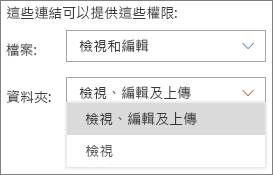
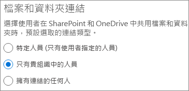
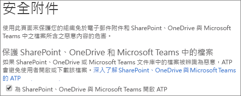
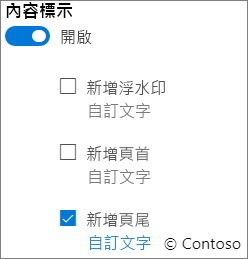

# 與未驗證使用者共用檔案和資料夾的最佳做法

未驗證共用 (*任何人*連結) 在許多案例下都相當方便。 *任何人*連結為共用最簡單的方式：人員可以不經驗證就開啟連結，且可隨意將它傳送給其他人。

一般來說，並非組織中的所有內容都適合進行未驗證共用。 本文涵蓋可協助您建立一個環境的選項，您的使用者能夠在該環境中未驗證共用檔案和資料夾，但在其中有一些既有措施可協助保護組織內容的安全。

> [!NOTE]
> 若要讓未驗證共用運作，您必須為組織以及您將使用的個別網站或小組啟用該功能。 如需您要啟用的案例，請參閱[與組織外部人員共同作業](collaborating-with-people-outside-your-organization.md)。

## 設定任何人連結的到期日

檔案通常會長時間儲存在網站、群組和小組。 有時候，有一些資料保留原則會要求將檔案保留數年。 如果將這類檔案與未驗證的人員共用，可能導致未來非預期地存取和變更這些檔案。 若要降低此可能性，您可以為*任何人*連結設定到期時間。

*任何人*連結到期後，就無法再用來存取內容。

設定任何人連結的到期日
1. 開啟 SharePoint Online 系統管理中心。
2. 在左側導覽窗格中，按一下 [共用]****。
3. 在 [「任何人」連結的進階設定]**** 底下，選取 [這些連結必須在此天數內過期]**** 核取方塊。 
   
4. 在方塊中輸入天數，然後按一下 [儲存]****。

請注意，*任何人*連結到期之後，就可以使用新的*任何人*連結重新共用檔案或資料夾。

## 設定連結權限

根據預設，檔案的*任何人*連結會允許人員編輯檔案，而資料夾的*任何人*連結則會允許人員編輯和檢視檔案，以及上傳新檔案到資料夾。 您可以獨立將檔案和資料夾的這些權限變更為僅供檢視。

如果您想要允許未驗證共用，但擔心未驗證的人員修改組織的內容，請考慮將檔案和資料夾權限設定為 [檢視]****。

設定任何人連結的權限
1. 開啟 SharePoint Online 系統管理中心。
2. 在左側導覽窗格中，按一下 [共用]****。
3. 在 [「任何人」連結的進階設定]**** 底下，選取您要使用的檔案和資料夾權限。 
   

將*任何人*連結設為 [檢視]**** 時，使用者仍然可以與來賓共用檔案和資料夾，並使用*特定人員*連結提供編輯權限。 這些連結要求組織外的人員驗證為來賓身分，而您可以追蹤和稽核使用這些連結共用的檔案和資料夾上的來賓活動。

## 將預設連結類型設定為僅適用組織中的人員

為組織啟用*任何人*共用時，預設的共用連結一般會設定為**任何人**。 雖然這對使用者而言很方便，但可能會增加無意間未驗證共用的風險。 如果使用者在共用機密文件時忘記變更連結類型，他們可能會意外建立不需要驗證的共用連結。

您可以透過將預設連結設定變更為僅適用組織內部人員的連結，來降低此風險。 這麼一來，想要進行未驗證共用的使用者，必須特別選取該選項。

設定預設的檔案和資料夾共用連結
1. 在 SharePoint 管理中心中，按一下左側導覽窗格中的 [共用]****。
2. 在 [檔案與資料夾連結]**** 下，選取 [只有貴組織中的人員]****。 
   
3. 按一下 [儲存]****

## 防範惡意檔案

允許匿名使用者上傳檔案時，可能會增加某人上傳惡意檔案的風險。 在 Microsoft 365 中，您可以使用進階威脅防護中的*安全附件*功能，自動掃描發現不安全的已上傳檔案和隔離檔案。

開啟安全附件
1. 開啟 [Microsoft 365 安全性](https://security.microsoft.com)系統管理中心。
2. 在左側導覽窗格中，按一下 [原則]****。
3. 在 [威脅防護]**** 底下，按一下 [ATP 安全附件 (Office 365)]****。
4. 選取 [為 SharePoint、OneDrive 與 Microsoft Teams 開啟 ATP]**** 核取方塊，然後按一下 [儲存]****。 
   

## 新增著作權資訊至您的檔案

如果您在 Microsoft 365 合規性系統管理中心使用敏感度標籤，即可以設定您的標籤，以自動新增浮水印或頁首或頁尾至組織的 Office 文件中。 這麼一來，您就可以確定共用的檔案包含著作權或其他擁有權資訊。

新增頁尾至標籤的檔案
1. 開啟 [Microsoft 365 合規性系統管理中心](https://compliance.microsoft.com)。
2. 在左側導覽窗格中，於 [分類]**** 底下，按一下 [敏感度標籤]****。
3. 按一下您要新增頁尾的標籤，然後按一下 [編輯標籤]****。
4. 按一下 [內容標示]**** 索引標籤，然後 [開啟]**** 內容標示。
5. 選取要新增的文字類型的核取方塊，然後按一下 [自訂文字]****。
6. 輸入要新增至文件的文字，選取需要的文字選項，然後按一下 [儲存]****。 
   
7. 按一下 [儲存]****，然後按一下 [關閉]****。

為標籤啟用內容標示後，當使用者套用該標籤，您指定的文字就會新增至 Office 文件中。

## 另請參閱

[敏感度標籤概觀](https://docs.microsoft.com/Office365/SecurityCompliance/sensitivity-labels)

[與來賓共用時限制意外暴露檔案](sharing-limit-accidental-exposure.md)

[建立安全的來賓共用環境](create-a-secure-guest-sharing-environment.md)