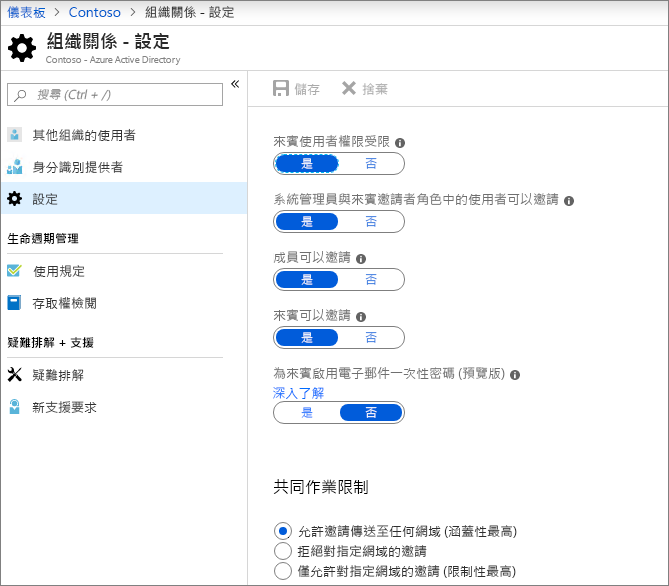
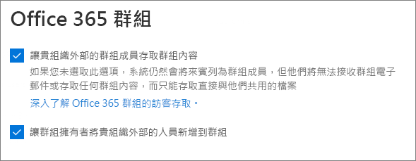
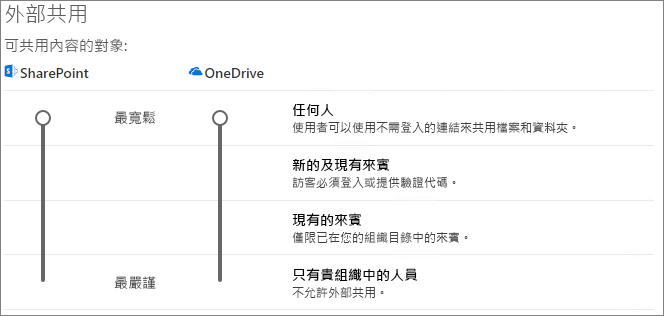
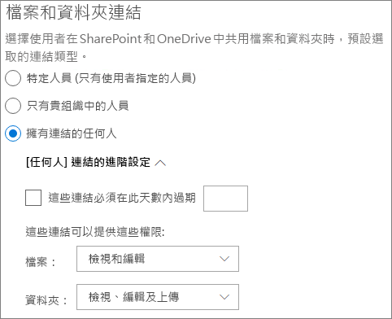
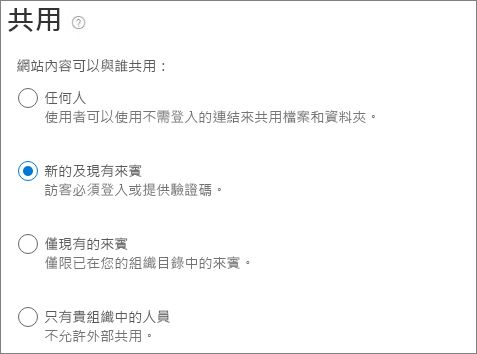

# 與網站中的來賓共同作業Collaborate with guests in a site

如果您需要整個文件、 資料和清單與來賓共同作業，您可以使用 SharePoint 網站。If you need to collaborate with guests across documents, data, and lists, you can use a SharePoint site. 新式的 SharePoint 網站連線到 Office 365 群組以管理站台成員資格，並提供其他共同作業工具，例如共用的信箱和行事曆。Modern SharePoint sites are connected to Office 365 Groups which can manage the site membership and provide additional collaboration tools such as a shared mailbox and calendar.

在本文中，我們會逐步設定來賓與共同作業的 SharePoint 網站所需的 Microsoft 365 組態步驟。In this article, we'll walk through the Microsoft 365 configuration steps necessary to set up a SharePoint site for collaboration with guests.

## Azure 的組織關聯性設定Azure Organizational relationships settings

Microsoft 365 中共用是由控管最高層級 Azure Active Directory 中的組織關聯性設定。Sharing in Microsoft 365 is governed at its highest level by the organizational relationships settings in Azure Active Directory. 如果共用的來賓已停用，或限制在 Azure AD 中，這會覆寫任何您在 Microsoft 365 中設定的共用設定。If guest sharing is disabled or restricted in Azure AD, this will override any sharing settings that you configure in Microsoft 365.

檢查以確保未封鎖來賓與共用的組織關聯性設定。Check the organizational relationships settings to ensure that sharing with guests is not blocked.

若要設定組織關聯性設定To set organizational relationship settings

1. 登入 Microsoft Azure 在[https://portal.azure.com](https://portal.azure.com)。Log in to Microsoft Azure at [https://portal.azure.com](https://portal.azure.com).
2. 在左導覽中，按一下 [ **Azure Active Directory**]。In the left navigation, click **Azure Active Directory**.
3. 在 [**概觀**] 窗格中，按一下 [**組織關聯性**。In the **Overview** pane, click **Organizational relationships**.
4. 在**組織關聯性**] 窗格中，按一下 [**設定**]。In the **Organizational relationships** pane, click **Settings**.
5. 確保**系統管理員和來賓邀請者角色中的使用者可以邀請**和**成員可以邀請**都會設**為 [是]**。Ensure that **Admins and users in the guest inviter role can invite** and **Members can invite** are both set to **Yes**.
6. 如果您所做的變更，請按一下 [**儲存**]。If you made changes, click **Save**.

請注意 [**共同作業限制**] 區段中的設定。Note the settings in the **Collaboration restrictions** section. 請確定不封鎖的網域的來賓，您想要與共同作業。Make sure that the domains of the guests that you want to collaborate with aren't blocked.

## Office 365 群組的來賓設定Office 365 Groups guest settings

新式的 SharePoint 網站使用 Office 365 群組來控制網站存取權。Modern SharePoint sites use Office 365 Groups to control site access. Office 365 群組的來賓設定必須開啟 SharePoint 網站中的來賓存取工作的順序。The Office 365 Groups guest settings must be turned on in order for guest access in SharePoint sites to work.

若要設定 Office 365 群組的來賓To set Office 365 Groups guest settings

1. 在 Microsoft 365 系統管理中心，在左側導覽中，展開 [**設定**]。In the Microsoft 365 admin center, in the left navigation, expand **Settings**.
2. 按一下 [**服務 & 增益集**]。Click **Services & add-ins**.
3. 在清單中，按一下 [ **Office 365 群組**。In the list, click **Office 365 Groups**.
4. 請確定，**讓外部組織存取群組內容的群組成員**，**讓群組擁有者新增至群組在組織外的人員**] 核取方塊會同時檢查。Ensure that the **Let group members outside your organization access group content** and **Let group owners add people outside your organization to groups** check boxes are both checked.
5. 如果您所做的變更，按一下 [**儲存變更**。If you made changes, click **Save changes**.

## 共用設定的 SharePoint 組織層級SharePoint organization level sharing settings

為了讓訪客能夠存取 SharePoint 網站，SharePoint 組織層級共用設定必須允許與來賓共用。In order for guests to have access to SharePoint sites, the SharePoint organization-level sharing settings must allow for sharing with guests.

組織層級設定會決定哪些設定可供個別的網站。The organization-level settings determine what settings are available for individual sites. 網站設定不能更寬鬆比組織層級的設定。Site settings cannot be more permissive than the organization-level settings.

如果您想要允許的檔案和資料夾與匿名使用者共用，選擇 [**任何人**]。If you want to allow file and folder sharing with anonymous users, choose **Anyone**. 如果您想要確定所有來賓都需要驗證，請選擇 [**新增] 和 [現有的來賓**。If you want to ensure that all guests have to authenticate, choose **New and existing guests**. 選擇 [將您的組織中任何網站所需的最寬鬆] 設定。Choose the most permissive setting that will be needed by any site in your organization.

若要設定共用設定的 SharePoint 組織層級To set SharePoint organization level sharing settings

1. 在 Microsoft 365 系統管理中心，在左側導覽中，[**系統管理中心**中，按一下 [ **SharePoint**]。In the Microsoft 365 admin center, in the left navigation, under **Admin centers**, click **SharePoint**.
2. 在 SharePoint 系統管理中心中，在左側導覽中，按一下 [**共用**]。In the SharePoint admin center, in the left navigation, click **Sharing**.
3. 請確定該外部共用 SharePoint 設為**任何人**或**新增和現有的來賓**。Ensure that external sharing for SharePoint is set to **Anyone** or **New and existing guests**.
4. 如果您所做的變更，請按一下 [**儲存**]。If you made changes, click **Save**.

## SharePoint 組織層級預設連結設定SharePoint organization level default link settings

預設檔案和資料夾連結設定會決定哪一個連結選項向使用者顯示預設情況下使用者共用的檔案或資料夾時。The default file and folder link settings determine which link option is shown to the user by default when they share a file or folder. 使用者可以將連結類型變更為下列其中一個其他選項共用視之前。Users can change the link type to one of the other options before sharing if desired.

請記住此設定會影響所有的 microsoft teams 和貴組織中的 SharePoint 網站。Keep in mind that this setting affects all teams and SharePoint sites in your organization.

選擇 [當使用者共用檔案及資料夾，依預設會選取連結的類型：Choose the type of link that's selected by default when users share files and folders:

- **任何人] 連結**-如果您預期在具有匿名使用者共用檔案和資料夾的許多選擇此選項。**Anyone with the link** - Choose this option if you expect to share a lot of files and folders with anonymous users. 如果您想要允許*任何人*的連結，但擔心意外匿名共用，請考慮下列其中一個其他選項為預設值。If you want to allow *Anyone* links but are concerned about accidental anonymous sharing, consider one of the other options as the default. 如果您已啟用**的任何人**共用，此連結類型只有。This link type is only available if you've enabled **Anyone** sharing.
- **只有在您的組織中的人員**-如果您預期大部分的檔案和資料夾共用您的組織內的人員都必須選擇此選項。**Only people in your organization** - Choose this option if you expect most file and folder sharing to be with people inside your organization.
- **特定人員**-如果您預期執行許多檔案和資料夾與來賓共用，請考慮此選項。**Specific people** - Consider this option if you expect to do a lot of file and folder sharing with guests. 這種類型的連結與來賓運作，以及需要進行驗證。This type of link works with guests and requires them to authenticate.
 

若要設定 SharePoint 組織層級預設值] 連結To set the SharePoint organization level default link settings

1. 瀏覽至 SharePoint 系統管理中心的 [共用] 頁面上。Navigate to the Sharing page in the SharePoint admin center.
2. [**檔案] 和 [資料夾] 連結**，選取預設共用您想要使用的連結。Under **File and folder links**, select the default sharing link that you want to use.
3. 如果您所做的變更，請按一下 [**儲存**]。If you made changes, click **Save**.

## 建立網站Create a site

下一步是建立您計劃要用於來賓與共同作業網站。The next step is to create the site that you plan to use for collaborating with guests.

若要建立網站To create a site
1. 在 SharePoint 系統管理中心中，[**網站**]，按一下 [**作用中網站**。In the SharePoint admin center, under **Sites**, click **Active sites**.
2. 按一下 [建立]\*\*\*\*。Click **Create**.
3. 按一下 [**小組網站**。Click **Team site**.
4. 輸入網站名稱，然後輸入群組擁有者 （網站擁有者） 的名稱。Type a site name and enter a name for the Group owner (site owner).
5. [**進階設定**]，選擇 [是否您想要這是公用或私用網站。Under **Advanced settings**, choose if you want this to be a public or private site.
6. 按 [下一步]\*\*\*\*。Click **Next**.
7. 按一下 **[完成]**。Click **Finish**.

我們將稍後邀請使用者。We'll invite users later. 接下來，務必要檢查此網站的網站層級共用設定。Next, it's important to check the site-level sharing settings for this site.

## SharePoint 網站層級共用設定SharePoint site level sharing settings

請檢查以確保它們允許您要用於此網站的存取類型的網站層級共用設定。Check the site-level sharing settings to make sure that they allow the type of access that you want for this site. 例如，如果您設定組織層級設定為**任何人**，但您想要驗證這個網站的所有來賓，然後進行確認網站層級共用設定設為 [**新增] 和 [現有的來賓**。For example, if you set the organization-level settings to **Anyone**, but you want all guests to authenticate for this site, then make sure the site-level sharing settings are set to **New and existing guests**.

請注意，無法共用網站，在具有匿名使用者 （**任何人都**設定），但是可以個別檔案和資料夾。Note that the site cannot be shared with anonymous users (**Anyone** setting), but individual files and folders can.

若要設定網站層級共用設定To set site-level sharing settings
1. 在 SharePoint 系統管理中心中，在左側導覽中，展開 [**站台**，按一下 [**作用中網站**。In the SharePoint admin center, in the left navigation, expand **Sites** and click **Active sites**.
2. 選取您剛建立的網站。Select the site that you just created.
3. 在功能區中，按一下 [**共用**]。In the ribbon, click **Sharing**.
4. 請確定該共用設為**任何人**或**新增和現有的來賓**。Ensure that sharing is set to **Anyone** or **New and existing guests**.
5. 如果您所做的變更，請按一下 [**儲存**]。If you made changes, click **Save**.

## 邀請使用者Invite users

來賓共用設定現在會進行設定，讓您可以開始將內部使用者和訪客新增至您的網站。Guest sharing settings are now configured, so you can start adding internal users and guests to your site. 讓我們將持續加入那里使用者網站存取權是透過相關聯的 Office 365 群組，來控制。Site access is controlled through the associated Office 365 Group, so we'll be adding users there.

若要邀請內部使用者至群組To invite internal users to a group
1. 瀏覽至您要新增使用者的網站。Navigate to the site where you want to add users.
2. 按一下右上角的 [**成員**]。Click **Members** in the upper right.
3. 按一下 [新增成員]\*\*\*\*。Click **Add members**.
4. 輸入的名稱或電子郵件地址，您想要邀請至網站的使用者，然後按一下 [**儲存**。Type the names or email addresses of the users that you want to invite to the site, and then click **Save**.

來賓使用者無法新增從站台。Guest users can't be added from the site. 您必須將它們新增使用網頁型 Outlook。You need to add them using Outlook on the web.

若要邀請來賓至網站To invite guests to a site
1. 在 Outlook 網頁版、 在 [**群組**] 中按一下您要新增成員的群組。In Outlook on the web, under **Groups**, click the group where you want to add members.
2. 開啟群組連絡人卡片、，然後按一下 [**更多選項]** （...）] 下的 [**新增成員**。Open the group contact card, and then, under **More options** (...), click **Add members**.
3. 輸入您想要邀請，來賓電子郵件地址，然後按一下 [**新增]**。Type the email addresses of the guests that you want to invite, and then click **Add**.
4. 按一下 [關閉]\*\*\*\*。Click **Close**.

## 另請參閱See Also
