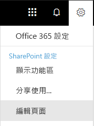
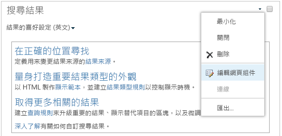

# 設定 Office 365 多地理位置的搜尋

在多地理位置環境中，每個地理位置有其專屬的搜尋索引和搜尋中心。 當使用者搜尋時，系統會將查詢展開傳送至所有索引，並合併傳回的結果。

例如，單一地理位置中的使用者可以搜尋儲存在另一個地理位置的內容，或限制在不同地理位置之 SharePoint 網站上的內容。 如果使用者可存取此內容，搜尋會顯示結果。

## 哪些搜尋用戶端可以在多地理位置中運作？

這些用戶端可以從所有地理位置傳回結果：

-   商務用 OneDrive

-   Delve

-   SharePoint 首頁

-   搜尋中心

-   使用 SharePoint 搜尋 API 的自訂搜尋應用程式

### 商務用 OneDrive

多地理位置環境一設定好之後，在 OneDrive 中搜尋的使用者就會取得來自所有地理位置的結果。

### Delve

多地理位置環境一設定好之後，在 Delve 中搜尋的使用者就會取得來自所有地理位置的結果。

Delve 摘要和個人檔案卡片只會顯示儲存在中央位置之檔案的預覽。 針對儲存在衛星位置的檔案，會改為顯示該檔案類型的圖示。

### SharePoint 首頁

多地理位置環境一設定好，使用者就會在 SharePoint 首頁上看到來自多個地理位置的最新消息、最新動向及追蹤網站。如果他們使用 SharePoint 首頁上的 [搜尋] 方塊，他們會收到來自多個地理位置合併的結果。

### 搜尋中心

在多地理位置環境設定好之後，每個搜尋中心都會繼續只顯示來自本身地理位置的結果。系統管理員必須[變更每個搜尋中心的設定](#_Set_up_a_1)，以取得來自所有地理位置的結果。之後，在搜尋中心中搜尋的使用者會取得來自所有地理位置的結果。

### 自訂搜尋應用程式

按慣例，自訂搜尋應用程式會使用現有的 SharePoint 搜尋 REST API 與搜尋索引互動。若要取得來自全部或部分地理位置的結果，應用程式必須在要求中[呼叫 API，並包含新多地理位置查詢參數](#_Get_custom_search)。這會觸發將查詢展開傳送至所有地理位置。

## 多地理位置環境中搜尋的差異為何？

您可能已經熟悉的部分搜尋功能，在多地理位置環境中的運作方式有所不同。

<table>
<thead>
<tr class="header">
<th align="left"><strong>功能</strong></th>
<th align="left"><strong>運作方式</strong></th>
<th align="left"><strong>因應措施</strong></th>
</tr>
</thead>
<tbody>
<tr class="odd">
<td align="left">升階的結果</td>
<td align="left">您可以在不同層級：針對整個租用戶、針對網站集合或針對網站，建立具有升級結果的查詢規則。 於多地理位置環境中，在租用戶層級定義升級結果，可將結果升級至所有地理位置的搜尋中心。 如果您只想升級位於網站集合或網站的地理位置中搜尋中心的結果，請在網站集合或網站層級定義升級的結果。 這些結果不會在其他地理位置升級。</td>
<td align="left">如果您不需要每個地理位置有不同升級的結果 (例如對出差使用不同規則)，建議您在租用戶層級定義升級結果。</td>
</tr>
<tr class="even">
<td align="left">搜尋精簡器</td>
<td align="left">搜尋會傳回來自某租用戶所有地理位置的精簡器，然後會對它們進行彙總。彙總是最大努力的結果，這表示精簡器計數可能不是 100% 正確的。在大部分以搜尋為導向的情況下，此精確度就已足夠。 </td>
<td align="left">針對依賴精簡器完整性且以搜尋為導向的應用程式，對每個地理位置的查詢都是獨立的。</td>
</tr>
<tr class="odd">
<td align="left"></td>
<td align="left">多地理位置搜尋不支援數字精簡器的動態貯體。</td>
<td align="left">將<a href="https://docs.microsoft.com/en-us/sharepoint/dev/general-development/query-refinement-in-sharepoint">「分隔」參數</a>用於數字精簡器。</td>
</tr>
<tr class="even">
<td align="left">文件識別碼</td>
<td align="left">如果您要開發依賴文件識別碼且以搜尋為導向的應用程式，請注意，多地理位置環境中的文件識別碼在地理位置間不是唯一的，該文件識別碼在每個地理位置中是唯一的。</td>
<td align="left">我們新增了一欄來識別地理位置。 請使用此欄來達成唯一性。 此欄名為 “GeoLocationSource”。</td>
</tr>
<tr class="odd">
<td align="left">結果數目</td>
<td align="left">搜尋結果頁面會顯示來自地理位置的合併結果，但頁面無法顯示超過 500 個結果。</td>
<td align="left"></td>
</tr>
<tr class="even">
<td align="left">混合式搜尋</td>
<td align="left">在具有<a href="https://docs.microsoft.com/sharepoint/hybrid/learn-about-cloud-hybrid-search-for-sharepoint">雲端混合式搜尋</a>的混合式 SharePoint 環境中，內部部署的內容會新增至中央位置的 Office 365 索引。</td>
<td align="left"></td>
</tr>
</tbody>
</table>

## 多地理位置環境中的搜尋不支援哪些項目？

您可能已經熟悉的部分搜尋功能在多地理位置環境中不受支援。

<table>
<thead>
<tr class="header">
<th align="left"><strong>搜尋功能</strong></th>
<th align="left"><strong>附註</strong></th>
</tr>
</thead>
<tbody>
<tr class="odd">
<td align="left">僅 App 驗證</td>
<td align="left">在多地理位置搜尋中不支援僅 App 驗證 (來自服務的特殊權限存取)。</td>
</tr>
<tr class="even">
<td align="left">來賓使用者</td>
<td align="left">來賓使用者只能取得他們在其中搜尋之地理位置的結果。</td>
</tr>
</tbody>
</table>

## 搜尋在多地理位置環境中的運作方式？

所有搜尋用戶端都會使用現有 SharePoint 搜尋 REST API 與搜尋索引互動。

1. 搜尋用戶端會使用查詢屬性 EnableMultiGeoSearch = true 來呼叫搜尋 REST 端點。
2. 系統會將查詢傳送至租用戶中的所有地理位置中。
3. 來自每個地理位置的搜尋結果會合併並排名。
4. 用戶端會取得整合的搜尋結果。

請注意，在收到來自所有地理位置的結果之前，我們不會合併搜尋結果。 這表示相較於只有單一地理位置環境中的搜尋，多地理位置搜尋會有額外的延遲。

## 取得搜尋中心以顯示來自所有地理位置的結果

每個搜尋中心都提供數種類別，而且您必須個別設定每個類別。

1.  請務必使用有權編輯搜尋結果網頁與搜尋結果網頁組件的帳戶來執行這些步驟。

2.  瀏覽至 [搜尋結果] 頁面 (請參閱搜尋結果頁面的[清單](https://support.office.com/article/174d36e0-2f85-461a-ad9a-8b3f434a4213))

3.  選取要設定的類別，請按一下右上角的 [設定]**** 圖示，然後按一下 [編輯頁面] ****。在編輯模式中搜尋結果網頁會開啟。

     
1.  在搜尋結果網頁組件中，請將指標移至網頁組件的右上角，按一下箭號，然後按一下功能表上的 [編輯網頁組件]****。 搜尋結果網頁組件工具窗格隨即在網頁右上方的功能區下開啟。 

1.  在網頁組件工具窗格 [設定]**** 區段中，在 [結果控制設定]****，請選取 [顯示多地理位置結果]**** 以取得搜尋結果網頁組件，以顯示來自所有地理位置的結果。

2.  按一下 [確定]**** 以儲存變更並且關閉網頁組件工具窗格。

3.  檢查您對搜尋結果網頁組件所做的變更，請在主功能表的 [頁面] 索引標籤上按一下 [存回]****。

4.  使用頁面頂端之附註中提供的連結發佈變更。

## 取得自訂搜尋應用程式，以顯示來自全部或部分地理位置的結果

自訂搜尋應用程式會透過指定含對 SharePoint 搜尋 REST API 之要求的查詢參數，以取得來自全部或部分地理位置的結果。視查詢參數而定，系統會將查詢展開傳送至所有地理位置或部分的地理位置。例如，如果您只需要查詢地理位置的子集來尋找相關資訊，您可以控制只對這些項目進行展開傳送。如果要求成功，SharePoint 搜尋 REST API 會傳回回應資料。

**需求**

對於每個地理位置，您必須確保組織中的所有使用者都已被授予根網站的**讀取**權限層級 (例如contoso**APAC**.sharepoint.com/ 和 contoso**EU**.sharepoint.com/)。[了解權限](https://support.office.com/zh-TW/article/understanding-permission-levels-in-sharepoint-87ecbb0e-6550-491a-8826-c075e4859848)。

### 查詢參數

EnableMultiGeoSearch - 這是布林值，指出查詢是否應該展開傳送至多地理位置租用戶其他地理位置的索引。 將它設為 **true** 以將查詢展開傳送；**false** 以不要將查詢展開傳送。 如果您不包含此參數，預設值是 **false**，對使用企業搜尋中心範本的網站進行 REST API 呼叫時除外，在此情況下，預設值是 **true**。 如果您在非多地理位置的環境中使用此參數，則會忽略此參數。

ClientType - 這是字串。 為每個搜尋應用程式輸入唯一的用戶端名稱。 如果您不包含此參數，則不會將查詢展開傳送至其他地理位置。

MultiGeoSearchConfiguration - 這是選擇性的清單，它是當 **EnableMultiGeoSearch** 為 **true** 時，多地理位置租用戶中的地理位置要將查詢展開傳送至的目標。 如果您不包含此參數，或將它保留空白，則會將查詢展開傳送至所有地理位置。 針對每個地理位置，請以 JSON 格式輸入下列項目：

<table>
<thead>
<tr class="header">
<th align="left">項目</th>
<th align="left">描述</th>
</tr>
</thead>
<tbody>
<tr class="odd">
<td align="left">DataLocation</td>
<td align="left">地理位置，例如NAM。</td>
</tr>
<tr class="even">
<td align="left">端點</td>
<td align="left">要連線的端點，例如 https://contoso.sharepoint.com</td>
</tr>
<tr class="odd">
<td align="left">SourceId</td>
<td align="left">結果來源的 GUID，例如 B81EAB55-3140-4312-B0F4-9459D1B4FFEE。</td>
</tr>
</tbody>
</table>

如果您省略 DataLocation 或EndPoint，或者 DataLocation 是重複的，要求將會失敗。[您可以透過 Microsoft Graph 來取得租用戶地理位置的端點相關資訊](https://docs.microsoft.com/zh-TW/sharepoint/dev/solution-guidance/multigeo-discovery)。

### 回應資料

MultiGeoSearchStatus – 這是 SharePoint 搜尋 API 在回應中傳回至要求的屬性。屬性的值是字串，並提供 SharePoint 搜尋 API 傳回之結果的下列資訊：

<table>
<thead>
<tr class="header">
<th align="left">值</th>
<th align="left">描述</th>
</tr>
</thead>
<tbody>
<tr class="odd">
<td align="left">Full</td>
<td align="left">來自<strong>所有</strong>地理位置的完整結果。</td>
</tr>
<tr class="even">
<td align="left">Partial</td>
<td align="left">從一或多個地理位置的部分結果。結果會因為暫時性錯誤而不完整。</td>
</tr>

</tbody>
</table>

### 使用 REST 服務的查詢

使用 GET 要求時，您可以在 URL 中指定查詢參數。使用 POST 要求時，您能以 JavaScript 物件標記法 (JSON) 格式在內文中傳遞查詢參數。

#### 要求標頭

<table>
<thead>
<tr class="header">
<th align="left">名稱</th>
<th align="left">值</th>
</tr>
</thead>
<tbody>
<tr class="odd">
<td align="left">Content-Type</td>
<td align="left">application/json;odata=verbose</td>
</tr>
</tbody>
</table>

#### 已展開傳送至**所有**地理位置的範例 GET 要求

https://\<tenant\>/\_api/search/query?querytext='sharepoint'&Properties='EnableMultiGeoSearch:true'&ClientType='my\_client\_id'

#### 要展開傳送至**部分**地理位置的範例 GET 要求

https:// \<tenant\>/\_api/search/query?querytext='site'&ClientType='my_client_id'&Properties='EnableMultiGeoSearch:true, MultiGeoSearchConfiguration:[{DataLocation\\:"NAM"\\,Endpoint\\:"https\\://contosoNAM.sharepoint.com"\\,SourceId\\:"B81EAB55-3140-4312-B0F4-9459D1B4FFEE"}\\,{DataLocation\\:"CAN"\\,Endpoint\\:"https\\://contosoCAN.sharepoint-df.com"}]'

> [!NOTE]
> MultiGeoSearchConfiguration 屬性地理位置清單中的逗號和冒號，其前面會加上**反斜線**字元。 這是因為 GET 要求會使用冒號來分隔屬性，以及使用逗號來分隔屬性的引數。 若未使用反斜線做為逸出字元，將會錯誤地解譯 MultiGeoSearchConfiguration 屬性。

#### 已展開傳送至**所有**地理位置的範例 POST 要求

    {
        "request": {
            "__metadata": {
            "type": "Microsoft.Office.Server.Search.REST.SearchRequest"
        },
        "Querytext": "sharepoint",
        "Properties": {
            "results": [
                {
                    "Name": "EnableMultiGeoSearch",
                    "Value": {
                        "QueryPropertyValueTypeIndex": 3,
                        "BoolVal": true
                    }
                }
            ]
        },
        "ClientType": "my_client_id"
        }
    }

#### 已展開傳送至**部分**地理位置的範例 POST 要求

    {
        "request": {
            "Querytext": "SharePoint",
            "ClientType": "my_client_id",
            "Properties": {
                "results": [
                    {
                        "Name": "EnableMultiGeoSearch",
                        "Value": {
                            "QueryPropertyValueTypeIndex": 3,
                            "BoolVal": true
                        }
                    },
                    {
                        "Name": "MultiGeoSearchConfiguration",
                        "Value": {
                        "StrVal": "[{\"DataLocation\":\"NAM\",\"Endpoint\":\"https://contoso.sharepoint.com\",\"SourceId\":\"B81EAB55-3140-4312-B0F4-9459D1B4FFEE\"},{\"DataLocation\":\"CAN\",\"Endpoint\":\"https://contosoCAN.sharepoint.com\"}]",
                            "QueryPropertyValueTypeIndex": 1
                        }
                    }
                ]
            }
        }
    }

### 使用 CSOM 查詢

此為已展開傳送至**所有**地理位置的範例 CSOM 查詢：

    var keywordQuery = new KeywordQuery(ctx);
    keywordQuery.QueryText = query.SearchQueryText;
    keywordQuery.ClientType = <enter a string here>;
    keywordQuery["EnableMultiGeoSearch"] = true;

