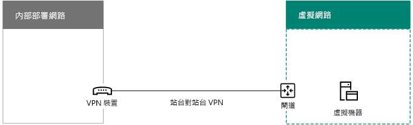
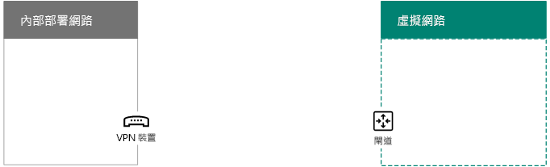
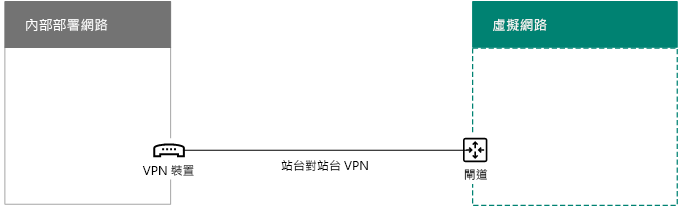

# <a name="connect-an-on-premises-network-to-a-microsoft-azure-virtual-network"></a>使內部部署網路與 Microsoft Azure 虛擬網路連線

跨單位 Azure 虛擬網路會與您的內部部署網路連線，藉此擴充您的網路以包含 Azure 基礎架構服務中裝載的子網路和虛擬機器。此連線能讓內部部署網路上的電腦直接存取 Azure 中的虛擬機器，反之亦然。 

例如，在 Azure 虛擬機器上執行的目錄同步處理伺服器必須查詢您的內部部署網域控制站是否有帳戶的變更，以將這些變更與您的 Office 365 訂閱進行同步處理。本文示範如何使用已準備好裝載 Azure 虛擬機器的站對站虛擬私人網路 (VPN) 連線，設定跨單位 Azure 虛擬網路。

## <a name="overview"></a>概觀

Azure 中的虛擬機器無須與您的內部部署環境隔離。若要讓 Azure 虛擬機器與內部部署網路資源連線，您必須設定跨單位 Azure 虛擬網路。下列圖表顯示當 Azure 中有一部虛擬機器時，部署跨單位 Azure 虛擬網路所需要的元件。
  

 
在圖表中，有兩個網路透過站對站 VPN 連線來連線：內部部署網路和 Azure 虛擬網路。站對站 VPN 連線是：

- 介於可定址且位於公用網際網路上位置的兩個端點之間。
- 由內部部署網路上的 VPN 裝置和 Azure 虛擬網路上的 Azure VPN 閘道加以終止。

Azure 虛擬網路會裝載虛擬機器。Azure 虛擬網路上虛擬機器所產生的網路流量會轉送至 VPN 閘道，然後會將站對站 VPN 連線的流量轉送至內部部署網路上的 VPN 裝置。然後內部部署網路的路由基礎結構會將流量轉送至其目的地。

>[!Note]
>您也可以使用 [ExpressRoute](https://azure.microsoft.com/services/expressroute/)，這是您的組織與 Microsoft 網路之間的直接連線。ExpressRoute 的流量不會在公用網際網路上流動。這篇文章不會說明 ExpressRoute 的使用方式。
>
  
若要設定 Azure 虛擬網路和內部部署網路間的 VPN 連線，請執行下列步驟︰ 
  
1. **內部部署：** 針對指向您內部部署 VPN 裝置的 Azure 虛擬網路位址空間，定義和建立內部部署網路路由。
    
2. **Microsoft Azure：** 建立具備站對站 VPN 連線的 Azure 虛擬網路。 
    
3. **內部部署：** 設定內部部署硬體或軟體 VPN 裝置來終止使用網際網路通訊協定安全性 (IPsec) 的 VPN 連線。
    
建立站台對站台的 VPN 連線之後，將 Azure 虛擬機器新增至虛擬網路的子網路。
  
## <a name="plan-your-azure-virtual-network"></a>規劃您的 Azure 虛擬網路
<a name="PlanningVirtual"></a>

### <a name="prerequisites"></a>必要條件
<a name="Prerequisites"></a>

- Azure 訂用帳戶。如需有關 Azure 訂用帳戶的資訊，請移至[如何購買 Azure 頁面](https://azure.microsoft.com/pricing/purchase-options/)。
    
- 要指派至虛擬網路和其子網路的可用私人 IPv4 位址空間，需具備足夠的擴充空間，以容納現在或未來所需的虛擬機器數量。
    
- 內部部署網路中可用的 VPN 裝置，用於終止可支援 IPsec 需求的站台對站台 VPN 連線。如需詳細資訊，請參閱＜[關於適用於站台對站台虛擬網路連線的 VPN 裝置](https://go.microsoft.com/fwlink/p/?LinkId=393093)＞。
    
- 路由基礎結構的變更，以便讓路由至 Azure 虛擬網路位址空間的流量可轉送至裝載站台對站台 VPN 連線的 VPN 裝置。
    
- Web Proxy，讓與內部部署網路和 Azure虛擬網路連線的電腦可存取網際網路。
    
### <a name="solution-architecture-design-assumptions"></a>解決方案架構設計假設

下列清單會列出針對此解決方案架構所做的設計選擇。 
  
- 本解決方案使用具備站台對站台 VPN 連線的單一 Azure 虛擬網路。Azure 虛擬網路會裝載內含多部虛擬機器的單一子網路。 
    
- 您可以使用 Windows Server 2016 中的路由及遠端存取服務 (RRAS) 或 Windows Server 2012，建立內部部署網路和 Azure 虛擬網路間的 IPsec 站台對站台 VPN 連線。您也可以使用其他選項，例如 Cisco 或 Juniper Networks 的 VPN 裝置。
    
- 內部部署網路可能仍有 Active Directory Domain Services (AD DS)、網域名稱系統 (DNS) 和 Proxy 伺服器等網路服務。視您的需求而定，將一些此類網路資源放在 Azure 虛擬網路中可能會有助益。
    
對於具備一個或多個子網路的現有 Azure 虛擬網路，請判斷其是否還有位址空間容納其他子網路，以裝載所需的虛擬機器 (視您的需求而定)。如果您沒有其餘位址空間可容納其他子網路，請建立本身具備站台對站台 VPN 連線的其他虛擬網路。
  
### <a name="plan-the-routing-infrastructure-changes-for-the-azure-virtual-network"></a>規劃適用於 Azure 虛擬網路的路由基礎結構變更

您必須設定內部部署路由基礎結構，以便將目的地為 Azure 虛擬網路位址空間的流量轉送至裝載站台對站台 VPN 連線的內部部署 VPN 裝置
  
更新路由基礎結構的確切方法須根據您管理路由資訊的方法而定，可能是以下方法：
  
- 以手動設定更新路由表。
    
- 以「路由資訊通訊協定 (RIP)」或「先開啟最短的路徑 (OSPF)」等路由通訊協定更新路由表。
    
請洽詢路由專業人員，以確定目的地是 Azure 虛擬網路的流量會轉送到內部部署的 VPN 裝置。
  
### <a name="plan-for-firewall-rules-for-traffic-to-and-from-the-on-premises-vpn-device"></a>為內部部署 VPN 裝置的流量傳輸規劃防火牆規則

如果 VPN 裝置位於周邊網路上，且周邊網路與網際網路間有防火牆，您可能必須為防火牆設定以下規則，以允許站台對站台的 VPN 連線。
  
- 傳輸至 VPN 裝置的流量 (從網際網路傳入)：
    
  - VPN 裝置的目的地 IP 位址和 IP 通訊協定 50
    
  - VPN 裝置的目的地 IP 位址和 UDP 目的地通訊協定 500
    
  - VPN 裝置的目的地 IP 位址和 UDP 目的地通訊協定 4500
    
- 從 VPN 裝置傳輸出去的流量 (傳出至網際網路)︰
    
  - VPN 裝置的來源 IP 位址和 IP 通訊協定 50
    
  - VPN 裝置的來源 IP 位址和 UDP 來源通訊協定 500
    
  - VPN 裝置的來源 IP 位址和 UDP 來源通訊協定 4500
    
### <a name="plan-for-the-private-ip-address-space-of-the-azure-virtual-network"></a>規劃 Azure 虛擬網路的私人 IP 位址空間

Azure 虛擬網路的私人 IP 位址空間必須可容納 Azure 使用的位址，以裝載虛擬網路，以及至少具備一個對 Azure 虛擬機器來說有足夠位址的子網路。
  
若要判斷子網路所需的位址數量，請計算您現在需要的虛擬機器數量、預估未來的成長量，然後使用下表來決定子網路的大小。
  
|**所需的虛擬機器數量**|**所需的主機位元數**|**子網路大小**|
|:-----|:-----|:-----|
|1-3  <br/> |3  <br/> |/29  <br/> |
|4-11  <br/> |4  <br/> |/28  <br/> |
|12-27  <br/> |5  <br/> |/27  <br/> |
|28-59  <br/> |6  <br/> |/26  <br/> |
|60-123  <br/> |7  <br/> |/25  <br/> |
   
### <a name="planning-worksheet-for-configuring-your-azure-virtual-network"></a>設定您 Azure 虛擬網路的規劃工作表
<a name="worksheet"> </a>

建立 Azure 虛擬機器以裝載虛擬機器之前，您必須決定下表中的所需設定。
  
針對虛擬網路的設定，填寫表格 V。
  
 **表格 V：跨單位虛擬網路設定**
  
|**項目**|**Configuration 元素**|**描述**|**值**|
|:-----|:-----|:-----|:-----|
|1.  <br/> |虛擬網路名稱  <br/> |指派給 Azure 虛擬網路的名稱 (例如 DirSyncNet)。  <br/> | |
|2.  <br/> |虛擬網路位置  <br/> |將包含虛擬網路的 Azure 資料中心 (例如美國西部)  <br/> |  <br/> |
|3.  <br/> |VPN 裝置 IP 位址  <br/> |網際網路上 VPN 裝置介面的公用 IPv4 位址請與您的 IT 部門合作以決定此位址。  <br/> |  <br/> |
|4.  <br/> |虛擬網路位址空間  <br/> |虛擬網路的位址空間 (定義於單一私人位址前置詞中)。請與您的 IT 部門合作以決定此位址空間。位址空間應是無類別網域間路由選擇 (CIDR) 格式 (也稱為網路前置詞格式)。例如 10.24.64.0/20。  <br/> | <br/> |
|5.  <br/> |IPsec 共用金鑰  <br/> |32 個字元的隨機英數字元字串，用以驗證站台對站台 VPN 連線的兩端站台。請與您的 IT 或安全性部門合作，以決定此金鑰值並將其儲存至安全的位置。或者，請參閱[建立隨機字串以作為 IPsec 的預先共用金鑰](https://social.technet.microsoft.com/wiki/contents/articles/32330.create-a-random-string-for-an-ipsec-preshared-key.aspx)。<br/> | <br/> |
   
針對此解決方案的子網路填寫表格 S。
  
- 針對第一個子網路，請決定 Azure 閘道子網路的 28 位元位址空間 (使用 /28 前置長度)。請參閱[針對 Azure 虛擬網路計算閘道子網路位址空間](https://blogs.technet.microsoft.com/solutions_advisory_board/2016/12/01/calculating-the-gateway-subnet-address-space-for-azure-virtual-networks/)，以取得如何決定此位址空間的資訊。
    
- 針對二個的子網路，請指定好記的名稱、以虛擬網路位址空間為基礎的單一 IP 位址空間，以及具描述性的用途。
    
請與您的 IT 部門合作，以從虛擬網路位址空間判斷這些位址空間。兩個位址空間皆應為 CIDR 格式。
  
 **表格 S：虛擬網路中的子網路**
  
|**項目**|**子網路名稱**|**子網路位址空間**|**用途**|
|:-----|:-----|:-----|:-----|
|1.  <br/> |GatewaySubnet  <br/> |  <br/> |由 Azure 閘道使用的子網路。  <br/> |
|2.  <br/> |  <br/> |  <br/> |  <br/> |
   
針對虛擬網路中，虛擬機器要使用的內部部署 DNS 伺服器，請填寫表格 D。此易記名稱無須與主機名稱或 DNS 伺服器的電腦名稱相同。請注意，列出的空白項有兩個，但您可以新增更多。請與您的 IT 部門合作以決定此清單。
  
 **表格 D：內部部署 DNS 伺服器**
  
|**項目**|**DNS 伺服器的易記名稱**|**DNS 伺服器 IP 位址**|
|:-----|:-----|:-----|
|1.  <br/> |  <br/> |  <br/> |
|2.  <br/> |  <br/> |  <br/> |
   
若要透過站台對站台的 VPN 連線將封包從 Azure 虛擬網路路由至組織網路，您必須使用區域網路來設定虛擬網路。此區域網路具有您組織內部部署網路上所有位置的位址空間清單 (CIDR 格式)，且虛擬網路中的虛擬機器必須可觸及這些位址空間。這可以是內部部署網路或子網路上的所有位置。定義區域網路的位址空間清單必須是唯一的，且不可與此虛擬網路使用的位址空間或其他跨單位虛擬網路重疊。
  
針對區域網路位址空間集，請填寫表格 L。請注意，雖已列出三個空白項，但一般來說您會需要更多。請與您的 IT 部門合作以決定此清單。
  
 **表格 L：區域網路的網址前置詞**
  
|**項目**|**區域網路位址空間**|
|:-----|:-----|
|1.  <br/> |  <br/> |
|2.  <br/> |  <br/> |
|3.  <br/> |  <br/> |
   
## <a name="deployment-roadmap"></a>部署藍圖
<a name="DeploymentRoadmap"> </a>

建立跨單位虛擬網路與在 Azure 中新增虛擬機器有三個階段：
  
- 階段 1：準備內部部署網路。
    
- 階段 2：在 Azure 中建立跨單位的虛擬網路。
    
- 階段 3 (選用)：新增虛擬機器。
    
### <a name="phase-1-prepare-your-on-premises-network"></a>階段 1：準備內部部署網路
<a name="Phase1"></a>

您必須設定包含路由的內部部署網路，該路由應指向目的地為虛擬網路位址空間的流量，且最終會將流量傳遞至內部部署網路邊緣上的路由器。請洽詢您的網路管理員，以決定如何將路由新增至內部部署網路的路由基礎結構上。
  
以下是您產生的組態。
  

  
### <a name="phase-2-create-the-cross-premises-virtual-network-in-azure"></a>階段 2：在 Azure 中建立跨單位的虛擬網路
<a name="Phase2"></a>

首先，開啟 Azure PowerShell 提示。如果您尚未安裝 Azure PowerShell，請參閱[開始使用 Azure PowerShell](https://docs.microsoft.com/powershell/azure/get-started-azureps)。

 
接著，使用此命令登入您的 Azure 帳戶。
  
```powershell
Connect-AzAccount
```

使用下列命令取得訂用帳戶名稱。
  
```powershell
Get-AzSubscription | Sort SubscriptionName | Select SubscriptionName
```

使用這些命令設定您的 Azure 訂用帳戶。以正確的訂用帳戶名稱取代括號中的所有項目 (包括 < 和 > 字元)。
  
```powershell
$subscrName="<subscription name>"
Select-AzSubscription -SubscriptionName $subscrName
```

接著，為您的虛擬網路建立新的資源群組。若要判斷資源群組名稱是否是唯一的，可使用此命令來列出現有的資源群組。
  
```powershell
Get-AzResourceGroup | Sort ResourceGroupName | Select ResourceGroupName
```

使用這些命令建立新的資源群組。
  
```powershell
$rgName="<resource group name>"
$locName="<Table V - Item 2 - Value column>"
New-AzResourceGroup -Name $rgName -Location $locName
```

接下來，建立 Azure 虛擬網路。
  
```powershell
# Fill in the variables from previous values and from Tables V, S, and D
$rgName="<name of your new resource group>"
$locName="<Azure location of your new resource group>"
$vnetName="<Table V - Item 1 - Value column>"
$vnetAddrPrefix="<Table V - Item 4 - Value column>"
$gwSubnetPrefix="<Table S - Item 1 - Subnet address space column>"
$SubnetName="<Table S - Item 2 - Subnet name column>"
$SubnetPrefix="<Table S - Item 2 - Subnet address space column>"
$dnsServers=@( "<Table D - Item 1 - DNS server IP address column>", "<Table D - Item 2 - DNS server IP address column>" )
$locShortName=(Get-AzResourceGroup -Name $rgName).Location

# Create the Azure virtual network and a network security group that allows incoming remote desktop connections to the subnet that is hosting virtual machines
$gatewaySubnet=New-AzVirtualNetworkSubnetConfig -Name "GatewaySubnet" -AddressPrefix $gwSubnetPrefix
$vmSubnet=New-AzVirtualNetworkSubnetConfig -Name $SubnetName -AddressPrefix $SubnetPrefix
New-AzVirtualNetwork -Name $vnetName -ResourceGroupName $rgName -Location $locName -AddressPrefix $vnetAddrPrefix -Subnet $gatewaySubnet,$vmSubnet -DNSServer $dnsServers
$rule1=New-AzNetworkSecurityRuleConfig -Name "RDPTraffic" -Description "Allow RDP to all VMs on the subnet" -Access Allow -Protocol Tcp -Direction Inbound -Priority 100 -SourceAddressPrefix Internet -SourcePortRange * -DestinationAddressPrefix * -DestinationPortRange 3389
New-AzNetworkSecurityGroup -Name $SubnetName -ResourceGroupName $rgName -Location $locShortName -SecurityRules $rule1
$vnet=Get-AzVirtualNetwork -ResourceGroupName $rgName -Name $vnetName
$nsg=Get-AzNetworkSecurityGroup -Name $SubnetName -ResourceGroupName $rgName
Set-AzVirtualNetworkSubnetConfig -VirtualNetwork $vnet -Name $SubnetName -AddressPrefix $SubnetPrefix -NetworkSecurityGroup $nsg
$vnet | Set-AzVirtualNetwork
```

以下是您產生的組態。
  

  
接著，使用以下命令來建立站台對站台 VPN 連線的閘道。
  
```powershell
# Fill in the variables from previous values and from Tables V and L
$vnetName="<Table V - Item 1 - Value column>"
$localGatewayIP="<Table V - Item 3 - Value column>"
$localNetworkPrefix=@( <comma-separated, double-quote enclosed list of the local network address prefixes from Table L, example: "10.1.0.0/24", "10.2.0.0/24"> )
$vnetConnectionKey="<Table V - Item 5 - Value column>"
$vnet=Get-AzVirtualNetwork -Name $vnetName -ResourceGroupName $rgName
# Attach a virtual network gateway to a public IP address and the gateway subnet
$publicGatewayVipName="PublicIPAddress"
$vnetGatewayIpConfigName="PublicIPConfig"
New-AzPublicIpAddress -Name $vnetGatewayIpConfigName -ResourceGroupName $rgName -Location $locName -AllocationMethod Dynamic
$publicGatewayVip=Get-AzPublicIpAddress -Name $vnetGatewayIpConfigName -ResourceGroupName $rgName
$vnetGatewayIpConfig=New-AzVirtualNetworkGatewayIpConfig -Name $vnetGatewayIpConfigName -PublicIpAddressId $publicGatewayVip.Id -SubnetId $vnet.Subnets[0].Id
# Create the Azure gateway
$vnetGatewayName="AzureGateway"
$vnetGateway=New-AzVirtualNetworkGateway -Name $vnetGatewayName -ResourceGroupName $rgName -Location $locName -GatewayType Vpn -VpnType RouteBased -IpConfigurations $vnetGatewayIpConfig
# Create the gateway for the local network
$localGatewayName="LocalNetGateway"
$localGateway=New-AzLocalNetworkGateway -Name $localGatewayName -ResourceGroupName $rgName -Location $locName -GatewayIpAddress $localGatewayIP -AddressPrefix $localNetworkPrefix
# Create the Azure virtual network VPN connection
$vnetConnectionName="S2SConnection"
$vnetConnection=New-AzVirtualNetworkGatewayConnection -Name $vnetConnectionName -ResourceGroupName $rgName -Location $locName -ConnectionType IPsec -SharedKey $vnetConnectionKey -VirtualNetworkGateway1 $vnetGateway -LocalNetworkGateway2 $localGateway
```

以下是您產生的組態。
  

  
下一步，設定內部部署 VPN 裝置與 Azure VPN 閘道連線。如需詳細資訊，請參閱＜[關於適用於站台對站台虛擬網路連線的 VPN 裝置](https://docs.microsoft.com/azure/vpn-gateway/vpn-gateway-about-vpn-devices)＞。
  
若要設定您的 VPN 裝置，您需要下列項目︰
  
- 虛擬網路 Azure VPN 閘道的公用 IPv4 位址。 使用 **Get-AzPublicIpAddress -Name $vnetGatewayIpConfigName -ResourceGroupName $rgName** 命令可顯示此位址。
    
- 站台對站台 VPN 連線的 IPsec 預先共用金鑰 (表格 V - 項目 5 - 值欄)。
    
以下是您產生的組態。
  

  
### <a name="phase-3-optional-add-virtual-machines"></a>階段 3 (選用)：新增虛擬機器

在 Azure 中建立您需要的虛擬機器。如需詳細資訊，請參閱＜[使用 Azure 入口網站建立 Windows 虛擬機器](https://go.microsoft.com/fwlink/p/?LinkId=393098)＞。
  
使用下列設定：
  
- 在 [基本概念]**** 索引標籤中，選取相同的訂閱及資源群組做為您的虛擬網路。您稍後登入虛擬機器時需要這些資訊。在 [執行個體詳細資料]**** 區段，選擇適當的虛擬機器大小。將系統管理員帳戶使用者名稱和密碼記錄在安全位置。 
    
- 在 [網路]**** 索引標籤中，選取您裝載虛擬機器 (不是 GatewaySubnet) 的虛擬網路和子網路名稱。將其他設定保留為設定值。
    
請檢查您的內部 DNS 以確認虛擬機器正在正確地使用 DNS，藉此確認適用於新虛擬機器的位址 (A) 記錄已新增。若要存取網際網路，您的 Azure 虛擬機器必須設定為使用內部部署網路的 Proxy 伺服器。請連絡您的網路系統管理員，以取得要在伺服器上執行的其他設定步驟。
  
以下是您產生的組態。
  

  
## <a name="next-step"></a>下一步
  
[在 Microsoft Azure 中部署 Office 365 目錄同步作業](deploy-office-365-directory-synchronization-dirsync-in-microsoft-azure.md)
