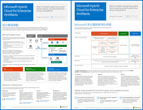

# Microsoft 雲端中的 Contoso

 **摘要：** 虛擬但具有代表性的全球組織如何透過 Microsoft 雲端服務項目採用內含雲端的 IT 基礎結構。
  
本文會連結至一系列的文章，說明總部位於巴黎的全球製造集團 Contoso Corporation 是如何採用包含雲端的 IT 基礎結構，並作出關於網路能力、身分識別和安全性的重大設計決策，以及如何實作企業雲端案例來解決其業務問題。您也可以檢視本資訊的 11 頁海報並以 tabloid 格式列印 (也稱為總帳 11 x 17 或 A3)。
  

  
[PDF](https://go.microsoft.com/fwlink/p/?linkid=842085)  | [Visio](https://go.microsoft.com/fwlink/p/?linkid=842086)  | [更多語言](https://www.microsoft.com/download/details.aspx?id=54427)
  
請參閱下列各節：
  
- [混合式雲端概觀 （英文)](hybrid-cloud-overview.md)
    
    Contoso 公司是一家全球性的製造、銷售與支援的組織集團，擁有超過 100,000 種的商品。 
    
- [Contoso 的 IT 基礎結構和需求](contoso-it-infrastructure-and-needs.md)
    
    Contoso 目前正在進行基礎結構轉型作業，即將從內部部署的集中式 IT 基礎結構轉換至整合雲端的個人生產力工作負載、應用程式及混合案例之融合雲端的 IT 基礎結構。
    
- [Contoso Corporation 的網路](networking-for-the-contoso-corporation.md)
    
    為了達到雲端基礎服務的最佳效能，Contoso 的網路工程師將其網際網路邊緣與跨網際網路的流量最佳化。
    
- [Contoso Corporation 的身分識別](identity-for-the-contoso-corporation.md)
    
    Contoso 在雲端解決方案中的身分識別，會運用其內部部署身分識別提供者並包括現有受信任的第三方身分識別提供者的同盟驗證。
    
- [訂閱、 授權及使用者帳戶為 Contoso Corporation](subscriptions-licenses-and-user-accounts-for-the-contoso-corporation.md)
    
    Contoso 會使用組織/訂閱/授權/使用者帳戶階層來存取 Microsoft 的雲端服務項目。
    
- [Contoso Corporation 的安全性](security-for-the-contoso-corporation.md)
    
    在將自身的 IT 基礎結構轉換至融合雲端的基礎結構時，Contoso 已確定 Microsoft 雲端服務項目支援他們內部部署的安全性需求，並且已進行實作。
    
- [Contoso Corporation 的企業案例](enterprise-scenarios-for-the-contoso-corporation.md)
    
    請參閱 Contoso 如何透過 Microsoft 的雲端產品來解決其商業需求
    
> [!NOTE]
> 這幾篇文章說明在 **2017 年 9 月** Microsoft Cloud 海報中發佈的 Contoso 版本。
  
## 請參閱

[Microsoft Cloud IT 架構資源](microsoft-cloud-it-architecture-resources.md)

[Microsoft 的 Enterprise Cloud 藍圖：IT 決策者的資源](https://sway.com/FJ2xsyWtkJc2taRD)

