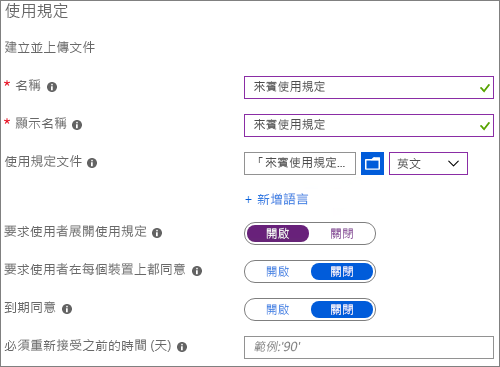
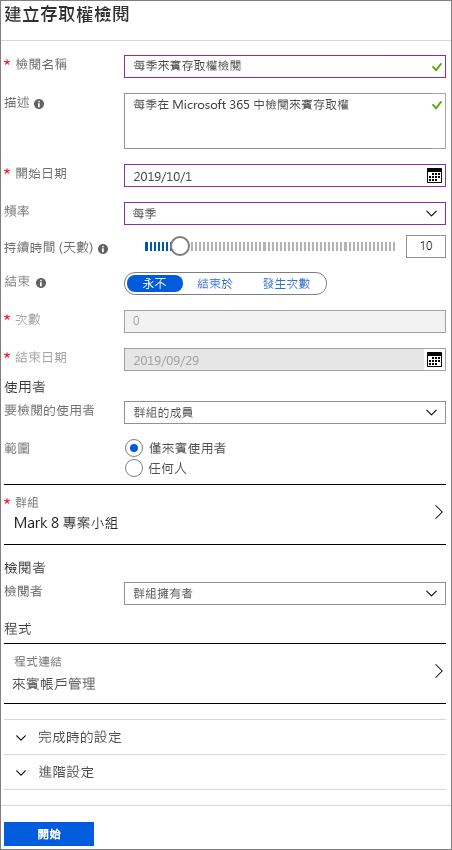
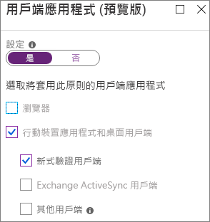
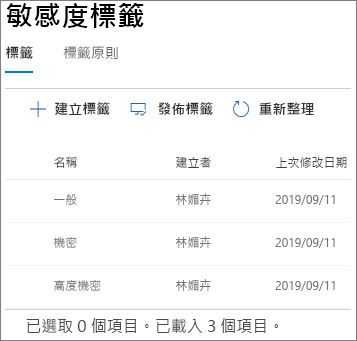
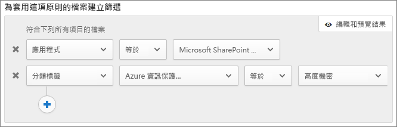

# 建立安全的來賓共用環境

在本文中，我們將逐一介紹用於在 Microsoft 365 中建立安全的來賓共用環境的各種選項。 這是範例案例，讓您了解可用的選項。 您可以用不同的組合使用這些程序，以符合貴組織的安全性和合規性需求。 在本文的結尾，我們將逐步說明測試案例，以了解這些選項的共同運作方式。

此案例包括：

- 為來賓設定多重要素驗證。
- 為來賓設定使用規定。
- 設定每季來賓存取權檢閱，以定期驗證來賓是否繼續需要小組和網站的使用權限。
- 將來賓限制為僅限網頁存取未受管理的裝置。
- 設定工作階段逾時原則，以確保來賓每天進行驗證。
- 建立及發佈敏感度標籤以分類內容。
- 建立高度機密專案的敏感性資訊類型。
- 自動將*高度機密*標籤指派給包含敏感性資訊類型的文件。
- 自動從標示為*高度機密*的檔案移除來賓存取權。

本文中所述的部分選項要求來賓在 Azure Active Directory 中擁有帳戶。 若要確保共用檔案和資料夾時目錄中包含來賓，請使用 [SharePoint 和 OneDrive 與 Azure AD B2B 整合 (預覽版)](https://docs.microsoft.com/sharepoint/sharepoint-azureb2b-integration-preview)。

請注意，我們不會在本文中討論啟用來賓共用設定。 如需針對不同案例啟用來賓共用的詳細資訊，請參閱[與組織外部人員共同作業](https://docs.microsoft.com/Office365/Enterprise/collaborating-with-people-outside-your-organization)。

## 為來賓設定多重要素驗證

多重要素驗證可大幅降低帳戶遭入侵的機會。 由於來賓使用者可能使用不符合任何控管原則或最佳做法的個人電子郵件帳戶，因此要求來賓進行多重要素驗證特別重要。 若來賓使用者的使用者名稱和密碼遭竊，要求第二個驗證要素能大幅降低未知人員存取網站和檔案的機會。

在此範例中，我們將使用 Azure Active Directory 中的條件式存取原則為來賓設定多重要素驗證。

若要為來賓設定多重要素驗證
1. 在 Microsoft Azure 中，搜尋*條件式存取*。
2. 在 **[條件式存取原則]** 刀鋒視窗中，按一下 **[新增原則]**。
3. 在 **[名稱]** 欄位中，輸入*來賓 MFA*。
4. 在 **[指派]** 底下，按一下 **[使用者和群組]**。
5. 在 **[使用者和群組]** 刀鋒視窗中，選取 **[選取使用者與群組]**，然後選取 **[所有來賓和外部使用者]** 核取方塊，然後按一下 **[完成]**。
4. 在 **[存取控制]** 底下，按一下 **[授與]**。
5. 在 **[授與]** 刀鋒視窗中，選取 **[需要多重要素驗證]** 核取方塊，然後按一下 **[選取]**。
6. 在 **[新增]** 刀鋒視窗的 **[啟用原則]** 底下，按一下 **[開啟]**，然後按一下 **[建立]**。

現在，來賓必須先註冊多重要素驗證，才能存取共用的內容、網站或小組。

### 詳細資訊

[規劃雲端式 Azure Multi-Factor Authentication 部署](https://docs.microsoft.com/azure/active-directory/authentication/howto-mfa-getstarted)

## 為來賓設定使用規定

通常來賓使用者可能沒有與貴組織簽署保密合約或其他法律合約。 在來賓存取與他們共用的檔案之前，您可以要求來賓同意使用規定。 使用規定可在來賓首次嘗試存取共用檔案或網站時顯示。

若要建立使用規定，您必須先在 Word 或其他撰寫程式建立文件，然後將文件儲存為 .pdf 檔案。 然後便能將此檔案上傳到 Azure AD。

若要建立 Azure AD 使用規定
1. 以全域管理員、安全性系統管理員或條件式存取系統管理員的身分登入 Azure。
2. 瀏覽至 [[使用規定]](https://aka.ms/catou)。
3. 按一下 **[新增規定]**。 
   
4. 在 **[名稱]** 和 **[顯示名稱]** 方塊中，輸入*來賓使用規定*。
6. 在**使用規定文件**，瀏覽及選取您建立的 PDF 檔案。
7. 選取使用規定文件的語言。
8. 將 **[要求使用者展開使用規定]** 設為 **[開啟]**。
9. 在 **[條件式存取]** 底下的 **[強制使用條件式存取原則範本]** 清單中，選擇 **[稍後建立條件式存取原則]**。
10. 按一下 **[建立]**。

建立使用規定後，下一個步驟是建立條件式存取原則，以顯示來賓使用者的使用規定。

若要建立條件式存取原則
1. 在 Microsoft Azure 中，搜尋*條件式存取*。
2. 在 **[條件式存取原則]** 刀鋒視窗中，按一下 **[新增原則]**。
3. 在 **[名稱]** 方塊中，輸入*來賓使用者的使用規定原則*。
4. 在 **[指派]** 底下，按一下 **[使用者和群組]**。
5. 在 **[使用者和群組]** 刀鋒視窗中，選取 **[選取使用者與群組]**，然後選取 **[所有來賓和外部使用者]** 核取方塊，然後按一下 **[完成]**。
6. 在 **[指派]** 底下，按一下**雲端應用程式或動作**。
7. 在 **[包含]** 索引標籤上，選取 **[選取應用程式]**，然後按一下 **[選取]**。
8. 在 **[選取]** 刀鋒視窗中，選取 **Microsoft Teams**、**Office 365 SharePoint Online** 和 **Outlook Groups**，然後按一下 **[選取]**。
9. 在 **[雲端應用程式或動作]** 刀鋒視窗中，按一下 **[完成]**。
10. 在 **[存取控制]** 底下，按一下 **[授與]**。
11. 在 **[授與]** 刀鋒視窗中，選取 **[來賓使用規定]**，然後按一下 **[選取]**。
12. 在 **[新增]** 刀鋒視窗的 **[啟用原則]** 底下，按一下 **[開啟]**，然後按一下 **[建立]**。

現在，來賓使用者首次嘗試存取貴組織中的內容、小組或網站時，必須接受使用規定。

### 詳細資訊
[Azure Active Directory 使用規定](https://docs.microsoft.com/azure/active-directory/conditional-access/terms-of-use)

## 設定來賓存取權檢閱

透過 Azure AD 中的存取權檢閱，您可以自動定期檢閱各小組和群組的使用者存取權。 透過特別要求來賓的存取權檢閱，您可以協助確保來賓使用者不會在非必要時持續存取貴組織的敏感性資訊。

存取權檢閱可組織為程式。 程式是一組類似的存取權檢閱，可用於組織存取權檢閱，以便進行報告和稽核。

在此範例中，我們將建立來賓存取權檢閱程式。

若要建立程式
1. 登入 Azure 入口網站，並開啟 [Identity Governance 頁面](https://portal.azure.com/#blade/Microsoft_AAD_ERM/DashboardBlade)。
2. 按一下左方功能表中的 **[程式]**。
3. 按一下 **[新增程式]**。
4. 在 **[名稱]** 方塊中，輸入*來賓存取權檢閱程式*。
5. 在 **[描述]** 方塊中，輸入*用於來賓存取權檢閱的程式*。
6. 按一下 **[建立]**。

程式建立後，我們就可以建立來賓存取權檢閱，並將其與程式建立關聯。

若要設定來賓使用者存取權檢閱
1. 在 [Identity Governance 頁面](https://portal.azure.com/#blade/Microsoft_AAD_ERM/DashboardBlade)的左側功能表中，按一下 **[存取權檢閱]**。
2. 按一下 **[新增存取權檢閱]**。 
   
3. 在 **[名稱]** 方塊中，輸入*每季來賓存取權檢閱*。
4. 在 **[頻率]** 選擇 **[每季]**。
5. 在 **[結束]** 選擇 **[永不]**。
6. 在 **[範圍]**，選擇 **[僅限來賓使用者]**。
7. 按一下 **[群組]**，選取要包含在存取權檢閱中的群組，然後按一下 **[選取]**。
8. 按一下 **[程式]** 底下的 **[連結至程式]**。
9. 在 **[選取程式]** 刀鋒視窗中，選擇 **[來賓存取權檢閱程式]**
10. 按一下 **[開始]**。

系統會針對您指定的每個群組建立個別存取權檢閱。 每個群組的群組擁有者每季會收到電子郵件，以核准或拒絕來賓對其群組的存取權。

請注意，來賓可取得小組或群組，或個別檔案和資料夾的存取權。 取得檔案和資料夾存取權時，系統可能不會將來賓新增至任何特定群組。 如果您要對不屬於某小組或群組的來賓使用者執行存取權檢閱，您可以在 Azure AD 中建立動態群組以包含所有來賓，然後建立該群組的存取權檢閱。

### 詳細資訊
[使用 Azure AD 存取權檢閱來管理來賓存取權](https://docs.microsoft.com/azure/active-directory/governance/manage-guest-access-with-access-reviews)

[在 Azure AD 存取權檢閱中建立群組或應用程式的存取權檢閱](https://docs.microsoft.com/azure/active-directory/governance/create-access-review)

## 為來賓使用者設定僅限網頁存取

您可以要求來賓使用者僅使用網頁瀏覽器存取小組、網站和檔案，以縮小受攻擊面，並輕鬆進行管理。 Azure AD 條件式存取原則已設定完成。

若要限制來賓僅使用網頁存取
1. 在 Microsoft Azure 中，搜尋*條件式存取*。
2. 在 **[條件式存取原則]** 刀鋒視窗中，按一下 **[新增原則]**。
3. 在 **[名稱]** 方塊中，輸入*來賓使用者瀏覽器存取*。
4. 在 **[指派]** 底下，按一下 **[使用者和群組]**。
5. 在 **[使用者和群組]** 刀鋒視窗中，選取 **[選取使用者與群組]**，然後選取 **[所有來賓和外部使用者]** 核取方塊，然後按一下 **[完成]**。
6. 在 **[指派]** 底下，按一下**雲端應用程式或動作**。
7. 在 **[包含]** 索引標籤上，選取 **[選取應用程式]**，然後按一下 **[選取]**。
8. 在 **[選取]** 刀鋒視窗中，選取 **Microsoft Teams**、**Office 365 SharePoint Online** 和 **Outlook Groups**，然後按一下 **[選取]**。
9. 在 **[雲端應用程式或動作]** 刀鋒視窗中，按一下 **[完成]**。
10. 按一下 **[指派]** 底下的 **[條件]**。
11. 在 **[條件]** 刀鋒視窗中，按一下 **[用戶端應用程式]**。
12. 在 **[用戶端應用程式]** 刀鋒視窗中，按一下 **[是]** 進行 **[設定]**，然後選取 **[行動裝置 App 及桌面用戶端]** 和 **[新式驗證用戶端]** 設定。 
    
13. 按一下 **[完成]**，然後在 **[條件]** 刀鋒視窗中，再按一下 **[完成]**。
14. 在 **[存取控制]** 底下，按一下 **[授與]**。
15. 在 **[授與]** 刀鋒視窗中，選取 **[裝置需要標記為合規]** 和 **[需要已加入混合式 Azure AD 的裝置]**。 
16. 在 **[針對多個控制項]** 底下，選取 **[需要其中一個選取的控制項]**，然後按一下 **[選取]**。
17. 在 **[新增]** 刀鋒視窗的 **[啟用原則]** 底下，按一下 **[開啟]**，然後按一下 **[建立]**。

## 設定來賓使用者的工作階段逾時

若來賓使用者的裝置不安全，要求來賓定期驗證可降低未知的使用者存取貴組織內容的可能性。 您可以在 Azure AD 中設定來賓使用者的工作階段逾時條件式存取原則。

若要設定來賓工作階段逾時原則
1. 在 Microsoft Azure 中，搜尋*條件式存取*。
2. 在 **[條件式存取原則]** 刀鋒視窗中，按一下 **[新增原則]**。
3. 在 **[名稱]** 方塊中，輸入*來賓工作階段逾時*。
4. 在 **[指派]** 底下，按一下 **[使用者和群組]**。
5. 在 **[使用者和群組]** 刀鋒視窗中，選取 **[選取使用者與群組]**，然後選取 **[所有來賓和外部使用者]** 核取方塊，然後按一下 **[完成]**。
6. 在 **[指派]** 底下，按一下**雲端應用程式或動作**。
7. 在 **[包含]** 索引標籤上，選取 **[選取應用程式]**，然後按一下 **[選取]**。
8. 在 **[選取]** 刀鋒視窗中，選取 **Microsoft Teams**、**Office 365 SharePoint Online** 和 **Outlook Groups**，然後按一下 **[選取]**。
9. 在 **[雲端應用程式或動作]** 刀鋒視窗中，按一下 **[完成]**。
10. 在 **[存取控制]** 底下，按一下 **[工作階段]**。
11. 在 **[工作階段]** 刀鋒視窗中，選取 **[登入頻率]**。
12. 選取 **1**，並在時間週期選取 **[天]** ，然後按一下 **[選取]**。
13. 在 **[新增]** 刀鋒視窗的 **[啟用原則]** 底下，按一下 **[開啟]**，然後按一下 **[建立]**。

## 建立敏感度標籤

您可透過多種方式使用敏感度標籤來分類及保護貴組織的資訊。 在此範例中，我們將說明如何使用標籤來協助您管理來賓對共用檔案和資料夾的存取權。

首先，我們會在 Microsoft 365 合規性中心建立三個敏感度標籤：

- 一般
- 機密
- 高度機密

使用下列程序建立*一般*和*機密*標籤。

若要建立分類標籤 (「一般」和「機密」)
1. 在 [Microsoft 365 合規性中心](https://compliance.microsoft.com)的左側瀏覽窗格中，展開 **[分類]**，然後按一下 **[敏感度標籤]**。
2. 按一下 **[建立標籤]**。
3. 在 **[標籤名稱]** 中，輸入 *[一般]* 或 *[機密]*。
4. 在 **[工具提示]** 中，輸入*可與員工、來賓和合作夥伴共用的一般資訊*，或輸入*機密資訊，只與員工和授權來賓共用*，然後按一下 **[下一步]**。
5. 將加密**關閉**，然後按一下 **[下一步]**。
6. 將內容標記**關閉**，然後按一下 **[下一步]**。
7. 將端點資料外洩防護**關閉**，然後按一下 **[下一步]**。
8. 將自動標籤**關閉**，然後按一下 **[下一步]**。
9. 按一下 **[建立]**。

我們可以使用*高度機密*標籤在文件上自動加上浮水印。

若要建立分類標籤 (高度機密)
1. 按一下 **[建立標籤]**。
2. 在 **[標籤名稱]** 中，輸入 *[高度機密]*。
3. 在 **[工具提示]** 中，輸入*高度機密資訊，請勿與來賓共用*，然後按一下 **[下一步]**。
4. 將加密**關閉**，然後按一下 **[下一步]**。
5. 將內容標記**開啟**，選取 **[新增頁首]** 核取方塊，然後按一下 **[自訂文字]**。
6. 在頁首文字輸入*高度機密*，然後按一下 **[儲存]**。
7. 在**內容標記**頁面上，將內容標記**開啟**。
8. 選取 **[新增浮水印]** 核取方塊，然後按一下 **[自訂文字]**。
9. 在**浮水印文字**輸入*高度機密*。
10. 在**字型大小**輸入 *24*，然後按一下 **[儲存]**。
11. 在**內容標記**頁面上，按一下 **[下一步]**。
12. 將端點資料外洩防護**關閉**，然後按一下 **[下一步]**。
13. 將自動標籤**關閉**，然後按一下 **[下一步]**。
14. 按一下 **[建立]**。

建立標籤後，下一個步驟是發佈標籤。 

若要發佈標籤
1. 在**敏感度標籤**頁面上，按一下 **[發佈標籤]**。
2. 按一下 **[選擇要發佈的標籤]**。
3. 按一下 **[新增]**，選取您所建立的標籤，然後按一下 **[新增]**。
4. 按一下 **[完成]**。
5. 按一下 **[下一步]**。
6. 將使用者和群組設為**全部**，然後按一下 **[下一步]**。
7. 在 **[預設將此標籤套用到文件和電子郵件]** 清單中，選擇 **[一般]**，然後按一下 **[下一步]**。
8. 在**原則設定**頁面上的名稱輸入*文件敏感度*，然後按一下 **[下一步]**。
9. 按一下 **[發佈]**。

發佈標籤後，Office 桌面 App 的使用者便能使用標籤。 當使用者套用**高度機密**標籤時，浮水印會自動新增到文件。

### 詳細資訊
[敏感度標籤概觀](https://docs.microsoft.com/Office365/SecurityCompliance/sensitivity-labels)

## 建立高度機密專案的敏感性資訊類型

敏感性資訊類型是預先定義的字串，可用於原則工作流程中，以強制執行法規遵循需求。 Microsoft 365 合規性中心隨附超過 100 種敏感性資訊類型，包括駕照編號、信用卡號、銀行帳號等。

您可以建立自訂敏感性資訊類型以協助管理貴組織的特定內容。 在此範例中，我們將建立高度機密專案的敏感性資訊類型。 然後，我們可以使用此敏感性資訊類型自動套用分類標籤。

若要建立敏感性資訊類型
1. 在 [Microsoft 365 合規性中心](https://compliance.microsoft.com)的左側瀏覽窗格中，展開 **[分類]**，然後按一下 **[敏感性資訊類型]**。
2. 按一下 **[建立]**。
3. 在**名稱**和**描述**輸入 **Saturn 專案**，然後按一下 **[下一步]**。
4. 按一下 **[新增元素]**。
5. 在 **[偵測內容包含]** 清單中，選取 **[關鍵字]**，然後在關鍵字方塊中輸入 *Saturn 專案*。
6. 按一下 **[下一步]**，然後按一下 **[完成]**。
7. 若系統詢問您是否要測試敏感性資訊類型，請按一下 **[否]**。

### 詳細資訊
[自訂敏感性資訊類型](https://docs.microsoft.com/Office365/SecurityCompliance/custom-sensitive-info-types)

## 建立原則以根據敏感性資訊類型指派標籤

建立敏感性資訊類型後，我們可以在 Microsoft Cloud App Security 中建立檔案原則，以將*高度機密*標籤自動套用至包含 *Saturn 專案*字串的文件。

> [!NOTE]
> 有複寫程序可讓敏感度標籤在 Cloud App Security 中使用。 您可能無法立即查看原則可用的標籤。

若要建立以敏感性資訊類型為基礎的檔案原則
1. 開啟 [Microsoft Cloud App Security](https://portal.cloudappsecurity.com)。
2. 在左側瀏覽窗格中，展開 **[控制]**，然後按一下 **[原則]**。
3. 按一下 **[建立原則]**，然後選擇 **[檔案原則]**。
4. 在**原則名稱**中輸入 *Saturn 專案標籤*。
5. 在 **[為套用這項原則的檔案建立篩選]** 底下，按兩下 X 以刪除預設篩選。
7. 在 **[選取篩選器]** 清單中，選擇 **[應用程式]**，然後從 **[選取應用程式...]** 清單選取 **[Microsoft SharePoint Online]**。
8. 在 **[檢查方法]** 底下，選擇 **[資料分類服務]**。
9. 在 **[選擇檢查類型]** 清單中，選擇 **[敏感性資訊類型]**。
10. 搜尋並選取 *Saturn 專案*敏感度標籤，然後按一下 **[完成]**。 
   
11. 在 **[控管]** 底下，展開 **[Microsoft SharePoint Online]**。
12. 選取 **[套用分類標籤]** 核取方塊，然後選取 **[高度機密]** 標籤。
13. 按一下 **[建立]**。

建立原則後，當使用者在文件中輸入「Saturn 專案」時，Cloud App Security 會在掃描檔案時自動套用*高度機密*標籤。

### 詳細資訊
[檔案原則](https://docs.microsoft.com/cloud-app-security/data-protection-policies)

## 建立原則以移除高度機密檔案的來賓存取權

在本文的範例中，具有*高度機密*標籤的檔案不應與來賓共用。 我們可以在 Cloud App Security 中建立檔案原則，以自動移除具有該標籤的檔案。

請注意，這並不會妨礙使用者共用或重新共用這些檔案。 您仍得信任使用者遵循儲存在允許來賓共用之網站中的檔案控管原則。 不過，這是一個實用的工具，可讓您與來賓共用含機密資訊的檔案後，將來賓的檔案存取權移除。

若要建立以標籤為基礎的檔案原則
1. 開啟 [Microsoft Cloud App Security](https://portal.cloudappsecurity.com)。
2. 在左側瀏覽窗格中，展開 **[控制]**，然後按一下 **[原則]**。
3. 按一下 **[建立原則]**，然後選擇 **[檔案原則]**。
4. 在**原則名稱**中輸入 *Saturn 專案 - 移除來賓存取權*。
5. 在 **[為套用這項原則的檔案建立篩選]** 底下，按兩下 X 以刪除預設篩選。
6. 在 **[選取篩選器]** 清單中，選擇 **[應用程式]**，然後從 **[選取應用程式...]** 清單選取 **[Microsoft SharePoint Online]**。
7. 按一下 **[加入篩選]**。
8. 在 **[選取篩選器]** 清單中，選擇 **[分類標籤]**，然後從 **[選取篩選器...]** 清單選取 **[Azure 資訊保護]**。
9. 在 **[選取分類標籤]** 清單中，選取 **[高度機密]**。 
   
10. 在 **[控管]** 底下，展開 **[Microsoft SharePoint Online]**。
11. 選取 **[將原則對應摘要傳送給檔案擁有者]** 和 **[移除外部使用者]** 核取方塊。
12. 在自訂通知訊息輸入*此檔案高度機密，公司原則禁止與來賓共用此檔案*。
13. 按一下 **[建立]**。

請注意，此原則會移除使用*特定人員*連結共用的檔案存取權。 而不會移除未驗證 (*任何人*) 連結的存取權。 如果來賓是整個網站或小組的成員，也不會移除存取權。 如果您計劃讓具有來賓成員的網站或小組擁有高度機密文件，請考慮[在 Teams 中使用私人頻道](https://support.office.com/article/60ef929a-4d68-418b-bf4f-5784db184ec9)，且只允許貴組織中的成員使用私人頻道。

## 測試解決方案

若要測試本文所述的解決方案，請建立 Word 文件，並將該文件儲存到文件庫。 與來賓使用者共用檔案。 來賓嘗試存取文件時，必須註冊多重要素驗證，然後接受使用規定。

一旦來賓取得文件的存取權，請在文件中輸入 *Saturn 專案*並儲存文件。 Cloud App Security 掃描文件時，系統應套用*高度機密*標籤，來賓使用者便無法再存取該文件。

您可以以各種組合來使用本文所述的工具，為貴組織建立具生產力且安全的來賓共用環境。

## 其他選項

Microsoft 365 和 Azure Active Directory 中有一些其他選項可以協助保護您的來賓共用環境。

- 您可以建立允許或拒絕共用網域的清單，以限制要共用的使用者。 如需詳細資訊，請參閱[依網域限制 SharePoint 和 OneDrive 內容的共用](https://docs.microsoft.com/sharepoint/restricted-domains-sharing)和[允許或封鎖對特定組織的 B2B 使用者的邀請](https://docs.microsoft.com/azure/active-directory/b2b/allow-deny-list)。
- 您可以限制使用者可以連線到哪些其他 Azure Active Directory 租用戶。 如需詳細資訊，請參閱[使用租用戶限制管理 SaaS 雲端應用程式的存取](https://docs.microsoft.com/azure/active-directory/manage-apps/tenant-restrictions)。
- 您可以建立受管理環境，讓合作夥伴能夠協助管理來賓帳戶。 如需詳細資訊，請參閱[建立 B2B 外部網路](https://docs.microsoft.com/Office365/Enterprise/b2b-extranet)。

## 另請參閱

[與來賓共用時限制意外暴露檔案](sharing-limit-accidental-exposure.md)

[與未驗證使用者共用檔案和資料夾的最佳做法](best-practices-anonymous-sharing.md)
