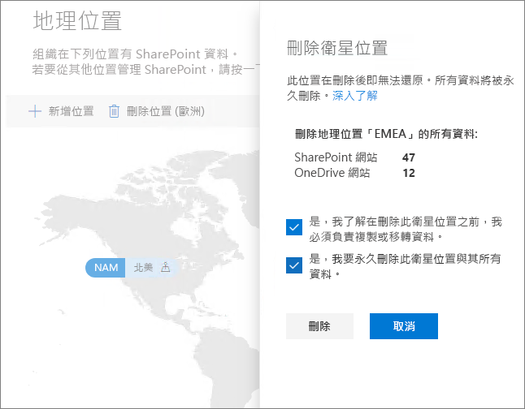

# 在 Microsoft 365 多地理位置中刪除衛星位置

如果您不再需要衛星位置，您可以從 SharePoint 系統管理中心的租用戶中將其刪除。

> [!WARNING]
> 將永久刪除衛星位置中的所有使用者資料。 這包括所有商務用 OneDrive 內容、SharePoint 網站及 Exchange 信箱，包括 Microsoft 365 群組信箱。 刪除衛星位置之前，您必須先將資料移轉到其他位置或中央位置。 這個動作無法復原。

只有全域系統管理員才能刪除衛星位置。

若要刪除衛星位置

1. 開啟 SharePoint 系統管理中心

2. 瀏覽至 [地理位置]**** 索引標籤。

3. 在地圖上，按一下您想要刪除的地理位置。

4. 按一下 [刪除群組]****。

5. 透過選取核取方塊以確認刪除。

6. 按一下 [刪除]****
