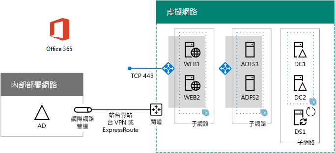

# Azure 中的 Office 365 高可用性同盟驗證

 **摘要：** 在 Microsoft Azure 中設定 Office 365 訂用帳戶的高可用性同盟驗證。
  
本文包含的逐步指示，說明如何使用這些虛擬機器在 Azure 基礎結構服務中的 Microsoft Office 365 部署高可用性聯盟的驗證：
  
- 兩個 Web 應用程式 Proxy 伺服器
    
- 兩個 Active Directory Federation Services (AD FS) 伺服器
    
- 兩個複本網域控制站
    
- 執行 Azure AD Connect 的同步處理 (DirSync) 伺服器。
    
組態如下，包含每部伺服器的預留位置名稱。
  
**Azure 中適用於 Office 365 基礎結構的高可用性同盟驗證**

  
所有虛擬機器位於單一跨單位 Azure 虛擬網路中 (VNet)。 
  
> [!NOTE]
> 個別使用者的聯盟驗證不會仰賴任何內部部署資源。不過，如果跨單位連線無法使用，VNet 中的網域控制站就不會收到使用者帳戶和群組在內部部署 Active Directory Domain Services (AD DS) 中的更新。若要確保不會發生這個情況，您可以設定跨場所連線的高可用性。如需詳細資訊，請參閱[高度可用的跨單位和 VNet-VNet 連線](https://docs.microsoft.com/azure/vpn-gateway/vpn-gateway-highlyavailable)。
  
特定角色的每個虛擬機器配對都是位於它自己的子網路和可用性設定組中。
  
> [!NOTE]
> 因為此 VNet 會連線到內部部署網路，所以此組態不包含管理子網路上的 Jumpbox 或監視虛擬機器。如需詳細資訊，請參閱＜[執行 N 層架構的 Windows VM](https://docs.microsoft.com/azure/guidance/guidance-compute-n-tier-vm)＞。 
  
這項設定的結果是，您所有的 Office 365 使用者都將會有聯盟驗證，他們可以在其中使用其 Active Directory Domain Services 憑證，而不是其 Office 365 帳戶登入。聯盟驗證基礎結構會使用一組多餘的伺服器，能更輕鬆部署在 Azure 基礎結構服務而不是內部部署邊緣網路中。
  
## 物料單

此基準組態需要下列 Azure 服務和元件集合：
  
- 九部虛擬機器
    
- 具有四個子網路的一個跨單位虛擬網路
    
- 四個資源群組
    
- 三個可用性設定組
    
- 一個 Azure 訂用帳戶
    
以下是此組態的虛擬機器與其預設大小。
  
|**項目**|**虛擬機器描述**|**Azure 圖庫影像**|**預設大小**|
|:-----|:-----|:-----|:-----|
|1.    |第一個網域控制站    |Windows Server 2016 Datacenter    |D2    |
|2.    |第二個網域控制站    |Windows Server 2016 Datacenter    |D2    |
|3.    |Azure AD Connect 伺服器    |Windows Server 2016 Datacenter    |D2    |
|4.    |第一個 AD FS 伺服器    |Windows Server 2016 Datacenter    |D2    |
|5.    |第二個 AD FS 伺服器    |Windows Server 2016 Datacenter    |D2    |
|6.    |第一個 Web 應用程式 Proxy 伺服器    |Windows Server 2016 Datacenter    |D2    |
|7.    |第二個 Web 應用程式 Proxy 伺服器    |Windows Server 2016 Datacenter    |D2    |
   
若要計算此組態的估計成本，請參閱 [Azure 價格計算機](https://azure.microsoft.com/pricing/calculator/)
  
## 部署階段

您可以在下列階段部署此工作負載：
  
- [階段 1：設定 Azure](high-availability-federated-authentication-phase-1-configure-azure.md)。建立資源群組、儲存體帳戶、可用性設定組和跨單位虛擬網路。
    
- [階段 2：設定網域控制站](high-availability-federated-authentication-phase-2-configure-domain-controllers.md)。建立和設定 Active Directory Domain Services (AD DS) 網域控制站複本和 DirSync 伺服器。
    
- [階段 3：設定 AD FS 伺服器](high-availability-federated-authentication-phase-3-configure-ad-fs-servers.md)。建立並設定兩個 AD FS 伺服器。
    
- [階段 4：設定 Web 應用程式 Proxy](high-availability-federated-authentication-phase-4-configure-web-application-pro.md)。建立並設定兩個 Web 應用程式 Proxy 伺服器。
    
- [階段 5：設定 Office 365 同盟的驗證](high-availability-federated-authentication-phase-5-configure-federated-authentic.md)。設定 Office 365 訂用帳戶的聯盟驗證。
    
這些文章是預先定義之架構的引導式、階段式指引，用以在 Azure 基礎結構服務中建立功能性、高可用性的 Office 365 聯盟驗證。請記住下列事項：
  
- 如果您是有經驗的 AD FS 實作者，請自行適應階段 3 至 4 中的指示，並建置最符合您需求的伺服器組。
    
- 如果您已擁有的現有 Azure 混合式雲端部署具有現有跨單位虛擬網路，請依需要調整或略過階段 1 和 2 中的指示，並將 AD FS 和 Web 應用程式 Proxy 伺服器置於適當的子網路中。
    
若要建置此組態的開發/測試環境或概念證明，請參閱＜[Office 365 開發人員/測試環境的同盟身分識別](federated-identity-for-your-office-365-dev-test-environment.md)＞。
  
## 下一步

使用＜[高可用性同盟驗證階段 1：設定 Azure](high-availability-federated-authentication-phase-1-configure-azure.md)＞開始設定此工作負載。 
  
<!--
> [!TIP]
> For a set of files to more quickly deploy your high availability federated authentication for Office 365 in Azure, see the [Federated Authentication for Office 365 in Azure Deployment Kit](https://gallery.technet.microsoft.com/Federated-Authentication-8a9f1664). 
--> 

