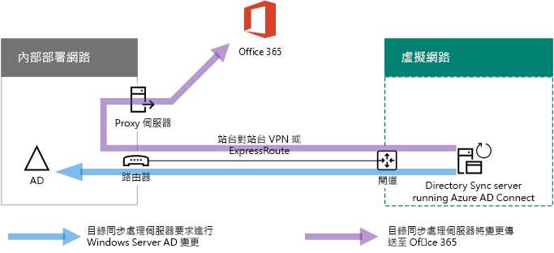
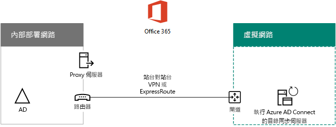

# 在 Microsoft Azure 中部署 Microsoft 365 目錄同步處理Deploy Microsoft 365 Directory Synchronization in Microsoft Azure

Azure Active Directory (Azure AD)  (Connect （以前稱為目錄同步處理工具、目錄同步處理工具或 DirSync.exe 工具) ）是您在加入網域的伺服器上安裝，以同步處理內部部署 Active Directory 網域服務 (AD DS) 使用者加入您的 Microsoft 365 訂閱的 Azure AD 租使用者。Azure Active Directory (Azure AD) Connect (formerly known as the Directory Synchronization tool, Directory Sync tool, or the DirSync.exe tool) is an application that you install on a domain-joined server to synchronize your on-premises Active Directory Domain Services (AD DS) users to the Azure AD tenant of your Microsoft 365 subscription. Microsoft 365 針對其目錄服務使用 Azure AD。Microsoft 365 uses Azure AD for its directory service. 您的 Microsoft 365 訂閱包含 Azure AD 租使用者。Your Microsoft 365 subscription includes an Azure AD tenant. 此租使用者也可以用來管理組織的身分識別與其他雲端工作負載，包括其他的 SaaS 應用程式和 Azure 中的應用程式。This tenant can also be used for management of your organization's identities with other cloud workloads, including other SaaS applications and apps in Azure.

您可以在內部部署伺服器上安裝Azure AD Connect，您也可以因為以下原因將其安裝在 Azure 中的虛擬機器上：You can install Azure AD Connect on a on-premises server, but you can also install it on a virtual machine in Azure for these reasons:
  
- 您可以更快速地佈建和設定雲端架構伺服器，以讓您的使用者可以更早使用服務。You can provision and configure cloud-based servers faster, making the services available to your users sooner.
- Azure 以更輕鬆的方式提供更佳的網站可用性。Azure offers better site availability with less effort.
- 您可以減少組織中的內部部署伺服器數目。You can reduce the number of on-premises servers in your organization.

本解決方案需要內部部署網路與 Azure 虛擬網路之間的連線。如需詳細資訊，請參閱[使內部部署網路與 Microsoft Azure 虛擬網路連線](connect-an-on-premises-network-to-a-microsoft-azure-virtual-network.md)。This solution requires connectivity between your on-premises network and your Azure virtual network. For more information, see [Connect an on-premises network to a Microsoft Azure virtual network](connect-an-on-premises-network-to-a-microsoft-azure-virtual-network.md). 
  
> [!NOTE]
> 本文說明單一樹系中單一網域的同步處理。This article describes synchronization of a single domain in a single forest. Azure AD Connect 會同步處理 Active Directory 樹系中的所有 AD DS 網域與 Microsoft 365。Azure AD Connect synchronizes all AD DS domains in your Active Directory forest with Microsoft 365. 如果您有多個 Active Directory 樹系與 Microsoft 365 同步，請參閱[多樹系目錄同步處理單一 Sign-On 案例](https://go.microsoft.com/fwlink/p/?LinkId=393091)。If you have multiple Active Directory forests to synchronize with Microsoft 365, see [Multi-forest Directory Sync with Single Sign-On Scenario](https://go.microsoft.com/fwlink/p/?LinkId=393091). 
  
## 在 Azure 中部署 Microsoft 365 目錄同步處理的概覽Overview of deploying Microsoft 365 directory synchronization in Azure

下圖顯示在 Azure 中的虛擬機器上執行 Azure AD Connect (會將內部部署 AD DS 樹系同步處理至 Microsoft 365 訂閱的目錄同步處理伺服器) 。The following diagram shows Azure AD Connect running on a virtual machine in Azure (the directory sync server) that synchronizes an on-premises AD DS forest to a Microsoft 365 subscription.
  

  
在此圖表中，有兩個使用站對站 VPN 或 ExpressRoute 連線連接的網路。有一個其中存在 AD DS 網域控制器的內部部署網路，和一個 Azure 虛擬網路，其中包含目錄同步處理伺服器 (執行 [Azure AD Connect](https://www.microsoft.com/download/details.aspx?id=47594) 的虛擬機器)。從目錄同步處理伺服器會產生二個主要流量：In the diagram, there are two networks connected by a site-to-site VPN or ExpressRoute connection. There is an on-premises network where AD DS domain controllers are located, and there is an Azure virtual network with a directory sync server, which is a virtual machine running [Azure AD Connect](https://www.microsoft.com/download/details.aspx?id=47594). There are two main traffic flows originating from the directory sync server:
  
-  Azure AD Connect 將內部部署網路上的網域控制器排入佇列，來處理帳戶和密碼的變更。Azure AD Connect queries a domain controller on the on-premises network for changes to accounts and passwords.
-  Azure AD Connect 會將帳戶和密碼的變更傳送至 Microsoft 365 訂閱的 Azure AD 實例。Azure AD Connect sends the changes to accounts and passwords to the Azure AD instance of your Microsoft 365 subscription. 因為目錄同步處理伺服器位於內部部署網路的擴充部分，所以這些變更會透過內部部署網路的 proxy 伺服器來傳送。Because the directory sync server is in an extended portion of your on-premises network, these changes are sent through the on-premises network's proxy server.
    
> [!NOTE]
> 此解決方案說明單一 active Directory 網域在單一 Active Directory 樹系中的同步處理。This solution describes synchronization of a single Active Directory domain, in a single Active Directory forest. Azure AD Connect 會同步處理 Active Directory 樹系中的所有 Active Directory 網域與 Microsoft 365。Azure AD Connect synchronizes all Active Directory domains in your Active Directory forest with Microsoft 365. 如果您有多個 Active Directory 樹系與 Microsoft 365 同步，請參閱[多樹系目錄同步處理單一 Sign-On 案例](https://go.microsoft.com/fwlink/p/?LinkId=393091)。If you have multiple Active Directory forests to synchronize with Microsoft 365, see [Multi-forest Directory Sync with Single Sign-On Scenario](https://go.microsoft.com/fwlink/p/?LinkId=393091). 
  
部署此解決方案有兩個主要步驟：There are two major steps when you deploy this solution:
  
1. 建立 Azure 虛擬網路，以及建立您的內部部署網路的站對站 VPN 連線。如需詳細資訊，請參閱＜[使內部部署網路與 Microsoft Azure 虛擬網路連線](connect-an-on-premises-network-to-a-microsoft-azure-virtual-network.md)＞。Create an Azure virtual network and establish a site-to-site VPN connection to your on-premises network. For more information, see [Connect an on-premises network to a Microsoft Azure virtual network](connect-an-on-premises-network-to-a-microsoft-azure-virtual-network.md).
    
2. 在 Azure 中已加入網域的虛擬機器上安裝[AZURE AD Connect](https://www.microsoft.com/download/details.aspx?id=47594) ，然後將內部部署 AD DS 同步處理至 Microsoft 365。Install [Azure AD Connect](https://www.microsoft.com/download/details.aspx?id=47594) on a domain-joined virtual machine in Azure, and then synchronize the on-premises AD DS to Microsoft 365. 這包括：This involves:
    
    建立 Azure 虛擬機器以執行 Azure AD Connect。Creating an Azure Virtual Machine to run Azure AD Connect.
    
    安裝及設定 [Azure AD Connect](https://www.microsoft.com/download/details.aspx?id=47594)。Installing and configuring [Azure AD Connect](https://www.microsoft.com/download/details.aspx?id=47594).
    
    若要設定 Azure AD Connect，必須 (Azure AD 系統管理員帳戶和 AD DS 企業系統管理員帳戶的認證使用者名稱和密碼) 。Configuring Azure AD Connect requires the credentials (user name and password) of an Azure AD administrator account and a AD DS enterprise administrator account. Azure AD Connect 會立即執行，並持續執行，以同步處理內部部署 AD DS 樹系與 Microsoft 365。Azure AD Connect runs immediately and on an ongoing basis to synchronize the on-premises AD DS forest to Microsoft 365.
    
在生產環境中部署此方案之前，您可以使用[模擬的企業基本](https://docs.microsoft.com/microsoft-365/enterprise/simulated-ent-base-configuration-microsoft-365-enterprise)設定中的指示，將此設定設為概念證明、示範或實驗。Before you deploy this solution in production, you can use the instructions in [The simulated enterprise base configuration](https://docs.microsoft.com/microsoft-365/enterprise/simulated-ent-base-configuration-microsoft-365-enterprise) to set this configuration up as a proof of concept, for demonstrations, or for experimentation.
  
> [!IMPORTANT]
> 當 Azure AD Connect 組態完成時，它不會儲存 AD DS 企業系統管理員帳戶認證。When Azure AD Connect configuration completes, it does not save the AD DS enterprise administrator account credentials. 
  
> [!NOTE]
> 此解決方案說明如何將單一 AD DS 樹系同步處理至 Microsoft 365。This solution describes synchronizing a single AD DS forest to Microsoft 365. 本文中所討論的拓撲只是實施此方案的一種方法。The topology discussed in this article represents only one way to implement this solution. 組織的拓撲可能會因您的獨特網路需求和安全性考慮而有所不同。Your organization's topology might differ based on your unique network requirements and security considerations. 
  
## 針對 Azure 中的 Microsoft 365 主控目錄同步處理伺服器的計畫Plan for hosting a directory sync server for Microsoft 365 in Azure

### 必要條件Prerequisites

開始之前，請先檢閱本解決方案的下列必要條件：Before you begin, review the following prerequisites for this solution:
  
- 檢閱＜[規劃您的 Azure 虛擬網路](connect-an-on-premises-network-to-a-microsoft-azure-virtual-network.md#plan-your-azure-virtual-network)＞中的相關規劃內容。Review the related planning content in [Plan your Azure virtual network](connect-an-on-premises-network-to-a-microsoft-azure-virtual-network.md#plan-your-azure-virtual-network).
    
- 確保您符合設定 Azure 虛擬網路的所有[必要條件](connect-an-on-premises-network-to-a-microsoft-azure-virtual-network.md#prerequisites)。Ensure that you meet all [Prerequisites](connect-an-on-premises-network-to-a-microsoft-azure-virtual-network.md#prerequisites) for configuring the Azure virtual network.
    
- 擁有包含 Active Directory 整合功能的 Microsoft 365 訂閱。Have a Microsoft 365 subscription that includes the Active Directory integration feature. 如需 Microsoft 365 訂閱的相關資訊，請移至 [ [microsoft 365 訂閱] 頁面](https://products.office.com/compare-all-microsoft-office-products?tab=2)。For information about Microsoft 365 subscriptions, go to the [Microsoft 365 subscription page](https://products.office.com/compare-all-microsoft-office-products?tab=2).
    
- 布建一個執行 Azure AD Connect 的 Azure 虛擬機器，以同步處理內部部署 AD DS 樹系與 Microsoft 365。Provision one Azure Virtual Machine that runs Azure AD Connect to synchronize your on-premises AD DS forest with Microsoft 365.
    
    您必須具有 AD DS 企業系統管理員帳戶和 Azure AD 系統管理員帳戶的認證 (名稱和密碼)。You must have the credentials (names and passwords) for a AD DS enterprise administrator account and an Azure AD Administrator account.
    
### 解決方案架構設計假設Solution architecture design assumptions

下列清單描述此解決方案所採用的設計選擇。The following list describes the design choices made for this solution.
  
- 這個解決方案使用具備站對站 VPN 連線的單一 Azure 虛擬網路。Azure 虛擬網路會裝載單一子網路，其具有一部執行 Azure AD Connect 的目錄同步處理伺服器。This solution uses a single Azure virtual network with a site-to-site VPN connection. The Azure virtual network hosts a single subnet that has one server, the directory sync server that is running Azure AD Connect. 
    
- 在內部部署網路上會有網域控制站和 DNS 伺服器。On the on-premises network, a domain controller and DNS servers exist.
    
- Azure AD Connect 會執行密碼雜湊同步處理，而非單一登入。您不需要部署 Active Directory 同盟服務 (AD FS) 基礎結構。若要深入了解密碼雜湊同步處理與單一登入選項，請參閱＜[為您的 Azure Active Directory 混合式識別解決方案選擇正確的驗證方法](https://aka.ms/auth-options)＞。Azure AD Connect performs password hash synchronization instead of single sign-on. You do not have to deploy an Active Directory Federation Services (AD FS) infrastructure. To learn more about password hash synchronization and single sign-on options, see [Choosing the right authentication method for your Azure Active Directory hybrid identity solution](https://aka.ms/auth-options).
    
在您的環境中部署此解決方案時，您可能會考慮的其他設計選擇。其中包含下列各項：There are additional design choices that you might consider when you deploy this solution in your environment. These include the following:
  
- 如果現有的 Azure 虛擬網路中有現有的 DNS 伺服器，請判斷您的目錄同步處理伺服器是否要使用它們 (而非使用內部部署網路的 DNS 伺服器) 來進行名稱解析。If there are existing DNS servers in an existing Azure virtual network, determine whether you want your directory sync server to use them for name resolution instead of DNS servers on the on-premises network.
    
- 如果現有的 Azure 虛擬網路中有網域控制站，請判斷設定 Active Directory 網站及服務是否是較好的選擇。目錄同步處理伺服器可以將 Azure 虛擬網路的網域控制器排入佇列，來處理帳戶和密碼的變更，而非內部部署網路上的網域控制器。If there are domain controllers in an existing Azure virtual network, determine whether configuring Active Directory Sites and Services may be a better option for you. The directory sync server can query the domain controllers in the Azure virtual network for changes in accounts and passwords instead of domain controllers on the on-premises network.
    
## 部署藍圖Deployment roadmap

在 Azure 中的虛擬機器上部署 Azure AD Connect 由三個階段所組成：Deploying Azure AD Connect on a virtual machine in Azure consists of three phases:
  
- 階段 1：建立及設定 Azure 虛擬網路Phase 1: Create and configure the Azure virtual network
    
- 階段 2：建立及設定 Azure 虛擬機器Phase 2: Create and configure the Azure virtual machine
    
- 階段 3：安裝及設定 Azure AD ConnectPhase 3: Install and configure Azure AD Connect
    
部署之後，您還必須在 Microsoft 365 中為新使用者帳戶指派位置和授權。After deployment, you must also assign locations and licenses for the new user accounts in Microsoft 365.

### 階段 1：建立及設定 Azure 虛擬網路Phase 1: Create and configure the Azure virtual network

若要建立及設定 Azure 虛擬網路，請完成＜[使內部部署網路與 Microsoft Azure 虛擬網路連線](connect-an-on-premises-network-to-a-microsoft-azure-virtual-network.md)＞中的＜[階段 1：準備內部部署網路](connect-an-on-premises-network-to-a-microsoft-azure-virtual-network.md#phase-1-prepare-your-on-premises-network)＞和＜[階段 2：在 Azure 中建立跨單位的虛擬網路](connect-an-on-premises-network-to-a-microsoft-azure-virtual-network.md#phase-2-create-the-cross-premises-virtual-network-in-azure)＞。To create and configure the Azure virtual network, complete [Phase 1: Prepare your on-premises network](connect-an-on-premises-network-to-a-microsoft-azure-virtual-network.md#phase-1-prepare-your-on-premises-network) and [Phase 2: Create the cross-premises virtual network in Azure](connect-an-on-premises-network-to-a-microsoft-azure-virtual-network.md#phase-2-create-the-cross-premises-virtual-network-in-azure) in the deployment roadmap of [Connect an on-premises network to a Microsoft Azure virtual network](connect-an-on-premises-network-to-a-microsoft-azure-virtual-network.md).
  
這是您產生的組態。This is your resulting configuration.
  

  
本圖顯示使用站對站 VPN 或 ExpressRoute 連線方式，連線到 Azure 虛擬網路的內部部署網路。This figure shows an on-premises network connected to an Azure virtual network through a site-to-site VPN or ExpressRoute connection.
  
### 階段 2：建立及設定 Azure 虛擬機器Phase 2: Create and configure the Azure virtual machine

使用＜[在 Azure 入口網站中建立第一個 Windows 虛擬機器](https://go.microsoft.com/fwlink/p/?LinkId=393098)＞中的指示，在 Azure 中建立虛擬機器。使用下列設定：Create the virtual machine in Azure using the instructions [Create your first Windows virtual machine in the Azure portal](https://go.microsoft.com/fwlink/p/?LinkId=393098). Use the following settings:
  
- 在 [基本概念]\*\*\*\* 窗格中，選取相同的訂閱、位置及資源群組做為您的虛擬網路，並在安全位置記錄使用者名稱和密碼。您稍後連線到虛擬機器時會需要這些資訊。On the **Basics** pane, select the same subscription, location, and resource group as your virtual network. Record the user name and password in a secure location. You will need these later to connect to the virtual machine.
    
- 在 [選擇大小]\*\*\*\* 窗格中，選擇 [A2 標準]\*\*\*\* 大小。On the **Choose a size** pane, choose the **A2 Standard** size.
    
- 在 [設定]\*\*\*\* 窗格中，請在 [儲存體]\*\*\*\* 區段中，選取 [標準]\*\*\*\* 儲存體類型。在 [網路]\*\*\*\* 區段中，選取您裝載目錄同步處理伺服器 (不是閘道子網路) 的虛擬網路和子網路名稱。其他所有設定都保留預設值。On the **Settings** pane, in the **Storage** section, select the **Standard** storage type. In the **Network** section, select the name of your virtual network and the subnet for hosting the directory sync server (not the GatewaySubnet). Leave all other settings at their default values.
    
驗證目錄同步處理伺服器正確使用 DNS，檢查內部 DNS 以確定已使用其 IP 位址，新增虛擬機器的位址 (A) 記錄。Verify that your directory sync server is using DNS correctly by checking your internal DNS to make sure that an Address (A) record was added for the virtual machine with its IP address. 
  
使用[連線到虛擬機器並且登入](https://docs.microsoft.com/azure/virtual-machines/windows/connect-logon)中的指示，使用遠端桌面連線以連線到目錄同步處理伺服器。登入之後，將虛擬機器加入到內部部署 AD DS 網域。Use the instructions in [Connect to the virtual machine and sign on](https://docs.microsoft.com/azure/virtual-machines/windows/connect-logon) to connect to the directory sync server with a Remote Desktop Connection. After signing in, join the virtual machine to the on-premises AD DS domain.
  
若要讓 Azure AD Connect 取得存取網際網路資源的權限，您必須設定目錄同步處理伺服器來使用內部部署網路的 Proxy 伺服器。您應該連絡您的網路系統管理員，以取得需要執行的其他設定步驟。For Azure AD Connect to gain access to Internet resources, you must configure the directory sync server to use the on-premises network's proxy server. You should contact your network administrator for any additional configuration steps to perform.
  
這是您產生的組態。This is your resulting configuration.
  

  
本圖顯示在跨部署 Azure 虛擬網路中的目錄同步處理伺服器虛擬機器。This figure shows the directory sync server virtual machine in the cross-premises Azure virtual network.
  
### 階段 3：安裝及設定 Azure AD ConnectPhase 3: Install and configure Azure AD Connect

完成下列程序：Complete the following procedure:
  
1. 透過具有本機系統管理員權限的 AD DS 網域帳戶使用遠端桌面連線，連線到目錄同步處理伺服器。請參閱[連線到虛擬機器並且登入](https://docs.microsoft.com/azure/virtual-machines/windows/connect-logon)。Connect to the directory sync server using a Remote Desktop Connection with an AD DS domain account that has local administrator privileges. See [Connect to the virtual machine and sign on](https://docs.microsoft.com/azure/virtual-machines/windows/connect-logon).
    
2. 在目錄同步處理伺服器中，開啟 [[設定 Microsoft 365 文章的目錄同步](set-up-directory-synchronization.md)處理]，並遵循密碼雜湊同步處理的目錄同步處理指示。From the directory sync server, open the [Set up directory synchronization for Microsoft 365](set-up-directory-synchronization.md) article and follow the directions for directory synchronization with password hash synchronization.
    
> [!CAUTION]
> 安裝程式會在本機使用者組織單位 (OU) 中建立 **AAD_xxxxxxxxxxxx** 帳戶。請勿移動或移除此帳戶，否則同步處理將會失敗。Setup creates the **AAD_xxxxxxxxxxxx** account in the Local Users organizational unit (OU). Do not move or remove this account or synchronization will fail.
  
這是您產生的組態。This is your resulting configuration.
  

  
本圖顯示在跨部署 Azure 虛擬網路中的 Azure AD Connect 目錄同步處理伺服器。This figure shows the directory sync server with Azure AD Connect in the cross-premises Azure virtual network.
  
### 將位置和授權指派給 Microsoft 365 中的使用者Assign locations and licenses to users in Microsoft 365

Azure AD Connect 會從內部部署 AD DS 將帳戶新增至 Microsoft 365 訂閱，但是為了讓使用者能夠登入 Microsoft 365 並使用其服務，必須使用位置和授權來設定帳戶。Azure AD Connect adds accounts to your Microsoft 365 subscription from the on-premises AD DS, but in order for users to sign in to Microsoft 365 and use its services, the accounts must be configured with a location and licenses. 使用下列步驟為適當的使用者帳戶新增位置和啟用授權：Use these steps to add the location and activate licenses for the appropriate user accounts:
  
1. 登入[Microsoft 365 系統管理中心](https://admin.microsoft.com)，然後按一下 [**管理**]。Sign in to the [Microsoft 365 admin center](https://admin.microsoft.com), and then click **Admin**.
    
2. 在左方的瀏覽區域中，按一下 [使用者] > [作用中的使用者]\*\*\*\*。In the left navigation, click **Users > Active users**.
    
3. 在使用者帳戶清單中，選取您要啟動使用者旁的核取方塊。In the list of user accounts, select the check box next to the user you want to activate.
    
4. 在使用者的頁面上，按一下 [產品授權]\*\*\*\* 的 [編輯]\*\*\*\*。On the page for the user, click **Edit** for **Product licenses**.
    
5. 在 [產品授權]\*\*\*\* 頁面上，為**位置**的使用者選取一個位置，然後為使用者啟用適當授權。On the **Product licenses** page, select a location for the user for **Location**, and then enable the appropriate licenses for the user.
    
6. 完成時，按一下 [儲存]\*\*\*\*，然後按兩下 [關閉]\*\*\*\*。When complete, click **Save**, and then click **Close** twice.
    
7. 針對其他使用者回到步驟 3。Go back to step 3 for additional users.
    
## 另請參閱See also

[雲端採用和混合式解決方案Cloud adoption and hybrid solutions](cloud-adoption-and-hybrid-solutions.yml)
  
[使內部部署網路與 Microsoft Azure 虛擬網路連線Connect an on-premises network to a Microsoft Azure virtual network](connect-an-on-premises-network-to-a-microsoft-azure-virtual-network.md)

[下載 Azure AD ConnectDownload Azure AD Connect](https://www.microsoft.com/download/details.aspx?id=47594)
  
[設定 Microsoft 365 的目錄同步處理Set up directory synchronization for Microsoft 365](set-up-directory-synchronization.md)
  
