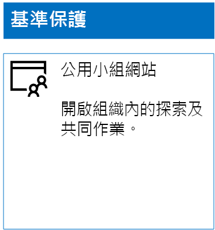
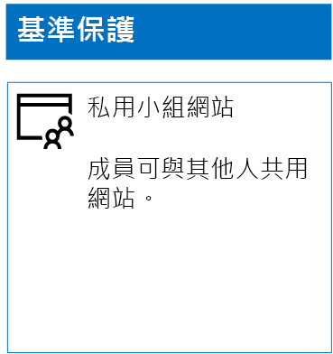
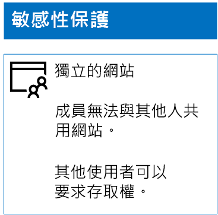
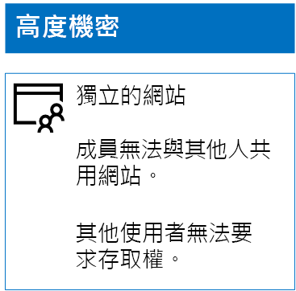

# 部署三層的保護的 SharePoint Online 的網站Deploy SharePoint Online sites for three tiers of protection

 **摘要：**建立及設定的不同層級的資訊保護的 SharePoint Online 小組網站。**Summary:** Create and configure SharePoint Online team sites for various levels of information protection.
  
使用本文中的步驟來設計及部署比較基準 」、 機密、 和高度機密 SharePoint Online 小組網站。如需保護這些三層的詳細資訊，請參閱[Secure SharePoint Online 網站及檔案](secure-sharepoint-online-sites-and-files.md)。Use the steps in this article to design and deploy baseline, sensitive, and highly confidential SharePoint Online team sites. For more information about these three tiers of protection, see [Secure SharePoint Online sites and files](secure-sharepoint-online-sites-and-files.md).
  
## [比較基準 SharePoint Online 小組網站Baseline SharePoint Online team sites

[比較基準保護包含這兩個公用及私人小組網站。可以探索和組織中的任何人存取公用小組網站。私用網站可以只探索和存取小組網站相關聯的 Office 365 群組的成員。這兩個小組網站這類允許成員與其他人] 共用網站。Baseline protection includes both public and private team sites. Public team sites can be discovered and accessed by anybody in the organization. Private sites can only be discovered and accessed by members of the Office 365 group associated with the team site. Both of these types of team sites allow members to share the site with others.
  
### 公用Public

若要建立基準 SharePoint Online 小組網站與公用存取和權限，執行下列動作：To create a baseline SharePoint Online team site with public access and permissions, do the following:
  
1. Office 365 入口網站也可用於管理 SharePoint Online 小組網站 （SharePoint Online 系統管理員） 帳戶登入。為了協助，請參閱 ＜[登入 Office 365 的位置](https://support.office.com/Article/Where-to-sign-in-to-Office-365-e9eb7d51-5430-4929-91ab-6157c5a050b4)。Sign in to the Office 365 portal with an account that will also be used to administer the SharePoint Online team site (a SharePoint Online administrator). For help, see [Where to sign in to Office 365](https://support.office.com/Article/Where-to-sign-in-to-Office-365-e9eb7d51-5430-4929-91ab-6157c5a050b4).
    
2. 在 [並排顯示] 清單中按一下 [ **SharePoint**]。In the list of tiles, click **SharePoint**.
    
3. 在 [新增**SharePoint** ] 索引標籤在瀏覽器中按一下 [ **+ 建立網站**。On the new **SharePoint** tab in your browser, click **+ Create site**.
    
4. 在 [**建立網站**] 頁面上，按一下 [**小組網站**。On the **Create a site** page, click **Team site**.
    
5. 在**站台名稱**] 中，輸入公用小組網站的名稱。In **Site name**, type a name for the public team site. 
    
6. 在**小組網站描述**] 中，輸入網站的用途說明。In **Team site description**, type a description of the purpose of the site.
    
7. **隱私權設定**] 中選取**公用位在組織中的任何人都可以存取此站台**，並再按 [**下一步**。In **Privacy settings**, select **Public - anyone in the organization can access this site**, and then click **Next**.
    
8. 在**您要新增誰？** ] 窗格中，按一下 [**完成]**。On the **Who do you want to add?** pane, click **Finish**.
    
以下是您產生的組態。Here is your resulting configuration.
  

  
### 私人Private

若要建立基準 SharePoint Online 小組網站與私人 access 和權限，執行下列動作：To create a baseline SharePoint Online team site with private access and permissions, do the following:
  
1. Office 365 入口網站也可用於管理 SharePoint Online 小組網站 （SharePoint Online 系統管理員） 帳戶登入。為了協助，請參閱 ＜[登入 Office 365 的位置](https://support.office.com/Article/Where-to-sign-in-to-Office-365-e9eb7d51-5430-4929-91ab-6157c5a050b4)。Sign in to the Office 365 portal with an account that will also be used to administer the SharePoint Online team site (a SharePoint Online administrator). For help, see [Where to sign in to Office 365](https://support.office.com/Article/Where-to-sign-in-to-Office-365-e9eb7d51-5430-4929-91ab-6157c5a050b4).
    
2. 在 [並排顯示] 清單中按一下 [ **SharePoint**]。In the list of tiles, click **SharePoint**.
    
3. 在 [新增**SharePoint** ] 索引標籤在瀏覽器中按一下 [ **+ 建立網站**。On the new **SharePoint** tab in your browser, click **+ Create site**.
    
4. 在 [**建立網站**] 頁面上，按一下 [**小組網站**。On the **Create a site** page, click **Team site**.
    
5. 在**站台名稱**] 中輸入私人小組網站的名稱。In **Site name**, type a name for the private team site. 
    
6. 在**小組網站描述] 中，**輸入網站的用途說明。In **Team site description,** type a description of the purpose of the site.
    
7. **隱私權設定**] 中選取 [**私人-只有成員可以存取此站台**，然後按一下 [**下一步**。In **Privacy settings**, select **Private - only members can access this site**, and then click **Next**.
    
8. 在**您要新增誰？** ] 窗格中，在**新增成員**中，輸入能夠存取這私人小組網站的使用者帳戶的名稱。On the **Who do you want to add?** pane, in **Add members**, type the names of user accounts that have access to this private team site.
    
9. 當您完成初始組成員新增至網站，按一下 [**完成時間**When you are done adding the initial set of members to the site, click **Finish**
    
以下是您產生的組態。Here is your resulting configuration.
  

  
## 機密的 SharePoint Online 小組網站Sensitive SharePoint Online team sites

機密的 SharePoint Online 小組網站是隔離的小組網站] 表示權限所控制透過而不是在小組網站相關聯的 Office 365 群組的成員資格的 SharePoint 群組的成員資格。A sensitive SharePoint Online team site is an isolated team site, which means that permissions are controlled through membership in SharePoint groups instead of membership in the Office 365 group associated with the team site.
  
若要建立的隔離的小組網站，有兩個主要步驟。To create an isolated team site, there are two main steps.
  
### 步驟 1： 設計在隔離的網站Step 1: Design your isolated site

若要設計隔離的小組網站，您需要決定：To design your isolated team site, you need to determine:
  
- 您的 SharePoint 群組和權限層級。Your SharePoint groups and permission levels.
    
- 將您的 SharePoint 群組的成員存取群組的屬性集。The set of access groups that will be members of your SharePoint groups.
    
     存取群組的建議的設定是一個網站成員，一個網站檢視者另一個網站管理員。The recommended set of access groups is one for site members, one for site viewers, and one for site administrators.
    
- 您是否要使用的巢狀存取群組內的群組。Whether you will use nested groups within your access groups.
    
例如，建議的群組結構和權限層級看起來如下：For example, the recommended group structure and permission levels look like this:
  
|**SharePoint 群組****SharePoint group**|**權限層級****Permission level**|**存取群組 （範例）****Access group (examples)**|
|:-----|:-----|:-----|
|[網站名稱]成員[site name] Members    |編輯Edit    |[網站名稱]成員[site name] Members    |
|[網站名稱]訪客[site name] Visitors    |讀取Read    |[網站名稱]檢視程式[site name] Viewers    |
|[網站名稱]擁有者[site name] Owners    |完全控制Full control    |[網站名稱]系統管理員[site name] Admins    |
   
小組網站的預設會建立 SharePoint 群組與權限層級。您需要確定您的存取群組的名稱。The SharePoint groups and permission levels are created by default for a team site. You need to determine the names of your access groups.
  
如需設計程序的詳細資訊，請參閱 ＜ [Design 隔離的 SharePoint Online 小組網站](design-an-isolated-sharepoint-online-team-site.md)。For the details of the design process, see [Design an isolated SharePoint Online team site](design-an-isolated-sharepoint-online-team-site.md).
  
### 步驟 2： 部署隔離的網站Step 2: Deploy your isolated site

若要部署在隔離的網站，您必須先：To deploy your isolated site, you first need to:
  
- 決定使用者帳戶和群組新增至每個存取群組。Determine the user accounts and groups to add to each of your access groups.
    
- 建立存取群組並新增使用者和群組的成員。Create the access groups and add the user and group members.
    
如需詳細的步驟，請參閱 ＜**階段 1**的[部署隔離的 SharePoint Online 小組網站](deploy-an-isolated-sharepoint-online-team-site.md)。For the detailed steps, see **Phase 1** of [Deploy an isolated SharePoint Online team site](deploy-an-isolated-sharepoint-online-team-site.md).
  
接下來，您可以建立的 SharePoint Online 小組網站進行這些步驟。Next, you create the SharePoint Online team site with these steps.
  
1. Office 365 入口網站也可用於管理 SharePoint Online 小組網站 （SharePoint Online 系統管理員） 帳戶登入。為了協助，請參閱 ＜[登入 Office 365 的位置](https://support.office.com/Article/Where-to-sign-in-to-Office-365-e9eb7d51-5430-4929-91ab-6157c5a050b4)。Sign in to the Office 365 portal with an account that will also be used to administer the SharePoint Online team site (a SharePoint Online administrator). For help, see [Where to sign in to Office 365](https://support.office.com/Article/Where-to-sign-in-to-Office-365-e9eb7d51-5430-4929-91ab-6157c5a050b4).
    
2. 在 [並排顯示] 清單中按一下 [ **SharePoint**]。In the list of tiles, click **SharePoint**.
    
3. 新**SharePoint**索引標籤中的瀏覽器中，按一下 [ **+ 建立網站**]。In the new **SharePoint** tab of your browser, click **+ Create site**.
    
4. 在 [**建立網站**] 頁面上，按一下 [**小組網站**。On the **Create a site** page, click **Team site**.
    
5. 在**站台名稱**] 中輸入私人小組網站的名稱。In **Site name**, type a name for the private team site.
    
6. 在**小組網站描述**] 中，輸入的選用描述。In **Team site description**, type an optional description.
    
7. **隱私權設定**] 中選取 [**私人-只有成員可以存取此站台**，然後按一下 [**下一步**。In **Privacy settings**, select **Private - only members can access this site**, and then click **Next**.
    
8. 在**您要新增誰？** ] 窗格中，按一下 [**完成]**。On the **Who do you want to add?** pane, click **Finish**.
    
下一步] 從新的 SharePoint Online 小組網站，請使用下列步驟設定權限。Next, from the new SharePoint Online team site, configure permissions with these steps.
  
1. 決定使用者主體名稱 (UPN) 的 IT 管理員或其他負責回應及位址的網站的存取權要求的人員 （belindan@contoso.com 是 UPN 的範例）。寫入該的 UPN： ___。Determine the User Principal Name (UPN) of the IT administrator or other person who will be responsible for responding to and addressing requests for access to the site (belindan@contoso.com is an example of a UPN). Write that UPN here: _________________________________________.
    
2. 在 [工具] 列中按一下 [設定] 圖示，和 [**網站權限**。In the tool bar, click the settings icon, and then click **Site permissions**.
    
3. 在 [**網站權限**] 窗格中，按一下 [**進階權限設定**。In the **Site permissions** pane, click **Advanced permissions settings**.
    
4. 新**的權限**] 索引標籤上的瀏覽器中，按一下 [**存取要求設定**]。On the new **Permissions** tab of your browser, click **Access Request Settings**.
    
5. 在 [**存取要求設定**] 對話方塊中：In the **Access Requests Settings** dialog box:
    
  - 清除 [**允許成員] 共用網站和個別的檔案及資料夾**和**允許邀請其他人網站成員 」 群組的成員**] 核取方塊。Clear the **Allow members to share the site and individual files and folders** and **Allow members to invite others to the site members group** check boxes.
    
  - 輸入您的 IT 管理員從步驟 1 的 UPN**傳送存取的所有要求**。Type the UPN of your IT administrator from step 1 in **Send all requests for access**.
    
  - 按一下 [確定]****。Click **OK**.
    
6. 在瀏覽器的 [**權限**] 索引標籤中，按一下 [清單中的**[網站名稱] 成員**。On the **Permissions** tab of your browser, click **[site name] Members** in the list.
    
7. 在 [**人員與群組**，按一下 [**新增**]。In **People and Groups**, click **New**.
    
8. 在 [**共用**] 對話方塊中，輸入您的網站成員存取群組此網站的名稱、 選取它，和 [**共用**。In the **Share** dialog box, type the name of your site members access group for this site, select it, and then click **Share**.
    
9. 按一下瀏覽器上的 [上一頁] 按鈕。Click the back button on your browser.
    
10. 按一下**[網站名稱] 擁有者**] 清單中。Click **[site name] Owners** in the list.
    
11. 在 [**人員與群組**，按一下 [**新增**]。In **People and Groups**, click **New**.
    
12. 在 [**共用**] 對話方塊中，輸入此網站的網站管理員存取群組的名稱、 選取它，和 [**共用**。In the **Share** dialog box, type the name of the site administrators access group for this site, select it, and then click **Share**.
    
13. 按一下瀏覽器上的 [上一頁] 按鈕。Click the back button on your browser.
    
14. 按一下**[網站名稱] 訪客**] 清單中。Click **[site name] Visitors** in the list.
    
15. 在 [**人員與群組**，按一下 [**新增**]。In **People and Groups**, click **New**.
    
16. 在 [**共用**] 對話方塊中，輸入此網站的網站檢視者存取群組的名稱、 選取它，和 [**共用**。In the **Share** dialog box, type the name of the site viewers access group for this site, select it, and then click **Share**.
    
17. 關閉瀏覽器的 [**權限**] 索引標籤。Close the **Permissions** tab of your browser.
    
這些權限設定的結果是：The results of these permission settings are:
  
- **[網站名稱] 擁有者**SharePoint 群組包含網站管理員存取群組中的所有成員具有 [**完全控制**」 權限層級。The **[site name] Owners** SharePoint group contains the site administrators access group, in which all the members have the **Full control** permission level.
    
- **[網站名稱] 成員**SharePoint 群組包含網站成員存取群組中的所有成員具有**編輯**權限等級。The **[site name] Members** SharePoint group contains the site members access group, in which all the members have the **Edit** permission level.
    
- **[網站名稱] 訪客**SharePoint 群組包含網站檢視者存取群組中的所有成員具有 「**讀取**」 權限等級。The **[site name] Visitors** SharePoint group contains the site viewers access group, in which all the members have the **Read** permission level.
    
- 邀請其他成員的成員的功能已停用。The ability for members to invite other members is disabled.
    
- 非成員要求存取的功能已啟用。The ability for non-members to request access is enabled.
    
以下是您產生的組態。Here is your resulting configuration.
  

  
網站透過群組成員資格之一的存取群組的成員可以現在安全地進行共同作業網站的資源。The members of the site, through group membership in one of the access groups, can now securely collaborate on the resources of the site.
  
## 高度機密的 SharePoint Online 小組網站Highly confidential SharePoint Online team sites

高度機密的 SharePoint Online 小組網站是隔離的小組網站] 表示權限所控制透過而不是在小組網站相關聯的 Office 365 群組的成員資格的 SharePoint 群組的成員資格。A highly confidential SharePoint Online team site is an isolated team site, which means that permissions are controlled through membership in SharePoint groups instead of membership in the Office 365 group associated with the team site.
  
若要建立高度機密資訊與共同作業的隔離的小組網站，有兩個主要步驟。To create an isolated team site for highly confidential information and collaboration, there are two main steps.
  
### 步驟 1： 設計在隔離的網站Step 1: Design your isolated site

若要設計隔離的小組網站，您需要決定：To design your isolated team site, you need to determine:
  
- 您的 SharePoint 群組和權限層級。Your SharePoint groups and permission levels.
    
- 將您的 SharePoint 群組的成員存取群組的屬性集。The set of access groups that will be members of your SharePoint groups.
    
     存取群組的建議的設定是一個網站成員，一個網站檢視者另一個網站管理員。The recommended set of access groups is one for site members, one for site viewers, and one for site administrators.
    
- 您是否要使用的巢狀存取群組內的群組。Whether you will use nested groups within your access groups.
    
例如，建議的群組結構和權限層級看起來如下：For example, the recommended group structure and permission levels look like this:
  
|**SharePoint 群組****SharePoint group**|**權限層級****Permission level**|**存取群組 （範例）****Access group (examples)**|
|:-----|:-----|:-----|
|[網站名稱]成員[site name] Members    |編輯Edit    |[網站名稱]成員[site name] Members    |
|[網站名稱]訪客[site name] Visitors    |讀取Read    |[網站名稱]檢視程式[site name] Viewers    |
|[網站名稱]擁有者[site name] Owners    |完全控制Full control    |[網站名稱]系統管理員[site name] Admins    |
   
小組網站的預設會建立 SharePoint 群組與權限層級。您需要確定您的存取群組的名稱。The SharePoint groups and permission levels are created by default for a team site. You need to determine the names of your access groups.
  
如需設計程序的詳細資訊，請參閱 ＜ [Design 隔離的 SharePoint Online 小組網站](design-an-isolated-sharepoint-online-team-site.md)。For the details of the design process, see [Design an isolated SharePoint Online team site](design-an-isolated-sharepoint-online-team-site.md).
  
### 步驟 2： 部署隔離的網站Step 2: Deploy your isolated site

若要部署在隔離的網站，您必須先：To deploy your isolated site, you first need to:
  
- 決定每個存取群組的使用者與群組成員Determine the user and group members of each of your access groups
    
- 建立存取群組並新增使用者和群組的成員Create the access groups and add the user and group members
    
- 建立使用您的存取群組隔離的小組網站Create an isolated team site that uses your access groups
    
如需詳細的步驟，請參閱 ＜ [Deploy 隔離的 SharePoint Online 小組網站](deploy-an-isolated-sharepoint-online-team-site.md)。For the detailed steps, see [Deploy an isolated SharePoint Online team site](deploy-an-isolated-sharepoint-online-team-site.md).
  
權限設定的結果是：The results of the permission settings are:
  
- **[網站名稱] 擁有者**SharePoint 群組包含網站管理員存取群組中的所有成員具有 [**完全控制**」 權限層級。The **[site name] Owners** SharePoint group contains the site administrators access group, in which all the members have the **Full control** permission level.
    
- **[網站名稱] 成員**SharePoint 群組包含網站成員存取群組中的所有成員具有**編輯**權限等級。The **[site name] Members** SharePoint group contains the site members access group, in which all the members have the **Edit** permission level.
    
- **[網站名稱] 訪客**SharePoint 群組包含網站檢視者存取群組中的所有成員具有 「**讀取**」 權限等級。The **[site name] Visitors** SharePoint group contains the site viewers access group, in which all the members have the **Read** permission level.
    
- 邀請其他成員的成員的功能已停用。The ability for members to invite other members is disabled.
    
- 非成員要求存取的功能已停用。The ability for non-members to request access is disabled.
    
以下是您產生的組態。Here is your resulting configuration.
  

  
網站透過群組成員資格之一的存取群組的成員可以現在安全地進行共同作業網站的資源。The members of the site, through group membership in one of the access groups, can now securely collaborate on the resources of the site.
  
## 下一步Next step

[保護 SharePoint Online 與 Office 365 標籤和 DLP 檔案Protect SharePoint Online files with Office 365 labels and DLP](protect-sharepoint-online-files-with-office-365-labels-and-dlp.md)
    
## 請參閱See Also

[安全的 SharePoint Online 網站及檔案Secure SharePoint Online sites and files](secure-sharepoint-online-sites-and-files.md)
  
[安全的開發人員/測試環境中的 SharePoint Online 網站Secure SharePoint Online sites in a dev/test environment](secure-sharepoint-online-sites-in-a-dev-test-environment.md)
  
[Microsoft 安全性指導政治活動、 非營利機構，以及其他靈活的組織Microsoft Security Guidance for Political Campaigns, Nonprofits, and Other Agile Organizations](microsoft-security-guidance-for-political-campaigns-nonprofits-and-other-agile-o.md)
  
[雲端採用和混合式解決方案Cloud adoption and hybrid solutions](cloud-adoption-and-hybrid-solutions.md)

