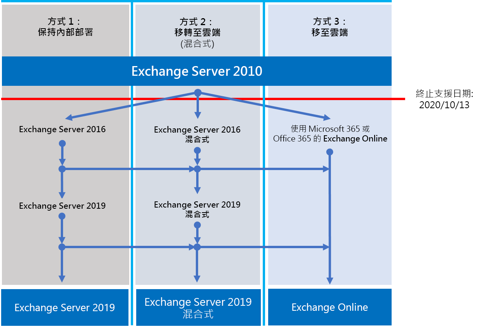

# Exchange 2010 終止支援藍圖

*本文適用于 Microsoft 365 Enterprise 和 Office 365 企業版。*

Exchange Server 2010 將於 **2020 年 10 月 13 日**終止支援。 若尚未開始從 Exchange 2010 遷移至 Microsoft 365、Office 365 或 Exchange 2016，現在是開始規劃的時間。

## 終止支援是什麼意思？

和所有 Microsoft 產品一樣，Exchange Server 也擁有支援生命週期，我們會在這段期間提供新功能、錯誤修正、安全性修正等支援。 產品的生命週期從首次發行日期算起，通常會持續 10 年，而這個生命週期的結束就稱為產品支援結束。
在 2020 年 10 月 13 日 Exchange 2010 終止支援後，Microsoft 將不再提供：

- 可能發生之任何問題的技術支援；
- 所發現且可能會影響伺服器穩定性及可用性之問題的錯誤修正。
- 所發現且可能會讓伺服器容易受到安全性威脅之弱點的安全性修正。
- 時區更新。

在此日期之後，您所安裝的 Exchange 2010 仍可繼續執行。 不過，由於上述列出的變更，強烈建議您盡快從 Exchange 2010 移轉。

如需 Office 2010 伺服器終止支援即將結束的詳細資訊，請參閱[可幫助您從 Office 2010 伺服器和用戶端升級的資源](https://docs.microsoft.com/office365/enterprise/upgrade-from-office-2010-servers-and-products)。

## 我有哪些選擇？

Exchange 2010 即將終止支援，這是探索選項及準備移轉規劃的絕佳時機。 您可以：

- 完整遷移至 Microsoft 365。 使用完全移轉、混合式或完整混合式移轉來移轉信箱，然後移除內部部署的 Exchange 伺服器和 Active Directory。
- 將 Exchange 2010 伺服器移轉到內部部署伺服器上的 Exchange 2016。

> [!IMPORTANT]
> 如果您的組織選擇將信箱遷移至 Microsoft 365，但是想要保留 DirSync 或 Azure AD Connect，以繼續從內部部署 Active Directory 管理使用者帳戶，您必須在內部部署中至少保留一部 Exchange server。 如果移除最後一部 Exchange 伺服器，您將無法變更 Exchange Online 中的 Exchange 收件者。 這是因為授權單位來源會保留在您內部部署的 Active Directory 中，因此必須在那裡進行變更。 在這個案例中，您有下列選項：

-  (**建議**的) 如果您可以將信箱遷移至 Microsoft 365，並在10月 13 2020 日之後升級伺服器，請使用 Exchange 2010 連線至 microsoft 365 和遷移信箱。 之後，將 Exchange 2010 移轉到 Exchange 2016，並解除委任所有剩下的 Exchange 2010 伺服器。
- 如果您無法在10月13日（2020）完成信箱遷移和內部部署伺服器升級，請先將您的內部部署 Exchange 2010 伺服器升級至 Exchange 2016，然後再使用 Exchange 2016 連線至 Microsoft 365 和遷移信箱。

> [!NOTE]
> 稍微有點複雜的是，您也可以將您的內部部署 Exchange 2010 伺服器遷移至 Exchange 2016，將信箱遷移至 Microsoft 365。

以下是您可以採取的三個方法，以避免對 Exchange Server 2010 的支援終止。

下列各節將詳細探討每個選項。

## 遷移至 Microsoft 365

將您的電子郵件遷移至 Microsoft 365，是協助您淘汰 Exchange 2010 部署的最佳且最簡單的選項。 透過遷移至 Microsoft 365，您可以從舊的技術將單一躍點變為一流的功能，如下所示：

- 合規性功能，例如保留原則、就地保留和訴訟資料暫留、就地電子文件探索等；
- Microsoft Teams；
- Power BI；
- 焦點收件匣；
- MyAnalytics;

Microsoft 365 也會先取得新功能並體驗，您的使用者通常可以立即開始使用。 除了新功能，您也不需要擔心：

- 購買及維護硬體；
- 支付伺服器的加熱和冷卻費用；
- 保持獲得最新安全性、產品和時區修正程式；
- 維護儲存和軟體以支援合規性要求；
- 升級至新版本的 Exchange-您總在 Microsoft 365 的最新版 Exchange。

### 我應該如何遷移至 Microsoft 365？

視您的組織而定，您有幾個選項可協助您取得 Microsoft 365。 選擇 [遷移] 選項時，您需要考慮一些事項，如您需要移動的席位數目或信箱數目、您想要遷移的時間長度，以及遷移期間是否需要在內部部署安裝與 Microsoft 365 之間進行無縫整合。 下表顯示您將會決定使用哪一種方法的遷移選項及最重要的因素。

| **移轉選項**     | **組織規模** | **持續時間**        |
|--------------------------|-----------------------|---------------------|
| 完全移轉        | 少於 150 個基座  | 一週或更短      |
| 基本混合式移轉 | 少於 150 個基座  | 幾周或更短 |
| 完整混合式移轉    | 超過 150 個基座   | 幾周或更長 |

下列各節提供這些方法的概觀。 請參閱[決定移轉方法](https://support.office.com/article/Decide-on-a-migration-path-0d4f2396-9cef-43b8-9bd6-306d01df1e27)，了解每種方法的詳細資料。

### 完全移轉

完全遷移是指在預先選取的日期和時間，您會將所有信箱、通訊群組、連絡人等遷移至 Office 365;當您完成時，您會關閉內部部署 Exchange 伺服器，並以獨佔方式開始使用 Microsoft 365。

「完全遷移」方法適用于沒有非常多信箱的小型組織，想要快速進入 Microsoft 365，而且不想處理其他一些方法。 不過在某種程度上來說，此方法也有限制，因為應該在一週或更短的時間內完成，而且需要使用者重新設定 Outlook 設定檔。 雖然完全移轉可以處理多達 2,000 個信箱，但是強烈建議您在使用此方法時最多移轉 150 個信箱就好。 如果您嘗試移轉超過 150 個信箱，您可能會來不及在期限之前移轉所有信箱，而且 IT 支援人員可能會因協助使用者重新設定 Outlook 而忙到焦頭爛額。

如果您想要進行完全遷移，請考慮下列幾點：

- Microsoft 365 將需要透過 TCP 埠443，使用 Outlook 無所不在連線至您的 Exchange 2010 伺服器;
- 將所有內部部署信箱移至 Microsoft 365;
- 您的內部部署系統管理員帳戶必需擁有可讀取使用者信箱內容的存取權限；
- 您想要在 Microsoft 365 中使用的 Exchange 2010 公認的網域必須新增為服務中已驗證的網域。
- 在您開始遷移與開始完成階段之間的時間之間，Microsoft 365 會定期同步處理 Microsoft 365 和內部部署信箱。 完成移轉後，您不用擔心電子郵件會留在您的內部部署信箱中；
- 使用者將會收到其 Microsoft 365 帳戶的新的臨時密碼，當使用者第一次登入其信箱時，他們必須加以變更。
- 您將需要 Microsoft 365 許可證，其中包含您要遷移的每個使用者信箱的 Exchange Online;
- 使用者必須在他們的每個裝置上設定新 Outlook 設定檔，然後再次下載電子郵件。 Outlook 將下載的電子郵件數量可能有所差異。 如需詳細資訊，請參閱[變更保持離線的郵件數](https://support.office.com/article/Change-how-much-mail-to-keep-offline-f3a1251c-6dd5-4208-aef9-7c8c9522d633?ui=en-US&rs=en-US&ad=US&fromAR=1)。

若要深入了解完全移轉，請參閱：

- [將電子郵件完全移轉到 Office 365 所需注意的事項](https://support.office.com/article/What-you-need-to-know-about-a-cutover-email-migration-to-Office-365-961978ef-f434-472d-a811-1801733869da)
- [執行完全移轉以將電子郵件移轉到 Office 365](https://support.office.com/article/Perform-a-cutover-migration-of-email-to-Office-365-9496e93c-1e59-41a8-9bb3-6e8df0cd81b4)

### 基本混合式移轉

最小的混合式或快速式遷移是一種可讓您將數百個信箱遷移至 Microsoft 365 的情況，您可以在數周內完成遷移，而且不需要任何高級混合式遷移功能（如共用 Free/Busy 行事曆資訊）。

最小的混合式遷移非常適合需要花更多時間將其信箱遷移至 Microsoft 365 的組織，但仍然計畫在數周內完成遷移。 您可以獲得更先進的完整混合式移轉的優點，又不需要太多複雜的移轉步驟。 您可以控制在指定時間遷移信箱的數量將使用內部部署帳戶的使用者名稱和密碼來建立 Microsoft 365 信箱;而且，與轉換遷移不同的是，您的使用者不需要重新建立其 Outlook 設定檔。

如果您考慮要執行基本混合式移轉，以下是一些該考量的事項：

- 您必須在內部部署 Active Directory 伺服器與 Microsoft 365 之間執行一次性目錄同步處理。
- 使用者將能夠使用與其信箱遷移時所使用的相同使用者名稱和密碼，登入他們的 Microsoft 365 信箱;
- 您將需要 Microsoft 365 許可證，其中包含您要遷移的每個使用者信箱的 Exchange Online;
- 使用者在大部分的裝置上不需要設定新 Outlook 設定檔 (某些舊款 Android 手機可能需要新設定檔)，而且不需要重新下載電子郵件。

若要深入了解基本混合式移轉，請參閱[使用 [基本混合式] 以將 Exchange 信箱快速移轉至 Office 365](https://support.office.com/article/Use-Minimal-Hybrid-to-quickly-migrate-Exchange-mailboxes-to-Office-365-fdecceed-0702-4af3-85be-f2a0013937ef)

### 完整混合式

完整混合式遷移是指您的組織有許多成百上千的信箱，且您想要將一些或所有的信箱移至 Microsoft 365。 因為這些移轉通常是較為長期的作業，混合式移轉能夠：

- 顯示內部部署使用者 Microsoft 365 中使用者的空閒/忙碌行事曆資訊，反之亦然。
- 請參閱包含內部部署和 Microsoft 365 中收件者的統一全域通訊清單。
- 不管使用者是內部部署或 Microsoft 365，請查看所有使用者的完整 Outlook 收件者屬性。
- 使用 TLS 和憑證來保護內部部署 Exchange 伺服器與 Office 365 之間的電子郵件通訊安全；
- 將內部部署 Exchange 伺服器與 Microsoft 365 之間傳送的郵件視為內部部署，讓他們能夠：
- 讓傳輸和合規性代理程式正確評估及處理 (目標鎖定內部郵件)；
- 略過反垃圾郵件篩選。

完整混合式移轉最適合欲持續處於混合式組態數個月或更久的組織。 您將取得本節先前所列的功能，以及目錄同步處理、整合的相容性功能，以及使用線上信箱移動將信箱移至和移365出的功能。 Microsoft 365 變成內部部署組織的分機號碼。

如果您考慮要執行完整混合式移轉，以下是一些該考量的事項：

- 完整混合式移轉並不適合所有組織類型。 由於完整混合式移轉十分複雜，即使它具有多項優點，但這種設定所需付出的心力和成本往往令擁有少於數百個信箱的組織望之卻步。 如果這聽起來像是貴組織的情況，強烈建議您考慮改用完全移轉或基本混合式移轉；
- 您必須在內部部署 Active Directory 伺服器與 Microsoft 365 之間，使用 Azure Active Directory (Azure AD) 連線來設定目錄同步處理。
- 使用者將能夠使用使用者登入本機網路時所使用的相同使用者名稱和密碼登入他們的 Microsoft 365 信箱。 (需要使用密碼同步處理和/或 Active Directory Federation Services 的 Azure AD Connect) ;
- 您將需要 Microsoft 365 許可證，其中包含您要遷移的每個使用者信箱的 Exchange Online;
- 使用者在大部分的裝置上不需要設定新 Outlook 設定檔 (某些舊款 Android 手機可能需要新設定檔)，而且不需要重新下載電子郵件。

> [!IMPORTANT]
> 如果您的組織選擇將信箱遷移至 Microsoft 365，但是想要保留 DirSync 或 Azure AD Connect，以繼續從內部部署 Active Directory 管理使用者帳戶，您必須在內部部署中至少保留一部 Exchange server。 如果移除最後一部 Exchange 伺服器，您將無法變更 Exchange Online 中的 Exchange 收件者。 這是因為授權單位來源會保留在您內部部署的 Active Directory 中，因此必須在那裡進行變更。

如果您適合使用完整混合式移轉，請參閱下列可協助您進行移轉的相關資源：

- [Exchange 部署助理](https://aka.ms/exdeploy)
- [Exchange Server 混合式部署](https://technet.microsoft.com/library/jj200581%28v=exchg.150%29.aspx)
- [混合組態精靈](https://technet.microsoft.com/library/hh529921%28v=exchg.150%29.aspx)
- [混合組態精靈常見問題集](https://technet.microsoft.com/library/mt488940%28v=exchg.150%29.aspx)
- [混合式部署必要條件](https://technet.microsoft.com/library/hh534377%28v=exchg.150%29.aspx)

## 升級到新版 Exchange Server 內部部署

雖然我們強烈相信您可以透過完整地遷移至 Microsoft 365，獲得最佳的價值和使用者經驗，但我們也會瞭解某些組織必須保留某些 Exchange 伺服器的內部部署。 這可能是因為法規需求，保證資料不會儲存在另一個國家/地區的資料中心，或是因為您有無法在雲端中滿足的獨特設定或需求，也可能只是因為您仍然使用 Active Directory 內部部署，所以您需要 Exchange 來管理雲端信箱。 不管是您選擇或必須保留 Exchange 內部部署，都應確定將 Exchange 2010 環境升級到至少 Exchange 2013 或 Exchange 2016，並在終止支援日之前刪除 Exchange 2010。

為了獲得最佳的體驗，我們建議您將剩餘的內部部署環境升級為 Exchange 2016。 如果您想要直接從 Exchange Server 2010 移至 Exchange Server 2016，您不需要安裝 Exchange Server 2013。

Exchange 2016 包括舊版 Exchange 所包含的所有功能和進步，而且它最符合 Microsoft 365 (的體驗，不過某些功能只有在 Microsoft 365) 中提供。 請查看您遺漏的一些事項：

| **Exchange 版本**                     | **功能**                                                                                                                                                                                                                                         |
|------------------------------------------|------------------------------------------------------------------------------------------------------------------------------------------------------------------------------------------------------------------------------------------------------|
| Exchange 2013                            | 將伺服器角色數目減少為三個 (信箱、用戶端存取、邊際傳輸) 的簡化架構                                                                                                                                        |
|                                          | 可協助保護機密資訊防止外洩的資料外洩防護原則 (DLP)                                                                                                                                                                |
|                                          | 大幅改善的 Outlook Web App 體驗                                                                                                                                                                                                    |
| Exchange 2016                            | *來自 Exchange 2013 的功能以及…*                                                                                                                                                                                                                   |
|                                          | 更進一步簡化的伺服器角色，只有信箱和邊際傳輸                                                                                                                                                                                   |
|                                          | 與 SharePoint 整合一併改善的 DLP                                                                                                                                                                                                  |
|                                          | 改善的資料庫恢復                                                                                                                                                                                                                         |
|                                          | 線上文件共同作業                                                                                                                                                                                                                        |

| **考量事項**                        | **其他資訊**                                                                                                                                                                                                                                        |
|------------------------------------------|------------------------------------------------------------------------------------------------------------------------------------------------------------------------------------------------------------------------------------------------------|
| 終止支援日期                     | 和 Exchange 2010 一樣，每個 Exchange 版本都有各自的終止支援日期：                                                                                                                                                                        |
|                                          | **Exchange 2013** - 2023 年 4 月                                                                                                                                                                                                                       |
|                                          | **Exchange 2016** - 2025 年 10 月                                                                                                                                                                                                                     |
|                                          | 終止支援日期愈早，您將需要愈快執行其他移轉。 2023 年 4 月其實不如想像中的遙遠！                                                                                                                 |
| 移轉到 Exchange 2013 或 Exchange 2016 的方法  | 無論您選擇的是 Exchange 2013 或 Exchange 2016，從 Exchange 2010 移轉到更新版本的方法都是相同的：                                                                                                                              |
|                                          | 將 Exchange 2013 或 2016 安裝到您現有的 Exchange 2010 組織。將服務和其他基礎架構移至 Exchange 2013 或 2016。將信箱和公用資料夾移至 Exchange 2013 或 2016。解除委任剩餘的 Exchange 2010 伺服器  |
| 版本共存                      | 當移轉至 Exchange 2013 或 Exchange 2016 時，您可以將任一版本安裝到現有的 Exchange 2010 組織中。 這可讓您安裝一或多個 Exchange 2013 或 Exchange 2016 伺服器，然後執行移轉。             |
| 伺服器硬體                          | 自 Exchange 2010 起，伺服器硬體需求已變更。 您必須確認要使用的硬體能夠相容。 如需每個版本的硬體需求相關詳細資訊，請參閱：                                      |
|                                          | [Exchange 2016 系統需求](https://technet.microsoft.com/library/aa996719%28v=exchg.160%29.aspx)                                                                                                                                      |
|                                          | [Exchange 2013 系統需求](https://technet.microsoft.com/library/aa996719%28v=exchg.150%29.aspx)                                                                                                                                      |
|                                          | 透過大幅改善的 Exchange 效能，以及新款伺服器中的提升運算效能及儲存空間容量，您會發現只需要比較少的伺服器就能支援相同信箱數。                       |
| 作業系統版本                 | 每個版本的最低支援作業系統版本為：                                                                                                                                                                                |
|                                          | **Exchange 2016** Windows Server 2012                                                                                                                                                                                                                |
|                                          | **Exchange 2013** Windows Server 2008 R2 SP1                                                                                                                                                                                                         |
|                                          | 如需作業系統支援的相關詳細資訊，請參閱 [Exchange Server 支援性總表](https://technet.microsoft.com/library/ff728623%28v=exchg.150%29.aspx)。                                                                        |
| Active Directory 樹系功能等級 | 每個版本的最低支援 Active Directory 樹系功能等級為：                                                                                                                                                                |
|                                          | Exchange 2016** **：Windows Server 2008 R2 SP1                                                                                                                                                                                                         |
|                                          | **Exchange 2013** Windows Server 2003                                                                                                                                                                                                                |
|                                          | 如需樹系功能等級支援的相關詳細資訊，請參閱 [Exchange Server 支援性總表](https://technet.microsoft.com/library/ff728623%28v=exchg.150%29.aspx)。                                                                 |
| Office 用戶端版本                   | 每個版本的最低支援 Office 用戶端版本為：                                                                                                                                                                                   |
|                                          | Exchange 2016** **：Office 2010 (含最新更新)                                                                                                                                                                                              |
|                                          | **Exchange 2013** Office 2007 SP3                                                                                                                                                                                                                    |
|                                          | 如需 Office 用戶端支援的相關詳細資訊，請參閱 [Exchange Server 支援性總表](https://technet.microsoft.com/library/ff728623%28v=exchg.150%29.aspx)。                                                                           |

您可以使用下列資源來協助您進行移轉：

- [Exchange 部署助理](https://aka.ms/exdeploy)
- 適用於 Exchange [2016](https://technet.microsoft.com/library/bb738144%28v=exchg.160%29.aspx)、[2013](https://technet.microsoft.com/library/bb738144%28v=exchg.150%29.aspx) 的 Active Directory 結構描述變更
- 適用於 Exchange [2016](https://technet.microsoft.com/library/aa996719%28v=exchg.160%29.aspx)、[2013](https://technet.microsoft.com/library/aa996719%28v=exchg.150%29.aspx) 的系統需求
- 適用於 Exchange [2016](https://technet.microsoft.com/library/bb691354%28v=exchg.160%29.aspx)、[2013](https://technet.microsoft.com/library/bb691354%28v=exchg.150%29.aspx) 的先決條件

## 適用於 Office 2010 用戶端與伺服器和 Windows 7 的選項摘要

如需適用於 Office 2010 用戶端與伺服器和 Windows 7 的升級、移轉和移至雲端選項的視覺摘要，請參閱[終止支援海報](./downloads/Office2010Windows7EndOfSupport.pdf)。

這張單頁海報可讓您快速了解可以採取的各種方法，以防止Office 2010 用戶端與伺服器產品以及 Windows 7 進入終止支援，而海報上也會強調顯示 Microsoft 365 企業版中慣用的方式和選項支援。

您可以[下載](https://github.com/MicrosoftDocs/microsoft-365-docs/raw/public/microsoft-365/media/migration-microsoft-365-enterprise-workload/Office2010Windows7EndOfSupport.pdf)此海報，並以 Letter、Legal 或 Tabloid (11 x 17) 格式列印此海報。
      
## 如果我需要協助，該怎麼辦？

如果您要遷移至 Microsoft 365，您可能有資格使用 Microsoft FastTrack 服務。 FastTrack 提供最佳作法、工具及資源，可讓您以盡可能順利的方式遷移至 Microsoft 365。 最棒的是，實際上會有一名支援工程師一路從規劃、設計到移轉完最後一個信箱，全程逐步引導您進行移轉。 若要深入了解 FastTrack，請參閱 [Microsoft FastTrack](https://fasttrack.microsoft.com/)。

如果您在遷移至 Microsoft 365 時遇到任何問題，而且您未使用 FastTrack，或您將遷移至較新版本的 Exchange Server，我們將會在這裡提供協助。 以下是您可使用的一些資源：

- [技術社群](https://social.technet.microsoft.com/Forums/office/home?category=exchangeserver)
- [客戶支援](https://support.microsoft.com/gp/support-options-for-business)

## 相關主題

[可幫助您從 Office 2010 伺服器和用戶端升級的資源](https://docs.microsoft.com/office365/enterprise/upgrade-from-office-2010-servers-and-products)