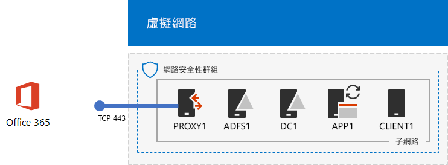
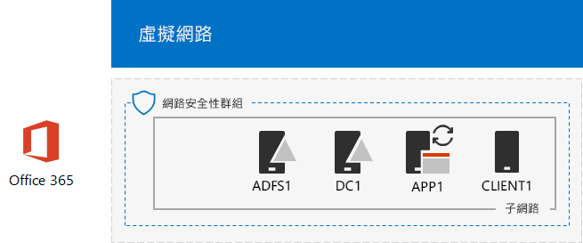

# <a name="federated-identity-for-your-office-365-devtest-environment"></a>Office 365 開發人員/測試環境的同盟身分識別

 **摘要：**設定 Office 365 開發人員/測試環境的同盟的驗證。
  
Office 365 支援同盟身分識別。這表示而非本身執行的認證驗證、 Office 365 指的是連線的使用者在 Office 365 信任的同盟的驗證伺服器。如果使用者的認證是正確的同盟的驗證伺服器問題用戶端接著會傳送至 Office 365 做為驗證證明安全性權杖。卸載和擴充 Office 365 訂閱和進階的驗證及安全性案例的驗證允許同盟身分識別。
  
本文說明您可以如何設定 Office 365 開發人員/測試環境中，同盟的驗證產生下列結果：
  
**圖 1： 同盟的驗證 Office 365 開發人員/測試環境**


  
圖 1 所示的組態所組成： 
  
- Office 365 E5 試用版訂閱，這會從建立時的 30 天到期。
    
- 簡化的組織內部網路連線至網際網路，在 Azure 虛擬網路 （DC1、 APP1、 CLIENT1、 ADFS1 及 PROXY1） 的子網路上的五個虛擬機器時所組成。同步處理至 Office 365 的 Windows Server AD 網域中的帳戶的清單在 APP1 上，執行 azure AD 連線。PROXY1 接收內送的驗證要求。ADFS1 會驗證與 DC1 認證並發出安全性權杖。
    
有五個階段來設定此開發/測試環境：
  
1. 使用 DirSync 建立模擬企業版 Office 365 開發人員/測試環境。
    
2. 建立 AD FS 伺服器 (ADFS1)。
    
3. 建立 web proxy 伺服器 (PROXY1)。
    
4. 建立自我簽署的憑證並設定 ADFS1 和 PROXY1。
    
5. 設定 Office 365 的同盟身分識別。
    
若要逐步解說實際執行部署在 Azure 中的 Office 365 同盟驗證的步驟，請參閱[在 Azure 中的 Office 365 的部署高可用性同盟的驗證](deploy-high-availability-federated-authentication-for-office-365-in-azure.md)。
  
> [!NOTE]
> 您不能設定這個開發/測試環境與 Azure 試用版訂閱。 
  
> [!TIP]
> 按一下[此處](http://aka.ms/catlgstack)的視覺對應至一個 Microsoft Cloud 測試實驗室指南堆疊中所有的文章。
  
## <a name="phase-1-create-the-simulated-enterprise-office-365-devtest-environment-with-dirsync"></a>階段 1： 建立使用 DirSync 模擬企業版 Office 365 開發人員/測試環境

遵循[DirSync Office 365 開發人員/測試環境](dirsync-for-your-office-365-dev-test-environment.md)中的指示來建立 APP1 DirSync 伺服器與 Office 365 和 Windows Server AD 之間的同步處理的 identity 為模擬企業版 Office 365 開發人員/測試環境在 DC1 帳戶。
  
接下來，建立新公用 DNS 網域名稱根據您目前的網域名稱並將其新增至您的 Office 365 訂閱。我們建議使用名稱**testlab。**\<公用網域 >。例如，如果您的部署公用網域名稱是 contoso.com，新增公用網域名稱 testlab.contoso.com。
  
如需如何在您的 DNS 提供者建立正確的 DNS 記錄，並將網域新增至您的 Office 365 試用版訂閱的指示，請參閱[新增使用者和 Office 365 的網域](https://support.office.com/article/Add-users-and-domain-to-Office-365-6383f56d-3d09-4dcb-9b41-b5f5a5efd611)。 
  
以下是您產生的組態。
  
**圖 2： Office 365 開發人員/測試環境的 DirSync**


  
圖 2 顯示 Office 365 開發人員/測試環境，其中包含 Office 365 CLIENT1、 APP1 與 DC1 虛擬機器在 Azure 虛擬網路的 DirSync。
  
## <a name="phase-2-create-the-ad-fs-server"></a>階段 2： 建立 AD FS 伺服器

AD FS 伺服器提供 Office 365 與 DC1 上裝載的 corp.contoso.com 網域中的帳戶之間的同盟的驗證。
  
若要建立 ADFS1 Azure 虛擬機器，您的訂閱資源群組與您的基底設定 Azure 位置的名稱中填滿和執行這些命令在 Azure PowerShell 命令提示字元本機電腦上。
  
```
$subscr="<your Azure subscription name>"
$rgName="<the resource group name of your Base Configuration>"
Login-AzureRMAccount
Get-AzureRmSubscription -SubscriptionName $subscr | Select-AzureRmSubscription
$staticIP="10.0.0.100"
$locName=(Get-AzureRmResourceGroup -Name $rgName).Location
$vnet=Get-AzureRMVirtualNetwork -Name TestLab -ResourceGroupName $rgName
$pip = New-AzureRMPublicIpAddress -Name ADFS1-PIP -ResourceGroupName $rgName -Location $locName -AllocationMethod Dynamic
$nic = New-AzureRMNetworkInterface -Name ADFS1-NIC -ResourceGroupName $rgName -Location $locName -SubnetId $vnet.Subnets[0].Id -PublicIpAddressId $pip.Id -PrivateIpAddress $staticIP
$vm=New-AzureRMVMConfig -VMName ADFS1 -VMSize Standard_D2_v2
$cred=Get-Credential -Message "Type the name and password of the local administrator account for ADFS1."
$vm=Set-AzureRMVMOperatingSystem -VM $vm -Windows -ComputerName ADFS1 -Credential $cred -ProvisionVMAgent -EnableAutoUpdate
$vm=Set-AzureRMVMSourceImage -VM $vm -PublisherName MicrosoftWindowsServer -Offer WindowsServer -Skus 2016-Datacenter -Version "latest"
$vm=Add-AzureRMVMNetworkInterface -VM $vm -Id $nic.Id
$vm=Set-AzureRmVMOSDisk -VM $vm -Name "ADFS-OS" -DiskSizeInGB 128 -CreateOption FromImage -StorageAccountType "StandardLRS"
New-AzureRMVM -ResourceGroupName $rgName -Location $locName -VM $vm
```

> [!TIP]
> 按一下[這裡](https://gallery.technet.microsoft.com/PowerShell-commands-for-f79bc2c2?redir=0)以取得包含在本文中的所有 PowerShell 命令的文字檔案。
  
下一步] 使用[Azure 入口網站](http://portal.azure.com)連線至 ADFS1 虛擬機器使用 ADFS1 本機系統管理員帳戶名稱和密碼，然後再開啟 [Windows PowerShell 命令提示字元。
  
若要檢查 ADFS1 與 DC1 之間的名稱解析和網路通訊，請執行**ping dc1.corp.contoso.com**命令並確認有四個回覆。
  
接下來，這些命令在 Windows PowerShell 提示字元上 ADFS1 CORP 網域加入 ADFS1 虛擬機器。
  
```
$cred=Get-Credential -UserName "CORP\\User1" -Message "Type the User1 account password."
Add-Computer -DomainName corp.contoso.com -Credential $cred
Restart-Computer
```

以下是您產生的組態。
  
**圖 3： 新增 AD FS 伺服器**


  
圖 3 顯示的 ADFS1 伺服器新增至 Office 365 開發人員/測試環境的 DirSync。
  
## <a name="phase-3-create-the-web-proxy-server"></a>階段 3： 建立的 web proxy 伺服器

PROXY1 提供代理的使用者嘗試驗證和 ADFS1 之間的驗證訊息。
  
若要建立 PROXY1 Azure 虛擬機器，您的資源群組和 Azure 位置的名稱中填滿，然後在本機電腦上的 Azure PowerShell 命令提示字元執行下列命令。
  
```
$rgName="<the resource group name of your Base Configuration>"
$staticIP="10.0.0.101"
$locName=(Get-AzureRmResourceGroup -Name $rgName).Location
$vnet=Get-AzureRMVirtualNetwork -Name TestLab -ResourceGroupName $rgName
$pip = New-AzureRMPublicIpAddress -Name PROXY1-PIP -ResourceGroupName $rgName -Location $locName -AllocationMethod Static
$nic = New-AzureRMNetworkInterface -Name PROXY1-NIC -ResourceGroupName $rgName -Location $locName -SubnetId $vnet.Subnets[0].Id -PublicIpAddressId $pip.Id -PrivateIpAddress $staticIP
$vm=New-AzureRMVMConfig -VMName PROXY1 -VMSize Standard_D2_v2
$cred=Get-Credential -Message "Type the name and password of the local administrator account for PROXY1."
$vm=Set-AzureRMVMOperatingSystem -VM $vm -Windows -ComputerName PROXY1 -Credential $cred -ProvisionVMAgent -EnableAutoUpdate
$vm=Set-AzureRMVMSourceImage -VM $vm -PublisherName MicrosoftWindowsServer -Offer WindowsServer -Skus 2016-Datacenter -Version "latest"
$vm=Add-AzureRMVMNetworkInterface -VM $vm -Id $nic.Id
$vm=Set-AzureRmVMOSDisk -VM $vm -Name "PROXY1-OS" -DiskSizeInGB 128 -CreateOption FromImage -StorageAccountType "StandardLRS"
New-AzureRMVM -ResourceGroupName $rgName -Location $locName -VM $vm
```

> [!NOTE]
> 因為您會建立其和其點必須不會變更當您重新啟動 PROXY1 虛擬機器時的公用 DNS 記錄 PROXY1 指派靜態公用 IP 位址。 
  
下一步] 新增規則至以允許來自網際網路的來路不明輸入的流量 PROXY1 的私人 IP 位址和 TCP 連接埠 443 依舊套用子網路的網路安全性群組。本機電腦上 Azure PowerShell 命令提示字元執行這些命令。
  
```
$rgName="<the resource group name of your Base Configuration>"
Get-AzureRmNetworkSecurityGroup -Name CorpNet -ResourceGroupName $rgName | Add-AzureRmNetworkSecurityRuleConfig -Name "HTTPS-to-PROXY1" -Description "Allow TCP 443 to PROXY1" -Access "Allow" -Protocol "Tcp" -Direction "Inbound" -Priority 101 -SourceAddressPrefix "Internet" -SourcePortRange "*" -DestinationAddressPrefix "10.0.0.101" -DestinationPortRange "443" | Set-AzureRmNetworkSecurityGroup
```

下一步] 使用[Azure 入口網站](http://portal.azure.com)連線至 PROXY1 虛擬機器使用 PROXY1 本機系統管理員帳戶名稱和密碼，然後再開啟 [Windows PowerShell 命令提示字元上 PROXY1。
  
若要檢查 PROXY1 與 DC1 之間的名稱解析和網路通訊，請執行**ping dc1.corp.contoso.com**命令並確認有四個回覆。
  
接下來，這些命令在 Windows PowerShell 提示字元上 PROXY1 CORP 網域加入 PROXY1 虛擬機器。
  
```
$cred=Get-Credential -UserName "CORP\\User1" -Message "Type the User1 account password."
Add-Computer -DomainName corp.contoso.com -Credential $cred
Restart-Computer
```

本機電腦上顯示 PROXY1 公用 IP 位址與這些 Azure PowerShell 命令：
  
```
Write-Host (Get-AzureRMPublicIpaddress -Name "PROXY1-PIP" -ResourceGroup $rgName).IPAddress
```

接下來，使用公用 DNS 提供者和建立新的公用 DNS A 記錄**fs.testlab。**\<DNS 網域名稱 > 的解析為**寫入主機**命令顯示的 IP 位址。**Fs.testlab。**\<DNS 網域名稱 > 以下稱為*同盟服務 FQDN* 。
  
接下來，使用[Azure 入口網站](http://portal.azure.com)連線至 DC1 虛擬機器使用 CORP\\User1 認證，然後再執行下列命令在系統管理員層級 Windows PowerShell 命令提示字元：
  
```
$testZone="<the FQDN of your testlab domain from phase 1, example: testlab.contoso.com>"
$testZoneFile= $testZone + ".dns"
Add-DnsServerPrimaryZone -Name $testZone -ZoneFile $testZoneFile
Add-DnsServerResourceRecordA -Name "fs" -ZoneName $testZone -AllowUpdateAny -IPv4Address "10.0.0.100" -TimeToLive 01:00:00
```

這些命令會建立同盟服務在 Azure 虛擬網路上的虛擬機器可以解析為 ADFS1 的私人 IP 位址的 FQDN 的 DNS A 記錄。
  
以下是您產生的組態。
  
**圖 4： 新增 web 應用程式 proxy 伺服器**


  
圖 4 顯示的 PROXY1 伺服器。
  
## <a name="phase-4-create-a-self-signed-certificate-and-configure-adfs1-and-proxy1"></a>階段 4： 建立自我簽署的憑證並設定 ADFS1 和 PROXY1

在此階段中，您建立自我簽署的數位憑證同盟服務 FQDN 及設定 ADFS1 及 PROXY1 為 AD FS 伺服器陣列。
  
首先，使用[Azure 入口網站](http://portal.azure.com)連線至 DC1 虛擬機器使用 CORP\\User1 認證並再開啟 [系統管理員層級 Windows PowerShell 命令提示字元。
  
接下來，建立 AD FS 服務帳戶使用下列命令在 DC1 Windows PowerShell 命令提示字元：
  
```
New-ADUser -SamAccountName ADFS-Service -AccountPassword (read-host "Set user password" -assecurestring) -name "ADFS-Service" -enabled $true -PasswordNeverExpires $true -ChangePasswordAtLogon $false
```

請注意此命令會提示您提供帳戶密碼。選擇強式密碼，並將其記錄在安全的位置。您將需要此階段與階段 5。
  
使用[Azure 入口網站](http://portal.azure.com)連線至 ADFS1 虛擬機器使用 CORP\\User1 認證。開啟 ADFS1 中系統管理員層級 Windows PowerShell 命令提示字元、 填滿的同盟服務 FQDN] 中，並再執行下列命令以建立自我簽署的憑證：
  
```
$fedServiceFQDN="<federation service FQDN>"
New-SelfSignedCertificate -DnsName $fedServiceFQDN -CertStoreLocation "cert:\\LocalMachine\\My"
New-Item -path c:\\Certs -type directory
New-SmbShare -name Certs -path c:\\Certs -changeaccess CORP\\User1
```

下一步] 以儲存新的自我簽署的憑證的檔案中使用下列步驟。
  
1. 按一下 [**開始]**、 輸入**mmc.exe**，並按**Enter**。
    
2. 按一下 [**檔 > 新增/移除嵌入式管理單元**。
    
3. 在 [**新增或移除嵌入式管理單元**，按兩下 [**憑證**] 清單中的可用嵌入式管理單元、 按一下 [**電腦帳戶**，然後按 [**下一步**。
    
4. 在 [**選擇電腦**] 按一下 [**完成**] 和 [**確定]**。
    
5. 在樹狀目錄窗格中，開啟**Certificates (Local Computer) > 個人 > 憑證**。
    
6. 以滑鼠右鍵按一下與您的同盟服務 FQDN 的憑證、 按一下 [**所有工作**] 和 [**匯出**。
    
7. 在 [**歡迎**] 頁面上按一下 [**下一步**]。
    
8. 在 [**匯出私密金鑰**] 頁面上按一下 [ **]**，並再按 [**下一步**。
    
9. 在 [**匯出檔案格式**] 頁面上按一下 [**匯出所有延伸的內容**] 並再按 [**下一步**。
    
10. 在 [**安全性**] 頁面上按一下 [**密碼**及**密碼**中輸入密碼並**確認密碼。**
    
11. 在 [**要匯出的檔案**] 頁面上按一下 [**瀏覽**]。
    
12. 瀏覽至**c:\\憑證**資料夾中，輸入**檔案名稱**] 中的**SSL** ] 和 [**儲存。**
    
13. 在 [**要匯出的檔案**] 頁面上按一下 [**下一步**]。
    
14. 在 [**完成憑證匯出精靈**] 頁面上，按一下 [**完成**]。出現提示時，按一下 [**確定]**。
    
下一步] 安裝 AD FS 服務使用在 Windows PowerShell 命令提示字元上 ADFS1 下列命令：
  
```
Install-WindowsFeature ADFS-Federation -IncludeManagementTools
```

等候完成安裝。
  
接下來，設定 AD FS 服務進行這些步驟：
  
1. 按一下 [**開始**] 並再按一下 [**伺服器管理員**] 圖示。
    
2. 在樹狀目錄窗格的 [伺服器管理員中，按一下 [ **AD FS**。
    
3. 在上方的 [工具] 列中按一下 [橘色小心符號和 [**設定此伺服器上的同盟服務**。
    
4. 按一下 [Active Directory Federation Services 組態精靈的 [**歡迎**] 頁面上的 [**下一步**]。
    
5. 在 [**連接至 AD DS** ] 頁面上按一下 [**下一步**]。
    
6. 在 [**指定服務屬性**] 頁面上：
    
  - **SSL 憑證**，按一下向下箭號，和 [同盟服務 FQDN 名稱的憑證。
    
  - 在**同盟服務顯示名稱**] 中輸入虛構組織的名稱。
    
  - 按 [下一步]。
    
7. 在 [**指定服務帳戶**] 頁面上，按一下 [**選取**的**帳戶名稱**。
    
8. 在 [**選取使用者或服務帳戶**，輸入**ADFS 服務**、 按一下 [**檢查名稱**] 和 [**確定]**。
    
9. 在**帳戶密碼**、 輸入的 ADFS 服務帳戶的密碼，然後按 [**下一步**。
    
10. 在 [**指定設定資料庫**] 頁面上按一下 [**下一步**]。
    
11. 按一下 [**檢閱選項**] 頁面的 [**下一步**]。
    
12. 按一下 [**必要條件檢查**] 索引標籤的 [**設定**]。
    
13. 在 [**結果**] 頁面上按一下 [**關閉**]。
    
14. 按一下 [**開始]**、 按一下 [進階] 圖示、 按一下 [**重新啟動**，然後按一下 [**繼續]**。
    
從[Azure 入口網站](http://portal.azure.com)連線到與公司 PROXY1\\User1 帳戶認證。
  
下一步] 安裝的自我簽署的憑證並設定 PROXY1 使用這些步驟。
  
1. 按一下 [**開始]**、 輸入**mmc.exe**，並按**Enter**。
    
2. 按一下 [**檔 > 新增/移除嵌入式管理單元**。
    
3. 在 [**新增或移除嵌入式管理單元**，按兩下 [**憑證**] 清單中的可用嵌入式管理單元、 按一下 [**電腦帳戶**，然後按 [**下一步**。
    
4. 在 [**選擇電腦**] 按一下 [**完成**] 和 [**確定]**。
    
5. 在樹狀目錄窗格中，開啟**Certificates (Local Computer) > 個人 > 憑證**。
    
6. 以滑鼠右鍵按一下 [**個人**、 按一下 [**所有工作**] 和 [**匯入**。
    
7. 在 [**歡迎**] 頁面上按一下 [**下一步**]。
    
8. 在 [**匯入的檔案**] 頁面上輸入**\\ \\adfs1\\憑證\\ssl.pfx**，然後按一下 [**下一步**。
    
9. 在 [**私密金鑰保護**] 頁面上輸入憑證密碼在 [**密碼**] 和 [**下一步。**
    
10. 在 [**憑證存放區**] 頁面上，按一下 [**下一步。**
    
11. 在 [**完成**] 頁面上按一下 [**完成**]。
    
12. 在 [**憑證存放區**] 頁面上按一下 [**下一步**]。
    
13. 出現提示時，按一下 [**確定]**。
    
14. 按一下 [**憑證**] 樹狀目錄窗格中。
    
15. 以滑鼠右鍵按一下 [憑證]，並再按一下 [**複製**。
    
16. 在樹狀目錄窗格中，開啟**受信任的根憑證授權單位 > 憑證**。
    
17. 將滑鼠指標下方的已安裝的憑證、 按一下滑鼠右鍵，然後按一下 [清單**貼**。
    
開啟系統管理員層級 PowerShell 命令提示字元並執行下列命令：
  
```
Install-WindowsFeature Web-Application-Proxy -IncludeManagementTools
```

等候完成安裝。
  
使用下列步驟來設定 web 應用程式 proxy 服務 ADFS1 作為其同盟伺服器：
  
1. 按一下 [**開始**] 及 [**伺服器管理員**。
    
2. 在樹狀目錄窗格中，按一下 [**遠端存取**]。
    
3. 在上方的 [工具] 列中按一下 [橘色小心符號和 [**開啟 Web 應用程式 Proxy] 精靈**。
    
4. 按一下 [Web 應用程式 Proxy 組態精靈] 的 [**歡迎**] 頁面上的 [**下一步**]。
    
5. 在**同盟伺服器**] 頁面上：
    
  - **同盟服務名稱**] 中輸入同盟服務 FQDN。
    
  - 類型**CORP\\User1**在 [**使用者名稱**。
    
  - 在 [**密碼]**中輸入 User1 帳戶的密碼。
    
  - 按 [下一步]。
    
6. 在**AD FS Proxy 憑證**] 頁面上，按一下向下箭號、 按一下與您的同盟服務的 FQDN、 憑證，然後按 [**下一步**。
    
7. 在 [**確認**] 頁面上按一下 [**設定**]。
    
8. 在 [**結果**] 頁面上按一下 [**關閉**]。
    
## <a name="phase-5-configure-office-365-for-federated-identity"></a>階段 5： 設定 Office 365 同盟身分識別

使用[Azure 入口網站](http://portal.azure.com)連線至公司 APP1 虛擬機器\\User1 帳戶認證。
  
使用下列步驟來設定 Azure AD 連線] 及 [您的 Office 365 訂閱同盟驗證：
  
1. 從桌面，連按兩下 [ **Azure AD 連線**。
    
2. 在 [**歡迎使用 Azure AD 連線**] 頁面上按一下 [**設定**]。
    
3. 在 [**其他工作**] 頁面上按一下 [**變更使用者登入**並再按 [**下一步**。
    
4. 在**Azure AD 的連線**] 頁面上輸入您的 Office 365 全域管理員帳戶名稱和密碼，並再按 [**下一步**。
    
5. 在 [**使用者登入**] 頁面上按一下 [**與 AD FS 同盟**，然後按 [**下一步**。
    
6. 在 [ **AD FS 伺服器陣列**] 頁面上按一下 [**使用現有的 AD FS 伺服器陣列**、**伺服器名稱**] 中輸入**ADFS1** ，然後按 [**下一步**。
    
7. 出現提示時輸入伺服器認證，輸入的公司認證\\User1 帳戶，並再按一下 [**確定]**。
    
8. 在 [**網域系統管理員**認證] 頁面上輸入**CORP\\User1**的**使用者名稱**和**密碼**，在將帳戶密碼] 和 [**下一步**。
    
9. 在 [ **AD FS 服務帳戶**] 頁面上輸入**CORP\\ADFS 服務****網域使用者名稱**和帳戶密碼的**網域使用者的密碼**，然後按一下 [**下一步**。
    
10. 在**Azure AD 網域**] 頁面的 [**網域**] 中，選取您先前建立及新增至您的 Office 365 訂閱在階段 1 中的網域名稱] 和 [**下一步**。
    
11. 在 [**準備好設定**] 頁面上按一下 [**設定**]。
    
12. 按一下 [**安裝完成**] 頁面的 [**驗證**]。
    
    您應該在內部網路和網際網路看到訊息，指出已驗證設定。
    
13. 在 [**安裝完成**] 頁面上按一下 [**結束**]。
    
為示範使用同盟的驗證，執行下列動作：
  
1. 開啟瀏覽器本機電腦上的私用的新執行個體，並移至[https://portal.office.com](https://portal.office.com)。
    
2. 登入認證]，輸入**user1 @**\<在階段 1 中建立的網域 >。 
    
    例如， **testlab.contoso.com**測試網域時，您將輸入**user1@testlab.contoso.com**。按 TAB 鍵或允許自動將您重新導向至 Office 365。
    
    您現在應該會看到**是不私用的連線**] 頁面。您會看見此因為無法驗證您的桌上型電腦的 ADFS1 上安裝的自我簽署的憑證。在實際執行部署中的同盟驗證，您可以使用受信任的憑證授權單位的憑證，並讓使用者不會看到此頁面。
    
3. **是不私用的連線**] 頁面上按一下 [**進階**] 和 [**繼續\<同盟服務 FQDN >**。 
    
4. 在虛構組織名稱] 頁面上，使用登入下列：
    
  - **CORP\\User1**名稱
    
  - User1 帳戶的密碼
    
    您應該會看到 [ **Microsoft Office Home** ] 頁面。
    
此程序示範如何在 Office 365 試用版訂閱與 DC1 上的 Windows Server AD corp.contoso.com 網域同盟。以下是驗證程序的基本知識：
  
1. 當您使用剛才在階段 1 中的登入帳戶名稱的同盟的網域時，Office 365 您瀏覽器重新導向至您的同盟服務 FQDN 與 PROXY1。
    
2. PROXY1 將您的本機電腦虛構公司的登入頁面。
    
3. 當您傳送 CORP\\User1 和 PROXY1 密碼，它將其轉寄到 ADFS1。
    
4. ADFS1 驗證 CORP\\User1 和與 DC1 密碼，並傳送您的本機電腦的安全性 token。
    
5. 您的本機電腦將安全性權杖傳送至 Office 365。
    
6. Office 365 驗證安全性權杖由 ADFS1 所建立及允許存取。
    
您的 Office 365 試用版訂閱現在已設定使用同盟驗證。您可以使用此開發/測試環境的進階的驗證案例。
  
## <a name="next-step"></a>下一個步驟

當您準備好要部署實際執行就緒時，高可用性同盟的驗證 Office 365 中 Azure，請參閱[Azure 中的 Office 365 的部署高可用性同盟的驗證](deploy-high-availability-federated-authentication-for-office-365-in-azure.md)。
  
## <a name="see-also"></a>請參閱

[雲端採用測試實驗室指南 (TLG)](cloud-adoption-test-lab-guides-tlgs.md)
  
[基底組態開發/測試環境](base-configuration-dev-test-environment.md)
  
[Office 365 開發/測試環境](office-365-dev-test-environment.md)
  
[雲端採用和混合式解決方案](cloud-adoption-and-hybrid-solutions.md)
  
[部署在 Azure 中的 Office 365 的高可用性同盟的驗證](deploy-high-availability-federated-authentication-for-office-365-in-azure.md)


