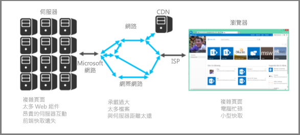

# SharePoint Online 效能調整的簡介Introduction to performance tuning for SharePoint Online

本文說明設計的 SharePoint Online 中的最佳效能頁面時需要考量您需要何種特定部分。This article explains what specific aspects you need to consider when designing pages for best performance in SharePoint Online.
     
## SharePoint Online 度量資訊SharePoint Online metrics

下列廣泛的 SharePoint Online 度量值提供有關效能的實際環境資料：The following broad metrics for SharePoint Online provide real world data about performance:
  
- 頁面載入速度How fast pages load
    
- 每頁所需來回行程次數How many round trips required per page
    
- 服務的問題Issues with the service
    
- 導致效能降低的其他事項Other things that cause performance degradation
    
### 資料所導出的結論Conclusions reached because of the data

資料會告訴我們：The data tells us:
  
- 大部分頁面在 SharePoint Online 上的執行狀況良好。Most of the pages perform well on SharePoint Online.
    
- 非自訂頁面載入速度很快。Non-customized pages load very quickly.
    
- 商務用 OneDrive、小組網站和系統頁面 (如 _layouts 等) 載入速度都很快。OneDrive for Business, team sites and system pages, such as _layouts, etc., are all quick to load.
    
- 最慢的 1% SharePoint Online 頁面載入時間需要超過 5000 毫秒。The slowest 1% of SharePoint Online pages take more than 5,000 milliseconds to load.
    
您可使用的一項簡單基準測試是透過比較您的入口網站載入時間和商務用 OneDrive 首頁載入時間來測量效能，因其使用的自訂功能不多。在進行網路效能問題疑難排解時，這通常是支援人員要求您完成的第一個步驟。One simple benchmark test you can use would be to measure performance by comparing the load time of your own portal against the load time of the OneDrive for Business home page as it uses few customized features. This will often be the first step Support will ask you to complete when troubleshooting network performance issues.
  
## 檢查效能時使用的標準使用者帳戶Use a standard user account when checking performance

網站集合管理員、 網站擁有者、 編輯器或參與者屬於其他安全性群組、 具有其他權限，且因此 SharePoint 會載入頁面的其他元素。A Site Collection Administrator, Site Owner, Editor, or Contributor belong to additional security groups, have additional permissions, and therefore have additional elements that SharePoint loads on a page.
  
這是適用於 SharePoint 內部部署和 SharePoint Online 但內部部署案例中的差異便不會輕鬆發現如 SharePoint Online 所示。This is applicable to SharePoint on-premises and SharePoint Online but in an on-premises scenario the differences will not be as easily noticed as in SharePoint Online.
  
才能正確地評估] 頁面上將如何執行使用者，您應該使用標準的使用者帳戶以避免載入撰寫控制項與其他安全性群組與相關的流量。In order to correctly evaluate how a page will perform for users, you should use a standard user account to avoid loading the authoring controls and additional traffic related to security groups.
  
## 效能調整的連線類別Connection categories for performance tuning

您可將伺服器與使用者之間的連線分類成三種主要元件。在設計 SharePoint Online 頁面以深入瞭解載入時間時，請將這些元件納入考量。You can categorize the connections between the server and the user into three main components. Consider these when designing SharePoint Online pages for insight into load times.
  
- **伺服器**Microsoft 主控的資料中心伺服器。**Server** The servers that Microsoft hosts in datacenters.
    
- **網路**Microsoft network、 網際網路及內部網路之間的資料中心與您的使用者。**Network** The Microsoft network, the Internet, and your on-premises network between the datacenter and your users.
    
- **瀏覽器**其中載入頁面。**Browser** Where the page is loaded.
    
在這三種連線中，通常有五個原因會造成 95% 的頁面緩滿情形。本文將討論這些原因：Within these three connections there are typically five reasons that cause 95% of slow pages. Each of these reasons is discussed in this article:
  
- 瀏覽問題Navigation issues
    
- 內容彙總Content roll up
    
- 大型檔案Large files
    
- 對伺服器的要求太多Many requests to the server
    
- 網頁組件處理Web Part processing
    
### 伺服器連線Server connection

許多影響 SharePoint 內部部署效能的問題也會在 SharePoint Online 上出現。Many of the issues that affect performance with SharePoint on-premises also apply to SharePoint Online.
  
一如預期，您有許多手段可控制伺服器在內部部署 SharePoint 中的執行效能。但在 SharePoint Online 上，情形略有不同。您讓伺服器執行的工作越多，呈現頁面所需的時間就越長。而在 SharePoint 中，含有多個網頁組件的複雜頁面才是造成這方面問題的最大禍首。As you would expect, you have far more control over how servers perform with on-premises SharePoint. With SharePoint Online things are a little different. The more work you make a server do, the longer it takes to render a page. With SharePoint, the biggest culprit in this respect are complex pages with multiple web parts.
  
SharePoint Server 的內部SharePoint Server on-premises
  

  
SharePoint OnlineSharePoint Online
  

  
在 SharePoint Online 上，某些網頁要求可能實際上最後會呼叫多部伺服器。原本只是一個要求，最後卻可能演變成涉及多部伺服器的多個要求。從頁面載入的觀點來看，這些互動不僅成本昂貴且會讓效率變慢。With SharePoint Online, certain page requests may actually end up calling multiple servers. You could end up with a matrix of requests between servers for an individual request. These interactions are expensive from a page load perspective and will make things slow.
  
這些伺服器對伺服器的互動範例如下：Examples of these server to server interactions are:
  
- Web 對 SQL ServerWeb to SQL Servers
    
- Web 對應用程式伺服器Web to application servers
    
另一個導致伺服器互動速度變慢的因素是快取遺漏。不同於內部部署 SharePoint，雖然機率微乎其微，但您有可能會叫用相同伺服器來取得之前造訪的頁面；這個情形會讓物件快取過時。The other thing that can slow down server interactions is cache misses. Unlike on-premises SharePoint, there is a very slim chance that you will hit the same server for a page that you have visited previously; this makes object caching obsolete.
  
### 網路連線Network connection

使用不會利用的 WAN 的內部部署 SharePoint，您可能會使用資料中心及使用者之間的高速連線。一般而言，事項很容易管理觀點的網路。With on-premises SharePoint that doesn't make use of a WAN, you may use a high-speed connection between datacenter and end-users. Generally, things are easy to manage from a network perspective.
  
在 SharePoint Online 上，則還要再考慮幾個因素，例如：With SharePoint Online, there are a few more factors to consider; for example:
  
- Microsoft 網路The Microsoft network
    
- 網際網路The Internet
    
- ISPThe ISP
    
不論您使用哪個 SharePoint (和那個網路) 版本，會導致網路忙碌的因素通常包括：Regardless of which version of SharePoint (and which network) you are using, things that will typically cause the network to be busy include:
  
- 承載過大Large payload
    
- 檔案太多Many files
    
- 與伺服器的實體距離太遠Large physical distance to the server
    
您可以運用 SharePoint Online 中的其中一個功能是 Microsoft CDN （內容傳遞網路）。CDN 基本上是跨多個資料中心部署伺服器的分散式的集合。CDN 與頁面上的內容可以架設在接近用戶端的伺服器上即使用戶端遠從原始的 SharePoint 伺服器。Microsoft 將會使用此更未來來儲存的頁面以無法自訂，例如 SharePoint Online 的管理首頁上的本機執行個體。如需 Cdn 的詳細資訊，請參閱 ＜[內容傳遞網路](https://docs.microsoft.com/en-us/office365/enterprise/content-delivery-networks)。One feature that you can leverage in SharePoint Online is the Microsoft CDN (Content Delivery Network). A CDN is basically a distributed collection of servers deployed across multiple datacenters. With a CDN, content on pages can be hosted on a server close to the client even if the client is far away from the originating SharePoint Server. Microsoft will be using this more in the future to store local instances of pages which cannot be customized, for example the SharePoint Online admin home page. For more information about CDNs, see [Content delivery networks](https://docs.microsoft.com/en-us/office365/enterprise/content-delivery-networks).
  
您必須注意但可能無能為力的因素是您的 ISP 連線速度。簡單的速度測試工具會告訴您連線速度。Something that you need to be aware of but may not be able to do much about is the connection speed of your ISP. A simple speed test tool will tell you the connection speed.
  
### 瀏覽器連線Browser connection

從效能的觀點來看，有幾個與網頁瀏覽器有關的因素要考慮進去。There are a few factors to consider with web browsers from a performance perspective.
  
非常複雜的頁面都會影響效能。大多數的瀏覽器只能有小快取 (筆 90 MB)，同時平均網頁通常是筆 1.6 MB。這不需要長取得用於。Visiting complex pages will affect performance. Most browsers only have a small cache (around 90MB), while the average web page is typically around 1.6MB. This doesn't take long to get used up.
  
頻寬也可能發生問題。例如，如果使用者觀看這支影片另一個工作階段中，這會影響您的 SharePoint 頁面的效能。雖然您無法防止使用者媒體資料流，您可以控制的使用者會載入頁面的方式。Bandwidth may also be an issue. For example, if a user is watching videos in another session, this will affect the performance of your SharePoint page. While you can't prevent users from streaming media, you can control the way a page will load for users.
  
請參閱下列文章的不同的 SharePoint Online 頁面自訂技巧及其他最佳作法，協助您達到最佳效能。Check out the following articles for different SharePoint Online page customization techniques and other best practices to help you achieve optimal performance.
  
- [SharePoint Online 的導覽選項Navigation options for SharePoint Online](navigation-options-for-sharepoint-online.md)
    
- [使用 SharePoint Online 頁面診斷工具Use the Page Diagnostics tool for SharePoint Online](page-diagnostics-for-spo.md)
    
- [SharePoint Online 的影像最佳化Image optimization for SharePoint Online](image-optimization-for-sharepoint-online.md)
    
- [延遲載入 SharePoint Online 中的影像和 JavaScriptDelay loading images and JavaScript in SharePoint Online](delay-loading-images-and-javascript-in-sharepoint-online.md)
    
- [SharePoint Online 中的縮製及統合技術Minification and bundling in SharePoint Online](minification-and-bundling-in-sharepoint-online.md)
    
- [使用內容傳遞網路Using content delivery networks](using-content-delivery-networks-with-sharepoint-online.md)
    
- [使用，而不內容查詢網頁組件的內容搜尋網頁組件來增進效能的 SharePoint OnlineUsing Content Search Web Part instead of Content Query Web Part to improve performance in SharePoint Online](using-content-search-web-part-instead-of-content-query-web-part-to-improve-perfo.md)
    
- [容量規劃和測試 SharePoint Online 的負載Capacity planning and load testing SharePoint Online](capacity-planning-and-load-testing-sharepoint-online.md)
    
- [診斷 SharePoint Online 的效能問題Diagnosing performance issues with SharePoint Online](diagnosing-performance-issues-with-sharepoint-online.md)
    
- [使用 SharePoint Online 的物件快取Using the object cache with SharePoint Online](using-the-object-cache-with-sharepoint-online.md)
    
- [操作方法：如何避免在 SharePoint Online 中受到節流控制或封鎖How to: Avoid getting throttled or blocked in SharePoint Online](https://msdn.microsoft.com/en-us/library/office/dn889829.aspx)
    

