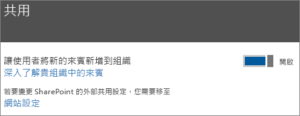
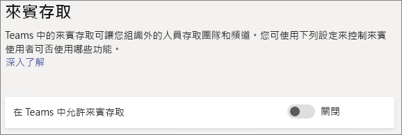
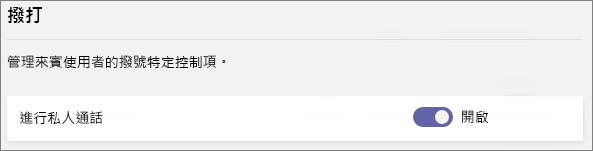
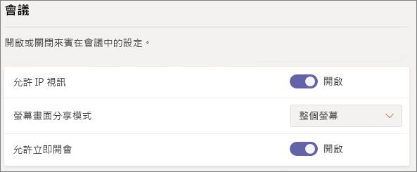
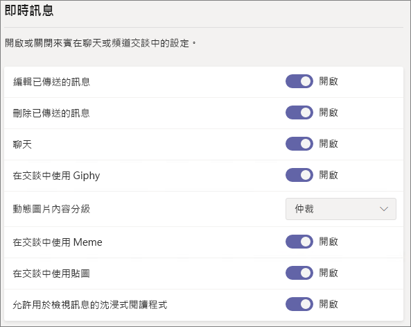
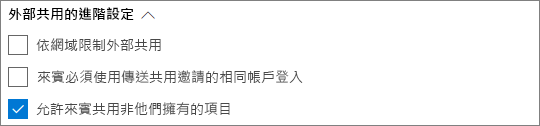
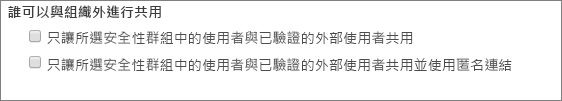

# Microsoft 365 來賓共用設定參考

本文提供可能影響 Microsoft 365 工作負載 (Teams、Office 365 群組、SharePoint 和 OneDrive) 來賓共用各種設定的參考。 這些設定位於 Azure Active Directory、Microsoft 365、Teams 和 SharePoint 系統管理中心。

## Azure Active Directory

**系統管理員角色：** 全域系統管理員

Azure Active Directory 是 Microsoft 365 所使用的目錄服務。 Azure Active Directory 組織關聯性設定會直接影響 Teams、Office 365 群組、SharePoint 和 OneDrive 中的共用。

> [!NOTE]
> 這些設定只有在已設定 [SharePoint 和 OneDrive 整合搭配 Azure AD B2B (預覽)](https://docs.microsoft.com/sharepoint/sharepoint-azureb2b-integration-preview) 時才會影響 SharePoint。 下表假設已進行此設定。

### 組織關聯性設定

**瀏覽：**[Azure Active Directory 系統管理中心](https://aad.portal.azure.com) > [Azure Active Directory] > [組織關聯性] > [設定]

|**設定**|**預設值**|**描述**|
|:-----|:-----|:-----|
|來賓使用者權限受限|是|此設定會影響來賓可以執行的目錄工作。|
|系統管理員與來賓邀請者角色中的使用者可以邀請|是|設為 [是]**** 時，系統管理員可以透過 Azure AD 和透過 Microsoft 365 共用體驗 (例如 Teams 和 SharePoint) 邀請來賓；設為 [否]**** 時則無法。|
|成員可以邀請|是|設為 [是]**** 時，Azure AD 成員可以透過 Azure AD 邀請來賓；設為 [否]**** 時，則無法邀請。 設為 [是]**** 時，Office 365 群組成員可以邀請具有擁有者核准的來賓；設為 [否]**** 時，Office 365 群組成員可以邀請具有擁有者核准的來賓，但擁有者必須是全域系統管理員，才能進行核准。   請注意，**成員可以邀請**是指 Azure AD 中的成員 (相對於來賓)，而非 Microsoft 365 中的網站或群組成員。   這與 Microsoft 365 安全性與隱私權中的 [讓使用者將新的來賓新增到組織]**** 設定完全相同。|
|來賓可以邀請|是|設為 [是]**** 時，目錄中的來賓可以邀請其他來賓在 Azure AD 資源上以及在 SharePoint 和 OneDrive 中的檔案和資料夾上共同作業；設為 [否]**** 時則無法。   請注意，必須在 SharePoint 系統管理中心開啟 [允許外部使用者輸入完全相符的電子郵件地址以尋找目錄中的使用者帳戶]****，來賓才能與其他來賓共用檔案和資料夾。|
|為來賓啟用電子郵件一次性密碼 (預覽)|否|設為 [是]**** 時，沒有 MSA 或公司或學校帳戶的來賓可以[使用一次性密碼向 Azure AD 進行驗證](https://docs.microsoft.com/azure/active-directory/b2b/one-time-passcode)；設為 [否]**** 時，使用者將必須建立 Microsoft 帳戶才能進行驗證。 此設定必須設為 [是]****，[SharePoint 和 OneDrive 整合搭配 Azure AD B2B (預覽)](https://docs.microsoft.com/sharepoint/sharepoint-azureb2b-integration-preview) 才能運作。|
|共同作業限制|允許傳送邀請給任何網域|此設定可讓您針對共用指定允許或封鎖的網域清單。 指定允許的網域時，則只可以將共用邀請傳送至這些網域。 指定拒絕的網域時，則無法將共用邀請傳送至這些網域。   此設定會影響 Microsoft 365 共用體驗 (例如 Teams 和 SharePoint)。 您可以使用 SharePoint 或 Teams 中的網域篩選，以更細微的層級允許或封鎖網域。|

這些設定會影響使用者獲邀請加入目錄的方式。 它們不會影響與已在目錄中的來賓共用。

## Microsoft 365

**系統管理員角色：** 全域系統管理員

Microsoft 365 系統管理中心有用於共用和用於 Office 365 群組的組織層級設定。

### 共用

**瀏覽：**[Microsoft 365 系統管理中心](https://admin.microsoft.com) > [設定] > [安全性與隱私權] > [共用]

|**設定**|**預設值**|**描述**|
|:-----|:-----|:-----|
|讓使用者將新的來賓新增到組織|開啟|設為 [是]**** 時，Azure AD 成員可以透過 Azure AD 邀請來賓；設為 [否]**** 時，則無法邀請。 設為 [是]**** 時，Office 365 群組成員可以邀請具有擁有者核准的來賓；設為 [否]**** 時，Office 365 群組成員可以邀請具有擁有者核准的來賓，但擁有者必須是全域系統管理員，才能進行核准。   請注意，**成員可以邀請**是指 Azure AD 中的成員 (相對於來賓)，而非 Microsoft 365 中的網站或群組成員。   這與 Azure Active Directory 組織關聯性設定中的 [成員可以邀請]**** 設定完全相同。|

### Office 365 群組

**瀏覽：**[Microsoft 365 系統管理中心](https://admin.microsoft.com) > [設定] > [服務與增益集] > [Office 365 群組]

|**設定**|**預設值**|**描述**|
|:-----|:-----|:-----|
|讓貴組織外部的群組成員存取群組內容|開啟|設為 [開啟]**** 時，來賓可以存取群組內容；設為 [否]**** 時，則無法存取。 針對來賓使用者會與 Office 365 群組或 Teams 互動的案例，此設定應該為 [開啟]****。|
|讓群組擁有者將貴組織外部的人員新增到群組|開啟|[開啟]**** 時，Office 365 群組或 Teams 的擁有者可以邀請新來賓加入群組。 [關閉]**** 時，擁有者只能邀請已在目錄中的來賓。|

## Teams

Teams 的主要來賓存取切換 [在 Teams 中允許來賓存取]****，必須為 [開啟]****，其他來賓設定才可供使用。

**系統管理員角色：** Teams 服務系統管理員

### 來賓存取

**瀏覽：**[Teams 系統管理中心](https://admin.teams.microsoft.com) > [整個組織的設定] > [來賓存取]

|**設定**|**預設值**|**描述**|
|:-----|:-----|:-----|
|在 Teams 中允許來賓存取|關閉|為 Teams 整體開啟或關閉來賓存取。 一旦變更，此設定可能需要 24 小時才會生效。|

### 來賓呼叫

**瀏覽：**[Teams 系統管理中心](https://admin.teams.microsoft.com) > [整個組織的設定] > [來賓存取]

|**設定**|**預設值**|**描述**|
|:-----|:-----|:-----|
|進行私人通話|開啟|[開啟]**** 時，來賓可以在 Teams 中進行點對點呼叫；[關閉]**** 時則無法。|

### 來賓會議

**瀏覽：**[Teams 系統管理中心](https://admin.teams.microsoft.com) > [整個組織的設定] > [來賓存取]

|**設定**|**預設值**|**描述**|
|:-----|:-----|:-----|
|允許 IP 視訊|開啟|[開啟]**** 時，來賓可以在通話與會議中使用影片；[關閉]**** 時則無法。|
|螢幕畫面分享模式|整個螢幕|[已停用]**** 時，來賓無法在 Teams 中共用螢幕畫面。 設為 [單一應用程式]**** 時，來賓只可以在其螢幕上共用單一應用程式。 設為 [整個螢幕]**** 時，來賓可以選擇共用應用程式或其整個螢幕。|
|允許立即開會|開啟|[開啟]**** 時，來賓可以在 Teams 中使用立即開會功能；[關閉]**** 時則無法。|

### 來賓訊息

**瀏覽：**[Teams 系統管理中心](https://admin.teams.microsoft.com) > [整個組織的設定] > [來賓存取]

|**設定**|**預設值**|**描述**|
|:-----|:-----|:-----|
|編輯已傳送的訊息|開啟|[開啟]**** 時，來賓可以編輯其之前傳送的郵件；[關閉]**** 時則無法。|
|刪除已傳送的訊息|開啟|[開啟]**** 時，來賓可以刪除其之前傳送的郵件；[關閉]**** 時則無法。|
|聊天|開啟|[開啟]**** 時，來賓可以在 Teams 中使用聊天；[關閉]**** 時則無法。|
|在交談中使用 Giphy|開啟|[開啟]**** 時，來賓可以在交談中使用 Giphy；[關閉]**** 時則無法。|
|Giphy 內容分級|中等|設為 [允許所有內容]**** 時，來賓可以在聊天中插入所有 Giphy，而無論內容分級為何。 設為 [中等]**** 時，來賓可以在聊天中插入 Giphy，但會適當限制成人內容。 設為 [嚴格]**** 時，來賓可以在聊天中插入 Giphy，但會限制插入成人內容。|
|在交談中使用 Meme|開啟|[開啟]**** 時，來賓可以在交談中使用 Meme；[關閉]**** 時則無法。|
|在交談中使用貼圖|開啟|[開啟]**** 時，來賓可以在交談中使用貼圖；[關閉]**** 時則無法。|
|允許用於檢視訊息的沈浸式閱讀程式|開啟|[開啟]**** 時，來賓可以在沈浸式閱讀程式中檢視郵件；[關閉]**** 時則無法。|

## SharePoint 和 OneDrive (組織層級)

**系統管理員角色：** SharePoint 系統管理員

這些設定會影響組織中所有的網站。 它們不會直接影響 Office 365 群組或 Teams，但我們建議您調整這些設定，以配合 Office 365 群組和 Teams 的設定，以避免使用者遇到問題。 (比方說，如果在 Teams 允許來賓共用但未在 SharePoint 中允許，那麼，Teams 中的來賓將無法存取 [檔案] 索引標籤，因為 Teams 檔案是儲存在 SharePoint 中。)

### SharePoint 和 OneDrive 共用設定

由於 OneDrive 是 SharePoint 內網站的階層，正如同其他 SharePoint 網站，組織層級共用設定會直接影響 OneDrive。

**瀏覽：** SharePoint 系統管理中心 > [共用]

|**設定**|**預設值**|**描述**|
|:-----|:-----|:-----|
|SharePoint|任何人|指定對 SharePoint 網站允許的最寬鬆共用權限。|
|OneDrive|任何人|指定對 OneDrive 網站允許的最寬鬆共用權限。 此設定不能較 SharePoint 設定更寬鬆。|

### SharePoint 和 OneDrive 進階共用設定

**瀏覽：** SharePoint 系統管理中心 > [共用]

|**設定**|**預設值**|**描述**|
|:-----|:-----|:-----|
|依網域限制外部共用|關閉|此設定可讓您針對共用指定允許或封鎖的網域清單。 指定允許的網域時，則只可以將共用邀請傳送至這些網域。 指定拒絕的網域時，則無法將共用邀請傳送至這些網域。   此設定會影響組織中的所有 SharePoint 和 OneDrive 網站。|
|來賓必須使用傳送共用邀請的相同帳戶登入|關閉|防止來賓使用與邀請所傳送對象不同的電子郵件地址兌換網站共用邀請。  [SharePoint 和 OneDrive 整合搭配 Azure AD B2B (預覽)](https://docs.microsoft.com/sharepoint/sharepoint-azureb2b-integration-preview) 不會使用此設定，因為所有來賓都會根據傳送邀請的目標電子郵件地址新增至目錄。 備用電子郵件地址無法用來存取網站。|
|允許來賓共用不是其擁有的項目|開啟|[開啟]**** 時，來賓可以與其他使用者或來賓共用他們未擁有的項目；[關閉]**** 時則無法。 來賓一律可以共用其具有完全控制的項目。|

### SharePoint 和 OneDrive 檔案和資料夾連結設定

在 SharePoint 和 OneDrive 中共用檔案與資料夾時，系統會傳送帶有檔案或資料夾權限的連結給共用收件者，而非為他們授與檔案或資料夾的直接存取權。 有數個類型的連結可供使用，並且您可以選擇使用者共用檔案或資料夾時要向使用者顯示的預設連結類型。 您也可以為 [任何人]** 連結設定權限和到期選項。

**瀏覽：** SharePoint 系統管理中心 > [共用]

|**設定**|**預設值**|**描述**|
|:-----|:-----|:-----|
|檔案與資料夾連結|擁有連結的任何人|指定當使用者共用檔案或資料夾時，預設要顯示的共用連結。 使用者可以於共用之前變更選項 (如果想要)。 如果預設值設為 [擁有連結的任何人]****，並且對特定網站不允許 [任何人]** 共用，那麼，[只有貴組織中的人員]**** 將顯示為該網站的預設值。|
|這些連結必須在此天數內過期|關閉 (無到期日)|指定建立 [任何人]** 連結後，其到期的天數。 無法更新到期的連結。 若要在超過到期日時繼續共用，請建立新連結。|
|檔案權限|檢視及編輯|指定建立 [任何人]** 連結時，使用者可以使用的檔案權限層級。 如果已選取 [檢視]****，使用者只能建立具有檢視權限的 [任何人]** 檔案連結。 如果已選取 [檢視及編輯]****，使用者可以在建立連結時，於檢視和檢視及編輯權限之間選擇。|
|資料夾權限|檢視、編輯及上傳|指定建立 [任何人]** 連結時，使用者可以使用的資料夾權限層級。 如果已選取 [檢視]****，使用者只能建立具有檢視權限的 [任何人]** 資料夾連結。 如果已選取 [檢視、編輯及上傳]****，使用者可以在建立連結時，於檢視和檢視、編輯及上傳權限之間選擇。|

### SharePoint 和 OneDrive 安全性群組設定

如果您想要限制可與 SharePoint 和 OneDrive 中的來賓共用的使用者，您可以將共用限制在特定安全性群組來完成此動作。 這些設定不會影響透過 Office 365 群組或 Teams 共用。 透過群組或團隊邀請的來賓也會可存取相關聯的網站，不過文件和檔案共用只能由指定安全性群組中的人員完成。

**瀏覽：** SharePoint 系統管理中心 > [共用] > [限制特定安全性群組的外部共用]

|**設定**|**預設值**|**描述**|
|:-----|:-----|:-----|
|只讓所選安全性群組中的使用者與已驗證的外部使用者共用|關閉|[開啟]**** 時，只有在特定安全性群組中的人員可以與外部使用者共用。 只有*特定人員*連結可供使用。 除非 [只有所選安全性群組中的使用者可以與已驗證之外部使用者和使用匿名連結的使用者進行共用]**** 也為 [開啟]****，否則會停用 [任何人]** 共用|
|只有所選安全性群組中的使用者可以與已驗證之外部使用者和使用匿名連結的使用者進行共用|關閉|[開啟]**** 時，只有在特定安全性群組中的人員可以與來賓共用。 [任何人]** 和 [特定人員]** 連結都可供使用。|

可同時使用這兩個設定。 如果使用者位於為這兩項設定指定的安全性群組中，則較大的權限層級優先 ([任何人]** 加上 [特定使用者]**)。

## SharePoint (網站層級)

**系統管理員角色：** SharePoint 系統管理員

### 網站共用

您可以在 SharePoint 中設定每個網站的來賓共用權限。 此設定同時適用網站共用和檔案與資料夾共用。 ([任何人]** 共用不適用網站共用。 如果您選擇 [任何人]****，使用者將可以使用 [任何人]** 連結來與新的及現有的來賓共用檔案與資料夾及網站本身。)

**瀏覽：** SharePoint 系統管理中心 > [使用中網站] > 選取網站 > [共用]

|**設定**|**預設值**|**描述**|
|:-----|:-----|:-----|
|網站內容可以與誰共用|因網站類型而異 (請參閱下表)|表示對此網站允許的外部共用類型。 此處可用的選項取決於 SharePoint 的組織層級共用設定。|

因為這些設定取決於 SharePoint 的全組織設定，如果您的組織層級設定變更，網站生效的共用設定可能會變更。 如果您在這裡選擇某個設定，並且組織層級之後設為較具限制性的值，則此網站會以該較具限制性的值運作。 比方說，如果您選擇 [任何人]****，並且之後組織層級設定設為 [新的及現有的來賓]****，則此網站將只會允許新的及現有的來賓。 如果之後將組織層級設定設回 [任何人]****，此網站將再次允許 [任何人]** 連結。

下表顯示每個網站類型的預設共用設定的。

|**網站類型**|**預設共用設定**|
|:-----|:-----|
|傳統|**只有貴組織中的人員**|
|OneDrive|**任何人**|
|群組連線的網站 (包括 Teams)|如果 Office 365 群組設定 [讓群組擁有者將組織外部的人員新增到群組]**** 為 [開啟]****，則為 [新的及現有的來賓]****；否則為 [僅現有的來賓]****|
|通訊|**只有貴組織中的人員**|
|沒有群組的新式網站 (#STS3 TeamSite)|**只有貴組織中的人員**|

## 另請參閱

[SharePoint 和 OneDrive 外部共用概觀](https://docs.microsoft.com/sharepoint/external-sharing-overview)

[Microsoft Teams 中的來賓存取](https://docs.microsoft.com/MicrosoftTeams/guest-access)

[將來賓新增至 Office 365 群組](https://support.office.com/article/bfc7a840-868f-4fd6-a390-f347bf51aff6)
