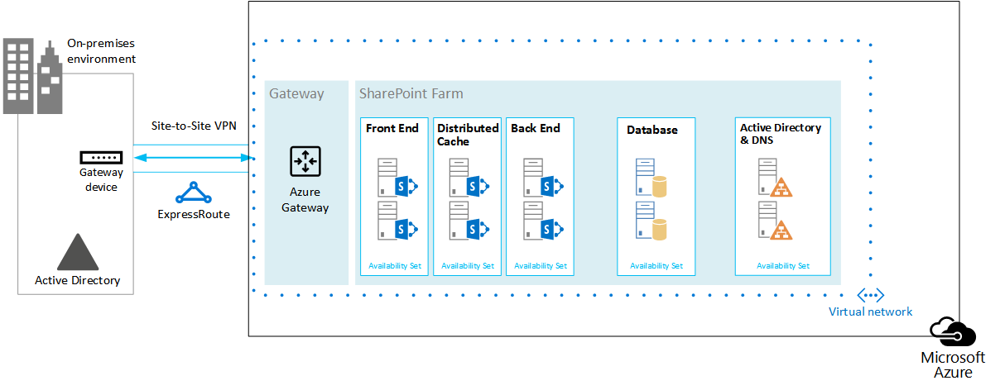

# Microsoft Azure Architectures for SharePoint 2013

 **摘要：**SharePoint 2013 解決方案可以裝載於 Microsoft Azure 虛擬機器。了解解決方案的類型有良好的調整及如何設定 Microsoft Azure 至其中的主機。
  
Azure 是架設 SharePoint Server 2013 解決方案良好環境。在大多數情況下，我們建議 Office 365 但架設在 Azure 中的 SharePoint 伺服器陣列可特定解決方案的良好的選擇。本文說明如何包括工程師的 SharePoint 解決方案所以是優符合 Azure 平台。下列兩個特定解決方案作為範例：
  
- [SharePoint Server 2013 Disaster Recovery in Microsoft Azure](sharepoint-server-2013-disaster-recovery-in-microsoft-azure.md)
    
- [Microsoft Azure using SharePoint Server 2013 中的網際網路網站](internet-sites-in-microsoft-azure-using-sharepoint-server-2013.md)
    
## 建議的 SharePoint 解決方案的 Azure 基礎結構服務

Azure 基礎結構服務是架設 SharePoint 解決方案迫切] 選項。某些解決方案會比其他更合適的此平台。下表顯示建議的解決方案。
  
|**解決方案**|**此解決方案 azure 為什麼建議使用**|
|:-----|:-----|
|開發及測試環境    |很容易建立及管理這些環境。    |
|Azure 至內部部署 SharePoint 伺服器陣列的災害復原    |**裝載次要資料中心**使用 Azure 演變次要資料中心內的不同區域中。   **較低成本嚴重損壞修復環境**維護及工資資源少於內部嚴重損壞修復環境。資源數目取決於您選擇嚴重損壞修復環境： 冷待命、 暖待命或熱待命。  **更多彈入平台**在發生災害時輕鬆地向外延展負載要求修復 SharePoint 伺服器陣列。當您不再需要資源的向外。  請參閱[SharePoint Server 2013 Disaster Recovery in Microsoft Azure](sharepoint-server-2013-disaster-recovery-in-microsoft-azure.md)。    |
|使用功能與刻度不適用於 Office 365 的網際網路網站    |**整個計畫重心在工作**專注於建置更好的網站而不是建置基礎結構。   **利用 Azure 中的 elasticity**大小需求的伺服器陣列來新增伺服器，然後只工資您需要的資源。動態機器配置不支援 （自動調整大小）。  **使用 Azure Active Directory (AD)**善用客戶帳戶的 Azure AD。   **無法使用 Office 365 中新增的 SharePoint 功能**新增深報告與 web 分析。   請參閱[Microsoft Azure using SharePoint Server 2013 中的網際網路網站](internet-sites-in-microsoft-azure-using-sharepoint-server-2013.md)。    |
|若要支援 Office 365 或內部部署環境的應用程式伺服器陣列    |**建立、 測試與代管應用程式**以支援兩個內部部署和雲端環境 Azure 中。   Azure 而不是購買新硬體的內部部署環境中的**主機此角色**。   |
   
內部網路與共同作業解決方案及工作負載，請考慮下列選項：
  
- 判斷 Office 365 是否符合您的業務需求或可以是解決方案的一部分。Office 365 提供永遠是最新的豐富的功能集。
    
- 如果 Office 365 不符合所有您的業務需求，請考慮在內部部署 Microsoft 諮詢服務 (ATL-MCS-001) 從 SharePoint 2013 的標準實作。標準架構可以是您一份自訂比支援更、 低廉、 且更容易解決方案。 
    
- 如果標準實作不符合您的業務需求，請考慮為自訂的內部部署解決方案。
    
- 如果您的業務需求的重要使用雲端平台，請考慮在 Azure 基礎結構服務主控的 SharePoint 2013 的標準或自訂實作。容易比其他非原生 Microsoft 公用 cloud 平台支援 Azure 中的 SharePoint 解決方案為何。
    
## 您在設計 Azure 環境之前

儘管本文使用範例 SharePoint 拓撲，您可以使用這些設計概念與任何 SharePoint 伺服器陣列拓撲。設計 Azure 環境之前，請使用下列拓撲、 架構、 容量及效能指導來設計的 SharePoint 伺服器陣列：
  
- [SharePoint 2013 IT 專業人員的架構設計](http://technet.microsoft.com/en-us/sharepoint/fp123594.aspx)
    
- [規劃效能和容量管理 SharePoint Server 2013](http://technet.microsoft.com/library/8dd52916-f77d-4444-b593-1f7d6f330e5f.aspx)
    
## 決定 Active Directory 網域類型

每個 SharePoint 伺服器陣列依賴 Active Directory 提供給伺服器陣列安裝程式的管理帳戶。在此階段中，有兩個 Azure 中的 SharePoint 解決方案的選項。下表說明這些。
  
|**選項**|**描述**|
|:-----|:-----|
|專用的網域    |您可對 Azure 以支援您的 SharePoint 伺服器陣列部署專用和隔離的 Active Directory 網域。這是不錯的選擇的公用對向網際網路網站。    |
|擴充跨部署連線到內部部署網域    |當您擴充跨部署連線到內部網域時、 使用者會存取透過您的內部網路 SharePoint 伺服器陣列主控內部部署一樣。您可以運用您的內部部署 Active Directory 和 DNS 實作。    跨部署的連線，則需要建置 Azure 容錯移轉至從內部部署伺服器陣列中的嚴重損壞修復環境。    |
   
本文包含擴充跨部署連線到內部網域的設計的概念。如果您的解決方案使用專用的網域，您不需要跨部署的連線。
  
## 設計虛擬網路

首先需要 Azure，其中包含子網路會放置在虛擬機器中的虛擬網路。虛擬網路需要私人 IP 位址空間，您指派給子網路的部分。
  
如果您要擴充至 Azure 的內部網路透過跨部署連線 （嚴重損壞修復環境需要），您必須選擇尚未在其中包含您組織的網路中其他地方使用私人位址空間內部部署環境及其他 Azure 虛擬網路。 
  
**圖 1： 內部部署環境與 Azure 虛擬網路**

  
在此圖表中：
  
- 在 Azure 虛擬網路是圖解-並排至內部部署環境。兩個環境不尚未連接所連接的跨部署的連線，可以為網站 VPN 連線或 ExpressRoute。
    
- 此時，虛擬網路只包含子網路與任何其他架構元素。一個子網路將裝載 Azure 閘道和其他子網路主控的 SharePoint 伺服器陣列、 Active Directory 和 DNS 額外一層。
    
## 新增跨部署連線

部署下一步是建立跨部署連線 （如果這適用於您的解決方案）。跨部署連線 Azure 閘道位於不同的閘道的子網路，您必須建立並指派位址空間。 
  
當您規劃跨部署的連線時，您會定義及建立 Azure 閘道和內部閘道裝置的連線。
  
**圖 2： 使用 Azure 閘道和內部閘道裝置來提供內部部署環境及 Azure 之間的網站連線**

  
在此圖表中：
  
- 上圖中加入，內部部署環境是透過連接至 Azure 虛擬網路的跨內部連線，可以為網站 VPN 連線或 ExpressRoute。
    
- Azure 閘道為閘道的子網路上。
    
- 內部部署環境包含閘道裝置，例如路由器或 VPN 伺服器。
    
如需規劃及建立跨內部虛擬網路的詳細資訊，請參閱 ＜[連接到 Microsoft Azure 虛擬網路的內部網路](connect-an-on-premises-network-to-a-microsoft-azure-virtual-network.md)。
  
## 新增 Windows Server Active Directory (AD) 和 DNS

您可以在 Azure 中的嚴重損壞修復、 部署 Windows Server AD 和 Windows Server AD 所在的混合式案例的 DNS 同時在內部部署與 Azure 虛擬機器上。
  
**圖 3： 混合式 Active Directory 網域組態**

  
此圖建置在先前圖表加入至 Windows Server AD 的兩個虛擬機器與 DNS 的子網路。這些虛擬機器複本的網域控制站和 DNS 伺服器。他們是副檔名為內部部署 Windows Server AD 環境。 
  
下表提供這些 Azure 中的虛擬機器設定建議。使用這些當做起點來設計您自己環境 — 即使為專用網域 Azure 環境不會與內部部署環境通訊的地方。
  
|**項目**|**設定**|
|:-----|:-----|
|在 Azure 虛擬機器大小    |標準層中的 A1 或 A2 大小    |
|作業系統    |Windows Server 2012 R2    |
|Active Directory 角色    |AD DS 網域控制站指定為通用類別目錄伺服器。此設定會減少輸出流量之間的跨部署的連線。    （這是不常見） 變更速率高多網域環境中，設定內部部署不適用於同步處理的通用類別目錄伺服器在 Azure，以減少複寫流量的網域控制站。    |
|DNS 角色    |安裝並設定網域控制站上的 DNS 伺服器服務。    |
|資料磁碟    |Active Directory 資料庫、 記錄以及 SYSVOL 置於其他 Azure 資料的磁碟。不放置這些作業系統磁碟或 Azure 所提供的暫存磁碟上。    |
|IP 位址    |使用靜態 IP 位址並設定虛擬網路之後的網域控制站台，這些位址指派給虛擬網路中的虛擬機器。    |
   
> [!IMPORTANT]
> 部署在 Azure 中的 Active Directory 之前，請先閱讀[部署 Windows Server Active directory Azure 虛擬機器上的指導方針](https://go.microsoft.com/fwlink/p/?linkid=392681)。這些協助您判斷不同架構或不同的組態設定所需的解決方案。 
  
## 新增 SharePoint 伺服器陣列

置於適當的子網路層 SharePoint 伺服器陣列的虛擬機器。
  
**圖 4： 位置的 SharePoint 虛擬機器**

  
此圖建置在先前圖表其各自的各層中加入 SharePoint 伺服器陣列伺服器角色。
  
- 執行 SQL Server 的兩個資料庫虛擬機器時建立的資料庫層。
    
- 在下列各層的每個執行 SharePoint Server 2013 的兩個虛擬機器： 前端伺服器、 分散式快取伺服器及後端伺服器。
    
## 設計與微調可用性設定 」 和 「 容錯網域的伺服器角色

容錯網域是硬體的一群中執行哪些角色執行個體。在相同的容錯網域內的虛擬機器可由 Azure 基礎結構更新同時。或者，他們可以因為它們都共用同一個機架失敗，同時。若要避免在相同的容錯網域擁有兩個虛擬機器時的風險，您可以設定虛擬機器可用性設定，以確保每部虛擬機器是不同的容錯網域中。如果三個虛擬機器設定可用性設定、 Azure 保證不超過兩個虛擬機器都位於相同的容錯網域。
  
當您設計的 SharePoint 伺服器陣列的 Azure 架構時，設定可用性組屬於相同的伺服器角色。這可確保虛擬機器時所遍佈多個容錯網域。
  
**圖 5： 使用 Azure 可用性設定以提供在 SharePoint 伺服器陣列各層的高可用性**

  
此圖呼叫出 Azure 基礎結構內的可用性設定的設定。每個下列角色共用個別可用性設定：
  
- Active Directory 和 DNS
    
- 資料庫
    
- 後端
    
- 發佈快取
    
- 前端
    
SharePoint 伺服器陣列可能會需要可調整的 Azure 平台。若要確保高可用性的所有元件，確定伺服器角色的所有設定的同名。
  
以下是顯示標準的網際網路網站架構符合特定的容量和效能目標的範例。本範例會精選下列架構模型： [SharePoint Server 2013 的網際網路網站搜尋架構](https://go.microsoft.com/fwlink/p/?LinkId=261519)。
  
**圖 6： 規劃在三層式伺服器陣列中的容量和效能目標的範例**

  
在此圖表中：
  
- 表示在三層式伺服器陣列： 網頁伺服器、 應用程式伺服器及資料庫伺服器。
    
- 具有多個元件同名設定三個網頁伺服器。
    
- 兩部資料庫伺服器的設定都相同。
    
- 三個應用程式伺服器未設定進行完全相同。這些伺服器角色都需要在 Azure 中的可用性的可調整設定。
    
讓我們看接近在應用程式伺服器層。
  
**圖 7： 應用程式伺服器層之前可調整**

  
在此圖表中：
  
- 在 [應用程式層包含三部伺服器。
    
- 第一部伺服器包含四個元件。
    
- 第二個 server 包含三個元件。
    
- 第三個伺服器包含兩個元件。
    
您的伺服器陣列的效能與容量目標是判斷元件數目。Azure 能否此架構，我們將所有三部伺服器上複寫的四個元件。這會增加超過功能時所需的效能與容量的元件數目。取捨是此設計可確保當下列三個虛擬機器時指派給可用性設定 Azure 平台中所有的四個元件的高可用性。
  
**圖 8： 應用程式伺服器層後可調整**

  
此圖顯示相同的四個元件進行完全相同設定的所有三個應用程式伺服器。
  
當我們將可用性設定新增至 SharePoint 伺服器陣列層時，實作已完成。
  
**圖 9： 完成的 SharePoint 伺服器陣列中 Azure 基礎結構服務**

  
此圖顯示實作於 Azure 基礎結構服務，以提供容錯網域的每一層中的伺服器的可用性設定 SharePoint 伺服器陣列。
  
**加入討論區**

|**與我們連絡**|**描述**|
|:-----|:-----|
|**雲端採用內容您是否需要吗？**   |我們會建立橫跨多個 Microsoft cloud 平台及服務的雲端採用的內容。我們知道什麼構思我們雲端採用內容，或藉由傳送電子郵件給[cloudadopt@microsoft.com](mailto:cloudadopt@microsoft.com?Subject=[Cloud%20Adoption%20Content%20Feedback]:%20)要求特定的內容。  |
|**加入雲端採用討論**   |如果您是找到他們需雲端式解決方案，請考慮加入雲端採用 Advisory 董 (CAAB) 與 Microsoft 內容的開發人員、 產業專業人員和客戶的從遍更大型、 加上鮮豔社群連線。若要加入，新增您自己的 Microsoft 技術社群[CAAB （雲端採用諮詢委員會） 空間](https://aka.ms/caab)的成員身分並在[CAAB@microsoft.com](mailto:caab@microsoft.com?Subject=I%20just%20joined%20the%20Cloud%20Adoption%20Advisory%20Board!)快速的電子郵件傳送意見。任何人都可以讀取上[CAAB 部落格](https://blogs.technet.com/b/solutions_advisory_board/)社群相關內容。不過，CAAB 成員取得說明新雲端採用資源和解決方案的私人研討會的邀請。  |
|**取得您在此處看到美工圖案**   |如果您想編輯您在本文中看到藝術複本，我們樂於傳送給您。您的要求，包含 URL 及標題的圖案、 [cloudadopt@microsoft.com](mailto:cloudadopt@microsoft.com?subject=[Art%20Request]:%20)的電子郵件。  |
   
## See Also

[雲端採用和混合式解決方案](cloud-adoption-and-hybrid-solutions.md)
  
[Microsoft Azure using SharePoint Server 2013 中的網際網路網站](internet-sites-in-microsoft-azure-using-sharepoint-server-2013.md)
  
[SharePoint Server 2013 Disaster Recovery in Microsoft Azure](sharepoint-server-2013-disaster-recovery-in-microsoft-azure.md)

