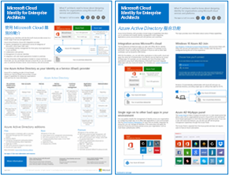
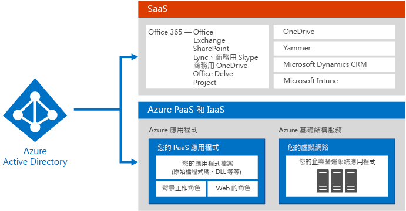
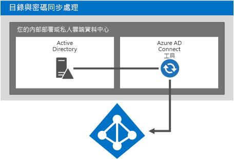
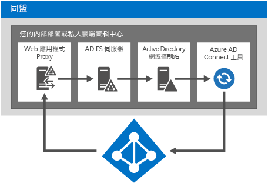
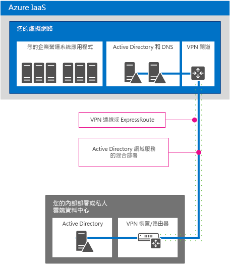
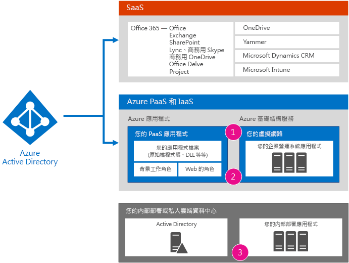
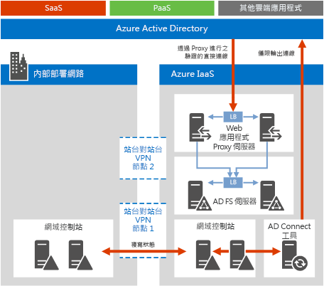

# Microsoft Cloud Identity for Enterprise Architects

 **摘要：** 為您的 Microsoft 雲端服務與平台設計識別身分解決方案。
  
此文章說明 IT 結構設計師在使用 Microsoft 雲端服務和平台，來設計組織的身分識別時，需要了解的資訊。您也可以 5 頁海報的形式檢視本文，並且列印 tabloid 格式 (也稱為總帳 11 x 17 或 A3)。
  

  
[PDF](https://go.microsoft.com/fwlink/p/?LinkId=524586) | [Visio](https://download.microsoft.com/download/2/3/8/238228E6-9017-4F6C-BD3C-5559E6708F82/MSFT_cloud_architecture_identity.vsd) | [更多語言](https://www.microsoft.com/download/details.aspx?id=54431)
  
您也可以查看在 [Microsoft Cloud IT 架構資源](microsoft-cloud-it-architecture-resources.md) 內的所有模型，並在[Microsoft 的 Enterprise Cloud 藍圖中撥動︰IT 決策者的資源](https://aka.ms/cloudarchitecture)。
  
> [!NOTE]
> 此文章反映了 2016 年 1 月版本的**適用於企業結構設計師的 Microsoft 雲端識別**海報。但不包含在 2016 年 4 月版本或更新版本的海報中所進行的變更。
  
## 設計 Microsoft 雲端的識別

將您的識別與 Microsoft 雲端整合，讓您可以選擇存取各種服務和雲端平台。其中有兩個主要選項︰
  
- 您可以與 Microsoft Azure Active Directory (AD) 整合。這牽涉到將內部部署帳戶同步處理至 Azure AD (Microsoft 雲端的識別提供者)。
    
- 您可以將內部部署的 Active Directory 網域服務 (AD DS) 環境，延伸到 Microsoft Azure 基礎結構服務中所運行的虛擬機器上。
    

  
 **圖 1：供您在雲端設定身分識別的選項**
  
圖 1 顯示 Azure AD 如何提供 Microsoft 軟體即服務 (SaaS) 服務和 Azure 平台即服務(PaaS) 應用程式的身分識別，以及適用於企業營運的應用程式可以怎樣使用內部部署的 AD DS。 
  
### Azure Active Directory

Microsoft Azure AD 是 Microsoft 裝載在雲端的身分識別及存取管理服務。位於 Microsoft 雲端服務與平台的中心。與 Azure AD 整合，讓您可以使用目前的帳戶和密碼集合，存取所有的 Microsoft SaaS 服務。該整合也提供 Azure PaaS 應用程式的雲端式身分識別。 
  
> [!NOTE]
> Azure AD 無法取代對於企業組織內部部署的 AD DS 的需求，或對於 Azure 基礎結構即服務 (IaaS) 中所運行以 Windows 為主的虛擬機器的需求。 
  
Azure AD 有三個版本︰「免費」、「基本」與「進階」。 
  
||||
|:-----|:-----|:-----|
|**免費**   |**基本**   |**進階**   |
| 	管理使用者帳戶    與內部部署的目錄同步    在 Azure、Office 365 和數千種熱門的 SaaS 應用程式 (例如 Salesforce、Workday、Concur、DocuSign、Google Apps、Box、ServiceNow、Dropbox 等等) 之間，進行單一登入。   | 包括免費版中的所有功能，再加上：    公司品牌推廣    以群組為基礎的應用程式存取    自助式密碼重設    99.9% 的企業 SLA   | 包括免費版和基本版的所有功能，再加上：    自助式群組管理    進階的安全性報告及警示    Multi-factor authentication    藉由寫回至內部部署 AD DS 的方式，重新設定密碼    Azure AD Connect 工具雙向同步    Azure AD 應用程式 Proxy    	Microsoft Forefront Identity Manager (MIM)   |
   
如需有關版本的詳細資訊，請參閱[Azure Active Directory 的版本](https://go.microsoft.com/fwlink/p/?LinkId=524280)。
  
### 選項 1：與 Azure Active Directory 整合

大部分的組織會將標準的物件和屬性集合，同步到組織的 Azure AD 租用戶。Azure AD Connect 工具可在您內部部署的 AD DS 帳戶，與 Azure AD 租用戶的帳戶之間，進行同步處理。
  

  
 **圖 2：與 Azure AD 整合**
  
圖 2 顯示 Azure AD Connect 工具如何取得 AD DS 的變更，並將其傳送到您的 Azure AD 租用戶。在此案例中，您的 Azure AD 租用戶是內部部署的基本目錄裝載在雲端的複本。
  
許多組織會使用 AD DS，作為其內部部署的識別提供者。您可以使用不同類型的識別提供者內部部署 (例如使用 LDAP)，並將其同步到 Azure AD。
  
### 選項 2：將 AD DS 延伸至 Azure

將 AD DS 延伸到 Azure 基礎結構服務中的虛擬機器上；比起與 Azure AD 同步，這樣可支援一套不同的解決方案和應用程式。這裡有兩個範例︰
  
- 支援雲端式解決方案 (需要 NTLM 或 Kerberos 驗證，或已加入網域的 AD DS 虛擬機器)。
    
- 對於跨 Microsoft 雲端服務與平台的雲端服務和應用程式，可增加額外的整合可能性。
    

  
 **圖 3：將 AD DS 延伸到 Azure**
  
圖 3 顯示 AD DS 網域控制站，透過內部部署的 VPN 裝置和 Azure VPN 閘道，連線到 Azure 虛擬網路。Azure 虛擬網路包含適用於企業營運的應用程式伺服器，及其本身的網域控制站集合。
  
### 詳細資訊

- [以 Office 365 同步處理目錄很容易](https://go.microsoft.com/fwlink/p/?LinkId=524281)
    
- [資訊圖表：雲端識別和存取管理](https://go.microsoft.com/fwlink/p/?LinkId=524282)
    
- [Azure Active Directory](https://go.microsoft.com/fwlink/p/?LinkId=524283)
    
## 將您的內部部署 AD DS 帳戶與 Microsoft Azure AD 整合

將您的內部部署 AD DS 帳戶與 Azure AD 同步，您的使用者就可以使用其內部部署 AD DS 帳戶，存取︰
  
- 所有的 Microsoft SaaS 服務 (Office 365、Microsoft Intune 和 Dynamics CRM Online)
    
- 您在 Azure PaaS 中執行的應用程式
    
有兩種方式來設定這項整合︰
  
- 目錄與密碼同步處理
    
- 同盟和單一登入
    
從符合您的需求而最簡單的選項開始。如有需要，您可以在這些選項之間進行切換。
  
> [!NOTE]
> 對於企業規模的組織，不建議使用雲端專用帳戶 (未與內部部署 AD DS 整合)。 
  
### 目錄與密碼同步處理

這是最簡單的選項，而且只需要執行 Azure AD Connect 工具的伺服器。 
  

  
 **圖 4：目錄與密碼同步處理組態**
  
圖 4 顯示具有 AD DS 網域控制站的內部部署或私人雲端資料中心。執行 Azure AD Connect 工具的伺服器，會將帳戶名稱清單與 Azure AD 同步。
  
使用此選項︰
  
- 使用者帳戶會從內部部署的 AD DS (或其他識別提供者) 同步到您的 Azure AD 租用戶。內部部署目錄會保留帳戶的系統授權來源，您可以從中管理帳戶的所有變更。
    
- Azure AD 會針對以 Microsoft SaaS 為基礎的服務和 Azure PaaS 應用程式，執行所有的驗證。
    
- 您也可以設定多個 AD DS 樹系的同步處理。
    
使用密碼同步處理︰
  
- 使用者在存取雲端服務時，會看到輸入密碼的提示，此處的密碼與他們在內部部署資源中所使用的密碼相同。
    
- 使用者密碼絕對不會以純文字傳送到 Azure AD。相反地，系統會使用密碼雜湊。無法透過密碼編譯以解密，或對密碼雜湊進行反向工程以取得純文字密碼。 
    
使用多重要素驗證 (MFA)：
  
- 您可以利用 Office 365 提供的基本 MFA 功能。
    
- Azure PaaS 應用程式開發人員可利用 Azure Multi-Factor Authentication 服務。
    
目錄同步處理並不會進行與內部部署 MFA 解決方案的整合。
  
### 同盟和單一登入

這個選項需要額外的伺服器和基礎結構。 
  

  
 **圖 5：同盟驗證所需的伺服器**
  
圖 5 顯示同盟驗證所需的元件集合。Azure AD 會連絡 Web 應用程式 Proxy，後者會將驗證要求轉送給 Active Directory 同盟服務 (AD FS) 伺服器，該伺服器會再將要求轉送給 AD DS 網域控制站，以供評估和回應。執行 Azure AD Connect 工具的伺服器，會將帳戶名稱清單從 AD DS 同步到 Azure AD。
  
同盟提供會以下額外的企業功能︰
  
- 所有傳送到 Azure AD 的驗證要求，都會透過 AD FS 轉送給內部部署的識別提供者，並對其執行。
    
- 與非 Microsoft 身分識別提供者搭配運作。
    
- 密碼雜湊同步處理可以當做同盟登入的備用登入 (例如，若同盟驗證失敗時)。
    
在以下情況使用同盟：
  
- 單一登入是必要時。有了單一登入，使用者在存取雲端服務時，就不會看到輸入任何認證 (使用者名稱或密碼) 的提示。
    
- 已部署 AD FS 時。
    
- 您使用協力廠商身分識別提供者。
    
- 您使用 Forefront Identity Manager 2010 R2 (不支援密碼雜湊同步處理) 時。
    
- 您具有內部部署整合式智慧卡或其他 MFA 解決方案。
    
- 您需要登入稽核和/或停用帳戶時。
    
- 您的組織需要按照網路位置或工作時間，進行用戶端登入限制時。
    
- 您必須遵循美國聯邦資訊處理標準 (FIPS) 時。
    
若要進行同盟驗證，需要針對基礎結構內部部署進行更多投資。
  
- 內部部署伺服器必須能夠透過公司的防火牆而存取網際網路。Microsoft 建議使用在您的周邊網路中，所部署的 Web 應用程式 Proxy 伺服器。
    
- 需要硬體、授權，以及運作中的 AD FS 伺服器、AD FS Proxy 或 Web 應用程式 Proxy 伺服器、防火牆和負載平衡器。 
    
- 可用性和效能對於確保使用者可存取 Office 365 和其他雲端應用程式而言，極為重要。
    
### 詳細資訊

- [以 Office 365 同步處理目錄很容易](https://go.microsoft.com/fwlink/p/?LinkId=524281)
    
- [準備透過目錄同步作業將使用者佈建至 Office 365](https://go.microsoft.com/fwlink/p/?LinkId=524284)
    
- [Office 365 的多重要素驗證](https://go.microsoft.com/fwlink/p/?LinkID=392012)
    
- [Azure Multi-Factor Authentication](https://go.microsoft.com/fwlink/p/?LinkId=524285)
    
- [TechEd 2014：目錄整合：使用 Active Directory 和 Azure Active Directory 建立單一目錄](https://go.microsoft.com/fwlink/p/?LinkId=524286)
    
## 將 AD DS 延伸至 Azure

將 AD DS 延伸到 Azure，是支援 Azure 基礎結構服務中所運行的虛擬機器上，適用於企業營運的應用程式的第一步，可提供：
  
- 支援雲端式解決方案 (需要 NTLM 或 Kerberos 驗證，或已加入網域的 AD DS 虛擬機器)。
    
- 對於雲端服務和應用程式，可提供額外的整合可能性，且可隨時新增。
    

  
 **圖 6：將 AD DS 延伸至 Azure 虛擬網路**
  
圖 6 顯示顯示具有 AD DS 的內部部署或私人雲端資料中心，使用站台對站台 VPN 或 ExpressRoute 連線方式，連線到 Azure 虛擬網路。Azure 虛擬網路包含適用於企業營運的應用程式伺服器，及其本身的網域控制站集合。此設定是 AD DS 內部部署以及在 Azure 基礎結構服務中的混合式部署。此設定需要︰
  
- Azure 虛擬網路。
    
- 內部部署虛擬私人網路 (VPN) 裝置或路由器，以及 Azure VPN 閘道之間的連線。
    
- 將您內部部署 IP 位址空間的一部分，用於虛擬網路中的虛擬機器。
    
- 於指定為通用類別目錄伺服器 (降低 VPN 連線的輸出流量) 的虛擬網路，部署一或多個網域控制站。
    
比起與 Azure AD 同步，這個識別架構可支援一套不同的解決方案和應用程式。
  
### 內部部署與 Azure 的連線選項

若要將您的內部部署網路連線到 Azure 虛擬網路，您可以使用︰
  
- 站台對站台 VPN 連線，能將 1-10 個網站 (包括其他 Azure 虛擬網路) 連接到單一 Azure 虛擬網路。
    
- ExpressRoute，這是透過合作夥伴網路和資料中心服務提供者的私人安全 WAN 連結。ExpressRoute 連線可提供更高的可靠性、更大的頻寬，以及更低的延遲。
    
### 詳細資訊

- [虛擬網路的交叉部署連線能力](https://go.microsoft.com/fwlink/p/?LinkId=524293)
    
- [ExpressRoute 技術概觀](https://go.microsoft.com/fwlink/?LinkID=392081)
    
- [在 Azure 虛擬機器部署 Windows Server Active Directory 的指導方針](https://go.microsoft.com/fwlink/p/?LinkId=524295)
    
## 將您的應用程式與雲端身分識別整合

當設計和開發在雲端執行的應用程式時，您應該設法保持在驗證程序上使用者經驗的一致性，包括必要的認證集合。例如，使用 Windows 認證時，無論是對 Azure AD 或延伸的 AD DS，都請確保使用者可以快速驗證，並專注於他們的工作。
  

  
 **圖 7：將您的應用程式與雲端身分識別整合**
  
圖 7 顯示將您的應用程式與雲端身分識別整合的三個選項。
  
1. 將裝載在雲端的應用程式登錄到 Azure AD。
    
    請參閱 MSDN 文件[將應用程式與 Azure Active Directory 整合](https://go.microsoft.com/fwlink/p/?LinkId=524303)。這可讓您使用 Azure AD 驗證您的 PaaS 應用程式，同時也讓使用者或管理員可以授與對您應用程式的存取權限，以便代表他們從其他的雲端服務 (例如 Office 365) 存取內容。如需更多詳細資料和程式碼範例，請參閱 MSDN 文章[Azure Active Directory 的驗證案例](https://go.microsoft.com/fwlink/p/?LinkId=524304)。 
    
2. 應用程式如果需要以程式設計方式驗證，才能存取受到 AD SD、Windows Server 2012 R2 上的 AD FS，或 Azure AD 保護的的應用程式，則可使用︰
    
  - [Azure AD Graph API](https://go.microsoft.com/fwlink/p/?LinkId=524305)
    
  - [Active Directory 驗證程式庫 (ADAL)](https://go.microsoft.com/fwlink/p/?LinkID=524297)
    
    Azure AD Graph API 支援 OAuth 和 OpenID Connect。也會使用 PaaS 應用程式。
    
3. 設定內部部署的應用程式，或在 Azure 虛擬網路中的虛擬機器上所執行，適用於企業營運的應用程式，以便直接使用 Windows 驗證 (NTLM 或 Kerberos)。這對使用者以及需要最少設定的伺服器應用程式開發人員來說，會是最佳的經驗。
    
### 應用程式整合範例

組織建置了 ASP.NET 應用程式，用以公開 REST 端點，供其他應用程式在那裡取得最新的銷售資料。對該 REST 端點的存取受到 Azure AD 的保護。應用程式必須提供可由 Azure AD 驗證的認證，之後 ASP.NET 應用程式才會傳送要求的資料。然後，在組織中的其他開發人員就可以撰寫自己的應用程式，以使用來自 REST 端點的銷售資料。
  
為了讓 Azure AD 驗證並擷取資料，ADAL 會管理使用者驗證程並將存取權杖遞交給應用程式，使其可以用來取得銷售資料的存取權限。ADAL 可讓取得並剖析權杖、OAuth 流程及其他元素的複雜過程變得簡單。ADAL 是另一種正在迅速變化的技術解決方案，因此開發人員應該在 NuGet 上尋找最新的版本。
  
## 在 Azure 中部署目錄元件

您可以在 Azure 虛擬網路中，而不是內部部署的資料中心上，部署目錄元件 (例如用於密碼同步處理或同盟驗證的伺服器)。請考慮其優點，尤其是您打算將 AD DS 延伸到 Azure 時。
  
以下是可以置於 Azure 虛擬網路中的目錄元件︰
  
- 	Azure AD Connect 工具
    
- 同盟驗證元件
    
- 獨立式 AD DS 環境
    
### AD Connect 工具

Azure AD Connect 工具可裝載於 Azure 虛擬網路中的雲端。將此工作負載部署到 Azure 時，請考慮這些優點︰
  
- 您可能可以加速佈建以及降低作業成本
    
- 提高可用性
    

  
 **圖 8：在 Azure 中執行的 AD Connect 工具**
  
圖 8 顯示在 Azure 虛擬網路中的虛擬機器上所執行的 AD Connect 工具，會查詢內部部署的 AD DS 網域控制站，以取得帳戶變更，然後將這些變更傳送到 Office 365。此解決方案適用於︰
  
- Office 365 服務。
    
- 網際網路上可用的 Azure PaaS 應用程式。
    
- Azure 中適用於企業營運的應用程式，可從內部部署環境透過站台對站台 VPN 或 ExpressRoute 連線方式使用。
    
如需詳細資訊，請參閱[將內部部署識別與 Azure Active Directory 整合](https://go.microsoft.com/fwlink/p/?LinkId=524307)。
  
### 同盟驗證基礎結構

如果您尚未內部部署 AD FS，請考慮將此工作負載部署到 Azure 的優點：
  
- 為雲端服務的驗證 (無內部部署相依性) 提供自主性
    
- 減少由伺服器和工具主控的內部部署
    
- 使用雙節點容錯移轉叢集上的站台對站台 VPN 閘道連線到 Azure (新)
    
- 使用 ACL 以確保 Web 應用程式 Proxy 伺服器只能與 AD FS 通訊，而無法直接與網域控制站或其他伺服器通訊
    

  
 **圖 9：在 Azure 部署您的同盟驗證基礎結構**
  
圖 9 顯示內部部署的網域控制站集合，複寫 Azure 虛擬網路中網域控制站集合的 AD DS 資訊。在 Azure 虛擬網路中的伺服器上所執行的 Azure AD Connect 工具，會查詢本機網域控制站以取得變更，然後將這些變更傳送到 Azure AD。從 Microsoft SaaS 服務、Azure PaaS 應用程式和其他雲端應用程式，傳入 Azure AD 的驗證要求，會轉送給外部負載平衡器，後者會將要求轉送給 Web 應用程式 Proxy 伺服器集合。Web 應用程式 Proxy 伺服器會將要求轉送給內部負載平衡器，後者會將要求轉送給 AD FS 伺服器集合。接著 AD FS 伺服器會將要求轉送給網域控制站，以驗證傳送的認證。
  
 此解決方案適用於︰
  
- 需要 Kerberos 的應用程式
    
- 所有 Microsoft 的 SaaS 服務
    
- Azure 中網際網路對應的應用程式
    
- Azure IaaS 或 PaaS 中，需要採用您組織的 AD DS 帳戶集合進行驗證的應用程式
    
如需詳細資訊，請參閱[將內部部署識別與 Azure Active Directory 整合](https://go.microsoft.com/fwlink/p/?LinkId=524307)。
  
### Azure 虛擬網路中的獨立式 AD DS 環境

您不必每次都將雲端應用程式與內部部署環境整合。例如，在 Azure 虛擬網路中的獨立式 AD DS 網域，會支援公眾對應的應用程式。
  

  
 **圖 10：供伺服器型應用程式使用的獨立 AD DS 環境**
  
圖 10 顯示裝載 AD DS 伺服器的 Azure 虛擬網路，以裝載應用程式的伺服器集合，提供 AD DS 和 DNS 服務。此解決方案適用於︰
  
- 網際網路對應的網站和應用程式
    
- 需要 NTLM 或 Kerberos 驗證的應用程式
    
- 需要 AD DS 並在以 Windows 為主的伺服器上執行的應用程式
    
如需詳細資訊，請參閱[將內部部署識別與 Azure Active Directory 整合](https://go.microsoft.com/fwlink/p/?LinkId=524307)。
  
## 請參閱

[Microsoft Cloud IT 架構資源](microsoft-cloud-it-architecture-resources.md)

[Microsoft 的 Enterprise Cloud 藍圖：IT 決策者的資源](https://sway.com/FJ2xsyWtkJc2taRD)

