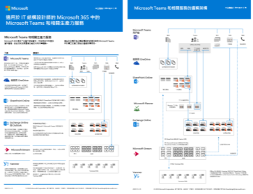
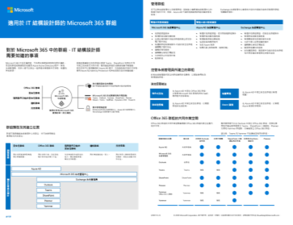

# Microsoft Cloud IT 架構資源

 **摘要：** 了解 Microsoft 身分識別、安全性、網路和混合式的核心雲架構概念。使用 Microsoft 雲端服務時，檢閱有關保護檔案、身分識別及裝置的規定建議。了解如何使用 Windows 10 和 Office 專業增強版部署現代和安全的桌面。
  
這些架構工具和海報可提供關於 Microsoft 雲端服務的資訊，包括 Office 365、Windows 10、Azure Active Directory、Microsoft Intune、Microsoft Dynamics 365、混合式內部部署與雲端解決方案。IT 決策者和結構設計師可以使用這些資源，決定其工作負載的理想解決方案，並決定核心基礎結構元件 (例如身分識別和安全性)。 
  
<!--**[Microsoft's Enterprise Cloud Roadmap](microsoft-cloud-it-architecture-resources.md#roadmap)** (Sway) -->
    
- **[Microsoft Cloud for Enterprise Architects 系列](microsoft-cloud-it-architecture-resources.md#cloudarch)** 
    <!-- [Microsoft Cloud Services and Platform Options](microsoft-cloud-it-architecture-resources.md#platformoptions) -->
    - [Microsoft cloud identity for enterprise architects](microsoft-cloud-it-architecture-resources.md#identity)
    - [Microsoft cloud security for enterprise architects](microsoft-cloud-it-architecture-resources.md#security)
    - [Microsoft cloud networking for enterprise architects](microsoft-cloud-it-architecture-resources.md#networking)
    - [Microsoft hybrid cloud for enterprise architects](microsoft-cloud-it-architecture-resources.md#hybrid)
    - [常見攻擊和保護您組織的 Microsoft 功能](#common-attacks-and-microsoft-capabilities-that-protect-your-organization)
    
- **[Microsoft 365 企業解決方案系列](microsoft-cloud-it-architecture-resources.md#BKMK_o365solutions)**：
    - [適用於 IT 結構設計師的 Microsoft 365 中的Microsoft Teams 和相關生產力服務](#microsoft-teams-and-related-productivity-services-in-microsoft-365-for-it-architects)
    - [適用於 IT 結構設計師的 Microsoft 365 中的群組](#groups-in-microsoft-365-for-it-architects)
    - [Office 365 的身分識別與裝置保護](microsoft-cloud-it-architecture-resources.md#BKMK_O365IDP)
    - [Office 365 的檔案保護解決方案](microsoft-cloud-it-architecture-resources.md#BKMK_O365fileprotect)
    - [GDPR 的 Office 365 資訊保護](#office-365-information-protection-for-gdpr)
    - [適用於政治活動、非營利組織和其他彈性組織的 Microsoft 安全性指南](#microsoft-security-guidance-for-political-campaigns-nonprofits-and-other-agile-organizations)
    - [Microsoft 電話語音解決方案](#microsoft-telephony-solutions) 
    - [使用 Microsoft 部署現代和安全的桌面](microsoft-cloud-it-architecture-resources.md#msd)
    

  
讓我們知道您的心得！請傳送電子郵件給我們：[cloudadopt@microsoft.com](mailto:cloudadopt@microsoft.com)。 

<!--

## Microsoft's Enterprise Cloud Roadmap

See the posters, icon sets, community venues, and other resources that describe the industry's most complete cloud solution.
  
|**Item**|**Description**|
|:-----|:-----|
|[          ](https://aka.ms/cloudarchitecture)   [Microsoft's Enterprise Cloud Roadmap](https://aka.ms/cloudarchitecture) (https://aka.ms/cloudarchitecture)   |Swipe through this Sway experience for the resources that describe the industry's most complete cloud solution.    |
-->
  

## Microsoft Cloud for Enterprise Architects s系列

這些雲端架構和海報可提供關於 Microsoft 雲端服務的資訊，包括 Office 365、Azure Active Directory、Microsoft Intune、Microsoft Dynamics CRM Online、混合式內部部署與雲端解決方案。IT 決策者和結構設計師可以使用這些資源，決定其工作負載的理想解決方案，並決定核心基礎結構元件 (例如身分識別和安全性)。

<!--  

### Microsoft Cloud Services and Platform Options

Learn key differences between Microsoft cloud services and platform offerings. Find the best fit for your solution.
  
|**Item**|**Description**|
|:-----|:-----|
|[          ](https://www.microsoft.com/download/details.aspx?id=54432)   [PDF](https://go.microsoft.com/fwlink/p/?LinkId=524731)  \| [Visio](https://go.microsoft.com/fwlink/p/?LinkId=524732)  \| [More languages](https://www.microsoft.com/download/details.aspx?id=54432)   | This model describes: <ul><li>  Software as a Service (SaaS) offerings, including Office 365 </li><li>  Platform as a Service (PaaS) features in Microsoft Azure </li><li>  Infrastructure as a Service (IaaS) features in Microsoft Azure </li><li>  Private cloud datacenter capabilities using Windows Server and System Center </li><li>  Learn how Microsoft's own IT department is migrating to these cloud services and building its hybrid cloud. </li></ul> |
-->

   

### Microsoft Cloud Identity for Enterprise Architects

IT 結構設計師在使用 Microsoft 雲端服務和平台設計組織的身分識別時，需要了解的資訊。
  
|**項目**|**描述**|
|:-----|:-----|
|[          ](https://www.microsoft.com/download/details.aspx?id=54431)   [PDF](https://go.microsoft.com/fwlink/p/?LinkId=524586)  \| [Visio](https://download.microsoft.com/download/2/3/8/238228E6-9017-4F6C-BD3C-5559E6708F82/MSFT_cloud_architecture_identity.vsd)           \| [更多語言](https://www.microsoft.com/download/details.aspx?id=54431)   | 此模型包含： <ul><li>使用 Microsoft 雲端識別簡介 </li><li>Azure AD 的 IDaaS 功能 </li><li>將內部部署的 Active Directory 網域服務帳戶，與 Microsoft Azure Active Directory 整合 </li><li>將目錄元件置入 Azure 中 </li><li>Azure IaaS 中工作負載的網域服務選項 </li></ul> |
   

### Microsoft cloud security for enterprise architects

IT 結構設計師在 Microsoft 雲端服務和平台中，需要瞭解哪些安全性資訊。
  
|**項目**|**描述**|
|:-----|:-----|
|[          ](https://www.microsoft.com/download/details.aspx?id=48121)   [PDF](https://go.microsoft.com/fwlink/p/?linkid=842070)  \| [Visio](https://go.microsoft.com/fwlink/p/?LinkId=842071)  \| [更多語言](https://www.microsoft.com/download/details.aspx?id=48121)   | 此模型包含： <ul><li>Microsoft 在提供安全服務與平台所扮演的角色</li><li>客戶對降低安全性風險的責任</li><li>重要的安全性認證 </li><li>Microsoft 諮詢服務所提供的安全性產品 </ul> |
   

### Microsoft cloud networking for enterprise architects

IT 結構設計師在使用 Microsoft 雲端服務和平台時，有關網路功能需要瞭解的資訊。
  
|**項目**|**描述**|
|:-----|:-----|
|[          ](https://www.microsoft.com/download/details.aspx?id=54425)   [PDF](https://go.microsoft.com/fwlink/p/?linkid=842073)  \| [Visio](https://go.microsoft.com/fwlink/p/?linkid=842074)           \| [文章](https://technet.microsoft.com/library/mt733214.aspx)  [更多語言](https://www.microsoft.com/download/details.aspx?id=54425)   | 此模型包含下列頁面︰ <ul><li> **針對雲端連線能力發展您的網路功能** 雲端移轉改變了公司網路內外部的流量大小與本質。它也會影響降低安全性風險的方法。</li><li> **Microsoft 雲端連線能力的共同元素** 將您的網路與 Microsoft 雲端整合，提供各種服務的最佳存取途徑。 </li><li> **適用於 Microsoft 雲端連線能力的 ExpressRoute** ExpressRoute 可提供連線至 Microsoft 雲端服務的隱私、專屬、高輸送量網路連線。 </li><li> **設計 Microsoft SaaS (Office 365、Microsoft Intune 和 Dynamics CRM Online) 的網路** 若要針對 Microsoft SaaS 服務最佳化您的網路，需要仔細分析您的網際網路邊緣、用戶端裝置以及一般 IT 作業。 </li><li> **設計 Azure PaaS 的網路** 若要針對 Azure PaaS 應用程式最佳化網路，必須具備充足的網際網路頻寬，且可能需要跨多個站台或應用程式分散網路流量。 </li><li> **設計 Azure IaaS 的網路** 逐步執行設計程序，用於主控伺服器架構 IT 工作負載 (包括子網路)，建立最佳 Azure 虛擬的網路 (VNet)、位址空間、路由、DNS、負載平衡，及與您在內部部署網路、其他 VNets 及網際網路的連線能力。 </li></ul>    |
   
   

### Microsoft hybrid cloud for enterprise architects

IT 結構設計師在使用 Microsoft 服務和平台時，有關混合雲端需要瞭解的資訊。
  
|**項目**|**描述**|
|:-----|:-----|
|[          ](https://www.microsoft.com/download/details.aspx?id=54424)   [PDF](https://go.microsoft.com/fwlink/p/?linkid=842082)  \| [Visio](https://go.microsoft.com/fwlink/p/?linkid=842083)           \| [文章](https://technet.microsoft.com/library/mt750500.aspx)  [更多語言](https://www.microsoft.com/download/details.aspx?id=54424)   | 此模型包含下列頁面︰ <ul><li> **混合雲端概觀** Microsoft 的雲端產品 (SaaS、Azure PaaS 和 Azure IaaS) 及其共同元素。 </li><li> **Microsoft 混合雲端結構的案例** Microsoft 雲端產品的混合雲端結構圖表，顯示內部部署基礎結構、網路和身分識別的共同層次。 </li><li> **Microsoft SaaS (Office 365) 混合雲端的案例** 商務用 Skype、SharePoint Server 和 Exchange Server 的 SaaS 混合案例結構，以及關鍵混合設定的說明。 </li><li> **Azure PaaS 混合雲端的案例** Azure PaaS 混合案例結構、附有範例的 Azure PaaS 混合應用程式說明，以及 SQL Server 2016 Stretch Database 的說明。 </li><li> **Azure IaaS 混合雲端的案例** Azure IaaS 混合案例結構，以及裝載在 Azure IaaS 中適用於企業營運 (LOB) 應用程式的說明。 </li></ul> |
   

### 常見攻擊和保護您組織的 Microsoft 功能
深入了解最常見的網路攻擊，以及 Microsoft 如何協助您的組織抵禦每個階段的攻擊。 

|**項目**|**描述**|
|:-----|:-----|
|   [PDF](http://download.microsoft.com/download/F/A/C/FACFC1E9-FA35-4DF1-943C-8D4237B4275B/MSFT_Cloud_architecture_security_commonattacks.pdf) \| [Visio](http://download.microsoft.com/download/F/A/C/FACFC1E9-FA35-4DF1-943C-8D4237B4275B/MSFT_Cloud_architecture_security_commonattacks.vsdx)   | 此海報說明常見的攻擊路徑，並描述哪些功能有助於在攻擊的每個階段阻止攻擊者。  |

<!--
### The Santa cloud

How Santa and his elves use Microsoft's cloud offerings to make their annual deliveries.
  
|**Item**|**Description**|
|:-----|:-----|
|   [View online](https://onedrive.live.com/?authkey=%21ANT1PMgxEdniCyY&cid=8A8EC4F6612625E0&id=8A8EC4F6612625E0%21440&parId=8A8EC4F6612625E0%21218&o=OneUp) \| [PDF](https://go.microsoft.com/fwlink/p/?linkid=842088)   |To determine who is naughty or nice and the presents to deliver on December 24, Santa Claus and his elfish IT department use Office 365, Azure, Dynamics 365, and Intune.   | -->
   

## Microsoft 365 企業解決方案系列

Microsoft 365 企業解決方案系列提供實作 Microsoft 365 功能的指引，尤其是跨多項技術的功能。

### 適用於 IT 結構設計師的 Microsoft 365 中的Microsoft Teams 和相關生產力服務
使用 Microsoft Teams 領導，Microsoft 365 中生產力服務的邏輯架構。

|**項目**|**描述**|
|:-----|:-----|
|   [PDF](downloads/msft-m365-teams-logical-architecture.pdf) \| [Visio](https://github.com/MicrosoftDocs/OfficeDocs-Enterprise/raw/live/Enterprise/downloads/msft-m365-teams-logical-architecture.vsdx)     |Microsoft 提供一套生產力服務，共同合作來提供資料管理、安全性和法規遵循功能的共同作業體驗。    這系列的圖例可為企業結構設計師提供生產力服務邏輯架構使用 Microsoft Teams 引導的檢視。|

### 適用於 IT 結構設計師的 Microsoft 365 中的群組
對於 Microsoft 365 中的群組，IT 結構設計師需要知道的事項

|**項目**|**描述**|
|:-----|:-----|
|   [PDF](downloads/msft-m365-groups.pdf) \| [Visio](https://github.com/MicrosoftDocs/OfficeDocs-Enterprise/raw/live/Enterprise/downloads/msft-m365-groups.vsdx) |這些圖例會詳細說明不同類型的群組、如何建立及管理群組，以及一些控管建議。|

   

### Office 365 的身分識別與裝置保護

推薦可用於保護身分識別和裝置的功能，其可存取 Office 365、其他 SaaS 服務，以及與 Azure AD 應用程式 Proxy 一起發佈的內部部署應用程式。
  
|**項目**|**描述**|
|:-----|:-----|
|[          ](https://www.microsoft.com/download/details.aspx?id=55032)   [PDF](https://go.microsoft.com/fwlink/p/?linkid=841656)  \| [Visio](https://go.microsoft.com/fwlink/p/?linkid=841657)  \| [更多語言](https://www.microsoft.com/download/details.aspx?id=55032)   |請務必在您的資料、身分識別和裝置之間，使用一致層級的保護。這份文件會顯示哪些功能在保護身分識別和裝置上有相當功能的詳細資訊。    |
   

### Office 365 的檔案保護解決方案

建議的功能，根據三個不同的敏感度層級保護 Office 365 中的檔案。
  
|**項目**|**描述**|
|:-----|:-----|
|[          ](https://www.microsoft.com/download/details.aspx?id=55523)   [PDF](https://go.microsoft.com/fwlink/?linkid=2004320)  \| [Visio](http://download.microsoft.com/download/7/8/9/789645A5-BD10-4541-BC33-F8D1EFF5E911/MSFT_cloud_architecture_O365%20file%20protection.vsdx)   |請務必在您的資料、身分識別和裝置之間，使用一致層級的保護。這份文件顯示有哪些可比較的功能，並詳細說明哪些功能可保護 Office 365 中的檔案。    |
   

### GDPR 的 Office 365 資訊保護

探索、分類、保護及監控個人資料的規範性建議。這個解決方案會使用一般資料保護規定 (GDPR) 做為範例，但您可以套用相同的程序，以遵守許多其他法規。

|**項目**|**說明**|
|:-----|:-----|
|    [PDF](http://download.microsoft.com/download/E/C/D/ECD5A339-EF10-4420-B3A9-99098884D716/MSFT_Cloud_architecture_information%20protection%20for%20GDPR.pdf) \| [Visio](http://download.microsoft.com/download/E/C/D/ECD5A339-EF10-4420-B3A9-99098884D716/MSFT_Cloud_architecture_information%20protection%20for%20GDPR.vsdx)    |若要以文章格式查看此內容，請參閱 [GDPR 的 Office 365 資訊保護](https://docs.microsoft.com/zh-TW/Office365/SecurityCompliance/office-365-information-protection-for-gdpr)。      |

### 適用於政治活動、非營利組織和其他彈性組織的 Microsoft 安全性指南 

此指南描述如何實作安全的雲端環境。任何組織都可以使用此解決方案指南。此解決方案指南為具有 BYOD 存取權和來賓帳戶的彈性組織提供額外的說明。您可以使用此指南作為起點，設計您自己的環境。

|**項目**|**描述**|
|:-----|:-----|
|**適用於政治活動的 Microsoft 安全性指南**      [PDF](http://download.microsoft.com/download/B/4/D/B4D520C3-4D0C-4B4D-BFB9-09F0651C2775/MSFT_Cloud_architecture_security%20for%20political%20campaigns.pdf)  \| [Visio](http://download.microsoft.com/download/B/4/D/B4D520C3-4D0C-4B4D-BFB9-09F0651C2775/MSFT_Cloud_architecture_security%20for%20political%20campaigns.vsdx)   |此指南以政治活動組織為例。您可以針對任何環境使用此指南作為起點。    |
|**適用於非營利組織的 Microsoft 安全性指南**   [          ](http://download.microsoft.com/download/9/4/3/94389612-C679-4061-8DF2-D9A15D72B65F/Microsoft_Cloud%20Architecture_Security%20for%20Nonprofits.pdf)   [PDF](http://download.microsoft.com/download/9/4/3/94389612-C679-4061-8DF2-D9A15D72B65F/Microsoft_Cloud%20Architecture_Security%20for%20Nonprofits.pdf)  \| [Visio](http://download.microsoft.com/download/9/4/3/94389612-C679-4061-8DF2-D9A15D72B65F/Microsoft_Cloud%20Architecture_Security%20for%20Nonprofits.vsdx)   |此指南已針對非營利組織稍做修改。 例如，它會參考 Office 365 非營利組織版方案。 其技術指導與政治活動解決方案指南相同。    |

此指南包含有測試實驗室指南。如需詳細資訊，請參閱[適用於政治活動、非營利組織和其他彈性組織的 Microsoft 安全性指南](https://docs.microsoft.com/zh-TW/Office365/SecurityCompliance/microsoft-security-guidance-for-political-campaigns-nonprofits-and-other-agile-o)。

### Microsoft 電話語音解決方案

當您開始加入 Microsoft 雲端中的 Teams，Microsoft 支援數個選項。此海報協助您決定哪個 Microsoft 電話語音解決方案 (雲端的電話系統或內部部署的 Enterprise Voice) 適合您組織中的使用者，以及您的組織如何連線至公用交換電話網路 (PSTN)。

  
[PDF](https://github.com/MicrosoftDocs/OfficeDocs-SkypeForBusiness/blob/live/Teams/downloads/telephony-solutions/microsoft-telephony-solutions-12-18.pdf) | [Visio](https://github.com/MicrosoftDocs/OfficeDocs-SkypeForBusiness/blob/live/Teams/downloads/telephony-solutions/microsoft-telephony-solutions-12-18.vsdx) 

如需詳細資訊，請參閱此海報的文章：[Microsoft 電話語音解決方案](https://docs.microsoft.com/zh-TW/SkypeForBusiness/hybrid/msft-telephony-solutions)。
  

### 使用 Microsoft 部署現代和安全的桌面

IT 結構設計師需要了解的關於在 Windows 10 上部署和管理 Office 365 專業增強版的更新。
  
|**項目**|**描述**|
|:-----|:-----|
|[          ](https://www.microsoft.com/download/details.aspx?id=55987)   [PDF](http://download.microsoft.com/download/4/E/9/4E90E227-770A-41D1-99FE-925A64D81A55/MSFT_modern_secure_desktop.pdf)  \| [Visio](http://download.microsoft.com/download/4/E/9/4E90E227-770A-41D1-99FE-925A64D81A55/MSFT_modern_secure_desktop.vsdx)   | 此模型包含： <ul><li>  從 Microsoft Cloud 部署 Windows 10 和 Office ProPlus </li><li>  使用 System Center Configuration Manager 部署 Windows 10 和 Office ProPlus </li><li>  從 Microsoft Cloud 管理 Windows 10 和 Office ProPlus 的更新 </li><li>  使用 System Center Configuration Manager 管理 Windows 10 和 Office ProPlus 的更新 </li><li>  Windows 10 立即可用和額外的保護功能 </li></ul>  |
   
## 另請參閱

[適用於 SharePoint、Exchange、商務用 Skype 和 Lync 的架構模型](architectural-models-for-sharepoint-exchange-skype-for-business-and-lync.md)
  
[雲端採用測試實驗室指南 (TLG)](cloud-adoption-test-lab-guides-tlgs.md)
  
[安全性解決方案](security-solutions.md)
  
[混合式解決方案](hybrid-solutions.md)

