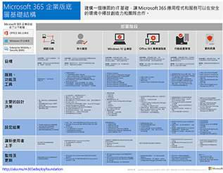
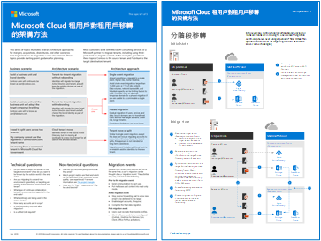

# Microsoft Cloud IT 架構資源Microsoft cloud IT architecture resources

這些架構工具和海報提供 Microsoft 雲端服務的相關資訊，包括 Microsoft 365、Windows 10、Azure Active Directory、Microsoft Intune、Microsoft Dynamics 365，以及混合式內部部署和雲端解決方案。These architecture tools and posters give you information about Microsoft cloud services, including Microsoft 365, Windows 10, Azure Active Directory, Microsoft Intune, Microsoft Dynamics 365, and hybrid on-premises and cloud solutions. IT 決策者和結構設計師可以使用這些資源，決定其工作負載的理想解決方案，並決定核心基礎結構元件 (例如身分識別和安全性)。IT decision makers and architects can use these resources to determine the ideal solutions for their workloads and to make decisions about core infrastructure components such as identity and security. 
  
<!--**[Microsoft's Enterprise Cloud Roadmap](microsoft-cloud-it-architecture-resources.md#roadmap)** (Sway) -->
    
- **[Microsoft Cloud for Enterprise Architects 系列](microsoft-cloud-it-architecture-resources.md#cloudarch)** 
    **[Microsoft cloud for enterprise architects series](microsoft-cloud-it-architecture-resources.md#cloudarch)** 
  <!-- [Microsoft Cloud Services and Platform Options](microsoft-cloud-it-architecture-resources.md#platformoptions) -->
    - [Microsoft cloud identity for enterprise architectsMicrosoft cloud identity for enterprise architects](microsoft-cloud-it-architecture-resources.md#identity)
    - [Microsoft cloud security for enterprise architectsMicrosoft cloud security for enterprise architects](microsoft-cloud-it-architecture-resources.md#security)
    - [Microsoft cloud networking for enterprise architectsMicrosoft cloud networking for enterprise architects](microsoft-cloud-it-architecture-resources.md#networking)
    - [Microsoft hybrid cloud for enterprise architectsMicrosoft hybrid cloud for enterprise architects](microsoft-cloud-it-architecture-resources.md#hybrid)
    - [常見攻擊和保護您組織的 Microsoft 功能Common attacks and Microsoft capabilities that protect your organization](#common-attacks-and-microsoft-capabilities-that-protect-your-organization)
    - [Microsoft 365 企業版底層基礎結構Microsoft 365 Enterprise Foundation Infrastructure](#m365foundationinfra)
    - [Microsoft Cloud 租用戶對租用戶移轉的架構方法Architecture approaches for Microsoft cloud tenant-to-tenant migrations](#architecture-approaches-for-microsoft-cloud-tenant-to-tenant-migrations)
    
- **[Microsoft 365 企業解決方案系列](microsoft-cloud-it-architecture-resources.md#BKMK_o365solutions)**：**[Microsoft 365 enterprise solution series](microsoft-cloud-it-architecture-resources.md#BKMK_o365solutions)**:
    - [適用於 IT 結構設計師的 Microsoft 365 中的Microsoft Teams 和相關生產力服務Microsoft Teams and related productivity services in Microsoft 365 for IT architects](#microsoft-teams-and-related-productivity-services-in-microsoft-365-for-it-architects)
    - [適用於 IT 結構設計師的 Microsoft 365 中的群組Groups in Microsoft 365 for IT architects](#groups-in-microsoft-365-for-it-architects)
    - [適用於多區域組織的安全性與資訊保護Security and Information Protection for Multi-Region Organizations](#security-and-information-protection-for-multi-region-organizations)
    - [Office 365 的身分識別與裝置保護Identity and device protection for Office 365](microsoft-cloud-it-architecture-resources.md#BKMK_O365IDP)
    - [Office 365 的檔案保護解決方案File protection solutions in Office 365](microsoft-cloud-it-architecture-resources.md#BKMK_O365fileprotect)
    - [GDPR 的 Office 365 資訊保護Office 365 Information Protection for GDPR](#office-365-information-protection-for-gdpr)
    - [適用於政治活動、非營利組織和其他彈性組織的 Microsoft 安全性指南Microsoft Security Guidance for Political Campaigns, Nonprofits, and Other Agile Organizations](#microsoft-security-guidance-for-political-campaigns-nonprofits-and-other-agile-organizations)
    - [Microsoft 電話語音解決方案Microsoft Telephony Solutions](#microsoft-telephony-solutions) 
    
Let us know what you think!Let us know what you think! Send us email at [cloudadopt@microsoft.com](mailto:cloudadopt@microsoft.com).Send us email at [cloudadopt@microsoft.com](mailto:cloudadopt@microsoft.com). 

<!--

## Microsoft's Enterprise Cloud Roadmap

See the posters, icon sets, community venues, and other resources that describe the industry's most complete cloud solution.
  
|**Item**|**Description**|
|:-----|:-----|
|[          ](https://aka.ms/cloudarchitecture)   [Microsoft's Enterprise Cloud Roadmap](https://aka.ms/cloudarchitecture) (https://aka.ms/cloudarchitecture)   |Swipe through this Sway experience for the resources that describe the industry's most complete cloud solution.    |
-->
  

##Microsoft Cloud for Enterprise Architects s系列## Microsoft cloud for enterprise architects series

這些雲端架構海報提供 Microsoft 雲端服務的相關資訊，包括 Microsoft 365、Azure Active Directory、Microsoft Intune、Microsoft Dynamics CRM Online 和混合式內部部署和雲端解決方案。These cloud architecture posters give you information about Microsoft cloud services, including Microsoft 365, Azure Active Directory, Microsoft Intune, Microsoft Dynamics CRM Online, and hybrid on-premises and cloud solutions. IT 決策者和結構設計師可以使用這些資源，決定其工作負載的理想解決方案，並決定核心基礎結構元件 (例如身分識別和安全性)。IT decision makers and architects can use these resources to determine the ideal solutions for their workloads and to make decisions about core infrastructure components such as identity and security.

<!--  

### Microsoft Cloud Services and Platform Options

Learn key differences between Microsoft cloud services and platform offerings. Find the best fit for your solution.
  
|**Item**|**Description**|
|:-----|:-----|
|[          ](https://www.microsoft.com/download/details.aspx?id=54432)   [PDF](https://go.microsoft.com/fwlink/p/?LinkId=524731)  \| [Visio](https://go.microsoft.com/fwlink/p/?LinkId=524732)  \| [More languages](https://www.microsoft.com/download/details.aspx?id=54432)   | This model describes: <ul><li>  Software as a Service (SaaS) offerings, including Microsoft 365 </li><li>  Platform as a Service (PaaS) features in Microsoft Azure </li><li>  Infrastructure as a Service (IaaS) features in Microsoft Azure </li><li>  Private cloud datacenter capabilities using Windows Server and System Center </li><li>  Learn how Microsoft's own IT department is migrating to these cloud services and building its hybrid cloud. </li></ul> |
-->

   

###Microsoft Cloud Identity for Enterprise Architects### Microsoft cloud identity for enterprise architects

IT 結構設計師在使用 Microsoft 雲端服務和平台設計組織的身分識別時，需要了解的資訊。What IT architects need to know about designing identity for organizations using Microsoft cloud services and platforms.
  
|**項目****Item**|**描述****Description**|
|:-----|:-----|
|[          ](https://www.microsoft.com/download/details.aspx?id=54431)[          ](https://www.microsoft.com/download/details.aspx?id=54431)   [PDF](https://go.microsoft.com/fwlink/p/?LinkId=524586)  \| [Visio](https://download.microsoft.com/download/2/3/8/238228E6-9017-4F6C-BD3C-5559E6708F82/MSFT_cloud_architecture_identity.vsd)           \| [更多語言](https://www.microsoft.com/download/details.aspx?id=54431)[PDF](https://go.microsoft.com/fwlink/p/?LinkId=524586)  \| [Visio](https://download.microsoft.com/download/2/3/8/238228E6-9017-4F6C-BD3C-5559E6708F82/MSFT_cloud_architecture_identity.vsd)           \| [More languages](https://www.microsoft.com/download/details.aspx?id=54431)   | 此模型包含：This model contains: <ul><li>使用 Microsoft 雲端識別的簡介Introduction to identity with Microsoft's cloud </li><li>Azure AD 的 IDaaS 功能Azure AD IDaaS capabilities </li><li>將內部部署的 Active Directory 網域服務帳戶，與 Microsoft Azure Active Directory 整合Integrating on-premises Active Directory Domain Services accounts with Microsoft Azure Active Directory </li><li>將目錄元件置入 Azure 中Putting directory components in Azure </li><li>Azure IaaS 中工作負載的網域服務選項Domain services options for workloads in Azure IaaS </li></ul> |
   

### Microsoft cloud security for enterprise architectsMicrosoft cloud security for enterprise architects

IT 結構設計師在 Microsoft 雲端服務和平台中，需要瞭解哪些安全性資訊。What IT architects need to know about security in Microsoft cloud services and platforms.
  
|**項目****Item**|**描述****Description**|
|:-----|:-----|
|[          ](https://www.microsoft.com/download/details.aspx?id=48121)[          ](https://www.microsoft.com/download/details.aspx?id=48121)   [PDF](https://go.microsoft.com/fwlink/p/?linkid=842070)  \| [Visio](https://go.microsoft.com/fwlink/p/?LinkId=842071)  \| [更多語言](https://www.microsoft.com/download/details.aspx?id=48121)[PDF](https://go.microsoft.com/fwlink/p/?linkid=842070)  \| [Visio](https://go.microsoft.com/fwlink/p/?LinkId=842071)  \| [More languages](https://www.microsoft.com/download/details.aspx?id=48121)   | 此模型包含：This model contains: <ul><li>Microsoft 在提供安全服務與平台所扮演的角色Microsoft's role in providing secure services and platforms</li><li>客戶對降低安全性風險的責任Customer responsibilities to mitigate security risks</li><li>重要的安全性認證Top security certifications </li><li>Microsoft 諮詢服務所提供的安全性產品Security offerings provided by Microsoft consulting services </ul> |
   

### Microsoft cloud networking for enterprise architectsMicrosoft cloud networking for enterprise architects

IT 結構設計師在使用 Microsoft 雲端服務和平台時，有關網路功能需要瞭解的資訊。What IT architects need to know about networking for Microsoft cloud services and platforms.
  
|**項目****Item**|**描述****Description**|
|:-----|:-----|
|   [PDF](media/Network-Poster/MSFT_cloud_architecture_networking.pdf)  \| [Visio](https://github.com/MicrosoftDocs/OfficeDocs-Enterprise/raw/live/Enterprise/media/Network-Poster/MSFT_cloud_architecture_networking.vsdx)[PDF](media/Network-Poster/MSFT_cloud_architecture_networking.pdf)  \| [Visio](https://github.com/MicrosoftDocs/OfficeDocs-Enterprise/raw/live/Enterprise/media/Network-Poster/MSFT_cloud_architecture_networking.vsdx)   | 此模型包含：This model contains: <ul><li> 將您的網路提升為雲端連線網路Evolving your network for cloud connectivity </li><li> Microsoft 雲端連線的共同項目Common elements of Microsoft cloud connectivity </li><li> Microsoft 雲端連線的 ExpressRouteExpressRoute for Microsoft cloud connectivity </li><li> 設計 Microsoft SaaS、Azure PaaS 和 Azure IaaS 的網路Designing networking for Microsoft SaaS, Azure PaaS, and  Azure IaaS </li></ul>    |

### Microsoft hybrid cloud for enterprise architectsMicrosoft hybrid cloud for enterprise architects

IT 結構設計師在使用 Microsoft 服務和平台時，有關混合雲端需要瞭解的資訊。What IT architects need to know about hybrid cloud for Microsoft services and platforms.
  
|**項目****Item**|**描述****Description**|
|:-----|:-----|
|   [PDF](media/Hybrid-Poster/MSFT_cloud_architecture_hybrid.pdf)  \| [Visio](https://github.com/MicrosoftDocs/OfficeDocs-Enterprise/raw/live/Enterprise/media/Hybrid-Poster/MSFT_cloud_architecture_hybrid.vsdx)[PDF](media/Hybrid-Poster/MSFT_cloud_architecture_hybrid.pdf)  \| [Visio](https://github.com/MicrosoftDocs/OfficeDocs-Enterprise/raw/live/Enterprise/media/Hybrid-Poster/MSFT_cloud_architecture_hybrid.vsdx)  | 此模型包含：This model contains: <ul><li> Microsoft 的雲端產品 (SaaS、Azure PaaS 和 Azure IaaS) 及其共同元素Microsoft's cloud offerings (SaaS, Azure PaaS, and Azure IaaS) and their common elements </li><li> Microsoft 雲端服務的混合式雲端架構Hybrid cloud architecture for Microsoft's cloud offerings </li><li> Microsoft SaaS （Microsoft 365）、Azure PaaS 和 Azure 的混合式雲端案例 IaaSHybrid cloud scenarios for Microsoft SaaS (Microsoft 365), Azure PaaS, and Azure IaaS </li></ul> |
   

### 常見攻擊和保護您組織的 Microsoft 功能Common attacks and Microsoft capabilities that protect your organization
深入了解最常見的網路攻擊，以及 Microsoft 如何協助您的組織抵禦每個階段的攻擊。Learn about the most common cyber attacks and how Microsoft can help your organization at every stage of an attack. 

|**項目****Item**|**描述****Description**|
|:-----|:-----|
|   [PDF](https://download.microsoft.com/download/F/A/C/FACFC1E9-FA35-4DF1-943C-8D4237B4275B/MSFT_Cloud_architecture_security_commonattacks.pdf) \| [Visio](https://download.microsoft.com/download/F/A/C/FACFC1E9-FA35-4DF1-943C-8D4237B4275B/MSFT_Cloud_architecture_security_commonattacks.vsdx)[PDF](https://download.microsoft.com/download/F/A/C/FACFC1E9-FA35-4DF1-943C-8D4237B4275B/MSFT_Cloud_architecture_security_commonattacks.pdf) \| [Visio](https://download.microsoft.com/download/F/A/C/FACFC1E9-FA35-4DF1-943C-8D4237B4275B/MSFT_Cloud_architecture_security_commonattacks.vsdx)   | 此海報說明常見的攻擊路徑，並描述哪些功能有助於在攻擊的每個階段阻止攻擊者。This poster illustrates the path of common attacks and describes which capabilities help stop attackers at each stage of an attack.  |

### Microsoft 365 企業版底層基礎結構Microsoft 365 Enterprise Foundation Infrastructure

快速檢視 Microsoft 365 企業版的[底層基礎結構](https://docs.microsoft.com/microsoft-365/enterprise/deploy-foundation-infrastructure)以開始部署。Get an at-a-glance view of the [foundation infrastructure](https://docs.microsoft.com/microsoft-365/enterprise/deploy-foundation-infrastructure) for Microsoft 365 Enterprise to begin your deployment.
  
|**項目****Item**|**描述****Description**|
|:-----|:-----|
|   [線上檢視](https://aka.ms/m365efoundinfraposter) \| [PDF](https://github.com/MicrosoftDocs/microsoft-365-docs/raw/public/microsoft-365/media/deploy-foundation-infrastructure/Microsoft365EnterpriseFoundInfra.pdf)[View online](https://aka.ms/m365efoundinfraposter) \| [PDF](https://github.com/MicrosoftDocs/microsoft-365-docs/raw/public/microsoft-365/media/deploy-foundation-infrastructure/Microsoft365EnterpriseFoundInfra.pdf)   | 此海報針對目標、功能和工具、設計決策、設定結果、上架，以及持續監視和更新，摘要說明底層基礎結構的每個階段。This poster summarizes each phase of the foundation infrastructure in terms of goals, features and tools, design decisions, configuration results, onboarding, and ongoing monitoring and updates.  | 

### Microsoft Cloud 租用戶對租用戶移轉的架構方法Architecture approaches for Microsoft cloud tenant-to-tenant migrations 
此系列的主題說明針對合併、併購、分割和其他案例下，可能會導致您移轉到新雲端租用戶的數個架構方法。This series of topics illustrates several architecture approaches for mergers, acquisitions, divestitures, and other scenarios that might lead you to migrate to a new cloud tenant. 這些主題提供進行規劃的起點指導。These topics provide starting-point guidance for planning.

|**Item****Item**|**描述****Description**|
|:-----|:-----|
|   [PDF](downloads/Microsoft-365-tenant-to-tenant-migration.pdf) \| [Visio](https://github.com/MicrosoftDocs/OfficeDocs-Enterprise/raw/live/Enterprise/downloads/Microsoft-365-tenant-to-tenant-migration.vsdx)[PDF](downloads/Microsoft-365-tenant-to-tenant-migration.pdf) \| [Visio](https://github.com/MicrosoftDocs/OfficeDocs-Enterprise/raw/live/Enterprise/downloads/Microsoft-365-tenant-to-tenant-migration.vsdx)     |此模型包含：This model contains: <ul><li>商務案例與架構方法的對應A mapping of business scenarios to architecture approaches</li><li>設計考量Design considerations</li><li>單一事件移轉流程Single event migration flow</li><li>分階段移轉流程Phased migration flow</li><li>租用戶移動或分割流程Tenant move or split flow</li></ul>|

## Microsoft 365 企業解決方案系列Microsoft 365 enterprise solution series

Microsoft 365 企業解決方案系列提供實作 Microsoft 365 功能的指引，尤其是跨多項技術的功能。The Microsoft 365 enterprise solution series provides guidance for implementing Microsoft 365 capabilities, especially where capabilities cross technologies.

### 適用於 IT 結構設計師的 Microsoft 365 中的Microsoft Teams 和相關生產力服務Microsoft Teams and related productivity services in Microsoft 365 for IT architects
使用 Microsoft Teams 領導，Microsoft 365 中生產力服務的邏輯架構。The logical architecture of productivity services in Microsoft 365, leading with Microsoft Teams.

|**項目****Item**|**描述****Description**|
|:-----|:-----|
|   [PDF](downloads/msft-m365-teams-logical-architecture.pdf) \| [Visio](https://github.com/MicrosoftDocs/OfficeDocs-Enterprise/raw/live/Enterprise/downloads/msft-m365-teams-logical-architecture.vsdx)[PDF](downloads/msft-m365-teams-logical-architecture.pdf) \| [Visio](https://github.com/MicrosoftDocs/OfficeDocs-Enterprise/raw/live/Enterprise/downloads/msft-m365-teams-logical-architecture.vsdx)     |Microsoft 提供一套生產力服務，共同合作來提供資料管理、安全性和法規遵循功能的共同作業體驗。Microsoft provides a suite of productivity services that work together to provide collaboration experiences with data governance, security, and compliance capabilities.    這系列的圖例可為企業結構設計師提供生產力服務邏輯架構使用 Microsoft Teams 引導的檢視。This series of illustrations provides a view into the logical architecture of productivity services for enterprise architects, leading with Microsoft Teams.|

### 適用於 IT 結構設計師的 Microsoft 365 中的群組Groups in Microsoft 365 for IT Architects
對於 Microsoft 365 中的群組，IT 結構設計師需要知道的事項What IT architects need to know about groups in Microsoft 365

|**項目****Item**|**描述****Description**|
|:-----|:-----|
|   [PDF](downloads/msft-m365-groups.pdf) \| [Visio](https://github.com/MicrosoftDocs/OfficeDocs-Enterprise/raw/live/Enterprise/downloads/msft-m365-groups.vsdx)[PDF](downloads/msft-m365-groups.pdf) \| [Visio](https://github.com/MicrosoftDocs/OfficeDocs-Enterprise/raw/live/Enterprise/downloads/msft-m365-groups.vsdx) |這些圖例會詳細說明不同類型的群組、如何建立及管理群組，以及一些控管建議。These illustrations detail the different types of groups, how these are created and managed, and a few governance recommendations.|

### 適用於多區域組織的安全性與資訊保護Security and Information Protection for Multi-Region Organizations
適用於多區域組織，且具有單一 Microsoft 365 租用戶的安全性與資訊保護Security and information protection for multi-region organizations with a single microsoft 365 tenant

|**項目****Item**|**描述****Description**|
|:-----|:-----|
|   [PDF](https://github.com/MicrosoftDocs/microsoft-365-docs/raw/public/microsoft-365/downloads/msft-security-info-protect-multi-region.pdf) \| [Visio](https://github.com/MicrosoftDocs/microsoft-365-docs/raw/public/microsoft-365/downloads/msft-security-info-protect-multi-region.vsdx)[PDF](https://github.com/MicrosoftDocs/microsoft-365-docs/raw/public/microsoft-365/downloads/msft-security-info-protect-multi-region.pdf) \| [Visio](https://github.com/MicrosoftDocs/microsoft-365-docs/raw/public/microsoft-365/downloads/msft-security-info-protect-multi-region.vsdx) |基於多種原因，為您的全球組織使用單一 Microsoft 365 租用戶是最佳選擇和最佳體驗。Using a single Microsoft 365 tenant for your global organization is the best choice and experience for many reasons. 不過，許多架構設計人員為達到不同地區的安全性與資訊保護目標，面臨許多掙扎。However, many architects wrestle with how to meet security and information protection objectives across different regions. 本主題提供許多建議。This set of topics provides recommendations. |

   

### Office 365 的身分識別與裝置保護Identity and device protection for Office 365

推薦可用於保護身分識別和裝置的功能，其可存取 Office 365、其他 SaaS 服務，以及與 Azure AD 應用程式 Proxy 一起發佈的內部部署應用程式。Recommended capabilities for protecting identities and devices that access Office 365, other SaaS services, and on-premises applications published with Azure AD Application Proxy.
  
|**項目****Item**|**描述****Description**|
|:-----|:-----|
|[          ](https://www.microsoft.com/download/details.aspx?id=55032)[          ](https://www.microsoft.com/download/details.aspx?id=55032)   [PDF](https://go.microsoft.com/fwlink/p/?linkid=841656)  \| [Visio](https://go.microsoft.com/fwlink/p/?linkid=841657)  \| [更多語言](https://www.microsoft.com/download/details.aspx?id=55032)[PDF](https://go.microsoft.com/fwlink/p/?linkid=841656)  \| [Visio](https://go.microsoft.com/fwlink/p/?linkid=841657)  \| [More languages](https://www.microsoft.com/download/details.aspx?id=55032)   |It's important to use consistent levels of protection across your data, identities, and devices.It's important to use consistent levels of protection across your data, identities, and devices. This document shows you which capabilities are comparable with more information on capabilities to protect identities and devices.This document shows you which capabilities are comparable with more information on capabilities to protect identities and devices.    |
   

### Office 365 的檔案保護解決方案File protection solutions in Office 365

建議的功能，根據三個不同的敏感度層級保護 Office 365 中的檔案。Recommended capabilities for protecting files in Office 365 based on three different sensitivity levels.
  
|**項目****Item**|**描述****Description**|
|:-----|:-----|
|[          ](https://www.microsoft.com/download/details.aspx?id=55523)[          ](https://www.microsoft.com/download/details.aspx?id=55523)   [PDF](https://go.microsoft.com/fwlink/?linkid=2004320)  \| [Visio](https://download.microsoft.com/download/7/8/9/789645A5-BD10-4541-BC33-F8D1EFF5E911/MSFT_cloud_architecture_O365%20file%20protection.vsdx)[PDF](https://go.microsoft.com/fwlink/?linkid=2004320)  \| [Visio](https://download.microsoft.com/download/7/8/9/789645A5-BD10-4541-BC33-F8D1EFF5E911/MSFT_cloud_architecture_O365%20file%20protection.vsdx)   |It's important to use consistent levels of protection across your data, identities, and devices.It's important to use consistent levels of protection across your data, identities, and devices. This document shows you which capabilities are comparable with more information on capabilities to protect files in Office 365.This document shows you which capabilities are comparable with more information on capabilities to protect files in Office 365.    |
   

### GDPR 的 Office 365 資訊保護Office 365 Information Protection for GDPR

Prescriptive recommendations for discovering, classifying, protecting, and monitoring personal data.Prescriptive recommendations for discovering, classifying, protecting, and monitoring personal data. This solution uses General Data Protection Regulation (GDPR) as an example, but you can apply the same process to achieve compliance with many other regulations.This solution uses General Data Protection Regulation (GDPR) as an example, but you can apply the same process to achieve compliance with many other regulations.

|**項目****Item**|**說明****Description**|
|:-----|:-----|
|    [PDF](https://download.microsoft.com/download/E/C/D/ECD5A339-EF10-4420-B3A9-99098884D716/MSFT_Cloud_architecture_information%20protection%20for%20GDPR.pdf) \| [Visio](https://download.microsoft.com/download/E/C/D/ECD5A339-EF10-4420-B3A9-99098884D716/MSFT_Cloud_architecture_information%20protection%20for%20GDPR.vsdx)[PDF](https://download.microsoft.com/download/E/C/D/ECD5A339-EF10-4420-B3A9-99098884D716/MSFT_Cloud_architecture_information%20protection%20for%20GDPR.pdf) \| [Visio](https://download.microsoft.com/download/E/C/D/ECD5A339-EF10-4420-B3A9-99098884D716/MSFT_Cloud_architecture_information%20protection%20for%20GDPR.vsdx)    |若要以文章格式查看此內容，請參閱 [GDPR 的 Office 365 資訊保護](https://docs.microsoft.com/Office365/SecurityCompliance/office-365-information-protection-for-gdpr)。To see this content in article format, see [Office 365 Information Protection for GDPR](https://docs.microsoft.com/Office365/SecurityCompliance/office-365-information-protection-for-gdpr).      |

### 適用於政治活動、非營利組織和其他彈性組織的 Microsoft 安全性指南Microsoft Security Guidance for Political Campaigns, Nonprofits, and Other Agile Organizations 

This guidance describes how to implement a secure cloud environment.This guidance describes how to implement a secure cloud environment. The solution guidance can be used by any organization.The solution guidance can be used by any organization. It includes extra help for agile organizations with BYOD access and guest accounts.It includes extra help for agile organizations with BYOD access and guest accounts. You can use this guidance as a starting-point for designing your own environment.You can use this guidance as a starting-point for designing your own environment.

|**項目****Item**|**描述****Description**|
|:-----|:-----|
|**適用於政治活動的 Microsoft 安全性指南****Microsoft Security Guidance for Political Campaigns**   [          ](https://download.microsoft.com/download/B/4/D/B4D520C3-4D0C-4B4D-BFB9-09F0651C2775/MSFT_Cloud_architecture_security%20for%20political%20campaigns.pdf)   [PDF](https://download.microsoft.com/download/B/4/D/B4D520C3-4D0C-4B4D-BFB9-09F0651C2775/MSFT_Cloud_architecture_security%20for%20political%20campaigns.pdf)  \| [Visio](https://download.microsoft.com/download/B/4/D/B4D520C3-4D0C-4B4D-BFB9-09F0651C2775/MSFT_Cloud_architecture_security%20for%20political%20campaigns.vsdx)[PDF](https://download.microsoft.com/download/B/4/D/B4D520C3-4D0C-4B4D-BFB9-09F0651C2775/MSFT_Cloud_architecture_security%20for%20political%20campaigns.pdf)  \| [Visio](https://download.microsoft.com/download/B/4/D/B4D520C3-4D0C-4B4D-BFB9-09F0651C2775/MSFT_Cloud_architecture_security%20for%20political%20campaigns.vsdx)   |This guidance uses a political campaign organization as an example.This guidance uses a political campaign organization as an example. Use this guidance as a starting point for any environment.Use this guidance as a starting point for any environment.    |
|**適用於非營利組織的 Microsoft 安全性指南****Microsoft Security Guidance for Nonprofits**   [          ](https://download.microsoft.com/download/9/4/3/94389612-C679-4061-8DF2-D9A15D72B65F/Microsoft_Cloud%20Architecture_Security%20for%20Nonprofits.pdf)[          ](https://download.microsoft.com/download/9/4/3/94389612-C679-4061-8DF2-D9A15D72B65F/Microsoft_Cloud%20Architecture_Security%20for%20Nonprofits.pdf)   [PDF](https://download.microsoft.com/download/9/4/3/94389612-C679-4061-8DF2-D9A15D72B65F/Microsoft_Cloud%20Architecture_Security%20for%20Nonprofits.pdf)  \| [Visio](https://download.microsoft.com/download/9/4/3/94389612-C679-4061-8DF2-D9A15D72B65F/Microsoft_Cloud%20Architecture_Security%20for%20Nonprofits.vsdx)[PDF](https://download.microsoft.com/download/9/4/3/94389612-C679-4061-8DF2-D9A15D72B65F/Microsoft_Cloud%20Architecture_Security%20for%20Nonprofits.pdf)  \| [Visio](https://download.microsoft.com/download/9/4/3/94389612-C679-4061-8DF2-D9A15D72B65F/Microsoft_Cloud%20Architecture_Security%20for%20Nonprofits.vsdx)   |This guide is slightly revised for nonprofit organizations.This guide is slightly revised for nonprofit organizations. For example, it references Office 365 Nonprofit plans.For example, it references Office 365 Nonprofit plans. The technical guidance is the same as the political campaign solution guide.The technical guidance is the same as the political campaign solution guide.    |

This guidance includes Test Lab Guides.This guidance includes Test Lab Guides. For more information, see [Microsoft Security Guidance for Political Campaigns, Nonprofits, and Other Agile Organizations](https://docs.microsoft.com/Office365/SecurityCompliance/microsoft-security-guidance-for-political-campaigns-nonprofits-and-other-agile-o).For more information, see [Microsoft Security Guidance for Political Campaigns, Nonprofits, and Other Agile Organizations](https://docs.microsoft.com/Office365/SecurityCompliance/microsoft-security-guidance-for-political-campaigns-nonprofits-and-other-agile-o).

### Microsoft 電話語音解決方案Microsoft Telephony Solutions

Microsoft supports several options as you begin your journey to Teams in the Microsoft cloud.Microsoft supports several options as you begin your journey to Teams in the Microsoft cloud. This poster helps you decide which Microsoft telephony solution (Phone System in the cloud or Enterprise Voice on-premises) is right for users in your organization, and how your organization can connect to the Public Switched Telephone Network (PSTN).This poster helps you decide which Microsoft telephony solution (Phone System in the cloud or Enterprise Voice on-premises) is right for users in your organization, and how your organization can connect to the Public Switched Telephone Network (PSTN).

  
[PDF](https://github.com/MicrosoftDocs/OfficeDocs-SkypeForBusiness/blob/live/Teams/downloads/telephony-solutions/microsoft-telephony-solutions-12-18.pdf) | [Visio](https://github.com/MicrosoftDocs/OfficeDocs-SkypeForBusiness/blob/live/Teams/downloads/telephony-solutions/microsoft-telephony-solutions-12-18.vsdx)[PDF](https://github.com/MicrosoftDocs/OfficeDocs-SkypeForBusiness/blob/live/Teams/downloads/telephony-solutions/microsoft-telephony-solutions-12-18.pdf) | [Visio](https://github.com/MicrosoftDocs/OfficeDocs-SkypeForBusiness/blob/live/Teams/downloads/telephony-solutions/microsoft-telephony-solutions-12-18.vsdx) 

如需詳細資訊，請參閱此海報的文章：[Microsoft 電話語音解決方案](https://docs.microsoft.com/SkypeForBusiness/hybrid/msft-telephony-solutions)。For more information, see the article for this poster: [Microsoft Telephony Solutions](https://docs.microsoft.com/SkypeForBusiness/hybrid/msft-telephony-solutions).
  
## 另請參閱See Also

[適用於 SharePoint、Exchange、商務用 Skype 和 Lync 的架構模型Architectural models for SharePoint, Exchange, Skype for Business, and Lync](architectural-models-for-sharepoint-exchange-skype-for-business-and-lync.md)
  
[企業用 Microsoft 365 測試實驗室指南Microsoft 365 for enterprise Test Lab Guides](https://docs.microsoft.com/microsoft-365/enterprise/m365-enterprise-test-lab-guides)
  
[混合式解決方案Hybrid solutions](hybrid-solutions.md)

