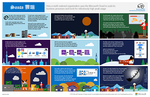
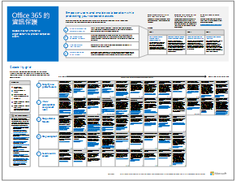
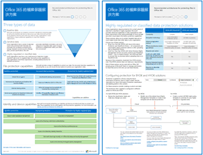
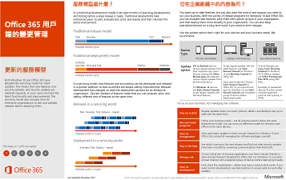

# Microsoft Cloud IT 架構資源Microsoft Cloud IT architecture resources

 **摘要：**深入了解 Microsoft 雲端服務和平台。檢閱我們的企業雲端藍圖，探索我們的雲端架構系列，以及更多選擇。**Summary:** Learn about Microsoft cloud services and platforms. Review our enterprise cloud roadmap, explore our cloud architecture series, and more.
  
這些架構工具和海報可提供關於 Microsoft 雲端服務和平台的資訊，包括 Office 365、Microsoft Azure、Microsoft Intune、Microsoft Dynamics 365、私人雲端資料中心和混合式內部部署與雲端解決方案。IT 決策者和結構設計師可以使用這些資源，決定其工作負載的理想解決方案，並決定核心基礎結構元件 (例如身分識別和安全性)。These architecture tools and posters give you information about Microsoft cloud services and platforms, including Office 365, Microsoft Azure, Microsoft Intune, Microsoft Dynamics 365, private cloud datacenter, and hybrid on-premises and cloud solutions. IT decision makers and architects can use these resources to determine the ideal solutions for their workloads and to make decisions about core infrastructure components such as identity and security. 
  
- **[Microsoft 的 Enterprise Cloud 藍圖](microsoft-cloud-it-architecture-resources.md#roadmap)** (Sway)**[Microsoft's Enterprise Cloud Roadmap](microsoft-cloud-it-architecture-resources.md#roadmap)** (Sway)
    
- **[Microsoft Cloud for Enterprise Architects 系列](microsoft-cloud-it-architecture-resources.md#cloudarch)****[Microsoft Cloud for Enterprise Architects Series](microsoft-cloud-it-architecture-resources.md#cloudarch)** 
    - [Microsoft 雲端服務和平台選項Microsoft Cloud Services and Platform Options](microsoft-cloud-it-architecture-resources.md#platformoptions)
    - [Microsoft Cloud Identity for Enterprise ArchitectsMicrosoft Cloud Identity for Enterprise Architects](microsoft-cloud-it-architecture-resources.md#identity)
    - [Microsoft Cloud Security for Enterprise ArchitectsMicrosoft Cloud Security for Enterprise Architects](microsoft-cloud-it-architecture-resources.md#security)
    - [Microsoft Cloud Networking for Enterprise ArchitectsMicrosoft Cloud Networking for Enterprise Architects](microsoft-cloud-it-architecture-resources.md#networking)
    - [Microsoft Mobility and Security for Enterprise ArchitectsMicrosoft Mobility and Security for Enterprise Architects](microsoft-cloud-it-architecture-resources.md#mobility)
    - [Microsoft Cloud Storage for Enterprise ArchitectsMicrosoft Cloud Storage for Enterprise Architects](microsoft-cloud-it-architecture-resources.md#storage)
    - [Microsoft Hybrid Cloud for Enterprise ArchitectsMicrosoft Hybrid Cloud for Enterprise Architects](microsoft-cloud-it-architecture-resources.md#hybrid)
    - [Microsoft Cloud 中的 ContosoContoso in the Microsoft Cloud](microsoft-cloud-it-architecture-resources.md#contoso)
    - [常見攻擊和保護您組織的 Microsoft 功能Common attacks and Microsoft capabilities that protect your organizaion](#common-attacks-and-microsoft-capabilities-that-protect-your-organization)
    
- **[Office 365 企業版解決方案系列](microsoft-cloud-it-architecture-resources.md#BKMK_o365solutions)**：**[Office 365 Enterprise Solution Series](microsoft-cloud-it-architecture-resources.md#BKMK_o365solutions)**:
    - [Office 365 的資訊保護Information Protection for Office 365](microsoft-cloud-it-architecture-resources.md#BKMK_infoprotect)
    - [Office 365 的身分識別與裝置保護Identity and Device Protection for Office 365](microsoft-cloud-it-architecture-resources.md#BKMK_O365IDP)
    - [Office 365 的檔案保護方案File Protection Solutions in Office 365](microsoft-cloud-it-architecture-resources.md#BKMK_O365fileprotect)
    - [Office 365 用戶端「變更」管理模型Change Management for Office 365 Clients](microsoft-cloud-it-architecture-resources.md#changemgmt)
    - [使用 Microsoft 部署現代和安全的桌面Deploy a modern and secure desktop with Microsoft](microsoft-cloud-it-architecture-resources.md#msd)
    
> [!TIP]
> 此頁面上的海報大多提供多種語言版本，包括中文、英文、法文、德文、義大利文、日文、韓文、葡萄牙文、俄文和西班牙文。若要下載以上其中一種語言的海報，請按一下該海報的 [更多語言] 連結。讓我們知道您的想法！Most of the posters on this page are available in multiple languages, including Chinese, English, French, German, Italian, Japanese, Korean, Portuguese, Russian, and Spanish. To download a poster in one of these languages, click the **More languages** link for that poster.
  
讓我們知道您的心得！請傳送電子郵件給我們：[cloudadopt@microsoft.com](mailto:cloudadopt@microsoft.com)。Let us know what you think! Send us email at [cloudadopt@microsoft.com](mailto:cloudadopt@microsoft.com). 
  

## Microsoft 的 Enterprise Cloud 藍圖Microsoft's Enterprise Cloud Roadmap

請參閱海報、圖示集、社群場地，以及其他說明業界最完整雲端解決方案的資源。See the posters, icon sets, community venues, and other resources that describe the industry's most complete cloud solution.
  
|**項目****Item**|**描述****Description**|
|:-----|:-----|
|[          ](https://aka.ms/cloudarchitecture)[          ](https://aka.ms/cloudarchitecture)   [Microsoft 的 Enterprise Cloud 藍圖](https://aka.ms/cloudarchitecture) (https://aka.ms/cloudarchitecture)[Microsoft's Enterprise Cloud Roadmap](https://aka.ms/cloudarchitecture) (https://aka.ms/cloudarchitecture)   |在 Sway 應用程式中撥動，瀏覽說明業界最完整雲端解決方案的資源。Swipe through this Sway experience for the resources that describe the industry's most complete cloud solution.    |
   

## Microsoft Cloud for Enterprise Architects 系列Microsoft Cloud for Enterprise Architects Series

這些雲端架構海報提供了有關 Microsoft 雲端服務和平台的資訊，包括 Office 365、Microsoft Azure、Microsoft Intune、Microsoft Dynamics CRM Online、私人雲端資料中心和混合式內部部署與雲端解決方案。IT 決策者和結構設計師可以使用這些資源，決定其工作負載的理想解決方案，並決定核心基礎結構元件 (例如身分識別和安全性)。These cloud architecture posters give you information about Microsoft cloud services and platforms, including Office 365, Microsoft Azure, Microsoft Intune, Microsoft Dynamics CRM Online, private cloud datacenter, and hybrid on-premises and cloud solutions. IT decision makers and architects can use these resources to determine the ideal solutions for their workloads and to make decisions about core infrastructure components such as identity and security.
  

### Microsoft 雲端服務和平台選項Microsoft Cloud Services and Platform Options

深入了解 Microsoft 雲端服務和平台產品之間的主要差異。找出最適合您的方案。Learn key differences between Microsoft cloud services and platform offerings. Find the best fit for your solution.
  
|**項目****Item**|**描述****Description**|
|:-----|:-----|
|[          ](https://www.microsoft.com/download/details.aspx?id=54432)[          ](https://www.microsoft.com/download/details.aspx?id=54432)   [PDF](https://go.microsoft.com/fwlink/p/?LinkId=524731)  \| [Visio](https://go.microsoft.com/fwlink/p/?LinkId=524732)  \| [更多語言](https://www.microsoft.com/download/details.aspx?id=54432)[PDF](https://go.microsoft.com/fwlink/p/?LinkId=524731)  \| [Visio](https://go.microsoft.com/fwlink/p/?LinkId=524732)  \| [More languages](https://www.microsoft.com/download/details.aspx?id=54432)   | 此模型說明：This model describes: <ul><li>  軟體即服務 (SaaS) 供應項目，包括 Office 365Software as a Service (SaaS) offerings, including Office 365 </li><li>  Microsoft Azure 中的平台即服務 (PaaS) 功能Platform as a Service (PaaS) features in Microsoft Azure </li><li>  Microsoft Azure 中的基礎結構即服務 (IaaS) 功能Infrastructure as a Service (IaaS) features in Microsoft Azure </li><li>  使用 Windows Server 和 System Center 的私人雲端資料中心功能Private cloud datacenter capabilities using Windows Server and System Center </li><li>  深入了解 Microsoft 本身的 IT 部門如何移轉到這些雲端服務，並建置其混合雲端。Learn how Microsoft's own IT department is migrating to these cloud services and building its hybrid cloud. </li></ul> |
   

### Microsoft Cloud Identity for Enterprise ArchitectsMicrosoft Cloud Identity for Enterprise Architects

IT 結構設計師在使用 Microsoft 雲端服務和平台設計組織的身分識別時，需要了解的資訊。What IT architects need to know about designing identity for organizations using Microsoft cloud services and platforms.
  
|**項目****Item**|**描述****Description**|
|:-----|:-----|
|[          ](https://www.microsoft.com/download/details.aspx?id=54431)[          ](https://www.microsoft.com/download/details.aspx?id=54431)   [PDF](https://go.microsoft.com/fwlink/p/?LinkId=524586)  \| [Visio](https://download.microsoft.com/download/2/3/8/238228E6-9017-4F6C-BD3C-5559E6708F82/MSFT_cloud_architecture_identity.vsd)           \| [文章](https://technet.microsoft.com/library/mt613459.aspx)[PDF](https://go.microsoft.com/fwlink/p/?LinkId=524586)  \| [Visio](https://download.microsoft.com/download/2/3/8/238228E6-9017-4F6C-BD3C-5559E6708F82/MSFT_cloud_architecture_identity.vsd)           \| [Article](https://technet.microsoft.com/library/mt613459.aspx)   [更多語言](https://www.microsoft.com/download/details.aspx?id=54431)[More languages](https://www.microsoft.com/download/details.aspx?id=54431)   | 此模型包含：This model contains: <ul><li>使用 Microsoft 雲端識別簡介Introduction to identity with Microsoft’s cloud </li> <li>Azure AD 的 IDaaS 功能Azure AD IDaaS capabilities </li><li>將內部部署的 Active Directory 網域服務帳戶，與 Microsoft Azure Active Directory 整合Integrating on-premises Active Directory Domain Services accounts with Microsoft Azure Active Directory </li> <li>將目錄元件置入 Azure 中Putting directory components in Azure </li><li>Azure IaaS 中工作負載的網域服務選項Domain services options for workloads in Azure IaaS </li></ul>  |
   

### Microsoft Cloud Security for Enterprise ArchitectsMicrosoft Cloud Security for Enterprise Architects

IT 結構設計師在 Microsoft 雲端服務和平台中，需要瞭解哪些安全性資訊。What IT architects need to know about security in Microsoft cloud services and platforms.
  
|**項目****Item**|**描述****Description**|
|:-----|:-----|
|[          ](https://www.microsoft.com/download/details.aspx?id=48121)[          ](https://www.microsoft.com/download/details.aspx?id=48121)   [PDF](https://go.microsoft.com/fwlink/p/?linkid=842070)  \| [Visio](https://go.microsoft.com/fwlink/p/?LinkId=842071)  \| [更多語言](https://www.microsoft.com/download/details.aspx?id=48121)[PDF](https://go.microsoft.com/fwlink/p/?linkid=842070)  \| [Visio](https://go.microsoft.com/fwlink/p/?LinkId=842071)  \| [More languages](https://www.microsoft.com/download/details.aspx?id=48121)   | 此模型包含：This model contains: <ul><li>Microsoft 在提供安全服務與平台所扮演的角色Microsoft's role in providing secure services and platforms</li><li>客戶對降低安全性風險的責任Customer responsibilities to mitigate security risks</li><li>重要的安全性認證Top security certifications </li><li>Microsoft 諮詢服務所提供的安全性產品Security offerings provided by Microsoft consulting services </ul></li>參加[安全性進入已啟用雲端的世界](https://mva.microsoft.com/training-courses/security-in-a-cloudenabled-world-12725?l=CfLHobAcB_3904300474)，這是根據這個架構海報的 Microsoft Virtual Academy 課程。Take [Security in a Cloud-Enabled World](https://mva.microsoft.com/training-courses/security-in-a-cloudenabled-world-12725?l=CfLHobAcB_3904300474), a Microsoft Virtual Academy course based on this architecture poster.  |
   

### Microsoft Cloud Networking for Enterprise ArchitectsMicrosoft Cloud Networking for Enterprise Architects

IT 結構設計師在使用 Microsoft 雲端服務和平台時，有關網路功能需要瞭解的資訊。What IT architects need to know about networking for Microsoft cloud services and platforms.
  
|**項目****Item**|**描述****Description**|
|:-----|:-----|
|[          ](https://www.microsoft.com/download/details.aspx?id=54425)[          ](https://www.microsoft.com/download/details.aspx?id=54425)   [PDF](https://go.microsoft.com/fwlink/p/?linkid=842073)  \| [Visio](https://go.microsoft.com/fwlink/p/?linkid=842074)           \| [文章](https://technet.microsoft.com/library/mt733214.aspx)[PDF](https://go.microsoft.com/fwlink/p/?linkid=842073)  \| [Visio](https://go.microsoft.com/fwlink/p/?linkid=842074)           \| [Article](https://technet.microsoft.com/library/mt733214.aspx)  [更多語言](https://www.microsoft.com/download/details.aspx?id=54425)[More languages](https://www.microsoft.com/download/details.aspx?id=54425)   | 此模型包含下列頁面︰This model contains the following pages: <ul><li> **針對雲端連線能力發展您的網路功能** 雲端移轉改變了公司網路內外部的流量大小與本質。它也會影響降低安全性風險的方法。**Evolving your network for cloud connectivity** Cloud migration changes the volume and nature of traffic flows within and outside a corporate network. It also affects approaches to mitigating security risk. </li><li> **Microsoft 雲端連線能力的共同元素** 將您的網路與 Microsoft 雲端整合，提供各種服務的最佳存取途徑。**Common elements of Microsoft cloud connectivity** Integrating your networking with the Microsoft cloud provides optimal access to a broad range of services. </li><li> **適用於 Microsoft 雲端連線能力的 ExpressRoute** ExpressRoute 可提供連線至 Microsoft 雲端服務的隱私、專屬、高輸送量網路連線。**ExpressRoute for Microsoft cloud connectivity** ExpressRoute provides a private, dedicated, high-throughput network connection to Microsoft's cloud. </li><li> **設計 Microsoft SaaS (Office 365、Microsoft Intune 和 Dynamics CRM Online) 的網路** 若要針對 Microsoft SaaS 服務最佳化您的網路，需要仔細分析您的網際網路邊緣、用戶端裝置以及一般 IT 作業。**Designing networking for Microsoft SaaS (Office 365, Microsoft Intune, and Dynamics CRM Online)** Optimizing your network for Microsoft SaaS services requires careful analysis of your Internet edge, your client devices, and typical IT operations. </li><li> **設計 Azure PaaS 的網路** 若要針對 Azure PaaS 應用程式最佳化網路，必須具備充足的網際網路頻寬，且可能需要跨多個站台或應用程式分散網路流量。**Designing networking for Azure PaaS** Optimizing networking for Azure PaaS apps requires adequate Internet bandwidth and can require the distribution of network traffic across multiple sites or apps. </li><li> **設計 Azure IaaS 的網路** 逐步執行設計程序，用於主控伺服器架構 IT 工作負載 (包括子網路)，建立最佳 Azure 虛擬的網路 (VNet)、位址空間、路由、DNS、負載平衡，及與您在內部部署網路、其他 VNets 及網際網路的連線能力。**Designing networking for Azure IaaS** Step through the design process to create an optimal Azure virtual network (VNet) for hosting server-based IT workloads, including subnets, address spaces, routing, DNS, load balancing, and connectivity to your on-premises network, other VNets, and the Internet. </li></ul>   參加[最佳化 Microsoft Cloud 供應項目的網路](https://aka.ms/optimizecloudnetworkingmva)，這是根據這個架構海報的新 Microsoft Virtual Academy 課程。Take [Optimize Your Network for Microsoft Cloud Offerings](https://aka.ms/optimizecloudnetworkingmva), a new Microsoft Virtual Academy course based on this architecture poster.   |
   

### Microsoft Mobility and Security for Enterprise ArchitectsMicrosoft Mobility and Security for Enterprise Architects

IT 結構設計師在使用 Microsoft 雲端服務和平台時，有關行動性需要瞭解的資訊。What IT architects need to know about mobility with Microsoft cloud services and platforms.
  
|**項目****Item**|**描述****Description**|
|:-----|:-----|
|[          ](https://www.microsoft.com/download/details.aspx?id=55023)[          ](https://www.microsoft.com/download/details.aspx?id=55023)   [PDF](https://go.microsoft.com/fwlink/p/?linkid=842076)  \| [Visio](https://go.microsoft.com/fwlink/p/?linkid=842077)  \| [更多語言](https://www.microsoft.com/download/details.aspx?id=55023)[PDF](https://go.microsoft.com/fwlink/p/?linkid=842076)  \| [Visio](https://go.microsoft.com/fwlink/p/?linkid=842077)  \| [More languages](https://www.microsoft.com/download/details.aspx?id=55023)   | 此模型包含：This model contains: <ul><li>熱門商務用行動應用程式Top mobile apps for business </li><li>開發行動應用程式的平台、服務和資源Platform, services, and resources for developing mobile apps </li><li>從行動裝置管理雲端式應用程式和資料的存取權Managing access to cloud-based applications and data from mobile devices </li><li>Office 365 MDM、Azure Active Directory 進階版和 Intune 的功能與平台支援比較Comparison of capabilities and platform support for Office 365 MDM, Azure Active Directory Premium, and Intune </li></ul>  |
   

### Microsoft Cloud Storage for Enterprise ArchitectsMicrosoft Cloud Storage for Enterprise Architects

IT 結構設計師在使用 Microsoft 雲端服務和平台時，有關儲存需要瞭解的資訊。What IT architects need to know about storage options in Microsoft cloud services and platforms.
  
|**項目****Item**|**描述****Description**|
|:-----|:-----|
|[          ](https://www.microsoft.com/download/details.aspx?id=49552)[          ](https://www.microsoft.com/download/details.aspx?id=49552)   [PDF](https://go.microsoft.com/fwlink/p/?linkid=842079)  \| [Visio](https://go.microsoft.com/fwlink/p/?linkid=842080)           \| [文章](hhttps://technet.microsoft.com/library/mt842597.aspx)[PDF](https://go.microsoft.com/fwlink/p/?linkid=842079)  \| [Visio](https://go.microsoft.com/fwlink/p/?linkid=842080)           \| [Article](hhttps://technet.microsoft.com/library/mt842597.aspx)  [更多語言](https://www.microsoft.com/download/details.aspx?id=49552)[More languages](https://www.microsoft.com/download/details.aspx?id=49552)   | 此模型包含：This model contains: <ul><li>使用雲端儲存的原因和關鍵案例Reasons for using cloud storage and the key scenarios </li><li>搭配現有服務的雲端儲存選項Cloud storage options that are bundled with existing services </li><li>可用來作為儲存解決方案起點的儲存選項Storage options that you can use as a starting point for your storage solution </li><li>可建立您自己的儲存解決方案或應用程式儲存體的儲存體建置區塊。Storage building blocks to create your own storage solution or storage for your apps</li></ul> |
   

### Microsoft Hybrid Cloud for Enterprise ArchitectsMicrosoft Hybrid Cloud for Enterprise Architects

IT 結構設計師在使用 Microsoft 雲端服務和平台時，有關混合雲端需要瞭解的資訊。What IT architects need to know about hybrid cloud for Microsoft services and platforms.
  
|**項目****Item**|**描述****Description**|
|:-----|:-----|
|[          ](https://www.microsoft.com/download/details.aspx?id=54424)[          ](https://www.microsoft.com/download/details.aspx?id=54424)   [PDF](https://go.microsoft.com/fwlink/p/?linkid=842082)  \| [Visio](https://go.microsoft.com/fwlink/p/?linkid=842083)           \| [文章](https://technet.microsoft.com/library/mt750500.aspx)[PDF](https://go.microsoft.com/fwlink/p/?linkid=842082)  \| [Visio](https://go.microsoft.com/fwlink/p/?linkid=842083)           \| [Article](https://technet.microsoft.com/library/mt750500.aspx)  [更多語言](https://www.microsoft.com/download/details.aspx?id=54424)[More languages](https://www.microsoft.com/download/details.aspx?id=54424)   | 此模型包含下列頁面︰This model contains the following pages: <ul><li> **混合雲端概觀** Microsoft 的雲端產品 (SaaS、Azure PaaS 和 Azure IaaS) 及其共同元素。**Hybrid cloud overview** Microsoft's cloud offerings (SaaS, Azure PaaS, and Azure IaaS) and their common elements. </li><li> **Microsoft 混合雲端結構的案例** Microsoft 雲端產品的混合雲端結構圖表，顯示內部部署基礎結構、網路和身分識別的共同層次。**Architecture of Microsoft hybrid cloud scenarios** An architectural diagram of hybrid cloud for Microsoft's cloud offerings, showing the common layers of on-premises infrastructure, networking, and identity. </li><li> **Microsoft SaaS (Office 365) 混合雲端的案例** 商務用 Skype、SharePoint Server 和 Exchange Server 的 SaaS 混合案例結構，以及關鍵混合設定的說明。**Hybrid cloud scenarios for Microsoft SaaS (Office 365)** The SaaS hybrid scenario architecture and descriptions of key hybrid configurations for Skype for Business, SharePoint Server, and Exchange Server. </li><li> **Azure PaaS 混合雲端的案例** Azure PaaS 混合案例結構、附有範例的 Azure PaaS 混合應用程式說明，以及 SQL Server 2016 Stretch Database 的說明。**Hybrid cloud scenarios for Azure PaaS** The Azure PaaS hybrid scenario architecture, the description of an Azure PaaS hybrid application with an example, and the description of SQL Server 2016 Stretch Database. </li><li> **Azure IaaS 混合雲端的案例** Azure IaaS 混合案例結構，以及裝載在 Azure IaaS 中適用於企業營運 (LOB) 應用程式的說明。**Hybrid cloud scenarios for Azure IaaS** The Azure IaaS hybrid scenario architecture and the description of a line of business (LOB) application hosted in Azure IaaS. </li></ul> |
   

### Microsoft Cloud 中的 ContosoContoso in the Microsoft Cloud

一個虛構但具有代表性的全球組織，如何實作 Microsoft 的雲端產品 (包括 Office 365、Azure、Dynamics 365 和 Intune)。How a fictional but representative global organization has implemented Microsoft's cloud offerings, including Office 365, Azure, Dynamics 365, and Intune.
  
|**項目****Item**|**描述****Description**|
|:-----|:-----|
|[          ](https://www.microsoft.com/download/details.aspx?id=54427)[          ](https://www.microsoft.com/download/details.aspx?id=54427)   [PDF](https://go.microsoft.com/fwlink/p/?linkid=842085)  \| [Visio](https://go.microsoft.com/fwlink/p/?linkid=842086)           \| [文章](https://technet.microsoft.com/library/mt775341.aspx)[PDF](https://go.microsoft.com/fwlink/p/?linkid=842085)  \| [Visio](https://go.microsoft.com/fwlink/p/?linkid=842086)           \| [Article](https://technet.microsoft.com/library/mt775341.aspx)  [更多語言](https://www.microsoft.com/download/details.aspx?id=54427)[More languages](https://www.microsoft.com/download/details.aspx?id=54427)   |此模型包含：This model contains: <ul><li>Contoso 公司概觀Overview of the Contoso Corporation </li><li>Contoso 的 IT 基礎結構與需求Contoso's IT infrastructure and needs </li><li>Contoso 的雲端網路Cloud networking for Contoso</li><li>Contoso 的雲端身分識別Cloud identity for Contoso</li><li>Contoso 的訂閱、授權與使用者帳戶Contoso's subscriptions, licenses, and user accounts</li><li>Contoso 的雲端安全性Cloud security for Contoso</li><li>Contoso 的企業雲端案例Enterprise cloud scenarios for Contoso</li></ul>  |
   

### 常見攻擊和保護您組織的 Microsoft 功能Common attacks and Microsoft capabilities that protect your organization
深入了解最常見的網路攻擊，以及 Microsoft 如何協助您的組織抵禦每個階段的攻擊。Learn about the most common cyber attacks and how Microsoft can help your organization at every stage of an attack. 

|**項目****Item**|**描述****Description**|
|:-----|:-----|
|   [PDF](http://download.microsoft.com/download/F/A/C/FACFC1E9-FA35-4DF1-943C-8D4237B4275B/MSFT_Cloud_architecture_security_commonattacks.pdf) \| [Visio](http://download.microsoft.com/download/F/A/C/FACFC1E9-FA35-4DF1-943C-8D4237B4275B/MSFT_Cloud_architecture_security_commonattacks.vsdx)[PDF](http://download.microsoft.com/download/F/A/C/FACFC1E9-FA35-4DF1-943C-8D4237B4275B/MSFT_Cloud_architecture_security_commonattacks.pdf) \| [Visio](http://download.microsoft.com/download/F/A/C/FACFC1E9-FA35-4DF1-943C-8D4237B4275B/MSFT_Cloud_architecture_security_commonattacks.vsdx)   | 此海報說明常見的攻擊路徑，並描述哪些功能有助於在攻擊的每個階段阻止攻擊者。This poster illustrates the path of common attacks and describes which capabilities help stop attackers at each stage of an attack.  |

### Santa 雲端The Santa Cloud

聖誕老人和他的小精靈們，如何使用 Microsoft 的雲端產品來發送一年一度的聖誕禮物。How Santa and his elves use Microsoft's cloud offerings to make their annual deliveries.
  
|**項目****Item**|**描述****Description**|
|:-----|:-----|
|[          ](https://www.microsoft.com/download/details.aspx?id=55039)[          ](https://www.microsoft.com/download/details.aspx?id=55039)   [PDF](https://go.microsoft.com/fwlink/p/?linkid=842088)[PDF](https://go.microsoft.com/fwlink/p/?linkid=842088)   |聖誕老人和他的小精靈 IT 部門使用了 Office 365、Azure、Dynamics 365 和 Intune，來判斷小孩子們乖不乖，好在聖誕夜 (12 月 24 日) 發送聖誕禮物。To determine who is naughty and nice and the presents to deliver on December 24, Santa Claus and his elfin IT department use Office 365, Azure, Dynamics 365, and Intune.   |
   

## Office 365 企業方案系列Office 365 Enterprise Solution Series

Office 365 企業方案系列提供實作 Office 365 功能的指引，尤其是跨多項技術的功能。The Office 365 enterprise solution series provides guidance for implementing Office 365 capabilities, especially where capabilities cross technologies.
  

### Office 365 的資訊保護Information Protection for Office 365

讓企業組織保護公司資產的功能。Capabilities for enterprise organizations to protect corporate assets.
  
|**項目****Item**|**描述****Description**|
|:-----|:-----|
|[          ](https://www.microsoft.com/download/details.aspx?id=54429)[          ](https://www.microsoft.com/download/details.aspx?id=54429)   [PDF](http://download.microsoft.com/download/2/3/D/23D91386-8349-4F7A-9470-FD5AED861F16/MSFT_cloud_architecture_informationprotection.pdf)  \| [Visio](http://download.microsoft.com/download/2/3/D/23D91386-8349-4F7A-9470-FD5AED861F16/MSFT_cloud_architecture_informationprotection.vsd)  \| [更多語言](https://www.microsoft.com/download/details.aspx?id=54429)[PDF](http://download.microsoft.com/download/2/3/D/23D91386-8349-4F7A-9470-FD5AED861F16/MSFT_cloud_architecture_informationprotection.pdf)  \| [Visio](http://download.microsoft.com/download/2/3/D/23D91386-8349-4F7A-9470-FD5AED861F16/MSFT_cloud_architecture_informationprotection.vsd)  \| [More languages](https://www.microsoft.com/download/details.aspx?id=54429)   |Microsoft 提供最完整的功能集合，以保護貴公司的資產。這個模型可以在規劃要實作哪些功能時，協助組織採取有系統的方法。Microsoft provides the most complete set of capabilities to protect your corporate assets. This model helps organizations take a methodical approach when planning which capabilities to implement.   |
   

### Office 365 的身分識別與裝置保護Identity and Device Protection for Office 365

推薦可用於保護身分識別和裝置的功能，其可存取 Office 365、其他 SaaS 服務，以及與 Azure AD 應用程式 Proxy 一起發佈的內部部署應用程式。Recommended capabilities for protecting identities and devices that access Office 365, other SaaS services, and on-premises applications published with Azure AD Application Proxy.
  
|**項目****Item**|**描述****Description**|
|:-----|:-----|
|[          ](https://www.microsoft.com/download/details.aspx?id=55032)[          ](https://www.microsoft.com/download/details.aspx?id=55032)   [PDF](https://go.microsoft.com/fwlink/p/?linkid=841656)  \| [Visio](https://go.microsoft.com/fwlink/p/?linkid=841657)  \| [更多語言](https://www.microsoft.com/download/details.aspx?id=55032)[PDF](https://go.microsoft.com/fwlink/p/?linkid=841656)  \| [Visio](https://go.microsoft.com/fwlink/p/?linkid=841657)  \| [More languages](https://www.microsoft.com/download/details.aspx?id=55032)   |請務必在您的資料、身分識別和裝置之間，使用一致層級的保護。這份文件會顯示哪些功能在保護身分識別和裝置上有相當功能的詳細資訊。It's important to use consistent levels of protection across your data, identities, and devices. This document shows you which capabilities are comparable with more information on capabilities to protect identities and devices.    |
   

### Office 365 的檔案保護方案File Protection Solutions in Office 365

建議的功能，根據三個不同的敏感度層級保護 Office 365 中的檔案。Recommended capabilities for protecting files in Office 365 based on three different sensitivity levels.
  
|**項目****Item**|**描述****Description**|
|:-----|:-----|
|[          ](https://www.microsoft.com/download/details.aspx?id=55523)[          ](https://www.microsoft.com/download/details.aspx?id=55523)   [PDF](http://download.microsoft.com/download/7/8/9/789645A5-BD10-4541-BC33-F8D1EFF5E911/MSFT_cloud_architecture_O365 file protection.pdf)  \| [Visio](http://download.microsoft.com/download/7/8/9/789645A5-BD10-4541-BC33-F8D1EFF5E911/MSFT_cloud_architecture_O365%20file%20protection.vsdx)[PDF](http://download.microsoft.com/download/7/8/9/789645A5-BD10-4541-BC33-F8D1EFF5E911/MSFT_cloud_architecture_O365 file protection.pdf)  \| [Visio](http://download.microsoft.com/download/7/8/9/789645A5-BD10-4541-BC33-F8D1EFF5E911/MSFT_cloud_architecture_O365%20file%20protection.vsdx)   |請務必在您的資料、身分識別和裝置之間，使用一致層級的保護。這份文件顯示有哪些可比較的功能，並詳細說明哪些功能可保護 Office 365 中的檔案。It's important to use consistent levels of protection across your data, identities, and devices. This document shows you which capabilities are comparable with more information on capabilities to protect files in Office 365.    |
   

### Office 365 用戶端的變更管理Change Management for Office 365 Clients

IT 結構設計師在管理 Office 365 用戶端應用程式和 Windows 10 的版本時，需要瞭解的資訊。What IT architects need to know about managing releases for the Office 365 client applications and Windows 10. 
  
|**項目****Item**|**描述****Description**|
|:-----|:-----|
|[          ](https://www.microsoft.com/download/details.aspx?id=49141)[          ](https://www.microsoft.com/download/details.aspx?id=49141)   [PDF](https://go.microsoft.com/fwlink/p/?LinkId=626681)  \| [Visio](https://go.microsoft.com/fwlink/p/?LinkId=626680)           \| [文章](https://technet.microsoft.com/library/mt584223.aspx)[PDF](https://go.microsoft.com/fwlink/p/?LinkId=626681)  \| [Visio](https://go.microsoft.com/fwlink/p/?LinkId=626680)           \| [Article](https://technet.microsoft.com/library/mt584223.aspx)  [更多語言](https://www.microsoft.com/download/details.aspx?id=49141)[More languages](https://www.microsoft.com/download/details.aspx?id=49141)   | 此模型包含：This model contains: <ul><li>Windows 10 和 Office 365 用戶端應用程式的服務模型The servicing model for Windows 10 and the Office 365 client applications </li><li>  發行選項Release Options </li><li>  發行頻率Release Cadences </li><li>  變更類型Types of Changes </li><li>  角色和責任Roles and Responsibilities </li><li>  管理更新部署Manage Update Deployments </li></ul>   以文章格式檢視資訊：[Office 365 用戶端的變更管理](http://technet.microsoft.com/library/815fa1aa-0355-40b5-b7bc-cdf7d4610062.aspx)。View the information in article form: [Change management for Office 365 clients](http://technet.microsoft.com/library/815fa1aa-0355-40b5-b7bc-cdf7d4610062.aspx).    |
   

### 使用 Microsoft 部署現代和安全的桌面Deploy a modern and secure desktop with Microsoft

IT 結構設計師需要了解的關於在 Windows 10 上部署和管理 Office 365 專業增強版的更新。What IT architects need to know about deploying and managing updates for Office 365 ProPlus on Windows 10.
  
|**項目****Item**|**描述****Description**|
|:-----|:-----|
|[          ](https://www.microsoft.com/download/details.aspx?id=55987)[          ](https://www.microsoft.com/download/details.aspx?id=55987)   [PDF](http://download.microsoft.com/download/4/E/9/4E90E227-770A-41D1-99FE-925A64D81A55/MSFT_modern_secure_desktop.pdf)  \| [Visio](http://download.microsoft.com/download/4/E/9/4E90E227-770A-41D1-99FE-925A64D81A55/MSFT_modern_secure_desktop.vsdx)[PDF](http://download.microsoft.com/download/4/E/9/4E90E227-770A-41D1-99FE-925A64D81A55/MSFT_modern_secure_desktop.pdf)  \| [Visio](http://download.microsoft.com/download/4/E/9/4E90E227-770A-41D1-99FE-925A64D81A55/MSFT_modern_secure_desktop.vsdx)   | 此模型包含：This model contains: <ul><li>  從 Microsoft Cloud 部署 Windows 10 和 Office ProPlusDeploying Windows 10 and Office ProPlus from the Microsoft cloud </li><li>  使用 System Center Configuration Manager 部署 Windows 10 和 Office ProPlusDeploying Windows 10 and Office ProPlus with System Center Configuration Manager </li><li>  從 Microsoft Cloud 管理 Windows 10 和 Office ProPlus 的更新Managing updates for Windows 10 and Office ProPlus from the Microsoft cloud </li><li>  使用 System Center Configuration Manager 管理 Windows 10 和 Office ProPlus 的更新Managing updates for Windows 10 and Office ProPlus with System Center Configuration Manager </li><li>  Windows 10 立即可用和額外的保護功能Out-of-the-box and additional protection capabilities of Windows 10 </li></ul>  |
   
## 請參閱See Also

[適用於 SharePoint、Exchange、Skype for Business 和 Lync 的架構模型Architectural models for SharePoint, Exchange, Skype for Business, and Lync](architectural-models-for-sharepoint-exchange-skype-for-business-and-lync.md)
  
[雲端採用測試實驗室指南 (TLG)Cloud adoption Test Lab Guides (TLGs)](cloud-adoption-test-lab-guides-tlgs.md)
  
[安全性解決方案Security solutions](security-solutions.md)
  
[混合式解決方案Hybrid solutions](hybrid-solutions.md)

