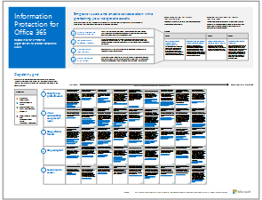

# Microsoft Cloud IT 架構資源

 **摘要：**深入了解 Microsoft 雲端服務和平台。檢閱我們的企業雲端藍圖，探索我們的雲端架構系列，以及更多選擇。
  
這些架構工具和海報可提供關於 Microsoft 雲端服務和平台的資訊，包括 Office 365、Microsoft Azure、Microsoft Intune、Microsoft Dynamics 365、私人雲端資料中心和混合式內部部署與雲端解決方案。IT 決策者和結構設計師可以使用這些資源，決定其工作負載的理想解決方案，並決定核心基礎結構元件 (例如身分識別和安全性)。 
  
- **[Microsoft 的 Enterprise Cloud 藍圖](microsoft-cloud-it-architecture-resources.md#roadmap)** (Sway)
    
- **[Microsoft Cloud for Enterprise Architects 系列](microsoft-cloud-it-architecture-resources.md#cloudarch)** ，包括了[Microsoft 雲端服務和平台選項](microsoft-cloud-it-architecture-resources.md#platformoptions)、[Microsoft Cloud Identity for Enterprise Architects](microsoft-cloud-it-architecture-resources.md#identity)、[Microsoft Cloud Security for Enterprise Architects](microsoft-cloud-it-architecture-resources.md#security)、[Microsoft Cloud Networking for Enterprise Architects](microsoft-cloud-it-architecture-resources.md#networking)、[Microsoft Mobility and Security for Enterprise Architects](microsoft-cloud-it-architecture-resources.md#mobility)、[Microsoft Cloud Storage for Enterprise Architects](microsoft-cloud-it-architecture-resources.md#storage)、[Microsoft Hybrid Cloud for Enterprise Architects](microsoft-cloud-it-architecture-resources.md#hybrid)以及[Microsoft 雲端中的 Contoso](microsoft-cloud-it-architecture-resources.md#contoso) 的海報。
    
- **[Office 365 企業方案系列](microsoft-cloud-it-architecture-resources.md#BKMK_o365solutions)** ，包括[Office 365 的資訊保護](microsoft-cloud-it-architecture-resources.md#BKMK_infoprotect)、[Office 365 的身分識別與裝置保護](microsoft-cloud-it-architecture-resources.md#BKMK_O365IDP)、[Office 365 的檔案保護方案](microsoft-cloud-it-architecture-resources.md#BKMK_O365fileprotect)和 [Office 365 用戶端的變更管理](microsoft-cloud-it-architecture-resources.md#changemgmt)。
    
> [!TIP]
> 此頁面上的海報大多提供多種語言版本，包括中文、英文、法文、德文、義大利文、日文、韓文、葡萄牙文、俄文和西班牙文。若要下載以上其中一種語言的海報，請按一下該海報的 [更多語言] 連結。讓我們知道您的想法！
  
請傳送電子郵件給我們：[cloudadopt@microsoft.com](mailto:cloudadopt@microsoft.com)。 
  
## Microsoft 的 Enterprise Cloud 藍圖

請參閱海報、圖示集、社群場地，以及其他說明業界最完整雲端解決方案的資源。
  
|**項目**|**描述**|
|:-----|:-----|
|[          ](https://aka.ms/cloudarchitecture)   [Microsoft 的 Enterprise Cloud 藍圖](https://aka.ms/cloudarchitecture) (https://aka.ms/cloudarchitecture)   |在 Sway 應用程式中撥動，瀏覽說明業界最完整雲端解決方案的資源。    |
   
## Microsoft Cloud for Enterprise Architects 系列

這些雲端架構海報提供了有關 Microsoft 雲端服務和平台的資訊，包括 Office 365、Microsoft Azure、Microsoft Intune、Microsoft Dynamics CRM Online、私人雲端資料中心和混合式內部部署與雲端解決方案。IT 決策者和結構設計師可以使用這些資源，決定其工作負載的理想解決方案，並決定核心基礎結構元件 (例如身分識別和安全性)。
  
### Microsoft 雲端服務和平台選項

深入了解 Microsoft 雲端服務和平台產品之間的主要差異。找出最適合您的方案。
  
|**項目**|**描述**|
|:-----|:-----|
|[          ](https://www.microsoft.com/download/details.aspx?id=54432)   [PDF](https://go.microsoft.com/fwlink/p/?LinkId=524731) |[Visio](https://go.microsoft.com/fwlink/p/?LinkId=524732) |[更多語言](https://www.microsoft.com/download/details.aspx?id=54432)   | 此模型說明：    軟體即服務 (SaaS) 供應項目，包括 Office 365    Microsoft Azure 中的平台即服務 (PaaS) 功能    Microsoft Azure 中的基礎結構即服務 (IaaS) 功能    使用 Windows Server 和 System Center 的私人雲端資料中心功能    深入了解 Microsoft 本身的 IT 部門如何移轉到這些雲端服務，並建置其混合雲端。   |
   
### Microsoft Cloud Identity for Enterprise Architects

IT 結構設計師在使用 Microsoft 雲端服務和平台設計組織的身分識別時，需要了解的資訊。
  
|**項目**|**描述**|
|:-----|:-----|
|[          ](https://www.microsoft.com/download/details.aspx?id=54431)   [PDF](https://go.microsoft.com/fwlink/p/?LinkId=524586) |[Visio](https://download.microsoft.com/download/2/3/8/238228E6-9017-4F6C-BD3C-5559E6708F82/MSFT_cloud_architecture_identity.vsd)          [文章](https://technet.microsoft.com/library/mt613459.aspx) |[更多語言](https://www.microsoft.com/download/details.aspx?id=54431)   | 此模型包含：    使用 Azure AD 做為識別即服務 (IDaaS) 提供者    Azure AD 的 IDaaS 功能    將內部部署的 Active Directory 網域服務帳戶，與 Microsoft Azure Active Directory 整合    將目錄元件置入 Azure 中    Azure IaaS 中工作負載的網域服務選項    檢視文章表單[Microsoft Cloud Identity for Enterprise Architects](microsoft-cloud-identity-for-enterprise-architects.md) 中的資訊。   |
   
### Microsoft Cloud Security for Enterprise Architects

IT 結構設計師在 Microsoft 雲端服務和平台中，需要瞭解哪些安全性資訊。
  
|**項目**|**描述**|
|:-----|:-----|
|[          ](https://www.microsoft.com/download/details.aspx?id=48121)   [PDF](https://go.microsoft.com/fwlink/p/?linkid=842070) |[Visio](https://go.microsoft.com/fwlink/p/?LinkId=842071) |[多語言](https://www.microsoft.com/download/details.aspx?id=48121)   | 此模型包含：    Microsoft 在提供安全服務與平台所扮演的角色    客戶對降低安全性風險的責任    重要的安全性認證    Microsoft 諮詢服務所提供的安全性產品    參加[安全性進入已啟用雲端的世界](https://aka.ms/securecustomermva)，這是根據這個架構海報的 Microsoft Virtual Academy 課程。    |
   
### Microsoft Cloud Networking for Enterprise Architects

IT 結構設計師在使用 Microsoft 雲端服務和平台時，有關網路功能需要瞭解的資訊。
  
|**項目**|**描述**|
|:-----|:-----|
|[          ](https://www.microsoft.com/download/details.aspx?id=54425)   [PDF](https://go.microsoft.com/fwlink/p/?linkid=842073) |[Visio](https://go.microsoft.com/fwlink/p/?linkid=842074)          [文章](https://technet.microsoft.com/library/mt733214.aspx) |[更多語言](https://www.microsoft.com/download/details.aspx?id=54425)   | 此模型包含下列頁面︰   **針對雲端連線能力發展您的網路功能** 雲端移轉改變了公司網路內外部的流量大小與本質。它也會影響降低安全性風險的方法。   **Microsoft 雲端連線能力的共同元素** 將您的網路與 Microsoft 雲端整合，提供各種服務的最佳存取途徑。   **適用於 Microsoft 雲端連線能力的 ExpressRoute** ExpressRoute 可提供連線至 Microsoft 雲端服務的隱私、專屬、高輸送量網路連線。   **設計 Microsoft SaaS (Office 365、Microsoft Intune 和 Dynamics CRM Online) 的網路** 若要針對 Microsoft SaaS 服務最佳化您的網路，需要仔細分析您的網際網路邊緣、用戶端裝置以及一般 IT 作業。   **設計 Azure PaaS 的網路** 若要針對 Azure PaaS 應用程式最佳化網路，必須具備充足的網際網路頻寬，且可能需要跨多個站台或應用程式分散網路流量。   **設計 Azure IaaS 的網路** 逐步執行設計程序，用於主控伺服器架構 IT 工作負載 (包括子網路)，建立最佳 Azure 虛擬的網路 (VNet)、位址空間、路由、DNS、負載平衡，及與您在內部部署網路、其他 VNets 及網際網路的連線能力。    參加[最佳化 Microsoft Cloud 供應項目的網路](https://aka.ms/optimizecloudnetworkingmva)，這是根據這個架構海報的新 Microsoft Virtual Academy 課程。    |
   
### Microsoft Mobility and Security for Enterprise Architects

IT 結構設計師在使用 Microsoft 雲端服務和平台時，有關行動性需要瞭解的資訊。
  
|**項目**|**描述**|
|:-----|:-----|
|[          ](https://www.microsoft.com/download/details.aspx?id=55023)   [PDF](https://go.microsoft.com/fwlink/p/?linkid=842076) |[Visio](https://go.microsoft.com/fwlink/p/?linkid=842077) |[更多語言](https://www.microsoft.com/download/details.aspx?id=55023)   | Microsoft 對於行動生產力提供廣泛的支援，具有系統管理控制以保護資料和應用程式。    Microsoft 商務相關行動應用程式。    開發行動應用程式的平台、服務和資源。    從行動裝置管理雲端式應用程式和資料的存取權。    Office 365 MDM、Azure Active Directory 進階版 和 Intune 的功能與平台支援比較。   |
   
### Microsoft Cloud Storage for Enterprise Architects

IT 結構設計師在使用 Microsoft 雲端服務和平台時，有關儲存需要瞭解的資訊。
  
|**項目**|**描述**|
|:-----|:-----|
|[          ](https://www.microsoft.com/download/details.aspx?id=49552)   [PDF](https://go.microsoft.com/fwlink/p/?linkid=842079) |[Visio](https://go.microsoft.com/fwlink/p/?linkid=842080)          [文章](https://technet.microsoft.com/library/mt842597.aspx) |[更多語言](https://www.microsoft.com/download/details.aspx?id=49552)   | 此模型包含：    使用雲端儲存的原因和關鍵案例。    搭配現有服務的「隨時可移入」的雲端儲存選項，可立即使用且僅需最低限度的設定。    「部分組件所需」的儲存選項，您可以將其用作儲存解決方案的起點，並可透過額外設定或編碼進行自訂調整。    使用儲存建置組塊「從頭開始建置」，從頭開始建立您自己的儲存解決方案或應用程式儲存空間。   |
   
### Microsoft Hybrid Cloud for Enterprise Architects

IT 結構設計師在使用 Microsoft 雲端服務和平台時，有關混合雲端需要瞭解的資訊。
  
|**項目**|**描述**|
|:-----|:-----|
|[          ](https://www.microsoft.com/download/details.aspx?id=54424)   [PDF](https://go.microsoft.com/fwlink/p/?linkid=842082) |[Visio](https://go.microsoft.com/fwlink/p/?linkid=842083)          [文章](https://technet.microsoft.com/library/mt750500.aspx) |[多語言](https://www.microsoft.com/download/details.aspx?id=54424)   | 此模型包含下列頁面︰   **混合雲端概觀** Microsoft 的雲端產品 (SaaS、Azure PaaS 和 Azure IaaS) 及其共同元素。   **Microsoft 混合雲端結構的案例** Microsoft 雲端產品的混合雲端結構圖表，顯示內部部署基礎結構、網路和身分識別的共同層次。   **Microsoft SaaS (Office 365) 混合雲端的案例** 商務用 Skype、SharePoint Server 和 Exchange Server 的 SaaS 混合案例結構，以及關鍵混合設定的說明。   **Azure PaaS 混合雲端的案例** Azure PaaS 混合案例結構、附有範例的 Azure PaaS 混合應用程式說明，以及 SQL Server 2016 Stretch Database 的說明。   **Azure IaaS 混合雲端的案例** Azure IaaS 混合案例結構，以及裝載在 Azure IaaS 中適用於企業營運 (LOB) 應用程式的說明。   |
   
### Microsoft 雲端中的 Contoso

一個虛構但具有代表性的全球組織，如何實作 Microsoft 的雲端產品 (包括 Office 365、Azure、Dynamics 365 和 Intune)。
  
|**項目**|**描述**|
|:-----|:-----|
|[          ](https://www.microsoft.com/download/details.aspx?id=54427)   [PDF](https://go.microsoft.com/fwlink/p/?linkid=842085) |[Visio](https://go.microsoft.com/fwlink/p/?linkid=842086)          [文章](https://technet.microsoft.com/library/mt775341.aspx) |[更多語言](https://www.microsoft.com/download/details.aspx?id=54427)   |檢視總部位於巴黎的全球製造集團 Contoso Corporation，是如何採用包含雲端的 IT 基礎結構，並作出關於網路能力、身分識別和安全性的重大設計決策。    |
   
### The Santa Cloud

聖誕老人和他的小精靈們，如何使用 Microsoft 的雲端產品來發送一年一度的聖誕禮物。
  
|**項目**|**描述**|
|:-----|:-----|
|[          ](https://www.microsoft.com/download/details.aspx?id=55039)   [PDF](https://go.microsoft.com/fwlink/p/?linkid=842088)   |聖誕老人和他的小精靈 IT 部門使用了 Office 365、Azure、Dynamics 365 和 Intune，來判斷小孩子們乖不乖，好在聖誕夜 (12 月 24 日) 發送聖誕禮物。    |
   
## Office 365 企業方案系列

Office 365 企業方案系列提供實作 Office 365 功能的指引，尤其是跨多項技術的功能。
  
### Office 365 的資訊保護

讓企業組織保護公司資產的功能。
  
|**項目**|**描述**|
|:-----|:-----|
|[          ](https://www.microsoft.com/download/details.aspx?id=54429)   [PDF](http://download.microsoft.com/download/2/3/D/23D91386-8349-4F7A-9470-FD5AED861F16/MSFT_cloud_architecture_informationprotection.pdf) |[Visio](http://download.microsoft.com/download/2/3/D/23D91386-8349-4F7A-9470-FD5AED861F16/MSFT_cloud_architecture_informationprotection.vsd) |[更多語言](https://www.microsoft.com/download/details.aspx?id=54429)   |Microsoft 提供最完整的功能集合，以保護貴公司的資產。這個模型可以在規劃要實作哪些功能時，協助組織採取有系統的方法。    |
   
### Office 365 的身分識別與裝置保護

推薦可用於保護身分識別和裝置的功能，其可存取 Office 365、其他 SaaS 服務，以及與 Azure AD 應用程式 Proxy 一起發佈的內部部署應用程式。
  
|**項目**|**描述**|
|:-----|:-----|
|[          ](https://www.microsoft.com/download/details.aspx?id=55032)   [PDF](https://go.microsoft.com/fwlink/p/?linkid=841656) |[Visio](https://go.microsoft.com/fwlink/p/?linkid=841657) |[多語言](https://www.microsoft.com/download/details.aspx?id=55032)   |請務必在您的資料、身分識別和裝置之間，使用一致層級的保護。這份文件會顯示哪些功能在保護身分識別和裝置上有相當功能的詳細資訊。    |
   
### Office 365 的檔案保護方案

建議的功能，根據三個不同的敏感度層級保護 Office 365 中的檔案。
  
|**項目**|**描述**|
|:-----|:-----|
|[          ](https://www.microsoft.com/download/details.aspx?id=55523)   [PDF](http://download.microsoft.com/download/7/8/9/789645A5-BD10-4541-BC33-F8D1EFF5E911/MSFT_cloud_architecture_O365 file protection.pdf) |[Visio](http://download.microsoft.com/download/7/8/9/789645A5-BD10-4541-BC33-F8D1EFF5E911/MSFT_cloud_architecture_O365%20file%20protection.vsdx)   |請務必在您的資料、身分識別和裝置之間，使用一致層級的保護。這份文件顯示有哪些可比較的功能，並詳細說明哪些功能可保護 Office 365 中的檔案。    |
   
### Office 365 用戶端的變更管理

IT 結構設計師在管理 Office 365 用戶端應用程式和 Windows 10 的分支版本時，需要瞭解的資訊。 
  
|**項目**|**描述**|
|:-----|:-----|
|[          ](https://www.microsoft.com/download/details.aspx?id=49141)   [PDF](https://go.microsoft.com/fwlink/p/?LinkId=626681) |[Visio](https://go.microsoft.com/fwlink/p/?LinkId=626680)          [文章](https://technet.microsoft.com/library/mt584223.aspx) |[更多語言](https://www.microsoft.com/download/details.aspx?id=49141)   | Windows 10 和 Office 365 用戶端應用程式的服務模型    發行選項    發行頻率    變更類型    角色和責任    管理更新部署    檢視文章表單[Change management for Office 365 clients](http://technet.microsoft.com/library/815fa1aa-0355-40b5-b7bc-cdf7d4610062.aspx) 中的資訊。   |
   