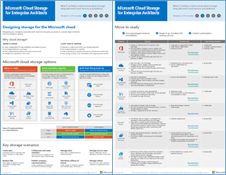

# Microsoft Cloud Storage for Enterprise Architects

 **摘要：**設計 Microsoft 雲端服務和平台的儲存空間。
  
本文提供連結的文章說明了解設計組織使用 Microsoft 雲端服務和平台的儲存空間何種 IT 架構師所需的一組。您也可以檢視這項資訊為 6 頁海報和列印 tabloid 格式 (也稱為 ledger 11 x 17 或 A3)。
  

  
[PDF](https://go.microsoft.com/fwlink/p/?linkid=842079) | [Visio](https://go.microsoft.com/fwlink/p/?linkid=842080) | [更多語言](https://www.microsoft.com/download/details.aspx?id=49552)
  
您也可以查看在 [Microsoft Cloud IT 架構資源](microsoft-cloud-it-architecture-resources.md) 內的所有模型，並在[Microsoft 的 Enterprise Cloud 藍圖中撥動︰IT 決策者的資源](https://aka.ms/cloudarchitecture)。
  
請參閱下列各節：
  
- [設計 Microsoft 雲端儲存空間](designing-storage-for-the-microsoft-cloud.md)
    
    了解為何您應使用雲端儲存空間及重要的雲端儲存案例，以及然後掃描不同的 Microsoft 雲端儲存選項清單。
    
- [移入就緒](move-in-ready.md)
    
    使用情況下比喻組織各種不同的雲端存放區選項，這些是內建至其他 Microsoft cloud 優惠方案，即可立即使用。
    
- [有部分組件](some-assembly-required.md)
    
    這些雲端儲存選項會儲存解決方案，需要進行其他設定或針對配合自訂編碼的起點。
    
- [為基礎而建置](build-from-the-ground-up.md)
    
    這些雲端儲存選項為基礎的儲存空間建置組塊，讓您可以用來從頭開始建立您自己的儲存解決方案或應用程式。
    
> [!NOTE]
> 這些文章並反映 Enterprise 架構師海報 「 Microsoft 雲端儲存空間**2017 年 9 月**發行版本。
  
## 請參閱

[Microsoft Cloud IT 架構資源](microsoft-cloud-it-architecture-resources.md)

[Microsoft 的 Enterprise Cloud 藍圖：IT 決策者的資源](https://sway.com/FJ2xsyWtkJc2taRD)

