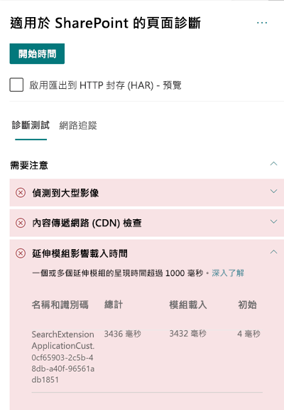

# 在 SharePoint Online 新式網站頁面中最佳化自訂延伸模組的效能

本文可協助您了解如何判斷自訂延伸模組如何影響使用者察覺延遲，以及如何修復常見問題。

## 使用「適用於 SharePoint 的頁面診斷」工具來分析自訂延伸模組

適用於 SharePoint 的頁面診斷工具是全新 Microsoft Edge (https://www.microsoft.com/edge) 和 Chrome 瀏覽器的擴充功能，可以用來分析 SharePoint Online 新式入口網站與傳統發佈網站頁面。 該工具會針對每個分析頁面提供一份報告，顯示頁面如何針對定義的效能準則組執行。 若要安裝及了解「適用於 SharePoint 的頁面診斷」工具，請造訪[使用適用於 SharePoint Online 的頁面診斷工具](page-diagnostics-for-spo.md)。

>[!NOTE]
>網頁診斷工具只能用於 SharePoint Online，且無法在 SharePoint 系統頁面使用。

當您使用「適用於 SharePoint 的頁面診斷」工具分析 SharePoint 網站頁面時，您可以在 _[診斷測試]_ 窗格的 **[擴充功能正影響載入時間]** 和/或 **[使用過多擴充功能]** 結果中，看到超過基準計量的自訂延伸模組相關資訊 

可能的結果包括：

- **需要注意** (紅色)：載入耗時比**兩**秒還要久的任何_自訂_延伸模組。 測試結果中顯示的載入時間總計會依據模組載入和初始來細分。 此外，如果頁面上的延伸模組太多，可能會影響頁面載入時間，而如果頁面上使用**七個**以上的延伸模組，系統將會醒目提示。
- **改善機會** (黃色)：如果使用**五個**以上的延伸模組，系統將會在此區段以警示方式醒目提示，直到使用七個以上的延伸模組之後，就會以 [需要注意] 方式醒目提示。
- **無需採取動作** (綠色)：沒有任何延伸模組載入耗時超過一秒。

如果延伸模組影響頁面載入時間，或頁面上的延伸模組太多，結果會顯示在結果的 **[需要注意]** 區段中。 按一下結果以查看載入緩慢的延伸模組或已醒目提示太多延伸模組的詳細資料。 未來「適用於 SharePoint 的頁面診斷」工具的更新可能會包含分析規則的更新，因此請確保永遠擁有最新版本的工具。

結果中提供的資訊包括：

- [名稱和識別碼]**** 顯示可協助您在頁面上尋找延伸模組的識別資訊
- [總計]**** 顯示延伸模組初始和載入的時間總計
- [模組載入]**** 顯示擷取和載入延伸模組所需的時間
- [初始]**** 顯示延伸模組初始化所需的時間

系統會提供此資訊，協助設計人員和開發人員對問題進行疑難排解。 此資訊應提供給您的設計和開發小組。

## 延伸模組的概觀

SharePoint 架構 (SPFx) 延伸模組可用於延伸 SharePoint 使用者體驗。 透過 SharePoint 架構延伸模組，您可以自訂 SharePoint 體驗的更多層面，包括通知區域、工具列及清單資料檢視。

延伸模組對 SharePoint 頁面的效能有不良影響，因為這也會佔用 CPU 和網路資源來執行必要的工作。

延伸模組有四種類型：

- **應用程式自訂員**會在頁面中新增指令碼，並存取已知 HTML 元素預留位置，並以自訂轉譯進行延伸。
- **欄位自訂員**提供清單中欄位資料的修改檢視。
- **命令集**延伸 SharePoint 命令面來新增新動作，並提供您可用來實作行為的用戶端程式碼。
- **搜尋查詢修改程式 (僅供預覽)** 會在執行搜尋查詢前被叫用。

## 修復延伸模組效能問題

按照本節的指導方針進行，以找出 [延伸模組影響頁面載入時間]**** 結果中列出的延伸模組效能問題，並加以修復。

>[!NOTE]
>在頁面生命週期的早期階段中，可能會執行應用程式自訂員，因此可能會影響頁面上其他延伸模組的效能。

頁面診斷工具中的稽核結果會顯示兩個執行延伸模組的階段，以便協助找出潛在的效能影響。

- **模組載入時間**是載入延伸模組所需的時間，這會受到延伸模組的大小影響，因此建議您只組合延伸模組中的必要資料庫，並選擇較輕量的資料庫。
- **初始**是延伸模組和延伸模組開發人員的初始化時間，應考慮延伸模組是否在初始階段期間執行不必要的工作，或執行太多命令。

頁面作者也可以使用稽核結果，查看頁面上是否有太多延伸模組，因為延伸太多會對頁面的效能造成負面影響。

- **延伸模組大小和相依性**
  - 若要下載最佳的靜態資源，需要使用 Office 365 CDN。 公用 CDN 來源適用於 _js/css_ 檔案。 如需使用 Office 365 CDN 的詳細資訊，請參閱[使用 Office 365 內容傳遞網路 (CDN) 搭配 SharePoint Online](use-office-365-cdn-with-spo.md)。
  - 重複使用架構，例如隨附於 SharePoint 架構 (SPFx) 的 _React_ 和 _Fabric imports_。 如需詳細資訊，請參閱 [SharePoint 架構的概觀](https://docs.microsoft.com/sharepoint/dev/spfx/sharepoint-framework-overview) (英文)。
  - 請確保使用最新版本的 SharePoint 架構，並且在新版本可用時升級。
- **資料擷取/快取**
  - 如果延伸模組依賴額外伺服器呼叫，以擷取資料進行顯示，請確保這些伺服器 API 是快速的及/或實作用戶端快取 (例如針對大型集合使用 _localStorage_ 或 _IndexDB_)。
  - 如果需要多個呼叫來轉譯重要資料，請考量在伺服器上進行批次處理，或者將要求合併至單一呼叫的其他方法。
  - 或者，如果資料的某些元素需要較慢的 API，但是對於初始轉譯並不重要，請將這些項目分離為個別呼叫，在重要資料轉譯之後執行。
  - 如果多個組件使用相同的資料，請利用共用資料層來避免重複呼叫。
- **轉譯時間**
  - 任何媒體來源 (例如影像和影片) 的大小應該調整為容器、裝置及/或網路的限制，以避免下載不必要的大型資產。 如需內容相依性的詳細資訊，請參閱[使用 Office 365 內容傳遞網路 (CDN) 搭配 SharePoint Online](use-office-365-cdn-with-spo.md)。
  - 避免造成自動重排、複雜 CSS 規則或複雜動畫的 API 呼叫。 如需詳細資訊，請參閱[最小化瀏覽器自動重排](https://developers.google.com/speed/docs/insights/browser-reflow) (英文)。
  - 避免使用鏈結長時間執行工作。 相反地，將長時間執行工作分開至個別佇列。 如需詳細資訊，請參閱[最佳化 JavaScript 執行](https://developers.google.com/web/fundamentals/performance/rendering/optimize-javascript-execution)。
  - 為非同步轉譯媒體或視覺元件保留對應空間，以避免略過畫面格數和間斷 (也稱為 _jank_)。
  - 如果特定瀏覽器不支援轉譯中使用的功能，則載入 polyfill 或排除執行相依程式碼。 如果功能不重要，請以事件處理常式的形式來處理資源，以避免記憶體流失。

在您進行頁面修訂以修復效能問題之前，請記下分析結果中的頁面載入時間。 在修訂後再次執行工具，以查看新結果是否在基準標準內，並檢查新頁面的載入時間，以查看是否有改善。

>[!NOTE]
>頁面載入時間會因為各種因素而有所不同，例如網路負載、一天的時間及其他暫時條件。 您應該在進行變更前後測試幾次頁面載入時間，以協助您計算結果的平均值。

## 相關主題

[調整 SharePoint Online 效能](tune-sharepoint-online-performance.md)

[調整 Office 365 效能](tune-office-365-performance.md)

[SharePoint 新式體驗中的效能](https://docs.microsoft.com/sharepoint/modern-experience-performance)

[內容傳遞網路](content-delivery-networks.md)

[使用 Office 365 內容傳遞網路 (CDN) 搭配 SharePoint Online](use-office-365-cdn-with-spo.md)
