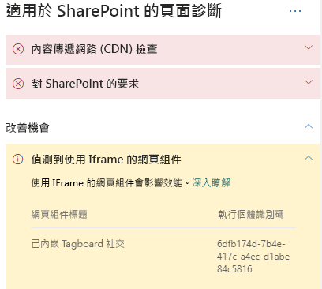

# 在 SharePoint Online 新式與傳統發佈網站頁面中最佳化 iFrameOptimize iFrames in SharePoint Online modern and classic publishing site pages

iFrame 對於預覽多種格式的內容 (例如影面或其他媒體) 而言相當有用。iFrames can be useful for previewing rich content such as videos or other media. 不過，因為 iFrame 會在 SharePoint 網站頁面內載入個別頁面，所以在 iFrame 中載入的內容可能包含大量影像、影片或其他元素，以上項目都會影響整體頁面載入時間，而且您無法在頁面上進行控制。However, because iFrames load a separate page within the SharePoint site page, content loaded in the iFrame could contain large images, videos or other elements that can contribute to overall page load times and that you cannot control on the page. 本文可協助您了解如何判斷頁面中的 iFrame 如何影響使用者察覺延遲，以及如何修復常見問題。This article will help you understand how to determine how iFrames in your pages affect user perceived latency, and how to remediate common issues.

>[!NOTE]
>如需有關 SharePoint Online 新式網站效能的詳細資訊，請參閱 [SharePoint 新式體驗中的效能](https://docs.microsoft.com/sharepoint/modern-experience-performance)。For more information about performance in SharePoint Online modern sites, see [Performance in the modern SharePoint experience](https://docs.microsoft.com/sharepoint/modern-experience-performance).

## 使用「適用於 SharePoint 的頁面診斷」工具，透過 iFrame 來分析網頁組件Use the Page Diagnostics for SharePoint tool to analyze web parts using iFrames

**適用於 SharePoint 的頁面診斷工具**是 Chrome 和 [Microsoft Edge 77 版或更新版本](https://www.microsoftedgeinsider.com/download?form=MI13E8&OCID=MI13E8)的瀏覽器擴充功能，您可以用來分析 SharePoint 新式與傳統發佈網站頁面。The **Page Diagnostics for SharePoint tool** is a browser extension for Chrome and [Microsoft Edge version 77 or later](https://www.microsoftedgeinsider.com/download?form=MI13E8&OCID=MI13E8) you can use to analyze SharePoint both modern and classic publishing site pages. 該工具會針對每個分析頁面提供一份報告，顯示頁面如何針對定義的效能準則組執行。The tool provides a report for each analyzed page showing how the page performs against a defined set of performance criteria. 若要安裝及了解「適用於 SharePoint 的頁面診斷」工具，請造訪[使用適用於 SharePoint Online 的頁面診斷工具](page-diagnostics-for-spo.md)。To install and learn about the Page Diagnostics for SharePoint tool, visit [Use the Page Diagnostics tool for SharePoint Online](page-diagnostics-for-spo.md).

當您使用「適用於 SharePoint 的頁面診斷」工具分析 SharePoint 網站頁面時，您可以在 [診斷測試]__ 窗格中看到包含 iFrame 的網頁組件相關資訊。When you analyze a SharePoint site page with the Page Diagnostics for SharePoint tool, you can see information about web parts containing iFrames in the _Diagnostic tests_ pane. 新式頁面與傳統頁面的基準計量是相同的。The baseline metric is the same for modern and classic pages.

可能的結果包括：Possible results include:

- **需要注意** (紅色)：頁面包含**三個以上**使用 iFrame 的網頁組件**Attention required** (red): The page contains **three or more** web parts using iFrames
- **改善機會** (黃色)：頁面包含**一個或兩個**使用 iFrame 的網頁組件**Improvement opportunities** (yellow): The page contains **one or two** web parts using iFrames
- **不需要任何動作** (綠色)：頁面不包含任何使用 iFrame 的網頁組件**No action required** (green): The page contains no web parts using iFrames

如果 [偵測到使用 iFrame 的網頁組件]\*\*\*\* 結果顯示在 [改善機會]\*\*\*\* 或 [需要注意]\*\*\*\* 區段中，您可以按一下結果以查看包含 iFrame 的網頁組件。If the **Web parts using iFrames detected** result appears in either the **Improvement opportunities** or **Attention required)** section of the results, you can click the result to see the web parts that contain iFrames.

## 修復 iFrame 效能問題Remediate iFrame performance issues

使用 [頁面診斷] 工具中的 [偵測到使用 iFrame 的網頁組件]\*\*\*\* 結果，以判斷哪些網頁組件包含 iFrame，且可能造成頁面載入時間變慢。Use the **Web parts using iFrames detected** result in the Page Diagnostic tool to determine which web parts contain iFrames and may be contributing to slow page load times.

iFrame 原本就相當緩慢，因為它們會載入個別外部頁面，包括所有相關聯內容，例如 javascript、CSS 及架構元素，其中兩個以上的元素可能會增加網站頁面的負載。iFrames are inherently slow because they load a separate external page including all associated content such as javascript, CSS and framework elements, potentially increasing the overhead of the site page by a factor of two or more.

請依照以下指導方針，以確保您能最佳地使用 iFrame。Follow the guidance below to ensure optimal use of iFrames.

- 如果預覽是可開始的小型影像或者非互動式，盡可能使用影像而不是使用 iFrame。When possible, use images instead of iFrames if the preview is small to begin with or non-interactive.
- 如果必須使用 iFrame，將數量降至最低及/或將它們移出檢視區。If iFrames must be used, minimize the number and/or move them out of the viewport.
- 內嵌 Office 檔案 (例如 Word、Excel 和 PowerPoint) 是互動式的，但是載入速度緩慢。Embedded Office files like Word, Excel and PowerPoint are interactive, but are slow to load. 具有完整文件連結的影像縮圖，通常有更好的效果。Image thumbnails with a link to the full document will often perform better.
- 內嵌 YouTube 影片和 Twitter 摘要在 iFrame 中能夠執行地更好，但是請謹慎地使用這些類型的內嵌。Embedded YouTube videos and Twitter feeds tend to perform better in iFrames, but use these kinds of embeds judiciously.
- 隔離的網頁組件是合理的例外，但是請將它們的數量降至最低並且避免放在檢視區中。Isolated web parts are a reasonable exception, but minimize their number and placement in the viewport.
- 如果 iFrame 位於檢視區外，請考量使用 _IntersectionObserver_ 以延遲轉譯 iFrame，直到它出現在檢視中。If an iFrame is located out of the viewport, consider using an _IntersectionObserver_ to delay rendering the iFrame until it comes into view.

在您進行頁面修訂以修復效能問題之前，請記下分析結果中的頁面載入時間。Before you make page revisions to remediate performance issues, make a note of the page load time in the analysis results. 在修訂後再次執行工具，以查看新結果是否在基準標準內，並檢查新頁面的載入時間，以查看是否有改善。Run the tool again after your revision to see if the new result is within the baseline standard, and check the new page load time to see if there was an improvement.

>[!NOTE]
>頁面載入時間會因為各種因素而有所不同，例如網路負載、一天的時間及其他暫時條件。Page load time can vary based on a variety of factors such as network load, time of day, and other transient conditions. 您應該在進行變更前後測試幾次頁面載入時間，以協助您計算結果的平均值。You should test page load time a few times before and after making changes to help you average the results.

## 相關主題Related topics

[調整 SharePoint Online 效能Tune SharePoint Online performance](tune-sharepoint-online-performance.md)

[調整 Office 365 效能Tune Office 365 performance](tune-office-365-performance.md)

[SharePoint 新式體驗中的效能Performance in the modern SharePoint experience](https://docs.microsoft.com/sharepoint/modern-experience-performance.md)
