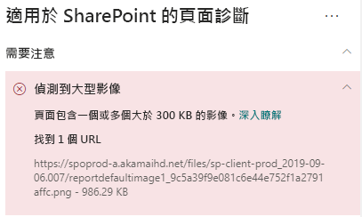

# 在 SharePoint Online 新式網站頁面中最佳化影像

本文可協助您了解如何在 SharePoint Online 新式網站頁面中最佳化影像。

如需最佳化傳統發布網站中的影像的詳細資訊，請參閱[ SharePoint Online 的影像最佳化](image-optimization-for-sharepoint-online.md)

>[!NOTE]
>如需有關 SharePoint Online 新式入口網站效能的詳細資訊，請參閱 [SharePoint 新式體驗中的效能](https://docs.microsoft.com/sharepoint/modern-experience-performance)。

## 使用「適用於 SharePoint 的頁面診斷」工具來分析影像最佳化

適用於 SharePoint 的頁面診斷工具是全新 Microsoft Edge (https://www.microsoft.com/edge) 和 Chrome 瀏覽器的擴充功能，可以用來分析 SharePoint Online 新式入口網站與傳統發佈網站頁面。 該工具會針對每個分析頁面提供一份報告，顯示頁面如何針對定義的效能準則組執行。 若要安裝及了解「適用於 SharePoint 的頁面診斷」工具，請造訪[使用適用於 SharePoint Online 的頁面診斷工具](page-diagnostics-for-spo.md)。

>[!NOTE]
>網頁診斷工具只能用於 SharePoint Online，且無法在 SharePoint 系統頁面使用。

當您使用「適用於 SharePoint 的頁面診斷」工具分析 SharePoint 新式網站時，您可以在 [診斷測試]__ 窗格中看到大型影像的資訊。

可能的結果包括：

- **需要注意** (紅色)：頁面包含 [一或多個]**** 大小超過 300KB 的影像
- **不需要採取動作** (紅色)：頁面未包含大小超過 300KB 的影像

如果大型影像的偵測結果顯示在結果的 [需要注意] 區段，您可以按一下結果來查看其他詳細資料。

## 修正大型影像問題

如果頁面的影像大小超過 300KB，請選取 [偵測到大型影像]**** 結果，以查看哪些影像太大。 在新式 SharePoint Online 頁面中，系統會自動提供影像的轉譯，並根據瀏覽器視窗的大小和用戶端監視器的解析度來調整影像大小。 在上傳至 SharePoint Online 之前，您應隨時最佳化網頁使用的影像。 系統會自動縮小過大的影像和解析度，這可能會導致非預期的轉譯特性。

在您進行頁面修訂以修復效能問題之前，請記下分析結果中的頁面載入時間。 在修訂後再次執行工具，以查看新結果是否在基準標準內，並檢查新頁面的載入時間，以查看是否有改善。

>[!NOTE]
>頁面載入時間會因為各種因素而有所不同，例如網路負載、一天的時間及其他暫時條件。 您應該在進行變更前後測試幾次頁面載入時間，以協助您計算結果的平均值。

## 相關主題

[調整 SharePoint Online 效能](tune-sharepoint-online-performance.md)

[調整 Office 365 效能](tune-office-365-performance.md)

[SharePoint 新式體驗中的效能](https://docs.microsoft.com/sharepoint/modern-experience-performance)

[內容傳遞網路](content-delivery-networks.md)

[使用 Office 365 內容傳遞網路 (CDN) 搭配 SharePoint Online](use-office-365-cdn-with-spo.md)
