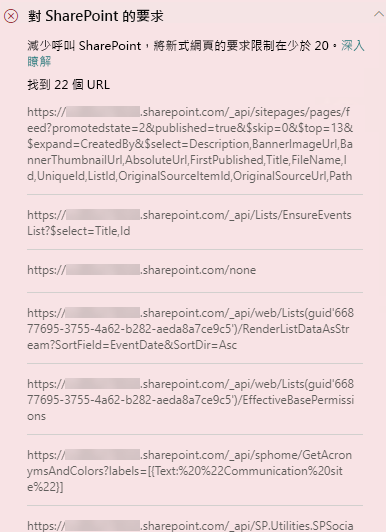
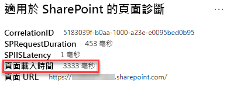

# 在 SharePoint Online 新式與傳統發佈網站頁面中最佳化頁面呼叫Optimize page calls in SharePoint Online modern and classic publishing site pages

SharePoint Online 新式與傳統發佈網站都包含連結，會從 SharePoint 功能和 CDN 載入資料 (或進行呼叫)。Both SharePoint Online modern and classic publishing sites contain links that load data from (or make calls to) SharePoint features and CDNs. 頁面進行的呼叫越多，頁面載入所花費的時間越久。The more calls made by a page, the longer the page takes to load. 這稱為**使用者察覺延遲**或 **EUPL**。This is known as **end user perceived latency** or **EUPL**.

本文可協助您了解如何從您的新式和傳統發佈網站頁面中判斷對外部端點呼叫的數量及影響，以及如何限制其對使用者察覺延遲的影響。This article will help you understand how to determine the number and impact of calls to external endpoints from your modern and classic publishing site pages and how to limit their effect on end user perceived latency.

>[!NOTE]
>如需有關 SharePoint Online 新式入口網站效能的詳細資訊，請參閱 [SharePoint 新式體驗中的效能](https://docs.microsoft.com/sharepoint/modern-experience-performance)。For more information about performance in SharePoint Online modern portals, see [Performance in the modern SharePoint experience](https://docs.microsoft.com/sharepoint/modern-experience-performance).

## 使用「適用於 SharePoint 的頁面診斷」工具來分析頁面呼叫Use the Page Diagnostics for SharePoint tool to analyze page calls

**適用於 SharePoint 的頁面診斷工具**是 Chrome 和 [Microsoft Edge 77 版或更新版本](https://www.microsoftedgeinsider.com/download?form=MI13E8&OCID=MI13E8)的瀏覽器擴充功能，您可以用來分析 SharePoint 新式與傳統發佈網站頁面。The **Page Diagnostics for SharePoint tool** is a browser extension for Chrome and [Microsoft Edge version 77 or later](https://www.microsoftedgeinsider.com/download?form=MI13E8&OCID=MI13E8) you can use to analyze SharePoint both modern and classic publishing site pages. 該工具會針對每個分析頁面提供一份報告，顯示頁面如何針對定義的效能準則組執行。The tool provides a report for each analyzed page showing how the page performs against a defined set of performance criteria. 若要安裝及了解「適用於 SharePoint 的頁面診斷」工具，請造訪[使用適用於 SharePoint Online 的頁面診斷工具](page-diagnostics-for-spo.md)。To install and learn about the Page Diagnostics for SharePoint tool, visit [Use the Page Diagnostics tool for SharePoint Online](page-diagnostics-for-spo.md).

當您使用「適用於 SharePoint 的頁面診斷」工具分析 SharePoint 網站頁面時，您可以在 [診斷測試]__ 窗格的 [對 SharePoint 的要求]\*\*\*\* 結果中看到關於外部呼叫的資訊。When you analyze a SharePoint site page with the Page Diagnostics for SharePoint tool, you can see information about external calls in the **Requests to SharePoint** result in the _Diagnostic tests_ pane. 如果網站頁面包含的呼叫數目少於呼叫的基準數，則此行會顯示為綠色，如果頁面超過基準數，則會顯示為紅色。The line will appear in green if the site page contains fewer than the baseline number of calls, and red if the page exceeds the baseline number. 因為傳統網站頁面使用 HTTP1.1，而新式頁面使用 HTTP2.0，所以新式頁面與傳統頁面的基準數不同：The baseline number is different for modern and classic pages because classic site pages use HTTP1.1 and modern pages use HTTP2.0:

- 新式網站頁面應最多包含 **25** 個呼叫Modern site pages should contain no more than **25** calls
- 傳統發佈頁面應最多包含 **6** 個呼叫Classic publishing pages should contain no more than **6** calls

可能的結果包括：Possible results include:

- **需要注意** (紅色)：頁面超過呼叫的基準數**Attention required** (red): The page exceeds the baseline number of calls
- **不需要任何動作** (綠色)：頁面包含的呼叫數少於基準數**No action required** (green): The page contains fewer than the baseline number of calls

如果 [對 SharePoint 的要求]\*\*\*\* 顯示在 [需要注意]\*\*\*\* 區段中，您可以按一下結果以取得詳細資訊，包括頁面上呼叫的總數與 URL 的清單。If the **Requests to SharePoint** result appears in the **Attention required** section, you can click the result for details, including the total number of calls on the page and a list of the URLs.

## 修復與頁面上呼叫過多相關的效能問題Remediate performance issues related to too many calls on a page

如果頁面包含太多呼叫，您可以使用 [對 Sharepoint 的要求]\*\*\*\* 結果中的 URL 清單，以判斷是否有任何重複的呼叫、應該批次進行的呼叫，或傳回應快取資料的要呼叫。If a page contains too many calls, you can use the list of URLs in the **Requests to Sharepoint** results to determine whether there are any repeated calls, calls that should be batched, or calls that return data that should be cached.

**批次處理 REST 呼叫**可協助降低效能負荷。**Batching REST calls** can help to reduce performance overhead. 如需有關 API 呼叫批次處理的詳細資訊，請參閱[使用 REST API 建立批次要求](https://docs.microsoft.com/sharepoint/dev/sp-add-ins/make-batch-requests-with-the-rest-apis) (英文)。For more information about API call batching, see [Make batch requests with the REST APIs](https://docs.microsoft.com/sharepoint/dev/sp-add-ins/make-batch-requests-with-the-rest-apis).

**使用快取**以儲存 API 呼叫的結果，可讓用戶端使用快取的資料，而不是為每個後續頁面載入進行額外呼叫，藉以改善處理暖要求的效能。**Using a cache** to store the results of an API call can improve the performance of a warm request by allowing the client to use the cached data instead of making an additional call for each subsequent page load. 依據商務需求而定，有多種方法可以達成這個解決方案。There are multiple ways to approach this solution depending on the business requirement. 通常，如果所有使用者的資料都是相同的，使用像是 [_Azure Redis_ 快取](https://azure.microsoft.com/services/cache/) 的中介層快取服務是極佳的選項，可以大幅降低網站的 API 流量，因為使用者是從快取服務要求資料，而不是直接從 SPO 要求資料。Typically if the data will be the same for all users, using a middle-tier caching service like [_Azure Redis_ cache](https://azure.microsoft.com/services/cache/) is a great option to significantly reduce API traffic against a site, as the users would request the data from the caching service instead of directly from SPO. 只有在您重新整理中介層的快取時，才需要進行 SPO 呼叫。The only SPO calls needed would be to refresh the middle-tier's cache. 如果資料會因為個別使用者而波動，最好的做法可能是實作用戶端快取，例如 LocalStorage 或甚至是 Cookie。If the data will fluctuate on an individual user basis, it may be best to implement a client side cache, like LocalStorage or even a Cookie. 這要仍然可以藉由排除相同使用者在快取期間內所進行的後續要求，來降低呼叫量，但是這樣的效率比專用快取服務差。This will still reduce call volumes by eliminating subsequent requests made by the same user for the cache duration, but will be less efficient than a dedicated caching service. PnP 可讓您使用 LocalStorage，只需要一些額外的開發。PnP allows you to use LocalStorage with little additional development required.

在您進行頁面修訂以修復效能問題之前，請記下分析結果中的頁面載入時間。Before you make page revisions to remediate performance issues, make a note of the page load time in the analysis results. 在修訂後再次執行工具，以查看新結果是否在基準標準內，並檢查新頁面的載入時間，以查看是否有改善。Run the tool again after your revision to see if the new result is within the baseline standard, and check the new page load time to see if there was an improvement.

>[!NOTE]
>頁面載入時間會因為各種因素而有所不同，例如網路負載、一天的時間及其他暫時條件。Page load time can vary based on a variety of factors such as network load, time of day, and other transient conditions. 您應該在進行變更前後測試幾次頁面載入時間，以協助您計算結果的平均值。You should test page load time a few times before and after making changes to help you average the results.

## 相關主題Related topics

[調整 SharePoint Online 效能Tune SharePoint Online performance](tune-sharepoint-online-performance.md)

[調整 Office 365 效能Tune Office 365 performance](tune-office-365-performance.md)

[SharePoint 新式體驗中的效能Performance in the modern SharePoint experience](https://docs.microsoft.com/sharepoint/modern-experience-performance)

[內容傳遞網路Content delivery networks](content-delivery-networks.md)

[使用 Office 365 內容傳遞網路 (CDN) 搭配 SharePoint OnlineUse the Office 365 Content Delivery Network (CDN) with SharePoint Online](use-office-365-cdn-with-spo.md)
