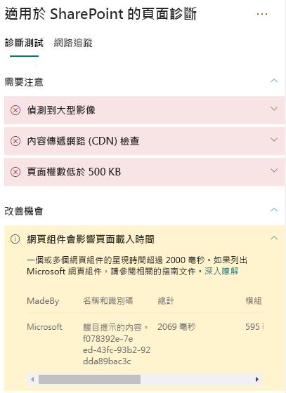

# 在 SharePoint Online 新式網站頁面中最佳化網頁組件效能

>[!TIP]
>如需在 SharePoint 網站頁面中最佳化 iFrame 的詳細資訊，請參閱[在 SharePoint Online 新式與傳統發佈網站頁面中最佳化 iFrame](modern-iframe-optimization.md)。

SharePoint Online 新式網站頁面包含網頁組件，對整體頁面載入時間有影響。 本文可協助您了解如何判斷頁面中的網頁組件如何影響使用者察覺延遲，以及如何修復常見問題。

>[!NOTE]
>如需有關 SharePoint Online 新式入口網站效能的詳細資訊，請參閱 [SharePoint 新式體驗中的效能](https://docs.microsoft.com/zh-TW/sharepoint/modern-experience-performance)。

## 使用「適用於 SharePoint 的頁面診斷」工具來分析網頁組件

**適用於 SharePoint 的頁面診斷工具**是 Chrome 和 [Microsoft Edge 77 版或更新版本](https://www.microsoftedgeinsider.com/en-us/download?form=MI13E8&OCID=MI13E8)的瀏覽器擴充功能，您可以用來分析 SharePoint 新式與傳統發佈網站頁面。 該工具會針對每個分析頁面提供一份報告，顯示頁面如何針對定義的效能準則組執行。 若要安裝及了解「適用於 SharePoint 的頁面診斷」工具，請造訪[使用適用於 SharePoint Online 的頁面診斷工具](page-diagnostics-for-spo.md)。

當您使用「適用於 SharePoint 的頁面診斷」工具分析 SharePoint 網站頁面時，您可以在 [診斷測試]__ 窗格的 [網頁組件影響頁面載入時間]**** 結果中，看到超過基準計量的網頁組件相關資訊。

可能的結果包括：

- **需要注意** (紅色)：載入耗時比**兩**秒還要久的任何_自訂_網頁組件。 測試結果中顯示的載入時間總計會依據模組載入、消極式載入、初始、轉譯來細分。
- **改善機會** (黃色)：可能會影響頁面載入時間的項目會顯示在此區段，應該加以檢閱及監控。 包含「現成 (OOTB)」Microsoft 網頁組件。 此區段中顯示的任何 Microsoft 網頁組件結果，會自動向 Microsoft 報告，因此**不需要任何動作**。 如果您遇到頁面效能緩慢的情形，且頁面上**所有 Microsoft 網頁組件**顯示在**改善機會**區段的結果中，您應該只記錄支援票證以進行調查。 請注意，未來「頁面診斷」工具更新會根據 Microsoft 網頁組件的特定組態，進一步細分結果。
- **不需要任何動作** (綠色)：沒有任何網頁組件傳回資料耗時超過**兩**秒。

如果 [網頁組件影響頁面載入時間]**** 結果顯示在結果的 [需要注意]**** 或 [改善機會]**** 區段中，請按一下結果以查看哪些網頁組件導致載入緩慢的詳細資訊。 未來「適用於 SharePoint 的頁面診斷」工具的更新可能會包含分析規則的更新，因此請確保永遠擁有最新版本的工具。

結果中提供的資訊包括：

- [製作者]**** 顯示網頁組件是自訂或 Microsoft OOTB
- [名稱和識別碼]**** 顯示可協助您在頁面上尋找網頁組件的識別資訊
- [總計]**** 顯示網頁組件載入的時間總計
- [模組載入]**** 顯示提取和載入網頁組件元件所需的時間
- [消極式載入]**** 顯示在頁面主要區段中未顯示網頁元件的延遲載入時間
- [初始]**** 顯示網頁元件初始化所需的時間
- [轉譯]**** 顯示網頁元件提取及轉譯結果所需的時間

系統會提供此資訊，協助設計人員和開發人員對問題進行疑難排解。 此資訊應提供給您的設計和開發小組。

## 修復網頁組件效能問題

按照本節的指導方針進行，以找出 [網頁組件影響頁面載入時間]**** 結果中列出的網頁組件效能問題，並加以修復。

網頁組件效能不佳有三種可能的原因。 使用下列資訊以判斷您的案例適用的問題，並進行修復。

- 網頁組件指令碼大小和相依性
  - 最佳化初始指令碼，該指令碼會將主要行案例轉譯為_僅限檢視模式_。
  - 使用 _import()_ 陳述式，移動較少使用的案例，並且編輯模式程式碼 (例如屬性窗格) 以分隔區塊。
  - 檢閱 _package.json_ 檔案的相依性，以完全移除任何無作用程式碼。 將任何僅限測試/建置相依性移至 devDependencies。
  - 若要下載最佳的靜態資源，需要使用 Office 365 CDN。 公用 CDN 來源適用於 _js/css_ 檔案。 如需使用 Office 365 CDN 的詳細資訊，請參閱[使用 Office 365 內容傳遞網路 (CDN) 搭配 SharePoint Online](use-office-365-cdn-with-spo.md)。
  - 重複使用架構，例如隨附於 SharePoint 架構 (SPFx) 的 _React_ 和 _Fabric imports_。 如需詳細資訊，請參閱 [SharePoint 架構的概觀](https://docs.microsoft.com/zh-TW/sharepoint/dev/spfx/sharepoint-framework-overview) (英文)。
  - 請確保使用最新版本的 SharePoint 架構，並且在新版本可用時升級。
- 資料提取/快取
  - 如果網頁組件依賴額外伺服器呼叫，以提取資料進行顯示，請確保這些伺服器 API 是快速的及/或實作用戶端快取 (例如針對大型集合使用 _localStorage_ 或 _IndexDB_)。
  - 如果需要多個呼叫來轉譯重要資料，請考量在伺服器上進行批次處理，或者將要求合併至單一呼叫的其他方法。
  - 或者，如果資料的某些元素需要較慢的 API，但是對於初始轉譯並不重要，請將這些項目分離為個別呼叫，在重要資料轉譯之後執行。
  - 如果多個組件使用相同的資料，請利用共用資料層來避免重複呼叫。
- 轉譯時間
  - 任何媒體來源 (例如影像和影片) 的大小應該調整為容器、裝置及/或網路的限制，以避免下載不必要的大型資產。 如需內容相依性的詳細資訊，請參閱[使用 Office 365 內容傳遞網路 (CDN) 搭配 SharePoint Online](use-office-365-cdn-with-spo.md)。
  - 避免造成自動重排、複雜 CSS 規則或複雜動畫的 API 呼叫。 如需詳細資訊，請參閱[最小化瀏覽器自動重排](https://developers.google.com/speed/docs/insights/browser-reflow) (英文)。
  - 避免使用鏈結長時間執行工作。 相反地，將長時間執行工作分開至個別佇列。 如需詳細資訊，請參閱[最佳化 JavaScript 執行](https://developers.google.com/web/fundamentals/performance/rendering/optimize-javascript-execution)。
  - 為非同步轉譯媒體或視覺元件保留對應空間，以避免略過畫面格數和間斷 (也稱為 _jank_)。
  - 如果特定瀏覽器不支援轉譯中使用的功能，則載入 polyfill 或排除執行相依程式碼。 如果功能不重要，請以事件處理常式的形式來處理資源，以避免記憶體流失。

在您進行頁面修訂以修復效能問題之前，請記下分析結果中的頁面載入時間。 在修訂後再次執行工具，以查看新結果是否在基準標準內，並檢查新頁面的載入時間，以查看是否有改善。

>[!NOTE]
>頁面載入時間會根據各種因素而有所不同，例如網路負載、一天的時間及其他暫時條件。 您應該在進行變更前後測試幾次頁面載入時間，以協助您計算結果的平均值。

## 相關主題

[調整 SharePoint Online 效能](tune-sharepoint-online-performance.md)

[調整 Office 365 效能](tune-office-365-performance.md)

[SharePoint 新式體驗中的效能](https://docs.microsoft.com/zh-TW/sharepoint/modern-experience-performance.md)

[內容傳遞網路](content-delivery-networks.md)

[使用 Office 365 內容傳遞網路 (CDN) 搭配 SharePoint Online](use-office-365-cdn-with-spo.md)
