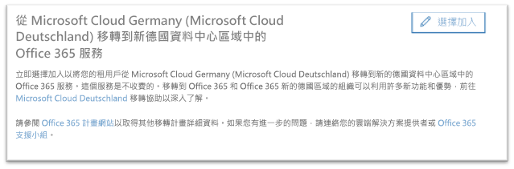
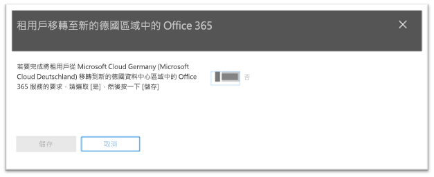
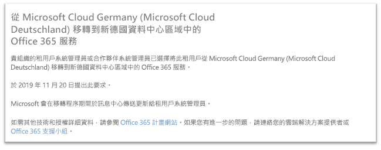

# 如何選擇加入從 Microsoft Cloud Germany (Microsoft Cloud Deutschland) 到新德國資料中心區域中的 Office 365 服務的移轉。How to opt-in for migration from Microsoft Cloud Germany (Microsoft Cloud Deutschland) to Office 365 services in the new German datacenter regions

>[!Note]
>本文僅適用於符合資格的 Microsoft Cloud Germany/Deutschland 客戶。This article only applies to eligible Microsoft Cloud Germany/Deutschland customers.
>

## 如何要求移轉How to request migration

使用以 Microsoft Cloud Germany 佈建之服務的的合格客戶，將會在 Microsoft 365 系統管理中心看到一個頁面，可讓客戶租用戶系統管理員選擇加入移轉。Eligible customers with service provisioned in Microsoft Cloud Germany will see a page in the Microsoft 365 admin center that will allow a customer tenant administrator to opt-in for migration.

若要在 Microsoft 365 系統管理中心中存取該頁面，請在左側的 [功能窗格] 中展開 [設定]\*\*\*\*，然後按一下 [組織設定檔]\*\*\*\*。To access the page in the Microsoft 365 admin center, in the navigation pane on the left, expand **Settings** and then click **Organization Profile**.

在 [組織設定檔]\*\*\*\* 頁面上，往下捲動到 [從 Microsoft Cloud Germany (Microsoft Cloud Deutschland) 移轉到新德國資料中心區域中的 Office 365 服務]\*\*\*\* 區段。On the **Organization Profile** page, scroll down to the **Migrate from Microsoft Cloud Germany (Microsoft Cloud Deutschland) to Office 365 services in the new German datacenter regions** section.

如果您的組織想從 Microsoft Cloud Germany (Microsoft Cloud Deutschland) 移轉到新德國資料中心區域中的 Office 365 服務，請按一下 [選擇加入]\*\*\*\*。If your organization wishes to migrate your service from Microsoft Cloud Germany (Microsoft Cloud Deutschland) to Office 365 services in the new German datacenter regions, click **Opt-in**.
 

畫面右邊會顯示一個新區段，讓您接受確認。A new section will appear on the right side of your screen to accept your confirmation. 選取切換按鈕為 [是]\*\*\*\*，然後按一下 [儲存]\*\*\*\*。Select the toggle button to **Yes**, and then click **Save**.
 

系統管理員代表您的租用戶選擇加入後，所有系統管理員將在 **[從 Microsoft Cloud Germany (Microsoft Cloud Deutschland) 移轉到新德國資料中心區域中的 Office 365 服務]** 區段中看到確認，包含選擇加入的日期。。Once an administrator has opted-in on behalf of your tenant then all administrators will see the confirmation in **Migrate from Microsoft Cloud Germany (Microsoft Cloud Deutschland) to Office 365 services in the new German datacenter regions** section, including the date of opt-in. 系統管理員也會在 Microsoft 365 系統管理中心的訊息中心收到確認。Administrators will also receive a confirmation in Message Center of the Microsoft 365 admin center. 
 

## 選擇加入移轉後，會發生什麼情況？What happens after opting-in for migration?

如果組織選擇加入由 Microsoft 主導的方式，預期會在 2020 年進行移轉。Migrations are expected to take place in 2020 for organizations that opt-in to the Microsoft-driven approach.  移轉之後，核心客戶資料和訂閱都會移至新的德國區域。As a result of the migration, core customer data and subscriptions are moved to the new German regions.  在移轉程序期間，Microsoft 會於訊息中心傳送最新資訊。Microsoft will send updates throughout the migration process in Message Center.

## 詳細資訊More information

- [Microsoft Cloud Deutschland 移轉協助Microsoft Cloud Deutschland Migration Assistance](https://aka.ms/germanymigrateassist)
- [適用於 Microsoft Cloud Deutschland 客戶的 Office 365 移轉程式Office 365 migration program for Microsoft Cloud Deutschland customers](https://aka.ms/office365germanymove)
- [適用於 Microsoft Cloud Deutschland 客戶的 Dynamics 365 移轉程式Dynamics 365 migration program for Microsoft Cloud Deutschland customers](https://aka.ms/d365ceoptin)
- [適用於 Microsoft Cloud Deutschland 客戶的 Power BI 移轉程式Power BI migration program for Microsoft Cloud Deutschland customers](https://aka.ms/pbioptin)
- 使用「需要協助嗎？」連結來提交問題Submit questions using the “Need Help?” (在 [Microsoft 365 系統管理中心](https://portal.office.de/)中)。link of the [Microsoft 365 admin center](https://portal.office.de/)
