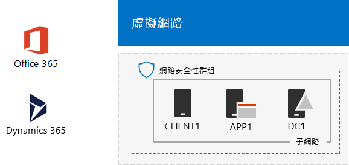

# Office 365 和 Dynamics 365 開發/測試環境

 **摘要：** 將 Dynamics 365 新增至 Office 365 開發人員/測試環境中使用此測試實驗室指南。
  
使用本文中的指示，新增 [Dynamics 365 試用版訂閱至 Office 365 開發人員/測試環境中，相同的組織建立 Office 365 和 Dynamics 365 開發人員/測試環境。

  
  
您可以使用 Dynamics 365 試用版訂閱示範 Dynamics 365 的特性與功能。下列的解決方案所含 Dynamics 365 計劃 1，Enterprise Edition 試用版：
  
- [Microsoft Dynamics 365 的銷售量](https://www.microsoft.com/dynamics365/sales)。增加您銷售自動化及數位智慧協助您保持著重並聰明工作的銷售人員。
    
- [Microsoft Dynamics 365 客戶服務](https://www.microsoft.com/dynamics365/customer-service)。獲得忠誠，讓您代理程式的完整資訊及數位智慧需要提供一致的服務。
    
- [Microsoft Dynamics 365 欄位服務](https://www.microsoft.com/dynamics365/field-service)。最佳化您的排程、 equipping 工作團隊，並使用預測的工具來增加利潤主機服務通話。
    
- [Microsoft Dynamics 365 的 Project 服務自動化](https://www.microsoft.com/en-us/dynamics365/project-service-automation)。成功完成專案並建立與提高工作效率的員工和智慧型工具獲利關係。
    
您可以探索一或多個以上的 Dynamics 365 試用版訂閱。
  

  
> [!TIP]
> 按一下[這裡](http://aka.ms/catlgstack)，可查看 One Microsoft Cloud 測試實驗室指南堆疊中文件的所有視覺對應。
  
## 階段 1：建置輕量型或模擬的企業 Office 365 開發/測試環境

如果您只是要測試的基本需求的輕量型方式的 Office 365 和 Dynamics 365，請在階段 2 和 3 的[Office 365 開發人員/測試環境](office-365-dev-test-environment.md)中遵循的指示。
  
如果您想要測試的模擬企業的 Office 365 和 Dynamics 365，請遵循[DirSync Office 365 開發人員/測試環境](dirsync-for-your-office-365-dev-test-environment.md)中的指示。

  
> [!NOTE]
> 本文中的設定不需要模擬的 enterprise 開發人員/測試環境中，其中包含連線至網際網路模擬內部網路和 Windows Server AD 樹系目錄同步處理。它會提供這裡是做為選項，讓您可以試驗 Office 365 和 Dynamics 365 代表的典型組織的環境中。 
  
## 階段 2： 新增 Dynamics 365 試用版訂閱

在此階段中，您註冊 Dynamics 365 試用版訂閱並將其新增至您的 Office 365 試用版訂閱相同的組織。
  
### 註冊 Dynamics 365 試用版訂閱

1. 在 [您的桌上型電腦 （輕量型） 使用瀏覽器或從 CLIENT1 （模擬企業） 登入 Office 365 入口網站[https://portal.office.com](https://portal.office.com)以全域管理員帳戶的認證。
    
2. 按一下 [管理]**** 磚。
    
3. 在 [Office 系統管理中心]**** 索引標籤上，按一下左導覽中的 [計費] > [購買服務]****。
    
4. 在 [購買服務]**** 頁面上，尋找 [Dynamics 365 方案 1 企業版]**** 項目。將滑鼠指標停留在上面，並且按一下 [開始免費試用] ****。
    
5. 在 [確認訂單]**** 頁面上，按一下 [立即試用]****。
    
6. 在 [訂單收據]**** 頁面上，按一下 [繼續]****。

    
> [!NOTE]
> Dynamics 365 方案 1 企業版試用訂閱是 30 天。您可以輕鬆地將試用訂閱延長額外 30 天的時間。針對永久開發/測試環境，建立內含少量授權的新付費訂閱。 
  
## 階段 3： 指派 Dynamics 365 授權和系統管理員

在此階段中，您將 Dynamics 365 授權指派給全域管理員、 使用者 2 及 3 使用者帳戶，並使其系統管理員。
  
使用下列步驟來指派 Dynamics 365 授權。
  
1. 在 [Office 系統管理中心]**** 索引標籤上，按一下 [使用者] > [作用中的使用者]****。
    
2. 在作用中使用者清單中，按一下全域系統管理員帳戶，然後按一下 [產品授權]**** 的 [編輯] ****。
    
3. 在 [產品授權] **** 窗格中，將 [Dynamics 365 方案 1 企業版]**** 的產品授權設為 [開啟]****，按一下 [儲存]****，然後按兩次 [關閉]****。
    
4. 對使用者 2 和使用者 3 帳戶執行步驟 2 和 3。
    
5. 關閉 [Office 系統管理中心]**** 索引標籤。
    
使用這些步驟，將使用者 2 和使用者 3 帳戶設定為 Dynamics 365 系統管理員。
  
1. 從**Microsoft Office Home** ] 索引標籤上，按一下 [**管理**]。
    
2. 在**Office 系統管理中心**] 索引標籤的左方導覽，按一下 [**系統中心**，和 [ **Dynamics 365**。
    
    您可能需要等待 Dynamics 365 完成佈建，Dynamics 365 才會顯示在功能表中。
    
3. 在 [Dynamics 365] 索引標籤上，按一下 [這些所有]****，然後按一下 [完成安裝]****。
    
    請等候安裝完成。
    
    安裝完成後，就會顯示根據屬於試用訂閱之範例資料的銷售活動儀表板。花幾分鐘來檢視**歡迎使用試用版**影片。完成時關閉 [影片] 視窗。
    
4. 在頂端的工具列上，按一下 [銷售]**** 旁的向下箭號，按一下 [設定]****，然後按一下 [安全性]****。
    
5. 在 [安全性]**** 頁面，按一下 [使用者] ****。
    
6. 在使用者清單中，按一下 [使用者 2]****。
    
7. 在工具列中，按一下 [管理角色]****。
    
8. 在 [管理角色]****，按一下 [系統管理員]****，然後按一下 [確定]****。
    
9. 在頂部的工具列上按一下 [安全性]****。
    
10. 對使用者 3 帳戶重複步驟 5 至 8。
    
11. 關閉 [使用者：User3]**** 索引標籤。
    
> [!NOTE]
> Office 365 全域系統管理員帳戶已自動指派 Dynamics 365 系統管理員角色。 
  
Office 365 和 Dynamics 365 開發人員/測試環境現在有：
  
- Office 365 E5 Enterprise 和 Dynamics 365 試用版訂閱共用相同的組織與相同的 Azure AD 租用戶與您的使用者帳戶的清單。
    
- 您的全域企業系統管理員、 使用者 2 和 3 使用者帳戶能夠使用 Office 365 E5 Enterprise 和 Dynamics 365 且 Dynamics 365 系統管理員。
    
## 下一步

設定及示範 [Office 365 與 Dynamics 365 共同運作方式與[Office 365 和 Dynamics 365 開發人員/測試環境的 Exchange Online 整合](exchange-online-integration-for-your-office-365-and-dynamics-365-dev-test-enviro.md)的 Exchange Online 信箱。
  
## 另請參閱

[雲端採用測試實驗室指南 (TLG)](cloud-adoption-test-lab-guides-tlgs.md)
  
[基底組態開發/測試環境](base-configuration-dev-test-environment.md)
  
[Office 365 開發/測試環境](office-365-dev-test-environment.md)
  
[Office 365 開發/測試環境的 DirSync](dirsync-for-your-office-365-dev-test-environment.md)

[Dynamics 365 訂閱管理 (線上)](https://technet.microsoft.com/library/jj679903.aspx)
  
[管理 Dynamics 365](https://technet.microsoft.com/library/dn531101.aspx)

