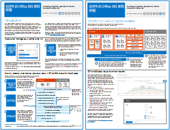

# GDPR 的 office 365 資訊保護Office 365 Information Protection for GDPR

 **摘要：**此解決方案示範如何保護敏感資料儲存在 Office 365 服務中。**Summary:** This solution demonstrates how to protect sensitive data that is stored in Office 365 services.
  
此解決方案包括探索、 將要分類、 保護、 及監視個人資料的規定建議。此解決方案會使用一般的資料保護法規 (GDPR) 做為範例，但是您可以套用相同的程序以達到遵守許多其他規定。This solution includes prescriptive recommendations for discovering, classifying, protecting, and monitoring personal data. This solution uses General Data Protection Regulation (GDPR) as an example, but you can apply the same process to achieve compliance with many other regulations.

  
[PDF](http://download.microsoft.com/download/E/C/D/ECD5A339-EF10-4420-B3A9-99098884D716/MSFT_Cloud_architecture_information protection for GDPR.pdf)  | [Visio](http://download.microsoft.com/download/E/C/D/ECD5A339-EF10-4420-B3A9-99098884D716/MSFT_Cloud_architecture_information protection for GDPR.vsdx)[PDF](http://download.microsoft.com/download/E/C/D/ECD5A339-EF10-4420-B3A9-99098884D716/MSFT_Cloud_architecture_information protection for GDPR.pdf)  | [Visio](http://download.microsoft.com/download/E/C/D/ECD5A339-EF10-4420-B3A9-99098884D716/MSFT_Cloud_architecture_information protection for GDPR.vsdx)
  

## See AlsoSee Also

[安全性解決方案Security solutions](security-solutions.md)
  
[Microsoft 安全性指導政治活動、 非營利機構，以及其他靈活的組織Microsoft Security Guidance for Political Campaigns, Nonprofits, and Other Agile Organizations](microsoft-security-guidance-for-political-campaigns-nonprofits-and-other-agile-o.md)

