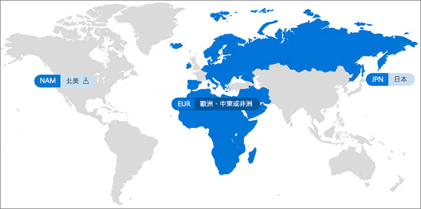

# Office 365 多地理位置

使用 Office 365 多地理位置，您的組織可以將 Office 365 存在狀態擴展到現有租用戶中的多個地理區域和/或國家/地區。 聯繫您的 Microsoft 客戶小組，以註冊跨國公司的 Office 365 多地理位置。
  
您可以使用 Office 365 多地理位置，來佈建待用資料並將資料儲存在您所選擇之符合資料常駐要求的地理位置，和同時將現代化生產力體驗逐步拓展至您的員工。

#### 影片：介紹 Office 365 的多地理位置

> [!VIDEO https://www.microsoft.com/en-us/videoplayer/embed/RE1Yk6B?autoplay=false]

在多地理位置環境中，Office 365 租用戶包含一個中央位置(最初佈建 Office 365 訂閱的位置) 和一個或多個衛星位置。 在多地理位置租用戶中，地理位置、群組和使用者資訊的相關資訊掌握在 Azure Active Directory (AAD) 中。 由於您的租用戶資訊會集中管理並同步到每個地理位置，若要共用及體驗，公司的每一位員工都必須擁有全域概念。

請注意，Office 365 多地理位置主要不是為效能最佳化優化而設計，其主要設計目的在滿足資料落地要求。 如需 Office 365 的效能最佳化的詳細資訊，請參閱 [ Office 365 的網路規劃與效能調整](https://support.office.com/article/e5f1228c-da3c-4654-bf16-d163daee8848)或連絡客戶支援小組。

## 詞彙

以下是用於說明 Office 365 多地理位置的重要詞彙：

- **中央位置** - 佈建租用戶的原始地理位置。
- **地理位置管理員** - 系統管理員，可以管理一或多個指定的衛星位置。
- **地理位置代碼** - 表示特定地理位置的三個字母代碼。
- **地理位置** – 用於在多地理位置租用戶中主控資料的地理位置，包括 Exchange 信箱以及 OneDrive 和 SharePoint 網站。
- **慣用的資料位置 (PDL)** - 由系統管理員設定的使用者屬性，表示應佈建使用者 Exchange 信箱和 OneDrive 的地理位置。 PDL 還可決定要在哪裡佈建使用者建立的 SharePoint 網站。
- **衛星位置** – 在多地理位置租用戶中啟用地理感知 Office 365工作量 (SharePoint、OneDrive和 Exchange) 的地理位置。
- **租用戶** – 組織在 Office 365 中的呈現方式，通常會有與其相關聯的一個或多個網域 (例如 contoso.com)。

## Office 365 多地理位置可用性

目前在這些地區與國家中提供 Office 365 多地理位置：

[!INCLUDE [Office 365 Multi-Geo locations](includes/office-365-multi-geo-locations.md)]

## 快速入門

按照這些步驟來開始使用多地理位置：

1. 與您的帳戶小組合作以新增 _Office 365 中的多地理位置功能_服務方案。他們會引導您新增所需的授權數目。

   開始使用 Office 365 多地理位置之前，Microsoft 必須先設定您的 Exchange Online 租用戶，以支援多地理位置。 當您訂購 *Office 365 中的多地理位置功能*服務方案，並於租用戶中顯示授權之後，將觸發此一次性設定程序。 套用多地理位置授權之後，您會在 [Office 365 訊息中心](https://support.office.com/article/38FB3333-BFCC-4340-A37B-DEDA509C2093)收到通知，然後就可以開始進行設定並使用 Office 365 多地理位置功能。

2. 閱讀[規劃多地理位置環境](plan-for-multi-geo.md)。

3. 深入了解[管理多地理位置環境](administering-a-multi-geo-environment.md)與[使用者會遇到的環境](multi-geo-user-experience.md)。

4. 當您準備好設定 Office 365 多地理位置，請[設定租用戶以支援多地理位置](multi-geo-tenant-configuration.md)。

5. [設定搜尋](configure-search-for-multi-geo.md)。

## 另請參閱

[Aka.ms/GoMultiGeo ](https://Aka.ms/GoMultiGeo)

[OneDrive 和 SharePoint Online 中的多地理位置功能](multi-geo-capabilities-in-onedrive-and-sharepoint-online-in-office-365.md)

[Exchange Online 中的多地理位置功能](multi-geo-capabilities-in-exchange-online.md)
