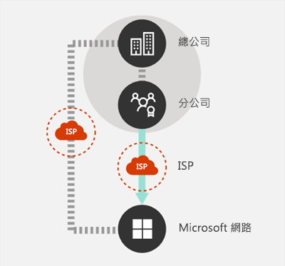
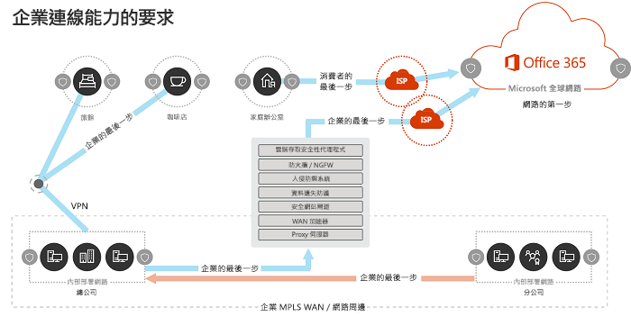
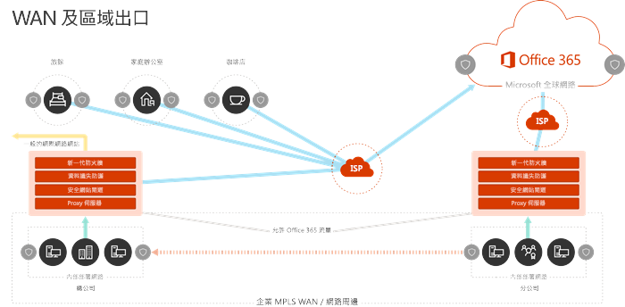
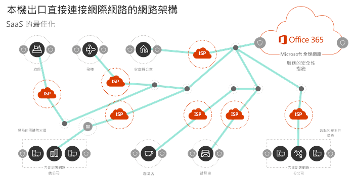
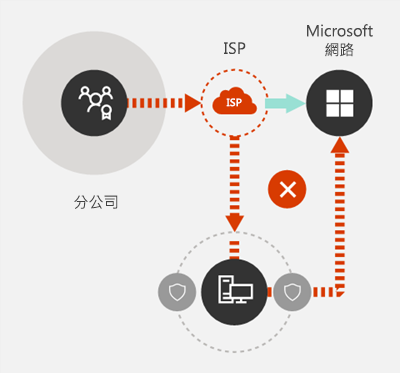
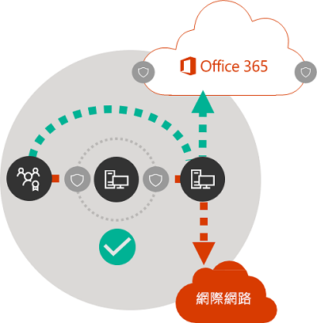

# Office 365 網路連線原則

開始規劃您的 Office 365 網路連線的網路之前，請務必了解連線原則可安全地管理 Office 365 流量和快速獲得最佳效能。本文可協助您了解可安全地最佳化 Office 365 網路連線的最新的指引。
  
繁體中文企業網路的設計被用主要來提供使用者存取應用程式和資料的 21vianet 公司資料中心主控具有強式周邊安全性。繁體中文模型假設使用者會存取應用程式與公司網路外圍內的資料透過 WAN 連結從分公司，或從遠端透過 VPN 連線。 
  
Saas 和應用程式例如 Office 365 採用移動一些組合的服務和周邊網路以外的資料。最佳化，而使用者和 saas 和應用程式之間的流量受限於封包檢查、 網路 hairpins、 由於意外連線到遠距端點及其他因素所引進的延遲。您可以確保最佳的 Office 365 效能與可靠性瞭解並實作關鍵最佳化指導方針。
  
在本文中，您將了解：
  
- [Office 365 架構](office-365-network-connectivity-principles.md#BKMK_Architecture)時套用至雲端的客戶連線
- 更新的[Office 365 連線準則](office-365-network-connectivity-principles.md#BKMK_Principles)及策略最佳化網路流量和使用者經驗
- [Office 365 端點 web 服務](office-365-network-connectivity-principles.md#BKMK_WebSvc)，可讓網路系統管理員可以使用結構化的使用中網路最佳化的端點清單
- [全新的 Office 365 端點類別](office-365-network-connectivity-principles.md#BKMK_Categories)和最佳化指引
- [比較網路周邊證券的結束點安全性](office-365-network-connectivity-principles.md#BKMK_SecurityComparison)
- Office 365 流量[累加最佳化](office-365-network-connectivity-principles.md#BKMK_IncOpt)選項

## Office 365 架構

Office 365 是提供產能與共同作業案例透過各式各樣的微服務及應用程式，例如 Exchange Online、 SharePoint Online 的商務 Online、 Microsoft Skype 分散式的軟體為-a-服務 (SaaS) 雲端小組、 Exchange Online Protection、 Office Online 及許多其他人。當特定 Office 365 應用程式可能會有其獨特功能套用至客戶網路並連線至雲端時，所有階級一些重要的主體、 目標與架構模式。這些主體及連線的架構模式是一般的許多其他 saas 和雲朵和同時正在截然不同的平台為-a-服務和基礎結構以-a-服務雲朵，例如 Microsoft 的一般部署模型Azure。
  
其中一個 Office 365 （也就是通常會未接或誤解網路規劃者） 的最重要的架構功能是它是真正的全球化的分散式的服務，使用者如何連線至該內容中。目標 Office 365 租用戶的位置，請務必了解的客戶資料儲存在雲端中的所在位置，但與 Office 365 的使用者經驗不涉及直接連線至包含資料的磁碟。Office 365 （包括效能、 可靠性及其他重要品質特性） 的使用者體驗需要透過向外延展跨 Microsoft 位置數百全世界高度分散的服務前方門連線。在大多數的情況下，讓客戶網路將路由使用者要求傳送到最接近的 Office 365 服務進入點，而不是透過的集中位置或地區輸出點連線至 Office 365 來進行最佳使用者經驗。
  
大部分客戶，Office 365 使用者會分散於許多位置。若要獲得最佳結果，本文件所述的準則應該要搜尋在從向外延展 （不向外延展） 的觀點，著重在最佳化連線至最接近點的 Microsoft 通用網路中的目前狀態，而不是地理Office 365 租用戶的位置。基本上，這表示即使 Office 365 租用戶資料可能會儲存在特定的地理位置，該承租人的 Office 365 經驗會維持分散式且可以很接近出現在 （網路） 接近承租人具有每個使用者位置.
  
## Office 365 連線原則

Microsoft 建議以達到最佳的 Office 365 連線能力與效能的原則如下。使用下列 Office 365 連線原則來管理您的流量，並連線至 Office 365 時取得最佳效能。
  
網路設計中的主要目標應該是以延遲降至最低降低的來回時間 (RTT) 從您的網路到 Microsoft 通用網路、 連接 Microsoft 資料中心的所有具備低延遲的 Microsoft 的公用網路骨幹部署及雲端擴張全球各地的應用程式進入點。您可以深入了解在[如何 Microsoft 是以其快速且可靠的通用網路](https://azure.microsoft.com/en-us/blog/how-microsoft-builds-its-fast-and-reliable-global-network/)Microsoft 通用網路。
  
### 識別及區分不同 Office 365 的流量

  
用來識別 Office 365 網路流量是可從一般網際網路繫結網路流量區分該流量的第一個步驟。Office 365 連線可最佳化藉由實作的方式類似網路路由最佳化、 防火牆規則、 瀏覽器 proxy 設定及旁路特定端點的網路檢查裝置的組合。
  
舊版的 Office 365 最佳化指導分成兩個類別的**必要**及**選用**Office 365 端點。為端點已新增至新的 Office 365 服務與功能支援，我們已重新 Office 365 端點組織成三種類別： **Optimize**、**允許**及**預設值**。每個類別的指導方針適用於所有端點中的類別進行最佳化容易瞭解並實作。 
  
如需 Office 365 端點類別和最佳化方法的詳細資訊，請參閱 ＜[新的 Office 365 端點類別](office-365-network-connectivity-principles.md#BKMK_Categories)] 區段。
  
Microsoft 現在將所有的 Office 365 端點發佈成 web 服務並提供如何最佳使用此資料的指導。如需如何以擷取及使用 Office 365 端點的詳細資訊，請參閱[Office 365 Url 和 IP 位址範圍](https://support.office.com/en-us/article/office-365-urls-and-ip-address-ranges-8548a211-3fe7-47cb-abb1-355ea5aa88a2?ui=en-US&amp;rs=en-US&amp;ad=US)。
  
### 在本機上輸出網路連線

  
本機 DNS 和網際網路的輸出是重要性的進入的嚴重降低連線延遲和確保使用者會連線到最接近點至 Office 365 服務。在複雜的網路拓撲中，請務必一起實作本機 DNS 和本機網際網路的輸出。如需 Office 365 如何路由的用戶端連線到最接近的進入點的詳細資訊，請參閱[用戶端連線](https://support.office.com/en-us/article/client-connectivity-4232abcf-4ae5-43aa-bfa1-9a078a99c78b)。
  
在雲端服務，例如 Office 365 推出、 之前使用者為網路架構設計因素的網際網路連線已相當簡單。當網際網路服務及網站會分散對齊遍時、 公司輸出點與任何指定的目的地端點之間的延遲是主要地理距離函數。
  
在傳統網路架構，所有輸出的網際網路連線周遊公司網路中，並從集中位置的輸出。如有變種 Microsoft cloud 方案、 分散式的網際網路對向網路架構已經成為重要支援延遲機密雲端服務。設計 Microsoft 通用網路是以容納延遲需求與分散式服務前方門基礎結構，將雲端服務的傳入連線路由傳送至最接近的進入點動態 fabric 通用的進入點。這被預定減少"最後一個哩"的長度 Microsoft cloud 客戶的有效縮短客戶與雲端之間的路由。
  
企業 Wan 通常被設計用於檢查前輸出至網際網路，通常是透過一或多個 proxy 伺服器的中央公司 head office backhaul 網路流量。下圖說明這類的網路拓撲。
  

  
因為 Microsoft 通用網路，包括全球各地的前端伺服器、 上執行 Office 365 通常會在前端伺服器接近使用者的位置。提供本機網際網路輸出，藉由設定內部 DNS 伺服器，以提供 Office 365 端點的本機名稱解析目的地 for Office 365 的網路流量可以連線到盡可能給使用者的 Office 365 的前端伺服器。下圖顯示可讓使用者從主要的 office、 分公司及遠端位置連接至最接近的 Office 365 進入點執行的最短的路由的網路拓撲範例。
  

  
縮短的網路路徑至 Office 365 進入點以這種方式可以改善連線的效能與使用者體驗 Office 365 中可以同時協助減少對 Office 365 效能網路架構的未來變更的影響和可靠性。
  
此外，如果回應的 DNS 伺服器是距或忙碌 DNS 要求可以引進延遲。您可以延遲降至最低名稱解析佈建本機 DNS 伺服器分公司位置中的，確定它們適當地設定為快取的 DNS 記錄。
  
指定連線模型時區域的輸出可以適用於 Office 365，是以永遠提供使用者的位置，不論是否將在公司網路或遠端位置，例如 home、 旅館、 咖啡廳網路輸出和機場。在下圖表示此本機直接輸出模型。
  

  
已採用 Office 365 企業版可以利用的 Microsoft 通用網路分散式服務前方門架構確保使用者連線至 Office 365 至最接近的 Microsoft 通用網路項目執行的最短的可能路由點。本機輸出網路架構執行方法是讓 Office 365 流量路由傳送透過最接近的輸出，不論使用者的位置。
  
本機輸出架構透過傳統模型具有下列優點：
  
- 提供 Office 365 的最佳效能最佳化路由長度。分散式服務前方門基礎結構的使用者連線動態路由傳送至最接近的 Office 365 進入點。
- 允許本機輸出減少公司網路基礎結構的負載。
- 保護連線兩端上的利用用戶端端點安全性與雲端安全性功能。

### 避免網路 hairpins

  
為一般的規則的縮圖、 使用者和最接近的 Office 365 端點之間的最短、 最直接路由會適時提供最佳效能。網路髮夾所發生的情況時 WAN 或 VPN 流量繫結的特定目的地先導向至另一個中間的位置 （例如安全性堆疊、 cloud 存取 broker 的雲端架構 web 閘道）、 延遲和潛在的重新導向至簡介依地理位置距端點。網路 hairpins 也會造成路由/對等的無效率或不盡理想 （遠端） 的 DNS 查詢中。
  
若要確保 Office 365 連線不網路 hairpins 即使在本機輸出案例中，檢查是否可用於提供使用者位置的網際網路輸出有直接的對等關係與 Microsoft 通用網路中的 ISP 關閉接近該位置。您也要設定輸出路由傳送至直接傳送受信任的 Office 365 流量，而非代理或透過協力廠商雲端或雲端式網路安全性廠商通道可處理網際網路繫結流量。Office 365 端點本機 DNS 名稱解析有助於確保該除了直接路由最接近的 Office 365 進入點用於使用者連線。
  
如果您使用雲端型網路或 Office 365 流量的安全性服務，請確定 hairpinning 效果評估並瞭解其對 Office 365 效能的影響。這可以透過號碼和服務提供者位置透過此關聯性的分公司和 Microsoft 通用網路對等點品質的網路對等之間的關係的數字轉送流量的檢查完成您的 ISP 和 Microsoft、 與 backhauling 服務提供者基礎結構中的效能影響服務提供者。
  
由於分散式位置與 Office 365 的進入點及向使用者及其鄰近大型數目，路由到任何協力廠商網路或安全性提供者的 Office 365 流量對可能造成負面的影響 Office 365 的連線如果提供者網路不為取得最佳的 Office 365 對等設定。
  
### 略過 proxy 流量檢查裝置及重複安全性技術

  
企業客戶應該檢閱其網路安全性和風險減少方法特別針對 Office 365 結合流量，以減少其對侵入式依賴、 且會影響、 效能及昂貴的網路安全性使用 Office 365 的安全性功能Office 365 技術的網路流量。
  
大部分的企業網路強制使用 like proxy、 SSL 檢查、 封包檢查及資料遺失防護系統技術的網際網路流量的網路安全性。這些技術提供一般的網際網路要求降低重要的風險，但可大幅減少效能、 延展性及套用至 Office 365 端點時的使用者體驗的品質。
  
#### Office 365 端點 web 服務

Office 365 系統管理員可以使用指令碼或 REST 通話以結構化來自 Office 365 端點的端點清單中取用 web 服務並更新周邊防火牆的設定和其他網路裝置。如此可確保結合 Office 365 的流量會識別、 適當地視為及不同 managed 從一般和通常未知的網際網路網站的繫結的網路流量。如需如何使用 Office 365 端點的詳細資訊的 web 服務，請參閱 ＜ [Office 365 Url 和 IP 位址範圍](https://support.office.com/en-us/article/office-365-urls-and-ip-address-ranges-8548a211-3fe7-47cb-abb1-355ea5aa88a2?ui=en-US&amp;rs=en-US&amp;ad=US)。
  
#### PAC （Proxy 自動設定） 指令碼

Office 365 系統管理員可以建立可傳送到使用者電腦透過 WPAD 或 GPO 的 PAC （Proxy 自動設定） 指令碼。若要略過 proxy WAN 或 VPN 使用者的 Office 365 要求允許使用直接網際網路連線的 Office 365 流量，而不必透過公司網路可用 PAC 指令碼。
  
#### Office 365 的安全性功能

Microsoft 是透明的相關資料中心安全性、 操作的安全性與 Office 365 伺服器和及其所代表之網路端點周圍的風險減少。Office 365 內建安全性功能可供以減少網路安全性風險，例如資料外洩防護、 防毒、 多重要素驗證、 客戶鎖定] 方塊、 進階威脅保護、 Office 365 威脅智慧、 Office 365 安全分數、 Exchange Online 保護及網路 DDOS 安全性。
  
如需有關 Microsoft 資料中心與通用網路安全性的詳細資訊，請參閱[Microsoft 信任中心](https://www.microsoft.com/en-us/trustcenter/security)。
  
## 新的 Office 365 端點類別

Office 365 端點代表具有不同的網路位址和子網路。端點可能是 Url 的 IP 位址或 IP 範圍，而且某些端點會列出具有特定的 TCP/UDP 連接埠。Url 可以是像*account.office.net* 、 FQDN 或萬用字元 URL like * \*。 office365.com*。
  
> [!NOTE]
> Office 365 端點的網路內的位置是不直接與相關的 Office 365 租用戶資料的位置。基於此客戶應該查看 Office 365 以分散式和全域服務並不應該嘗試以封鎖根據地理準則的 Office 365 端點的網路連線。
  
管理 Office 365 流量我們先前指引，在端點所組織成兩個**必要**及**選用**的類別。許多客戶面臨的調整的 Office 365 Url 和 IP 位址的完整清單相同網路最佳化的應用程式的挑戰和每個類別中的端點所需根據重要性不同的最佳化的服務]。 
  
在新模型中，端點分為三種類別，**最佳化**、**所需**和**預設值**，在焦點網路最佳化致力於實現最佳的效能改進的位置上提供的優先順序為基礎之樞紐分析表和會傳回投資報酬。端點合併為基礎的案例的網路品質、 大量及效能信封及簡化的實作有效的使用者體驗的敏感度上述類別中。建議的最佳化可套用至指定的類別中的所有端點的相同方式。
  
- **最佳化**端點所需的每一個 Office 365 服務的連線和代表超過 75%的 Office 365 頻寬、 連線和資料量。這些端點代表寫至網路效能、 延遲及可用性的 Office 365 案例。所有端點會都裝載於 Microsoft 資料中心。預期的變更到這個類別的端點速度會能更加低於其他兩個類別的端點。此類別包含 Url 和 IP 子網路定義的組專用商務 Online 及 Microsoft 小組例如 Exchange Online、 SharePoint Online、 Skype 核心 Office 365 工作負載的機碼非常小 （依照順序 ~ 10) 設定。

    定義良好的要徑端點緊縮的清單應協助您規劃及實作更快且更容易這些目的地的價值高網路最佳化。

    *最佳化*端點的範例包括*https://outlook.office365.com*、 *https://\<租用戶\>。 sharepoint.com*和*https://\<租用戶\>-my.sharepoint.com* 。

    最佳化方法包括：

  - 略過或 whitelist*最佳化*端點網路裝置及執行流量攔截、 SSL 解密、 深入的封包檢查及內容篩選的服務。
  - 略過內部部署 proxy 裝置和常用於一般網際網路瀏覽的雲端式 proxy 服務。
  - 專案的優先順序為完全信任的網路基礎結構和周邊系統這些端點的評估。
  - 排定減少或除去一些的 WAN backhauling 和促進直接分散式架構的網際網路輸出這些端點接近儘可能的使用者/分公司位置位置。
  - 藉由實作分割通道便利直接連線到 VPN 使用者這些雲端端點。
  - 請確定傳回 DNS 名稱解析的 IP 位址符合這些端點的路由輸出路徑。
  - 專案的優先順序 SD WAN 整合直接、 最小延遲路由的 Microsoft 通用網路最接近的網際網路對等點到這些端點。

- **允許**端點所需的連線至特定的 Office 365 服務與功能，但不是以受到網路效能和外出*最佳化*類別中的延遲。從頻寬和連線計數的觀點來看這些端點的整體網路使用量也是大幅較小。這些端點專用於 Office 365 和裝載於 Microsoft 資料中心。代表廣泛的 Office 365 微型服務和其相依性 （依照順序 ~ 100 Url)，且預計會有變更這些*最佳化*類別中率較高。定義專用的 IP 子網路與此類別不是所有端點相關都聯。

    *允許*端點的網路最佳化可改善 Office 365 使用者經驗，但某些客戶會選擇窄降至其網路變更到多個這些最佳化的範圍。

    *允許*端點的範例包括*https://\*。 protection.outlook.com*和*https://accounts.accesscontrol.windows.net*。

    最佳化方法包括：

  - 略過或 whitelist*允許*端點網路裝置及執行流量攔截、 SSL 解密、 深入的封包檢查及內容篩選的服務。
  - 專案的優先順序為完全信任的網路基礎結構和周邊系統這些端點的評估。
  - 排定減少或除去一些的 WAN backhauling 和促進直接分散式架構的網際網路輸出這些端點接近儘可能的使用者/分公司位置位置。
  - 請確定傳回 DNS 名稱解析的 IP 位址符合這些端點的路由輸出路徑。
  - 專案的優先順序 SD WAN 整合直接、 最小延遲路由的 Microsoft 通用網路最接近的網際網路對等點到這些端點。

- **預設**端點代表 Office 365 服務及相依性不需要任何最佳化，且可被視為客戶網路所標準網際網路繫結的流量。請注意此類別中的有些端點可能未裝載於 Microsoft 資料中心。範例包括*https://odc.officeapps.live.com*和*https://appexsin.stb.s-msn.com*。

如需 Office 365 網路最佳化技巧的詳細資訊，請參閱[管理 Office 365 端點](https://support.office.com/en-us/article/managing-office-365-endpoints-99cab9d4-ef59-4207-9f2b-3728eb46bf9a#ID0EAEAAA=0._Overview)。
  
## 比較網路周邊證券的結束點安全性

傳統網路安全性的目標是強化公司網路周邊對入侵和惡意入侵的狀況。為組織採用 Office 365，某些網路服務和資料的部分或完全移轉至雲端。當沒有任何網路架構的基本變更，此程序需要重新評估網路安全性的新因素納入考量的：
  
- 醫療雲端服務、 網路服務和資料分散在內部資料中心與雲端之間和周邊安全性不再適當合用。
- 遠端使用者連線至公司的內部部署資料中心及不控制檔案位置，例如家庭、 飯店及咖啡廳從雲端中的資源。
- 特殊用途的安全性功能會逐漸內建雲端服務和可以可能補充或取代現有的安全性系統。

Microsoft 提供整體範圍的 Office 365 的安全性功能，並提供精準的使用安全性可協助您確保資料和網路安全性的 Office 365 的最佳作法。建議的最佳作法如下：
  
- **使用多重要素驗證 (MFA)** MFA 將額外的保護層級新增至強式密碼策略所需確認撥打的電話、 文字訊息或應用程式上的通知他們的智慧型手機之後正確地輸入其密碼的使用者。

- **使用 Office 365 的雲端應用程式安全性**設定追蹤異常活動並對該原則。設定與 Office 365 雲端應用程式安全性提醒，讓系統管理員可以檢閱不尋常或 risky 使用者活動，例如下載大量的資料，多失敗的登入嘗試或連線從未知或危險的 IP 位址。

- **設定資料遺失防護 (DLP)** DLP 可讓您識別機密資料，並建立原則，協助使用者無法從有意或無意之間共用資料。DLP 的運作方式不同 Office 365 包括 Exchange Online、 SharePoint Online 和 OneDrive，讓使用者能停留相容而不會中斷其工作流程。

- **使用客戶 Lockbox**為 Office 365 系統管理員，您可以使用客戶 Lockbox 控制 Microsoft 支援工程師說明工作階段期間所存取的資料。在其中工程師需要存取資料的疑難排解並修正問題的情況下，客戶 Lockbox 可讓您核准或拒絕存取要求。

- **使用 Office 365 安全分數**安全的分數是建議可以怎麼做以進一步減少風險的安全性分析工具。安全的分數會查看您的 Office 365 設定和活動，並與比較 Microsoft 所建立的基準。您將取得如何對齊的最佳安全性作法為基礎的分數。

增強的安全性全面性方法應包含下列考量：
  
- 移動強調周邊安全性向端點安全性藉由套用 [雲端式與 Office 用戶端安全性功能。
  - 壓縮安全性周邊到資料中心
  - 啟用使用者裝置內的辦公室或遠端位置等同信任
  - 整個計畫重心在保護資料的位置及使用者位置
  - 受管理的使用者機器具備更高的信任關係端點安全性
- 管理資訊的所有安全性，而不著重察覺在周邊網路
  - 重新定義 WAN 及建置周邊網路安全性的允許信任的流量略過安全性裝置與分隔來賓 Wi-fi 網路未受管理的裝置。
  - 減少的公司的 WAN 邊緣網路安全性需求
  - 降低某些網路周邊安全性裝置例如防火牆仍需要但載入
  - 確定本機輸出的 Office 365 流量
- 增強功能可以是[累加最佳化](office-365-network-connectivity-principles.md#BKMK_IncOpt)一節所述的遞增地址。一些最佳化技巧可能會提供較佳的成本/福利比例根據您的網路架構與您應選擇最有意義的組織的最佳化。

如需 Office 365 安全性及規範的詳細資訊，請參閱下列文章[的安全性與 Office 365 的守規概觀](https://support.office.com/en-us/article/overview-of-security-and-compliance-in-office-365-dcb83b2c-ac66-4ced-925d-50eb9698a0b2?ui=en-US&amp;rs=en-US&amp;ad=US)。
  
## 累加最佳化

我們已針對 saas 和表示理想的網路連線模型稍早在本文中，但與過去複雜網路架構的許多大型組織，不會實際直接進行所有這些變更。在本節，我們討論一些可協助增進 Office 365 效能與可靠性的累加變更。
  
網路拓撲與您實作的網路裝置目視方法可讓您最佳化 Office 365 的流量。大型企業與許多位置和複雜的網路安全性作法必須擬定策略包含大部分或所有項目時小型組織可能只會在 [ [Office 365 連線原則](office-365-network-connectivity-principles.md#BKMK_Principles)] 區段中所列的原則需要考慮下列一或兩個。
  
您可以方法最佳化累加的程序，為連續套用每種方法。下表列出使用者最大數目對延遲和可靠性及其影響的順序主要最佳化方法。
  
|**最佳化方法**|**描述**|**影響**|
|:-----|:-----|:-----|
|本機 DNS 解析及網際網路的輸出    |佈建在每個位置中的本機 DNS 伺服器，並確定網際網路盡可能至使用者的位置的 Office 365 的連線輸出。    | 延遲降至最低     改善可靠連線至最接近的 Office 365 進入點    |
|新增地區輸出點    |如果公司網路具有多個位置但只有一個輸出點，新增地區輸出點可讓使用者連線至最接近的 Office 365 進入點。    | 延遲降至最低     改善可靠連線至最接近的 Office 365 進入點    |
|略過 proxy 並檢查裝置    |設定瀏覽器與 Office 365 要求直接傳送到輸出點的 PAC 檔案。    設定 edge 路由器和防火牆以允許不檢查 Office 365 流量。    | 延遲降至最低     減少網路裝置上的負載    |
|啟用直接連線的 VPN 使用者    |VPN 使用者啟用 Office 365 連線來連線直接從使用者的網路而不是透過 VPN 通道藉由實作分割通道。    | 延遲降至最低     改善可靠連線至最接近的 Office 365 進入點    |
|從傳統 WAN 移轉至 SD WAN    |SD Wan （軟體定義寬區域網路） 簡化 WAN 管理並提升效能與虛擬 appliances 合作，類似於 compute 資源使用虛擬機器 (Vm) 的虛擬化取代傳統 WAN 路由器的方式。    | 提升效能及可管理性的 WAN 流量     減少網路裝置上的負載    |
