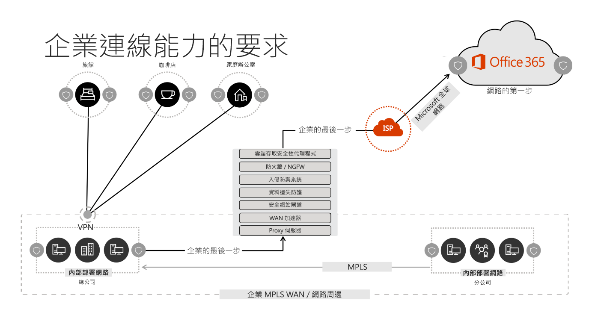
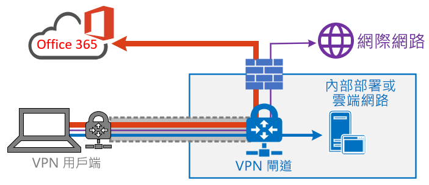

# <a name="implementing-vpn-split-tunnelling-for-office-365"></a><span data-ttu-id="0989d-103">實作 Office 365 的 VPN 分割通道</span><span class="sxs-lookup"><span data-stu-id="0989d-103">Implementing VPN split tunnelling for Office 365</span></span>

>[!NOTE]
><span data-ttu-id="0989d-104">本主題是一組針對遠端使用者處理 Office 365 最佳化的主題之一。</span><span class="sxs-lookup"><span data-stu-id="0989d-104">This topic is part of a set of topics that address Office 365 optimization for remote users.</span></span>
>- <span data-ttu-id="0989d-105">如需使用 VPN 分割通道來最佳化遠端使用者的 Office 365 連線的概觀，請參閱[概觀：Office 365 的 VPN 分割通道](office-365-vpn-split-tunnel.md)。</span><span class="sxs-lookup"><span data-stu-id="0989d-105">For an overview of using VPN split tunnelling to optimize Office 365 connectivity for remote users, see [Overview: VPN split tunnelling for Office 365](office-365-vpn-split-tunnel.md).</span></span>
>- <span data-ttu-id="0989d-106">如需針對中國使用者最佳化 Office 365 全球租用戶效能的相關資訊，請參閱 [Office 365 針對中國使用者的效能最佳化](office-365-networking-china.md)。</span><span class="sxs-lookup"><span data-stu-id="0989d-106">For information about optimizing Office 365 worldwide tenant performance for users in China, see [Office 365 performance optimization for China users](office-365-networking-china.md).</span></span>

<span data-ttu-id="0989d-107">多年以來，企業一直使用 VPN 來支援其使用者的遠端體驗。</span><span class="sxs-lookup"><span data-stu-id="0989d-107">For many years enterprises have been using VPNs to support remote experiences for their users.</span></span> <span data-ttu-id="0989d-108">當核心工作負載保留於內部部署時，從遠端用戶端透過公司網路上資料中心路由傳送的 VPN 是遠端使用者存取企業資源的主要方法。</span><span class="sxs-lookup"><span data-stu-id="0989d-108">Whilst core workloads remained on-premises, a VPN from the remote client routed through a datacenter on the corporate network was the primary method for remote users to access corporate resources.</span></span> <span data-ttu-id="0989d-109">為了保護這些連線，企業會沿著 VPN 路徑建立數層的網路安全解決方案。</span><span class="sxs-lookup"><span data-stu-id="0989d-109">To safeguard these connections, enterprises build layers of network security solutions along the VPN paths.</span></span> <span data-ttu-id="0989d-110">這是為了保護內部基礎結構，並將流量重新路由傳送到 VPN，然後透過內部部署網際網路周邊送出，以保護外部網站的行動流覽。</span><span class="sxs-lookup"><span data-stu-id="0989d-110">This was done to protect internal infrastructure as well as to safeguard mobile browsing of external web sites by rerouting traffic into the VPN and then out through the on-premises Internet perimeter.</span></span> <span data-ttu-id="0989d-111">VPN、網路周邊和相關聯的安全性基礎結構通常是專為明確的流量進行建置和調整，大多數的連線能力通常起始自公司網路，而大部分的連線能力都未超過內部網路界限。</span><span class="sxs-lookup"><span data-stu-id="0989d-111">VPNs, network perimeters and associated security infrastructure were often purpose built and scaled for a defined volume of traffic, typically with the majority of connectivity being initiated from within the corporate network, and most of it staying withing the internal network boundaries.</span></span>

<span data-ttu-id="0989d-112">有好長一段時間，只要遠端使用者的並行規模適中，且周遊 VPN 的流量很低，將來自遠端使用者裝置的所有連線傳送回內部部署網路 (也稱為**強制通道**) 的 VPN 模型多半是永續的。</span><span class="sxs-lookup"><span data-stu-id="0989d-112">For quite some time, VPN models where all connections from the remote user device are routed back into the on-premises network (known as **forced tunnelling**) were largely sustainable as long as the concurrent scale of remote users was modest and the traffic volumes traversing VPN were low.</span></span>  <span data-ttu-id="0989d-113">即使在應用程式從公司周邊內部移至公用 SaaS 雲端之後，有些客戶能會如同現狀持續使用 VPN 強制通道，Office 365 就是主要範例。</span><span class="sxs-lookup"><span data-stu-id="0989d-113">Some customers continued to use VPN force tunnelling as the status quo even after their applications moved from inside the corporate perimeter to public SaaS clouds, Office 365 being a prime example.</span></span>

<span data-ttu-id="0989d-114">使用強制通道 VPN 來連線到分散式和效能敏感型雲端應用程式並不太好，但是從安全性的觀點來看，有些企業可能為了維持現狀而接受了其負面影響。</span><span class="sxs-lookup"><span data-stu-id="0989d-114">The use of forced tunneled VPNs for connecting to distributed and performance sensitive cloud applications is extremely suboptimal, but the negative impact of that may have been accepted by some enterprises so as to maintain the status quo from a security perspective.</span></span> <span data-ttu-id="0989d-115">以下是這種情況的範例圖表：</span><span class="sxs-lookup"><span data-stu-id="0989d-115">An example diagram of this scenario can be seen below:</span></span>



<span data-ttu-id="0989d-117">此問題已在數年內持續成長，許多客戶都回報網路流量模式重大轉變。</span><span class="sxs-lookup"><span data-stu-id="0989d-117">This problem has been growing for a number of years, with many customers reporting a significant shift of network traffic patterns.</span></span> <span data-ttu-id="0989d-118">用來保持內部部署的流量現在會連線到外部雲端端點。</span><span class="sxs-lookup"><span data-stu-id="0989d-118">Traffic which used to stay on premises now connects to external cloud endpoints.</span></span> <span data-ttu-id="0989d-119">許多 Microsoft 客戶回報其先前大約有 80% 的網路流量送至某個內部來源 (在上圖中以虛線表示)。</span><span class="sxs-lookup"><span data-stu-id="0989d-119">Numerous Microsoft customers report that previously, around 80% of their network traffic was to some internal source (represented by the dotted line in the above diagram).</span></span> <span data-ttu-id="0989d-120">在 2020 年，該數字現在大約為 20% 或更低，因為他們已將主要工作負載移轉到雲端，這些趨勢在其他企業並不常見。</span><span class="sxs-lookup"><span data-stu-id="0989d-120">In 2020 that number is now around 20% or lower as they have shifted major workloads to the cloud, these trends are not uncommon with other enterprises.</span></span> <span data-ttu-id="0989d-121">經過一段時間，隨著雲端旅程進展，上述模型會變得益加麻煩且不永續，並使組織在移至雲端優先的世界時不太靈活。</span><span class="sxs-lookup"><span data-stu-id="0989d-121">Over time, as the cloud journey progresses, the above model becomes increasingly cumbersome and unsustainable, preventing an organization from being agile as they move into a cloud first world.</span></span>

<span data-ttu-id="0989d-122">全球的 COVID-19 疫情已使此問題提升，而需要立即補救。</span><span class="sxs-lookup"><span data-stu-id="0989d-122">The worldwide COVID-19 pandemic has escalated this problem to require immediate remediation.</span></span> <span data-ttu-id="0989d-123">為了確保員工安全的需求已經對企業 IT 支援大規模在家工作的生產力，產生了空前的需求。</span><span class="sxs-lookup"><span data-stu-id="0989d-123">The need to ensure employee safety has generated unprecedented demands on enterprise IT to support work-from-home productivity at a massive scale.</span></span> <span data-ttu-id="0989d-124">Microsoft Office 365 非常適合協助客戶滿足該項需求，但是使用者高度同時在家工作會產生大量的 Office 365 流量，如果透過強制通道 VPN 和內部部署網路周邊來路由傳送這些流量，就會導致迅速飽和並且容量不足的情形下執行 VPN 基礎結構。</span><span class="sxs-lookup"><span data-stu-id="0989d-124">Microsoft Office 365 is well positioned to help customers fulfil that demand, but high concurrency of users working from home generates a large volume of Office 365 traffic which, if routed through forced tunnel VPN and on-premises network perimeters, causes rapid saturation and runs VPN infrastructure out of capacity.</span></span> <span data-ttu-id="0989d-125">在此種新現狀之下，使用 VPN 存取 Office 365 不再只是效能阻礙，而是一道硬牆，不僅會影響 Office 365，還會影響仍依賴 VPN 運作的商務關鍵性作業。</span><span class="sxs-lookup"><span data-stu-id="0989d-125">In this new reality, using VPN to access Office 365 is no longer just a performance impediment, but a hard wall which not only impacts Office 365 but critical business operations which still have to rely on the VPN to operate.</span></span>

<span data-ttu-id="0989d-126">多年以來，Microsoft 一直與客戶和更廣的產業密切合作，以提供自有服務內這些問題的有效、新式解決方案，並且符合業界最佳做法。</span><span class="sxs-lookup"><span data-stu-id="0989d-126">Microsoft has been working closely with customers and the wider industry for many years to provide effective, modern solutions to these problems from within our own services, and to align with industry best practice.</span></span> <span data-ttu-id="0989d-127">Office 365 服務的[連線原則](https://aka.ms/pnc)，旨在能針對遠端使用有效地運作，同時仍然允許組織維持安全性及控制其連線能力。</span><span class="sxs-lookup"><span data-stu-id="0989d-127">[Connectivity principles](https://aka.ms/pnc) for the Office 365 service have been designed to work efficiently for remote users whilst still allowing an organization to maintain security and control over their connectivity.</span></span> <span data-ttu-id="0989d-128">透過有限的工作也可非常迅速地實作這些解決方案，而對上述問題造成明顯的正面影響。</span><span class="sxs-lookup"><span data-stu-id="0989d-128">These solutions can also be implemented very quickly with limited work yet achieve a significant positive impact on the problems outlined above.</span></span>

<span data-ttu-id="0989d-129">Microsoft 建議用於最佳化遠端工作者連線的建議策略，著重於迅速緩解傳統方法的問題，以及透過幾個簡單步驟來提高效能。</span><span class="sxs-lookup"><span data-stu-id="0989d-129">Microsoft's recommended strategy for optimizing remote worker's connectivity is focused on rapidly alleviating the problems with the traditional approach and also providing high performance with a few simple steps.</span></span> <span data-ttu-id="0989d-130">這些步驟會針對繞過瓶頸 VPN 伺服器的少數明確端點，調整舊版 VPN 方法。</span><span class="sxs-lookup"><span data-stu-id="0989d-130">These steps adjust the legacy VPN approach for a small number of defined endpoints which bypass bottlenecked VPN servers.</span></span> <span data-ttu-id="0989d-131">您可以在不同的層級套用同等或甚至更優越的安全性模型，以免除保護公司網路出口處所有流量的需求。</span><span class="sxs-lookup"><span data-stu-id="0989d-131">An equivalent or even superior security model can be applied at different layers to remove the need to secure all traffic at the egress of the corporate network.</span></span> <span data-ttu-id="0989d-132">在大多數的情況下，這可在幾小時內有效地達成，而後可隨著需求與允許的時間擴展到其他工作負載。</span><span class="sxs-lookup"><span data-stu-id="0989d-132">In most cases this can be effectively achieved within hours and is then scalable to other workloads as requirements demand and time allows.</span></span>

## <a name="common-vpn-scenarios"></a><span data-ttu-id="0989d-133">常見 VPN 案例</span><span class="sxs-lookup"><span data-stu-id="0989d-133">Common VPN scenarios</span></span>

<span data-ttu-id="0989d-134">在下列清單中，您會看到企業環境中最常見的 VPN 案例。</span><span class="sxs-lookup"><span data-stu-id="0989d-134">In the list below you'll see the most common VPN scenarios seen in enterprise environments.</span></span> <span data-ttu-id="0989d-135">大部分客戶通常採用模型 1 (VPN 強制通道)。</span><span class="sxs-lookup"><span data-stu-id="0989d-135">Most customers traditionally operate model 1 (VPN Forced Tunnel).</span></span> <span data-ttu-id="0989d-136">本節可協助您快速且安全地轉換至**模型 2**，相當輕鬆就能達成此目的，而且對網路效能和使用者體驗有許多好處。</span><span class="sxs-lookup"><span data-stu-id="0989d-136">This section will help you to quickly and securely transition to **model 2**, which is achievable with relatively little effort, and which has enormous benefits to network performance and user experience.</span></span>

| <span data-ttu-id="0989d-137">**模型**</span><span class="sxs-lookup"><span data-stu-id="0989d-137">**Model**</span></span> | <span data-ttu-id="0989d-138">**描述**</span><span class="sxs-lookup"><span data-stu-id="0989d-138">**Description**</span></span> |
| --- | --- |
| [<span data-ttu-id="0989d-139">1. VPN 強制通道</span><span class="sxs-lookup"><span data-stu-id="0989d-139">1. VPN Forced Tunnel</span></span>](#1-vpn-forced-tunnel) | <span data-ttu-id="0989d-140">100% 的流量會進入 VPN 通道，包括內部部署、網際網路和所有 O365/M365</span><span class="sxs-lookup"><span data-stu-id="0989d-140">100% of traffic goes into VPN tunnel, including on-premise, Internet and all O365/M365</span></span> |
| [<span data-ttu-id="0989d-141">2. 有少數例外狀況的 VPN 強制通道</span><span class="sxs-lookup"><span data-stu-id="0989d-141">2. VPN Forced Tunnel with few exceptions</span></span>](#2-vpn-forced-tunnel-with-a-small-number-of-trusted-exceptions) | <span data-ttu-id="0989d-142">預設會使用 VPN 通道 (預設路由會指向 VPN)，具有少數允許直接前往的最重要豁免案例</span><span class="sxs-lookup"><span data-stu-id="0989d-142">VPN tunnel is used by default (default route points to VPN), with few, most important exempt scenarios that are allowed to go direct</span></span> |
| [<span data-ttu-id="0989d-143">3. 有廣泛例外狀況的 VPN 強制通道</span><span class="sxs-lookup"><span data-stu-id="0989d-143">3. VPN Forced Tunnel with broad exceptions</span></span>](#3-vpn-forced-tunnel-with-broad-exceptions) | <span data-ttu-id="0989d-144">預設會使用 VPN 通道 (預設路由會指向 VPN)，具有允許直接前往的廣泛例外狀況 (例如所有 Office 365、所有 Salesforce、所有 Salesforce)</span><span class="sxs-lookup"><span data-stu-id="0989d-144">VPN tunnel is used by default (default route points to VPN), with broad exceptions that are allowed to go direct (such as all Office 365, All Salesforce, All Zoom)</span></span> |
| [<span data-ttu-id="0989d-145">4. VPN 選擇性通道</span><span class="sxs-lookup"><span data-stu-id="0989d-145">4. VPN Selective Tunnel</span></span>](#4-vpn-selective-tunnel) | <span data-ttu-id="0989d-146">VPN 通道只會用於企業型服務。</span><span class="sxs-lookup"><span data-stu-id="0989d-146">VPN tunnel is used only for corpnet based services.</span></span> <span data-ttu-id="0989d-147">預設路由 (網際網路和所有網際網路型服務) 會直接前往。</span><span class="sxs-lookup"><span data-stu-id="0989d-147">Default route (Internet and all Internet based services) goes direct.</span></span> |
| [<span data-ttu-id="0989d-148">5. 無 VPN</span><span class="sxs-lookup"><span data-stu-id="0989d-148">5. No VPN</span></span>](#5-no-vpn) | <span data-ttu-id="0989d-149">編號 2 的變化形式，所有企業服務都會透過新式安全性方法 (例如 Zscaler ZPA、AAD Proxy/MCAS 等) 發佈</span><span class="sxs-lookup"><span data-stu-id="0989d-149">A variation of #2, where instead of legacy VPN, all corpnet services are published through modern security approaches (like Zscaler ZPA, AAD Proxy/MCAS, etc)</span></span> |

### <a name="1-vpn-forced-tunnel"></a><span data-ttu-id="0989d-150">1. VPN 強制通道</span><span class="sxs-lookup"><span data-stu-id="0989d-150">1. VPN Forced Tunnel</span></span>

<span data-ttu-id="0989d-151">這是大部分企業客戶最常見的起始案例。</span><span class="sxs-lookup"><span data-stu-id="0989d-151">This is the most common starting scenario for most enterprise customers.</span></span> <span data-ttu-id="0989d-152">使用強制 VPN，即表示不管端點是否位於公司網路的這個事實，100% 的流量都會導向公司網路。</span><span class="sxs-lookup"><span data-stu-id="0989d-152">A forced VPN is used which means 100% of traffic is directed into the corporate network regardless of the fact the endpoint resides within the corporate network or not.</span></span> <span data-ttu-id="0989d-153">任何要送至外部 (網際網路) 的流量 (例如 Office 365 或網際網路流覽) 都會接著從內部部署安全性設備 (例如 Proxy) 反向送回。</span><span class="sxs-lookup"><span data-stu-id="0989d-153">Any external (Internet) bound traffic such as Office 365 or Internet browsing is then hairpinned back out of the on premises security equipment such as proxies.</span></span> <span data-ttu-id="0989d-154">在目前的氛圍中，有將近 100% 的使用者進行遠距工作，因此這個模型對 VPN 基礎結構帶來極高的負載，且可能會顯著阻礙所有公司流量的效能，因而讓企業在危機時刻以更有效率的方式運作。</span><span class="sxs-lookup"><span data-stu-id="0989d-154">In the current climate with nearly 100% of users working remotely, this model therefore puts extremely high load on the VPN infrastructure and is likely to significantly hinder performance of all corporate traffic and thus the enterprise to operate efficiently at a time of crisis.</span></span>



### <a name="2-vpn-forced-tunnel-with-a-small-number-of-trusted-exceptions"></a><span data-ttu-id="0989d-156">2. 具有少量信任例外狀況的 VPN 強制通道</span><span class="sxs-lookup"><span data-stu-id="0989d-156">2. VPN Forced Tunnel with a small number of trusted exceptions</span></span>

<span data-ttu-id="0989d-157">企業在此模型下運作明顯更加有效，因為其允許少數對負載和延遲極度敏感的受控制和明確端點繞過 VPN 通道，而直接移至此範例中的 Office 365 服務。</span><span class="sxs-lookup"><span data-stu-id="0989d-157">This model is significantly more efficient for an enterprise to operate under as it allows a small number of controlled and defined endpoints which are very high load and latency sensitive to bypass the VPN tunnel and go direct to the Office 365 service in this example.</span></span> <span data-ttu-id="0989d-158">此模型可顯著改善已卸載服務的效能，也減輕了 VPN 基礎結構的負載，因而允許仍有需求的元素在資源競爭較低的情況下運作。</span><span class="sxs-lookup"><span data-stu-id="0989d-158">This significantly improves the performance for the offloaded services, and also decreases the load on the VPN infrastructure, thus allowing elements which still require it to operate with lower contention for resources.</span></span> <span data-ttu-id="0989d-159">本文會著重於協助轉換至這個模型，因為其允許快速採取簡單明確的動作，並可達成許多正面結果。</span><span class="sxs-lookup"><span data-stu-id="0989d-159">It is this model which this article concentrates on assisting with the transition to as it allows for simple, defined actions to be taken very quickly with numerous positive outcomes.</span></span>


### <a name="3-vpn-forced-tunnel-with-broad-exceptions"></a><span data-ttu-id="0989d-161">3. 有廣泛例外狀況的 VPN 強制通道</span><span class="sxs-lookup"><span data-stu-id="0989d-161">3. VPN Forced Tunnel with broad exceptions</span></span>

<span data-ttu-id="0989d-162">第三個模型放寬了模型 2 的範圍，不只是直接傳送一小組明確的端點，而是將所有流量直接傳送至受信任的服務，例如 Office 365、SalesForce 等。</span><span class="sxs-lookup"><span data-stu-id="0989d-162">The third model broadens the scope of model two as rather than just sending a small group of defined endpoints direct, it instead sends all traffic to trusted services such Office 365, SalesForce etc. direct.</span></span> <span data-ttu-id="0989d-163">這會進一步減輕公司 VPN 基礎結構的負載，並改善所定義服務的效能。</span><span class="sxs-lookup"><span data-stu-id="0989d-163">This further reduces the load on the corporate VPN infrastructure and improves the performance of the services defined.</span></span> <span data-ttu-id="0989d-164">由於此模型可能需要更多時間來評估可行性及實作，因此這可能是在模型 2 適度成功之後可反覆採取的步驟。</span><span class="sxs-lookup"><span data-stu-id="0989d-164">As this model is likely to take more time to assess the feasibility of and implement, it is likely a step which can be taken iteratively at a later date once model two is successfully in place.</span></span>


### <a name="4-vpn-selective-tunnel"></a><span data-ttu-id="0989d-166">4. VPN 選擇性通道</span><span class="sxs-lookup"><span data-stu-id="0989d-166">4. VPN selective Tunnel</span></span>

<span data-ttu-id="0989d-167">此模型會顛覆第三個模型，在其中只會將識別為具有公司 IP 位址的流量傳送到 VPN 通道，因此網際網路路徑是其他流量的預設路由。</span><span class="sxs-lookup"><span data-stu-id="0989d-167">This model reverses the third model in that only traffic identified as having a corporate IP address is sent down the VPN tunnel and thus the Internet path is the default route for everything else.</span></span> <span data-ttu-id="0989d-168">此模型要求組織能順利達到[零信任](https://www.microsoft.com/security/zero-trust?rtc=1)，才能安全地實作這個模型。</span><span class="sxs-lookup"><span data-stu-id="0989d-168">This model requires an organization to be well on the path to [Zero Trust](https://www.microsoft.com/security/zero-trust?rtc=1) in able to safely implement this model.</span></span> <span data-ttu-id="0989d-169">請注意，此模型或某些變化形式因此可能隨著時間而成為必要的預設值，而且有更多服務從公司網路移到雲端。</span><span class="sxs-lookup"><span data-stu-id="0989d-169">It should be noted that this model or some variation thereof will likely become the necessary default over time as more and more services move away from the corporate network and into the cloud.</span></span> <span data-ttu-id="0989d-170">Microsoft 在內部使用此模型；如需有關 Microsoft 實作 VPN 分割通道的詳細資訊，請參閱[在 VPN 上執行：Microsoft 如何使遠端員工保持聯繫](https://www.microsoft.com/itshowcase/blog/running-on-vpn-how-microsoft-is-keeping-its-remote-workforce-connected/?elevate-lv) (英文)。</span><span class="sxs-lookup"><span data-stu-id="0989d-170">Microsoft uses this model internally; you can find more information on Microsoft's implementation of VPN split tunnelling at [Running on VPN: How Microsoft is keeping its remote workforce connected](https://www.microsoft.com/itshowcase/blog/running-on-vpn-how-microsoft-is-keeping-its-remote-workforce-connected/?elevate-lv).</span></span>


### <a name="5-no-vpn"></a><span data-ttu-id="0989d-172">5. 無 VPN</span><span class="sxs-lookup"><span data-stu-id="0989d-172">5. No VPN</span></span>

<span data-ttu-id="0989d-173">模型 2 的更進階版本，從而透過新式安全性方法或 SDWAN 解決方案 (例如 Azure AD Proxy、MCAS、Zscaler ZPA 等) 發佈任何內部服務。</span><span class="sxs-lookup"><span data-stu-id="0989d-173">A more advanced version of model number two, whereby any internal services are published through a modern security approach or SDWAN solution such as Azure AD Proxy, MCAS, Zscaler ZPA etc.</span></span>


## <a name="implement-vpn-split-tunnelling"></a><span data-ttu-id="0989d-175">實作 VPN 分割通道</span><span class="sxs-lookup"><span data-stu-id="0989d-175">Implement VPN split tunnelling</span></span>

<span data-ttu-id="0989d-176">在本節中，您會找到將 VPN 用戶端架構從 _「VPN 強制通道」_ 遷移到 _「具有少量信任例外狀況的 VPN 強制通道」_ ([常見 VPN 案例](#common-vpn-scenarios)一節中的[VPN 分割通道模型 2](#2-vpn-forced-tunnel-with-a-small-number-of-trusted-exceptions)) 所需的簡單步驟。</span><span class="sxs-lookup"><span data-stu-id="0989d-176">In this section, you'll find the simple steps required to migrate your VPN client architecture from a _VPN forced tunnel_ to a _VPN forced tunnel with a small number of trusted exceptions_, [VPN split tunnel model #2](#2-vpn-forced-tunnel-with-a-small-number-of-trusted-exceptions) in the [Common VPN scenarios](#common-vpn-scenarios) section.</span></span>

<span data-ttu-id="0989d-177">下圖說明建議 VPN 分割通道解決方案的運作方式：</span><span class="sxs-lookup"><span data-stu-id="0989d-177">The diagram below illustrates how the recommended VPN split tunnel solution works:</span></span>


### <a name="1-identify-the-endpoints-to-optimize"></a><span data-ttu-id="0989d-179">1. 找出要最佳化的端點</span><span class="sxs-lookup"><span data-stu-id="0989d-179">1. Identify the endpoints to optimize</span></span>

<span data-ttu-id="0989d-180">在 [的 Office 365 URL 和 IP 位址範圍](https://docs.microsoft.com/office365/enterprise/urls-and-ip-address-ranges)主題中，Microsoft 清楚地找出需要最佳化的重要端點，並將其分類為 **[最佳化]**。</span><span class="sxs-lookup"><span data-stu-id="0989d-180">In the [Office 365 URLs and IP address ranges](https://docs.microsoft.com/office365/enterprise/urls-and-ip-address-ranges) topic, Microsoft clearly identifies the key endpoints you need to optimize and categorizes them as **Optimize**.</span></span> <span data-ttu-id="0989d-181">目前只有 4 個需要最佳化的 URL 和 20 個 IP 子網路。</span><span class="sxs-lookup"><span data-stu-id="0989d-181">There are currently just four URLS which need to be optimized and twenty IP subnets.</span></span> <span data-ttu-id="0989d-182">這一小組的端點會佔送至 Office 365 服務的 70%-80% 流量，其中包括 Teams 媒體等延遲敏感型端點的流量。</span><span class="sxs-lookup"><span data-stu-id="0989d-182">This small group of endpoints accounts for around 70% - 80% of the volume of traffic to the Office 365 service including the latency sensitive endpoints such as those for Teams media.</span></span> <span data-ttu-id="0989d-183">基本上，這是我們需要特別小心處理的流量，也是會對傳統網路路徑和 VPN 基礎結構施加驚人壓力的流量。</span><span class="sxs-lookup"><span data-stu-id="0989d-183">Essentially this is the traffic that we need to take special care of and is also the traffic which will put incredible pressure on traditional network paths and VPN infrastructure.</span></span>

<span data-ttu-id="0989d-184">此類別中的 URL 具有下列特性：</span><span class="sxs-lookup"><span data-stu-id="0989d-184">URLs in this category have the following characteristics:</span></span>

- <span data-ttu-id="0989d-185">是 Microsoft 所擁有和管理的端點，並且在 Microsoft 基礎結構上託管</span><span class="sxs-lookup"><span data-stu-id="0989d-185">Are Microsoft owned and managed endpoints, hosted on Microsoft infrastructure</span></span>
- <span data-ttu-id="0989d-186">已提供 IP</span><span class="sxs-lookup"><span data-stu-id="0989d-186">Have IPs provided</span></span>
- <span data-ttu-id="0989d-187">變動率很低，且應保持少量 (目前為 20 個 IP 子網路)</span><span class="sxs-lookup"><span data-stu-id="0989d-187">Low rate of change and are expected to remain small in number (currently 20 IP subnets)</span></span>
- <span data-ttu-id="0989d-188">屬於頻寬和/或延遲敏感型</span><span class="sxs-lookup"><span data-stu-id="0989d-188">Are bandwidth and/or latency sensitive</span></span>
- <span data-ttu-id="0989d-189">能夠擁有服務中提供 (而非內嵌在網路上) 的必要安全性元素</span><span class="sxs-lookup"><span data-stu-id="0989d-189">Are able to have required security elements provided in the service rather than inline on the network</span></span>
- <span data-ttu-id="0989d-190">大約佔送至 Office 365 服務的 70-80% 流量</span><span class="sxs-lookup"><span data-stu-id="0989d-190">Account for around 70-80% of the volume of traffic to the Office 365 service</span></span>

>[!NOTE]
><span data-ttu-id="0989d-191">Microsoft 已努力暫停對 Office 365 的 **[最佳化]** 端點進行變更 (至少在 **2020 年 6 月 30 日**之前)，讓客戶能專注處理其他挑戰，而不需在最初實作後就要維護端點允許清單。</span><span class="sxs-lookup"><span data-stu-id="0989d-191">Microsoft has committed to suspending changes to **Optimize** endpoints for Office 365 until at least **June 30 2020**, allowing customers to focus on other challenges rather than maintaining the endpoint whitelist once initially implemented.</span></span> <span data-ttu-id="0989d-192">本文將會更新，以反映未來的任何變更。</span><span class="sxs-lookup"><span data-stu-id="0989d-192">This article will be updated to reflect any future changes.</span></span>

<span data-ttu-id="0989d-193">如需有關 Office 365 端點及其分類和管理方式的詳細資訊，請參閱[管理 Office 365 端點](managing-office-365-endpoints.md)。</span><span class="sxs-lookup"><span data-stu-id="0989d-193">For more information about Office 365 endpoints and how they are categorized and managed, see the article [Managing Office 365 endpoints](managing-office-365-endpoints.md).</span></span>

#### <a name="optimize-urls"></a><span data-ttu-id="0989d-194">最佳化 URL</span><span class="sxs-lookup"><span data-stu-id="0989d-194">Optimize URLs</span></span>

<span data-ttu-id="0989d-195">您可以在下表中找到目前的最佳化 URL。</span><span class="sxs-lookup"><span data-stu-id="0989d-195">The current Optimize URLs can be found in the table below.</span></span> <span data-ttu-id="0989d-196">在大部分的情況下，您應該只需要使用[瀏覽器 PAC 檔案](managing-office-365-endpoints.md#use-a-pac-file-for-direct-routing-of-vital-office-365-traffic)中的 URL 端點，這些端點會設定為直接傳送，而不會傳送到 Proxy。</span><span class="sxs-lookup"><span data-stu-id="0989d-196">Under most circumstances, you should only need to use URL endpoints in a [browser PAC file](managing-office-365-endpoints.md#use-a-pac-file-for-direct-routing-of-vital-office-365-traffic) where the endpoints are configured to be sent direct, rather than to the proxy.</span></span>

| <span data-ttu-id="0989d-197">最佳化 URL</span><span class="sxs-lookup"><span data-stu-id="0989d-197">Optimize URLs</span></span> | <span data-ttu-id="0989d-198">連接埠/通訊協定</span><span class="sxs-lookup"><span data-stu-id="0989d-198">Port/Protocol</span></span> | <span data-ttu-id="0989d-199">用途</span><span class="sxs-lookup"><span data-stu-id="0989d-199">Purpose</span></span> |
| --- | --- | --- |
| <https://outlook.office365.com> | <span data-ttu-id="0989d-200">TCP 443</span><span class="sxs-lookup"><span data-stu-id="0989d-200">TCP 443</span></span> | <span data-ttu-id="0989d-201">這是 Outlook 用來連線到 Exchange Online 伺服器的主要 URL 之一，而且有大量的頻寬使用量和連線計數。</span><span class="sxs-lookup"><span data-stu-id="0989d-201">This is one of the primary URLs Outlook uses to connect to its Exchange Online server and has a high volume of bandwidth usage and connection count.</span></span> <span data-ttu-id="0989d-202">線上功能需要低網路延遲，包括：立即搜尋、其他信箱行事曆、空閒/忙碌查閱、管理規則和警示、Exchange Online 封存、傳出寄件匣的電子郵件。</span><span class="sxs-lookup"><span data-stu-id="0989d-202">Low network latency is required for online features including: instant search, other mailbox calendars, free / busy lookup, manage rules and alerts, Exchange online archive, emails departing the outbox.</span></span> |
| <https://outlook.office.com> | <span data-ttu-id="0989d-203">TCP 443</span><span class="sxs-lookup"><span data-stu-id="0989d-203">TCP 443</span></span> | <span data-ttu-id="0989d-204">此 URL 可供 Outlook Online Web Access 用來連線到 Exchange Online 伺服器，而且對於網路延遲很敏感。</span><span class="sxs-lookup"><span data-stu-id="0989d-204">This URL is used for Outlook Online Web Access to connect to Exchange Online server, and is sensitive to network latency.</span></span> <span data-ttu-id="0989d-205">透過 SharePoint Online 上傳和下載大型檔案時，尤其需要連線能力。</span><span class="sxs-lookup"><span data-stu-id="0989d-205">Connectivity is particularly required for large file upload and download with SharePoint Online.</span></span> |
| <span data-ttu-id="0989d-206">https://\<tenant\>.sharepoint.com</span><span class="sxs-lookup"><span data-stu-id="0989d-206">https://\<tenant\>.sharepoint.com</span></span> | <span data-ttu-id="0989d-207">TCP 443</span><span class="sxs-lookup"><span data-stu-id="0989d-207">TCP 443</span></span> | <span data-ttu-id="0989d-208">這是 SharePoint Online 的主要 URL，具有高頻寬使用量。</span><span class="sxs-lookup"><span data-stu-id="0989d-208">This is the primary URL for SharePoint Online and has high bandwidth usage.</span></span> |
| <span data-ttu-id="0989d-209">https://\<tenant\>-my.sharepoint.com</span><span class="sxs-lookup"><span data-stu-id="0989d-209">https://\<tenant\>-my.sharepoint.com</span></span> | <span data-ttu-id="0989d-210">TCP 443</span><span class="sxs-lookup"><span data-stu-id="0989d-210">TCP 443</span></span> | <span data-ttu-id="0989d-211">這是商務用 OneDrive 的主要 URL，具有高頻寬使用量且可能有來自商務用 OneDrive 同步工具的高連線計數。</span><span class="sxs-lookup"><span data-stu-id="0989d-211">This is the primary URL for OneDrive for Business and has high bandwidth usage and possibly high connection count from the OneDrive for Business Sync tool.</span></span> |
| <span data-ttu-id="0989d-212">Teams 媒體 IP (無 URL)</span><span class="sxs-lookup"><span data-stu-id="0989d-212">Teams Media IPs (no URL)</span></span> | <span data-ttu-id="0989d-213">UDP 3478、3479、3480 和 3481</span><span class="sxs-lookup"><span data-stu-id="0989d-213">UDP 3478, 3479, 3480, and 3481</span></span> | <span data-ttu-id="0989d-214">Relay Discovery 配置和即時流量 (3478)、音訊 (3479)、影片 (3480) 和影片螢幕畫面分享 (3481)。</span><span class="sxs-lookup"><span data-stu-id="0989d-214">Relay Discovery allocation and real time traffic (3478), Audio (3479), Video (3480), and Video Screen Sharing (3481).</span></span> <span data-ttu-id="0989d-215">這些是用於商務用 Skype 和 Microsoft Teams 媒體流量 (通話、會議等等) 的端點。</span><span class="sxs-lookup"><span data-stu-id="0989d-215">These are the endpoints used for Skype for Business and Microsoft Teams Media traffic (calls, meetings etc).</span></span> <span data-ttu-id="0989d-216">當 Microsoft Teams 用戶端建立通話 (且包含在針對服務所列的必要 IP 內) 時，就會提供大部分的端點。</span><span class="sxs-lookup"><span data-stu-id="0989d-216">Most endpoints are provided when the Microsoft Teams client establishes a call (and are contained within the required IPs listed for the service).</span></span> <span data-ttu-id="0989d-217">使用 UDP 通訊協定才能達到最佳媒體品質。</span><span class="sxs-lookup"><span data-stu-id="0989d-217">Use of the UDP protocol is required for optimal media quality.</span></span>   |

<span data-ttu-id="0989d-218">在上述範例中，應使用您的 Office 365 租用戶名稱取代 **tenant**。</span><span class="sxs-lookup"><span data-stu-id="0989d-218">In the above examples, **tenant** should be replaced with your Office 365 tenant name.</span></span> <span data-ttu-id="0989d-219">例如，**contoso.onmicrosoft.com** 會使用 _contoso.sharepoint.com_ 和 _constoso-my.sharepoint.com_。</span><span class="sxs-lookup"><span data-stu-id="0989d-219">For example, **contoso.onmicrosoft.com** would use _contoso.sharepoint.com_ and _constoso-my.sharepoint.com_.</span></span>

#### <a name="optimize-ip-address-ranges"></a><span data-ttu-id="0989d-220">最佳化 IP 位址範圍</span><span class="sxs-lookup"><span data-stu-id="0989d-220">Optimize IP address ranges</span></span>

<span data-ttu-id="0989d-221">在撰寫這些端點對應的 IP 範圍 (如下所示) 時，</span><span class="sxs-lookup"><span data-stu-id="0989d-221">At the time of writing the IP ranges which these endpoints correspond to are as follows.</span></span> <span data-ttu-id="0989d-222">**非常強烈**建議使用[指令碼 (例如此範例)](https://github.com/microsoft/Office365NetworkTools/tree/master/Scripts/Display%20URL-IPs-Ports%20per%20Category)、[Office 365 IP 和 URL Web 服務](https://docs.microsoft.com/office365/enterprise/office-365-ip-web-service)或 [URL/IP 頁面](https://docs.microsoft.com/office365/enterprise/urls-and-ip-address-ranges)，在套用設定時檢查是否有任何更新，並將原則設定為定期執行。</span><span class="sxs-lookup"><span data-stu-id="0989d-222">It is **very strongly** advised you use a [script such as this](https://github.com/microsoft/Office365NetworkTools/tree/master/Scripts/Display%20URL-IPs-Ports%20per%20Category) example, the [Office 365 IP and URL web service](https://docs.microsoft.com/office365/enterprise/office-365-ip-web-service) or the [URL/IP page](https://docs.microsoft.com/office365/enterprise/urls-and-ip-address-ranges) to check for any updates when applying the configuration, and put a policy in place to do so on a regular basis.</span></span>

```
104.146.128.0/17
13.107.128.0/22
13.107.136.0/22
13.107.18.10/31
13.107.6.152/31
13.107.64.0/18
131.253.33.215/32
132.245.0.0/16
150.171.32.0/22
150.171.40.0/22
191.234.140.0/22
204.79.197.215/32
23.103.160.0/20
40.104.0.0/15
40.108.128.0/17
40.96.0.0/13
52.104.0.0/14
52.112.0.0/14
52.96.0.0/14
52.120.0.0/14
```

### <a name="2-optimize-access-to-these-endpoints-via-the-vpn"></a><span data-ttu-id="0989d-223">2. 透過 VPN 最佳化這些端點的存取權</span><span class="sxs-lookup"><span data-stu-id="0989d-223">2. Optimize access to these endpoints via the VPN</span></span>

<span data-ttu-id="0989d-224">既然我們已找出這些關鍵端點，我們就必須使其避開 VPN 通道，並使其能夠使用使用者的本機網際網路連線直接連線到服務。</span><span class="sxs-lookup"><span data-stu-id="0989d-224">Now that we have identified these critical endpoints, we need to divert them away from the VPN tunnel and allow them to use the user's local Internet connection to connect directly to the service.</span></span> <span data-ttu-id="0989d-225">完成此動作的方式會因所使用的 VPN 產品和電腦平台而有所不同，但大部分的 VPN 解決方案都可讓您簡單設定套用此邏輯的原則。</span><span class="sxs-lookup"><span data-stu-id="0989d-225">The manner in which this is accomplished will vary depending on the VPN product and machine platform used but most VPN solutions will allow some simple configuration of policy to apply this logic.</span></span> <span data-ttu-id="0989d-226">如需 VPN 平台專屬分割通道指引的資訊，請參閱[常見 VPN 平台的 HOWTO 指南](#howto-guides-for-common-vpn-platforms)。</span><span class="sxs-lookup"><span data-stu-id="0989d-226">For information VPN platform-specific split tunnel guidance, see [HOWTO guides for common VPN platforms](#howto-guides-for-common-vpn-platforms).</span></span>

<span data-ttu-id="0989d-227">如果您想要手動測試解決方案，可執行以下 PowerShell 範例，在路由表層級模擬此解決方案。</span><span class="sxs-lookup"><span data-stu-id="0989d-227">If you wish to test the solution manually, you can execute the following PowerShell example to emulate the solution at the route table level.</span></span> <span data-ttu-id="0989d-228">此範例會在路由表中新增每個 Teams 媒體 IP 子網路的路由。</span><span class="sxs-lookup"><span data-stu-id="0989d-228">This example adds a route for each of the Teams Media IP subnets into the route table.</span></span> <span data-ttu-id="0989d-229">您可以測試之前和之後的 Teams 媒體效能，並觀察所指定端點的路由差異。</span><span class="sxs-lookup"><span data-stu-id="0989d-229">You can test Teams media performance before and after, and observe the difference in routes for the specified endpoints.</span></span>

#### <a name="example-add-teams-media-ip-subnets-into-the-route-table"></a><span data-ttu-id="0989d-230">範例：將 Teams 媒體 IP 子網路新增至路由表</span><span class="sxs-lookup"><span data-stu-id="0989d-230">Example: Add Teams Media IP subnets into the route table</span></span>

```powershell
$intIndex = "" # index of the interface connected to the internet
$gateway = "" # default gateway of that interface
$destPrefix = "52.120.0.0/14", "52.112.0.0/14", "13.107.64.0/18" # Teams Media endpoints
# Add routes to the route table
foreach ($prefix in $destPrefix) {New-NetRoute -DestinationPrefix $prefix -InterfaceIndex $intIndex -NextHop $gateway}
```

<span data-ttu-id="0989d-231">在上述指令碼中，_$intIndex_ 是連線至網際網路的介面索引 (藉由在 PowerShell 中執行 **get-netadapter** 來尋找；尋找 _ifIndex_的值)，而 _$gateway_ 是該介面的預設閘道 (藉由在命令提示字元中執行 **ipconfig** 或在 PowerShell 中執行 **(Get-NetIPConfiguration | Foreach IPv4DefaultGateway).NextHop** 來尋找)。</span><span class="sxs-lookup"><span data-stu-id="0989d-231">In the above script, _$intIndex_ is the index of the interface connected to the internet (find by running **get-netadapter** in PowerShell; look for the value of _ifIndex_) and _$gateway_ is the default gateway of that interface (find by running **ipconfig** in a command prompt or **(Get-NetIPConfiguration | Foreach IPv4DefaultGateway).NextHop** in PowerShell).</span></span>

<span data-ttu-id="0989d-232">新增路由之後，您可以在命令提示字元或 PowerShell 中執行 **route print**，以確認路由表正確無誤。</span><span class="sxs-lookup"><span data-stu-id="0989d-232">Once you have added the routes, you can confirm that the route table is correct by running **route print** in a command prompt or PowerShell.</span></span> <span data-ttu-id="0989d-233">輸出應包含您所新增的路由，並顯示介面索引 (在此範例中為 _22_) 和該介面的閘道 (在此範例中為 _192.168.1.1_)：</span><span class="sxs-lookup"><span data-stu-id="0989d-233">The output should contain the routes you added, showing the interface index (_22_ in this example) and the gateway for that interface (_192.168.1.1_ in this example):</span></span>


<span data-ttu-id="0989d-235">若要在 [最佳化] 類別中新增**所有**目前 IP 位址範圍的路由，您可使用下列指令碼變化形式來查詢 [Office 365 IP 和 URL Web 服務](https://docs.microsoft.com/office365/enterprise/office-365-ip-web-service)，以取得目前的這組最佳化 IP 子網路並將其新增到路由表中。</span><span class="sxs-lookup"><span data-stu-id="0989d-235">To add routes for **all** current IP address ranges in the Optimize category, you can use the following script variation to query the [Office 365 IP and URL web service](https://docs.microsoft.com/office365/enterprise/office-365-ip-web-service) for the current set of Optimize IP subnets and add them to the route table.</span></span>

#### <a name="example-add-all-optimize-subnets-into-the-route-table"></a><span data-ttu-id="0989d-236">範例：將所有最佳化子網路新增至路由表</span><span class="sxs-lookup"><span data-stu-id="0989d-236">Example: Add all Optimize subnets into the route table</span></span>

```powershell
$intIndex = "" # index of the interface connected to the internet
$gateway = "" # default gateway of that interface
# Query the web service for IPs in the Optimize category
$ep = Invoke-RestMethod ("https://endpoints.office.com/endpoints/worldwide?clientrequestid=" + ([GUID]::NewGuid()).Guid)
# Output only IPv4 Optimize IPs to $optimizeIps
$destPrefix = $ep | where {$_.category -eq "Optimize"} | Select-Object -ExpandProperty ips | Where-Object { $_ -like '*.*' }
# Add routes to the route table
foreach ($prefix in $destPrefix) {New-NetRoute -DestinationPrefix $prefix -InterfaceIndex $intIndex -NextHop $gateway}
```

<span data-ttu-id="0989d-237">如果不小心使用不正確的參數新增路由，或只想還原您所做的變更，可使用下列命令來移除剛新增的路由：</span><span class="sxs-lookup"><span data-stu-id="0989d-237">If you inadvertently added routes with incorrect parameters or simply wish to revert your changes, you can remove the routes you just added with the following command:</span></span>

```powershell
foreach ($prefix in $destPrefix) {Remove-NetRoute -DestinationPrefix $prefix -InterfaceIndex $intIndex -NextHop $gateway}
```

<!--- remmed until we add more reliable interface selection logic
#### Example script to add Teams Media subnets to the route table

```powershell
$adapter = get-netadapter | ? {$_.Status -eq "Up"}
$adapterIndex = $adapter.ifIndex
$gateway = (Get-NetIPConfiguration | Foreach IPv4DefaultGateway).NextHop

$destPrefix = "52.120.0.0/14", "52.112.0.0/14", "13.107.64.0/18"
foreach ($prefix in $destPrefix) {New-NetRoute -DestinationPrefix $prefix -InterfaceIndex $intIndex -NextHop $gateway}
```
-->

<span data-ttu-id="0989d-238">應設定 VPN 用戶端，讓送至 **[最佳化]** IP 的流量以這種方式路由傳送。</span><span class="sxs-lookup"><span data-stu-id="0989d-238">The VPN client should be configured so that traffic to the **Optimize** IPs are routed in this way.</span></span> <span data-ttu-id="0989d-239">這可允許流量使用本機 Microsoft 資源 (例如 [Azure Front Door](https://azure.microsoft.com/blog/azure-front-door-service-is-now-generally-available/) 之類的 Office 365 Service Front Door)，提供 Office 365 服務以及盡可能靠近使用者的連線端點。</span><span class="sxs-lookup"><span data-stu-id="0989d-239">This allows the traffic to utilize local Microsoft resources such as Office 365 Service Front Doors [such as the Azure Front Door](https://azure.microsoft.com/blog/azure-front-door-service-is-now-generally-available/) which deliver Office 365 services and connectivity endpoints as close to your users as possible.</span></span> <span data-ttu-id="0989d-240">如此一來，我們就能為世界各地的使用者提供極高的效能等級，並充分利用 [Microsoft 的世界級全球網路](https://azure.microsoft.com/blog/how-microsoft-builds-its-fast-and-reliable-global-network/)，這種情況很可能在使用者直接出口的短短幾毫秒內發生。</span><span class="sxs-lookup"><span data-stu-id="0989d-240">This allows us to deliver extremely high performance levels to users wherever they are in the world and takes full advantage of [Microsoft's world class global network](https://azure.microsoft.com/blog/how-microsoft-builds-its-fast-and-reliable-global-network/), which is very likely within a small number of milliseconds of your users' direct egress.</span></span>

## <a name="configuring-and-securing-teams-media-traffic"></a><span data-ttu-id="0989d-241">設定及保護 Teams 媒體流量</span><span class="sxs-lookup"><span data-stu-id="0989d-241">Configuring and securing Teams media traffic</span></span>

<span data-ttu-id="0989d-242">某些系統管理員可能需要更詳細的資訊，以了解通話流程如何使用分割通道模型在 Teams 中運作，以及如何保護連線的安全。</span><span class="sxs-lookup"><span data-stu-id="0989d-242">Some administrators may require more detailed information on how call flows operate in Teams using a split tunnelling model and how connections are secured.</span></span>

### <a name="configuration"></a><span data-ttu-id="0989d-243">設定</span><span class="sxs-lookup"><span data-stu-id="0989d-243">Configuration</span></span>

<span data-ttu-id="0989d-244">在通話和會議中，只要 Teams 媒體所需的最佳化 IP 子網路正確地放在路由表中，當 Teams 呼叫 _GetBestRoute_ 方法來判斷其應該針對特定目的地所使用的介面時，系統就會針對以上所列的 Microsoft IP 區塊中的 Microsoft 目的地傳回本機介面。</span><span class="sxs-lookup"><span data-stu-id="0989d-244">For both calls and meetings, as long as the required Optimize IP subnets for Teams media are correctly in place in the route table, when Teams calls the _GetBestRoute_ method to determine which interface it should use for a particular destination, the local interface will be returned for Microsoft destinations in the Microsoft IP blocks listed above.</span></span>

<span data-ttu-id="0989d-245">有些 VPN 用戶端軟體允許以 URL 為基礎的路由操作。</span><span class="sxs-lookup"><span data-stu-id="0989d-245">Some VPN client software allows routing manipulation based on URL.</span></span> <span data-ttu-id="0989d-246">不過，Teams 媒體流量沒有相關聯的 URL，因此必須使用 IP 子網路來完成此流量的路由控制。</span><span class="sxs-lookup"><span data-stu-id="0989d-246">However, Teams media traffic has no URL associated with it, so control of routing for this traffic must be done using IP subnets.</span></span>

<span data-ttu-id="0989d-247">在某些情況下 (通常與 Teams 用戶端設定無關)，即使備妥正確的路由，媒體流量仍會通過 VPN 通道。</span><span class="sxs-lookup"><span data-stu-id="0989d-247">In certain scenarios, often unrelated to Teams client configuration, media traffic still traverses the VPN tunnel even with the correct routes in place.</span></span> <span data-ttu-id="0989d-248">如果遇到這種情況，則使用防火牆規則來封鎖 Teams IP 子網路或連接埠，使其無法使用 VPN 應該就夠了。</span><span class="sxs-lookup"><span data-stu-id="0989d-248">If you encounter this scenario then using a firewall rule to block the Teams IP subnets or ports from using the VPN should suffice.</span></span>

<span data-ttu-id="0989d-249">目前要讓此做法在 100% 的情況下可行的需求，就是同時新增 IP 範圍 **13.107.60.1/32**。</span><span class="sxs-lookup"><span data-stu-id="0989d-249">A current requirement for this to work in 100% of scenarios is to also add the IP range **13.107.60.1/32**.</span></span> <span data-ttu-id="0989d-250">不一定要馬上這麼做，因為最新的 Teams 用戶端更新會在 **2020 年 4 月**發行。</span><span class="sxs-lookup"><span data-stu-id="0989d-250">This should not be necessary very shortly due to an update in the latest Teams client due for release in early **April 2020**.</span></span> <span data-ttu-id="0989d-251">若有相關的組建詳細資料，我們將更新本文章的內容。</span><span class="sxs-lookup"><span data-stu-id="0989d-251">We will update this article with the build details as soon as this information is available.</span></span>

<span data-ttu-id="0989d-252">訊號流量會透過 HTTPS 執行且不像媒體流量對延遲那麼敏感，其在 URL/IP 資料中標示為 **[允許]**，因此可視需要透過 VPN 用戶端安全地路由傳送。</span><span class="sxs-lookup"><span data-stu-id="0989d-252">Signalling traffic is performed over HTTPS and is not as latency sensitive as the media traffic and is marked as **Allow** in the URL/IP data and thus can safely be routed through the VPN client if desired.</span></span>

### <a name="security"></a><span data-ttu-id="0989d-253">安全性</span><span class="sxs-lookup"><span data-stu-id="0989d-253">Security</span></span>

<span data-ttu-id="0989d-254">避開分割通道的一個常見論點就是這麼做比較不安全，亦即</span><span class="sxs-lookup"><span data-stu-id="0989d-254">One common argument for avoiding split tunnels is that it is less secure to do so, i.e</span></span> <span data-ttu-id="0989d-255">任何未通過 VPN 通道的流量都不會受益於 VPN 通道所套用的任何加密方案，因此比較不安全。</span><span class="sxs-lookup"><span data-stu-id="0989d-255">any traffic that does not go through the VPN tunnel will not benefit from whatever encryption scheme is applied to the VPN tunnel, and is therefore less secure.</span></span>

<span data-ttu-id="0989d-256">這種做法的主要反對論點就是媒體流量已經透過 _「安全即時傳輸通訊協定 (SRTP)」_ 加密，這是即時傳輸通訊協定 (RTP) 的設定檔，可為 RTP 流量提供機密性、驗證和重新執行攻擊防護。</span><span class="sxs-lookup"><span data-stu-id="0989d-256">The main counter-argument to this is that media traffic is already encrypted via _Secure Real-Time Transport Protocol (SRTP)_, a profile of Real-Time Transport Protocol (RTP) that provides confidentiality, authentication, and replay attack protection to RTP traffic.</span></span> <span data-ttu-id="0989d-257">SRTP 本身依賴隨機產生的工作階段金鑰，其透過受 TLS 保護的訊號通道進行交換。</span><span class="sxs-lookup"><span data-stu-id="0989d-257">SRTP itself relies on a randomly generated session key, which is exchanged via the TLS secured signaling channel.</span></span> <span data-ttu-id="0989d-258">在[這份安全性指南](https://docs.microsoft.com/skypeforbusiness/optimizing-your-network/security-guide-for-skype-for-business-online)中有詳盡的說明，但主要有趣的章節是媒體加密。</span><span class="sxs-lookup"><span data-stu-id="0989d-258">This is covered in great detail within [this security guide](https://docs.microsoft.com/skypeforbusiness/optimizing-your-network/security-guide-for-skype-for-business-online), but the primary section of interest is media encryption.</span></span>

<span data-ttu-id="0989d-259">媒體流量會使用 SRTP 進行加密，其使用安全亂數產生器所產生的工作階段金鑰，並使用訊號 TLS 通道進行交換。</span><span class="sxs-lookup"><span data-stu-id="0989d-259">Media traffic is encrypted using SRTP, which uses a session key generated by a secure random number generator and exchanged using the signaling TLS channel.</span></span> <span data-ttu-id="0989d-260">此外，中繼伺服器與其下一個內部躍點之間的雙向媒體流量也是使用 SRTP 來加密。</span><span class="sxs-lookup"><span data-stu-id="0989d-260">In addition, media flowing in both directions between the Mediation Server and its internal next hop is also encrypted using SRTP.</span></span>

<span data-ttu-id="0989d-261">商務用 Skype Online 會產生使用者名稱/密碼，以便透過 _Traversal Using Relays around NAT (TURN)_ 安全存取媒體轉送。</span><span class="sxs-lookup"><span data-stu-id="0989d-261">Skype for Business Online generates username/passwords for secure access to media relays over _Traversal Using Relays around NAT (TURN)_.</span></span> <span data-ttu-id="0989d-262">媒體轉送會透過受 TLS 保護的 SIP 通道交換使用者名稱/密碼。</span><span class="sxs-lookup"><span data-stu-id="0989d-262">Media relays exchange the username/password over a TLS-secured SIP channel.</span></span> <span data-ttu-id="0989d-263">值得注意的是，即使 VPN 通道可用於將用戶端連線到公司網路，當流量離開公司網路以觸達服務時，仍然需要以其 SRTP 形式傳送。</span><span class="sxs-lookup"><span data-stu-id="0989d-263">It is worth noting that even though a VPN tunnel may be used to connect the client to the corporate network, the traffic still needs to flow in its SRTP form when it leaves the corporate network to reach the service.</span></span>

<span data-ttu-id="0989d-264">有關 Teams 如何降低常見安全性疑慮 (例如語音或 _Session Traversal Utilities for NAT (STUN)_ 放大攻擊) 的資訊，請參閱[這篇文章](https://docs.microsoft.com/openspecs/office_protocols/ms-ice2/69525351-8c68-4864-b8a6-04bfbc87785c)。</span><span class="sxs-lookup"><span data-stu-id="0989d-264">Information on how Teams mitigates common security concerns such as voice or _Session Traversal Utilities for NAT (STUN)_ amplification attacks can be [found in this article](https://docs.microsoft.com/openspecs/office_protocols/ms-ice2/69525351-8c68-4864-b8a6-04bfbc87785c).</span></span>

<span data-ttu-id="0989d-265">若要了解遠距工作案例中的新式安全性控制項，也可參閱[在今日獨特的遠端工作情境中，安全專業人員與 IT 達到現代安全控制的另一種方法 (Microsoft 安全小組部落格)](https://www.microsoft.com/security/blog/2020/03/26/alternative-security-professionals-it-achieve-modern-security-controls-todays-unique-remote-work-scenarios/) (英文)。</span><span class="sxs-lookup"><span data-stu-id="0989d-265">You can also read about modern security controls in remote work scenarios at [Alternative ways for security professionals and IT to achieve modern security controls in today's unique remote work scenarios (Microsoft Security Team blog)](https://www.microsoft.com/security/blog/2020/03/26/alternative-security-professionals-it-achieve-modern-security-controls-todays-unique-remote-work-scenarios/).</span></span>

## <a name="testing"></a><span data-ttu-id="0989d-266">測試</span><span class="sxs-lookup"><span data-stu-id="0989d-266">Testing</span></span>

<span data-ttu-id="0989d-267">準備好原則之後，您應確認其如預期般運作。</span><span class="sxs-lookup"><span data-stu-id="0989d-267">Once the policy is in place, you should confirm it is working as expected.</span></span> <span data-ttu-id="0989d-268">有多種方法可測試路徑是否正確設定為使用區域網際網路連線：</span><span class="sxs-lookup"><span data-stu-id="0989d-268">There are multiple ways of testing the path is correctly set to use the local Internet connection:</span></span>

- <span data-ttu-id="0989d-269">執行 [Office 365 網路上線工具](https://aka.ms/netonboard)，該工具會執行連線測試，包括如上所述的追蹤路由。</span><span class="sxs-lookup"><span data-stu-id="0989d-269">Run the [Office 365 Network Onboarding tool](https://aka.ms/netonboard) which will run connectivity tests for you including trace routes as above.</span></span> <span data-ttu-id="0989d-270">我們也會在此工具中新增 VPN 測試，這些測試應該也會提供一些額外的見解。</span><span class="sxs-lookup"><span data-stu-id="0989d-270">We're also adding in VPN tests into this tooling which should also provide some additional insight.</span></span>

- <span data-ttu-id="0989d-271">分割通道範圍內端點的簡單追蹤應顯示所採用的路徑，例如：</span><span class="sxs-lookup"><span data-stu-id="0989d-271">A simple tracert to an endpoint within scope of the split tunnel should show the path taken, for example:</span></span>

  ```powershell
  tracert worldaz.tr.teams.microsoft.com
  ```

  <span data-ttu-id="0989d-272">然後您應該會看到透過當地 ISP 連到此端點的路徑，其應解析為 Teams 範圍中我們針對分割通道所設定的 IP。</span><span class="sxs-lookup"><span data-stu-id="0989d-272">You should then see a path via the local ISP to this endpoint which should resolve to an IP in the Teams ranges we have configured for split tunnelling.</span></span>

- <span data-ttu-id="0989d-273">使用 Wireshark 等工具進行網路擷取。</span><span class="sxs-lookup"><span data-stu-id="0989d-273">Take a network capture using a tool such as Wireshark.</span></span> <span data-ttu-id="0989d-274">在通話期間內依據 UDP 篩選，您應會看到流向 Teams **[最佳化]** 範圍中 IP 的流量。</span><span class="sxs-lookup"><span data-stu-id="0989d-274">Filter on UDP during a call and you should see traffic flowing to an IP in the Teams **Optimize** range.</span></span> <span data-ttu-id="0989d-275">如果 VPN 通道正使用於此流量，則不會在追蹤中顯示媒體流量。</span><span class="sxs-lookup"><span data-stu-id="0989d-275">If the VPN tunnel is being used for this traffic, then the media traffic will not be visible in the trace.</span></span>

### <a name="additional-support-logs"></a><span data-ttu-id="0989d-276">其他支援記錄</span><span class="sxs-lookup"><span data-stu-id="0989d-276">Additional support logs</span></span>

<span data-ttu-id="0989d-277">如果需要進一步的資料疑難排解，或要求 Microsoft 支援提供協助，取得下列資訊可加快尋找解決方案的速度。</span><span class="sxs-lookup"><span data-stu-id="0989d-277">If you need further data to troubleshoot, or are requesting assistance from Microsoft support, obtaining the following information should allow you to expedite finding a solution.</span></span> <span data-ttu-id="0989d-278">Microsoft 支援的 **TSS Windows CMD 型通用疑難排解指令碼工具組**可協助您以簡單的方式收集相關記錄。</span><span class="sxs-lookup"><span data-stu-id="0989d-278">Microsoft support's **TSS Windows CMD based universal TroubleShooting Script toolset** can help you to collect the relevant logs in a simple manner.</span></span> <span data-ttu-id="0989d-279">您可以在以下位置找到此工具和使用指示：<https://aka.ms/TssTools.></span><span class="sxs-lookup"><span data-stu-id="0989d-279">The tool and instructions on use can be found at <https://aka.ms/TssTools.></span></span>

## <a name="howto-guides-for-common-vpn-platforms"></a><span data-ttu-id="0989d-280">常見 VPN 平台的 HOWTO 指南</span><span class="sxs-lookup"><span data-stu-id="0989d-280">HOWTO guides for common VPN platforms</span></span>

<span data-ttu-id="0989d-281">針對在這段期間內來自最常見合作夥伴的 Office 365 流量實作分割通道，本節會提供詳細指南的連結。</span><span class="sxs-lookup"><span data-stu-id="0989d-281">This section provides links to detailed guides for implementing split tunnelling for Office 365 traffic from the most common partners in this space.</span></span> <span data-ttu-id="0989d-282">我們會在額外的指南可用時加以新增。</span><span class="sxs-lookup"><span data-stu-id="0989d-282">We'll add additional guides as they become available.</span></span>

- <span data-ttu-id="0989d-283">**Windows 10 VPN 用戶端**：[使用原生 Windows 10 VPN 用戶端最佳化遠端工作人員的 Office 365 流量](https://docs.microsoft.com/windows/security/identity-protection/vpn/vpn-office-365-optimization)</span><span class="sxs-lookup"><span data-stu-id="0989d-283">**Windows 10 VPN client**: [Optimizing Office 365 traffic for remote workers with the native Windows 10 VPN client](https://docs.microsoft.com/windows/security/identity-protection/vpn/vpn-office-365-optimization)</span></span>
- <span data-ttu-id="0989d-284">**Cisco Anyconnect**：[針對 Office365 最佳化 Anyconnect 分割通道](https://www.cisco.com/c/en/us/support/docs/security/anyconnect-secure-mobility-client/215343-optimize-anyconnect-split-tunnel-for-off.html)</span><span class="sxs-lookup"><span data-stu-id="0989d-284">**Cisco Anyconnect**: [Optimize Anyconnect Split Tunnel for Office365](https://www.cisco.com/c/en/us/support/docs/security/anyconnect-secure-mobility-client/215343-optimize-anyconnect-split-tunnel-for-off.html)</span></span>
- <span data-ttu-id="0989d-285">**Palo Alto GlobalProtect**：[透過 VPN 分割通道排除存取路由最佳化 Office 365 流量](https://live.paloaltonetworks.com/t5/Prisma-Access-Articles/GlobalProtect-Optimizing-Office-365-Traffic/ta-p/319669)</span><span class="sxs-lookup"><span data-stu-id="0989d-285">**Palo Alto GlobalProtect**: [Optimizing Office 365 Traffic via VPN Split Tunnel Exclude Access Route](https://live.paloaltonetworks.com/t5/Prisma-Access-Articles/GlobalProtect-Optimizing-Office-365-Traffic/ta-p/319669)</span></span>
- <span data-ttu-id="0989d-286">**F5 Networks BIG-IP APM**：[使用 BIG-IP APM 時透過 VPN 最佳化遠端存取上的 Office 365 流量](https://devcentral.f5.com/s/articles/SSL-VPN-Split-Tunneling-and-Office-365)</span><span class="sxs-lookup"><span data-stu-id="0989d-286">**F5 Networks BIG-IP APM**: [Optimizing Office 365 traffic on Remote Access through VPNs when using BIG-IP APM](https://devcentral.f5.com/s/articles/SSL-VPN-Split-Tunneling-and-Office-365)</span></span>

## <a name="faq"></a><span data-ttu-id="0989d-287">常見問題集</span><span class="sxs-lookup"><span data-stu-id="0989d-287">FAQ</span></span>

<span data-ttu-id="0989d-288">Microsoft 安全小組發佈了一篇[文章](https://www.microsoft.com/security/blog/2020/03/26/alternative-security-professionals-it-achieve-modern-security-controls-todays-unique-remote-work-scenarios/)，概述在今日獨特的遠距工作情境中，安全專業人員與 IT 可達到現代安全控制的重要方法。</span><span class="sxs-lookup"><span data-stu-id="0989d-288">The Microsoft Security Team have published [an article](https://www.microsoft.com/security/blog/2020/03/26/alternative-security-professionals-it-achieve-modern-security-controls-todays-unique-remote-work-scenarios/) which outlines key ways for security professionals and IT can achieve modern security controls in today's unique remote work scenarios.</span></span> <span data-ttu-id="0989d-289">此外，以下是關於此主題的一些常見客戶問題以及解答。</span><span class="sxs-lookup"><span data-stu-id="0989d-289">In addition, below are some of the common customer questions and answers on this subject.</span></span>

### <a name="how-do-i-stop-users-accessing-other-tenants-i-do-not-trust-where-they-could-exfiltrate-data"></a><span data-ttu-id="0989d-290">我要如何停止使用者存取我不信任的其他租用戶 (可能外洩資料)？</span><span class="sxs-lookup"><span data-stu-id="0989d-290">How do I stop users accessing other tenants I do not trust where they could exfiltrate data?</span></span>

<span data-ttu-id="0989d-291">解答是[稱為租用戶限制的功能](https://docs.microsoft.com/azure/active-directory/manage-apps/tenant-restrictions)。</span><span class="sxs-lookup"><span data-stu-id="0989d-291">The answer is a [feature called tenant restrictions](https://docs.microsoft.com/azure/active-directory/manage-apps/tenant-restrictions).</span></span> <span data-ttu-id="0989d-292">驗證流量既不大量，也不會對延遲特別敏感，因此可透過 VPN 解決方案傳送到應用此功能的內部部署 Proxy。</span><span class="sxs-lookup"><span data-stu-id="0989d-292">Authentication traffic is not high volume nor especially latency sensitive so can be sent through the VPN solution to the on-premises proxy where the feature is applied.</span></span> <span data-ttu-id="0989d-293">我們會在此維護受信任租用戶的允許清單，而如果用戶端嘗試對不受信任的租用戶取得權杖，Proxy 就會拒絕此要求。</span><span class="sxs-lookup"><span data-stu-id="0989d-293">An allow list of trusted tenants is maintained here and if the client attempts to obtain a token to a tenant which is not trusted, the proxy simply denies the request.</span></span> <span data-ttu-id="0989d-294">如果租用戶受信任，且如果使用者有適當的認證和權利，就可以存取權杖。</span><span class="sxs-lookup"><span data-stu-id="0989d-294">If the tenant is trusted, then a token is accessible if the user has the right credentials and rights.</span></span>

<span data-ttu-id="0989d-295">因此，即使使用者可對以上標示 [最佳化] 的端點進行 TCP/UDP 連線，若沒有有效的權杖可存取有問題的租用戶，使用者就無法登入及存取/移動任何資料。</span><span class="sxs-lookup"><span data-stu-id="0989d-295">So even though a user can make a TCP/UDP connection to the Optimize marked endpoints above, without a valid token to access the tenant in question, they simply cannot login and access/move any data.</span></span>

### <a name="does-this-model-allow-access-to-consumer-services-such-as-personal-onedrive-accounts"></a><span data-ttu-id="0989d-296">此模式是否允許存取個人 OneDrive 帳戶等消費者服務？</span><span class="sxs-lookup"><span data-stu-id="0989d-296">Does this model allow access to consumer services such as personal OneDrive accounts?</span></span>

<span data-ttu-id="0989d-297">否，不允許，Office 365 端點與消費者服務 (例如 Onedrive.live.com) 不同，因此分割通道不會允許使用者直接存取消費者服務。</span><span class="sxs-lookup"><span data-stu-id="0989d-297">No, it does not, the Office 365 endpoints are not the same as the consumer services (Onedrive.live.com as an example) so the split tunnel will not allow a user to directly access consumer services.</span></span> <span data-ttu-id="0989d-298">送至消費者端點的流量會繼續使用 VPN 通道，且繼續適用現有的原則。</span><span class="sxs-lookup"><span data-stu-id="0989d-298">Traffic to consumer endpoints will continue to use the VPN tunnel and existing policies will continue to apply.</span></span>

### <a name="how-do-i-apply-dlp-and-protect-my-sensitive-data-when-the-traffic-no-longer-flows-through-my-on-premises-solution"></a><span data-ttu-id="0989d-299">當流量不再透過內部部署解決方案傳送時，如何套用 DLP 並保護我的敏感性資料？</span><span class="sxs-lookup"><span data-stu-id="0989d-299">How do I apply DLP and protect my sensitive data when the traffic no longer flows through my on-premises solution?</span></span>

<span data-ttu-id="0989d-300">為了協助您防止意外洩漏敏感性資訊，Office 365 提供一組豐富的[內建工具](https://docs.microsoft.com/microsoft-365/compliance/data-loss-prevention-policies?view=o365-worldwide)。</span><span class="sxs-lookup"><span data-stu-id="0989d-300">To help you prevent the accidental disclosure of sensitive information, Office 365 has a rich set of [built-in tools](https://docs.microsoft.com/microsoft-365/compliance/data-loss-prevention-policies?view=o365-worldwide).</span></span> <span data-ttu-id="0989d-301">您可以使用 Teams 和 SharePoint 的內建 [DLP 功能](https://docs.microsoft.com/microsoft-365/compliance/data-loss-prevention-policies?view=o365-worldwide)來偵測不當儲存或共用的敏感性資訊。</span><span class="sxs-lookup"><span data-stu-id="0989d-301">You can use the built-in [DLP capabilities](https://docs.microsoft.com/microsoft-365/compliance/data-loss-prevention-policies?view=o365-worldwide) of Teams and SharePoint to detect inappropriately stored or shared sensitive information.</span></span> <span data-ttu-id="0989d-302">如果您的遠端工作策略部分涉及自備裝置 (BYOD) 原則，則可使用[條件式存取應用程式控制](https://docs.microsoft.com/azure/active-directory/conditional-access/app-based-conditional-access)，避免將敏感性資料下載至使用者的個人裝置</span><span class="sxs-lookup"><span data-stu-id="0989d-302">If part of your remote work strategy involves a bring-your-own-device (BYOD) policy, you can use [Conditional Access App Control](https://docs.microsoft.com/azure/active-directory/conditional-access/app-based-conditional-access) to prevent sensitive data from being downloaded to users' personal devices</span></span>

### <a name="how-do-i-evaluate-and-maintain-control-of-the-users-authentication-when-they-are-connecting-directly"></a><span data-ttu-id="0989d-303">我要如何在使用者直接連線的情況下，評估使用者的驗證及維持其控制權？</span><span class="sxs-lookup"><span data-stu-id="0989d-303">How do I evaluate and maintain control of the user's authentication when they are connecting directly?</span></span>

<span data-ttu-id="0989d-304">除了 Q1 所述的租用戶限制功能以外，可以套用[條件式存取原則](https://docs.microsoft.com/azure/active-directory/conditional-access/overview)來動態評估驗證要求的風險並做出適當的反應。</span><span class="sxs-lookup"><span data-stu-id="0989d-304">In addition to the tenant restrictions feature noted in Q1, [conditional access policies](https://docs.microsoft.com/azure/active-directory/conditional-access/overview) can be applied to dynamically assess the risk of an authentication request and react appropriately.</span></span> <span data-ttu-id="0989d-305">Microsoft 建議在一段時間內實作[零信任模型](https://www.microsoft.com/security/zero-trust?rtc=1)，而我們可以使用 Azure AD 條件式存取原則，在行動且雲端優先的世界中維持控制權。</span><span class="sxs-lookup"><span data-stu-id="0989d-305">Microsoft recommends the [Zero Trust model](https://www.microsoft.com/security/zero-trust?rtc=1) is implemented over time and we can use Azure AD conditional access policies to maintain control in a mobile and cloud first world.</span></span> <span data-ttu-id="0989d-306">您可使用條件式存取原則，根據下列許多因素來對驗證要求是否成功做出即時決策：</span><span class="sxs-lookup"><span data-stu-id="0989d-306">Conditional access policies can be used to make a real-time decision on whether an authentication request is successful based on numerous factors such as:</span></span>

- <span data-ttu-id="0989d-307">裝置 – 裝置是否已知/受信任/加入網域？</span><span class="sxs-lookup"><span data-stu-id="0989d-307">Device, is the device known/trusted/Domain joined?</span></span>
- <span data-ttu-id="0989d-308">IP – 驗證要求來自已知的公司 IP 位址嗎？</span><span class="sxs-lookup"><span data-stu-id="0989d-308">IP – is the authentication request coming from a known corporate IP address?</span></span> <span data-ttu-id="0989d-309">或者來自我們不信任的國家/地區？</span><span class="sxs-lookup"><span data-stu-id="0989d-309">Or from a country we do not trust?</span></span>
- <span data-ttu-id="0989d-310">應用程式 – 使用者是否已獲得使用此應用程式的授權？</span><span class="sxs-lookup"><span data-stu-id="0989d-310">Application – Is the user authorized to use this application?</span></span>

<span data-ttu-id="0989d-311">然後，我們可以根據這些原則來觸發核准、觸發 MFA 或封鎖驗證等原則。</span><span class="sxs-lookup"><span data-stu-id="0989d-311">We can then trigger policy such as approve, trigger MFA or block authentication based on these policies.</span></span>

### <a name="how-do-i-protect-against-viruses-and-malware"></a><span data-ttu-id="0989d-312">如何防禦病毒和惡意程式碼？</span><span class="sxs-lookup"><span data-stu-id="0989d-312">How do I protect against viruses and malware?</span></span>

<span data-ttu-id="0989d-313">同樣地，Office 365 會針對服務本身不同層中標示 [最佳化] 的端點提供保護 (如[本文件概述](https://docs.microsoft.com/office365/Enterprise/office-365-malware-and-ransomware-protection))。</span><span class="sxs-lookup"><span data-stu-id="0989d-313">Again, Office 365 provides protection for the Optimize marked endpoints in various layers in the service itself, [outlined in this document](https://docs.microsoft.com/office365/Enterprise/office-365-malware-and-ransomware-protection).</span></span> <span data-ttu-id="0989d-314">如上所述，在服務本身提供這些安全性元素更為有效，而不是使用可能無法完全了解通訊協定/流量的裝置來嘗試和執行。根據預設，SharePoint Online 會[自動掃描檔案上傳](https://docs.microsoft.com/microsoft-365/security/office-365-security/virus-detection-in-spo?view=o365-worldwide)中是否有已知惡意程式碼。</span><span class="sxs-lookup"><span data-stu-id="0989d-314">As noted, it is vastly more efficient to provide these security elements in the service itself rather than try and do it in line with devices which may not fully understand the protocols/traffic.By default, SharePoint Online [automatically scans file uploads](https://docs.microsoft.com/microsoft-365/security/office-365-security/virus-detection-in-spo?view=o365-worldwide) for known malware</span></span>

<span data-ttu-id="0989d-315">針對以上所列的 Exchange 端點，[Exchange Online Protection](https://docs.microsoft.com/office365/servicedescriptions/exchange-online-protection-service-description/exchange-online-protection-service-description) 和 [Office 365 進階威脅防護](https://docs.microsoft.com/office365/servicedescriptions/office-365-advanced-threat-protection-service-description)都擅於提供送至服務的流量安全性。</span><span class="sxs-lookup"><span data-stu-id="0989d-315">For the Exchange endpoints listed above, [Exchange Online Protection](https://docs.microsoft.com/office365/servicedescriptions/exchange-online-protection-service-description/exchange-online-protection-service-description) and [Office 365 Advanced Threat Protection](https://docs.microsoft.com/office365/servicedescriptions/office-365-advanced-threat-protection-service-description) do an excellent job of providing security of the traffic to the service.</span></span>

### <a name="can-i-send-more-than-just-the-optimize-traffic-direct"></a><span data-ttu-id="0989d-316">我可以直接傳送除了最佳化以外的流量？</span><span class="sxs-lookup"><span data-stu-id="0989d-316">Can I send more than just the Optimize traffic direct?</span></span>

<span data-ttu-id="0989d-317">標示 **[最佳化]** 的端點應獲得優先順序，因為這些端點會為低階工作帶來最大好處。</span><span class="sxs-lookup"><span data-stu-id="0989d-317">Priority should be given to the **Optimize** marked endpoints as these will give maximum benefit for a low level of work.</span></span> <span data-ttu-id="0989d-318">不過，如果您想要，標示 [允許] 的端點是服務運作所需的端點，且具有針對端點提供的 IP，以便在需要時使用。</span><span class="sxs-lookup"><span data-stu-id="0989d-318">However, if you wish, the Allow marked endpoints are required for the service to work and have IPs provided for the endpoints which can be used if required.</span></span>

<span data-ttu-id="0989d-319">此外，還有許多廠商會提供稱為安全 Web 閘道的雲端式 Proxy/安全性解決方案，其可提供適用於一般網頁瀏覽的集中安全性、控制權和公司原則應用程式。</span><span class="sxs-lookup"><span data-stu-id="0989d-319">There are also various vendors who offer cloud based proxy/security solutions called secure web gateways which provide central security, control and corporate policy application for general web browsing.</span></span> <span data-ttu-id="0989d-320">透過允許從使用者附近的雲端式位置提供安全的網際網路存取，則這些解決方案在高可用性、高性能並佈建於使用者附近的情況下，可在雲端優先的世界中正常運作。</span><span class="sxs-lookup"><span data-stu-id="0989d-320">These solutions can work well in a cloud first world, if highly available, performant, and provisioned close to your users by allowing secure Internet access to be delivered from a cloud based location close to the user.</span></span> <span data-ttu-id="0989d-321">這麼一來，一般瀏覽流量就不需要透過 VPN/公司網路的 U 型線路，同時仍允許集中控制安全性。</span><span class="sxs-lookup"><span data-stu-id="0989d-321">This removes the need for a hairpin through the VPN/corporate network for general browsing traffic, whilst still allowing central security control.</span></span>

<span data-ttu-id="0989d-322">即便使用這些解決方案，Microsoft 還是強烈建議將標示 [最佳化] 的 Office 365 流量直接傳送到服務。</span><span class="sxs-lookup"><span data-stu-id="0989d-322">Even with these solutions in place however, Microsoft still strongly recommends that Optimize marked Office 365 traffic is sent direct to the service.</span></span>

<span data-ttu-id="0989d-323">如需允許直接存取 Azure 虛擬網路的指引，請參閱[使用 Azure VPN 閘道點對站的遠距工作](https://docs.microsoft.com/azure/vpn-gateway/work-remotely-support)一文。</span><span class="sxs-lookup"><span data-stu-id="0989d-323">For guidance on allowing direct access to an Azure Virtual Network, see the article [Remote work using Azure VPN Gateway Point-to-site](https://docs.microsoft.com/azure/vpn-gateway/work-remotely-support).</span></span>

### <a name="why-is-port-80-required-is-traffic-sent-in-the-clear"></a><span data-ttu-id="0989d-324">為何需要連接埠 80？</span><span class="sxs-lookup"><span data-stu-id="0989d-324">Why is port 80 required?</span></span> <span data-ttu-id="0989d-325">傳送的流量是否沒問題？</span><span class="sxs-lookup"><span data-stu-id="0989d-325">Is traffic sent in the clear?</span></span>

<span data-ttu-id="0989d-326">連接埠 80 只用於重新導向連接埠 443 工作階段之類的情況，無法透過連接埠 80 傳送或存取任何客戶資料。</span><span class="sxs-lookup"><span data-stu-id="0989d-326">Port 80 is only used for things like redirect to a port 443 session, no customer data is sent or is accessible over port 80.</span></span> <span data-ttu-id="0989d-327">[這篇文章](https://docs.microsoft.com/microsoft-365/compliance/encryption?view=o365-worldwide)概述 Office 365 的傳輸中資料和待用資料加密，而[這篇文章](https://docs.microsoft.com/microsoftteams/microsoft-teams-online-call-flows#types-of-traffic)概述我們如何使用 SRTP 來保護 Teams 媒體流量。</span><span class="sxs-lookup"><span data-stu-id="0989d-327">[This article](https://docs.microsoft.com/microsoft-365/compliance/encryption?view=o365-worldwide) outlines encryption for data in transit and at rest for Office 365, and [this article](https://docs.microsoft.com/microsoftteams/microsoft-teams-online-call-flows#types-of-traffic) outlines how we use SRTP to protect Teams media traffic.</span></span>

### <a name="does-this-advice-apply-to-users-in-china-using-a-worldwide-instance-of-office-365"></a><span data-ttu-id="0989d-328">這項建議是否適用於使用全球 Office 365 執行個體的中國使用者？</span><span class="sxs-lookup"><span data-stu-id="0989d-328">Does this advice apply to users in China using a worldwide instance of Office 365?</span></span>

<span data-ttu-id="0989d-329">**否**，不適用。</span><span class="sxs-lookup"><span data-stu-id="0989d-329">**No**, it does not.</span></span> <span data-ttu-id="0989d-330">對上述建議提供一項警告：PRC 中連線到全球 Office 365 執行個體的使用者。</span><span class="sxs-lookup"><span data-stu-id="0989d-330">The one caveat to the above advice is users in the PRC who are connecting to a worldwide instance of Office 365.</span></span> <span data-ttu-id="0989d-331">由於區域中經常發生跨境網路擁塞情況，因此直接網際網路出口效能可能變化無常。</span><span class="sxs-lookup"><span data-stu-id="0989d-331">Due to the common occurrence of cross border network congestion in the region, direct Internet egress performance can be variable.</span></span> <span data-ttu-id="0989d-332">區域中的大部分客戶都使用 VPN 運作，將流量匯入公司網路，並利用其獲得授權的 MPLS 迴路或類似於透過最佳化路徑的國家/地區外部出口。</span><span class="sxs-lookup"><span data-stu-id="0989d-332">Most customers in the region operate using a VPN to bring the traffic into the corporate network and utilize their authorized MPLS circuit or similar to egress outside the country via an optimized path.</span></span> <span data-ttu-id="0989d-333">[Office 365 針對中國使用者的效能最佳化](office-365-networking-china.md)這篇文章有進一步的概括說明。</span><span class="sxs-lookup"><span data-stu-id="0989d-333">This is outlined further in the article [Office 365 performance optimization for China users](office-365-networking-china.md).</span></span>

## <a name="related-topics"></a><span data-ttu-id="0989d-334">相關主題</span><span class="sxs-lookup"><span data-stu-id="0989d-334">Related topics</span></span>

[<span data-ttu-id="0989d-335">概觀：Office 365 的 VPN 分割通道</span><span class="sxs-lookup"><span data-stu-id="0989d-335">Overview: VPN split tunnelling for Office 365</span></span>](office-365-vpn-split-tunnel.md)

[<span data-ttu-id="0989d-336">Office 365 針對中國使用者的效能最佳化</span><span class="sxs-lookup"><span data-stu-id="0989d-336">Office 365 performance optimization for China users</span></span>](office-365-networking-china.md)

<span data-ttu-id="0989d-337">[在今日獨特的遠端工作情境中，安全專業人員與 IT 達到現代安全控制的另一種方法 (Microsoft 安全小組部落格)](https://www.microsoft.com/security/blog/2020/03/26/alternative-security-professionals-it-achieve-modern-security-controls-todays-unique-remote-work-scenarios/) (英文)</span><span class="sxs-lookup"><span data-stu-id="0989d-337">[Alternative ways for security professionals and IT to achieve modern security controls in today's unique remote work scenarios (Microsoft Security Team blog)](https://www.microsoft.com/security/blog/2020/03/26/alternative-security-professionals-it-achieve-modern-security-controls-todays-unique-remote-work-scenarios/)</span></span>

[<span data-ttu-id="0989d-338">Microsoft 強化 VPN 效能：使用 Windows 10 VPN 設定檔以允許自動連線功能</span><span class="sxs-lookup"><span data-stu-id="0989d-338">Enhancing VPN performance at Microsoft: using Windows 10 VPN profiles to allow auto-on connections</span></span>](https://www.microsoft.com/itshowcase/enhancing-remote-access-in-windows-10-with-an-automatic-vpn-profile)

<span data-ttu-id="0989d-339">[在 VPN 上執行：Microsoft 如何使遠端員工保持聯繫](https://www.microsoft.com/itshowcase/blog/running-on-vpn-how-microsoft-is-keeping-its-remote-workforce-connected/?elevate-lv) (英文)</span><span class="sxs-lookup"><span data-stu-id="0989d-339">[Running on VPN: How Microsoft is keeping its remote workforce connected](https://www.microsoft.com/itshowcase/blog/running-on-vpn-how-microsoft-is-keeping-its-remote-workforce-connected/?elevate-lv)</span></span>

[<span data-ttu-id="0989d-340">Office 365 網路連線原則</span><span class="sxs-lookup"><span data-stu-id="0989d-340">Office 365 Network Connectivity Principles</span></span>](office-365-network-connectivity-principles.md)

[<span data-ttu-id="0989d-341">評估 Office 365 的網路連線能力</span><span class="sxs-lookup"><span data-stu-id="0989d-341">Assessing Office 365 network connectivity</span></span>](assessing-network-connectivity.md)

[<span data-ttu-id="0989d-342">Office 365 網路與效能調整</span><span class="sxs-lookup"><span data-stu-id="0989d-342">Office 365 network and performance tuning</span></span>](network-planning-and-performance.md)
