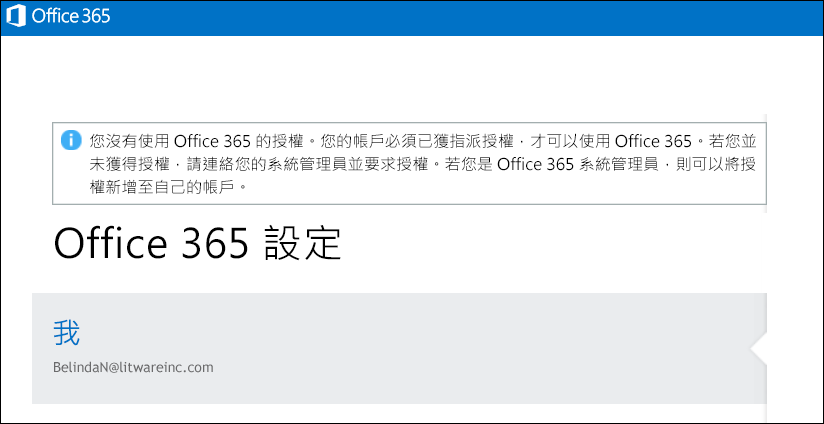

# <a name="view-licensed-and-unlicensed-users-with-office-365-powershell"></a><span data-ttu-id="9ade6-103">使用 Office 365 PowerShell 檢視經授權與未經授權的使用者</span><span class="sxs-lookup"><span data-stu-id="9ade6-103">View licensed and unlicensed users with Office 365 PowerShell</span></span>

<span data-ttu-id="9ade6-104">**摘要：**說明如何使用 Office 365 PowerShell 檢視經授權與未經授權的使用者帳戶。</span><span class="sxs-lookup"><span data-stu-id="9ade6-104">**Summary:** Explains how to use Office 365 PowerShell to view licensed and unlicensed user accounts.</span></span>
  
<span data-ttu-id="9ade6-p101">在您的 Office 365 組織中的使用者帳戶，可能具有從組織的可用授權方案指派給他們的部分授權、全部授權或完全沒有授權。您可以使用 Office 365 PowerShell 快速尋找組織中的經授權和未經授權的使用者。</span><span class="sxs-lookup"><span data-stu-id="9ade6-p101">User accounts in your Office 365 organization may have some, all, or none of the available licenses assigned to them from the licensing plans that are available in your organization. You can use Office 365 PowerShell to quickly find the licensed and unlicensed users in your organization.</span></span>
  
## <a name="before-you-begin"></a><span data-ttu-id="9ade6-107">開始之前</span><span class="sxs-lookup"><span data-stu-id="9ade6-107">Before you begin</span></span>

- <span data-ttu-id="9ade6-p102">本主題中的程序需要您連線到 Office 365 PowerShell。如需詳細指示，請參閱[連線至 Office 365 PowerShell](connect-to-office-365-powershell.md)。</span><span class="sxs-lookup"><span data-stu-id="9ade6-p102">The procedures in this topic require you to connect to Office 365 PowerShell. For instructions, see [Connect to Office 365 PowerShell](connect-to-office-365-powershell.md).</span></span>
    
- <span data-ttu-id="9ade6-110">如果您使用 **Get-MsolUser** Cmdlet，而不使用 _-All_參數，則只會傳回前 500 個帳戶。</span><span class="sxs-lookup"><span data-stu-id="9ade6-110">If you use the **Get-MsolUser** cmdlet without using the _-All_ parameter, only the first 500 accounts are returned.</span></span>
    
## <a name="the-short-version-instructions-without-explanations"></a><span data-ttu-id="9ade6-111">簡短版本 (不含說明的指示)</span><span class="sxs-lookup"><span data-stu-id="9ade6-111">The short version (instructions without explanations)</span></span>

<span data-ttu-id="9ade6-p103">本節僅呈現程序，但不提供詳盡或多餘的說明。如果您有任何問題或需要詳細資訊，您可以閱讀本主題的其餘部分。</span><span class="sxs-lookup"><span data-stu-id="9ade6-p103">This section presents the procedures without fanfare or superfluous explanation. If you have questions or want more information, you can read rest of the topic.</span></span>
  
<span data-ttu-id="9ade6-114">若要檢視您組織中所有使用者帳戶及其授權狀態的清單，在 Office 365 PowerShell 中執行下列命令：</span><span class="sxs-lookup"><span data-stu-id="9ade6-114">To view the list of all user accounts and their licensing status in your organization, run the following command in Office 365 PowerShell:</span></span>
  
```
Get-MsolUser -All
```

<span data-ttu-id="9ade6-115">若要檢視您組織中所有未經授權使用者帳戶的清單，執行下列命令：</span><span class="sxs-lookup"><span data-stu-id="9ade6-115">To view the list of all unlicensed user accounts in your organization, run the following command:</span></span>
  
```
Get-MsolUser -All -UnlicensedUsersOnly
```

<span data-ttu-id="9ade6-116">若要檢視您組織中所有經授權使用者帳戶的清單，執行下列命令：</span><span class="sxs-lookup"><span data-stu-id="9ade6-116">To view the list of all licensed user accounts in your organization, run the following command:</span></span>
  
```
Get-MsolUser -All | where {$_.isLicensed -eq $true}
```

## <a name="the-long-version-instructions-with-detailed-explanations"></a><span data-ttu-id="9ade6-117">冗長版本 (包含詳細說明的指示)</span><span class="sxs-lookup"><span data-stu-id="9ade6-117">The long version (instructions with detailed explanations)</span></span>

<span data-ttu-id="9ade6-p104">Office 365 使用者帳戶與 Office 365 授權不必具備一對一的對應關係：Office 365 使用者不一定具有 Office 365 授權，而 Office 365 授權不一定已指派給使用者。(事實上，單一使用者帳戶甚至可以有多個** Office 365 授權。) 當您建立新的 Office 365 使用者帳戶時 (請參閱[License Office 365 users with Windows PowerShell](http://technet.microsoft.com/library/0ab9fcac-e5ea-4b5b-b72c-8c92c55565ac.aspx)一文以了解詳細資訊)，您不必為該使用者指派授權：新使用者會擁有一個有效的帳戶，但是無法登入 Office 365。如果他們嘗試登入，就會看見如下的內容：</span><span class="sxs-lookup"><span data-stu-id="9ade6-p104">Office 365 user accounts and Office 365 licenses don't need to have a one-to-one correspondence: it's possible to have Office 365 users who do not have an Office 365 license, and it's possible to have Office 365 licenses that haven't been assigned to a user. (In fact, a single user account can even have  *multiple*  Office 365 licenses.) When you create a new Office 365 user account (see the article [License Office 365 users with Windows PowerShell](http://technet.microsoft.com/library/0ab9fcac-e5ea-4b5b-b72c-8c92c55565ac.aspx) for more information) you don't have to assign that user a license: the new user will have a valid account, but he or she won't be able to sign in to Office 365. If they try to sign in, they'll see something similar to this:</span></span>
  

  
<span data-ttu-id="9ade6-p105">同樣地，您可能會有使用者請長假，或許是學術休假或產假/陪產假。在那樣的情況下，您可以移除該使用者的授權，但是維持使用者帳戶原封不動 (也就是將其地址、電話號碼等所有屬性值維持原樣)。如此一來，您就可以將該授權指派給其他人 (例如替補請假人員的臨時員工)。當該使用者返回工作崗位時，您可以發給他們新的授權，他們將能夠繼續工作，彷彿從未離開過一般。</span><span class="sxs-lookup"><span data-stu-id="9ade6-p105">Likewise, you might have a user who will be taking some extended time off, perhaps for a sabbatical or for maternity/paternity leave. In a case like that, you could remove the user's license but leave the user account intact (that is, leave all its property values, such as address and phone number, as-is). By doing that, you can assign their license to someone else (like, say, a temporary worker filling in for the person on leave). When the user returns to work you can issue them a new license and they'll be able to resume working as if they'd never been gone.</span></span>
  
<span data-ttu-id="9ade6-p106">這明白表示了，是的，您可以讓使用者擁有帳戶但沒有授權。反之亦然。</span><span class="sxs-lookup"><span data-stu-id="9ade6-p106">Which simply means that, yes, you can have users who have accounts but who don't have licenses. Or vice-versa.</span></span>
  
<span data-ttu-id="9ade6-p107">[使用 Office 365 PowerShell 檢視授權與服務](view-licenses-and-services-with-office-365-powershell.md) 一文說明如何判斷您的組織已購買的 Office 365 授權數，以及其中有多少個授權已指派給使用者。這是很重要的資訊。但同樣重要的是，要如何得知您的哪些使用者已被指派這些授權，哪些沒有？本文將告訴您如何得知這些資訊。</span><span class="sxs-lookup"><span data-stu-id="9ade6-p107">The article [View licenses and services with Office 365 PowerShell](view-licenses-and-services-with-office-365-powershell.md) explains how you can determine the number of Office 365 licenses your organization has purchased as well as how many of those licenses have been assigned to users. That's important information. Equally important, however is knowing which of your users have been assigned these licenses and which ones haven't. And this article will tell you how to do just that.</span></span>
  
<span data-ttu-id="9ade6-p108">您可能知道， **Get-MsolUser** 指令程式會傳回與您所有的 Office 365 使用者帳戶有關的資訊。想要快速取得您所有 Office 365 使用者的相關資訊？請在 Office 365 PowerShell 中執行此命令：</span><span class="sxs-lookup"><span data-stu-id="9ade6-p108">As you probably know, the **Get-MsolUser** cmdlet returns information about all your Office 365 user accounts. Need some quick info about all your Office 365 users? Then run this command in Office 365 PowerShell:</span></span>
  
```
Get-MsolUser
```

<span data-ttu-id="9ade6-135">接著，Get-MsolUser 會傳回類似以下的資料：</span><span class="sxs-lookup"><span data-stu-id="9ade6-135">In turn, Get-MsolUser returns data similar to this:</span></span>
  
```
UserPrincipalName           DisplayName                     isLicensed
-----------------           -----------                     ----------
ZrinkaM@litwareinc.com      Zrinka Makovac                  True
BelindaN@litwareinc.com     Belinda Newman                  False
BonnieK@litwareinc.com      Bonnie Kearney                  True
FabriceC@litwareinc.com     Fabrice Canel                   True
AnneW@litwareinc.com        Anne Wallace                    True
AlexD@litwareinc.com        Alex Darrow                     True
```

<span data-ttu-id="9ade6-p109">如您所見，其中一個傳回的屬性值是 **isLicensed** 屬性的值。如果 **isLicensed** 等於 `False`，表示使用者沒有 Office 365 的授權。換句話說，如果您想要的話，只要捲動使用者清單並挑出 **isLicensed** 屬性設定為 `False` 的使用者即可。</span><span class="sxs-lookup"><span data-stu-id="9ade6-p109">As you can see, one of the property values returned is for the **isLicensed** property. If **isLicensed** is equal to `False` that means that the user doesn't have a license for Office 365. In other words, and if you wanted to, you could simply scroll through your list of users and pick out the ones where the **isLicensed** property is set to `False`.</span></span>
  
<span data-ttu-id="9ade6-p110">無論如何，只要您的使用者數目相對較少，就適合採用捲動使用者清單並嘗試挑出未授權之使用者的方式。不過，如果您有大量的使用者，捲動清單充其量將會非常冗長乏味。(並且，就 Windows PowerShell 的設定方式而言，可能完全不可能。這是因為，Windows PowerShell 主控台在任一時間點能夠顯示的輸出行數是有限制的。)</span><span class="sxs-lookup"><span data-stu-id="9ade6-p110">At any rate, scrolling through a list of users trying to pick out the unlicensed users works as long as you have a relatively small number of users. If you have a large number of users, however, scrolling through that list will be, at best, extremely tedious. (And, depending on how Windows PowerShell has been configured, perhaps downright impossible. That's because there's a limit to the number of lines of output that can be displayed in the Windows PowerShell console at any one time.)</span></span>
  
<span data-ttu-id="9ade6-143">考量到這一點，若要列出您的未授權使用者，更好的方法是改為執行這個命令：</span><span class="sxs-lookup"><span data-stu-id="9ade6-143">With that in mind, a much better way to list your unlicensed users is to run this command instead:</span></span>
  
```
Get-MsolUser -UnlicensedUsersOnly
```

<span data-ttu-id="9ade6-p111">這個命令只會傳回沒有 Office 365 授權的使用者。換句話說：</span><span class="sxs-lookup"><span data-stu-id="9ade6-p111">That command returns only those users who don't have a license for Office 365. In other words:</span></span>
  
```
UserPrincipalName           DisplayName                     isLicensed
-----------------           -----------                     ----------
BelindaN@litwareinc.com     Belinda Newman                  False
```

<span data-ttu-id="9ade6-p112">如您所見，我們有一位未授權的使用者。而我們想要的不正是 *授權*  使用者清單嗎？那是更複雜的細節，但差異總在細節中：</span><span class="sxs-lookup"><span data-stu-id="9ade6-p112">As you can see we have one unlicensed user. And what is we only wanted a list of the  *licensed*  users? That's a tiny bit more complicated, but only the tiniest bit:</span></span>
  
```
Get-MsolUser | Where-Object {$_.isLicensed -eq $true}
```

<span data-ttu-id="9ade6-149">那個會尋找 **isLicensed** 內容等於 `True` 的所有使用者帳戶的命令，傳回如下資訊：</span><span class="sxs-lookup"><span data-stu-id="9ade6-149">That command, which looks for all the user accounts where the **isLicensed** property is equal to `True`, returns information similar to this:</span></span>
  
```
UserPrincipalName           DisplayName                     isLicensed
-----------------           -----------                     ----------
ZrinkaM@litwareinc.com      Zrinka Makovac                  True
BonnieK@litwareinc.com      Bonnie Kearney                  True
FabriceC@litwareinc.com     Fabrice Canel                   True
AnneW@litwareinc.com        Anne Wallace                    True
AlexD@litwareinc.com        Alex Darrow                     True
```

<span data-ttu-id="9ade6-p113">如您所見，其中並未傳回 Belinda Newman 的資訊。為什麼？您知道的：因為 Belinda 的帳戶未將 **isLicensed** 屬性設為 `True`。</span><span class="sxs-lookup"><span data-stu-id="9ade6-p113">As you can see, information is not returned for Belinda Newman. Why not? You got it: because the **isLicensed** property for Belinda's account is not set to `True`.</span></span>
  
## <a name="see-also"></a><span data-ttu-id="9ade6-153">另請參閱</span><span class="sxs-lookup"><span data-stu-id="9ade6-153">See also</span></span>
<span data-ttu-id="9ade6-154"><a name="SeeAlso"> </a></span><span class="sxs-lookup"><span data-stu-id="9ade6-154"><a name="SeeAlso"> </a></span></span>

<span data-ttu-id="9ade6-155">如需這些程序中所使用之 Cmdlet 的相關資訊，請參閱下列主題：</span><span class="sxs-lookup"><span data-stu-id="9ade6-155">For more information about the cmdlets that are used in these procedures, see the following topics:</span></span>
  
- [<span data-ttu-id="9ade6-156">Get-MsolUser</span><span class="sxs-lookup"><span data-stu-id="9ade6-156">Get-MsolUser</span></span>](https://go.microsoft.com/fwlink/p/?LinkId=691547)
    
- [<span data-ttu-id="9ade6-157">Where-Object</span><span class="sxs-lookup"><span data-stu-id="9ade6-157">Where-Object</span></span>](https://go.microsoft.com/fwlink/p/?LinkId=113423)
    

