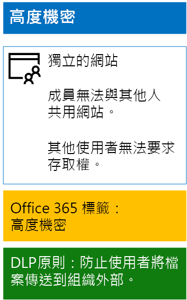

# <a name="protect-sharepoint-online-files-with-office-365-labels-and-dlp"></a>保護 SharePoint Online 與 Office 365 標籤和 DLP 檔案

 **摘要：**適用於具有不同的層級的資訊保護的 SharePoint Online 小組網站的 Office 365 標籤和資料外洩防護 (DLP) 原則。
  
使用本文中的步驟來設計及部署 Office 365 標籤和 [比較基準、 機密、 和高度機密 SharePoint Online 小組網站的 DLP 原則。如需保護這些三層的詳細資訊，請參閱[Secure SharePoint Online 網站及檔案](secure-sharepoint-online-sites-and-files.md)。
  
## <a name="office-365-labels-for-your-sharepoint-online-sites"></a>適用於 SharePoint Online 網站的 Office 365 標籤

若要建立的三個階段，然後指派 Office 365 標籤至 SharePoint Online 小組網站。
  
### <a name="phase-1-determine-the-office-365-label-names"></a>階段 1：決定 Office 365 標籤名稱

在此階段中，您會為套用至 SharePoint Online 小組網站的四種資訊保護層級，決定其 Office 365 標籤的名稱。 下表列出每種層級的建議名稱。
  
|**SharePoint Online 小組網站保護層級**|**標籤名稱**|
|:-----|:-----|
|基準-公用  <br/> |內部公用  <br/> |
|基準-私人  <br/> |Private  <br/> |
|敏感性  <br/> |敏感性  <br/> |
|高度機密  <br/> |高度機密  <br/> |
   
### <a name="phase-2-create-the-office-365-labels"></a>階段 2：建立 Office 365 標籤

在此階段中，您會為不同資訊保護層級建立所決定的標籤，然後將它發佈。
  
若要建立標籤，您可以使用 Office 365 系統管理中心或 Microsoft PowerShell。
  
### <a name="create-office-365-labels-with-the-office-365-admin-center"></a>使用 Office 365 系統管理中心建立 Office 365 標籤

1. Office 365 入口網站與有安全性管理員或公司管理員角色的帳戶登入。為了協助，請參閱 ＜[登入 Office 365 的位置](https://support.office.com/Article/Where-to-sign-in-to-Office-365-e9eb7d51-5430-4929-91ab-6157c5a050b4)。
    
2. 從 [Microsoft Office 的首頁] 索引標籤中，按一下 [管理] 磚。
    
3. 從 [新**Office 系統管理中心**] 索引標籤的瀏覽器中，按一下 [**系統中心 > 安全性&amp;規範**。
    
4. 從新**首頁-安全性&amp;規範**] 索引標籤的瀏覽器中，按一下 [**分類 > 標籤**。
    
5. 從 [首頁] > [標籤] 窗格中，按一下 [建立標籤]。
    
6. 在**您的標籤名稱**] 窗格中，輸入標籤的名稱並再按 [**下一步**。
    
7. 在 [**標籤設定**] 窗格中，按一下 [**下一步**]。
    
8. 在**檢閱您的設定**] 窗格中，按一下 [**建立此標籤**] 及 [**關閉**。
    
9. 針對其他標籤重複步驟 5 至 8。
    
### <a name="create-office-365-labels-with-powershell"></a>使用 PowerShell 建立 Office 365 標籤

1. [連線至 Office 365 安全性&amp;規範中心使用遠端 PowerShell](http://go.microsoft.com/fwlink/?LinkID=799771&amp;clcid=0x409)並指定有安全性管理員或公司管理員角色的帳戶的認證。
    
2. 填寫標籤名稱清單，然後在 PowerShell 命令提示字元中執行這些命令：
    
  ```
  $labelNames=@(<list of label names, each enclosed in quotes and separated by commas>)
ForEach ($element in $labelNames){ New-ComplianceTag -Name $element }
  ```

接下來，使用下列步驟來發佈新的 Office 365 標籤。
  
1. 從**首頁 > 標籤**窗格安全性&amp;規範中心，按一下 [**發佈標籤**。
    
2. 在 [**選擇要發佈的標籤**] 窗格中，按一下 [**選擇標籤發佈**。
    
3. 在 [**選擇標籤**] 窗格中，按一下 [**新增**] 並選取所有的四個標籤。
    
4. 按一下 [完成]。
    
5. 在 [**選擇要發佈的標籤**] 窗格中，按一下 [**下一步**]。
    
6. 在 [**選擇位置**] 窗格中，按一下 [**下一步**]。
    
7. 在**您的原則名稱**] 窗格中，在 [**名稱**] 中輸入您的集之標籤的名稱然後再按 [**下一步**。
    
8. 在**檢閱您的設定**] 窗格中，按一下 [**發佈標籤**] 及 [**關閉**。
    
### <a name="phase-3-apply-the-office-365-labels-to-your-sharepoint-online-sites"></a>階段 3：將 Office 365 標籤套用至 SharePoint Online 網站

使用下列步驟，將 Office 365 標籤套用至 SharePoint Online 小組網站的文件資料夾。
  
1. 從 [Microsoft Office 的首頁] 瀏覽器索引標籤，按一下 [SharePoint] 磚。
    
2. 在新的 [SharePoint] 瀏覽器索引標籤中，按一下需要指派 Office 365 標籤的網站。
    
3. 在瀏覽器的新 [SharePoint 網站] 索引標籤中，按一下 [文件]。
    
4. 按一下設定圖示，然後按一下 [文件庫設定]。
    
5. 在 [**權限與管理**] 按一下 [**套用此文件庫中的項目標籤**。
    
6. 在**套用設定的標籤**、 選取適當的標籤] 和 [**儲存**。
    
7. 關閉 SharePoint Online 網站的索引標籤。
    
8. 重複步驟 3-8，將 Office 365 標籤指派給其他 SharePoint Online 網站。
    
以下是所產生的設定。
  

  
## <a name="dlp-policies-for-your-sharepoint-online-sites"></a>適用於 SharePoint Online 網站的 DLP 原則

使用下列步驟來設定 DLP 原則，以在使用者共用組織外部 SharePoint Online 機密小組網站上的文件時通知使用者。
  
1. 從您的瀏覽器的 [ **Microsoft Office Home** ] 索引標籤按一下 [**安全性&amp;規範**並排顯示。
    
2. 在新**安全性&amp;規範**在瀏覽器] 索引標籤中按一下 [**資料遺失防護 > 原則**。
    
3. 在 [資料外洩防護] 窗格中，按一下 [+ 建立原則]。
    
4. 在**開始使用範本建立自訂原則或**] 窗格中，按一下**自訂**，然後再按一下 [**下一步**。
    
5. 在**您的原則名稱**] 窗格中，輸入機密層級的 DLP 原則的名稱在 [**名稱**]，然後按 [**下一步**。
    
6. 中**選擇位置**] 窗格中，按一下 [**讓我選擇特定位置**] 和 [**下一步**。
    
7. 在清單中的位置，停用的**Exchange 電子郵件**和**OneDrive 帳戶**的位置，並再按 [**下一步**。
    
8. 在**自訂您想要保護敏感資訊類型**] 窗格中，按一下 [**編輯**]。
    
9. 在 [**選擇要保護的內容類型**] 窗格中，按一下 [**新增**] 的下拉式方塊中，和 [**標籤**。
    
10. [**標籤**] 窗格中按一下 [ **+ 新增**、 選取**機密**標籤、 按一下 [**新增**] 和 [**完成**。
    
11. 在 [**選擇要保護的內容類型**] 窗格中，按一下 [**儲存**]。
    
12. 在**自訂您想要保護敏感資訊類型**] 窗格中，按一下 [**下一步**]。
    
13. 在**您想要如果我們偵測敏感資訊吗？** ] 窗格中，按一下 [**自訂提示] 及 [電子郵件**。
    
14. 在**自訂原則提示及電子郵件通知**] 窗格中，按一下 [**自訂原則提示文字**。
    
15. 在文字方塊中，鍵入或貼上下列內容：
    
  - 若要與組織外部的使用者共用，請下載檔案，然後將它開啟。 依序按一下 [檔案]、[保護文件] 和 [以密碼加密]，然後指定強式密碼。 以個別電子郵件或其他通訊方式傳送密碼。
    
    或者，輸入或貼上的指示使用者如何共用您組織外部檔案自己原則提示。
    
16. 按一下 [確定]。
    
17. 在**您想要如果我們偵測敏感資訊吗？** ] 窗格中，清除**封鎖來自共用、 人員及限制共用內容的存取權**] 核取方塊，然後再按一下 [**下一步**。
    
18. 在**您要開啟 [先取出的原則或測試事項？** ] 窗格中，按一下**[是]，開啟立即**，並再按 [**下一步**。
    
19. 在**檢閱您的設定**] 窗格中，按一下 [**建立**] 和 [**關閉**。
    
以下是敏感性 SharePoint Online 小組網站的設定結果。
  

  
接下來，使用下列步驟來設定 DLP 原則，以在使用者共用組織外部 SharePoint Online 高度機密小組網站上的文件時封鎖使用者。
  
1. 從您的瀏覽器的 [ **Microsoft Office Home** ] 索引標籤按一下 [**安全性&amp;規範**並排顯示。
    
2. 在新**安全性&amp;規範**在瀏覽器] 索引標籤中按一下 [**資料遺失防護 > 原則**。
    
3. 在 [資料外洩防護] 窗格中，按一下 [+ 建立原則]。
    
4. 在**開始使用範本建立自訂原則或**] 窗格中，按一下**自訂**，然後再按一下 [**下一步**。
    
5. 在**您的原則名稱**] 窗格中，輸入極高機密層級的 DLP 原則的名稱在 [**名稱**]，然後按 [**下一步**。
    
6. 中**選擇位置**] 窗格中，按一下 [**讓我選擇特定位置**] 和 [**下一步**。
    
7. 在清單中的位置，停用的**Exchange 電子郵件**和**OneDrive 帳戶**的位置，並再按 [**下一步**。
    
8. 在**自訂您想要保護敏感資訊類型**] 窗格中，按一下 [**編輯**]。
    
9. 在 [**選擇要保護的內容類型**] 窗格中，按一下 [**新增**] 的下拉式方塊中，和 [**標籤**。
    
10. [**標籤**] 窗格中按一下 [ **+ 新增**、 選取**高度機密**的標籤、 按一下 [**新增**] 和 [**完成**。
    
11. 在 [**選擇要保護的內容類型**] 窗格中，按一下 [**儲存**]。
    
12. 在**自訂您想要保護敏感資訊類型**] 窗格中，按一下 [**下一步**]。
    
13. 在**您想要如果我們偵測敏感資訊吗？** ] 窗格中，按一下 [**自訂提示] 及 [電子郵件**。
    
14. 在**自訂原則提示及電子郵件通知**] 窗格中，按一下 [**自訂原則提示文字**。
    
15. 在文字方塊中，鍵入或貼上下列內容：
    
  - 若要與組織外部的使用者共用，請下載檔案，然後將它開啟。 依序按一下 [檔案]、[保護文件] 和 [以密碼加密]，然後指定強式密碼。 以個別電子郵件或其他通訊方式傳送密碼。
    
    或者，輸入或貼上的指示使用者如何共用您組織外部檔案自己原則提示。
    
16. 按一下 [確定]。
    
17. 在**您想要如果我們偵測敏感資訊吗？** ] 窗格中，選取**需要覆寫業務上理由**，然後再按一下 [**下一步**。
    
18. 在**您要開啟 [先取出的原則或測試事項？** ] 窗格中，按一下**[是]，開啟立即**，並再按 [**下一步**。
    
19. 在**檢閱您的設定**] 窗格中，按一下 [**建立**] 和 [**關閉**。
    
以下是高度機密 SharePoint Online 小組網站的設定結果。
  

  
## <a name="next-step"></a>下一步

[使用 Azure 資訊保護來保護 SharePoint Online 檔案](protect-sharepoint-online-files-with-azure-information-protection.md)
    
## <a name="see-also"></a>請參閱

[安全的 SharePoint Online 網站及檔案](secure-sharepoint-online-sites-and-files.md)
  
[在開發/測試環境中保護 SharePoint Online 網站](secure-sharepoint-online-sites-in-a-dev-test-environment.md)
  
[適用於政治活動、非營利組織和其他彈性組織的 Microsoft 安全性指南](microsoft-security-guidance-for-political-campaigns-nonprofits-and-other-agile-o.md)
  
[雲端採用和混合式解決方案](cloud-adoption-and-hybrid-solutions.md)


