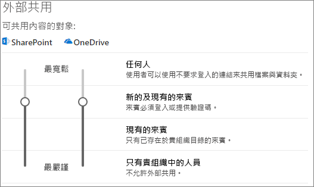
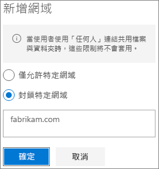

# 在與組織外的人員共用檔案時，限制資訊意外暴露。Limit accidental exposure to files when sharing with people outside your organization

當與組織外的人員共用檔案和資料夾時，有許多選項可以降低意外共用機密資訊的機會。When sharing files and folders with people outside your organization, there are a variety of options to reduce the chances of accidentally sharing confidential information. 您可以從本文中選擇最符合貴組織需求的選項。You can choose from the options in this article to best meet the needs of your organization.

## 使用適用於 [任何人] 連結的最佳做法Use best practices for Anyone links

如果組織的人員需要進行未驗證共用，但是您擔心未驗證的人員修改內容，請參閱[未驗證共用的最佳做法](best-practices-anonymous-sharing.md)，以取得如何在組織中使用未驗證共用的指導方針。If people in your organization need to do unauthenticated sharing, but you're concerned about unauthenticated people modifying content, read [Best practices for unauthenticated sharing](best-practices-anonymous-sharing.md) for guidance on how to work with unauthenticated sharing in your organization.

## 關閉 [任何人] 連結Turn off Anyone links

我們建議針對適當的內容讓 [任何人]\*\* 連結啟用，因為這是最簡單的共用方式，而且可以協助減少使用者尋求您的 IT 部門掌握外其他解決方案的風險。We recommend leaving *Anyone* links enabled for appropriate content because it's the easiest way to share and can help reduce the risk of users seeking other solutions that are outside the control of your IT department. [任何人]\*\* 連結可以轉寄給其他人，但是檔案存取權僅限擁有連結的人員使用。*Anyone* links can be forwarded to others, but file access is only available to those who have the link.

如果您要組織外的人員一律在存取 SharePoint、群組或 Teams 中的內容時經過驗證，您可以關閉 [任何人]\*\* 共用。If you always want people outside your organization to authenticate when accessing content in SharePoint, Groups, or Teams, you can turn off *Anyone* sharing. 這會防止使用者未經驗證而共用內容。This will prevent users from unauthenticated sharing of content.

如果您停用 [任何人]\*\* 連結，使用者仍然可以使用 [特定人員]\*\* 連結，輕易地與來賓共用。If you disable *Anyone* links, users can still easily share with guests using *Specific people* links. 在此情況下，所有組織外的人員都必須先經過驗證，才能存取共用的內容。In this case, all people outside your organization will be required to authenticate before they can access the shared content.

視您的需求而定，您可以針對特定網站或整個組織停用 [任何人]\*\* 連結。Depending on your needs, you can disable *Anyone* links for specific sites, or for your whole organization.

若要關閉貴組織的 [任何人]\*\* 連結To turn off *Anyone* links for your organization
1. 在 SharePoint 管理中心中，按一下左側導覽窗格中的 [共用]\*\*\*\*。In the SharePoint admin center, in the left navigation, click **Sharing**.
2. 將 SharePoint 外部共用設定設為 [新的及現有來賓]\*\*\*\*。Set the SharePoint external sharing settings to **New and existing guests**. 
   
3. 按一下 [儲存]\*\*\*\*。Click **Save**.

若要關閉網站的 [任何人]\*\* 連結To turn off *Anyone* links for a site
1. 在 SharePoint 管理中心中，在左側導覽窗格中展開 [網站]\*\*\*\*，然後按一下 [使用中網站]\*\*\*\*。In the SharePoint admin center, in the left navigation, expand **Sites** and click **Active sites**.
2. 為您剛建立的小組選取網站。Select the site for the team that you just created.
3. 在功能區中，按一下 [共用]\*\*\*\*。In the ribbon, click **Sharing**.
4. 請確認共用設為 [新的及現有來賓]\*\*\*\*。Ensure that sharing is set to **New and existing guests**. 
   
5. 如果您做了任何變更，請按一下 [儲存]\*\*\*\*。If you made changes, click **Save**.

## 網域篩選Domain filtering

您可以使用網域來允許或拒絕清單，以決定您的使用者可以與組織外的人員共用哪些網域。You can use domain allow or deny lists to determine domains your users can share with people outside your organization.

使用允許清單，您可以指定網域清單，而該網域內的組織使用者可以與組織外的人員共用。With an allow list, you can specify a list of domains where users in your organization can share with people outside your organization. 已封鎖與其他網域共用。Sharing with to other domains is blocked. 如貴組織只會與來自特定網域清單的人員共同作業，您可以使用此功能來防止與其他網域共用。If your organization only collaborates with people from a list of specific domains, you can use this feature to prevent sharing with other domains.

使用拒絕清單，您可以指定網域清單，而該網域內的組織使用者不能與組織外的人員共用。With a deny list, you can specify a list of domains from which users in your organization cannot share with people outside your organization. 已封鎖與清單中的網域共用。Sharing with the listed domains is blocked. 如果您有競爭對手，例如您想要避免某人存取組織中的內容，這個功能很有用。This can be useful if you have competitors, for example, who you want to prevent from accessing content in your organization.

允許和拒絕清單只會影響與來賓的共用。The allow and deny lists only affect sharing with guests. 如果您未停用 [任何人]\*\* 連結，使用者仍然可以使用這個連結，與來自禁止網域的人員共用。Users can still share with people from prohibited domains by using *Anyone* links if you haven't disabled them. 若要達到使用網域允許和拒絕清單的最佳結果，請考量停用 [任何人]\*\* 連結，如上所述。For best results with domain allow and deny lists, consider disabling *Anyone* links as described above.

為組織外的人員設定網域允許或拒絕清單To set up a domain allow or deny list for people outside your organization
1. 在 SharePoint 管理中心中，按一下左側導覽窗格中的 [共用]\*\*\*\*。In the SharePoint admin center, in the left navigation, click **Sharing**.
2. 在 [外部共用的進階設定]\*\*\*\* 底下，選取 [依網域限制外部共用]\*\*\*\* 核取方塊。Under **Advanced settings for external sharing**, select the **Limit external sharing by domain** check box.
3. 按一下 [新增網域]\*\*\*\*。Click **Add domains**.
4. 選取您是否想要封鎖網域，輸入網域，然後按一下 [確定]\*\*\*\*。Select whether you want to block domains, type the domains, and click **OK**. 
   
5. 按一下 [儲存]\*\*\*\*。Click **Save**.

如果您想要依據比 SharePoint 和 OneDrive 還要高層級的網域限制共用，您可以在 Azure Active Directory 中[允許或封鎖對特定組織的 B2B 使用者的邀請](https://docs.microsoft.com/azure/active-directory/b2b/allow-deny-list)。If you want to limit sharing by domain at a higher level than SharePoint and OneDrive, you can [allow or block invitations to B2B users from specific organizations](https://docs.microsoft.com/azure/active-directory/b2b/allow-deny-list) in Azure Active Directory. (您必須設定 [SharePoint 和 OneDrive 與 Azure AD B2B 整合 (預覽版)](https://docs.microsoft.com/sharepoint/sharepoint-azureb2b-integration-preview)，讓這些設定影響 SharePoint 和 OneDrive。)(You must configure the [SharePoint and OneDrive integration with Azure AD B2B Preview](https://docs.microsoft.com/sharepoint/sharepoint-azureb2b-integration-preview) for these settings to affect SharePoint and OneDrive.)

## 將與組織外的人員共用的檔案、資料夾和網站限制為指定的安全性群組Limit sharing of files, folders, and sites with people outside your organization to specified security groups

您可以將與組織外的人員共用的檔案、資料夾和網站限制為指定的安全性群組的成員。You can restrict sharing of files, folders, and sites with people outside your organization to members of a specific security group. 如果您想要啟用外部共用，但是有核准工作流程或要求程序，這個選項相當有用。This is useful if you want to enable external sharing, but with an approval workflow or request process.

將外部共用限制為安全性群組的成員To limit external sharing to members of a security group
1. 在 SharePoint 管理中心中，按一下左側導覽窗格中的 [共用]\*\*\*\*。In the SharePoint admin center, in the left navigation, click **Sharing**.
2. 在 [其他設定]\*\*\*\* 底下，Under **Other settings**. 遵循 [將外部共用限制為特定安全性群組]\*\*\*\* 連結。follow the **Limit external sharing to specific security groups** link.
3. 在 [誰可以與組織外進行共用]\*\*\*\* 底下，選取其中一個核取方塊，或同時選取：a.Under **Who can share outside your organization**, select one or both of the check boxes: a. [只讓所選安全性群組中的使用者與已驗證的外部使用者共用]\*\*\*\*，指定可以與已驗證使用者共用的安全性群組 b.**Let only users in selected security groups share with authenticated external users** to specify a security group that can share with authenticated users b. [只有所選安全性群組中的使用者可以與已驗證之外部使用者和使用匿名連結的使用者進行共用]\*\*\*\*，指定可以與已驗證使用者共用和使用 [任何人] 連結的安全性群組**Let only users in selected security groups share with authenticated external users and using anonymous links** to specify a security group that can share with authenticated users and by using Anyone links
4. 按一下 [確定]\*\*\*\*。Click **OK**.

請注意，這會影響檔案、資料夾和網站，但是不會影響 Office 365 群組或 Teams。Note that this affects files, folders, and sites, but not Office 365 groups or Teams. 當成員邀請來賓加入私人 Office 365 群組或 Microsoft Teams 中的私人小組時，邀請會傳送給群組或小組擁有者進行核准。When members invite guests to a private Office 365 group or a private team in Microsoft Teams, the invitation is sent to the group or team owner for approval.

## 另請參閱See Also

[建立安全的來賓共用環境Create a secure guest sharing environment](create-a-secure-guest-sharing-environment.md)

[與匿名使用者共用檔案和資料夾的最佳做法Best practices for sharing files and folders with anonymous users](best-practices-anonymous-sharing.md)