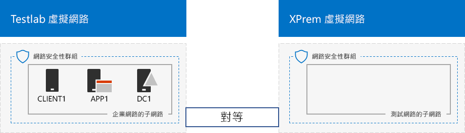

# <a name="simulated-cross-premises-virtual-network-in-azure"></a>模擬的跨部署在 Azure 虛擬網路

 **摘要：**為開發人員/測試環境中建立 in Microsoft Azure 模擬的跨內部虛擬網路。
  
本文會引導您完成建立模擬的混合式雲端環境與 Microsoft Azure 中使用兩個 Azure 虛擬網路。以下是所產生的設定。 
  

  
這會模擬 Azure IaaS 混合雲端實際執行環境，而且所組成：
  
- 架設在 Azure 虛擬網路 （TestLab 虛擬網路） 模擬及簡化內部網路。
    
- 模擬的跨內部虛擬網路架設在 Azure (XPrem)。
    
- 兩個虛擬網路之間的 VNet 對等的關係。
    
- XPrem 虛擬網路的次要網域控制站。
    
這提供基礎與一般起始點其中您可以： 
  
- 開發和測試應用程式模擬 Azure IaaS 混合雲端環境中。
    
- 建立電腦、 TestLab 虛擬網路內某些和一些 XPrem 虛擬網路內，來模擬混合雲端式 IT 工作負載的測試設定。
    
有三個主要階段設定此開發/測試環境：
  
1. 設定測試實驗室虛擬網路。
    
2. 建立跨內部虛擬網路。
    
3. 設定 DC2。
    
> [!NOTE]
> 此設定需要付費 Azure 訂閱。 
  

  
> [!TIP]
> 按一下[此處](http://aka.ms/catlgstack)的視覺對應至一個 Microsoft Cloud 測試實驗室指南堆疊中所有的文章。
  
## <a name="phase-1-configure-the-testlab-virtual-network"></a>階段 1： 設定 TestLab 虛擬網路

使用[基本設定開發/測試環境](base-configuration-dev-test-environment.md)中的指示設定 DC1、 APP1 和 CLIENT1 電腦中名為 TestLab Azure 虛擬網路。
  
這是您目前的設定。 
  

  
## <a name="phase-2-create-the-xprem-virtual-network"></a>階段 2： 建立 XPrem 虛擬網路

在此階段中，您可以建立並設定新的 XPrem 虛擬網路並再將其連線至 TestLab 虛擬網路與 VNet 對等。
  
首先，您的本機電腦上啟動 Azure PowerShell 提示字元處。
  
> [!NOTE]
> 下列的命令會使用 Azure PowerShell 的最新版本。請參閱[開始使用 Azure PowerShell cmdlet](https://docs.microsoft.com/en-us/powershell/azureps-cmdlets-docs/)。 
  
下列命令以 Azure 帳戶登入。
  
```
Login-AzureRMAccount
```

> [!TIP]
> 按一下[這裡](https://gallery.technet.microsoft.com/PowerShell-commands-for-7844edd0)以取得包含所有的 PowerShell 命令會在本文中的文字檔案。
  
使用下列命令取得訂用帳戶名稱。
  
```
Get-AzureRMSubscription | Sort Name | Select Name
```

設定您的 Azure 訂閱。括住，包括所有內容取代為\<和 > 字元，以正確的名稱。
  
```
$subscrName="<subscription name>"
Get-AzureRmSubscription -SubscriptionName $subscrName | Select-AzureRmSubscription
```

接下來，建立 XPrem 虛擬網路，並保護與網路安全性群組與這些命令。
  
```
$rgName="<name of the resource group that you used for your TestLab virtual network>"
$locName=(Get-AzureRmResourceGroup -Name $rgName).Location
$Testnet=New-AzureRMVirtualNetworkSubnetConfig -Name "Testnet" -AddressPrefix 192.168.0.0/24
New-AzureRMVirtualNetwork -Name "XPrem" -ResourceGroupName $rgName -Location $locName -AddressPrefix 192.168.0.0/16 -Subnet $Testnet -DNSServer 10.0.0.4
$rule1=New-AzureRMNetworkSecurityRuleConfig -Name "RDPTraffic" -Description "Allow RDP to all VMs on the subnet" -Access Allow -Protocol Tcp -Direction Inbound -Priority 100 -SourceAddressPrefix Internet -SourcePortRange * -DestinationAddressPrefix * -DestinationPortRange 3389
New-AzureRMNetworkSecurityGroup -Name "Testnet" -ResourceGroupName $rgName -Location $locName -SecurityRules $rule1
$vnet=Get-AzureRMVirtualNetwork -ResourceGroupName $rgName -Name XPrem
$nsg=Get-AzureRMNetworkSecurityGroup -Name "Testnet" -ResourceGroupName $rgName
Set-AzureRMVirtualNetworkSubnetConfig -VirtualNetwork $vnet -Name "Testnet" -AddressPrefix 192.168.0.0/24 -NetworkSecurityGroup $nsg
```

接下來，使用這些命令建立 TestLab 和 XPrem VNets 之間的 VNet 對等關係。
  
```
$rgName="<name of the resource group that you used for your TestLab virtual network>"
$vnet1=Get-AzureRmVirtualNetwork -ResourceGroupName $rgName -Name TestLab
$vnet2=Get-AzureRmVirtualNetwork -ResourceGroupName $rgName -Name XPrem
Add-AzureRmVirtualNetworkPeering -Name TestLab2XPrem -VirtualNetwork $vnet1 -RemoteVirtualNetworkId $vnet2.Id
Add-AzureRmVirtualNetworkPeering -Name XPrem2TestLab -VirtualNetwork $vnet2 -RemoteVirtualNetworkId $vnet1.Id
```

這是您目前的設定。 
  

  
## <a name="phase-3-configure-dc2"></a>階段 3： 設定 DC2

在此階段中，您可以在 XPrem 虛擬網路中建立 DC2 虛擬機器並再將它設定為在複本網域控制站。
  
首先，建立 DC2 虛擬機器。本機電腦上 Azure PowerShell 命令提示字元執行這些命令。
  
```
$rgName="<your resource group name>"
$locName=(Get-AzureRmResourceGroup -Name $rgName).Location
$vnet=Get-AzureRMVirtualNetwork -Name XPrem -ResourceGroupName $rgName
$pip=New-AzureRMPublicIpAddress -Name DC2-PIP -ResourceGroupName $rgName -Location $locName -AllocationMethod Dynamic
$nic=New-AzureRMNetworkInterface -Name DC2-NIC -ResourceGroupName $rgName -Location $locName -SubnetId $vnet.Subnets[0].Id -PublicIpAddressId $pip.Id -PrivateIpAddress 192.168.0.4
$vm=New-AzureRMVMConfig -VMName DC2 -VMSize Standard_A1
$cred=Get-Credential -Message "Type the name and password of the local administrator account for DC2."
$vm=Set-AzureRMVMOperatingSystem -VM $vm -Windows -ComputerName DC2 -Credential $cred -ProvisionVMAgent -EnableAutoUpdate
$vm=Set-AzureRMVMSourceImage -VM $vm -PublisherName MicrosoftWindowsServer -Offer WindowsServer -Skus 2016-Datacenter -Version "latest"
$vm=Add-AzureRMVMNetworkInterface -VM $vm -Id $nic.Id
$vm=Set-AzureRmVMOSDisk -VM $vm -Name "DC2-OS" -DiskSizeInGB 128 -CreateOption FromImage -StorageAccountType "StandardLRS"
$diskConfig=New-AzureRmDiskConfig -AccountType "StandardLRS" -Location $locName -CreateOption Empty -DiskSizeGB 20
$dataDisk1=New-AzureRmDisk -DiskName "DC2-DataDisk1" -Disk $diskConfig -ResourceGroupName $rgName
$vm=Add-AzureRmVMDataDisk -VM $vm -Name "DC2-DataDisk1" -CreateOption Attach -ManagedDiskId $dataDisk1.Id -Lun 1
New-AzureRMVM -ResourceGroupName $rgName -Location $locName -VM $vm
```

下一步] 連線至新的 DC2 虛擬機器從[Azure 入口網站](https://portal.azure.com)使用它的本機系統管理員帳戶名稱和密碼。
  
接下來，設定 Windows 防火牆規則允許流量的基本連線測試。以系統管理員層級 Windows PowerShell 命令提示字元上 DC2，執行下列命令。 
  
```
Set-NetFirewallRule -DisplayName "File and Printer Sharing (Echo Request - ICMPv4-In)" -enabled True
ping dc1.corp.contoso.com
```

Ping 命令應該就來自 IP 位址 10.0.0.4 四個成功的回覆。這是流量的測試跨 VNet 對等關係。 
  
下一步] 新增為新的磁碟區使用此命令使用的磁碟機代號 LATER 額外資料磁碟上 DC2 在 Windows PowerShell 命令提示字元。
  
```
Get-Disk | Where PartitionStyle -eq "RAW" | Initialize-Disk -PartitionStyle MBR -PassThru | New-Partition -AssignDriveLetter -UseMaximumSize | Format-Volume -FileSystem NTFS -NewFileSystemLabel "WSAD Data"
```

接下來，設定 DC2 為 corp.contoso.com 網域的複本網域控制站。在 Windows PowerShell 命令提示字元中執行下列命令在 DC2 中。
  
```
Install-WindowsFeature AD-Domain-Services -IncludeManagementTools
Install-ADDSDomainController -Credential (Get-Credential CORP\\User1) -DomainName "corp.contoso.com" -InstallDns:$true -DatabasePath "F:\\NTDS" -LogPath "F:\\Logs" -SysvolPath "F:\\SYSVOL"
```

請注意系統提示您提供兩個公司\\User1 密碼] 和 [目錄服務還原模式 (DSRM) 的密碼，並重新啟動 DC2。 
  
既然 XPrem 虛擬網路有其專屬 DNS 伺服器 (DC2)，您必須設定成使用此 DNS 伺服器 XPrem 虛擬網路。本機電腦上 Azure PowerShell 命令提示字元執行這些命令。
  
```
$vnet=Get-AzureRmVirtualNetwork -ResourceGroupName $rgName -name "XPrem"
$vnet.DhcpOptions.DnsServers="192.168.0.4" 
Set-AzureRmVirtualNetwork -VirtualNetwork $vnet
Restart-AzureRmVM -ResourceGroupName $rgName -Name "DC2"
```

從本機電腦上 Azure 入口網站中，連線至公司與 DC1\\User1 認證。在 DC1 設定 CORP 網域，以便電腦和使用者使用其本機網域控制站進行驗證，請以系統管理員層級 Windows PowerShell 命令提示字元執行這些命令。
  
```
New-ADReplicationSite -Name "TestLab" 
New-ADReplicationSite -Name "XPrem"
New-ADReplicationSubnet -Name "10.0.0.0/8" -Site "TestLab"
New-ADReplicationSubnet -Name "192.168.0.0/16" -Site "XPrem"
```

這是您目前的設定。 
  

  
模擬 Azure 混合式雲端環境現在已備妥可供測試。
  
## <a name="next-step"></a>下一步

使用此開發/測試環境來模擬[架設在 Azure 中的 SharePoint Server 2016 內部網路伺服器陣列](https://technet.microsoft.com/library/mt806351%28v=office.16%29.aspx)。
  
## <a name="see-also"></a>請參閱

[基底組態開發/測試環境](base-configuration-dev-test-environment.md)
  
[Office 365 開發/測試環境](office-365-dev-test-environment.md)
  
[Office 365 開發/測試環境的 DirSync](dirsync-for-your-office-365-dev-test-environment.md)
  
[Office 365 開發人員/測試環境的雲端應用程式安全性](cloud-app-security-for-your-office-365-dev-test-environment.md)
  
[Office 365 開發人員/測試環境的進階威脅保護](advanced-threat-protection-for-your-office-365-dev-test-environment.md)
  
[雲端採用和混合式解決方案](cloud-adoption-and-hybrid-solutions.md)


