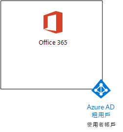
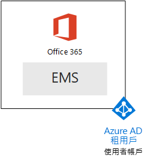
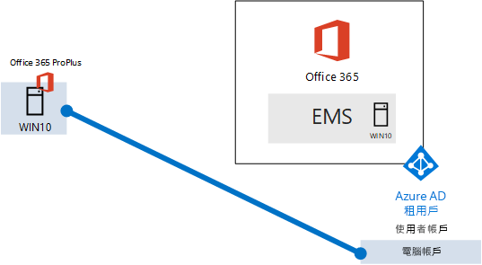

# <a name="the-microsoft-365-enterprise-devtest-environment"></a>Microsoft 365 Enterprise 開發人員/測試環境

 **摘要：**若要建立包含 Office 365 E5、 企業行動性 + 安全性 （EMS） E5 和執行 Windows 10 企業之電腦的開發人員/測試環境中使用此測試實驗室指南。
  
本文提供逐步指示以建立要測試的功能和[Microsoft 365 企業版](https://www.microsoft.com/microsoft-365/enterprise)功能簡化的環境。
  
## <a name="phase-1-create-your-office-365-e5-subscription"></a>階段 1： 建立您的 Office 365 E5 訂閱

請依照下列階段 2 和[Office 365 開發人員/測試環境](office-365-dev-test-environment.md)的階段 3： 建立輕量型 Office 365 開發人員/測試環境中，如圖 1 所示的步驟。
  
**圖 1： Office 365 E5 訂閱具有其 Azure Active Directory (AD) 租用戶和使用者帳戶**


  
## <a name="phase-2-add-ems"></a>階段 2： 新增 EMS

在此階段中，您註冊 EMS E5 試用版訂閱並將其新增至您的 Office 365 E5 試用版訂閱相同的組織。
  
首先，新增 EMS E5 試用訂閱及 EMS 授權指派給全域管理員帳戶。
  
1. 網際網路瀏覽器的私人執行個體，登入 Office 365 入口網站與您的全域管理員帳戶認證。為了協助，請參閱 ＜[登入 Office 365 的位置](https://support.office.com/Article/Where-to-sign-in-to-Office-365-e9eb7d51-5430-4929-91ab-6157c5a050b4)。
    
2. 按一下 [**系統**] 磚。
    
3. 在**Office 系統管理中心**] 索引標籤中瀏覽器中，在左導覽列中，按一下 [**帳務 > 購買服務**。
    
4. 在 [**購買服務**] 頁面上尋找**企業行動性 + 安全性 E5**項目。滑鼠指標停留並按一下 [**開始免費試用版**。
    
5. 在 [**確認您的訂單**] 頁面上按一下 [**立即試用**。
    
6. 在 [**順序回條**] 頁面上按一下 [**繼續**]。
    
7. 在**Office 365 系統管理中心**] 索引標籤中瀏覽器中，在左導覽列中，按一下 [**使用者 > 作用中使用者**。
    
8. 按一下 [您的全域管理員帳戶] 和 [**編輯****產品**授權。
    
9. 在**產品授權**] 窗格中，開啟**企業行動性 + 安全性 E5** **上**至產品授權、 按一下 [**儲存]**及 [**關閉**兩次。
    
> [!NOTE]
> Enterprise Mobility + Security E5 試用訂閱為 90 天。針對永久開發/測試環境，建立具有少數授權的新付費訂閱。 
  
 ***如果您已完成的階段 3***[Office 365 開發人員/測試環境](office-365-dev-test-environment.md)的所有其他帳戶 （使用者 2、 3 使用者、 使用者 4 和使用者 5） 的重複步驟 8 和 9 的前一程序。
  
開發/測試環境現在有：
  
- Office 365 E5 Enterprise 和 EMS 試用訂閱會與您的使用者帳戶清單共用相同的組織和相同的 Azure AD 租用戶。
    
- 使用 Office 365 E5 和 EMS E5 啟用所有適當的使用者帳戶 （只是將全域管理員或所有五個使用者帳戶）。
    
圖 2 顯示您所產生的設定，會新增 EMS。
  
**圖 2： 新增 EMS 試用訂閱**


  
## <a name="phase-3-create-a-windows-10-enterprise-computer"></a>階段 3： 建立 Windows 10 企業電腦

在此階段中，您可以建立獨立的電腦執行 Windows 10 Enterprise。
  
### <a name="physical-computer"></a>實體電腦

取得個人電腦並在其上安裝 Windows 10 Enterprise。您可以下載 Windows 10 Enterprise 試用版[此處](https://www.microsoft.com/evalcenter/evaluate-windows-10-enterprise)。
  
### <a name="virtual-machine"></a>虛擬機器

建立使用您選擇 hypervisor 虛擬機器，並在其上安裝 Windows 10 Enterprise。您可以下載 Windows 10 Enterprise 試用版[此處](https://www.microsoft.com/evalcenter/evaluate-windows-10-enterprise)。
  
### <a name="virtual-machine-in-azure"></a>在 Azure 虛擬機器

若要建立 Windows 10 虛擬機器 in Microsoft Azure，***您必須具備的 Visual Studio 為基礎的訂閱***，以存取 Windows 10 enterprise 映像。其他類型的 Azure 訂閱、 試驗和付費訂閱，例如不需要存取此影像。
  
> [!NOTE]
> 下列的命令會使用 Azure PowerShell 尋找最新版本。請參閱[開始使用 Azure PowerShell cmdlet](https://docs.microsoft.com/powershell/azureps-cmdlets-docs/)。這些命令會建立 Windows 10 Enterprise 虛擬機器名為 WIN10 和所有其所需的基礎結構，包括資源群組、 儲存帳戶及虛擬網路。如果您已熟悉 Azure 基礎結構服務，請能否這些指示以符合您目前已部署的基礎結構。 
  
首先，啟動 Microsoft PowerShell 提示字元。
  
下列命令以 Azure 帳戶登入。
  
```
Login-AzureRMAccount
```

使用下列命令取得訂用帳戶名稱。
  
```
Get-AzureRMSubscription | Sort Name | Select Name
```

設定您的 Azure 訂閱。括住，包括所有內容取代為\<和 > 具有正確的名稱的字元。
  
```
$subscr="<subscription name>"
Get-AzureRmSubscription -SubscriptionName $subscr | Select-AzureRmSubscription
```

接著，建立新的資源群組。若要判斷資源群組名稱是否是唯一的，可使用此命令來列出現有的資源群組。
  
```
Get-AzureRMResourceGroup | Sort ResourceGroupName | Select ResourceGroupName
```

使用這些命令建立新的資源群組。括住，包括所有內容取代為\<和 > 字元，以正確的名稱。
  
```
$rgName="<resource group name>"
$locName="<location name, such as West US>"
New-AzureRMResourceGroup -Name $rgName -Location $locName
```

資源管理員為基礎的虛擬機器時需要的資源管理員為基礎的存放區的帳戶。您必須選擇您儲存帳戶會*包含只有小寫字母和數字*的全域唯一名稱。您可以使用此命令以列出現有存放區的帳戶。
  
```
Get-AzureRMStorageAccount | Sort StorageAccountName | Select StorageAccountName
```

使用此命令來測試建議的儲存體帳戶名稱是否是唯一的。
  
```
Get-AzureRmStorageAccountNameAvailability "<proposed name>"
```

使用這些命令，為新的測試環境建立新的儲存體帳戶。
  
```
$rgName="<your new resource group name>"
$saName="<storage account name>"
$locName=(Get-AzureRmResourceGroup -Name $rgName).Location
New-AzureRMStorageAccount -Name $saName -ResourceGroupName $rgName -Type Standard_LRS -Location $locName
```

接下來，您可以使用這些命令建立新的虛擬網路和 WIN10 虛擬機器。出現提示時，WIN10 提供的名稱和本機管理員帳戶的密碼並儲存這些安全的位置。
  
```
$corpnetSubnet=New-AzureRMVirtualNetworkSubnetConfig -Name Corpnet -AddressPrefix 10.0.0.0/24
New-AzureRMVirtualNetwork -Name "M365Ent-TestLab" -ResourceGroupName $rgName -Location $locName -AddressPrefix 10.0.0.0/8 -Subnet $corpnetSubnet
$rule1=New-AzureRMNetworkSecurityRuleConfig -Name "RDPTraffic" -Description "Allow RDP to all VMs on the subnet" -Access Allow -Protocol Tcp -Direction Inbound -Priority 100 -SourceAddressPrefix Internet -SourcePortRange * -DestinationAddressPrefix * -DestinationPortRange 3389
New-AzureRMNetworkSecurityGroup -Name Corpnet -ResourceGroupName $rgName -Location $locName -SecurityRules $rule1
$vnet=Get-AzureRMVirtualNetwork -ResourceGroupName $rgName -Name "M365Ent-TestLab"
$nsg=Get-AzureRMNetworkSecurityGroup -Name Corpnet -ResourceGroupName $rgName
Set-AzureRMVirtualNetworkSubnetConfig -VirtualNetwork $vnet -Name Corpnet -AddressPrefix "10.0.0.0/24" -NetworkSecurityGroup $nsg
$pip=New-AzureRMPublicIpAddress -Name WIN10-PIP -ResourceGroupName $rgName -Location $locName -AllocationMethod Dynamic
$nic=New-AzureRMNetworkInterface -Name WIN10-NIC -ResourceGroupName $rgName -Location $locName -SubnetId $vnet.Subnets[0].Id -PublicIpAddressId $pip.Id
$vm=New-AzureRMVMConfig -VMName WIN10 -VMSize Standard_D1_V2
$storageAcc=Get-AzureRMStorageAccount -ResourceGroupName $rgName -Name $saName
$cred=Get-Credential -Message "Type the name and password of the local administrator account for WIN10."
$vm=Set-AzureRMVMOperatingSystem -VM $vm -Windows -ComputerName WIN10 -Credential $cred -ProvisionVMAgent -EnableAutoUpdate
$vm=Set-AzureRMVMSourceImage -VM $vm -PublisherName MicrosoftVisualStudio -Offer Windows -Skus Windows-10-N-x64 -Version "latest"
$vm=Add-AzureRMVMNetworkInterface -VM $vm -Id $nic.Id
$osDiskUri=$storageAcc.PrimaryEndpoints.Blob.ToString() + "vhds/WIN10-TestLab-OSDisk.vhd"
$vm=Set-AzureRMVMOSDisk -VM $vm -Name WIN10-TestLab-OSDisk -VhdUri $osDiskUri -CreateOption fromImage
New-AzureRMVM -ResourceGroupName $rgName -Location $locName -VM $vm
```

## <a name="phase-4-join-your-windows-10-computer-to-azure-ad"></a>階段 4： 將 Windows 10 電腦加入 Azure AD

實體或虛擬機器建立、 設定與 Windows 10 Enterprise，並執行之後，使用本機系統管理員帳戶登入。
  
> [!NOTE]
> 針對在 Azure 虛擬機器，連線至其使用[這些指示](https://docs.microsoft.com/azure/virtual-machines/windows/connect-logon)。使用本機系統管理員帳戶的認證登入。 
  
接下來，WIN10 電腦加入 Azure AD 租用的 Office 365 和 EMS 訂閱。
  
1. 在 WIN10 電腦桌面上按一下**啟動 > 設定 > 帳戶 > 存取工作或學校 > Connect**。
    
2. 在 [**工作] 或 [學校帳戶設定**] 對話方塊中，按一下 [**加入至 Azure Active Directory 此裝置**。
    
3. 在**工作或學校帳戶**、 輸入您的 Office 365 訂閱的全域管理員帳戶名稱] 和 [**下一步**。
    
4. 在**輸入密碼**，輸入您的全域管理員帳戶的密碼，然後按一下 [**登入**。
    
5. 出現提示時若要確保這是您的組織，按一下 [**加入**，和 [**完成**。
    
6. 關閉 [設定] 視窗。
    
接下來，WIN10 電腦上安裝 Office 2016
  
1. 開啟 [Microsoft Edge 瀏覽器並登入 Office 365 入口網站與您的全域管理員帳戶認證。為了協助，請參閱 ＜[登入 Office 365 的位置](https://support.office.com/Article/Where-to-sign-in-to-Office-365-e9eb7d51-5430-4929-91ab-6157c5a050b4)。
    
2. 在 [ **Microsoft Office Home** ] 索引標籤上按一下 [**安裝 Office 2016**。
    
3. 出現提示時與該怎麼辦，按一下 [**執行**] 和 [**是****使用者帳戶**控制。
    
4. 等待以完成其安裝 Office。當您看到**你全都設 ！**，按一下 [**關閉**] 兩次。
    
圖 3 是您所產生的環境，包括已加入 Azure AD 租用的 Office 365 和 EMS 訂閱 WIN10 電腦。
  
**圖 3： 將 WIN10 電腦帳戶新增至 Azure AD 租用戶**


  
您現在可以開始實驗[Microsoft 365](https://www.microsoft.com/microsoft-365/enterprise)企業版的其他功能。
  
## <a name="next-steps"></a>後續步驟

使用這些額外的文章來了解 Microsoft 365 企業版功能：
  
- [新增行動應用程式管理 (MAM) 原則](https://technet.microsoft.com/library/mt764059.aspx)
    
- [註冊 iOS 及 Android 裝置](https://technet.microsoft.com/library/mt743077.aspx)
    
- [設定和測試進階安全性管理](https://technet.microsoft.com/library/mt757250.aspx)
    
- [設定和測試進階威脅保護](https://technet.microsoft.com/library/mt490479.aspx)
    
## <a name="see-also"></a>請參閱

[一個 Microsoft Cloud 開發/測試環境](the-one-microsoft-cloud-dev-test-environment.md)

[Microsoft 365 企業版文件](https://docs.microsoft.com/microsoft-365-enterprise/)


