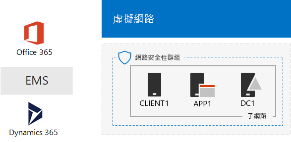
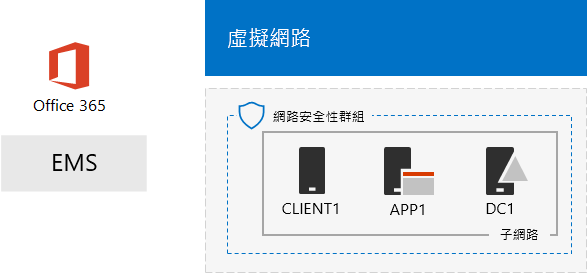

# 一個 Microsoft Cloud 開發/測試環境

 **摘要：**若要建立包含所有的 Microsoft cloud 方案的開發人員/測試環境中使用此測試實驗室指南。
  
使用本文中的指示，您可以在 Microsoft Azure 基礎結構服務中建立模擬內部網路然後再新增 [Microsoft Office 365、 Microsoft 企業行動性 + 安全性 (EMS) 及 Microsoft Dynamics 365 訂閱。結果是在單一的開發人員測試環境中同時使用所有 Microsoft cloud 方案簡化的組織。 
  

  
您可以使用要產生的設定：
  
- 跨 Microsoft cloud 方案，例如一般身分識別基礎結構所提供的 Azure Active Directory (AD) 體驗整合。
    
- 評估包含多個 Microsoft Cloud 方案的端對端案例。
    
- 建立示範 （英文）、 概念證明或使用多個 Microsoft Cloud 方案的開發人員/測試設定。
    
- 建置專業開發您 Microsoft Cloud 技能。
    
## 階段 1： 建立模擬內部網路及新增 Office 365

遵循[DirSync Office 365 開發人員/測試環境](dirsync-for-your-office-365-dev-test-environment.md)中的指示。
  
圖 1 顯示您所產生的組態，包括 Office 365 和 Azure 基礎結構服務和目錄同步處理中執行來自內部部署 Windows Server Active Directory (AD) 樹系模擬內部網路。
  
**圖 1： 模擬內部網路與 Office 365 搭配 Azure 中**

  
> [!NOTE]
> Azure 試用版是 30 天。Office 365 企業版 E5 試用版訂閱是 30 天，可輕鬆地延伸的另一個 30 天。在永久的開發人員測試環境中建立新付費 Azure 訂閱和新的授權數目很少付費的 Office 365 企業版 E5 訂閱。 
  
## 階段 2： 新增 EMS

在這個階段中，您可以註冊 EMS 試用訂閱，並將它新增至與 Office 365 試用訂閱相同的組織。
  
1. 其中一個瀏覽器與您的桌上型電腦或從 CLIENT1，登入 Office 365 入口網站在[https://portal.office.com](https://portal.office.com)以全域管理員帳戶的認證。
    
2. 按一下 [**系統**] 磚。
    
3. 在**Office 系統管理中心**] 索引標籤中瀏覽器中，在左導覽列中，按一下 [**帳務 > 購買服務**。
    
4. 在 [**購買服務**] 頁面上尋找**企業行動性 + 安全性 E5**項目。滑鼠指標停留並按一下 [**開始免費試用版**。
    
5. 在 [**確認您的訂單**] 頁面上按一下 [**立即試用**。
    
6. 在 [**順序回條**] 頁面上按一下 [**繼續**]。
    
> [!NOTE]
> Enterprise Mobility + Security E5 試用訂閱為 90 天。針對永久開發/測試環境，建立具有少數授權的新付費訂閱。 
  
接下來，可讓企業行動性 + 安全性 E5 授權的所有使用者帳戶。
  
1. 在**Office 365 系統管理中心**] 索引標籤中瀏覽器中，在左導覽列中，按一下 [**使用者 > 作用中使用者**。
    
2. 按一下 [您的全域管理員帳戶] 和 [**編輯****產品**授權。
    
3. 在**產品授權**] 窗格中，開啟**企業行動性 + 安全性 E5** **上**至產品授權、 按一下 [**儲存]**及 [**關閉**兩次。
    
4. 所有其他帳戶 （User1、 使用者 2、 3 使用者、 使用者 4 和使用者 5），請執行步驟 2 和 3。
    
開發/測試環境現在有：
  
- Azure 基礎結構服務中執行模擬內部網路。
    
- Office 365 E5 Enterprise 和 EMS 試用訂閱會與您的使用者帳戶清單共用相同的組織和相同的 Azure AD 租用戶。
    
- 您的所有使用者帳戶都會啟用以使用 Office 365 E5 Enterprise 和 EMS。
    
圖 2 顯示您所產生的設定，會新增 EMS。
  
**圖 2： 模擬內部網路與 Office 365 和 EMS Azure 中**

  
## 階段 3： 新增 Dynamics 365

在此階段中，您註冊 Dynamics 365 試用版訂閱並將其新增至 Office 365 和 EMS 試用版訂閱相同的組織。
  
1. 在 [您的桌上型電腦使用瀏覽器或從 CLIENT1，登入 Office 365 入口網站在[https://portal.office.com](https://portal.office.com)以全域管理員帳戶的認證。
    
2. 按一下 [**系統**] 磚。
    
3. 在**Office 系統管理中心**] 索引標籤的 [在左導覽列中，按一下 [**帳務 > 購買服務**。
    
4. 在 [**購買服務**] 頁面上尋找**Dynamics 365 計劃 1 Enterprise Edition**項目。滑鼠指標停留並按一下 [**開始免費試用版**。
    
5. 在 [**確認您的訂單**] 頁面上按一下 [**立即試用**。
    
6. 在 [**順序回條**] 頁面上按一下 [**繼續**]。
    
> [!NOTE]
> Dynamics 365 計劃 1 Enterprise Edition 試用訂閱是 30 天。您可以輕鬆地擴充另一個 30 天的軌跡訂閱。在永久的開發人員測試環境中建立新付費少量的授權與訂閱。 
  
使用下列步驟將 Dynamics 365 授權指派給全域管理員、 使用者 2 及 3 使用者帳戶，並使其系統管理員。
  
1. 在 [ **Office 系統管理中心**] 索引標籤上按一下 [**使用者 > 作用中使用者**。
    
2. 在作用中使用者清單中，按一下您的全域管理員帳戶] 和 [**編輯****產品**授權。
    
3. 在**產品授權**] 窗格中，開啟**Dynamics 365 計劃 1 Enterprise Edition** **上**至產品授權、 按一下 [**儲存]**及 [**關閉**兩次。
    
4. 使用者 2 和 3 使用者帳戶執行步驟 2 和 3。
    
5. 關閉**Office 系統管理中心**] 索引標籤。
    
使用下列步驟來設定使用者 2 和 3 使用者帳戶為 Dynamics 365 系統管理員。
  
1. 在瀏覽器中，在左導覽列中， **Office 系統管理中心**] 索引標籤上 [ **Admin 中心**，和 [ **Dynamics 365**。
    
    您可能需要等候 Dynamics 365 完成佈建之前 Dynamics 365 出現的功能表中。
    
2. 在 [Dynamics 365] 索引標籤上按一下 [**全部都**、] 和 [**完成安裝。**
    
    等候安裝程式完成。
    
    當安裝完成後時，它會顯示根據屬於軌跡訂閱資料範例銷售活動儀表板。需要一些時間來檢視**您的試用版歡迎使用**視訊。關閉 [視訊] 視窗時完成。
    
3. 在頂端工具列上，按一下 [**銷售**] 旁的向下箭號、 按一下 [**設定**] 及 [**安全性**。
    
4. 按一下 [**安全性**] 索引標籤的 [**使用者**]。
    
5. 在使用者清單中，按一下 [**使用者 2**。
    
6. 在 [工具] 列中，按一下 [**管理角色**。
    
7. 在**管理角色**、 按一下 [**系統管理員**，並再按一下 [**確定]**。
    
8. 在上方的 [工具] 列中按一下 [**安全性**]。
    
9. 使用者 3 帳戶重複步驟 5-8。
    
10. 關閉**使用者： User3** ] 索引標籤。
    
> [!NOTE]
> 您的 Office 365 全域管理員帳戶會自動指派 Dynamics 365 系統管理員角色。 
  
開發/測試環境現在有：
  
- Azure 基礎結構服務中執行模擬內部網路。
    
- Office 365 E5 企業、 EMS 及 Dynamics 365 試用版訂閱共用相同的組織與相同的 Azure AD 租用戶與您的使用者帳戶的清單。
    
- 您的所有使用者帳戶都會啟用以使用 Office 365 E5 Enterprise 和 EMS。
    
- 您的全域企業系統管理員、 使用者 2 和 3 使用者帳戶能夠使用 Dynamics 365 且 Dynamics 365 系統管理員。
    
圖 3 是您所產生的設定。
  
**圖 3： 模擬內部網路與 Office 365、 EMS、 和 Dynamics 365 Azure 中**

  
## 後續步驟

您現在可以實驗一個 Microsoft Cloud 開發/測試環境。導引式體驗的某些概念如下：
  
- [在 EMS for Office 365 應用程式設定行動裝置應用程式管理 (MAM) 原則](https://technet.microsoft.com/library/mt764059.aspx)
    
- [在 Office 365 整合 Dynamics 365 連絡人示範 Exchange Online](https://technet.microsoft.com/library/mt798313.aspx)
    
- [在主控伺服器為基礎的工作負載的 Azure 基礎結構服務中建立模擬的跨內部網路](https://technet.microsoft.com/library/mt745150.aspx)
    
## 請參閱

[雲端採用測試實驗室指南 (TLG)](cloud-adoption-test-lab-guides-tlgs.md)
  
[Microsoft Cloud IT 架構資源](microsoft-cloud-it-architecture-resources.md)
  
[混合式解決方案](hybrid-solutions.md)
  
[安全性解決方案](security-solutions.md)

