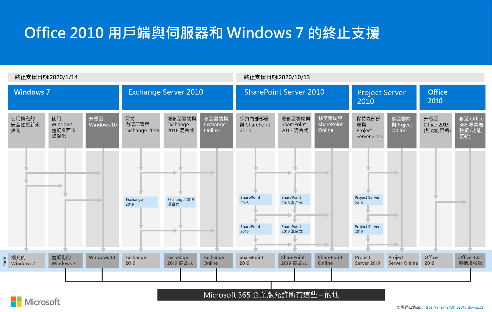

# 從 SharePoint 2010 升級Upgrading from SharePoint 2010

*本文適用於 Microsoft 365 企業版和 Office 365 企業版。**This article applies to both Microsoft 365 Enterprise and Office 365 Enterprise.*

Microsoft SharePoint 2010 和 SharePoint Server 2010 會在**年4月 13 2021 日**到達支援的支援。Microsoft SharePoint 2010 and SharePoint Server 2010 will reach end of support on **April 13, 2021**. 本文將詳細說明如何在 Microsoft 365 中將現有的 SharePoint 伺服器2010資料移轉至 SharePoint 線上，或升級內部部署 SharePoint Server 2010 環境。This article details resources to help you migrate your existing SharePoint Server 2010 data to SharePoint Online in Microsoft 365, or upgrade your on-premises SharePoint Server 2010 environment.
  
## 什麼是支援終止？What is end of support?

當您的 SharePoint Server 2010 和 SharePoint Foundation 2010 軟體達到其支援週期的結尾時 (Microsoft 提供新功能、bug 修正、安全性修正等) 時，這稱為軟體的「支援終止」，或有時候是「退休」。When your SharePoint Server 2010, and SharePoint Foundation 2010 software reaches the end of its support lifecycle (the time during which Microsoft provides new features, bug fixes, security fixes, and so on), this is called the software's 'end of support', or, sometimes, its 'Retirement'. 在支援的 (或 EOS) 產品時，實際上沒有任何實際關機或停止運作;不過，軟體支援結束時，Microsoft 不再提供：Upon the end of support (or EOS) of a product, nothing actually shuts down or stops working; however, at the end of support of software, Microsoft no longer provides:
  
- 可能發生之任何問題的技術支援；Technical support for problems that may occur;
    
- 所發現且可能會影響伺服器穩定性及可用性之問題的錯誤修正。Bug fixes for issues that are discovered and that may impact the stability and usability of the server;
    
- 所發現且可能會讓伺服器容易受到安全性威脅之弱點的安全性修正。Security fixes for vulnerabilities that are discovered and that may make the server vulnerable to security breaches;
    
- 時區更新。Time zone updates.
    
這表示，將不會為產品 (（包括安全性修補程式/修正) ）提供進一步的更新、修補程式或修正，而且 Microsoft 支援人員會將其支援工作完全移至較新的版本。That means, there will be no further updates, patches, or fixes will be shipped for the product (including security patches/fixes), and Microsoft Support will have fully shifted its support efforts to more recent versions. 在支援 SharePoint Server 2010 方法之後，您應該充分利用機會，以在升級產品及/或遷移重要資料之前，裁切您不再需要的資料。As the end of support of SharePoint Server 2010 approaches, you should take advantage of opportunities to trim data you no longer need prior to upgrading the product, and/or migrating your important data.
  
> [!NOTE]
> 軟體生命週期一般會從產品的初始發行日期起10年。A software lifecycle typically lasts for ten years from the date of the product's initial release. 您可以搜尋[microsoft 的解決方案提供者](https://go.microsoft.com/fwlink/?linkid=841249)，以協助升級至下一個版本的軟體，或搭配 microsoft 365 遷移 (或兩者) 。You can search for [Microsoft solution providers](https://go.microsoft.com/fwlink/?linkid=841249) who can help with upgrading to the next version of your software, or with Microsoft 365 migration (or both). 請務必注意，您已知道重要基礎技術的支援日期，尤其是您用 SharePoint 所用的 SQL Server 版本。Be certain you're aware of end of support dates on critical underlying technologies as well, particularly of the version of SQL Server you're using with SharePoint. 請參閱[固定生命週期原則](https://support.microsoft.com/help/14085)，以瞭解產品生命週期的詳細資料。See [Fixed Lifecycle Policy](https://support.microsoft.com/help/14085) to understand product lifecycle in detail.
  
## 我有哪些選擇？What are my options?

首先，檢查[產品生命週期網站](https://support.microsoft.com/lifecycle/search?alpha=SharePoint%20Server%202010)上的支援結束日期。First, check the date at which support ends on the [Product Lifecycle site](https://support.microsoft.com/lifecycle/search?alpha=SharePoint%20Server%202010). 接下來，請務必在此日期的知識中規劃升級或遷移時間。Next, be sure to plan your upgrade or migration time with knowledge of this date. 請記住，您的產品不會在列出的日期*停止運作*，而且您可以繼續使用，但由於在該日期之後將不再修補您的安裝，因此您將需要可協助您更順利轉換至產品的下一版本的策略。Remember that your product  *won't stop working*  at the date listed, and you can continue its use, but that, since your installation will no longer be patched after that date, you'll want a strategy that will help you more smoothly transition to the next version of the product. 
  
此矩陣可協助您在遷移產品功能和使用者資料時，繪製課程：This matrix helps plot a course when it comes to migrating product features and user data:
  
|**支援產品的結束****End of support product**|**良好****Good**|**最佳****Best**|
|:-----|:-----|:-----|
|SharePoint Server 2010SharePoint Server 2010    |SharePoint Server 2013 (內部部署) SharePoint Server 2013 (on-premises)    |SharePoint OnlineSharePoint Online    |
||SharePoint Server 2013 與 SharePoint 線上混合SharePoint Server 2013 hybrid with SharePoint Online    |SharePoint Server 2016 (內部部署) SharePoint Server 2016 (on-premises)    |
|||SharePoint 雲端混合式搜尋SharePoint Cloud Hybrid Search    |
   
如果您選擇 [比例下限] 上的 [選項] (好的選項) ，當您從 SharePoint Server 2010 遷移完成後，您必須立即開始規劃其他升級。If you choose options on the low end of the scale (good options), you'll need to start planning for another upgrade soon after migration from SharePoint Server 2010 completes. 

您可以採取三個路徑，以避免 SharePoint Server 2010 的支援結束。Here are the three paths you can take to avoid the end of support for SharePoint Server 2010.

>[!Note]
>SharePoint Server 2010 和 SharePoint Foundation 2010 的支援終止于4月13日的2021，但*請注意*，您應該時刻檢查[產品生命週期網站](https://support.microsoft.com/lifecycle)的最新日期。End of support for SharePoint Server 2010 and SharePoint Foundation 2010 are scheduled for April 13, 2021, but *please be aware* that you should always check the [Product Lifecycle site](https://support.microsoft.com/lifecycle) for the most current dates.
>

  
## 下一步應該在哪裡？Where should I go next?

SharePoint Server 2013 和 SharePoint Foundation 2013 可以在您自己的伺服器上安裝內部部署。SharePoint Server 2013 and SharePoint Foundation 2013 can be installed on-premises on your own servers. 否則，您可以使用 SharePoint 線上，也就是 Microsoft Microsoft 365 的一部分線上服務。Otherwise, you can use SharePoint Online, which is an online service that is part of Microsoft Microsoft 365. 您可以選擇：You can choose to:
  
- 移轉至 SharePoint OnlineMigrate to SharePoint Online
    
- 升級 SharePoint Server 或 SharePoint Foundation 內部部署Upgrade SharePoint Server or SharePoint Foundation on-premises
    
- 進行上述兩種操作Do both of the above
    
- 實施[SharePoint 的混合](https://docs.microsoft.com/sharepoint/hybrid/hybrid)式解決方案Implement a [SharePoint hybrid](https://docs.microsoft.com/sharepoint/hybrid/hybrid) solution 
    
請留意相關的隱藏成本，以維護伺服器陣列繼續進行、維護或遷移自訂專案，以及升級 SharePoint Server 所依賴的硬體。Be aware of hidden costs associated with maintaining a server farm going forward, maintaining or migrating customizations, and upgrading the hardware upon which SharePoint Server depends. 如果您已意識到以上所有事項，則繼續升級內部部署會比較容易。If you're aware and have accounted for all of these, it will be easier to continue upgrading on-premises. 否則，如果您在舊版的 SharePoint 伺服器上執行伺服器陣列，但沒有大量自訂，您可以從規劃的遷移受益至線上 SharePoint。Otherwise, if you run your farm on legacy SharePoint Servers without heavy customization, you could benefit from a planned migration to SharePoint Online. 您也可以在內部部署 SharePoint 伺服器環境中，將一些資料放在 SharePoint Online 中，以減少保留所有內部部署資料的硬體管理數量。It's also possible that for your on-premises SharePoint Server environment, you might opt to put some data in SharePoint Online to reduce the amount of hardware management that keeping that all your data on-premises involves. 將一些資料移至 SharePoint 線上時可能更經濟。It may be more economical to move some of your data into SharePoint Online.
  
> [!NOTE]
> SharePoint 系統管理員可以建立 Microsoft 365 訂閱、設定全新 SharePoint Online 網站，然後從 SharePoint Server 2010 完全移除，以將最基本的檔只放至全新的 SharePoint 線上網站。SharePoint Administrators may create a Microsoft 365 Subscription, set up a brand new SharePoint Online site, and then cut away from SharePoint Server 2010, cleanly, taking only the most essential documents to the fresh SharePoint Online sites. 從這裡開始，任何剩餘的資料都可能從 SharePoint Server 2010 網站耗盡為內部部署封存。From there, any remaining data may be drained from the SharePoint Server 2010 site into on-premises archives. 
  
|**SharePoint Online****SharePoint Online**|**SharePoint Server 內部部署****SharePoint Server on-premises**|
|:-----|:-----|
|高成本的時間 (規劃/執行/驗證) High cost in time (plan / execution / verification)    |高成本的時間 (規劃/執行/驗證) High cost in time (plan / execution / verification)    |
|降低基金成本 (未購買硬體) Lower cost in funds (no hardware purchases)    |基金 (購買硬體) 更高成本Higher cost in funds (hardware purchases)    |
|遷移時成本為一次One-time cost in migration    |每個未來遷移重複的單一時間成本One-time cost repeated per future migration    |
|低擁有權總成本/維護Low total cost of ownership / maintenance    |高擁有權總成本/維護High total cost of ownership / maintenance    |
   
當您遷移至 Microsoft 365 時，一次的移動會在規劃資料和決定要對雲端進行的工作時，以及決定要在) 進行的工作時，花更長的時間進行規劃、前期 (。When you migrate to Microsoft 365, the one-time move will have a heavier cost in time spent planning, up-front (while you're organizing data and deciding what to take to the cloud and what to leave behind). 不過，當您的資料移轉後，就會自動從該點進行升級，因為您不再需要管理軟硬體更新，而且伺服器陣列的時間將由 Microsoft 服務等級協定 ([SLA](https://go.microsoft.com/fwlink/?linkid=843153)) 所備份。However, once your data is migrated, upgrades will be automatic from that point, seeing as you will no longer need to manage hardware and software updates, and the up-time of your farm will be backed by a Microsoft Service Level Agreement ([SLA](https://go.microsoft.com/fwlink/?linkid=843153)).
  
### 移轉至 SharePoint OnlineMigrate to SharePoint Online

請確定 SharePoint 線上提供您所需的所有功能，方法是檢查其[服務描述](https://docs.microsoft.com/office365/servicedescriptions/sharepoint-online-service-description/sharepoint-online-service-description)。Be sure SharePoint Online offers all the features you need by reviewing its [service description](https://docs.microsoft.com/office365/servicedescriptions/sharepoint-online-service-description/sharepoint-online-service-description).
  
目前尚無任何方式可以直接從 SharePoint Server 2010 (或 SharePoint Foundation 2010) 遷移，以 SharePoint 線上，所以許多工作是手動進行的。There isn't currently a means by which you can directly migrate from SharePoint Server 2010 (or SharePoint Foundation 2010) to SharePoint Online, so much of the work is manual. 這可讓您有機會在移動之前封存及修剪不再需要的資料和網站。This does give you the opportunity to archive and prune data and sites that are no longer needed, before the move. 您可以將其他資料封存到儲存體。You can archive other data into storage. 另外請記住，SharePoint Server 2010 和 SharePoint Foundation 2010 都不會在支援結束時停止運作，所以管理員可以有一個句點，在此期間，如果客戶忘記移動某些資料，SharePoint 仍會執行。Also remember that neither SharePoint Server 2010 nor SharePoint Foundation 2010 will stop working at end of support, so administrators can have a period during which SharePoint is still running if their customers forget to move some of their data.
  
如果您升級為 SharePoint Server 2013 或 SharePoint Server 2016，並決定將資料放入 SharePoint 線上，您的移動也可能會涉及使用[SharePoint 遷移 API](https://support.office.com/article/Upload-on-premises-content-to-SharePoint-Online-using-PowerShell-cmdlets-555049c6-15ef-45a6-9a1f-a1ef673b867c?ui=en-US&amp;rs=en-US&amp;ad=US) (，將資訊遷移至 OneDrive 的商務) 。If you upgrade to SharePoint Server 2013 or SharePoint Server 2016, and decide to put data into SharePoint Online, your move might also involve using the [SharePoint Migration API](https://support.office.com/article/Upload-on-premises-content-to-SharePoint-Online-using-PowerShell-cmdlets-555049c6-15ef-45a6-9a1f-a1ef673b867c?ui=en-US&amp;rs=en-US&amp;ad=US) (to migrate information into OneDrive for Business). 
  
|**SharePoint 線上優勢****SharePoint Online advantage**|**SharePoint 線上缺點****SharePoint Online disadvantage**|
|:-----|:-----|
|Microsoft 提供 SPO 硬體和所有硬體管理。Microsoft supplies SPO hardware and all hardware administration.    |SharePoint Server 內部部署和 SPO 之間可用的功能可能會有所不同。Available features may be different between SharePoint Server on-premises and SPO.    |
|您是訂閱的全域系統管理員，而且可能會指派管理員來 SPO 網站。You are the global administrator of your subscription and may assign administrators to SPO sites.    |在 Microsoft SharePoint Server 內部部署中，伺服器陣列管理員可使用的部分動作不存在 (或不是必要) 在 Microsoft 365 的 SharePoint 系統管理員角色中，但 SharePoint 管理、網站集合管理，以及網站擁有權是您的組織當地的地方。Some actions available to a Farm Administrator in SharePoint Server on-premises do not exist (or are not necessary) in the SharePoint Administrator role in Microsoft 365, but SharePoint Administration, Site Collection Administration, and Site Ownership are local to your org.    |
|Microsoft 會對底層硬體和軟體 (套用修補程式、修正及更新，包括 SharePoint 線上執行) 的 SQL server。Microsoft applies patches, fixes and updates to underlying hardware and software (including SQL servers on which SharePoint Online runs).    |由於服務沒有存取基礎檔案系統，因此某些自訂專案有限。Because there is no access to the underlying file system in the service, some customizations are limited.    |
|Microsoft 發佈[服務等級協定](https://go.microsoft.com/fwlink/?linkid=843153)，並快速移動以解決服務等級事件。Microsoft publishes [Service Level Agreements](https://go.microsoft.com/fwlink/?linkid=843153) and moves quickly to resolve service level incidents.    |備份與還原和其他修復選項會透過服務自動覆寫 SharePoint 線上備份會覆寫（如果不使用）。Backup and restore and other recovery options are automated by the service in SharePoint Online - backups are overwritten if not used.    |
|安全性測試和伺服器效能調整是由 Microsoft 在服務中持續執行。Security testing and server performance tuning are carried out on an ongoing basis in the service by Microsoft.    |變更使用者介面及其他 SharePoint 功能會由服務安裝，而且可能需要切換開啟或關閉。Changes to the user interface and other SharePoint features are installed by the service and may need to be toggled on or off.    |
|Microsoft 365 符合許多行業標準： [microsoft 規範服務](https://go.microsoft.com/fwlink/?linkid=843165)。Microsoft 365 meets many industry standards: [Microsoft compliance offerings](https://go.microsoft.com/fwlink/?linkid=843165).    |遷移的[FastTrack](https://go.microsoft.com/fwlink/?linkid=518597)協助是有限的。[FastTrack](https://go.microsoft.com/fwlink/?linkid=518597) assistance for migration is limited.    大部分的升級是手動或透過[SharePoint 線上和 OneDrive 遷移內容藍圖](https://go.microsoft.com/fwlink/?linkid=843184)中所述的 SPO 遷移 API。Much of the upgrade will be manual, or via the SPO Migration API described in the [SharePoint Online and OneDrive Migration Content Roadmap](https://go.microsoft.com/fwlink/?linkid=843184).    |
|Microsoft 支援工程師和資料中心內的員工都沒有無限制的系統管理員存取您的訂閱。Neither Microsoft Support Engineers nor employees in the datacenter have unrestricted admin access to your subscription.    |若需要升級硬體基礎結構以支援較新版本的 SharePoint，或若升級需要次要伺服器陣列，可能會有額外的成本。There can be additional costs if hardware infrastructure needs to be upgraded to support the newer version of SharePoint, or if a secondary farm is required for upgrade.    |
|解決方案供應商可以協助一次將您的資料移轉至 SharePoint 線上的工作。Solution providers can assist with the one-time job of migrating your data to SharePoint Online.    |您的控制項內並未 SharePoint 線上的所有變更。Not all changes to SharePoint Online are within your control. 遷移後，功能表、文件庫和其他功能的設計差異可能會暫時影響可用性。After migration, design differences in menus, libraries, and other features may temporarily affect usability.    |
|線上產品會自動更新整個服務的意義，但功能可能會取代，而且不會有真正的支援生命週期的結束。Online products are updated automatically across the service meaning that though features may deprecate, there is no true end of support Lifecycle.    |SharePoint Server (或 SharePoint Foundation) 以及基礎 SQL server 的支援週期已結束。There is an end of support Lifecycle for SharePoint Server (or SharePoint Foundation) as well as underlying SQL servers.    |
   
如果您決定建立新的 Microsoft 365 網站，並在需要時手動將資料移轉到它，您可以查看您的[Microsoft 365 選項](https://www.microsoft.com/microsoft-365/)。If you've decided to create a new Microsoft 365 site, and will manually migrate data to it as is needed, you can look at your [Microsoft 365 options](https://www.microsoft.com/microsoft-365/).
  

  
### 升級 SharePoint 伺服器內部部署Upgrade SharePoint Server on-premises

到目前為止 SharePoint 內部部署產品的最新版本 (SharePoint Server 2019) ，SharePoint 伺服器升級必須*連續*進行，這表示您無法從 SharePoint server 2010 升級為 SharePoint 伺服器2016，也無法直接 SharePoint 2019。As of the latest version of the SharePoint on-premises product (SharePoint Server 2019), SharePoint Server upgrades must go  *serially*, that means there is no way to upgrade from SharePoint Server 2010 to SharePoint Server 2016 or to SharePoint 2019, directly. 
  
|||
|:-----|:-----|
||串列升級路徑 \* \* \* \*： SharePoint Server 2010 **\>** SharePoint server 2013 **\>** SharePoint server 2016\*\*\*\*Serial upgrade path\*\*\*\*: SharePoint Server 2010 **\>** SharePoint Server 2013 **\>** SharePoint Server 2016 |
   
如果您選擇追蹤從 SharePoint 2010 到 SharePoint 伺服器2016的整個路徑，這將需要一些時間與進行規劃。If you choose to follow the entire path from SharePoint 2010 to SharePoint Server 2016, this will take time and planning. 升級在升級的硬體方面需要成本 (請注意，SQL server 也必須升級) 、軟體和管理。Upgrades involve a cost in terms of upgraded hardware (be aware that SQL servers must also be upgraded), software, and administration. 此外，可能需要升級自訂專案，或甚至放棄自訂專案。Also, customizations may need to be upgraded, or even abandoned. 請務必先收集所有重要自訂專案的附注，再升級 SharePoint 伺服器陣列。Be sure that you collect notes on all of your critical customizations before you upgrade your SharePoint Server farm.
  
> [!NOTE]
> 您可以維持 SharePoint 2010 伺服器陣列的支援，在新的硬體 (上安裝 SharePoint 伺服器2016伺服器陣列，讓個別的伺服器陣列執行並列) ，然後規劃並執行手動遷移內容 (，以下載及重新上傳內容，例如) 。It's possible to maintain your end of support SharePoint 2010 farm, install a SharePoint Server 2016 farm on new hardware (so the separate farms run side-by-side), and then plan and execute a manual migration of content (for downloading and re-uploading content, for example). 這些手動移動會有可能的缺陷 (例如，來自2010的檔具有目前最後一個修改過的帳戶，且具有執行手動移動) 之帳戶的別名，而且某些工作必須在 (重新建立網站、子網站、許可權和清單結構) 的時間之前完成。There are potential pitfalls to these manual moves (such as documents coming from 2010 having a current last modified account with the alias of the account doing the manual move), and some work must be done ahead of time (recreating sites, sub-sites, permissions and list structures). 最好是考慮哪些資料可以移至儲存區，或不再需要。It's a good time to consider what data you can move into storage, or no longer need. 這可減少遷移的影響。This can reduce the impact of migration. 無論是哪種方式，在升級之前先清理您的環境。Either way, clean your environment prior to upgrade. 請確定您的現有伺服器陣列在升級之前是否運作正常，並在您解除委任之前 (以確認) ！Be certain your existing farm is functional before you upgrade, and (for sure) before you decommission! 
  
請記得查看**支援和不支援的升級路徑**：Remember to review the **supported and unsupported upgrade paths**: 
  
- [SharePoint Server 2010SharePoint Server 2010](https://go.microsoft.com/fwlink/?linkid=843156)
    
- [SharePoint Server 2013SharePoint Server 2013](https://go.microsoft.com/fwlink/?linkid=843157)
    
如果您有**自訂**，請務必為遷移路徑中的每個步驟規劃升級：If you have **customizations**, it's critical you have a plan your upgrade for each step in the migration path: 
  
- [SharePoint Server 2010SharePoint Server 2010](https://go.microsoft.com/fwlink/?linkid=843160)
    
- [SharePoint Server 2013SharePoint Server 2013](https://go.microsoft.com/fwlink/?linkid=843162)
    
|**內部部署優勢****On-premises advantage**|**內部部署缺點****On-premises disadvantage**|
|:-----|:-----|
|完全控制 SharePoint 伺服器陣列的所有層面 (及其 SQL) 從伺服器硬體向上。Full control of all aspects of your SharePoint Farm (and it's SQL), from the server hardware up.    |所有中斷和修正都是貴公司 (的責任，但是如果您的產品並非支援，您可以接洽「付費的 Microsoft 支援」) ：All breaks and fixes are the responsibility of your company (but you can engage paid Microsoft Support if your product is not at end of support):    |
|SharePoint Server 內部部署的完整功能集合，具有透過混合方式將內部部署伺服器陣列連線至 SharePoint Online 訂閱的選項。Full feature set of SharePoint Server on-premises with the option to connect your on-premises farm to a SharePoint Online subscription via hybrid.    |升級、修補程式、安全性修正程式、硬體升級，以及 SharePoint 伺服器的所有維護，而且其 SQL 伺服器陣列都是在內部部署管理。Upgrade, patches, security fixes, hardware upgrades, and all maintenance of SharePoint Server and it's SQL farm are managed on-premises.    |
|自訂選項的完整存取權，與 SharePoint 線上的功能更高。Full access for greater customization options than with SharePoint Online.    |[Microsoft 規範服務](https://go.microsoft.com/fwlink/?linkid=843165)必須手動設定內部部署。[Microsoft compliance offerings](https://go.microsoft.com/fwlink/?linkid=843165) must be manually configured on-premises.    |
|您的內部部署 (在您的控制項) 上進行安全性測試和伺服器效能調整。Security testing, and server performance tuning, carried out on your premises (under your control).    |Microsoft 365 可能使 SharePoint 線上使用的功能無法與內部部署 SharePoint 伺服器互動Microsoft 365 may make features available to SharePoint Online that do not interoperate with SharePoint Server on-premises    |
|解決方案供應商可以協助將資料移轉至下一個版本的 SharePoint Server (，但超過) 。Solution providers can assist with migrating data to the next version of SharePoint Server (and beyond).    |您的 SharePoint 伺服器網站不會自動使用 SharePoint Online 中所看到[SSL/TLS](https://go.microsoft.com/fwlink/?linkid=843167)憑證。Your SharePoint Server sites will not automatically use [SSL/TLS](https://go.microsoft.com/fwlink/?linkid=843167) certificates as is seen in SharePoint Online.    |
|在內部部署中 SharePoint Server 內部部署命名慣例、備份與還原及其他復原選項的完整控制權。Full control of naming conventions, backup and restore and other recovery options in SharePoint Server on-premises.    |SharePoint Server 內部部署對產品生命週期保密。SharePoint Server on-premises is sensitive to Product Lifecycles.    |
   
### 升級資源Upgrade Resources

請先比較硬體和軟體需求。Begin by comparing hardware and software requirements. 如果您在目前的硬體上沒有符合升級的基本需求，這可能表示您必須先升級伺服器陣列或 SQL server 中的硬體，否則您可能會決定將部分的網站移至 SharePoint 線上的「長綠」硬體。If you don't meet basic requirements for the upgrade on current hardware, that can mean you need to upgrade the hardware in the farm or SQL servers first, or that you may decide to move some percentage of your sites to the 'evergreen' hardware of SharePoint Online. 進行評估之後，請遵循支援的升級路徑和方法。Once you've made your assessment, follow supported upgrade paths and methods.
  
- **硬體/軟體需求**：**Hardware/software requirements for**: 
    
    [SharePoint Server 2010](https://go.microsoft.com/fwlink/?linkid=843204)  | [SharePoint Server 2013](https://go.microsoft.com/fwlink/?linkid=843206)  | [SharePoint Server 2016](https://go.microsoft.com/fwlink/?linkid=843207)[SharePoint Server 2010](https://go.microsoft.com/fwlink/?linkid=843204) | [SharePoint Server 2013](https://go.microsoft.com/fwlink/?linkid=843206) | [SharePoint Server 2016](https://go.microsoft.com/fwlink/?linkid=843207)
    
- **軟體界限和限制**：**Software boundaries and limits for**: 
    
    [SharePoint Server 2010](https://go.microsoft.com/fwlink/?linkid=843247)  | [SharePoint Server 2013](https://go.microsoft.com/fwlink/?linkid=843248)  | [SharePoint Server 2016](https://go.microsoft.com/fwlink/?linkid=843249)[SharePoint Server 2010](https://go.microsoft.com/fwlink/?linkid=843247) | [SharePoint Server 2013](https://go.microsoft.com/fwlink/?linkid=843248) | [SharePoint Server 2016](https://go.microsoft.com/fwlink/?linkid=843249)
    
- 下列專案**的升級程式概述**：**The upgrade process overview for**: 
    
    [SharePoint Server 2010](https://go.microsoft.com/fwlink/?linkid=843251)  | [SharePoint Server 2013](https://go.microsoft.com/fwlink/?linkid=843252)  | [SharePoint Server 2016](https://go.microsoft.com/fwlink/?linkid=843359)[SharePoint Server 2010](https://go.microsoft.com/fwlink/?linkid=843251) | [SharePoint Server 2013](https://go.microsoft.com/fwlink/?linkid=843252) | [SharePoint Server 2016](https://go.microsoft.com/fwlink/?linkid=843359)
    
### 在 SharePoint 線上和 SharePoint 伺服器內部部署之間建立 SharePoint 的混合式解決方案Create a SharePoint hybrid solution between SharePoint Online and SharePoint Server on-premises

另一個選項 (可能是內部部署和線上世界的最佳方式，以供部分遷移需求) 混合式，您可以將 SharePoint Server 2013 或2016或2019伺服器陣列連線至 SharePoint 線上，以建立 SharePoint 混合式：[深入瞭解 SharePoint 混合式解決方案](https://support.office.com/article/4c89a95a-a58c-4fc1-974a-389d4f195383.aspx)。Another option (one that may be the best of both on-premises and online worlds for some migration needs) is a hybrid, you can connect SharePoint Server 2013 or 2016 or 2019 farms to SharePoint Online to create a SharePoint hybrid: [Learn about SharePoint hybrid solutions](https://support.office.com/article/4c89a95a-a58c-4fc1-974a-389d4f195383.aspx).
  
如果您決定混合式 SharePoint 伺服器陣列是您的遷移目標，請務必規劃應該在線上中移動的網站和使用者，以及必須保留內部部署的網站和使用者。If you decide a hybrid SharePoint Server farm is your migration goal, be sure to plan what sites and users you should move to online, and which need to remain on-premises. 檢查和排名您的 SharePoint 伺服器陣列內容， (判斷對公司的高、中或低影響的資料，) 對您作出這項決策都有説明。A review and ranking of your SharePoint Server farm's content (determining what data is High, Medium, or Low impact to your company) can be helpful to making this decision. 您可能只需要與 SharePoint Online 共用 () 的使用者帳戶來登入，而 (b) SharePoint 伺服器搜尋索引--則在您查看網站的使用方式之前，可能不會有任何明確的做法。It may be that the only thing you need to share with SharePoint Online is (a) user accounts for login, and (b) the SharePoint Server search index -- this may not be clear until you look at how your sites are used. 如果您的公司後來決定將您的所有內容遷移至 SharePoint 線上，您可以將所有剩餘的帳戶和資料線上移動，並解除委任您的內部部署伺服器陣列，而且 SharePoint 伺服器陣列的管理/管理將透過從該點開始的 Microsoft 365 主控台進行。If your company later decides to migrate all of your content to SharePoint Online, you can move all remaining accounts and data online and decommission your on-premises farm, and management/administration of the SharePoint farm will be done through Microsoft 365 consoles from that point on.
  
請務必熟悉現有的混合式類型，以及如何設定內部部署 SharePoint 伺服器陣列與 Microsoft 365 訂閱之間的連線。Be sure to familiarize yourself with the existing types of hybrid and how to configure the connection between your on-premises SharePoint farm and your Microsoft 365 subscription.
  
[Microsoft 規範服務](https://go.microsoft.com/fwlink/?linkid=843165)。[Microsoft compliance offerings](https://go.microsoft.com/fwlink/?linkid=843165).    |遷移的[FastTrack](https://www.microsoft.com/fasttrack/microsoft-365)協助是有限的。|[FastTrack](https://www.microsoft.com/fasttrack/microsoft-365) assistance for migration is limited.    大部分的升級是手動或透過[SharePoint 線上和 OneDrive 遷移內容藍圖](https://go.microsoft.com/fwlink/?linkid=843184)中所述的 SPO 遷移 API。Much of the upgrade will be manual, or via the SPO Migration API described in the [SharePoint Online and OneDrive Migration Content Roadmap](https://go.microsoft.com/fwlink/?linkid=843184).    | |Microsoft 支援工程師和資料中心內的員工都沒有無限制的系統管理員存取您的訂閱。| |Neither Microsoft Support Engineers nor employees in the datacenter have unrestricted admin access to your subscription.    |若需要升級硬體基礎結構以支援較新版本的 SharePoint，或若升級需要次要伺服器陣列，可能會有額外的成本。|There can be additional costs if hardware infrastructure needs to be upgraded to support the newer version of SharePoint, or if a secondary farm is required for upgrade.    | |合作夥伴可協助您將資料移轉到線上 SharePoint 的單一時間工作。| |Partners can assist with the one-time job of migrating your data to SharePoint Online.    |||線上產品會自動更新整個服務的意義，但功能可能會取代，而且不會有真正的支援端點。|| |Online products are updated automatically across the service meaning that though features may deprecate, there is no true end of support.    ||
   
如果您決定建立新的 Microsoft 365 網站，並在需要時手動將資料移轉到它，您可以查看您的[Microsoft 365 選項](https://www.microsoft.com/microsoft-365/)。If you've decided to create a new Microsoft 365 site, and will manually migrate data to it as is needed, you can look at your [Microsoft 365 options](https://www.microsoft.com/microsoft-365/).
  
### 升級 SharePoint 伺服器內部部署Upgrade SharePoint Server on-premises

過去沒有任何方法可以略過 SharePoint 升級的版本，至少不會在發行 SharePoint Server 2016。There is historically no way to skip versions in SharePoint Upgrades, at least not as of the release of SharePoint Server 2016. 這表示升級順序如下：That means upgrades go serially:
  
|||
|:-----|:-----|
||SharePoint 2007SharePoint 2007 | SharePoint Server 2010SharePoint Server 2010 | SharePoint Server 2013SharePoint Server 2013 | SharePoint Server 2016SharePoint Server 2016 |
   
若要從 SharePoint 2007 到 SharePoint Server 2016 的完整途徑，將會帶來大量的時間，而且在升級的硬體方面需要成本 (請注意，SQL server 也必須升級) 、軟體和管理。To take the entire path from SharePoint 2007 to SharePoint Server 2016 will mean a significant investment of time and will involve a cost in terms of upgraded hardware (be aware that SQL servers must also be upgraded), software, and administration. 根據功能的重要性，必須升級或放棄自訂專案。Customizations will need to be upgraded or abandoned, according to the criticality of the feature.
  
> [!NOTE]
> 您可以維持生命週期的 SharePoint 2007 伺服器陣列，在新的硬體 (上安裝 SharePoint 伺服器2016伺服器陣列，讓個別的伺服器陣列執行並列) ，然後規劃並執行手動遷移內容 (，以下載及重新上傳內容，例如) 。It's possible to maintain your end-of-life SharePoint 2007 farm, install a SharePoint Server 2016 farm on new hardware (so the separate farms run side-by-side), and then plan and execute a manual migration of content (for downloading and re-uploading content, for example). 請注意，手動移動的部分陷阱 (例如，移動檔會以執行手動移動) 之帳戶的別名取代最後一個修改的帳戶，而必須在 (時間之前完成的工作，例如重新建立網站、子網站、許可權和清單結構) 。Be aware of some of the gotchas of manual moves (such as moves of documents replacing the last modified account with the alias of the account doing the manual move), and the work that must be done ahead of time (such as recreating sites, sub-sites, permissions and list structures). 同樣地，這是考慮您可以移至儲存體或不再需要的資料，可降低遷移影響的動作。Again, this is the time to consider what data you can move into storage, or no longer need, an action that can reduce the impact of migration.
  
無論是哪種方式，在升級之前先清理您的環境。Either way, clean your environment prior to upgrade. 請確定您的現有伺服器陣列在升級之前是否運作正常，並在您解除委任之前 (以確認) ！Be certain your existing farm is functional before you upgrade, and (for sure) before you decommission! 
  
請記得查看**支援和不支援的升級路徑**：Remember to review the **supported and unsupported upgrade paths**: 
  
- [SharePoint Server 2007SharePoint Server 2007](https://go.microsoft.com/fwlink/?linkid=843156)
    
- [SharePoint Server 2010SharePoint Server 2010](https://go.microsoft.com/fwlink/?linkid=843156)
    
- [SharePoint Server 2013SharePoint Server 2013](https://go.microsoft.com/fwlink/?linkid=843157)
    
如果您有**自訂**，請務必為遷移路徑中的每個步驟規劃升級：If you have **customizations**, it's critical you have a plan your upgrade for each step in the migration path: 
  
- [SharePoint 2007SharePoint 2007](https://go.microsoft.com/fwlink/?linkid=843158)
    
- [SharePoint Server 2010SharePoint Server 2010](https://go.microsoft.com/fwlink/?linkid=843160)
    
- [SharePoint Server 2013SharePoint Server 2013](https://go.microsoft.com/fwlink/?linkid=843162)
    
|**內部部署 Pro****On-premises Pro**|**內部部署 Con****On-premises Con**|
|:-----|:-----|
|完全控制 SharePoint 伺服器陣列的所有層面，從伺服器硬體向上。Full control of all aspects of your SharePoint Farm, from the server hardware up.    |所有中斷和修正都是貴公司 (若您的產品並非支援服務，請與付費的 Microsoft 支援人員接洽) ：All breaks and fixes are the responsibility of your company (can engage paid Microsoft Support if your product is not at end of support):    |
|SharePoint Server 內部部署的完整功能集合，具有透過混合方式將內部部署伺服器陣列連線至 SharePoint Online 訂閱的選項。Full feature set of SharePoint Server on-premises with the option to connect your on-premises farm to a SharePoint Online subscription via hybrid.    |升級、修補程式、安全性修正程式，以及 SharePoint 伺服器的所有維護都受內部部署管理。Upgrade, patches, security fixes, and all maintenance of SharePoint Server managed on-premises.    |
|取得更佳自訂的完整存取權。Full access for greater customization.    |[Microsoft 規範服務](https://go.microsoft.com/fwlink/?linkid=843165)必須手動設定內部部署。[Microsoft compliance offerings](https://go.microsoft.com/fwlink/?linkid=843165) must be manually configured on-premises.    |
|在您的內部部署 (所執行的安全性測試和伺服器效能調整，都是由您的控制) 。Security testing, and server performance tuning, carried out on your premises (is under your control).    |Microsoft 365 可能使 SharePoint 線上使用的功能無法與內部部署 SharePoint 伺服器互動Microsoft 365 may make features available to SharePoint Online that do not interoperate with SharePoint Server on-premises    |
|合作夥伴可協助您將資料移轉至下一版的 SharePoint Server (且超過) 。Partners can assist with migrating data to the next version of SharePoint Server (and beyond).    |您的 SharePoint 伺服器網站不會自動使用 SharePoint Online 中所看到[SSL/TLS](https://go.microsoft.com/fwlink/?linkid=843167)憑證。Your SharePoint Server sites will not automatically use [SSL/TLS](https://go.microsoft.com/fwlink/?linkid=843167) certificates as is seen in SharePoint Online.    |
|在內部部署中 SharePoint Server 內部部署命名慣例、備份與還原及其他復原選項的完整控制權。Full control of naming conventions, backup and restore and other recovery options in SharePoint Server on-premises.    |SharePoint Server 內部部署對產品生命週期保密。SharePoint Server on-premises is sensitive to product lifecycles.    |
   
### 升級資源Upgrade Resources

請先知道您符合硬體和軟體需求，然後再遵循支援的升級方法。Begin by knowing that you meet hardware and software requirements, then follow supported upgrade methods.
  
- **硬體/軟體需求**：**Hardware/software requirements for**: 
    
    [SharePoint Server 2010](https://go.microsoft.com/fwlink/?linkid=843204)  | [SharePoint Server 2010](https://go.microsoft.com/fwlink/?linkid=843204)  | [SharePoint Server 2013](https://go.microsoft.com/fwlink/?linkid=843206)  | [SharePoint Server 2016](https://go.microsoft.com/fwlink/?linkid=843207)[SharePoint Server 2010](https://go.microsoft.com/fwlink/?linkid=843204) | [SharePoint Server 2010](https://go.microsoft.com/fwlink/?linkid=843204) | [SharePoint Server 2013](https://go.microsoft.com/fwlink/?linkid=843206) | [SharePoint Server 2016](https://go.microsoft.com/fwlink/?linkid=843207)
    
- **軟體界限和限制**：**Software boundaries and limits for**: 
    
    [SharePoint Server 2007](https://go.microsoft.com/fwlink/?linkid=843245)  | [SharePoint Server 2010](https://go.microsoft.com/fwlink/?linkid=843247)  | [SharePoint Server 2013](https://go.microsoft.com/fwlink/?linkid=843248)  | [SharePoint Server 2016](https://go.microsoft.com/fwlink/?linkid=843249)[SharePoint Server 2007](https://go.microsoft.com/fwlink/?linkid=843245) | [SharePoint Server 2010](https://go.microsoft.com/fwlink/?linkid=843247) | [SharePoint Server 2013](https://go.microsoft.com/fwlink/?linkid=843248) | [SharePoint Server 2016](https://go.microsoft.com/fwlink/?linkid=843249)
    
- 下列專案**的升級程式概述**：**The upgrade process overview for**: 
    
    [SharePoint Server 2007](https://go.microsoft.com/fwlink/?linkid=843250)  | [SharePoint Server 2010](https://go.microsoft.com/fwlink/?linkid=843251)  | [SharePoint Server 2013](https://go.microsoft.com/fwlink/?linkid=843252)  | [SharePoint Server 2016](https://go.microsoft.com/fwlink/?linkid=843359)[SharePoint Server 2007](https://go.microsoft.com/fwlink/?linkid=843250) | [SharePoint Server 2010](https://go.microsoft.com/fwlink/?linkid=843251) | [SharePoint Server 2013](https://go.microsoft.com/fwlink/?linkid=843252) | [SharePoint Server 2016](https://go.microsoft.com/fwlink/?linkid=843359)
    
### 在 SharePoint Online 與內部部署之間建立 SharePoint 的混合式解決方案Create a SharePoint hybrid solution between SharePoint Online and on-premises

如果您對遷移的答案是在內部部署所提供的自我控制之間的某個地方，而且 SharePoint Online 提供的擁有成本較低，您可以透過混合方式，將 SharePoint Server 2013 或2016伺服器陣列連線至 SharePoint。If the answer to your migration needs is somewhere between the self-control offered by on-premises, and the lower cost of ownership offered by SharePoint Online, you can connect SharePoint Server 2013 or 2016 farms to SharePoint Online, through hybrids. [深入瞭解 SharePoint 混合式解決方案Learn about SharePoint hybrid solutions](https://support.office.com/article/4c89a95a-a58c-4fc1-974a-389d4f195383.aspx)
  
如果您決定混合式 SharePoint 伺服器陣列將會對您的業務帶來好處，請熟悉現有的混合式類型，以及如何設定內部部署 SharePoint 伺服器陣列與 Microsoft 365 訂閱之間的連線。If you decide that a hybrid SharePoint Server farm will benefit your business, familiarize yourself with the existing types of hybrid and how to configure the connection between your on-premises SharePoint farm and your Microsoft 365 subscription.
  
若要瞭解其運作方式的一個好方法是建立 Microsoft 365 開發/測試環境，您可以使用[測試實驗室指南](https://docs.microsoft.com/microsoft-365/enterprise/m365-enterprise-test-lab-guides)加以設定。One good way to see how this works is by creating a Microsoft 365 dev/test environment, which you can set up with [Test Lab Guides](https://docs.microsoft.com/microsoft-365/enterprise/m365-enterprise-test-lab-guides). 當您擁有試用版或購買的 Microsoft 365 訂閱後，您就可以在 SharePoint Online 中建立網站集合、網站及文件庫，以透過使用遷移 API 的方式手動遷移資料 (或-如果您想要透過混合式的嚮導) 將「我的網站」內容遷移至 OneDrive。Once you have a trial or purchased Microsoft 365 subscription, you'll be on your way to creating the site collections, webs, and document libraries in SharePoint Online to which you can migrate data (either manually, by use of the Migration API, or - if you want to migrate My Site content to OneDrive for Business - through the hybrid wizard).
  
> [!NOTE]
> 請記住，您的 SharePoint 伺服器2010伺服器陣列即將第一次升級、內部部署，以 SharePoint 伺服器2013或 SharePoint Server 2016，以使用 [混合] 選項。Remember that your SharePoint Server 2010 farm will first need to be upgraded, on-premises, to either SharePoint Server 2013 or SharePoint Server 2016 to use the hybrid option. SharePoint Foundation 2010 和 SharePoint Foundation 2013 無法建立與 SharePoint 線上的混合連接。SharePoint Foundation 2010 and SharePoint Foundation 2013 cannot create hybrid connections with SharePoint Online. 

## 適用於 Office 2010 用戶端與伺服器和 Windows 7 的選項摘要Summary of options for Office 2010 client and servers and Windows 7

如需適用於 Office 2010 用戶端與伺服器和 Windows 7 的升級、移轉和移至雲端選項的視覺摘要，請參閱[終止支援海報](./downloads/Office2010Windows7EndOfSupport.pdf)。For a visual summary of the upgrade, migrate, and move-to-the-cloud options for Office 2010 clients and servers and Windows 7, see the [end of support poster](./downloads/Office2010Windows7EndOfSupport.pdf).

這張單頁海報可讓您快速了解可以採取的各種方法，以防止Office 2010 用戶端與伺服器產品以及 Windows 7 進入終止支援，而海報上也會強調顯示 Microsoft 365 企業版中慣用的方式和選項支援。This one-page poster is a quick way to understand the various paths you can take to prevent Office 2010 client and server products and Windows 7 from reaching end of support, with preferred paths and option support in Microsoft 365 Enterprise highlighted.

您可以[下載](https://github.com/MicrosoftDocs/microsoft-365-docs/raw/public/microsoft-365/media/migration-microsoft-365-enterprise-workload/Office2010Windows7EndOfSupport.pdf)此海報，並以 Letter、Legal 或 Tabloid (11 x 17) 格式列印此海報。You can also [download](https://github.com/MicrosoftDocs/microsoft-365-docs/raw/public/microsoft-365/media/migration-microsoft-365-enterprise-workload/Office2010Windows7EndOfSupport.pdf) this poster and print it in letter, legal, or tabloid (11 x 17) formats.
        
## 相關主題Related topics

[協助您從 Office 2007 或2010伺服器及用戶端升級的資源Resources to help you upgrade from Office 2007 or 2010 servers and clients](upgrade-from-office-2010-servers-and-products.md)
  
[Overview of the upgrade process from SharePoint 2010 to SharePoint 2013Overview of the upgrade process from SharePoint 2010 to SharePoint 2013](https://technet.microsoft.com/library/mt493301%28v=office.16%29.aspx)
  
[從 SharePoint 2010 升級至 SharePoint 2013 的最佳作法Best practices for upgrading from SharePoint 2010 to SharePoint 2013](https://technet.microsoft.com/library/mt493305%28v=office.16%29.aspx)
  
[在 SharePoint 2013 中針對資料庫的升級問題進行疑難排解Troubleshoot database upgrade issues in SharePoint 2013](https://go.microsoft.com/fwlink/?linkid=843195)
  
[搜尋 Microsoft 解決方案供應商以協助您升級Search for Microsoft solution providers to help with your upgrade](https://go.microsoft.com/fwlink/?linkid=841249)
  
[已更新 SharePoint 2013 的產品服務原則Updated Product Servicing Policy for SharePoint 2013](https://technet.microsoft.com/library/mt493253%28v=office.16%29.aspx)
  
[已更新 SharePoint Server 2016 的產品服務原則Updated Product Servicing Policy for SharePoint Server 2016](https://technet.microsoft.com/library/mt782882%28v=office.16%29.aspx)
  

