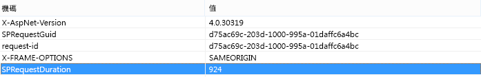
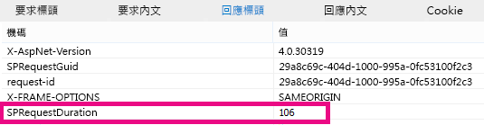

# 使用內容搜尋網頁組件而不內容查詢網頁組件，來改善 SharePoint Online 中的效能Using Content Search Web Part instead of Content Query Web Part to improve performance in SharePoint Online

本文說明如何取代內容搜尋網頁組件，SharePoint Server 2013 和 SharePoint Online 中的 「 內容查詢網頁組件以提升效能。This article describes how to increase performance by replacing the Content Query Web Part with the Content Search Web Part in SharePoint Server 2013 and SharePoint Online.
  
SharePoint Server 2013 和 SharePoint Online 的最強大的新功能之一是內容搜尋網頁組件 (CSWP)。One of the most powerful new features of SharePoint Server 2013 and SharePoint Online is the Content Search Web Part (CSWP). 此網頁組件會使用搜尋索引來快速地擷取向使用者顯示的結果。This Web Part uses the search index to quickly retrieve results which are shown to the user. 用於內容搜尋網頁組件而不是內容查詢網頁組件 (CQWP) 頁面中的使用者提升效能。Use the Content Search Web Part instead of the Content Query Web Part (CQWP) in your pages to improve performance for your users.
  
透過 「 內容查詢網頁組件使用內容搜尋網頁組件會幾乎總是導致 SharePoint Online 上的大幅改善頁面載入效能。Using a Content Search Web Part over a Content Query Web Part will almost always result in significantly better page load performance on SharePoint Online. 沒有少許額外的設定，以取得正確的查詢，卻報酬改善的效能和滿足使用者。There is a little additional configuration to get the right query, but the rewards are improved performance and happier users.
  
## 比較，就無法使用內容搜尋網頁組件，而不內容查詢網頁組件的效能提升Comparing the performance gain you get from using Content Search Web Part instead of Content Query Web Part

下列範例顯示當您使用內容搜尋網頁組件而不是 「 內容查詢網頁組件時，您可能會收到相對的效能提升。The following examples show the relative performance gains you may receive when you use a Content Search Web Part instead of a Content Query Web Part. 效果會更明顯的複雜網站結構與非常廣泛的內容查詢。The effects are more obvious with a complex site structure and very broad content queries.
  
此範例網站具有下列特性：This example site has the following characteristics:
  
- 8 層級的子網站。8 levels of subsites.
    
- 列出使用自訂 「 水果 」 內容類型。Lists using a custom "fruit" content type.
    
- 在 [網頁組件內容查詢是廣泛，傳回與 「 水果 」 內容類型的所有項目。In the Web Part, the content query is broad, returning all items with the content type of "fruit".
    
- 此範例只會使用 50 項目 8 網站之間。The example only uses 50 items across the 8 sites. 效果，將會更為明顯的網站具有更多的內容之用。The effects will be even more pronounced for sites with more content.
    
以下是 「 內容查詢網頁組件的結果的螢幕擷取畫面。Here is a screen shot of the results of the Content Query Web Part.
  

  
在 Internet Explorer 中，使用 F12 開發人員工具的 [**網路**] 索引標籤，查看回應標頭的詳細資料。In Internet Explorer, use the **Network** tab of the F12 developer tools to look at the details for the response header. 下列螢幕擷取畫面中，載入此頁面**SPRequestDuration**的值會是 924 毫秒。In the following screen shot, the value for the **SPRequestDuration** for this page load is 924 milliseconds. 
  

  
 **SPRequestDuration**指出準備網頁伺服器上完成的工作數量。**SPRequestDuration** indicates the amount of work that is done on the server to prepare the page. 切換使用內容搜尋網頁組件內容查詢網頁組件可大幅減少轉譯] 頁面上所花費的時間。Switching Content by Query Web Parts with Content by Search Web Parts dramatically reduces the time it takes to render the page. 相較之下，對等的內容搜尋網頁組件] 頁面上，傳回相同的結果數目具有**SPRequestDuration**值的 106 毫秒這個螢幕擷取畫面所示：By contrast, a page with an equivalent Content Search Web Part, returning the same number of results has an **SPRequestDuration** value of 106 milliseconds as shown in this screen shot: 
  

  
## 新增內容搜尋網頁組件中 SharePoint OnlineAdding a Content Search Web Part in SharePoint Online

新增內容搜尋網頁組件是非常類似於一般的內容查詢網頁組件。Adding a Content Search Web Part is very similar to a regular Content Query Web Part. 請參閱[設定內容搜尋網頁組件 SharePoint](https://support.office.com/article/Configure-a-Content-Search-Web-Part-in-SharePoint-0dc16de1-dbe4-462b-babb-bf8338c36c9a)中的 *「 新增內容搜尋網頁組件 」* 一節。See the section  *"Add a Content Search Web Part"*  in [Configure a Content Search Web Part in SharePoint](https://support.office.com/article/Configure-a-Content-Search-Web-Part-in-SharePoint-0dc16de1-dbe4-462b-babb-bf8338c36c9a).
  
## 建立正確的搜尋查詢的內容搜尋網頁組件Creating the right search query for your Content Search Web Part

一旦您已新增內容搜尋網頁組件，您可以縮小搜尋範圍，並傳回您想要的項目。Once you have added a Content Search Web Part, you can refine the search and return the items you want. 如需如何執行這項操作的詳細指示，請參閱 <] 區段中，<b1>設定在 SharePoint 中的內容搜尋網頁組件</b1>中的<b0>「 藉由設定內容搜尋網頁組件中的進階的查詢顯示內容 」</b0> 。For detailed instructions on how to do this, see the section,  *"Display content by configuring an advanced query in a Content Search Web Part"*  in [Configure a Content Search Web Part in SharePoint](https://support.office.com/article/Configure-a-Content-Search-Web-Part-in-SharePoint-0dc16de1-dbe4-462b-babb-bf8338c36c9a).
  
## 查詢建置和測試工具Query building and testing tool

一套工具來建置和測試複雜的查詢，請參閱 Codeplex 上的[搜尋查詢工具](https://sp2013searchtool.codeplex.com/)。For a tool to build and test complex queries, see the [Search Query Tool](https://sp2013searchtool.codeplex.com/) on Codeplex. 
  

